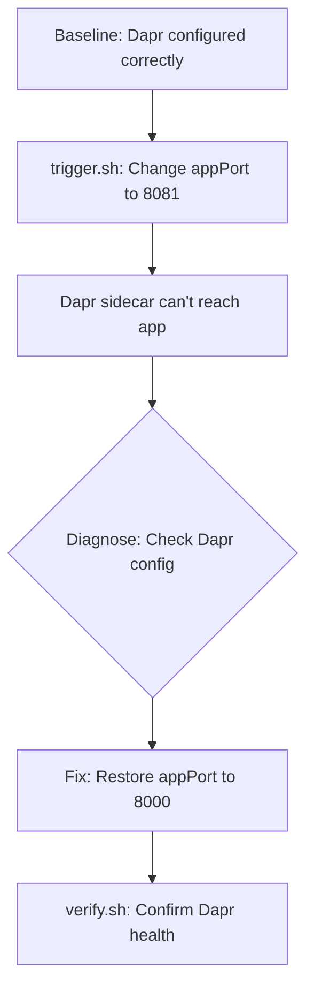
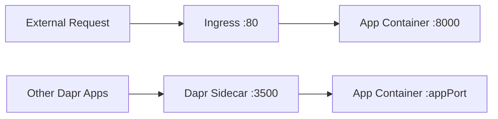

# Dapr Integration Troubleshooting Lab

Diagnose and fix Dapr sidecar port misconfiguration issues in Azure Container Apps.

## Scenario

- **Difficulty**: Intermediate
- **Estimated duration**: 25-35 minutes
- **Failure mode**: Dapr sidecar cannot communicate with the app due to incorrect port configuration

## Prerequisites

- Azure CLI with Container Apps extension
- Basic understanding of Dapr concepts (sidecars, app-id, app-port)

```bash
az extension add --name containerapp --upgrade
az login
```

## Quick Start

```bash
export RG="rg-aca-lab-dapr"
export LOCATION="koreacentral"

az group create --name "$RG" --location "$LOCATION"
az deployment group create --name "lab-dapr" --resource-group "$RG" --template-file ./labs/dapr-integration/infra/main.bicep --parameters baseName="labdapr"

export APP_NAME="$(az deployment group show --resource-group "$RG" --name "lab-dapr" --query "properties.outputs.containerAppName.value" --output tsv)"
export ENVIRONMENT_NAME="$(az deployment group show --resource-group "$RG" --name "lab-dapr" --query "properties.outputs.containerAppsEnvironmentName.value" --output tsv)"

cd labs/dapr-integration
./trigger.sh    # Misconfigure Dapr port
./verify.sh     # Should FAIL - Dapr broken
# Fix the issue, then run verify again
./cleanup.sh
```

## Scenario Setup

This lab starts with a **working** Dapr configuration:

- Container App deployed with Dapr enabled
- Dapr app-port correctly set to 8000 (matching the app's listening port)
- Dapr sidecar injected and running

The trigger script **breaks** Dapr by changing the app-port to 8081, causing communication failure between the Dapr sidecar and the application.



## Key Concepts

### Dapr App Port Configuration

| Setting | Description | Impact if Wrong |
|---|---|---|
| `appPort` | Port the Dapr sidecar uses to call the app | Service invocation fails |
| `appId` | Unique identifier for Dapr service discovery | Other apps can't find this service |
| `appProtocol` | HTTP or gRPC | Protocol mismatch errors |

### How Dapr Sidecar Communicates



If `appPort` doesn't match the app's actual listening port, the Dapr sidecar cannot forward service invocation requests to the app.

## Step-by-Step Walkthrough

### 1. Deploy baseline (Dapr enabled and working)

```bash
export RG="rg-aca-lab-dapr"
export LOCATION="koreacentral"
az group create --name "$RG" --location "$LOCATION"

az deployment group create \
  --name "lab-dapr" \
  --resource-group "$RG" \
  --template-file "./labs/dapr-integration/infra/main.bicep" \
  --parameters baseName="labdapr"

export APP_NAME="$(az deployment group show --resource-group "$RG" --name "lab-dapr" --query "properties.outputs.containerAppName.value" --output tsv)"
export ENVIRONMENT_NAME="$(az deployment group show --resource-group "$RG" --name "lab-dapr" --query "properties.outputs.containerAppsEnvironmentName.value" --output tsv)"
```

### 2. Verify baseline Dapr configuration

```bash
az containerapp show --name "$APP_NAME" --resource-group "$RG" \
  --query "properties.configuration.dapr" --output json
```

Expected output (Dapr enabled with correct port):

```json
{
  "appId": "dapr-labdapr-xxxxxx",
  "appPort": 8000,
  "appProtocol": "http",
  "enabled": true
}
```

### 3. Trigger the failure (misconfigure app port)

```bash
./trigger.sh
```

This changes `appPort` from 8000 to 8081, breaking Dapr-to-app communication.

### 4. Observe the broken state

```bash
# Check Dapr configuration - appPort is now wrong
az containerapp show --name "$APP_NAME" --resource-group "$RG" \
  --query "properties.configuration.dapr" --output json
```

Expected output (wrong port):

```json
{
  "appId": "dapr-labdapr-xxxxxx",
  "appPort": 8081,
  "appProtocol": "http",
  "enabled": true
}
```

### 5. Diagnose: Check Dapr sidecar health

```bash
# The Dapr sidecar will report health issues or connection failures
az containerapp logs show --name "$APP_NAME" --resource-group "$RG" --type system --tail 50
```

Look for errors like: `connection refused`, `port unreachable`, or health probe failures on port 8081.

### 6. Fix: Restore correct app port

```bash
az containerapp update \
  --name "$APP_NAME" \
  --resource-group "$RG" \
  --dapr-app-port 8000
```

### 7. Verify the fix

```bash
./verify.sh
```

Expected output: PASS message indicating Dapr configuration is correct.

## Symptoms / Cause / Fix Matrix

| What you see | What is happening | How to fix |
|---|---|---|
| Service invocation timeouts | `appPort` doesn't match app's listening port | Set correct `--dapr-app-port` |
| Connection refused in Dapr logs | Sidecar trying wrong port | Verify port and update config |
| Health probe failures | Dapr can't reach health endpoint | Align `appPort` with actual app port |
| App works via ingress but not Dapr | Ingress uses `targetPort`, Dapr uses `appPort` | Both ports must match app |

## Debugging Commands

```bash
# Check Dapr configuration
az containerapp show --name "$APP_NAME" --resource-group "$RG" \
  --query "properties.configuration.dapr"

# Check ingress targetPort (should match appPort)
az containerapp show --name "$APP_NAME" --resource-group "$RG" \
  --query "properties.configuration.ingress.targetPort"

# View Dapr sidecar logs
az containerapp logs show --name "$APP_NAME" --resource-group "$RG" --type system --tail 100

# List Dapr components in environment
az containerapp env dapr-component list --name "$ENVIRONMENT_NAME" --resource-group "$RG" --output table
```

## Expected Evidence

### Before Trigger (Baseline)

| Evidence Source | Expected State |
|---|---|
| Dapr config | `appPort: 8000`, `enabled: true` |
| System logs | No Dapr errors |
| verify.sh | PASS |

### During Incident (After Trigger)

| Evidence Source | Expected State |
|---|---|
| Dapr config | `appPort: 8081` (wrong) |
| System logs | Connection refused or timeout errors |
| verify.sh | FAIL |

### After Fix

| Evidence Source | Expected State |
|---|---|
| Dapr config | `appPort: 8000`, `enabled: true` |
| System logs | No errors |
| verify.sh | PASS |

## Clean Up

```bash
az group delete --name "$RG" --yes --no-wait
```

## Related Playbook

- [Dapr Sidecar or Component Failure](../playbooks/platform-features/dapr-sidecar-or-component-failure.md)

## See Also

- [Probe Failure and Slow Start](../playbooks/startup-and-provisioning/probe-failure-and-slow-start.md)

## Sources

- [Dapr integration with Azure Container Apps](https://learn.microsoft.com/azure/container-apps/dapr-overview)
- [Dapr components in Azure Container Apps](https://learn.microsoft.com/azure/container-apps/dapr-components)
