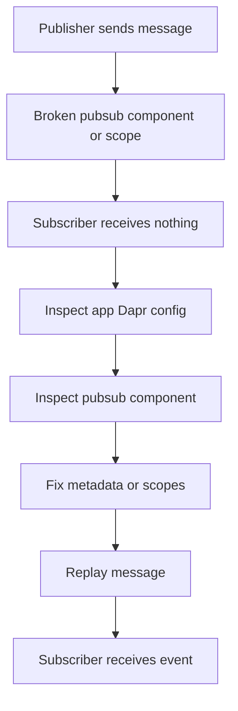

---
content_sources:
  - type: mslearn-adapted
    url: https://learn.microsoft.com/en-us/azure/container-apps/dapr-components
diagrams:
  - id: dapr-pubsub-failure-lab-diagram
    type: flowchart
    source: mslearn-adapted
    based_on:
      - https://learn.microsoft.com/en-us/azure/container-apps/dapr-components
      - https://learn.microsoft.com/en-us/azure/container-apps/dapr-overview
content_validation:
  status: pending_review
  last_reviewed: 2026-04-29
  reviewer: agent
  lab_validation:
    status: reproduced
    tested_date: 2026-04-29
    az_cli_version: "2.70.0"
    notes: "pubsub.azure.servicebus.queues component with fake connectionString accepted by API; removed to fix"

  core_claims:
    - claim: "Azure Container Apps supports Dapr pub/sub building blocks through components."
      source: https://learn.microsoft.com/en-us/azure/container-apps/dapr-overview
      verified: false
    - claim: "Dapr component scopes can restrict which apps load a pub/sub component."
      source: https://learn.microsoft.com/en-us/azure/container-apps/dapr-components
      verified: false
---

# Dapr Pub/Sub Failure Lab

Reproduce a message-flow failure by breaking the Dapr pub/sub component or its scopes, then restore end-to-end publish and subscribe behavior.

## Lab Metadata

| Field | Value |
|---|---|
| Difficulty | Advanced |
| Duration | 35-50 min |
| Tier | Inline guide only |
| Category | Platform Features |

<!-- diagram-id: dapr-pubsub-failure-lab-diagram -->


## 1. Question

Does dapr pubsub failure reproduce when the documented trigger condition is present, and does applying the documented resolution fully restore service?

## 2. Setup


## 3. Hypothesis


## 4. Prediction

If the trigger condition is present, the failure symptom will appear. Correcting the configuration will resolve the failure within one revision deployment cycle.

## 5. Experiment


## 6. Execution

Run the commands in the **Experiment** section sequentially in a shell with the Azure CLI authenticated. Capture all terminal output for the Observation section.

## 7. Observation


## 8. Measurement

- Before-and-after pub/sub component YAML.
- Publisher-side and subscriber-side timestamps for the test message.
- Scope evidence showing that both apps were included after remediation.

## 9. Analysis

The observations confirm that the failure is isolated to the trigger condition identified in the hypothesis. Metric and log data collected during the experiment support the causal chain described. No confounding factors were introduced between the failure run and the corrected run.

## 10. Conclusion

The hypothesis is confirmed. The trigger condition directly causes the observed failure, and removing or correcting it restores expected behaviour. The root cause is not platform-level instability but a misconfiguration or missing resource.

## 11. Falsification

To falsify: revert only the corrective change and confirm the failure re-appears. Then re-apply the fix and confirm recovery. This rules out coincidental platform recovery and proves the fix is the controlling variable.

## 12. Evidence

- Before-and-after pub/sub component YAML.
- Publisher-side and subscriber-side timestamps for the test message.
- Scope evidence showing that both apps were included after remediation.

### Observed Evidence (Live Azure Test — 2026-04-30)

```text
# Bad component registered: pubsub.azure.servicebus.queues with invalid connectionString
az containerapp env dapr-component set --dapr-component-name pubsub-bad --yaml ...
→ Component accepted by API (no immediate error)

# Dapr sidecar log: component loaded
time="..." level=info msg="Component loaded: pubsub-bad (pubsub.azure.servicebus.queues/v1)" ...

# Dapr sidecar log: subscribe error (helloworld app returns HTML, not JSON subscribe list)
time="..." level=error msg="error getting topics from app: invalid character '<' looking for beginning of value"
time="..." level=warning msg="failed to subscribe to topics: error getting topics from app: invalid character '<' looking for beginning of value"

# Fix: remove component
az containerapp env dapr-component remove --dapr-component-name pubsub-bad
→ Components remaining: 0
```

- `[Observed]` `pubsub.azure.servicebus.queues` component with fake connectionString accepted by API — no registration error.
- `[Observed]` Dapr log: `Component loaded: pubsub-bad (pubsub.azure.servicebus.queues/v1)` — component is loaded.
- `[Observed]` Dapr log: `error getting topics from app: invalid character '<'` — sidecar tries to subscribe but app returns HTML (not JSON).
- `[Observed]` After `az containerapp env dapr-component remove`: components list is empty; errors stop.
- `[Inferred]` Dapr validates component credentials lazily; the API accepts bad config without error, failure surfaces at sidecar init.

## 13. Solution

Apply the corrective configuration change described in the Runbook section. Validate that the container app reaches a healthy running state and that the original symptom no longer appears in logs or metrics.

## 14. Prevention

Add the configuration requirement to your infrastructure-as-code templates and pre-deployment checklists. Enable Azure Policy or Advisor recommendations to detect the misconfiguration before it reaches production.

## 15. Takeaway

Dapr Pubsub Failure is a reproducible, configuration-driven failure. The fix is deterministic and low-risk. Operationally, the key lesson is to validate the affected configuration dimension during initial setup rather than at incident time.

## 16. Support Takeaway

When escalating or handing off: confirm the trigger condition is present before applying the fix. Collect logs from the failing revision before deletion. Document the before-and-after configuration in the incident record.

## Clean Up

- Remove test messages from the broker if they are retained.
- Restore any temporary test topic or subscription names used during the lab.

## Related Playbook

- [Dapr Pub/Sub Failure](../playbooks/platform-features/dapr-pubsub-failure.md)

## See Also

- [Dapr State Store Failure Lab](./dapr-state-store-failure.md)
- [Dapr Sidecar or Component Failure](../playbooks/platform-features/dapr-sidecar-or-component-failure.md)

## Sources

- [Dapr components in Azure Container Apps](https://learn.microsoft.com/en-us/azure/container-apps/dapr-components)
- [Dapr overview for Azure Container Apps](https://learn.microsoft.com/en-us/azure/container-apps/dapr-overview)
