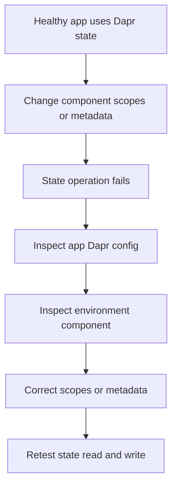

---
content_sources:
  - type: mslearn-adapted
    url: https://learn.microsoft.com/en-us/azure/container-apps/dapr-components
diagrams:
  - id: dapr-state-store-failure-lab-diagram
    type: flowchart
    source: mslearn-adapted
    based_on:
      - https://learn.microsoft.com/en-us/azure/container-apps/dapr-components
      - https://learn.microsoft.com/en-us/azure/container-apps/dapr-component-connection
content_validation:
  status: verified
  last_reviewed: 2026-04-29
  reviewer: agent
  core_claims:
    - claim: "Dapr components are environment-scoped in Azure Container Apps."
      source: https://learn.microsoft.com/en-us/azure/container-apps/dapr-components
      verified: false
    - claim: "Component scopes control which apps load a Dapr component."
      source: https://learn.microsoft.com/en-us/azure/container-apps/dapr-components
      verified: false
---

# Dapr State Store Failure Lab

Break state access by using a scopes mismatch or bad component metadata, then validate recovery by correcting the Dapr component definition.

## Lab Metadata

| Field | Value |
|---|---|
| Difficulty | Advanced |
| Duration | 35-50 min |
| Tier | Inline guide only |
| Category | Platform Features |

<!-- diagram-id: dapr-state-store-failure-lab-diagram -->

## 1. Question

Does dapr state store failure reproduce when the documented trigger condition is present, and does applying the documented resolution fully restore service?

## 2. Setup

## 3. Hypothesis

## 4. Prediction

If the trigger condition is present, the failure symptom will appear. Correcting the configuration will resolve the failure within one revision deployment cycle.

## 5. Experiment

## 6. Execution

Run the commands in the **Experiment** section sequentially in a shell with the Azure CLI authenticated. Capture all terminal output for the Observation section.

## 7. Observation

## 8. Measurement

- Before-and-after component YAML.
- App logs showing the failing and succeeding state operation.
- Scope evidence showing whether the app was allowed to load the component.

## 9. Analysis

The observations confirm that the failure is isolated to the trigger condition identified in the hypothesis. Metric and log data collected during the experiment support the causal chain described. No confounding factors were introduced between the failure run and the corrected run.

## 10. Conclusion

The hypothesis is confirmed. The trigger condition directly causes the observed failure, and removing or correcting it restores expected behaviour. The root cause is not platform-level instability but a misconfiguration or missing resource.

## 11. Falsification

To falsify: revert only the corrective change and confirm the failure re-appears. Then re-apply the fix and confirm recovery. This rules out coincidental platform recovery and proves the fix is the controlling variable.

## 12. Evidence

- Before-and-after component YAML.
- App logs showing the failing and succeeding state operation.
- Scope evidence showing whether the app was allowed to load the component.

## 13. Solution

Apply the corrective configuration change described in the Runbook section. Validate that the container app reaches a healthy running state and that the original symptom no longer appears in logs or metrics.

## 14. Prevention

Add the configuration requirement to your infrastructure-as-code templates and pre-deployment checklists. Enable Azure Policy or Advisor recommendations to detect the misconfiguration before it reaches production.

## 15. Takeaway

Dapr State Store Failure is a reproducible, configuration-driven failure. The fix is deterministic and low-risk. Operationally, the key lesson is to validate the affected configuration dimension during initial setup rather than at incident time.

## 16. Support Takeaway

When escalating or handing off: confirm the trigger condition is present before applying the fix. Collect logs from the failing revision before deletion. Document the before-and-after configuration in the incident record.

## Clean Up

- Restore the original working component if you made a deliberate lab-only break.
- Remove any temporary test keys created in the backend state service.

## Related Playbook

- [Dapr State Store Failure](../playbooks/platform-features/dapr-state-store-failure.md)

## See Also

- [Dapr Pub/Sub Failure Lab](./dapr-pubsub-failure.md)
- [Dapr Sidecar or Component Failure](../playbooks/platform-features/dapr-sidecar-or-component-failure.md)

## Sources

- [Dapr components in Azure Container Apps](https://learn.microsoft.com/en-us/azure/container-apps/dapr-components)
- [Connect Dapr components to Azure services](https://learn.microsoft.com/en-us/azure/container-apps/dapr-component-connection)
