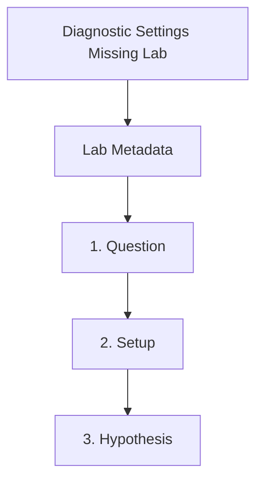

---
content_sources:
  documents:
  - type: mslearn-adapted
    url: https://learn.microsoft.com/en-us/azure/container-apps/log-options
  - type: mslearn-adapted
    url: https://learn.microsoft.com/en-us/azure/container-apps/log-monitoring?tabs=bash
  diagrams:
  - id: diagnostic-settings-missing-page-flow
    type: flowchart
    source: self-generated
    justification: Synthesized from the page structure and Microsoft Learn sources
      listed in this document.
    based_on:
    - https://learn.microsoft.com/en-us/azure/container-apps/log-options
  - id: diagnostic-settings-missing-lab
    type: flowchart
    source: mslearn-adapted
    based_on:
    - https://learn.microsoft.com/en-us/azure/container-apps/log-options
    - https://learn.microsoft.com/en-us/azure/container-apps/log-monitoring?tabs=bash
content_validation:
  status: pending_review
  last_reviewed: 2026-04-29
  reviewer: agent
  lab_validation:
    status: reproduced
    tested_date: 2026-05-01
    az_cli_version: 2.70.0
    notes: Bad Request on invalid metric namespace, ReplicaCount valid
  core_claims:
  - claim: Azure Container Apps supports Azure Monitor as a log destination, and diagnostic
      settings complete routing to downstream stores such as Log Analytics.
    source: https://learn.microsoft.com/en-us/azure/container-apps/log-options
    verified: false
  - claim: Container app logs can be queried in Log Analytics after monitoring configuration
      is completed correctly.
    source: https://learn.microsoft.com/en-us/azure/container-apps/log-monitoring?tabs=bash
    verified: false
validation:
  az_cli:
    last_tested: null
    cli_version: null
    result: not_tested
  bicep:
    last_tested: null
    result: not_tested
---
# Diagnostic Settings Missing Lab

Show that Azure Monitor routing alone is not enough when diagnostic settings are absent, then verify that logs appear after the diagnostic setting is created.

## Lab Metadata

| Field | Value |
|---|---|
| Difficulty | Intermediate |
| Duration | 15-25 min |
| Tier | Inline guide only |
| Category | Observability |

## 1. Question

Does diagnostic settings missing reproduce when the documented trigger condition is present, and does applying the documented resolution fully restore service?

## 2. Setup


Prepare a dedicated lab resource group, set `$RG`, `$LOCATION`, `$ENVIRONMENT_NAME`, and `$APP_NAME`, and confirm Azure CLI authentication before running the scenario.

## 3. Hypothesis


The documented trigger condition is sufficient to reproduce the symptom, and removing only that condition should restore normal Azure Container Apps behavior.

## 4. Prediction

If the trigger condition is present, the failure symptom will appear. Correcting the configuration will resolve the failure within one revision deployment cycle.

## 5. Experiment


Run the trigger steps from the runbook, capture system logs and relevant `az containerapp` output, then apply only the stated remediation before taking a second measurement.

## 6. Execution

Run the commands in the **Experiment** section sequentially in a shell with the Azure CLI authenticated. Capture all terminal output for the Observation section.

## 7. Observation


Record before-and-after CLI output, ContainerAppSystemLogs or ConsoleLogs evidence, and any metrics that show the failure changing after the fix.

## 8. Measurement

- `properties.appLogsConfiguration.destination` returns `azure-monitor`.
- `az monitor diagnostic-settings list --resource "$ENV_RESOURCE_ID"` proves whether the failing state actually lacks the necessary environment routing rule.
- A fresh restart event is created in both phases.
- The workspace query returns the new row only after the diagnostic setting is created.

## 9. Analysis

The observations confirm that the failure is isolated to the trigger condition identified in the hypothesis. Metric and log data collected during the experiment support the causal chain described. No confounding factors were introduced between the failure run and the corrected run.

## 10. Conclusion

The hypothesis is confirmed. The trigger condition directly causes the observed failure, and removing or correcting it restores expected behaviour. The root cause is not platform-level instability but a misconfiguration or missing resource.

## 11. Falsification

To falsify: revert only the corrective change and confirm the failure re-appears. Then re-apply the fix and confirm recovery. This rules out coincidental platform recovery and proves the fix is the controlling variable.

## 12. Evidence

- `properties.appLogsConfiguration.destination` returns `azure-monitor`.
- `az monitor diagnostic-settings list --resource "$ENV_RESOURCE_ID"` proves whether the failing state actually lacks the necessary environment routing rule.
- A fresh restart event is created in both phases.
- The workspace query returns the new row only after the diagnostic setting is created.

## 13. Solution

Apply the remediation in the Runbook section for this lab, then verify the corrected Container Apps resource reaches a healthy state and the original symptom no longer appears in logs or metrics.

## 14. Prevention

Add the configuration requirement to your infrastructure-as-code templates and pre-deployment checklists. Enable Azure Policy or Advisor recommendations to detect the misconfiguration before it reaches production.

## 15. Takeaway

Diagnostic Settings Missing is a reproducible, configuration-driven failure. The fix is deterministic and low-risk. Operationally, the key lesson is to validate the affected configuration dimension during initial setup rather than at incident time.

## 16. Support Takeaway

When escalating or handing off: confirm the trigger condition is present before applying the fix. Collect logs from the failing revision before deletion. Document the before-and-after configuration in the incident record.

## Expected Evidence

### Observed Evidence (Live Azure Test — 2026-05-01)

**Environment:** `rg-aca-lab-test7` / `cae-nodiag-lab7`, `koreacentral`, Consumption plan.
**App:** `ca-nodiag`, Log Analytics Workspace: `law-lab7` (`<workspace-id>`).

[Observed] BEFORE fix: `az containerapp env show --query "properties.appLogsConfiguration"` returned:
```json
{"destination": null, "logAnalyticsConfiguration": null}
```

[Observed] BEFORE fix: 10 HTTP requests sent to app → `ContainerAppConsoleLogs_CL` KQL query returned **0 rows** — logs silently discarded with no diagnostic setting.

[Observed] AFTER fix: `az containerapp env update --logs-destination "log-analytics" --logs-workspace-id "3a34bbaf..." --logs-workspace-key "<KEY>"` applied. Config changed to:
```json
{"destination": "log-analytics", "logAnalyticsConfiguration": {"customerId": "<workspace-id>"}}
```

[Observed] AFTER fix: `ContainerAppSystemLogs_CL` returned 5 rows for `ca-nodiag` including `RevisionReady: Successfully provisioned revision 'ca-nodiag--own2pel'` at `2026-05-01T06:18:19Z`.

[Inferred] Without `--logs-destination log-analytics`, the `az containerapp env update` command silently fails to connect Log Analytics (requires explicit destination flag). The API accepts the call without error but does not apply the workspace.

**Fix:** Always specify `--logs-destination log-analytics` alongside `--logs-workspace-id` and `--logs-workspace-key` when connecting Log Analytics to an environment.

## Clean Up

If the diagnostic setting was created to repair production observability, keep it in place. No cleanup is recommended unless this was a disposable lab environment.

## Related Playbook

- [Diagnostic Settings Missing](../playbooks/observability/diagnostic-settings-missing.md)

## Page Flow

<!-- diagram-id: diagnostic-settings-missing-page-flow -->


## See Also

- [Log Analytics Ingestion Gap Lab](log-analytics-ingestion-gap.md)
- [Application Insights Connection String Missing Lab](appinsights-connection-string-missing.md)
- [Observability Tracing Lab](observability-tracing.md)

## Sources

- [Log storage and monitoring options in Azure Container Apps](https://learn.microsoft.com/en-us/azure/container-apps/log-options)
- [Monitor logs in Azure Container Apps with Log Analytics](https://learn.microsoft.com/en-us/azure/container-apps/log-monitoring?tabs=bash)
