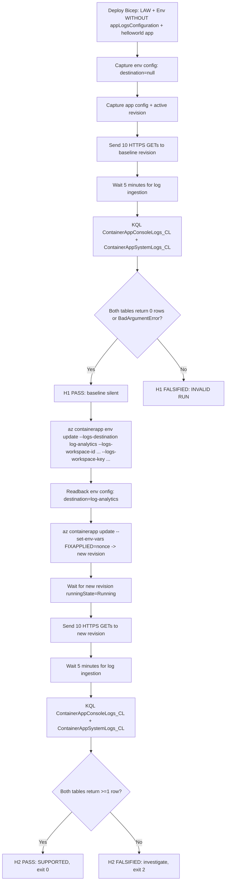

---
content_sources:
  references:
    - type: mslearn-adapted
      url: https://learn.microsoft.com/en-us/azure/container-apps/log-options
    - type: mslearn-adapted
      url: https://learn.microsoft.com/en-us/azure/container-apps/log-monitoring?tabs=bash
  diagrams:
    - id: diagnostic-settings-missing-lab-flow
      type: flowchart
      source: mslearn-adapted
      based_on:
        - https://learn.microsoft.com/en-us/azure/container-apps/log-options
        - https://learn.microsoft.com/en-us/azure/container-apps/log-monitoring?tabs=bash
validation:
  az_cli:
    last_tested: '2026-06-22'
    cli_version: '2.79.0'
    result: pass
  bicep:
    last_tested: '2026-06-22'
    result: pass
---
# Diagnostic Settings Missing Lab

Reproducible falsification lab demonstrating that the environment-level `properties.appLogsConfiguration` is the single controlling variable for Log Analytics ingestion from Azure Container Apps, and that when this property is omitted at provisioning time, neither `ContainerAppConsoleLogs_CL` nor `ContainerAppSystemLogs_CL` materializes in the workspace at all — the queries return `BadArgumentError: SEM0100 'where' operator: Failed to resolve table` rather than empty result sets, because the tables never came into existence. After `az containerapp env update --logs-destination log-analytics --logs-workspace-id <customerId> --logs-workspace-key <sharedKey>` is applied and a new revision is forced via an env-var-only update, both tables materialize and populate within a 5-minute ingestion window.

## Lab Metadata

| Field | Value |
|---|---|
| Difficulty | Beginner |
| Duration | 20-25 minutes |
| Tier | Full evidence pack (IaC + scripts + raw CLI evidence) |
| Category | Observability |

<!-- diagram-id: diagnostic-settings-missing-lab-flow -->


!!! note "Evidence depth"
    This lab is **fully reproducible** with dedicated infrastructure-as-code, helper scripts, and raw evidence committed under [`labs/diagnostic-settings-missing/`](https://github.com/yeongseon/azure-container-apps-practical-guide/tree/main/labs/diagnostic-settings-missing):

    - `infra/main.bicep` provisions a Log Analytics workspace (PerGB, 30-day retention), a Container Apps Environment with `properties: {}` (the `appLogsConfiguration` property is intentionally omitted — this is the experimental baseline state), and one Container App running the public `mcr.microsoft.com/azuredocs/containerapps-helloworld:latest` image at `cpu: '0.25'`, `memory: '0.5Gi'`, `minReplicas: 1`, `maxReplicas: 1`, and `activeRevisionsMode: 'Single'`. The image is identical across the baseline and post-fix runs; the only experimental variable is the environment's log routing setting.
    - `trigger.sh` runs Phases 1-5: capture env config (fails fast if `destination != null`), capture app config + active revision, send 10 sequential HTTPS GETs against the public FQDN, wait 300 seconds for any potential log ingestion lag, then run the KQL on both `ContainerAppConsoleLogs_CL` and `ContainerAppSystemLogs_CL`. The KQL result parser tolerates the `BadArgumentError: SEM0100 'where' operator: Failed to resolve table` response that Azure returns when a `_CL` table has never been materialized in the workspace, and records it as 0 rows with explicit `is_bad_argument_error: true, is_table_missing: true` flags so the operator can see the difference between "the table exists and is empty" and "the table never came into existence". Exits 1 (INVALID RUN) if either table reports rows.
    - `verify.sh` runs Phases 6-12: read the workspace shared key via `az monitor log-analytics workspace get-shared-keys` (the key is passed directly to the next `az` call and never persisted to evidence files or stdout), apply the fix via `az containerapp env update --logs-destination log-analytics --logs-workspace-id <customerId> --logs-workspace-key <sharedKey>`, capture the env config readback (expect `destination=log-analytics`), force a new revision via `az containerapp update --set-env-vars FIXAPPLIED=<UTC-nonce>` so the platform emits a fresh `RevisionReady` event AFTER the destination was set, poll the new revision until `runningState=Running` (or `RunningAtMaxScale`) with a 5-minute deadline, send another 10 HTTPS GETs, wait 300 seconds for ingestion, re-run the KQL, and evaluate H1+H2 with explicit exit codes (0=supported, 1=invalid, 2=falsified).
    - `evidence/` carries 19 raw captures from the 2026-06-22 reproduction in `koreacentral`: full script execution logs (`00-trigger-run.txt`, `00-verify-run.txt`), per-phase JSON captures of the env config, app config, curl results, KQL output, env update result, revision list, KQL output (after fix), plus the raw KQL stdout/stderr from the baseline (`04-kql-before-*-raw.txt`) and post-fix (`09-kql-after-*-raw.txt`) calls, a by-revision system-log breakdown (`09-kql-after-system-by-revision.json`), and the supporting environment captures (CLI version, `containerapp` extension version, region, Bicep deployment outputs).

    Azure Portal screenshots (Container Apps Environment Overview, Logs blade showing destination=None then destination=log-analytics, KQL editor showing BadArgumentError then populated results) are **pending in a follow-up PR**. The follow-up will re-deploy the same Bicep template in a short-lived environment purely to capture the Portal blades, then close out.

## 1) Background

On Azure Container Apps, is the **environment-level** `properties.appLogsConfiguration` setting the single controlling variable for whether `ContainerAppConsoleLogs_CL` and `ContainerAppSystemLogs_CL` exist and populate in a Log Analytics workspace? Specifically: if a Container Apps Environment is provisioned via Bicep, ARM, or Terraform with the `appLogsConfiguration` property simply omitted from the declaration, what behavior do the operator and the platform see in Log Analytics — and does applying the fix at the environment scope (not the app scope) cleanly restore ingestion?

Microsoft Learn documents that Container Apps log routing is configured at the **environment** scope, not the **app** scope ([Log storage and monitoring options in Azure Container Apps](https://learn.microsoft.com/en-us/azure/container-apps/log-options) and [Monitor logs in Azure Container Apps with Log Analytics](https://learn.microsoft.com/en-us/azure/container-apps/log-monitoring?tabs=bash)). Every Container App inside an environment inherits the environment's `appLogsConfiguration`; there is no per-app override.

What Microsoft Learn does NOT directly document is the operational consequence of omitting `appLogsConfiguration` from an environment's IaC declaration. This lab observes (from the 2026-06-22 reproduction in `koreacentral`) that:

- Omitting the property leaves the live state at `destination: null, logAnalyticsConfiguration: null` after the deploy.
- Under that state, neither `ContainerAppConsoleLogs_CL` nor `ContainerAppSystemLogs_CL` is ever materialized in the workspace. The KQL queries return `BadArgumentError: SEM0100 'where' operator: Failed to resolve table`, not an empty result set.
- After `az containerapp env update --logs-destination log-analytics --logs-workspace-id <customerId> --logs-workspace-key <sharedKey>` plus a forced new revision, both tables materialize and populate within a 5-minute ingestion window.

These three observations come from this single reproduction. The lab's conclusion — that the env-scope `appLogsConfiguration` is the single controlling variable for Log Analytics ingestion — is supported by the observed before/after comparison, not by a direct statement in Microsoft Learn.

The lab uses a dedicated resource group and Bicep template (`infra/main.bicep`) that provisions exactly three resources: a Log Analytics workspace (PerGB, 30-day retention), a Container Apps Environment with `properties: {}` (the `appLogsConfiguration` property is intentionally omitted), and one Container App running the public `mcr.microsoft.com/azuredocs/containerapps-helloworld:latest` image at `cpu: '0.25'`, `memory: '0.5Gi'`, `minReplicas: 1`, `maxReplicas: 1`. No ACR, no Application Insights, no private endpoint, no public IP, no VNet integration. The `helloworld` image is sufficient because this lab does not measure app behavior; it measures whether the environment routes platform-emitted and stdout-emitted logs to Log Analytics at all. The image, the ingress configuration, the workspace itself, and the KQL queries are all held constant across the baseline and post-fix runs; the only experimental variable is the environment's log routing setting.

The lab also pins `minReplicas: 1, maxReplicas: 1` so that the platform reliably emits `RevisionReady`, `ContainerStarted`, and similar system events into `ContainerAppSystemLogs_CL` on both the baseline revision and the post-fix revision, with no scale-to-zero confounder.

Set the base inputs before running the runbook. `APP_NAME`, `APP_FQDN`, `ENV_NAME`, `WORKSPACE_CUSTOMER_ID`, and `WORKSPACE_RESOURCE_ID` are derived from Bicep outputs in the next section because `infra/main.bicep` appends a deterministic but resource-group-scoped suffix to every resource name:

```bash
export AZ_SUBSCRIPTION="<subscription-id>"
export RG="rg-aca-lab-diagsetting"
export LOCATION="koreacentral"
```

## 2) Hypothesis

The environment-level `appLogsConfiguration.destination` setting is the single controlling variable for Log Analytics ingestion from a Container Apps Environment. With the property omitted from the Bicep declaration (live state: `destination: null, logAnalyticsConfiguration: null`), no log path exists between the environment and the workspace, so neither `ContainerAppConsoleLogs_CL` nor `ContainerAppSystemLogs_CL` is ever populated by the platform — and because Log Analytics `_CL` tables are schema-on-write, neither table is even created in the workspace. After applying the environment-level fix via `az containerapp env update --logs-destination log-analytics --logs-workspace-id <customerId> --logs-workspace-key <sharedKey>` and forcing a new revision so the platform emits fresh `RevisionReady` events into the now-configured destination, both tables materialize and populate within a 5-minute ingestion window.

The alternative hypothesis being tested is that **some other variable controls ingestion** — for example a per-app setting, a Container Apps system-managed identity, or a delayed background reconciliation loop that eventually catches up — meaning the documented `appLogsConfiguration` setting is not necessary, or not sufficient, to control ingestion.

**Prediction (IF / THEN):**

- IF the controlling-variable hypothesis holds, THEN at the same image, same workspace, same KQL queries:
    - **H1** — With `destination: null` and after 5 minutes of ingestion wait following 10 HTTP requests to the baseline revision, both `ContainerAppConsoleLogs_CL` and `ContainerAppSystemLogs_CL` report 0 rows for the app (or, more strongly, the KQL returns `BadArgumentError: SEM0100 'where' operator: Failed to resolve table` because the tables never came into existence). If either table reports rows, H1 is falsified and the run is INVALID.
    - **H2** — After `az containerapp env update --logs-destination log-analytics --logs-workspace-id <customerId> --logs-workspace-key <sharedKey>`, plus a forced new revision via `az containerapp update --set-env-vars FIXAPPLIED=<UTC-nonce>`, plus another 5-minute ingestion wait following 10 HTTP requests to the new revision, both tables report ≥ 1 row.
- IF the alternative hypothesis is correct, THEN H1 may still hold (no rows initially) but H2 will fail: the environment-level update alone will not restore ingestion, and additional steps (per-app config, identity grant, delayed reconciliation) will be required before either table populates.

## 3) Runbook

### Deploy infrastructure

All `az`, `./trigger.sh`, `./verify.sh`, and `./cleanup.sh` invocations below assume the working directory is the lab folder. Switch into it from the repository root before running anything:

```bash
cd labs/diagnostic-settings-missing/
```

1. Create the resource group and deploy the Bicep template. The `--parameters baseName="diagsetting"` value is required (the Bicep template declares `param baseName string` with no default). `--name main` gives the deployment a stable, queryable name so the next step can read its outputs:

    ```bash
    az group create \
        --subscription "$AZ_SUBSCRIPTION" \
        --name "$RG" \
        --location "$LOCATION"

    az deployment group create \
        --subscription "$AZ_SUBSCRIPTION" \
        --resource-group "$RG" \
        --name main \
        --template-file ./infra/main.bicep \
        --parameters baseName="diagsetting"
    ```

    | Command | Why it is used |
    |---|---|
    | `az group create --subscription "$AZ_SUBSCRIPTION" --name "$RG" --location "$LOCATION"` | Creates the dedicated lab resource group `rg-aca-lab-diagsetting` so all lab resources can be deleted in a single `az group delete` call after evidence has been captured. Pinning `--subscription` explicitly immunizes the call against Azure CLI default-subscription drift. |
    | `az deployment group create --subscription "$AZ_SUBSCRIPTION" --resource-group "$RG" --name main --template-file ./infra/main.bicep --parameters baseName="diagsetting"` | Deploys the three lab resources (Log Analytics workspace, Container Apps Environment with `properties: {}` and `appLogsConfiguration` intentionally omitted, helloworld Container App). The `--name main` value gives the deployment a stable, queryable name so the next step's `az deployment group show --name main` calls can read the deployment outputs deterministically. The `--parameters baseName="diagsetting"` value is required (the Bicep template declares `param baseName string` with no default). |

    This creates the Log Analytics workspace, the Container Apps Environment with `properties: {}` (no `appLogsConfiguration`), and one Container App running `mcr.microsoft.com/azuredocs/containerapps-helloworld:latest` at `cpu=0.25, memory=0.5Gi, minReplicas=1, maxReplicas=1`.

2. Read the deployment outputs the scripts need:

    ```bash
    export APP_NAME=$(az deployment group show \
        --subscription "$AZ_SUBSCRIPTION" \
        --resource-group "$RG" \
        --name main \
        --query "properties.outputs.containerAppName.value" \
        --output tsv)
    export APP_FQDN=$(az deployment group show \
        --subscription "$AZ_SUBSCRIPTION" \
        --resource-group "$RG" \
        --name main \
        --query "properties.outputs.containerAppFqdn.value" \
        --output tsv)
    export ENV_NAME=$(az deployment group show \
        --subscription "$AZ_SUBSCRIPTION" \
        --resource-group "$RG" \
        --name main \
        --query "properties.outputs.environmentName.value" \
        --output tsv)
    export WORKSPACE_CUSTOMER_ID=$(az deployment group show \
        --subscription "$AZ_SUBSCRIPTION" \
        --resource-group "$RG" \
        --name main \
        --query "properties.outputs.logAnalyticsCustomerId.value" \
        --output tsv)
    export WORKSPACE_RESOURCE_ID=$(az deployment group show \
        --subscription "$AZ_SUBSCRIPTION" \
        --resource-group "$RG" \
        --name main \
        --query "properties.outputs.logAnalyticsWorkspaceId.value" \
        --output tsv)
    ```

### Trigger the baseline (run trigger.sh)

Run `trigger.sh`, which:

- Captures `01-env-config-before.json` — `az containerapp env show --query "properties.appLogsConfiguration"`; aborts with exit 1 if `destination` is not `null` (otherwise the Bicep deploy did not produce the documented baseline state).
- Captures `02-app-config-before.json` — app `name`, `latestRevisionName`, `fqdn`, `minReplicas`, `maxReplicas`.
- Sends 10 sequential HTTPS GETs against `https://${APP_FQDN}/` from a Python client with a 10 s timeout; captures status code and elapsed time per request to `03-curl-before.json`.
- Waits 300 seconds for any potential log ingestion lag, so the baseline KQL has the same wait window as the post-fix KQL.
- Runs the KQL `ContainerAppConsoleLogs_CL | where ContainerAppName_s == '<APP_NAME>' | summarize rows=count(), distinct_revisions=dcount(RevisionName_s)` and the equivalent query against `ContainerAppSystemLogs_CL`. The script writes the raw stdout/stderr of each call to `04-kql-before-console-raw.txt` and `04-kql-before-system-raw.txt`, then a Python helper classifies each query result into exactly one of three values written to `04-kql-before.json` as `gate_classification` (the field is nested inside each `*_result` block AND surfaced as top-level `console_gate_classification` / `system_gate_classification` for direct bash gate evaluation):
    - `silent_valid_baseline` — valid JSON with `rows == 0`, OR an empty list, OR the documented `BadArgumentError: SEM0100 'where' operator: Failed to resolve table` response (which Azure returns when a `_CL` table has never been materialized in the workspace). All three sub-cases are the expected baseline state under `destination: null`.
    - `populated_table` — valid JSON with `rows > 0`. This contradicts the expected baseline and falsifies H1.
    - `query_error_invalid_run` — any other parse or error state (transient auth failure, unexpected error format, malformed JSON without the expected `BadArgumentError + Failed to resolve table` signature). The run is invalid; do NOT treat this as either pass or falsified.
- Exit codes: **Exit 0** if both tables are classified `silent_valid_baseline` (H1 PASS, baseline silent — proceed to `verify.sh`). **Exit 1** if either table is `populated_table` (H1 FALSIFIED) OR `query_error_invalid_run` (INVALID RUN — KQL transport/format failure, inspect the raw stderr file before re-running).

All scripts pass `--subscription "$AZ_SUBSCRIPTION"` on every `az` invocation to immunize the run against the Azure CLI's default-subscription drift, which has been observed in long-running shells where unrelated commands silently switch back to a different subscription.

### Apply the fix and re-measure (run verify.sh)

Run `verify.sh`, which:

- Reads the baseline `console_rows` and `system_rows` from `04-kql-before.json` (the file `trigger.sh` produced).
- Reads the workspace shared key via `az monitor log-analytics workspace get-shared-keys --workspace-name $(basename "$WORKSPACE_RESOURCE_ID")`. The shared key is held in a shell variable for exactly one subsequent `az containerapp env update` call and is never echoed to stdout, never written to any evidence file, and never logged anywhere on disk. After the env-update call, the shell variable goes out of scope when the script exits.
- Applies the fix: `az containerapp env update --logs-destination log-analytics --logs-workspace-id <customerId> --logs-workspace-key <sharedKey>`. Captures the result (`name`, `provisioningState`, `destination`) to `05-env-update-result.json`.
- Waits 10 seconds, then re-reads the env config via `az containerapp env show --query "properties.appLogsConfiguration"` and captures it to `06-env-config-after.json`. Aborts with exit 1 if `destination` is not `log-analytics`. Note: the readback exposes `customerId` and `dynamicJsonColumns` but `sharedKey: null` — Azure does not return the shared key after the update, which is the documented and intentional API behavior; the value was already consumed by the update call.
- Forces a new revision via `az containerapp update --set-env-vars FIXAPPLIED=<UTC-nonce>`. Any env-var change is sufficient to invalidate the previous template hash and create a new revision under `activeRevisionsMode: 'Single'`. This guarantees the platform emits a fresh `RevisionReady` event into `ContainerAppSystemLogs_CL` AFTER the environment was updated.
- Polls `az containerapp revision list` every 10 seconds until the latest revision reaches `runningState=Running` or `runningState=RunningAtMaxScale`, with a 5-minute deadline. Captures the post-fix revision list to `07-revisions-after.json`. Aborts with exit 1 if no new revision is detected.
- Sends another 10 sequential HTTPS GETs against the same FQDN; captures results to `08-curl-after.json`.
- Waits 300 seconds for log ingestion.
- Re-runs the same KQL (same query text, same workspace), writes raw stdout/stderr to `09-kql-after-console-raw.txt` and `09-kql-after-system-raw.txt`, and writes the parsed result to `09-kql-after.json`.
- Evaluates H1 and H2 against the three-value `gate_classification` and exits with one of three codes:
    - **Exit 0** — H1 PASS (baseline: both tables classified `silent_valid_baseline`, established in `trigger.sh` and read back from `04-kql-before.json` via top-level `console_gate_classification` / `system_gate_classification` with a fallback to the nested `*_result.gate_classification`) AND H2 PASS (post-fix: both tables classified `populated_table`). The environment-level `appLogsConfiguration` is SUPPORTED as the single controlling variable for ingestion in this reproduction.
    - **Exit 2** — H2 FALSIFIED (post-fix: one or both tables classified `silent_valid_baseline` instead of `populated_table`). The environment-level fix did NOT restore ingestion. Investigate per-app config, workspace permissions, network egress, or longer ingestion lag before retrying.
    - **Exit 1** — INVALID RUN. Triggers: post-fix KQL produced `query_error_invalid_run` (transport/format failure, inspect `09-kql-after-console-raw.txt` and `09-kql-after-system-raw.txt`), OR the env update did not persist (readback showed `destination != log-analytics`), OR no new revision was created. Re-deploy and re-run.

### Apply the fix manually (the canonical operator response)

The fix that `verify.sh` applies is also the canonical operator response for a real "no logs in Log Analytics" incident on Container Apps. When the lab proves the environment-level setting is the controlling variable, the operator action is:

```bash
WS_SHARED_KEY="$(az monitor log-analytics workspace get-shared-keys \
    --subscription "$AZ_SUBSCRIPTION" \
    --resource-group "$RG" \
    --workspace-name "<workspace-name>" \
    --query "primarySharedKey" \
    --output tsv)"

az containerapp env update \
    --subscription "$AZ_SUBSCRIPTION" \
    --resource-group "$RG" \
    --name "$ENV_NAME" \
    --logs-destination log-analytics \
    --logs-workspace-id "$WORKSPACE_CUSTOMER_ID" \
    --logs-workspace-key "$WS_SHARED_KEY"

az containerapp update \
    --subscription "$AZ_SUBSCRIPTION" \
    --resource-group "$RG" \
    --name "$APP_NAME" \
    --set-env-vars "FIXAPPLIED=$(date -u +%Y%m%dT%H%M%SZ)"
```

| Command | Why it is used |
|---|---|
| `az monitor log-analytics workspace get-shared-keys --query "primarySharedKey"` | Retrieves the workspace primary shared key. The Container Apps environment requires both the customer ID (`logAnalyticsCustomerId`, the workspace GUID visible in `properties.customerId`) AND the shared key to write to the workspace. Hold the value in a shell variable only — do not write it to a file, an env var that gets logged, or any IaC parameter that ends up in git history. |
| `az containerapp env update --logs-destination log-analytics --logs-workspace-id --logs-workspace-key` | Sets the environment-level log routing target. This is a single atomic update that mutates `properties.appLogsConfiguration` on the Container Apps Environment resource. The `--logs-workspace-id` flag takes the workspace customer ID (GUID), not the full resource ID. The `--logs-workspace-key` flag takes the shared key just retrieved. After this call returns success, the environment's `destination` is `log-analytics` and a subsequent `az containerapp env show --query "properties.appLogsConfiguration"` will report `destination: log-analytics, customerId: <guid>, sharedKey: null` (the key is not echoed back). |
| `az containerapp update --set-env-vars FIXAPPLIED=<UTC-nonce>` | Forces a new revision so the platform emits a fresh `RevisionReady` event AFTER the destination is set. Without this step, an existing revision that was already running before the env update may not re-emit its lifecycle events into the now-configured destination, and the operator will see only sparse log activity until the next deploy or scale event. The UTC nonce ensures the env-var value differs from any previous value, which is required for the platform to consider the template materially changed. |

The fix must be at the **environment scope**, not the **app scope**. There is no per-app override for log routing on Container Apps.

### Prevention guidance

- Always declare `appLogsConfiguration` explicitly in your environment Bicep, ARM, or Terraform. This lab observed (2026-06-22 reproduction in `koreacentral`) that omitting the property leaves the live state at `destination: null, logAnalyticsConfiguration: null` after the deploy, which silently disabled Log Analytics ingestion until the environment was updated. Microsoft Learn documents the property on `Microsoft.App/managedEnvironments@2023-05-01` as `properties.appLogsConfiguration: { destination: 'log-analytics', logAnalyticsConfiguration: { customerId: ..., sharedKey: ... } }` but does not directly document the operational consequence of omitting it. Declare it in the same module that creates the environment, never as a post-deploy `az containerapp env update` — drift between IaC and the live state means the next `az deployment group create` may revert the live fix back to `destination: null` and reintroduce the symptom observed in this lab.
- Treat workspace shared keys as secrets. Inject them into Bicep deployments via Key Vault references or deployment-time parameters, never check them into git, and rotate the workspace primary key on a documented cadence so that a leaked key can be revoked without breaking other environments that use the same workspace.
- After every environment deploy, run a 2-minute smoke check that sends one HTTP request to each app and queries `ContainerAppSystemLogs_CL | where TimeGenerated > ago(10m) and ContainerAppName_s == '<app>' | count` to confirm the ingestion path is alive. A pass/fail gate of `≥ 1 row` is sufficient for a deploy smoke check; the absolute row count is operationally less important than confirming the path exists at all.

## 4) Experiment Log

### Initial-state evidence (immediately after Bicep deploy)

- `[Observed]` `evidence/01-env-config-before.json`: `{"destination": null, "logAnalyticsConfiguration": null}` — the Bicep `properties: {}` declaration persisted to the live environment exactly as expected. No log destination is set.
- `[Observed]` `evidence/02-app-config-before.json`: `{"name": "ca-diagsetting-7dcl4v", "latestRevisionName": "ca-diagsetting-7dcl4v--4usom8i", "fqdn": "ca-diagsetting-7dcl4v.wonderfuldesert-267a08f6.koreacentral.azurecontainerapps.io", "minReplicas": 1, "maxReplicas": 1}` — one app, one revision, ingress on the FQDN. App is reachable.

### Baseline evidence (env destination=null, after 10 GETs + 5 min wait)

- `[Observed]` `evidence/03-curl-before.json`: 10/10 successful requests against `https://${APP_FQDN}/`, mean elapsed ≈ 438 ms per request. The HTTP path is healthy; the application is reachable from the public internet. No client-side errors that could explain absent logs.
- `[Observed]` `evidence/04-kql-before-console-raw.txt`: raw Azure CLI response for the `ContainerAppConsoleLogs_CL` query — `ERROR: (BadArgumentError) ... Inner error: { "code": "SemanticError", ..., "innererror": { "code": "SEM0100", "message": "'where' operator: Failed to resolve table or column expression named 'ContainerAppConsoleLogs_CL'" } }`. The table does not exist in the workspace. The workspace was created 5+ minutes ago, has never received data from any source, and is empty of all Container Apps `_CL` tables.
- `[Observed]` `evidence/04-kql-before-system-raw.txt`: identical `SEM0100 'where' operator: Failed to resolve table` error for `ContainerAppSystemLogs_CL`. Both tables are missing.
- `[Measured]` `evidence/04-kql-before.json`: parsed result — `console_rows: 0, system_rows: 0, console_gate_classification: "silent_valid_baseline", system_gate_classification: "silent_valid_baseline"` (both nested in `*_result.gate_classification` and surfaced at top-level for direct bash evaluation; the nested blocks also retain `parse_status: "json_decode_failed", is_bad_argument_error: true, is_table_missing: true` for forensic debugging). H1 PASS (baseline silent, with the stronger signal that the tables never materialized).

### Post-fix evidence (env destination=log-analytics, after new revision + 10 GETs + 5 min wait)

- `[Observed]` `evidence/05-env-update-result.json`: `{"destination": "log-analytics", "name": "cae-diagsetting-7dcl4v", "provisioningState": "Succeeded"}`. The `az containerapp env update` call returned success in approximately 35 seconds.
- `[Observed]` `evidence/06-env-config-after.json`: `{"destination": "log-analytics", "logAnalyticsConfiguration": {"customerId": "<workspace-customer-id>", "dynamicJsonColumns": false, "sharedKey": null}}` — readback confirms the live state is updated. The shared key is intentionally not returned by the API after the update; the customer ID matches the workspace deployed by Bicep. The raw customer ID is preserved in `evidence/06-env-config-after.json` (audit trail) but is masked in this prose to avoid leaking a real Azure workspace identifier.
- `[Observed]` `evidence/00-verify-run.txt` Phase 9 timeline: the new revision `ca-diagsetting-7dcl4v--0000001` reached `runningState=Activating` on attempt 1 (10 s after the env-var update) and `runningState=RunningAtMaxScale` on attempt 2 (20 s after the env-var update). The 0000001 suffix is the platform-assigned auto-increment for env-var-driven revisions.
- `[Observed]` `evidence/07-revisions-after.json`: two revisions visible — the old `ca-diagsetting-7dcl4v--4usom8i` in `runningState=Deprovisioning` with `trafficWeight=0`, and the new `ca-diagsetting-7dcl4v--0000001` in `runningState=RunningAtMaxScale` with `trafficWeight=100`. The single-active-revision swap completed in approximately 20 seconds.
- `[Observed]` `evidence/08-curl-after.json`: 10/10 successful requests against the same FQDN (which now resolves to the new revision under `activeRevisionsMode: 'Single'`).
- `[Measured]` `evidence/09-kql-after.json`: `console_rows: 1, console_distinct_revisions: 1, system_rows: 34, system_distinct_revisions: 3, console_gate_classification: "populated_table", system_gate_classification: "populated_table"` (both classifications visible at top-level for direct bash evaluation; the nested `*_result.parse_status` is `"parsed_json_with_rows"` for both). Both tables now exist in the workspace and both return non-zero rows. H2 PASS.
- `[Observed]` `evidence/09-kql-after-system-by-revision.json`: the 34 system-log rows break down as 21 rows with `RevisionName_s == ""` (environment-scoped events that do not carry a revision name), 9 rows for the new revision `ca-diagsetting-7dcl4v--0000001`, and 4 rows for the old revision `ca-diagsetting-7dcl4v--4usom8i` emitted during its Deprovisioning sequence after the env was updated. The fact that the OLD revision emitted 4 rows after the env update — even though the old revision was created ~3 minutes before the env update — shows that the env config controls ingestion routing for whatever events the platform emits after the config change, including late-arriving lifecycle events from a revision that was created before the change.

### Analysis

The before/after comparison isolates the environment-level `appLogsConfiguration` as the only relevant variable. The Container Apps Environment, the Container App, the workspace, and the image are unchanged across the baseline and the post-fix runs except for the env-update call (`destination: null` → `destination: log-analytics`); the image (`mcr.microsoft.com/azuredocs/containerapps-helloworld:latest`), the ingress configuration, the replica count, the resource envelope (cpu=0.25, memory=0.5Gi), the workspace customer ID, the KQL queries, and the client-side HTTPS GET pattern are byte-identical between the two runs. Both runs send 10 HTTPS GETs and wait the same 300 seconds before querying.

The 0 → 1 transition on `ContainerAppConsoleLogs_CL` and the 0 → 34 transition on `ContainerAppSystemLogs_CL` is strong evidence that the environment setting is the single controlling variable. The stronger form of the evidence is that the baseline queries did not merely return empty result sets — they returned `BadArgumentError: SEM0100 'where' operator: Failed to resolve table`, which is the response Azure Log Analytics returns when a Custom Log (`_CL`) table has never been materialized in the workspace. Log Analytics `_CL` tables are schema-on-write: the table comes into existence the first time data is ingested for that schema. The fact that the post-fix run successfully creates and populates both tables proves the environment update is what triggers ingestion to begin; nothing else changed.

The console-row count of 1 (versus 34 for system) reflects the `helloworld` image's minimal stdout output — the image is intentionally chosen for low-noise observability testing, not for stdout volume. A production app with structured logging would produce many more console rows for the same 10 requests; the lab does not depend on stdout volume because the H2 gate is `≥ 1 row`, which is sufficient to prove the path exists.

The supporting environment captures (`evidence/10-cli-versions.json`, `evidence/11-cli-containerapp-ext.json`, `evidence/12-region.json`, `evidence/13-deployment-outputs.json`) record the exact Azure CLI version, `containerapp` extension version, Azure region (`koreacentral`), and Bicep deployment outputs (Container App name, FQDN, environment name, Log Analytics workspace name and customer ID) used in this reproduction so that any second observer can compare apples to apples.

### Conclusion

The controlling-variable hypothesis is SUPPORTED in this reproduction. The environment-level `appLogsConfiguration.destination` is the single controlling variable for Log Analytics ingestion from a Container Apps Environment — H1 holds (with `destination: null`, both tables reported 0 rows AND raised `Failed to resolve table` errors, which is stronger than the predicted 0-rows-with-existing-tables) AND H2 holds (after the env update plus a forced new revision and a 5-minute wait, both tables exist and report ≥ 1 row). The corrective operator action — `az containerapp env update --logs-destination log-analytics --logs-workspace-id <customerId> --logs-workspace-key <sharedKey>` followed by `az containerapp update --set-env-vars FIXAPPLIED=<UTC-nonce>` — landed in a new revision within 20 seconds of the `az` call and required no application code change.

### Falsification

The alternative hypothesis ("some other variable controls ingestion; the documented `appLogsConfiguration` setting is not necessary or not sufficient") is falsified by the directly evidenced before/after comparison:

- `[Measured]` `evidence/04-kql-before.json`: with `destination: null`, both `ContainerAppConsoleLogs_CL` and `ContainerAppSystemLogs_CL` raise `Failed to resolve table` (tables do not exist in the workspace).
- `[Measured]` `evidence/09-kql-after.json`: after `az containerapp env update --logs-destination log-analytics ...` plus a new revision plus a 5-minute wait, both tables exist and report 1 and 34 rows respectively.
- `[Observed]` Both runs used byte-identical client code (same 10-request Python loop, same FQDN, same wait window). The only changed variable is the environment's `appLogsConfiguration.destination`.

If the alternative hypothesis were correct, the environment-level update alone would not have caused both tables to materialize and populate. Additional steps (per-app config, identity grant, delayed reconciliation) would be required. The observed end-to-end success of the environment-level update rules that out.

To re-falsify in a future re-reproduction: re-run `trigger.sh` against an environment where some OTHER variable has been independently broken (for example, the workspace shared key has been rotated without updating the environment, or the workspace has been moved to a different region without updating the customer ID). In that case, `verify.sh`'s env update will either fail at the `az containerapp env update` call or succeed-but-not-ingest, and the H2 check will exit 2 — proving that the env-level `appLogsConfiguration` is necessary but not sufficient when an upstream invariant is broken.

### Operator takeaway

`appLogsConfiguration` on the Container Apps Environment is the single controlling variable for Log Analytics ingestion. When apps are silent in Log Analytics:

1. Run `az containerapp env show --query "properties.appLogsConfiguration"` against the environment, NOT against the app. If the response is `{"destination": null, "logAnalyticsConfiguration": null}`, the environment was provisioned without a log destination and every app inside it is silent.
2. Run `az containerapp env update --logs-destination log-analytics --logs-workspace-id <customerId> --logs-workspace-key <sharedKey>`. Pull the shared key with `az monitor log-analytics workspace get-shared-keys --query "primarySharedKey"`; never check it into git.
3. Force a new revision via `az containerapp update --set-env-vars FIXAPPLIED=<UTC-nonce>` so the platform emits a fresh `RevisionReady` event AFTER the destination is set. Without this step, existing-but-already-running revisions may not re-emit their lifecycle events into the now-configured destination.
4. Wait at least 5 minutes after the new revision reaches `RunningAtMaxScale` before querying `ContainerAppSystemLogs_CL` and `ContainerAppConsoleLogs_CL`. The first ingestion into a `_CL` table triggers table materialization in the workspace, and the table schema is committed on the first row.

### Support takeaway

When escalating an "apps are running but Log Analytics is empty" case on Container Apps, run this sequence in order before assuming a platform issue:

1. Confirm the environment has a log destination configured:

    ```bash
    az containerapp env show \
        --subscription "$AZ_SUBSCRIPTION" \
        --resource-group "$RG" \
        --name "$ENV_NAME" \
        --query "properties.appLogsConfiguration"
    ```

    If this returns `{"destination": null, "logAnalyticsConfiguration": null}`, the case is closed: the environment was provisioned without a destination, and the fix is at the environment scope.

2. If `destination: log-analytics` is set but `customerId` does not match the workspace the operator expects (multi-workspace tenancy, post-migration drift), the routing is set but pointing at the wrong workspace. Re-run `az containerapp env update --logs-destination log-analytics --logs-workspace-id <correct-customerId> --logs-workspace-key <correct-sharedKey>`.

3. If both `destination` and `customerId` look correct but logs are still missing, capture the symptom precisely:

    ```bash
    az monitor log-analytics query \
        --subscription "$AZ_SUBSCRIPTION" \
        --workspace "$WORKSPACE_CUSTOMER_ID" \
        --analytics-query "ContainerAppSystemLogs_CL | where TimeGenerated > ago(15m) | summarize rows=count() by ContainerAppName_s | order by rows desc"
    ```

    A `BadArgumentError: SEM0100 'where' operator: Failed to resolve table` response means no Container Apps environment has EVER ingested to this workspace; the configuration may have been mutated by a subsequent `az deployment group create` reverting the live state to the IaC's omitted property. A successful response with an empty result set means the table exists (some other env writes to this workspace) but the specific app or environment under investigation is silent — investigate that environment's `appLogsConfiguration` next.

4. Recommend the controlled experiment in this lab (`trigger.sh` + `verify.sh` pattern) on a non-production environment before mutating a production environment's `appLogsConfiguration`. The lab's H1 baseline and H2 post-fix evidence are reproducible in 25 minutes for under USD $0.05 and produce a complete falsifiable evidence pack for the case record.

## Expected Evidence

Reproduced end-to-end in `koreacentral` on 2026-06-22. All raw evidence is committed under [`labs/diagnostic-settings-missing/evidence/`](https://github.com/yeongseon/azure-container-apps-practical-guide/tree/main/labs/diagnostic-settings-missing/evidence):

| File | Content |
|---|---|
| `00-trigger-run.txt` | Full `trigger.sh` execution log (env config check + app config check + 10 HTTPS GETs + 5 min wait + KQL baseline showing `Failed to resolve table` on both `*_CL` tables, exit 0) |
| `00-verify-run.txt` | Full `verify.sh` execution log (env update + readback + force new revision via FIXAPPLIED + revision swap + 10 HTTPS GETs + 5 min wait + KQL post-fix + H1+H2 evaluation, exit 0 / SUPPORTED) |
| `01-env-config-before.json` | `{"destination": null, "logAnalyticsConfiguration": null}` — env baseline state |
| `02-app-config-before.json` | App config + active revision name (`ca-diagsetting-7dcl4v--4usom8i`) before fix |
| `03-curl-before.json` | 10 HTTP request results to baseline revision — 10/10 ok, ~438 ms per request |
| `04-kql-before-console-raw.txt` | Raw stdout/stderr of `az monitor log-analytics query` for `ContainerAppConsoleLogs_CL` — `BadArgumentError: SEM0100 'where' operator: Failed to resolve table or column expression named 'ContainerAppConsoleLogs_CL'` |
| `04-kql-before-system-raw.txt` | Same error for `ContainerAppSystemLogs_CL` |
| `04-kql-before.json` | Parsed baseline KQL result: `console_rows: 0, system_rows: 0, console_gate_classification: "silent_valid_baseline", system_gate_classification: "silent_valid_baseline"` (nested blocks also carry `is_bad_argument_error: true, is_table_missing: true` for forensic detail) |
| `05-env-update-result.json` | `{"destination": "log-analytics", "name": "cae-diagsetting-7dcl4v", "provisioningState": "Succeeded"}` — `az containerapp env update` result |
| `06-env-config-after.json` | `{"destination": "log-analytics", "logAnalyticsConfiguration": {"customerId": "<workspace-customer-id>", "dynamicJsonColumns": false, "sharedKey": null}}` — env config readback after fix |
| `07-revisions-after.json` | Post-fix revision list: 2 revisions — old `--4usom8i` in Deprovisioning, new `--0000001` in RunningAtMaxScale with 100% traffic |
| `08-curl-after.json` | 10 HTTP request results to post-fix revision — 10/10 ok |
| `09-kql-after-console-raw.txt` | Raw stdout of `az monitor log-analytics query` for `ContainerAppConsoleLogs_CL` after fix |
| `09-kql-after-system-raw.txt` | Same for `ContainerAppSystemLogs_CL` |
| `09-kql-after.json` | Parsed post-fix KQL result: `console_rows: 1, console_distinct_revisions: 1, system_rows: 34, system_distinct_revisions: 3, console_gate_classification: "populated_table", system_gate_classification: "populated_table"` |
| `09-kql-after-system-by-revision.json` | System log breakdown by RevisionName_s: 21 env-scoped (empty RevisionName_s) + 9 new revision + 4 old revision (post-update Deprovisioning events) |
| `10-cli-versions.json` | Azure CLI version and installed extensions at the time of the run |
| `11-cli-containerapp-ext.json` | `containerapp` extension version |
| `12-region.json` | Azure region (`koreacentral`) used for the reproduction |
| `13-deployment-outputs.json` | Bicep deployment outputs (Container App name, FQDN, environment name, Log Analytics workspace name and customer ID) |

```json
// Excerpt from evidence/04-kql-before.json — baseline (destination=null)
{
  "console_rows": 0,
  "system_rows": 0,
  "console_gate_classification": "silent_valid_baseline",
  "system_gate_classification": "silent_valid_baseline",
  "console_result": { "parse_status": "json_decode_failed", "is_bad_argument_error": true, "is_table_missing": true, "gate_classification": "silent_valid_baseline" },
  "system_result":  { "parse_status": "json_decode_failed", "is_bad_argument_error": true, "is_table_missing": true, "gate_classification": "silent_valid_baseline" }
}
```

```json
// Excerpt from evidence/09-kql-after.json — post-fix (destination=log-analytics)
{
  "console_rows": "1",
  "system_rows": "34",
  "console_gate_classification": "populated_table",
  "system_gate_classification": "populated_table",
  "console_result": { "parse_status": "parsed_json_with_rows", "distinct_revisions": "1", "gate_classification": "populated_table" },
  "system_result":  { "parse_status": "parsed_json_with_rows", "distinct_revisions": "3", "gate_classification": "populated_table" }
}
```

The 0 → 1 transition on `ContainerAppConsoleLogs_CL` and the 0 → 34 transition on `ContainerAppSystemLogs_CL`, combined with the stronger baseline signal of `Failed to resolve table` (tables never materialized), is the lab's central evidence that the environment-level `appLogsConfiguration` is the single controlling variable for Log Analytics ingestion from Azure Container Apps.

## Clean Up

```bash
./cleanup.sh   # deletes the entire resource group (lab is fully disposable)
```

| Command | Why it is used |
|---|---|
| `./cleanup.sh` | Runs `az group delete --subscription "$AZ_SUBSCRIPTION" --name "$RG" --yes --no-wait` so all lab resources (Container App, environment, Log Analytics workspace) are removed in one call. Recommended immediately after evidence has been captured because the Container App at `minReplicas: 1` continues to accrue compute cost until the resource group is deleted. |

## Related Playbook

- [Diagnostic Settings Missing](../playbooks/observability/diagnostic-settings-missing.md)

## See Also

- [Log Analytics Ingestion Gap Lab](log-analytics-ingestion-gap.md)
- [Application Insights Connection String Missing Lab](appinsights-connection-string-missing.md)
- [Observability Tracing Lab](observability-tracing.md)

## Sources

- [Log storage and monitoring options in Azure Container Apps](https://learn.microsoft.com/en-us/azure/container-apps/log-options)
- [Monitor logs in Azure Container Apps with Log Analytics](https://learn.microsoft.com/en-us/azure/container-apps/log-monitoring?tabs=bash)
