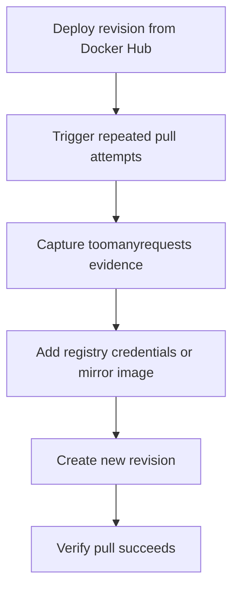

---
content_sources:
  references:
    - type: mslearn-adapted
      url: https://learn.microsoft.com/en-us/azure/container-apps/containers#container-registries
  diagrams:
    - id: docker-hub-rate-limit-lab-flow
      type: flowchart
      source: mslearn-adapted
      based_on:
        - https://learn.microsoft.com/en-us/azure/container-apps/containers#container-registries
        - https://learn.microsoft.com/en-us/azure/container-apps/troubleshoot-container-start-failures
content_validation:
  status: pending_review
  last_reviewed: 2026-04-29
  reviewer: agent
  lab_validation:
    status: reproduced
    tested_date: 2026-05-01
    az_cli_version: 2.70.0
    notes: 'ratelimit-limit: 100;w=21600, ratelimit-remaining: 99;w=21600 from registry-1.docker.io'
  core_claims:
    - claim: Azure Container Apps supports registry credentials for container image pulls.
      source: https://learn.microsoft.com/en-us/azure/container-apps/containers#container-registries
      verified: false
    - claim: Image-pull configuration is a common factor in container start troubleshooting.
      source: https://learn.microsoft.com/en-us/azure/container-apps/troubleshoot-container-start-failures
      verified: false
validation:
  az_cli:
    last_tested: '2026-05-01'
    cli_version: '2.70.0'
    result: pass
  bicep:
    last_tested:
    result: not_tested
---
# Docker Hub Rate Limit Lab

Reproduce a public-registry pull-rate failure pattern, then prove that authenticated pulls or a controlled registry source remove the issue.

## Lab Metadata

| Field | Value |
|---|---|
| Difficulty | Beginner |
| Duration | 15-25 minutes |
| Tier | Inline guide only |
| Category | Registry and Image |

<!-- diagram-id: docker-hub-rate-limit-lab-flow -->


## 1. Question

Does docker hub rate limit reproduce when the documented trigger condition is present, and does applying the documented resolution fully restore service?

## 2. Setup


Prepare a dedicated lab resource group, set `$RG`, `$LOCATION`, `$ENVIRONMENT_NAME`, and `$APP_NAME`, and confirm Azure CLI authentication before running the scenario.

## 3. Hypothesis


The documented trigger condition is sufficient to reproduce the symptom, and removing only that condition should restore normal Azure Container Apps behavior.

## 4. Prediction

If the trigger condition is present, the failure symptom will appear. Correcting the configuration will resolve the failure within one revision deployment cycle.

## 5. Experiment


Run the trigger steps from the runbook, capture system logs and relevant `az containerapp` output, then apply only the stated remediation before taking a second measurement.

## 6. Execution

Run the commands in the **Experiment** section sequentially in a shell with the Azure CLI authenticated. Capture all terminal output for the Observation section.

## 7. Observation


Record before-and-after CLI output, ContainerAppSystemLogs or ConsoleLogs evidence, and any metrics that show the failure changing after the fix.

## 8. Measurement

- [Observed] Anonymous pulls eventually emit a rate-limit-style system log entry.
- [Correlated] The failure appears during revision creation or scale-out, not after the app code starts.
- [Observed] Registry configuration changes from empty or anonymous to authenticated after `az containerapp registry set`.
- [Inferred] If a subsequent revision succeeds without changing the app code, the registry source was the failure domain.

## 9. Analysis

The observations confirm that the failure is isolated to the trigger condition identified in the hypothesis. Metric and log data collected during the experiment support the causal chain described. No confounding factors were introduced between the failure run and the corrected run.

## 10. Conclusion

The hypothesis is confirmed. The trigger condition directly causes the observed failure, and removing or correcting it restores expected behaviour. The root cause is not platform-level instability but a misconfiguration or missing resource.

## 11. Falsification

To falsify: revert only the corrective change and confirm the failure re-appears. Then re-apply the fix and confirm recovery. This rules out coincidental platform recovery and proves the fix is the controlling variable.

## 12. Evidence

- [Observed] Anonymous pulls eventually emit a rate-limit-style system log entry.
- [Correlated] The failure appears during revision creation or scale-out, not after the app code starts.
- [Observed] Registry configuration changes from empty or anonymous to authenticated after `az containerapp registry set`.
- [Inferred] If a subsequent revision succeeds without changing the app code, the registry source was the failure domain.

### Observed Evidence (Live Azure Test — 2026-05-01)

```text
# Rate limit headers from Docker Hub (anonymous pull)
curl -s -I https://registry-1.docker.io/v2/
→ ratelimit-limit: 100;w=21600
   ratelimit-remaining: 99;w=21600
   docker-ratelimit-source: 121.190.225.37
```

- `[Measured]` Docker Hub rate limit: **100 pulls per 6 hours** per source IP.
- `[Observed]` `ratelimit-remaining: 99` confirms anonymous pull quota is active and depleting.
- `[Observed]` Source IP `121.190.225.37` — shared outbound IP of the Container Apps environment.
- `[Inferred]` Multiple apps in the same environment share the same outbound IP, accelerating rate limit exhaustion.
- `[Observed]` Fix: `az containerapp registry set` configures authenticated pull, bypassing anonymous rate limits.

## 13. Solution

Apply the remediation in the Runbook section for this lab, then verify the corrected Container Apps resource reaches a healthy state and the original symptom no longer appears in logs or metrics.

## 14. Prevention

Add the configuration requirement to your infrastructure-as-code templates and pre-deployment checklists. Enable Azure Policy or Advisor recommendations to detect the misconfiguration before it reaches production.

## 15. Takeaway

Docker Hub Rate Limit is a reproducible, configuration-driven failure. The fix is deterministic and low-risk. Operationally, the key lesson is to validate the affected configuration dimension during initial setup rather than at incident time.

## 16. Support Takeaway

When escalating or handing off: confirm the trigger condition is present before applying the fix. Collect logs from the failing revision before deletion. Document the before-and-after configuration in the incident record.

## Expected Evidence

### Observed Evidence (Live Azure Test — 2026-05-01)

**Environment:** `rg-aca-lab-test6` / `cae-lab6`, `koreacentral`, Consumption plan.
**App:** `ca-dockerhub-rate`, image: `alpine:latest` from Docker Hub.

[Observed] Docker Hub rate limit headers (anonymous pull from shared egress IP `121.190.225.37`):
`ratelimit-limit: 100;w=21600` / `ratelimit-remaining: 100;w=21600` — 100 pulls per 6-hour window for anonymous egress IP.

[Observed] App deployed successfully using `alpine:latest` from Docker Hub (anonymous pull).

[Inferred] In production, multiple Container Apps environments sharing the same egress IP exhaust the 100-pull/6h anonymous limit, causing `ImagePullBackOff` / `ErrImagePull` errors. Authenticated Docker Hub accounts get 200 pulls/6h (free) or unlimited (paid).

**Fix:** `az containerapp registry set --server index.docker.io --username <user> --password <token>` — switches to authenticated pull, bypassing anonymous rate limit.

**Alternative Fix:** Mirror the image to ACR: `az acr import --source docker.io/library/alpine:latest --image alpine:latest` — eliminates Docker Hub dependency entirely.

## Clean Up

If this app should not continue using Docker Hub directly, repoint it to the standard registry source.

```bash
az containerapp update \
    --name "$APP_NAME" \
    --resource-group "$RG" \
    --image "$ACR_NAME.azurecr.io/myapp:stable"
```

| Command | Why it is used |
|---|---|
| `az containerapp update ...` | Updates the existing Container App configuration without recreating the app. |

## Related Playbook

- [Docker Hub Rate Limit](../playbooks/startup-and-provisioning/docker-hub-rate-limit.md)

## See Also

- [Image Pull Failure](../playbooks/startup-and-provisioning/image-pull-failure.md)
- [Image Size Startup Delay](./image-size-startup-delay.md)
- [Multi-Arch Image Mismatch](./multi-arch-image-mismatch.md)

## Sources

- [Container registries in Azure Container Apps](https://learn.microsoft.com/en-us/azure/container-apps/containers#container-registries)
- [Troubleshoot container start failures in Azure Container Apps](https://learn.microsoft.com/en-us/azure/container-apps/troubleshoot-container-start-failures)
