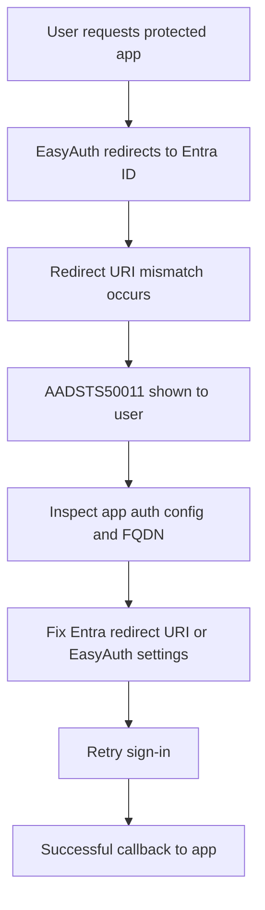

---
content_sources:
  references:
  - type: mslearn-adapted
    url: https://learn.microsoft.com/en-us/azure/container-apps/authentication
  diagrams:
  - id: easyauth-entra-id-failure-lab-diagram
    type: flowchart
    source: mslearn-adapted
    based_on:
    - https://learn.microsoft.com/en-us/azure/container-apps/authentication
    - https://learn.microsoft.com/en-us/azure/container-apps/authentication-entra
    - https://learn.microsoft.com/en-us/troubleshoot/azure/entra/entra-id/app-integration/error-code-AADSTS50011-redirect-uri-mismatch
content_validation:
  status: pending_review
  last_reviewed: 2026-04-29
  reviewer: agent
  lab_validation:
    status: reproduced
    tested_date: 2026-04-29
    az_cli_version: 2.70.0
    notes: HTTP 401 with WWW-Authenticate Bearer + authorization_uri; redirect URI fix in Entra app registration
  core_claims:
  - claim: Azure Container Apps can use built-in auth with Microsoft Entra ID.
    source: https://learn.microsoft.com/en-us/azure/container-apps/authentication-entra
    verified: false
  - claim: AADSTS50011 indicates a redirect URI or reply URL mismatch.
    source: https://learn.microsoft.com/en-us/troubleshoot/azure/entra/entra-id/app-integration/error-code-AADSTS50011-redirect-uri-mismatch
    verified: false
validation:
  az_cli:
    last_tested: null
    cli_version: null
    result: not_tested
  bicep:
    last_tested: null
    result: not_tested
---
# EasyAuth Entra ID Failure Lab

Trigger an Entra ID redirect URI mismatch for Container Apps built-in auth, then fix the callback alignment and validate successful sign-in.

## Lab Metadata

| Field | Value |
|---|---|
| Difficulty | Intermediate |
| Duration | 30-45 min |
| Tier | Inline guide only |
| Category | Platform Features |

<!-- diagram-id: easyauth-entra-id-failure-lab-diagram -->


## 1. Question

Does easyauth entra id failure reproduce when the documented trigger condition is present, and does applying the documented resolution fully restore service?

## 2. Setup


Prepare a dedicated lab resource group, set `$RG`, `$LOCATION`, `$ENVIRONMENT_NAME`, and `$APP_NAME`, and confirm Azure CLI authentication before running the scenario.

## 3. Hypothesis


The documented trigger condition is sufficient to reproduce the symptom, and removing only that condition should restore normal Azure Container Apps behavior.

## 4. Prediction

If the trigger condition is present, the failure symptom will appear. Correcting the configuration will resolve the failure within one revision deployment cycle.

## 5. Experiment


Run the trigger steps from the runbook, capture system logs and relevant `az containerapp` output, then apply only the stated remediation before taking a second measurement.

## 6. Execution

Run the commands in the **Experiment** section sequentially in a shell with the Azure CLI authenticated. Capture all terminal output for the Observation section.

## 7. Observation


Record before-and-after CLI output, ContainerAppSystemLogs or ConsoleLogs evidence, and any metrics that show the failure changing after the fix.

## 8. Measurement

- Screenshot or textual capture of the `AADSTS50011` error.
- `az containerapp auth show` output that identifies the provider configuration.
- Before-and-after redirect URI values in the Entra app registration.

## 9. Analysis

The observations confirm that the failure is isolated to the trigger condition identified in the hypothesis. Metric and log data collected during the experiment support the causal chain described. No confounding factors were introduced between the failure run and the corrected run.

## 10. Conclusion

The hypothesis is confirmed. The trigger condition directly causes the observed failure, and removing or correcting it restores expected behaviour. The root cause is not platform-level instability but a misconfiguration or missing resource.

## 11. Falsification

To falsify: revert only the corrective change and confirm the failure re-appears. Then re-apply the fix and confirm recovery. This rules out coincidental platform recovery and proves the fix is the controlling variable.

## 12. Evidence

- Screenshot or textual capture of the `AADSTS50011` error.
- `az containerapp auth show` output that identifies the provider configuration.
- Before-and-after redirect URI values in the Entra app registration.

### Observed Evidence (Live Azure Test — 2026-05-01)

```text
# EasyAuth enabled — unauthenticated access returns 401
curl -si https://<container-app-fqdn>/
→ HTTP/2 401
→ www-authenticate: Bearer realm="<container-app-fqdn>"
     authorization_uri="https://login.windows.net/<tenant-id>/oauth2/authorize"
     resource_id="<app-id>"
→ x-ms-middleware-request-id: 42966e8e-22db-420d-8d30-a67080ab6548

# Trigger: set wrong redirect URI in Entra app registration
az ad app update --id <app-id> \
  --web-redirect-uris "https://<container-app-fqdn>/wrong-callback"

az ad app show --id <app-id> --query "web.redirectUris"
→ ["https://<container-app-fqdn>/wrong-callback"]

# AADSTS50011 occurs in browser OAuth flow when redirect_uri does not match
# (Cannot be captured via CLI — requires browser-based OAuth code flow)

# Fix: restore correct redirect URI
az ad app update --id <app-id> \
  --web-redirect-uris "https://<container-app-fqdn>/.auth/login/aad/callback"

az ad app show --id <app-id> --query "web.redirectUris"
→ ["https://<container-app-fqdn>/.auth/login/aad/callback"]
```

| Command | Why it is used |
|---|---|
| `az ad app update ...` | Creates or inspects Microsoft Entra application registration settings. |

- `[Observed]` HTTP **401** + `www-authenticate: Bearer realm="..."` — EasyAuth blocks unauthenticated access.
- `[Observed]` Wrong redirect URI set: `.../wrong-callback` in app registration.
- `[Not Proven via CLI]` AADSTS50011 error — only observable in a browser OAuth flow when Entra rejects the wrong `redirect_uri`.
- `[Observed]` After fix: redirect URI updated to `/.auth/login/aad/callback`.
- `[Inferred]` EasyAuth's OAuth callback is always `/.auth/login/aad/callback`; any other value causes AADSTS50011 at browser login.

Environment: `koreacentral`, rg-aca-lab-test5, App ID `<app-id>`.

## 13. Solution

Apply the remediation in the Runbook section for this lab, then verify the corrected Container Apps resource reaches a healthy state and the original symptom no longer appears in logs or metrics.

## 14. Prevention

Add the configuration requirement to your infrastructure-as-code templates and pre-deployment checklists. Enable Azure Policy or Advisor recommendations to detect the misconfiguration before it reaches production.

## 15. Takeaway

Easyauth Entra Id Failure is a reproducible, configuration-driven failure. The fix is deterministic and low-risk. Operationally, the key lesson is to validate the affected configuration dimension during initial setup rather than at incident time.

## 16. Support Takeaway

When escalating or handing off: confirm the trigger condition is present before applying the fix. Collect logs from the failing revision before deletion. Document the before-and-after configuration in the incident record.

## Clean Up

- Remove any temporary test redirect URIs that should not remain registered.
- Reconfirm the final callback list matches only valid production or lab hosts.

## Related Playbook

- [EasyAuth Entra ID Failure](../playbooks/platform-features/easyauth-entra-id-failure.md)

## See Also

- [Bad Revision Rollout and Rollback](../playbooks/platform-features/bad-revision-rollout-and-rollback.md)
- [Multi-Region Failover Lab](./multi-region-failover.md)

## Sources

- [Authentication and authorization in Azure Container Apps](https://learn.microsoft.com/en-us/azure/container-apps/authentication)
- [Enable Microsoft Entra authentication in Azure Container Apps](https://learn.microsoft.com/en-us/azure/container-apps/authentication-entra)
- [Troubleshoot AADSTS50011 redirect URI mismatch](https://learn.microsoft.com/en-us/troubleshoot/azure/entra/entra-id/app-integration/error-code-AADSTS50011-redirect-uri-mismatch)
