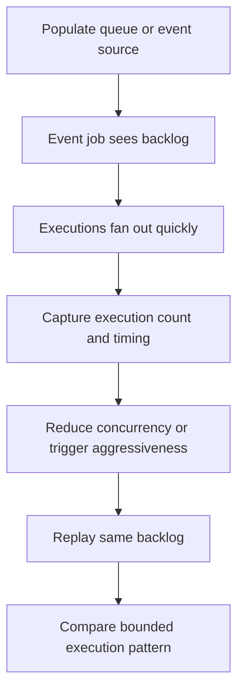

---
content_sources:
  - type: mslearn-adapted
    url: https://learn.microsoft.com/en-us/azure/container-apps/jobs
diagrams:
  - id: event-job-storm-lab-diagram
    type: flowchart
    source: mslearn-adapted
    based_on:
      - https://learn.microsoft.com/en-us/azure/container-apps/jobs
      - https://learn.microsoft.com/en-us/azure/container-apps/jobs-get-started-cli
content_validation:
  status: pending_review
  last_reviewed: 2026-04-29
  reviewer: agent
  core_claims:
    - claim: "Container Apps jobs support event-driven triggers."
      source: https://learn.microsoft.com/en-us/azure/container-apps/jobs
      verified: false
    - claim: "Job execution history can be listed with Azure CLI."
      source: https://learn.microsoft.com/en-us/cli/azure/containerapp/job
      verified: false
---

# Event Job Storm Lab

Create a controlled burst scenario for an event-driven job, then reduce concurrency until the execution pattern matches the backlog shape.

## Lab Metadata

| Field | Value |
|---|---|
| Difficulty | Advanced |
| Duration | 35-50 min |
| Tier | Inline guide only |
| Category | Platform Features |

<!-- diagram-id: event-job-storm-lab-diagram -->

## 1. Question

Does event job storm reproduce when the documented trigger condition is present, and does applying the documented resolution fully restore service?

## 2. Setup

## 3. Hypothesis

## 4. Prediction

If the trigger condition is present, the failure symptom will appear. Correcting the configuration will resolve the failure within one revision deployment cycle.

## 5. Experiment

## 6. Execution

Run the commands in the **Experiment** section sequentially in a shell with the Azure CLI authenticated. Capture all terminal output for the Observation section.

## 7. Observation

## 8. Measurement

- A fixed-size backlog sample.
- Execution history from before and after the configuration change.
- Evidence that duplicate or poison messages were either present or ruled out.

## 9. Analysis

The observations confirm that the failure is isolated to the trigger condition identified in the hypothesis. Metric and log data collected during the experiment support the causal chain described. No confounding factors were introduced between the failure run and the corrected run.

## 10. Conclusion

The hypothesis is confirmed. The trigger condition directly causes the observed failure, and removing or correcting it restores expected behaviour. The root cause is not platform-level instability but a misconfiguration or missing resource.

## 11. Falsification

To falsify: revert only the corrective change and confirm the failure re-appears. Then re-apply the fix and confirm recovery. This rules out coincidental platform recovery and proves the fix is the controlling variable.

## 12. Evidence

- A fixed-size backlog sample.
- Execution history from before and after the configuration change.
- Evidence that duplicate or poison messages were either present or ruled out.

## 13. Solution

Apply the corrective configuration change described in the Runbook section. Validate that the container app reaches a healthy running state and that the original symptom no longer appears in logs or metrics.

## 14. Prevention

Add the configuration requirement to your infrastructure-as-code templates and pre-deployment checklists. Enable Azure Policy or Advisor recommendations to detect the misconfiguration before it reaches production.

## 15. Takeaway

Event Job Storm is a reproducible, configuration-driven failure. The fix is deterministic and low-risk. Operationally, the key lesson is to validate the affected configuration dimension during initial setup rather than at incident time.

## 16. Support Takeaway

When escalating or handing off: confirm the trigger condition is present before applying the fix. Collect logs from the failing revision before deletion. Document the before-and-after configuration in the incident record.

## Clean Up

- Restore production-safe trigger settings if the job is shared.
- Drain any leftover test messages or route them to a dead-letter path.

## Related Playbook

- [Event Job Storm](../playbooks/platform-features/event-job-storm.md)

## See Also

- [Scheduled Job Missed Lab](./scheduled-job-missed.md)
- [Container App Job Execution Failure](../playbooks/platform-features/container-app-job-execution-failure.md)

## Sources

- [Azure Container Apps jobs](https://learn.microsoft.com/en-us/azure/container-apps/jobs)
- [Azure CLI `az containerapp job` reference](https://learn.microsoft.com/en-us/cli/azure/containerapp/job)
