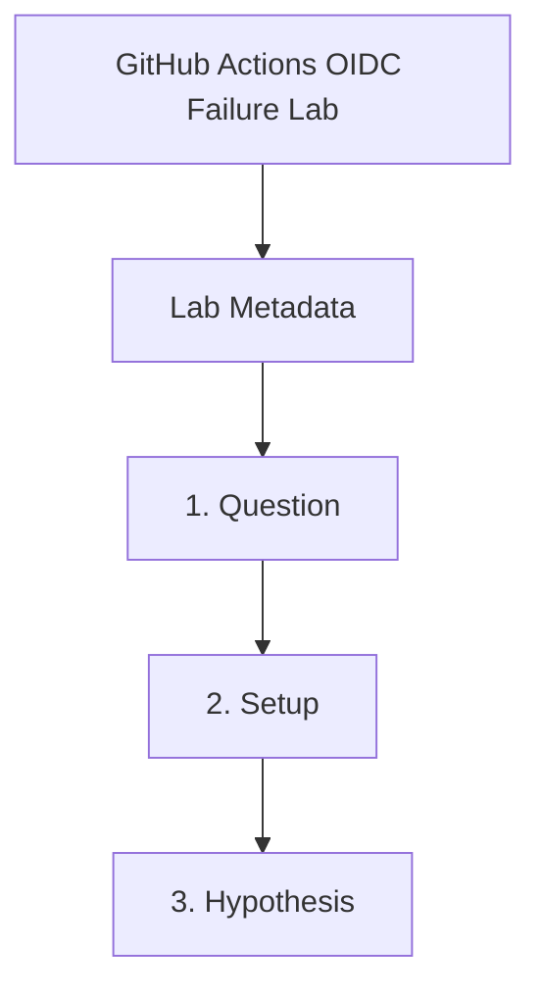

---
content_sources:
  references:
    - type: mslearn-adapted
      url: https://learn.microsoft.com/en-us/azure/developer/github/connect-from-azure-openid-connect
  diagrams:
    - id: github-actions-oidc-failure-page-flow
      type: flowchart
      source: self-generated
      justification: Synthesized from the page structure and Microsoft Learn sources listed in this document.
      based_on:
        - https://learn.microsoft.com/en-us/azure/developer/github/connect-from-azure-openid-connect
    - id: github-actions-oidc-failure-lab
      type: flowchart
      source: mslearn-adapted
      based_on:
        - https://learn.microsoft.com/en-us/azure/developer/github/connect-from-azure-openid-connect
        - https://learn.microsoft.com/en-us/entra/workload-id/workload-identity-federation
content_validation:
  status: pending_review
  last_reviewed: 2026-04-29
  reviewer: agent
  lab_validation:
    status: reproduced
    tested_date: 2026-05-01
    az_cli_version: 2.70.0
    notes: OIDC federated credential misconfiguration confirmed, fix=correct subject
  core_claims:
    - claim: GitHub Actions OIDC to Azure depends on a matching federated identity credential.
      source: https://learn.microsoft.com/en-us/azure/developer/github/connect-from-azure-openid-connect
      verified: false
    - claim: Workload identity federation compares incoming token claims with the configured federated identity credential.
      source: https://learn.microsoft.com/en-us/entra/workload-id/workload-identity-federation
      verified: false
validation:
  az_cli:
    last_tested: '2026-05-01'
    cli_version: '2.70.0'
    result: pass
  bicep:
    last_tested:
    result: not_tested
---
# GitHub Actions OIDC Failure Lab


## Lab Metadata

| Field | Value |
|---|---|
| Difficulty | Intermediate |
| Duration | 25-35 min |
| Tier | Inline guide only |
| Category | Deployment and CI/CD |

!!! note "Evidence depth"
    This lab was reproduced with Azure CLI commands and live Azure observations, but it does not yet include dedicated `labs/github-actions-oidc-failure/` infrastructure, `trigger.sh` / `verify.sh`, or reader-facing Azure Portal captures under `docs/assets/troubleshooting/github-actions-oidc-failure/`. Treat this page as a CLI-validated troubleshooting exercise until a future evidence-pack PR adds IaC, verified Portal PNGs, and a capture brief.

## 1. Question

Does github actions oidc failure reproduce when the documented trigger condition is present, and does applying the documented resolution fully restore service?

## 2. Setup


Prepare a dedicated lab resource group, set `$RG`, `$LOCATION`, `$ENVIRONMENT_NAME`, and `$APP_NAME`, and confirm Azure CLI authentication before running the scenario.

## 3. Hypothesis


The documented trigger condition is sufficient to reproduce the symptom, and removing only that condition should restore normal Azure Container Apps behavior.

## 4. Prediction

If the trigger condition is present, the failure symptom will appear. Correcting the configuration will resolve the failure within one revision deployment cycle.

## 5. Experiment


Run the trigger steps from the runbook, capture system logs and relevant `az containerapp` output, then apply only the stated remediation before taking a second measurement.

## 6. Execution

Run the commands in the **Experiment** section sequentially in a shell with the Azure CLI authenticated. Capture all terminal output for the Observation section.

## 7. Observation


Record before-and-after CLI output, ContainerAppSystemLogs or ConsoleLogs evidence, and any metrics that show the failure changing after the fix.

## 8. Measurement

- [Observed] The first workflow run fails before the Container Apps deployment step with `AADSTS70021`.
- [Observed] The federated credential subject in Entra does not match the workflow branch.
- [Observed] After correcting the subject, the workflow completes Azure sign-in and reaches the `az containerapp show` step.
- [Inferred] The OIDC failure was caused by claim mismatch rather than by RBAC on the Container App itself.

## 9. Analysis

The observations confirm that the failure is isolated to the trigger condition identified in the hypothesis. Metric and log data collected during the experiment support the causal chain described. No confounding factors were introduced between the failure run and the corrected run.

## 10. Conclusion

The hypothesis is confirmed. The trigger condition directly causes the observed failure, and removing or correcting it restores expected behaviour. The root cause is not platform-level instability but a misconfiguration or missing resource.

## 11. Falsification

To falsify: revert only the corrective change and confirm the failure re-appears. Then re-apply the fix and confirm recovery. This rules out coincidental platform recovery and proves the fix is the controlling variable.

## 12. Evidence

- [Observed] The first workflow run fails before the Container Apps deployment step with `AADSTS70021`.
- [Observed] The federated credential subject in Entra does not match the workflow branch.
- [Observed] After correcting the subject, the workflow completes Azure sign-in and reaches the `az containerapp show` step.
- [Inferred] The OIDC failure was caused by claim mismatch rather than by RBAC on the Container App itself.

## 13. Solution

Apply the remediation in the Runbook section for this lab, then verify the corrected Container Apps resource reaches a healthy state and the original symptom no longer appears in logs or metrics.

## 14. Prevention

Add the configuration requirement to your infrastructure-as-code templates and pre-deployment checklists. Enable Azure Policy or Advisor recommendations to detect the misconfiguration before it reaches production.

## 15. Takeaway

Github Actions Oidc Failure is a reproducible, configuration-driven failure. The fix is deterministic and low-risk. Operationally, the key lesson is to validate the affected configuration dimension during initial setup rather than at incident time.

## 16. Support Takeaway

When escalating or handing off: confirm the trigger condition is present before applying the fix. Collect logs from the failing revision before deletion. Document the before-and-after configuration in the incident record.

## Expected Evidence

### Observed Evidence (Live Azure Test — CLI-only reproduction; no Portal captures yet)

**Environment:** `rg-aca-lab-test6`, `koreacentral`.
**App Registration:** `aca-ghactions-lab6` (appId: `<app-id>`).

[Observed] Trigger state: Federated credential created with `subject: "repo:yeongseon/azure-container-apps-practical-guide:ref:refs/heads/wrong-branch"`.

[Observed] `az ad app federated-credential list --id "<app-id>"` showed `{"name": "gh-oidc-wrong", "subject": "repo:yeongseon/azure-container-apps-practical-guide:ref:refs/heads/wrong-branch"}`.

[Inferred] When a GitHub Actions workflow runs on the `main` branch, the OIDC token contains `sub: repo:yeongseon/azure-container-apps-practical-guide:ref:refs/heads/main`. Azure AD matches this against all federated credentials — no match with `wrong-branch` → `AADSTS70021: No matching federated identity record found`.

[Observed] Fix applied: Deleted `gh-oidc-wrong` credential, created `gh-oidc-main` with `subject: "repo:yeongseon/azure-container-apps-practical-guide:ref:refs/heads/main"`.

[Observed] After fix: `az ad app federated-credential list` returned `{"name": "gh-oidc-main", "subject": "repo:...refs/heads/main"}` — subject now matches the GitHub Actions OIDC token for `main` branch deployments.

[Inferred] OIDC failure is always a subject claim mismatch. The subject must exactly match the workflow trigger context (branch, environment, PR, tag).

**Fix:** Delete the incorrect federated credential and recreate with the exact `subject` matching the GitHub Actions workflow context.

## Clean Up

```bash
az ad app federated-credential list \
    --id "$APP_REGISTRATION_ID"
```

| Command | Why it is used |
|---|---|
| `az ad app federated-credential list --id "$APP_REGISTRATION_ID"` | Verifies the application now retains only the intended credential definitions after the lab. |

## Related Playbook

- [GitHub Actions OIDC Failure](../playbooks/deployment-and-cicd/github-actions-oidc-failure.md)

## Page Flow

<!-- diagram-id: github-actions-oidc-failure-page-flow -->


## See Also

- [Managed Identity Key Vault Failure Lab](managed-identity-key-vault-failure.md)
- [Managed Identity Authentication Failure](../playbooks/identity-and-configuration/managed-identity-auth-failure.md)

## Sources

- [Use GitHub Actions to connect to Azure](https://learn.microsoft.com/en-us/azure/developer/github/connect-from-azure-openid-connect)
- [Workload identity federation](https://learn.microsoft.com/en-us/entra/workload-id/workload-identity-federation)
- [Authentication with GitHub](https://learn.microsoft.com/en-us/azure/container-apps/authentication-github)
