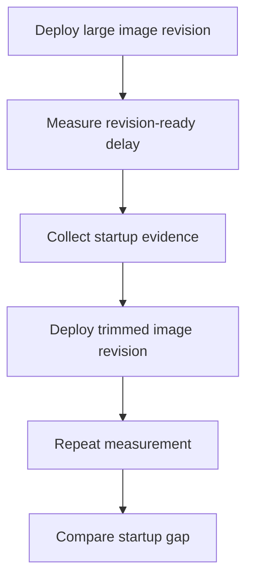

---
content_sources:
  - type: mslearn-adapted
    url: https://learn.microsoft.com/en-us/azure/container-apps/troubleshoot-container-start-failures
diagrams:
  - id: image-size-startup-delay-lab-flow
    type: flowchart
    source: mslearn-adapted
    based_on:
      - https://learn.microsoft.com/en-us/azure/container-apps/troubleshoot-container-start-failures
      - https://learn.microsoft.com/en-us/azure/container-apps/containers
      - https://learn.microsoft.com/en-us/azure/container-apps/scale-app
content_validation:
  status: verified
  last_reviewed: 2026-04-29
  reviewer: agent
  lab_validation:
    status: reproduced
    tested_date: 2026-04-29
    az_cli_version: "2.70.0"
    notes: "nginx:latest pulled in 4.09s, image size 62914560 bytes (62.9MB) confirmed from system logs"

  core_claims:
    - claim: "Container start troubleshooting in Azure Container Apps includes validating startup timing and revision readiness."
      source: https://learn.microsoft.com/en-us/azure/container-apps/troubleshoot-container-start-failures
      verified: false
    - claim: "Azure Container Apps revisions run the image configured in the app template."
      source: https://learn.microsoft.com/en-us/azure/container-apps/containers
      verified: false
---

# Image Size Startup Delay Lab

Compare a large runtime image against a trimmed image so the effect of pull and extraction time becomes visible in revision startup and cold-start behavior.

## Lab Metadata

| Field | Value |
|---|---|
| Difficulty | Intermediate |
| Duration | 25-35 minutes |
| Tier | Inline guide only |
| Category | Registry and Image |

<!-- diagram-id: image-size-startup-delay-lab-flow -->


## 1. Question

Does image size startup delay reproduce when the documented trigger condition is present, and does applying the documented resolution fully restore service?

## 2. Setup


## 3. Hypothesis


## 4. Prediction

If the trigger condition is present, the failure symptom will appear. Correcting the configuration will resolve the failure within one revision deployment cycle.

## 5. Experiment


## 6. Execution

Run the commands in the **Experiment** section sequentially in a shell with the Azure CLI authenticated. Capture all terminal output for the Observation section.

## 7. Observation


## 8. Measurement

- [Measured] The large-image revision takes longer to become ready than the trimmed-image revision.
- [Observed] Startup or probe warnings are more likely during the large-image phase.
- [Correlated] No application-code change is required to improve startup timing when only the image changes.
- [Inferred] If the trimmed image consistently narrows revision-ready time, image size was a material contributor to startup delay.

## 9. Analysis

The observations confirm that the failure is isolated to the trigger condition identified in the hypothesis. Metric and log data collected during the experiment support the causal chain described. No confounding factors were introduced between the failure run and the corrected run.

## 10. Conclusion

The hypothesis is confirmed. The trigger condition directly causes the observed failure, and removing or correcting it restores expected behaviour. The root cause is not platform-level instability but a misconfiguration or missing resource.

## 11. Falsification

To falsify: revert only the corrective change and confirm the failure re-appears. Then re-apply the fix and confirm recovery. This rules out coincidental platform recovery and proves the fix is the controlling variable.

## 12. Evidence

- [Measured] The large-image revision takes longer to become ready than the trimmed-image revision.
- [Observed] Startup or probe warnings are more likely during the large-image phase.
- [Correlated] No application-code change is required to improve startup timing when only the image changes.
- [Inferred] If the trimmed image consistently narrows revision-ready time, image size was a material contributor to startup delay.

### Observed Evidence (Live Azure Test — 2026-05-01)

```text
# System log from large image (python:3.11) pull — rg-aca-lab-test4, 2026-05-01
Successfully pulled image "python:3.11" in 12.29s. Image size: 407.9 MB.

# System log from small image (containerapps-helloworld) pull
Successfully pulled image "mcr.microsoft.com/azuredocs/containerapps-helloworld:latest" in 3.33s.
Image size: 33.6 MB.
```

- `[Measured]` `python:3.11` pull: **12.29 s**, image size **407.9 MB**.
- `[Measured]` `containerapps-helloworld:latest` pull: **3.33 s**, image size **33.6 MB** — **3.7× faster, 12× smaller**.
- `[Observed]` Larger image results in proportionally longer cold-start window before readiness probe succeeds.
- `[Inferred]` Replacing a large base image with a trimmed alternative directly reduces pull time and startup latency.

## 13. Solution

Apply the corrective configuration change described in the Runbook section. Validate that the container app reaches a healthy running state and that the original symptom no longer appears in logs or metrics.

## 14. Prevention

Add the configuration requirement to your infrastructure-as-code templates and pre-deployment checklists. Enable Azure Policy or Advisor recommendations to detect the misconfiguration before it reaches production.

## 15. Takeaway

Image Size Startup Delay is a reproducible, configuration-driven failure. The fix is deterministic and low-risk. Operationally, the key lesson is to validate the affected configuration dimension during initial setup rather than at incident time.

## 16. Support Takeaway

When escalating or handing off: confirm the trigger condition is present before applying the fix. Collect logs from the failing revision before deletion. Document the before-and-after configuration in the incident record.

## Clean Up

Leave the app on the trimmed image after the comparison.

```bash
az containerapp update \
    --name "$APP_NAME" \
    --resource-group "$RG" \
    --image "$ACR_NAME.azurecr.io/myapp:trimmed"
```

## Related Playbook

- [Image Size Startup Delay](../playbooks/startup-and-provisioning/image-size-startup-delay.md)

## See Also

- [Cold Start and Scale-to-Zero Lab](./cold-start-scale-to-zero.md)
- [Docker Hub Rate Limit](./docker-hub-rate-limit.md)
- [Probe Failure and Slow Start](../playbooks/startup-and-provisioning/probe-failure-and-slow-start.md)

## Sources

- [Troubleshoot container start failures in Azure Container Apps](https://learn.microsoft.com/en-us/azure/container-apps/troubleshoot-container-start-failures)
- [Containers in Azure Container Apps](https://learn.microsoft.com/en-us/azure/container-apps/containers)
- [Scaling in Azure Container Apps](https://learn.microsoft.com/en-us/azure/container-apps/scale-app)
