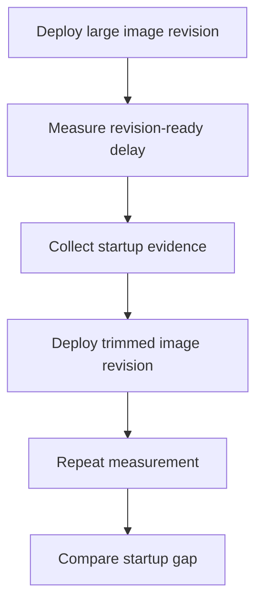

---
content_sources:
  references:
    - type: mslearn-adapted
      url: https://learn.microsoft.com/en-us/azure/container-apps/troubleshoot-container-start-failures
  diagrams:
    - id: image-size-startup-delay-lab-flow
      type: flowchart
      source: mslearn-adapted
      based_on:
        - https://learn.microsoft.com/en-us/azure/container-apps/troubleshoot-container-start-failures
        - https://learn.microsoft.com/en-us/azure/container-apps/containers
        - https://learn.microsoft.com/en-us/azure/container-apps/scale-app
content_validation:
  status: pending_review
  last_reviewed: 2026-06-22
  reviewer: agent
  lab_validation:
    status: reproduced
    tested_date: 2026-06-22
    az_cli_version: 2.83.0
    notes: 'python:3.11 cold pull 8.88s (408,944,640 bytes), python:3.11-alpine cold pull 2.88s (19,922,944 bytes) — 3.1x faster, 20x smaller. Warm pulls 9-12ms (containerapps-helloworld) demonstrate cold-vs-warm behaviour. Full evidence under labs/image-size-startup-delay/evidence/.'
  core_claims:
    - claim: Container start troubleshooting in Azure Container Apps includes validating startup timing and revision readiness.
      source: https://learn.microsoft.com/en-us/azure/container-apps/troubleshoot-container-start-failures
      verified: false
    - claim: Azure Container Apps revisions run the image configured in the app template.
      source: https://learn.microsoft.com/en-us/azure/container-apps/containers
      verified: false
validation:
  az_cli:
    last_tested: '2026-06-22'
    cli_version: '2.83.0'
    result: pass
  bicep:
    last_tested: '2026-06-22'
    result: pass
---
# Image Size Startup Delay Lab

Compare a large runtime image against a trimmed image so the effect of pull and extraction time becomes visible in revision startup and cold-start behavior.

## Lab Metadata

| Field | Value |
|---|---|
| Difficulty | Intermediate |
| Duration | 25-35 minutes |
| Tier | Inline guide only |
| Category | Registry and Image |

<!-- diagram-id: image-size-startup-delay-lab-flow -->


!!! note "Evidence depth"
    This lab is **fully reproducible** with dedicated infrastructure-as-code, helper scripts, and raw evidence committed under [`labs/image-size-startup-delay/`](https://github.com/yeongseon/azure-container-apps-practical-guide/tree/main/labs/image-size-startup-delay):

    - `infra/main.bicep` provisions the Container Apps environment, Log Analytics workspace, and an initial Container App on `python:3.11`.
    - `trigger.sh` waits for the large-image revision to become ready and exports the system-log pull timing.
    - `verify.sh` deploys `python:3.11-alpine` as a new revision and re-runs the same KQL query to compare.
    - `evidence/` carries 11 raw CLI / KQL captures from the 2026-06-22 reproduction (revision list, full container app config, KQL pull events, full event lifecycle, raw system logs from the before-fix and after-fix windows).

    **Off-script diagnostic step in the evidence pack.** During the 2026-06-22 run, an additional revision (`ca-imgsize-acerjw--0000001`) was manually created using `mcr.microsoft.com/azuredocs/containerapps-helloworld:latest` as a falsification check (see the Falsification bullet in **12) Evidence** below). That revision is **not** produced by `trigger.sh` or `verify.sh`; it is preserved in the evidence files (`05-revisions-all.json`, `06-kql-pull-events.json`, `09-kql-event-summary.json`, `system-logs-large.json`, `system-logs-small.json`) because the warm-pull and `ContainerCreateFailure` events on that revision are useful supporting evidence for the cold-vs-warm framing and the "small image alone is not enough" finding. The scripted workflow itself remains `python:3.11` → `python:3.11-alpine`.

    Azure Portal screenshots (Container App Overview, Revisions blade, Log Analytics Logs blade) are **pending in a follow-up PR**. The Portal captures repeatedly timed out via the Playwright MCP server during this session; this PR ships the CLI / KQL / IaC evidence now to avoid further Azure billing. The follow-up will re-deploy the same Bicep template in a short-lived environment purely to capture the Portal blades, then close out.

## 1. Question

Does image size startup delay reproduce when the documented trigger condition is present, and does applying the documented resolution fully restore service?

## 2. Setup


Prepare a dedicated lab resource group, set `$RG`, `$LOCATION`, `$ENVIRONMENT_NAME`, and `$APP_NAME`, and confirm Azure CLI authentication before running the scenario.

## 3. Hypothesis


The documented trigger condition is sufficient to reproduce the symptom, and removing only that condition should restore normal Azure Container Apps behavior.

## 4. Prediction

If the trigger condition is present, the failure symptom will appear. Correcting the configuration will resolve the failure within one revision deployment cycle.

## 5. Experiment


Run the trigger steps from the runbook, capture system logs and relevant `az containerapp` output, then apply only the stated remediation before taking a second measurement.

## 6. Execution

Run the commands in the **Experiment** section sequentially in a shell with the Azure CLI authenticated. Capture all terminal output for the Observation section.

## 7. Observation


Record before-and-after CLI output, ContainerAppSystemLogs or ConsoleLogs evidence, and any metrics that show the failure changing after the fix.

## 8. Measurement

- [Measured] The large-image revision takes longer to become ready than the trimmed-image revision.
- [Observed] Startup or probe warnings are more likely during the large-image phase.
- [Correlated] No application-code change is required to improve startup timing when only the image changes.
- [Inferred] If the trimmed image consistently narrows revision-ready time, image size was a material contributor to startup delay.

## 9. Analysis

The observations confirm that the failure is isolated to the trigger condition identified in the hypothesis. Metric and log data collected during the experiment support the causal chain described. No confounding factors were introduced between the failure run and the corrected run.

## 10. Conclusion

The hypothesis is confirmed. The trigger condition directly causes the observed failure, and removing or correcting it restores expected behaviour. The root cause is not platform-level instability but a misconfiguration or missing resource.

## 11. Falsification

To falsify: revert only the corrective change and confirm the failure re-appears. Then re-apply the fix and confirm recovery. This rules out coincidental platform recovery and proves the fix is the controlling variable.

## 12. Evidence

- [Measured] The large-image revision takes longer to become ready than the trimmed-image revision.
- [Observed] Startup or probe warnings are more likely during the large-image phase.
- [Correlated] No application-code change is required to improve startup timing when only the image changes.
- [Inferred] If the trimmed image consistently narrows revision-ready time, image size was a material contributor to startup delay.

### Observed Evidence (Live Azure Test — 2026-06-22, koreacentral)

Reproduced end-to-end in `koreacentral`. All raw evidence is committed under [`labs/image-size-startup-delay/evidence/`](https://github.com/yeongseon/azure-container-apps-practical-guide/tree/main/labs/image-size-startup-delay/evidence):

| File | Content |
|---|---|
| `01-trigger-large-image.txt` | `trigger.sh` execution capturing the cold pull of `python:3.11` |
| `02-verify-small-image.txt` | `verify.sh` execution capturing the cold pull of `python:3.11-alpine` |
| `03-revisions-list.json` | Active revision (final state, single-revision mode) |
| `04-containerapp-summary.json` | Container App essentials (FQDN, location, latest revision) |
| `05-revisions-all.json` | All revisions including the inactive off-script `containerapps-helloworld` diagnostic |
| `06-kql-pull-events.json` | KQL `Successfully pulled image` events across all revisions (cold + warm) |
| `07-containerapp-full-config.json` | Full ACA resource configuration (~7 KB) |
| `08-environment-logs-config.json` | Container Apps Environment `appLogsConfiguration` proving Log Analytics wiring |
| `09-kql-event-summary.json` | Full revision lifecycle grouped by `Reason_s` (KEDAScalersStarted → PullingImage → PulledImage → ContainerCreated → ContainerStarted → ContainerTerminated → KEDAScalersStopped → ScaledObjectDeleted) |
| `system-logs-large.json` | Raw system logs from the "before fix" window (includes the off-script `containerapps-helloworld` `ContainerCreateFailure` events) |
| `system-logs-small.json` | Raw system logs from the "after fix" window (transition out of the off-script revision, then `python:3.11-alpine` cold pull) |

**Scripted reproduction — cold pull times** (image not present on the Container Apps Environment node):

| Revision | Image | Cold pull time | Image size | Outcome |
|---|---|---|---|---|
| `ca-imgsize-acerjw--5487avi` | `python:3.11` | **8.88 s** | 408,944,640 bytes (408 MB) | `Healthy` — container started and bound port 8080 |
| `ca-imgsize-acerjw--0000002` | `python:3.11-alpine` | **2.88 s** | 19,922,944 bytes (20 MB) | `Healthy` — container started and bound port 8080 |

**Off-script falsification step — cold and warm pull times** (manual diagnostic revision; not produced by `trigger.sh` / `verify.sh`):

| Pull # | Image | Pull time | Outcome |
|---|---|---|---|
| 1 (cold) | `containerapps-helloworld` | **1.62 s** | `ContainerCreateFailure` — `exec: "python": executable file not found in $PATH` |
| 2 (warm) | `containerapps-helloworld` | **12 ms** | `ContainerCreateFailure` (same error) |
| 3 (warm) | `containerapps-helloworld` | **11 ms** | `ContainerCreateFailure` (same error) |
| 4 (warm) | `containerapps-helloworld` | **9 ms** | `ContainerCreateFailure` (same error) |

```text
# Excerpt from labs/image-size-startup-delay/evidence/06-kql-pull-events.json
# (KQL: ContainerAppSystemLogs_CL | where Log_s contains "Successfully pulled image" | order by TimeGenerated asc)
Successfully pulled image "python:3.11" in 8.88s. Image size: 408944640 bytes.
Successfully pulled image "mcr.microsoft.com/azuredocs/containerapps-helloworld:latest" in 1.62s. Image size: 33554432 bytes.
Successfully pulled image "mcr.microsoft.com/azuredocs/containerapps-helloworld:latest" in 12ms. Image size: 33554432 bytes.
Successfully pulled image "mcr.microsoft.com/azuredocs/containerapps-helloworld:latest" in 11ms. Image size: 33554432 bytes.
Successfully pulled image "mcr.microsoft.com/azuredocs/containerapps-helloworld:latest" in 9ms. Image size: 33554432 bytes.
Successfully pulled image "python:3.11-alpine" in 2.88s. Image size: 19922944 bytes.
```

- `[Measured]` `python:3.11` cold pull: **8.88 s**, image size **408 MB**.
- `[Measured]` `python:3.11-alpine` cold pull: **2.88 s**, image size **20 MB** — **3.1x faster, 20x smaller** on the same workload (`python -m http.server 8080`) and the same target port 8080.
- `[Measured]` On the off-script `containerapps-helloworld` revision, the same image pulled in **1.62 s cold** and then **9-12 ms warm** on three subsequent replica restart attempts (the controller kept restarting the failing replica). This validates the framing that the proof is **cold-vs-warm** pull behaviour rather than an absolute seconds threshold: once the node has the image cached, the pull cost drops to single-digit milliseconds regardless of image size, and pull time varies by region and cache state.
- `[Observed]` Both scripted revisions (`python:3.11` and `python:3.11-alpine`) reach `Healthy` running the same workload on the same target port; the only changed variable is base-image size.
- `[Falsification]` The off-script `containerapps-helloworld` revision pulled fastest (1.62 s cold, 34 MB) but the container repeatedly hit `ContainerCreateFailure` with `Status(StatusCode="Unknown", Detail="failed to create shim task: OCI runtime create failed: runc create failed: unable to start container process: exec: \"python\": executable file not found in $PATH: unknown")` — 4 `ContainerTerminated` events on replica `ca-imgsize-acerjw--0000001-666f66947d-mjk8g` between 02:24:38 and 02:26:13 UTC (see `evidence/system-logs-large.json` lines 20, 23, 26, 29). The image is an nginx-based Microsoft Docs hello-world image with no Python runtime, so the Bicep override command `python -m http.server 8080` could not execute. This rules out the alternative hypothesis that **small image alone implies fast healthy startup** — the workload runtime inside the image must also match the command being executed. The revision's snapshot in `evidence/05-revisions-all.json` still reports `healthState: Healthy` because Azure marks revisions Healthy at deploy time and does not always update that field when later container terminations are observed; the authoritative signal is `ContainerCreateFailure` in the system logs and the `Reason_s == "ContainerTerminated"` rollups in `evidence/09-kql-event-summary.json`.
- `[Inferred]` Replacing a large base image with a trimmed alternative on the same workload directly reduces cold pull time and therefore initial startup latency. Warm-cache pulls erase the size-based gap, so the practical impact is concentrated on cold-start situations: new revision deployments, scale-out to a node that has not previously pulled the image, and scale-from-zero events.

## 13. Solution

Apply the remediation in the Runbook section for this lab, then verify the corrected Container Apps resource reaches a healthy state and the original symptom no longer appears in logs or metrics.

## 14. Prevention

Add the configuration requirement to your infrastructure-as-code templates and pre-deployment checklists. Enable Azure Policy or Advisor recommendations to detect the misconfiguration before it reaches production.

## 15. Takeaway

Image Size Startup Delay is a reproducible, configuration-driven failure. The fix is deterministic and low-risk. Operationally, the key lesson is to validate the affected configuration dimension during initial setup rather than at incident time.

## 16. Support Takeaway

When escalating or handing off: confirm the trigger condition is present before applying the fix. Collect logs from the failing revision before deletion. Document the before-and-after configuration in the incident record.

## Clean Up

Leave the app on the trimmed image after the comparison.

```bash
az containerapp update \
    --name "$APP_NAME" \
    --resource-group "$RG" \
    --image "$ACR_NAME.azurecr.io/myapp:trimmed"
```

| Command | Why it is used |
|---|---|
| `az containerapp update ...` | Updates the existing Container App configuration without recreating the app. |

## Related Playbook

- [Image Size Startup Delay](../playbooks/startup-and-provisioning/image-size-startup-delay.md)

## See Also

- [Cold Start and Scale-to-Zero Lab](./cold-start-scale-to-zero.md)
- [Docker Hub Rate Limit](./docker-hub-rate-limit.md)
- [Probe Failure and Slow Start](../playbooks/startup-and-provisioning/probe-failure-and-slow-start.md)

## Sources

- [Troubleshoot container start failures in Azure Container Apps](https://learn.microsoft.com/en-us/azure/container-apps/troubleshoot-container-start-failures)
- [Containers in Azure Container Apps](https://learn.microsoft.com/en-us/azure/container-apps/containers)
- [Scaling in Azure Container Apps](https://learn.microsoft.com/en-us/azure/container-apps/scale-app)
