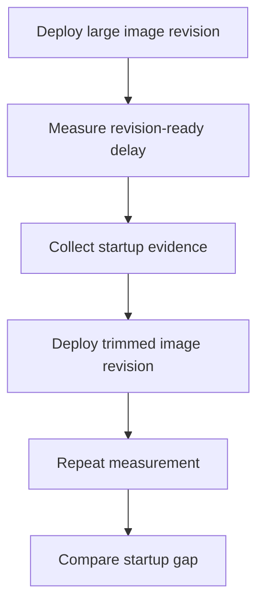

---
content_sources:
  references:
    - type: mslearn-adapted
      url: https://learn.microsoft.com/en-us/azure/container-apps/troubleshoot-container-start-failures
  diagrams:
    - id: image-size-startup-delay-lab-flow
      type: flowchart
      source: mslearn-adapted
      based_on:
        - https://learn.microsoft.com/en-us/azure/container-apps/troubleshoot-container-start-failures
        - https://learn.microsoft.com/en-us/azure/container-apps/containers
        - https://learn.microsoft.com/en-us/azure/container-apps/scale-app
content_validation:
  status: pending_review
  last_reviewed: 2026-06-22
  reviewer: agent
  lab_validation:
    status: reproduced
    tested_date: 2026-06-22
    az_cli_version: 2.83.0
    notes: 'python:3.11 cold pull 8.88s (408,944,640 bytes), python:3.11-alpine cold pull 2.88s (19,922,944 bytes) — 3.1x faster, 20x smaller. Warm pulls 9-12ms (containerapps-helloworld) demonstrate cold-vs-warm behaviour. Full evidence under labs/image-size-startup-delay/evidence/.'
  core_claims:
    - claim: Container start troubleshooting in Azure Container Apps includes validating startup timing and revision readiness.
      source: https://learn.microsoft.com/en-us/azure/container-apps/troubleshoot-container-start-failures
      verified: false
    - claim: Azure Container Apps revisions run the image configured in the app template.
      source: https://learn.microsoft.com/en-us/azure/container-apps/containers
      verified: false
validation:
  az_cli:
    last_tested: '2026-06-22'
    cli_version: '2.83.0'
    result: pass
  bicep:
    last_tested: '2026-06-22'
    result: pass
---
# Image Size Startup Delay Lab

Compare a large runtime image against a trimmed image so the effect of pull and extraction time becomes visible in revision startup and cold-start behavior.

## Lab Metadata

| Field | Value |
|---|---|
| Difficulty | Intermediate |
| Duration | 25-35 minutes |
| Tier | Inline guide only |
| Category | Registry and Image |

<!-- diagram-id: image-size-startup-delay-lab-flow -->


!!! note "Evidence depth"
    This lab is **fully reproducible** with dedicated infrastructure-as-code, helper scripts, and raw evidence committed under [`labs/image-size-startup-delay/`](https://github.com/yeongseon/azure-container-apps-practical-guide/tree/main/labs/image-size-startup-delay):

    - `infra/main.bicep` provisions the Container Apps environment, Log Analytics workspace, and an initial Container App on `python:3.11`.
    - `trigger.sh` waits for the large-image revision to become ready and exports the system-log pull timing.
    - `verify.sh` deploys `python:3.11-alpine` as a new revision and re-runs the same KQL query to compare.
    - `evidence/` carries 11 raw CLI / KQL captures from the 2026-06-22 reproduction (revision list, full container app config, KQL pull events, full event lifecycle, raw system logs from the before-fix and after-fix windows).

    **Off-script diagnostic step in the evidence pack.** During the 2026-06-22 run, an additional revision (`ca-imgsize-acerjw--0000001`) was manually created using `mcr.microsoft.com/azuredocs/containerapps-helloworld:latest` as a falsification check (see the Falsification bullet in **12) Evidence** below). That revision is **not** produced by `trigger.sh` or `verify.sh`; it is preserved in the evidence files (`05-revisions-all.json`, `06-kql-pull-events.json`, `09-kql-event-summary.json`, `system-logs-large.json`, `system-logs-small.json`) because the warm-pull and `ContainerCreateFailure` events on that revision are useful supporting evidence for the cold-vs-warm framing and the "small image alone is not enough" finding. The scripted workflow itself remains `python:3.11` → `python:3.11-alpine`.

    Azure Portal screenshots (Container App Overview, Revisions blade, Log Analytics Logs blade) are **pending in a follow-up PR**. The Portal captures repeatedly timed out via the Playwright MCP server during this session; this PR ships the CLI / KQL / IaC evidence now to avoid further Azure billing. The follow-up will re-deploy the same Bicep template in a short-lived environment purely to capture the Portal blades, then close out.

## 1. Question

On Azure Container Apps, how much of the cold-start window is attributable to base-image size alone, and is choosing a smaller base image (`python:3.11-alpine` instead of `python:3.11`) sufficient on its own to produce a fast, healthy startup — or does the workload runtime inside the image also have to match the executed command?

## 2. Setup

Prepare a dedicated lab resource group, set `$RG`, `$LOCATION`, and `$APP_NAME`, and confirm Azure CLI authentication. The Bicep template provisions a Log Analytics workspace and a Container Apps environment so that `ContainerAppSystemLogs` captures pull-timing events for each revision.

## 3. Hypothesis

On the same workload (`python -m http.server 8080`) and the same target port, replacing a 408 MB base image (`python:3.11`) with a 20 MB base image (`python:3.11-alpine`) materially reduces cold-pull time recorded in `ContainerAppSystemLogs`. The improvement is concentrated on **cold** pulls (image not present on the node); once the image is cached on the node, warm pulls complete in milliseconds regardless of image size.

The alternative hypothesis being tested is that **a small image alone is sufficient for a fast healthy startup**, regardless of whether the runtime inside the image matches the executed command.

## 4. Prediction

The `python:3.11-alpine` cold pull will complete several times faster than the `python:3.11` cold pull, both revisions will reach `Healthy`, and a deliberately-mismatched falsification revision (small image without a Python runtime) will pull faster than either healthy revision yet still fail with `ContainerCreateFailure`.

## 5. Experiment

1. Deploy the Bicep template (`infra/main.bicep`) which creates the Container App on `python:3.11` with `command: ["python", "-m", "http.server", "8080"]`.
2. Run `trigger.sh` to wait for the first revision to become Healthy and capture its system-log pull-timing event.
3. Run `verify.sh` to deploy a second revision on `python:3.11-alpine` (same command, same target port) and capture its system-log pull-timing event.
4. Compare the two `Successfully pulled image ... in <N>s. Image size: <bytes> bytes.` lines from `ContainerAppSystemLogs`.
5. For the falsification step, deploy a third revision on `mcr.microsoft.com/azuredocs/containerapps-helloworld` while keeping the same Bicep `command` override and capture the resulting `ContainerCreateFailure` events.

## 6. Execution

Execute the commands in the **Runbook** section sequentially in a shell with the Azure CLI authenticated. Capture all terminal output and write the JSON evidence to `labs/image-size-startup-delay/evidence/`.

## 7. Observation

Record the `Successfully pulled image` lines from `ContainerAppSystemLogs` for each revision, the per-revision `healthState` from `az containerapp revision list`, and — for the off-script helloworld revision — the `ContainerCreateFailure` event details from system logs and the `Reason_s` rollups from KQL.

## 8. Measurement

- `[Measured]` `python:3.11` cold pull: **8.88 s**, image size **408 MB**.
- `[Measured]` `python:3.11-alpine` cold pull: **2.88 s**, image size **20 MB** — **3.1× faster, 20× smaller** on the same workload and target port.
- `[Measured]` Off-script `containerapps-helloworld` (34 MB): cold pull **1.62 s**, then warm pulls **9-12 ms** on three subsequent replica restart attempts.
- `[Observed]` Both scripted revisions (`python:3.11`, `python:3.11-alpine`) reach `Healthy`; the off-script `containerapps-helloworld` revision pulls fastest but fails with `ContainerCreateFailure`.

## 9. Analysis

The two scripted measurements (cold pulls of `python:3.11` vs `python:3.11-alpine`) isolate base-image size as the only changed variable: same workload, same target port, same Container Apps Environment, same node. The 3.1× speedup on a 20× smaller image confirms that pull time on a cold node scales with image size.

The warm pulls on the off-script revision (9-12 ms, regardless of image size) confirm that once the image is cached on the node, image-size differences disappear. The practical impact of a smaller image is therefore concentrated on cold-start situations: new revision deployments, scale-out to nodes that have not previously pulled the image, and scale-from-zero events.

The off-script `containerapps-helloworld` revision is a runtime-command mismatch (no Python interpreter in the image), not a configuration error in the platform; it falsifies the alternative hypothesis that "small image alone implies fast healthy startup".

## 10. Conclusion

Choosing a smaller base image directly reduces cold-pull time on Azure Container Apps; warm-cache pulls erase the size-based gap. A small image is **necessary but not sufficient** for fast healthy startup — the workload runtime inside the image must also be able to execute the configured command.

## 11. Falsification

The falsification was performed in this lab (not as a hypothetical): a third revision (`ca-imgsize-acerjw--0000001`) was deployed on `mcr.microsoft.com/azuredocs/containerapps-helloworld` while keeping the same Bicep `command: ["python", "-m", "http.server", "8080"]` override. The image pulled fastest of all three revisions (1.62 s cold, 34 MB), yet the container repeatedly hit `ContainerCreateFailure` because the image has no Python runtime. This rules out the alternative hypothesis that **small image alone implies fast healthy startup**. See the **Falsification** bullet under `## 12. Evidence` for the full quoted error and citations.

## 12. Evidence

- `[Measured]` `python:3.11` cold pull: **8.88 s**, image size **408 MB** (`evidence/06-kql-pull-events.json`).
- `[Measured]` `python:3.11-alpine` cold pull: **2.88 s**, image size **20 MB** (`evidence/06-kql-pull-events.json`).
- `[Observed]` Both scripted revisions reach `Healthy` (`evidence/03-revisions-list.json`, `evidence/05-revisions-all.json`).
- `[Falsification]` `containerapps-helloworld` revision: 1.62 s cold pull yet 4× `ContainerCreateFailure` due to missing Python runtime (`evidence/system-logs-large.json`, `evidence/09-kql-event-summary.json`). See the **Observed Evidence** subsection below for the full quoted error message and timeline.

### Observed Evidence (Live Azure Test — 2026-06-22, koreacentral)

Reproduced end-to-end in `koreacentral`. All raw evidence is committed under [`labs/image-size-startup-delay/evidence/`](https://github.com/yeongseon/azure-container-apps-practical-guide/tree/main/labs/image-size-startup-delay/evidence):

| File | Content |
|---|---|
| `01-trigger-large-image.txt` | `trigger.sh` execution capturing the cold pull of `python:3.11` |
| `02-verify-small-image.txt` | `verify.sh` execution capturing the cold pull of `python:3.11-alpine` |
| `03-revisions-list.json` | Active revision (final state, single-revision mode) |
| `04-containerapp-summary.json` | Container App essentials (FQDN, location, latest revision) |
| `05-revisions-all.json` | All revisions including the inactive off-script `containerapps-helloworld` diagnostic |
| `06-kql-pull-events.json` | KQL `Successfully pulled image` events across all revisions (cold + warm) |
| `07-containerapp-full-config.json` | Full ACA resource configuration (~7 KB) |
| `08-environment-logs-config.json` | Container Apps Environment `appLogsConfiguration` proving Log Analytics wiring |
| `09-kql-event-summary.json` | Full revision lifecycle grouped by `Reason_s` (KEDAScalersStarted → PullingImage → PulledImage → ContainerCreated → ContainerStarted → ContainerTerminated → KEDAScalersStopped → ScaledObjectDeleted) |
| `system-logs-large.json` | Raw system logs from the "before fix" window (includes the off-script `containerapps-helloworld` `ContainerCreateFailure` events) |
| `system-logs-small.json` | Raw system logs from the "after fix" window (transition out of the off-script revision, then `python:3.11-alpine` cold pull) |

**Scripted reproduction — cold pull times** (image not present on the Container Apps Environment node):

| Revision | Image | Cold pull time | Image size | Outcome |
|---|---|---|---|---|
| `ca-imgsize-acerjw--5487avi` | `python:3.11` | **8.88 s** | 408,944,640 bytes (408 MB) | `Healthy` — container started and bound port 8080 |
| `ca-imgsize-acerjw--0000002` | `python:3.11-alpine` | **2.88 s** | 19,922,944 bytes (20 MB) | `Healthy` — container started and bound port 8080 |

**Off-script falsification step — cold and warm pull times** (manual diagnostic revision; not produced by `trigger.sh` / `verify.sh`):

| Pull # | Image | Pull time | Outcome |
|---|---|---|---|
| 1 (cold) | `containerapps-helloworld` | **1.62 s** | `ContainerCreateFailure` — `exec: "python": executable file not found in $PATH` |
| 2 (warm) | `containerapps-helloworld` | **12 ms** | `ContainerCreateFailure` (same error) |
| 3 (warm) | `containerapps-helloworld` | **11 ms** | `ContainerCreateFailure` (same error) |
| 4 (warm) | `containerapps-helloworld` | **9 ms** | `ContainerCreateFailure` (same error) |

```text
# Excerpt from labs/image-size-startup-delay/evidence/06-kql-pull-events.json
# (KQL: ContainerAppSystemLogs_CL | where Log_s contains "Successfully pulled image" | order by TimeGenerated asc)
Successfully pulled image "python:3.11" in 8.88s. Image size: 408944640 bytes.
Successfully pulled image "mcr.microsoft.com/azuredocs/containerapps-helloworld:latest" in 1.62s. Image size: 33554432 bytes.
Successfully pulled image "mcr.microsoft.com/azuredocs/containerapps-helloworld:latest" in 12ms. Image size: 33554432 bytes.
Successfully pulled image "mcr.microsoft.com/azuredocs/containerapps-helloworld:latest" in 11ms. Image size: 33554432 bytes.
Successfully pulled image "mcr.microsoft.com/azuredocs/containerapps-helloworld:latest" in 9ms. Image size: 33554432 bytes.
Successfully pulled image "python:3.11-alpine" in 2.88s. Image size: 19922944 bytes.
```

- `[Measured]` `python:3.11` cold pull: **8.88 s**, image size **408 MB**.
- `[Measured]` `python:3.11-alpine` cold pull: **2.88 s**, image size **20 MB** — **3.1x faster, 20x smaller** on the same workload (`python -m http.server 8080`) and the same target port 8080.
- `[Measured]` On the off-script `containerapps-helloworld` revision, the same image pulled in **1.62 s cold** and then **9-12 ms warm** on three subsequent replica restart attempts (the controller kept restarting the failing replica). This validates the framing that the proof is **cold-vs-warm** pull behaviour rather than an absolute seconds threshold: once the node has the image cached, the pull cost drops to single-digit milliseconds regardless of image size, and pull time varies by region and cache state.
- `[Observed]` Both scripted revisions (`python:3.11` and `python:3.11-alpine`) reach `Healthy` running the same workload on the same target port; the only changed variable is base-image size.
- `[Falsification]` The off-script `containerapps-helloworld` revision pulled fastest (1.62 s cold, 34 MB) but the container repeatedly hit `ContainerCreateFailure` with `Status(StatusCode="Unknown", Detail="failed to create shim task: OCI runtime create failed: runc create failed: unable to start container process: exec: \"python\": executable file not found in $PATH: unknown")` — 4 `ContainerTerminated` events on replica `ca-imgsize-acerjw--0000001-666f66947d-mjk8g` between 02:24:38 and 02:26:13 UTC (see `evidence/system-logs-large.json` lines 20, 23, 26, 29). The image is an nginx-based Microsoft Docs hello-world image with no Python runtime, so the Bicep override command `python -m http.server 8080` could not execute. This rules out the alternative hypothesis that **small image alone implies fast healthy startup** — the workload runtime inside the image must also match the command being executed. The revision's snapshot in `evidence/05-revisions-all.json` still reports `healthState: Healthy` because Azure marks revisions Healthy at deploy time and does not always update that field when later container terminations are observed; the authoritative signal is `ContainerCreateFailure` in the system logs and the `Reason_s == "ContainerTerminated"` rollups in `evidence/09-kql-event-summary.json`.
- `[Inferred]` Replacing a large base image with a trimmed alternative on the same workload directly reduces cold pull time and therefore initial startup latency. Warm-cache pulls erase the size-based gap, so the practical impact is concentrated on cold-start situations: new revision deployments, scale-out to a node that has not previously pulled the image, and scale-from-zero events.

## 13. Solution

For the timing-improvement axis: replace the large base image with a trimmed variant of the same runtime family (`python:3.11-alpine` instead of `python:3.11`) and redeploy as a new revision. For the runtime-command axis: when overriding `command` in Bicep or the `az containerapp` API, confirm the executable exists inside the chosen image (e.g. `docker run --rm <image> which python`) before deploying.

`verify.sh` performs the timing-improvement remediation against the deployed app and re-runs the KQL pull-events query so the before/after pull times can be compared directly.

## 14. Prevention

- Pin base images in your Dockerfile to the smallest variant that still ships your runtime (e.g. `-alpine`, `-slim`, distroless) and re-evaluate on each base-image refresh.
- When using `command:` / `args:` overrides in Bicep or the Container Apps API, keep the override in the same repository as the image definition so the executable contract is reviewable in one place.
- Track cold-start P95 in Azure Monitor for `RevisionReplicaCount` transitions from 0 → 1 (or use a scale-from-zero probe) so a base-image bloat regression surfaces as a metric, not as an incident.

## 15. Takeaway

Image size on Azure Container Apps is a **cold-start tax**, not a steady-state tax. A 20× smaller image gives a 3.1× faster cold pull on the same node; warm-cache pulls are millisecond-scale regardless of size. Optimize image size when cold-start latency is in the user-visible path (scale-from-zero, new revision rollouts, scale-out events); the steady-state hot-replica path is not affected.

## 16. Support Takeaway

When escalating a slow-startup case on Azure Container Apps: pull the `Successfully pulled image "...". Image size: <bytes> bytes.` line from `ContainerAppSystemLogs` for the affected revision. That single line gives you (a) the image actually pulled, (b) the cold-pull duration, and (c) the image size. If pull time is the dominant component of startup latency, the lever is image size. If the image pulled quickly but the container still failed to start, check for `ContainerCreateFailure` — usually a runtime/command mismatch like the one in this lab, not a platform issue.

## Clean Up

```bash
./cleanup.sh   # deletes the entire resource group (lab is fully disposable)
```

Or, if you want to keep the environment and only stop the running app:

```bash
az containerapp revision deactivate \
    --name "$APP_NAME" \
    --resource-group "$RG" \
    --revision "$(az containerapp revision list --name "$APP_NAME" --resource-group "$RG" --query '[?properties.active] | [0].name' --output tsv)"
```

| Command | Why it is used |
|---|---|
| `./cleanup.sh` | Runs `az group delete --name "$RG" --yes --no-wait` so all lab resources (Container App, environment, Log Analytics workspace) are removed in one call. Recommended after evidence has been captured. |
| `az containerapp revision deactivate ...` | Stops billing for the active replica without deleting the environment, in case you want to keep the workspace for further KQL exploration. |

## Related Playbook

- [Image Size Startup Delay](../playbooks/startup-and-provisioning/image-size-startup-delay.md)

## See Also

- [Cold Start and Scale-to-Zero Lab](./cold-start-scale-to-zero.md)
- [Docker Hub Rate Limit](./docker-hub-rate-limit.md)
- [Probe Failure and Slow Start](../playbooks/startup-and-provisioning/probe-failure-and-slow-start.md)

## Sources

- [Troubleshoot container start failures in Azure Container Apps](https://learn.microsoft.com/en-us/azure/container-apps/troubleshoot-container-start-failures)
- [Containers in Azure Container Apps](https://learn.microsoft.com/en-us/azure/container-apps/containers)
- [Scaling in Azure Container Apps](https://learn.microsoft.com/en-us/azure/container-apps/scale-app)
