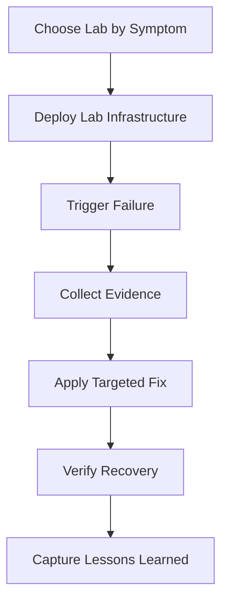

---
content_sources:
  diagrams:
    - id: use-this-section-when-you-want
      type: flowchart
      source: mslearn-adapted
      based_on:
        - https://learn.microsoft.com/azure/container-apps/troubleshooting
        - https://learn.microsoft.com/azure/container-apps/revisions
        - https://learn.microsoft.com/azure/container-apps/scale-app
---

# Lab Guides

Hands-on troubleshooting labs for Azure Container Apps with deployable infrastructure and scripted failure/recovery flows.

All sample outputs in lab guides are PII-scrubbed and use `ca-myapp`, `cae-myapp`, and `job-myapp` naming.

## Available Labs

| Lab | Description | Difficulty | Duration | Guide | Lab Files |
|---|---|---|---|---|---|
| ACR Image Pull Failure | Reproduces `ImagePullBackOff` from a non-existent image tag, then fixes image publishing/update. | Beginner | 20-30 min | [Guide](./acr-pull-failure.md) | [Directory](https://github.com/yeongseon/azure-container-apps-practical-guide/tree/main/labs/acr-pull-failure) |
| Revision Failover and Rollback | Deploys a healthy revision, then breaks ingress port on a new revision and restores traffic. | Intermediate | 20-30 min | [Guide](./revision-failover.md) | [Directory](https://github.com/yeongseon/azure-container-apps-practical-guide/tree/main/labs/revision-failover) |
| Scale Rule Mismatch | Uses unrealistic HTTP scaling thresholds to show non-scaling under load, then corrects KEDA settings. | Intermediate | 25-35 min | [Guide](./scale-rule-mismatch.md) | [Directory](https://github.com/yeongseon/azure-container-apps-practical-guide/tree/main/labs/scale-rule-mismatch) |
| Probe and Port Mismatch | App listens on port 3000 while ingress targets 8000, causing probe failures until target port is fixed. | Beginner | 20-25 min | [Guide](./probe-and-port-mismatch.md) | [Directory](https://github.com/yeongseon/azure-container-apps-practical-guide/tree/main/labs/probe-and-port-mismatch) |
| Managed Identity Key Vault Failure | App uses managed identity to read Key Vault secret but fails without `Key Vault Secrets User` role assignment. | Intermediate | 25-35 min | [Guide](./managed-identity-key-vault-failure.md) | [Directory](https://github.com/yeongseon/azure-container-apps-practical-guide/tree/main/labs/managed-identity-key-vault-failure) |
| Revision Provisioning Failure | Revision fails because container env var references a missing secret; fixed by setting secret and deploying new revision. | Intermediate | 20-30 min | [Guide](./revision-provisioning-failure.md) | [Directory](https://github.com/yeongseon/azure-container-apps-practical-guide/tree/main/labs/revision-provisioning-failure) |
| Ingress Target Port Mismatch | Diagnose and fix ingress failures caused by target port misconfiguration. | Beginner | 15-20 min | [Guide](./ingress-target-port-mismatch.md) | [Directory](https://github.com/yeongseon/azure-container-apps-practical-guide/tree/main/labs/ingress-target-port-mismatch) |
| Traffic Routing Canary Failure | Diagnose traffic splitting failures when a bad revision receives production traffic. | Intermediate | 20-30 min | [Guide](./traffic-routing-canary.md) | [Directory](https://github.com/yeongseon/azure-container-apps-practical-guide/tree/main/labs/traffic-routing-canary) |
| Dapr Integration | Troubleshoot Dapr sidecar and component configuration issues. | Intermediate | 35-45 min | [Guide](./dapr-integration.md) | [Directory](https://github.com/yeongseon/azure-container-apps-practical-guide/tree/main/labs/dapr-integration) |
| Observability and Tracing | Set up OpenTelemetry and Application Insights, troubleshoot missing traces and metrics. | Intermediate | 35-45 min | [Guide](./observability-tracing.md) | [Directory](https://github.com/yeongseon/azure-container-apps-practical-guide/tree/main/labs/observability-tracing) |
| CD Reconnect RBAC Conflict | Reproduces `AppRbacDeployment: The role assignment already exists` after a previous CD disconnect left RBAC role assignments behind. | Intermediate | 25-35 min | [Guide](./cd-reconnect-rbac-conflict.md) | [Directory](https://github.com/yeongseon/azure-container-apps-practical-guide/tree/main/labs/cd-reconnect-rbac-conflict) |

## Suggested Learning Path

1. [ACR Image Pull Failure](./acr-pull-failure.md)
2. [Probe and Port Mismatch](./probe-and-port-mismatch.md)
3. [Revision Failover and Rollback](./revision-failover.md)
4. [Revision Provisioning Failure](./revision-provisioning-failure.md)
5. [Scale Rule Mismatch](./scale-rule-mismatch.md)
6. [Managed Identity Key Vault Failure](./managed-identity-key-vault-failure.md)
7. [Ingress Target Port Mismatch Lab](./ingress-target-port-mismatch.md)
8. [Traffic Routing and Canary Failure Lab](./traffic-routing-canary.md)
9. [Dapr Integration](./dapr-integration.md)
10. [Observability and Tracing](./observability-tracing.md)
11. [CD Reconnect RBAC Conflict](./cd-reconnect-rbac-conflict.md)

## How to Use These Labs Effectively

Use this section when you want a repeatable learning loop (reproduce → observe → fix → verify).

<!-- diagram-id: use-this-section-when-you-want -->


!!! info "Run labs like incident drills"
    Treat each lab as an on-call simulation. Time-box your investigation and record which signal (revision state, system log, console log, metrics) gave you the fastest root-cause clue.

!!! tip "Reuse one naming convention across all labs"
    Keep variable names consistent between labs (`$RG`, `$APP_NAME`, `$ENVIRONMENT_NAME`, `$ACR_NAME`, `$LOCATION`) so your troubleshooting muscle memory transfers cleanly.

## Lab Selection Matrix

| Lab | Primary Symptom | First Signal to Check | Typical Root Cause | Fastest Recovery |
|---|---|---|---|---|
| ACR Image Pull Failure | Revision never starts | `ContainerAppSystemLogs_CL` pull errors | Bad image tag / registry auth | Push valid image + update app image |
| Revision Failover and Rollback | New revision unhealthy | `az containerapp revision list` | Risky config change in latest revision | Shift traffic back to healthy revision |
| Scale Rule Mismatch | Load increases, replicas do not | Replica count + KEDA events | Threshold too high / max replicas too low | Tune scale rule and retry load |
| Probe and Port Mismatch | Probe failures, no stable ready state | Probe failure warnings | App bind port != ingress target port | Align target port and rollout new revision |
| Managed Identity Key Vault Failure | Route returns 500/403 | App logs with identity errors | Missing role assignment on Key Vault scope | Assign RBAC role and re-verify |
| Revision Provisioning Failure | Revision stuck/failed provisioning | Revision lifecycle events | `secretRef` points to missing secret | Add secret and redeploy revision |
| Ingress Target Port Mismatch | External endpoint unreachable | Ingress target port config | Target port doesn't match app listen port | Fix target port to match app |
| Traffic Routing Canary Failure | Intermittent failures (~50%) | Traffic weight and revision health | Bad revision receiving traffic | Rollback traffic to healthy revision |
| Dapr Integration | Dapr calls fail | System logs with Dapr errors | Sidecar not enabled or component misconfigured | Enable Dapr and fix component YAML |
| Observability and Tracing | No traces in App Insights | Application Insights query | Connection string not set | Configure OTel and connection string |
| CD Reconnect RBAC Conflict | `AppRbacDeployment` failure on reconnect | Role assignment ID in deployment error | Orphaned role assignment from previous CD | Delete conflicting assignment, then reconnect |

## Step-by-Step: Standard Lab Execution Pattern

1. **Prepare shell variables**

    ```bash
    export RG="rg-aca-lab-shared"
    export LOCATION="koreacentral"
    export ENVIRONMENT_NAME="cae-myapp"
    export APP_NAME="ca-myapp"
    export ACR_NAME="acrmyapp"
    ```

    Expected output: no output (environment variables set in your shell).

2. **Validate CLI context**

    ```bash
    az account show --output table
    az extension add --name containerapp --upgrade
    ```

    Expected output: active subscription metadata and extension upgrade confirmation.

3. **Deploy the chosen lab infrastructure**

    ```bash
    az deployment group create \
      --name "lab-run" \
      --resource-group "$RG" \
      --template-file "./labs/<lab-name>/infra/main.bicep" \
      --parameters baseName="labrun"
    ```

    Expected output pattern:

    ```text
    "provisioningState": "Succeeded"
    ```

4. **Trigger failure and collect signals**

    ```bash
    ./labs/<lab-name>/trigger.sh
    ./labs/<lab-name>/verify.sh
    ```

    Expected output: one or more failure indicators (for example `ImagePullBackOff`, `ProbeFailed`, `403 Forbidden`, or non-scaling replica count).

5. **Apply targeted fix and verify recovery**

    ```bash
    # Use the specific fix command from each lab guide
    az containerapp revision list --name "$APP_NAME" --resource-group "$RG" --output table
    ```

    Expected output pattern: at least one `Healthy` revision with intended traffic weight.

6. **Clean up resources**

    ```bash
    ./labs/<lab-name>/cleanup.sh
    ```

    Expected output: deletion completed or a `Succeeded` state for cleanup actions.

## Expected vs Actual Investigation Template

| Checkpoint | Expected State | Typical Failure State | Action |
|---|---|---|---|
| Revision health | `Healthy` and active | `Failed` or stuck provisioning | Inspect system logs and revision events |
| Replica status | Running replicas under load | 0 replicas or repeated restart | Check probes, scale settings, and runtime logs |
| Route behavior | HTTP 200 with expected payload | 5xx, timeout, or connection refused | Validate ingress + target port + dependencies |
| Identity access | Token retrieval and authorized resource call | 401/403 in console logs | Verify managed identity and RBAC scope |

## See Also

- [Playbooks](../playbooks/index.md)
- [First 10 Minutes: Quick Triage Checklist](../first-10-minutes/index.md)
- [Troubleshooting Methodology](../methodology/index.md)

## Sources

- [Azure Container Apps troubleshooting overview](https://learn.microsoft.com/azure/container-apps/troubleshooting)
- [Azure Container Apps revisions](https://learn.microsoft.com/azure/container-apps/revisions)
- [Azure Container Apps scale behavior](https://learn.microsoft.com/azure/container-apps/scale-app)
