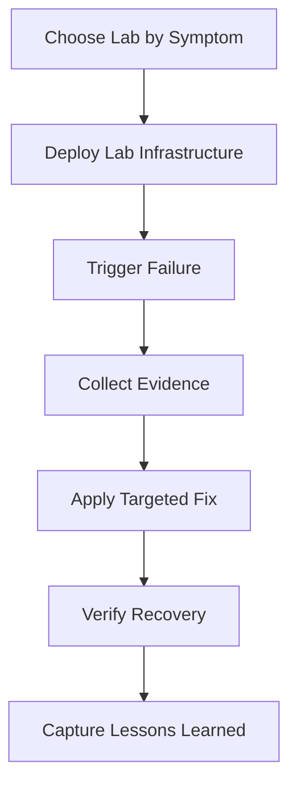

---
content_sources:
  references:
    - type: mslearn-adapted
      url: https://learn.microsoft.com/en-us/azure/container-apps/troubleshooting
    - type: mslearn-adapted
      url: https://learn.microsoft.com/en-us/azure/container-apps/revisions
    - type: mslearn-adapted
      url: https://learn.microsoft.com/en-us/azure/container-apps/scale-app
  diagrams:
    - id: use-this-section-when-you-want
      type: flowchart
      source: mslearn-adapted
      based_on:
        - https://learn.microsoft.com/en-us/azure/container-apps/troubleshooting
        - https://learn.microsoft.com/en-us/azure/container-apps/revisions
        - https://learn.microsoft.com/en-us/azure/container-apps/scale-app
content_validation:
  status: pending_review
  last_reviewed: 2026-04-29
  reviewer: agent
  core_claims:
    - claim: Azure Container Apps supports log streaming and console access for live troubleshooting.
      source: https://learn.microsoft.com/en-us/azure/container-apps/troubleshooting
      verified: true
    - claim: Revisions allow traffic splitting and rollback to a previous known-good state.
      source: https://learn.microsoft.com/en-us/azure/container-apps/revisions
      verified: true
validation:
  az_cli:
    last_tested:
    cli_version:
    result: not_tested
  bicep:
    last_tested:
    result: not_tested
---
# Lab Guides

Hands-on troubleshooting labs for Azure Container Apps with deployable infrastructure and scripted failure/recovery flows.

All sample outputs in lab guides are PII-scrubbed and use `ca-myapp`, `cae-myapp`, and `job-myapp` naming.

!!! tip "Looking for a specific symptom or error string?"
    This page is a **browse-oriented catalog** — labs listed by importance with difficulty and duration. If you already know the error string, exit code, or symptom keyword (for example `ImagePullBackOff`, `AADSTS70021`, exit code 137), use the [Lab Finder](../lab-finder.md) instead. The finder groups all 54 labs by symptom cluster with the first-evidence signal per row.

## Available Labs

| Lab | Description | Difficulty | Duration | Guide | Lab Files |
|---|---|---|---|---|---|
| ACR Image Pull Failure | Reproduces `ImagePullBackOff` from a non-existent image tag, then fixes image publishing/update. | Beginner | 20-30 min | [Guide](./acr-pull-failure.md) | [Directory](https://github.com/yeongseon/azure-container-apps-practical-guide/tree/main/labs/acr-pull-failure) |
| Revision Failover and Rollback | Deploys a healthy revision, then breaks ingress port on a new revision and restores traffic. | Intermediate | 20-30 min | [Guide](./revision-failover.md) | [Directory](https://github.com/yeongseon/azure-container-apps-practical-guide/tree/main/labs/revision-failover) |
| Scale Rule Mismatch | Uses unrealistic HTTP scaling thresholds to show non-scaling under load, then corrects KEDA settings. | Intermediate | 25-35 min | [Guide](./scale-rule-mismatch.md) | [Directory](https://github.com/yeongseon/azure-container-apps-practical-guide/tree/main/labs/scale-rule-mismatch) |
| Probe and Port Mismatch | App listens on port 3000 while ingress targets 8000, causing probe failures until target port is fixed. | Beginner | 20-25 min | [Guide](./probe-and-port-mismatch.md) | [Directory](https://github.com/yeongseon/azure-container-apps-practical-guide/tree/main/labs/probe-and-port-mismatch) |
| Managed Identity Key Vault Failure | App uses managed identity to read Key Vault secret but fails without `Key Vault Secrets User` role assignment. | Intermediate | 25-35 min | [Guide](./managed-identity-key-vault-failure.md) | [Directory](https://github.com/yeongseon/azure-container-apps-practical-guide/tree/main/labs/managed-identity-key-vault-failure) |
| ACA Secret KV Ref MI Network Path | Reproduces `az containerapp secret set --identity ... --key-vault-url ...` failing with `Unable to get value using Managed identity` and a transport-level `EOF` on `login.microsoftonline.com/<tenant>/.well-known/openid-configuration` when a UDR routes the workload subnet through Azure Firewall without an Application Rule for the Entra authority FQDNs; falsifies with a reader-generated 17-gate offline verifier and 8 explicit drops (stderr wording, log ingestion latency, retry cadence, component identity, response body shape, token caching, SKU generality, region generality). | Advanced | 60-90 minutes | [Guide](./aca-secret-kv-ref-mi-network-path.md) | [Directory](https://github.com/yeongseon/azure-container-apps-practical-guide/tree/main/labs/aca-secret-kv-ref-mi-network-path) |
| Revision Provisioning Failure | Revision fails because container env var references a missing secret; fixed by setting secret and deploying new revision. | Intermediate | 20-30 min | [Guide](./revision-provisioning-failure.md) | [Directory](https://github.com/yeongseon/azure-container-apps-practical-guide/tree/main/labs/revision-provisioning-failure) |
| Ingress Target Port Mismatch | Diagnose and fix ingress failures caused by target port misconfiguration. | Beginner | 15-20 min | [Guide](./ingress-target-port-mismatch.md) | [Directory](https://github.com/yeongseon/azure-container-apps-practical-guide/tree/main/labs/ingress-target-port-mismatch) |
| Traffic Routing Canary Failure | Diagnose traffic splitting failures when a bad revision receives production traffic. | Intermediate | 20-30 min | [Guide](./traffic-routing-canary.md) | [Directory](https://github.com/yeongseon/azure-container-apps-practical-guide/tree/main/labs/traffic-routing-canary) |
| Dapr Integration | Troubleshoot Dapr sidecar and component configuration issues. | Intermediate | 35-45 min | [Guide](./dapr-integration.md) | [Directory](https://github.com/yeongseon/azure-container-apps-practical-guide/tree/main/labs/dapr-integration) |
| Observability and Tracing | Set up OpenTelemetry and Application Insights, troubleshoot missing traces and metrics. | Intermediate | 35-45 min | [Guide](./observability-tracing.md) | [Directory](https://github.com/yeongseon/azure-container-apps-practical-guide/tree/main/labs/observability-tracing) |
| CD Reconnect RBAC Conflict | Reproduces `AppRbacDeployment: The role assignment already exists` after a previous CD disconnect left RBAC role assignments behind. | Intermediate | 25-35 min | [Guide](./cd-reconnect-rbac-conflict.md) | [Directory](https://github.com/yeongseon/azure-container-apps-practical-guide/tree/main/labs/cd-reconnect-rbac-conflict) |
| Subnet CIDR Exhaustion | Demonstrates Azure Container Apps environment creation failure when subnet is too small (/29) and resolves by resizing to /27. | Intermediate | 20-30 min | [Guide](./subnet-cidr-exhaustion.md) | Inline guide only |
| UDR and NSG Egress Blocked | Shows replica startup failure when required outbound FQDNs are blocked by a UDR/NVA; resolves by allowing required rules. | Advanced | 30-45 min | [Guide](./udr-nsg-egress-blocked.md) | Inline guide only |
| Private Endpoint DNS Failure | Reproduces DNS NXDOMAIN when Private DNS Zone is not linked to Container Apps VNet; resolves by adding VNet link. | Intermediate | 25-35 min | [Guide](./private-endpoint-dns-failure.md) | Inline guide only |
| ACR Network Path A — Firewall Allowlist | Reproduces ACR HTTP 403 from `networkRuleSet.ipRules` allowlist mismatch when Container Apps egresses through Azure Firewall; toggling the firewall PIP entry in `ipRules` deterministically flips fresh-pull behavior while the already-running revision keeps serving from cached layers. | Advanced | 2-3 hours | [Guide](./acr-network-path-firewall-allowlist.md) | [Directory](https://github.com/yeongseon/azure-container-apps-practical-guide/tree/main/labs/acr-network-path-firewall-allowlist) |
| ACR Network Path B — PE Direct | Reproduces `ImagePullUnauthorized` on fresh pull when the workload VNet → `privatelink.azurecr.io` zone link is removed; the already-running revision keeps serving from cached layers and the pull recovers when the link is restored. | Advanced | 2-3 hours | [Guide](./acr-network-path-pe-direct.md) | [Directory](https://github.com/yeongseon/azure-container-apps-practical-guide/tree/main/labs/acr-network-path-pe-direct) |
| ACR Network Path C — PE with Forced Inspection | Demonstrates the silent inspection-bypass class: pull succeeds in both states, but Azure Firewall application-rule log goes silent when the `/32` UDR routes per PE NIC IP are removed (system-injected `/32` PE route beats `0.0.0.0/0` UDR by longest-prefix match). | Advanced | 2-3 hours | [Guide](./acr-network-path-pe-forced-inspection.md) | [Directory](https://github.com/yeongseon/azure-container-apps-practical-guide/tree/main/labs/acr-network-path-pe-forced-inspection) |
| ACR Network Path D — Record-Level Zone Authority | Reproduces workload-side NXDOMAIN on the per-region ACR data endpoint when its A record is deleted from the linked `privatelink.azurecr.io` zone (the linked zone is authoritative for that namespace, so Azure DNS returns NXDOMAIN rather than falling back to public DNS). | Advanced | 2-3 hours | [Guide](./acr-network-path-record-split-brain.md) | [Directory](https://github.com/yeongseon/azure-container-apps-practical-guide/tree/main/labs/acr-network-path-record-split-brain) |
| ACR Network Path E — DNS Forwarder Bypass | Reproduces workload-side public-IP resolution after a custom DNS forwarder (dnsmasq on a B1s VM) upstream is swapped from `168.63.129.16` to `8.8.8.8`, bypassing the Azure DNS path that resolves the linked `privatelink.azurecr.io` zone. | Advanced | 2-3 hours | [Guide](./acr-network-path-dns-forwarder-bypass.md) | [Directory](https://github.com/yeongseon/azure-container-apps-practical-guide/tree/main/labs/acr-network-path-dns-forwarder-bypass) |
| Egress IP Change | Documents egress IP shift when environment is recreated and shows how to update downstream firewall allowlists. | Intermediate | 20-30 min | [Guide](./egress-ip-change.md) | Inline guide only |
| Custom Domain TLS Renewal | Reproduces managed certificate stuck in Pending when CNAME/asuid TXT records are missing or stale. | Intermediate | 20-30 min | [Guide](./custom-domain-tls-renewal.md) | Inline guide only |
| WebSocket and gRPC Ingress | Demonstrates broken WebSocket connection when session affinity is off; resolves by enabling sticky sessions. | Intermediate | 25-35 min | [Guide](./websocket-grpc-ingress.md) | Inline guide only |
| Session Affinity Failure | Shows state loss across replicas when sticky sessions are disabled; resolves by enabling ingress affinity. | Intermediate | 20-30 min | [Guide](./session-affinity-failure.md) | Inline guide only |
| Azure Files Mount Failure | Reproduces SMB mount error when storage account key or share name is wrong; resolves by correcting environment storage config. | Intermediate | 25-35 min | [Guide](./azure-files-mount-failure.md) | Inline guide only |
| EmptyDir Disk Full | Shows OOMKill-like restart when ephemeral storage is exhausted by log accumulation; resolves by increasing `ephemeralStorage` limit. | Intermediate | 20-30 min | [Guide](./emptydir-disk-full.md) | Inline guide only |
| Volume Permission Denied | Reproduces `permission denied` when container UID does not match volume mount ownership; resolves by setting `mountOptions`. | Intermediate | 25-35 min | [Guide](./volume-permission-denied.md) | Inline guide only |
| CPU Throttling | Uses a CPU-intensive workload to trigger throttling; shows metrics and resolves by increasing CPU allocation or scaling out. | Intermediate | 25-35 min | [Guide](./cpu-throttling.md) | Inline guide only |
| Memory Leak OOMKilled | Injects a memory leak to trigger OOMKilled restarts; resolves by profiling and patching the leak plus setting memory limits. | Advanced | 35-45 min | [Guide](./memory-leak-oomkilled.md) | Inline guide only |
| Replica Load Imbalance | Demonstrates uneven replica utilization under steady load; resolves by tuning KEDA scale rules and concurrency. | Advanced | 30-40 min | [Guide](./replica-load-imbalance.md) | Inline guide only |
| Memory Percentage vs KEDA Utilization | Reproduces the Portal-vs-KEDA divergence: high `MemoryPercentage` chart with no scale-out, isolating HPA ceiling math and cache-inflation effects. | Intermediate | 30-40 min | [Guide](./memory-percentage-vs-keda-utilization.md) | [Directory](https://github.com/yeongseon/azure-container-apps-practical-guide/tree/main/labs/memory-percentage-vs-keda-utilization) |
| Docker Hub Rate Limit | Reproduces `toomanyrequests` pull error from Docker Hub anonymous pulls; resolves by adding authenticated registry credentials. | Beginner | 15-25 min | [Guide](./docker-hub-rate-limit.md) | Inline guide only |
| Image Size Startup Delay | Shows cold-start latency from a large image (>1 GB); resolves by multi-stage build and layer caching. | Intermediate | 25-35 min | [Guide](./image-size-startup-delay.md) | Inline guide only |
| Multi-Arch Image Mismatch | Reproduces `exec format error` when an ARM64-only image is pulled on AMD64 Container Apps host; resolves by building a multi-arch manifest. | Intermediate | 20-30 min | [Guide](./multi-arch-image-mismatch.md) | Inline guide only |
| Log Analytics Ingestion Gap | Demonstrates missing logs when diagnostic settings are not configured; resolves by enabling and linking Log Analytics workspace. | Beginner | 15-25 min | [Guide](./log-analytics-ingestion-gap.md) | Inline guide only |
| App Insights Connection String Missing | Shows `No telemetry` when APPLICATIONINSIGHTS_CONNECTION_STRING env var is absent; resolves by injecting the secret. | Beginner | 15-20 min | [Guide](./appinsights-connection-string-missing.md) | Inline guide only |
| Diagnostic Settings Missing | Reproduces silent Log Analytics ingestion when a Container Apps environment is provisioned without `appLogsConfiguration` (`destination: null`); resolves by setting the env-level destination via `az containerapp env update --logs-destination log-analytics`. | Beginner | 20-25 min | [Guide](./diagnostic-settings-missing.md) | [Directory](https://github.com/yeongseon/azure-container-apps-practical-guide/tree/main/labs/diagnostic-settings-missing) |
| GitHub Actions OIDC Failure | Reproduces AADSTS70021 when federated credential subject does not match repo/branch; resolves by correcting subject claim. | Intermediate | 25-35 min | [Guide](./github-actions-oidc-failure.md) | Inline guide only |
| Bicep Deployment Timeout | Shows revision stuck in Provisioning during IaC deploy; resolves by reducing container startup time and tuning probe settings. | Intermediate | 25-35 min | [Guide](./bicep-deployment-timeout.md) | Inline guide only |
| Revision History Limit | Demonstrates `RevisionCountLimitReached` (100-revision cap); resolves by deactivating and deleting old revisions. | Beginner | 15-20 min | [Guide](./revision-history-limit.md) | Inline guide only |
| Subscription Quota Exceeded | Reproduces `QuotaExceeded` when core quota is exhausted; resolves by requesting quota increase or moving to another region. | Intermediate | 20-30 min | [Guide](./subscription-quota-exceeded.md) | Inline guide only |
| Workload Profile Mismatch | Shows cost and performance issues from selecting wrong profile (Consumption vs Dedicated); resolves by switching profile. | Intermediate | 25-35 min | [Guide](./workload-profile-mismatch.md) | Inline guide only |
| Min Replicas Cost Surprise | Demonstrates unexpected billing from `minReplicas: 2` during off-hours; resolves by setting `minReplicas: 0` with cold-start mitigation. | Beginner | 15-20 min | [Guide](./min-replicas-cost-surprise.md) | Inline guide only |
| Scheduled Job Missed | Reproduces missed cron job execution due to UTC timezone mismatch; resolves by correcting cron expression. | Beginner | 15-20 min | [Guide](./scheduled-job-missed.md) | Inline guide only |
| Event Job Storm | Demonstrates queue-backed job storm from low `maxExecutions`; resolves by tuning KEDA scale rules. | Advanced | 30-40 min | [Guide](./event-job-storm.md) | Inline guide only |
| Dapr State Store Failure | Reproduces Dapr state-store component failure from wrong component name or missing scope; resolves by correcting YAML. | Intermediate | 25-35 min | [Guide](./dapr-state-store-failure.md) | Inline guide only |
| Dapr Pub/Sub Failure | Shows messages not delivered when Dapr pub/sub component has wrong topic or missing consumer app scope. | Intermediate | 25-35 min | [Guide](./dapr-pubsub-failure.md) | Inline guide only |
| EasyAuth Entra ID Failure | Reproduces AADSTS50011 redirect URI mismatch after enabling built-in auth; resolves by updating app registration reply URLs. | Intermediate | 20-30 min | [Guide](./easyauth-entra-id-failure.md) | Inline guide only |
| Multi-Region Failover | Demonstrates traffic failing to shift to secondary region when Front Door health probe is misconfigured. | Advanced | 35-50 min | [Guide](./multi-region-failover.md) | Inline guide only |

## ACR Network Path Series

A focused 5-lab series that reproduces the five distinct network paths a Container App can take to reach Azure Container Registry. See the [ACR Network Path Selection](../../platform/networking/acr-network-path-selection.md) platform doc for the conceptual taxonomy that names and orders all five paths.

| Order | Lab | Topology | Failure mode class |
|---|---|---|---|
| 1 | [Path A — Firewall Allowlist](./acr-network-path-firewall-allowlist.md) | Public ACR via Azure Firewall SNAT; ACR `networkRuleSet.ipRules` allowlist toggling on the firewall public IP | Pull-fails (HTTP 403 from ACR firewall; the DENIED message names the firewall PIP as the rejected source) |
| 2 | [Path B — PE Direct](./acr-network-path-pe-direct.md) | ACR Premium PE in workload VNet + `privatelink.azurecr.io` linked DNS zone; no firewall on the image-data path | Pull-fails on fresh pull (`ImagePullUnauthorized` after the VNet → zone link is removed) |
| 3 | [Path C — PE with Forced Inspection](./acr-network-path-pe-forced-inspection.md) | ACR Premium PE + `0.0.0.0/0` UDR to Azure Firewall + explicit `/32` UDR routes per PE NIC IP | Silent inspection bypass (pull succeeds in both states; the firewall log goes silent when the `/32` routes are missing) |
| 4 | [Path D — Record-Level Zone Authority](./acr-network-path-record-split-brain.md) | ACR Premium PE + default Azure DNS + linked `privatelink.azurecr.io` zone with a missing per-region data record | Workload-side NXDOMAIN on the data FQDN (the linked zone is authoritative for that namespace) |
| 5 | [Path E — DNS Forwarder Bypass](./acr-network-path-dns-forwarder-bypass.md) | ACR Premium PE + custom VNet DNS server (dnsmasq on a B1s VM) with the upstream swapped from `168.63.129.16` to `8.8.8.8` | Workload-side public-IP resolution after the upstream swap (the linked zone is bypassed entirely) |

Each lab is independently runnable and documents its specific topology, auth mode (ACR admin credentials for A and C; managed identity for B, D, E), and reproduction date in its own **Lab position** table and **Observed in this lab** admonition. Labs A and C cleanly prove fresh-pull behavior because admin credentials remove the control-plane token-exchange confound that the managed-identity labs (B, D, E) call out as `[Not Proven]` for the broken-window fresh pull.

## Suggested Learning Path

1. [ACR Image Pull Failure](./acr-pull-failure.md)
2. [Probe and Port Mismatch](./probe-and-port-mismatch.md)
3. [Revision Failover and Rollback](./revision-failover.md)
4. [Revision Provisioning Failure](./revision-provisioning-failure.md)
5. [Scale Rule Mismatch](./scale-rule-mismatch.md)
6. [Managed Identity Key Vault Failure](./managed-identity-key-vault-failure.md)
7. [Ingress Target Port Mismatch Lab](./ingress-target-port-mismatch.md)
8. [Traffic Routing and Canary Failure Lab](./traffic-routing-canary.md)
9. [Dapr Integration](./dapr-integration.md)
10. [Observability and Tracing](./observability-tracing.md)
11. [CD Reconnect RBAC Conflict](./cd-reconnect-rbac-conflict.md)

## How to Use These Labs Effectively

Use this section when you want a repeatable learning loop (reproduce → observe → fix → verify).

<!-- diagram-id: use-this-section-when-you-want -->


!!! info "Run labs like incident drills"
    Treat each lab as an on-call simulation. Time-box your investigation and record which signal (revision state, system log, console log, metrics) gave you the fastest root-cause clue.

!!! tip "Reuse one naming convention across all labs"
    Keep variable names consistent between labs (`$RG`, `$APP_NAME`, `$ACA_ENV_NAME`, `$ACR_NAME`, `$LOCATION`) so your troubleshooting muscle memory transfers cleanly.

## Lab Selection Matrix

| Lab | Primary Symptom | First Signal to Check | Typical Root Cause | Fastest Recovery |
|---|---|---|---|---|
| ACR Image Pull Failure | Revision never starts | `ContainerAppSystemLogs_CL` pull errors | Bad image tag / registry auth | Push valid image + update app image |
| Revision Failover and Rollback | New revision unhealthy | `az containerapp revision list` | Risky config change in latest revision | Shift traffic back to healthy revision |
| Scale Rule Mismatch | Load increases, replicas do not | Replica count + KEDA events | Threshold too high / max replicas too low | Tune scale rule and retry load |
| Probe and Port Mismatch | Probe failures, no stable ready state | Probe failure warnings | App bind port != ingress target port | Align target port and rollout new revision |
| Managed Identity Key Vault Failure | Route returns 500/403 | App logs with identity errors | Missing role assignment on Key Vault scope | Assign RBAC role and re-verify |
| Revision Provisioning Failure | Revision stuck/failed provisioning | Revision lifecycle events | `secretRef` points to missing secret | Add secret and redeploy revision |
| Ingress Target Port Mismatch | External endpoint unreachable | Ingress target port config | Target port doesn't match app listen port | Fix target port to match app |
| Traffic Routing Canary Failure | Intermittent failures (~50%) | Traffic weight and revision health | Bad revision receiving traffic | Rollback traffic to healthy revision |
| Dapr Integration | Dapr calls fail | System logs with Dapr errors | Sidecar not enabled or component misconfigured | Enable Dapr and fix component YAML |
| Observability and Tracing | No traces in App Insights | Application Insights query | Connection string not set | Configure OTel and connection string |
| CD Reconnect RBAC Conflict | `AppRbacDeployment` failure on reconnect | Role assignment ID in deployment error | Orphaned role assignment from previous CD | Delete conflicting assignment, then reconnect |

## Step-by-Step: Standard Lab Execution Pattern

1. **Prepare shell variables**

    ```bash
    export RG="rg-aca-lab-shared"
    export LOCATION="koreacentral"
    export ACA_ENV_NAME="cae-myapp"
    export APP_NAME="ca-myapp"
    export ACR_NAME="acrmyapp"
    ```

    Expected output: no output (environment variables set in your shell).

2. **Validate CLI context**

    ```bash
    az account show --output table
    az extension add --name containerapp --upgrade
    ```

    | Command | Why it is used |
    |---|---|
    | `az account show ...` | Confirms the active Azure subscription context before changes are made. |

    Expected output: active subscription metadata and extension upgrade confirmation.

3. **Deploy the chosen lab infrastructure**

    ```bash
    az deployment group create \
      --name "lab-run" \
      --resource-group "$RG" \
      --template-file "./labs/<lab-name>/infra/main.bicep" \
      --parameters baseName="labrun"
    ```

    | Command | Why it is used |
    |---|---|
    | `az deployment group create ...` | Deploys the Bicep or ARM template into the target resource group. |

    Expected output pattern:

    ```text
    "provisioningState": "Succeeded"
    ```

4. **Trigger failure and collect signals**

    ```bash
    ./labs/<lab-name>/trigger.sh
    ./labs/<lab-name>/verify.sh
    ```

    Expected output: one or more failure indicators (for example `ImagePullBackOff`, `ProbeFailed`, `403 Forbidden`, or non-scaling replica count).

5. **Apply targeted fix and verify recovery**

    ```bash
    # Use the specific fix command from each lab guide
    az containerapp revision list --name "$APP_NAME" --resource-group "$RG" --output table
    ```

    Expected output pattern: at least one `Healthy` revision with intended traffic weight.

6. **Clean up resources**

    ```bash
    ./labs/<lab-name>/cleanup.sh
    ```

    Expected output: deletion completed or a `Succeeded` state for cleanup actions.

## Expected vs Actual Investigation Template

| Checkpoint | Expected State | Typical Failure State | Action |
|---|---|---|---|
| Revision health | `Healthy` and active | `Failed` or stuck provisioning | Inspect system logs and revision events |
| Replica status | Running replicas under load | 0 replicas or repeated restart | Check probes, scale settings, and runtime logs |
| Route behavior | HTTP 200 with expected payload | 5xx, timeout, or connection refused | Validate ingress + target port + dependencies |
| Identity access | Token retrieval and authorized resource call | 401/403 in console logs | Verify managed identity and RBAC scope |

## See Also

- [Playbooks](../playbooks/index.md)
- [First 10 Minutes: Quick Triage Checklist](../first-10-minutes/index.md)
- [Troubleshooting Methodology](../methodology/index.md)

## Sources

- [Azure Container Apps troubleshooting overview](https://learn.microsoft.com/en-us/azure/container-apps/troubleshooting)
- [Azure Container Apps revisions](https://learn.microsoft.com/en-us/azure/container-apps/revisions)
- [Azure Container Apps scale behavior](https://learn.microsoft.com/en-us/azure/container-apps/scale-app)
