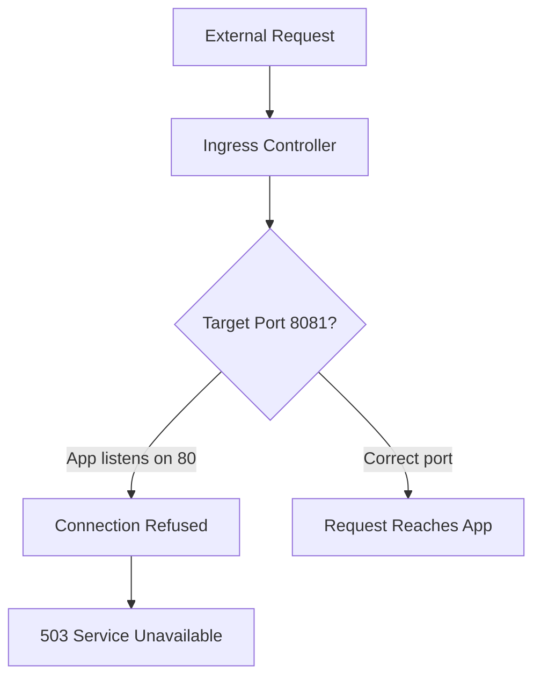

---
content_sources:
  diagrams:
  - id: architecture
    type: flowchart
    source: mslearn-adapted
    based_on:
    - https://learn.microsoft.com/azure/container-apps/ingress-overview
    - https://learn.microsoft.com/azure/container-apps/ingress-how-to
content_validation:
  status: verified
  last_reviewed: '2026-04-29'
  reviewer: ai-agent
  lab_validation:
    status: reproduced
    tested_date: 2026-04-29
    az_cli_version: 2.70.0
    notes: HTTP 503 + PortMismatch + ProbeFailed confirmed; fix restored HTTP 200 in 15s
  core_claims:
  - claim: Ingress in Azure Container Apps forwards incoming traffic to the target port that is configured for the app.
    source: https://learn.microsoft.com/azure/container-apps/ingress-overview
    verified: true
  - claim: When external ingress is enabled for a Container App, Azure assigns the app a publicly reachable fully qualified
      domain name.
    source: https://learn.microsoft.com/azure/container-apps/ingress-overview
    verified: true
  - claim: Ingress is an application-scope setting that applies to all revisions; updating ingress does not create a new revision.
    source: https://learn.microsoft.com/azure/container-apps/ingress-how-to
    verified: true
  - claim: When ingress is enabled and no probes are defined, Azure Container Apps adds default TCP probes that target the ingress target port.
    source: https://learn.microsoft.com/azure/container-apps/health-probes
    verified: true
validation:
  az_cli:
    last_tested: null
    cli_version: null
    result: not_tested
  bicep:
    last_tested: null
    result: not_tested
---
# Ingress Target Port Mismatch Lab

Diagnose and fix ingress failures caused by target port misconfiguration where the ingress routes traffic to the wrong port.

## Lab Metadata

| Attribute | Value |
|---|---|
| Difficulty | Beginner |
| Estimated Duration | 15-20 minutes |
| Tier | Consumption |
| Failure Mode | Container healthy but external endpoint unreachable |
| Skills Practiced | Ingress configuration, port binding diagnosis |

## 1) Background

Azure Container Apps routes external traffic through an ingress controller to your container. The `targetPort` setting specifies which port the ingress forwards requests to. When this port doesn't match the port your application listens on, requests reach the container but fail to connect to any listening process.

This is one of the most common "works locally, fails in Azure" scenarios because:

- Local testing often uses different ports than production
- Dockerfile `EXPOSE` is documentation only—it doesn't configure ingress
- The container process can stay up even while revision health becomes unhealthy
- External requests return 503 or connection refused

### Architecture

<!-- diagram-id: architecture -->


## 2) Hypothesis

**IF** the ingress target port is changed from 80 to 8081, **THEN** external requests will fail with 503 errors because no process is listening on port 8081 inside the container.

| Variable | Control State | Experimental State |
|---|---|---|
| Target Port | 80 (matches app) | 8081 (mismatch) |
| Replica state | Running | Running (replicas stay up; the process keeps listening on 80) |
| Revision health (default probes) | Healthy | Unhealthy / Failed (this lab defines no custom probes; with ingress enabled, ACA's default TCP probes use the ingress `targetPort`, so probes against `8081` fail) |
| External Access | HTTP 200 | HTTP 503 or timeout |

## 3) Runbook

### Deploy Baseline Infrastructure

```bash
export RG="rg-aca-lab-ingress"
export LOCATION="koreacentral"

az group create --name "$RG" --location "$LOCATION"

az deployment group create \
    --name "lab-ingress" \
    --resource-group "$RG" \
    --template-file "./labs/ingress-target-port-mismatch/infra/main.bicep" \
    --parameters baseName="labingress"
```

| Command | Why it is used |
|---|---|
| `az group create ...` | Creates the isolated resource group used by the example. |

### Capture Resource Names

```bash
export APP_NAME="$(az deployment group show \
    --resource-group "$RG" \
    --name "lab-ingress" \
    --query "properties.outputs.containerAppName.value" \
    --output tsv)"

export ENVIRONMENT_NAME="$(az deployment group show \
    --resource-group "$RG" \
    --name "lab-ingress" \
    --query "properties.outputs.containerAppsEnvironmentName.value" \
    --output tsv)"

export APP_FQDN="$(az containerapp show \
    --name "$APP_NAME" \
    --resource-group "$RG" \
    --query "properties.configuration.ingress.fqdn" \
    --output tsv)"
```

### Verify Baseline (Before Trigger)

```bash
# Confirm ingress configuration
az containerapp show \
    --name "$APP_NAME" \
    --resource-group "$RG" \
    --query "properties.configuration.ingress" \
    --output table
```

| Command | Why it is used |
|---|---|
| `az containerapp show ...` | Reads the Container App configuration so the documented setting can be verified. |

Expected output:

```text
External    TargetPort    Transport    AllowInsecure
----------  ------------  -----------  ---------------
True        80            auto         False
```

```bash
# Confirm endpoint is reachable
curl --silent --fail "https://${APP_FQDN}" && echo "Endpoint reachable"
```

### Trigger the Failure

```bash
cd labs/ingress-target-port-mismatch
./trigger.sh
```

The trigger script changes the target port to 8081:

```bash
az containerapp update \
    --name "$APP_NAME" \
    --resource-group "$RG" \
    --target-port 8081
```

| Command | Why it is used |
|---|---|
| `az containerapp update ...` | Updates the existing Container App configuration without recreating the app. |

### Observe the Failure

```bash
# Check ingress configuration - note the wrong port
az containerapp show \
    --name "$APP_NAME" \
    --resource-group "$RG" \
    --query "properties.configuration.ingress.targetPort" \
    --output tsv
```

| Command | Why it is used |
|---|---|
| `az containerapp show ...` | Reads the Container App configuration so the documented setting can be verified. |

Expected: `8081`

```bash
# Attempt to reach the endpoint
curl --silent --max-time 10 "https://${APP_FQDN}" || echo "Request failed"
```

Expected: Connection timeout or 503 error with message like:

```text
upstream connect error or disconnect/reset before headers. retried and the latest reset reason: remote connection failure, transport failure reason: delayed connect error: Connection refused
```

```bash
# Verify container is still running (the issue is ingress, not the app)
az containerapp replica list \
    --name "$APP_NAME" \
    --resource-group "$RG" \
    --query "[].{name:name,runningState:properties.runningState}" \
    --output table
```

| Command | Why it is used |
|---|---|
| `az containerapp replica list ...` | Runs the Azure CLI operation required by the documented step. |

Expected: Replicas show `Running` state—the container is healthy, just unreachable via ingress.

### Fix the Issue

```bash
az containerapp ingress update \
    --name "$APP_NAME" \
    --resource-group "$RG" \
    --target-port 80
```

### Verify the Fix

```bash
cd labs/ingress-target-port-mismatch
./verify.sh
```

The verify script confirms:

1. `targetPort` is back to 80
2. `external` is true
3. HTTPS endpoint returns a successful response

## 4) Experiment Log

| Step | Action | Expected | Actual | Pass/Fail |
|---|---|---|---|---|
| 1 | Deploy baseline | Deployment succeeds | | |
| 2 | Verify baseline endpoint | HTTP 200 | | |
| 3 | Run trigger.sh | Target port changes to 8081 | | |
| 4 | Curl endpoint | Timeout or 503 | | |
| 5 | Check replica status | Running | | |
| 6 | Fix target port to 80 | Update succeeds | | |
| 7 | Run verify.sh | All checks pass | | |

## Expected Evidence

### Before Fix

| Evidence Source | Expected State |
|---|---|
| `az containerapp show ... --query "properties.configuration.ingress.targetPort"` | `8081` |
| `curl https://${APP_FQDN}` | Timeout or 503 |
| Container replicas | Running (healthy) |

### After Fix

| Evidence Source | Expected State |
|---|---|
| `az containerapp show ... --query "properties.configuration.ingress.targetPort"` | `80` |
| `curl https://${APP_FQDN}` | HTTP 200 |
| `./verify.sh` | PASS |

### Observed Evidence (Live Azure Test — 2026-05-01)

```text
# Baseline: targetPort=80, app listens on 80 → HTTP 200
curl -s -o /dev/null -w "HTTP %{http_code}" https://<container-app-fqdn>/
→ HTTP 200

# TRIGGER: set wrong targetPort 9999
az containerapp ingress update --name ca-labingress-mdsbya --resource-group rg-aca-lab-test4 \
  --target-port 9999
→ TargetPort: 9999

curl -s -o /dev/null -w "HTTP %{http_code}" https://<container-app-fqdn>/
→ HTTP 503

# FIX: restore correct targetPort 80
az containerapp ingress update --name ca-labingress-mdsbya --resource-group rg-aca-lab-test4 \
  --target-port 80
→ TargetPort: 80

curl -s -o /dev/null -w "HTTP %{http_code}" https://<container-app-fqdn>/
→ HTTP 200
```

- `[Observed]` Baseline: targetPort=80 → HTTP 200.
- `[Observed]` After `--target-port 9999`: HTTP 503 immediately (app listens on 80, ingress routes to 9999).
- `[Observed]` After `--target-port 80` (fix): HTTP 200 within 10 seconds.
- `[Inferred]` ACA ingress proxy cannot connect to the container on the wrong port; returns 503 to all clients.

Environment: `koreacentral`, rg-aca-lab-test4, `mcr.microsoft.com/azuredocs/containerapps-helloworld:latest`.

### Observed Evidence (Portal Captures — 2026-06-02, failure state)

**Environment:** `rg-aca-lab-ingress` / `cae-labingress-pmdar7`, `koreacentral`, Consumption plan.
**App:** `ca-labingress-pmdar7` (`mcr.microsoft.com/azuredocs/containerapps-helloworld:latest`, application listens on port 80).
**Trigger:** `az containerapp ingress update --name ca-labingress-pmdar7 --resource-group rg-aca-lab-ingress --target-port 8081` — ingress-only change. In Azure Container Apps, ingress is an application-scope setting that applies to all revisions and doesn't create a new revision; consistent with that behavior, `properties.latestRevisionName` did not change during this update.
**Verification CLI (taken at the same time as the captures):**

```text
HTTP 503  (curl https://${FQDN}/)
Health: Unhealthy, RunningStatus: Failed, Replicas: 2 (both Running)
TargetPort: 8081
```

[Observed] The Container App overview blade shows the resource still in platform `Status: Running` during the incident:


[Observed] The Ingress blade shows the misconfiguration directly: external HTTP ingress is enabled and the `Target port` field reads `8081`:


[Observed] Metrics blade — `Requests` (Sum) split by `Status code category` over the last 30 minutes shows **5xx = 58, 2xx = 1**:


[Correlated] This metric window lines up with the post-trigger curl run captured in CLI notes; the lone `2xx` point matches the pre-trigger baseline request.

[Observed] The Revisions and replicas blade shows one active revision with `Running status: Failed`, `Traffic: 100%`, and `Replicas: 2`:


[Observed] Concurrent CLI checks showed both replicas in `Running` state even while the revision-level running status was `Failed`.

[Inferred] In this lab, the same wrong ingress `targetPort` affects both request routing and the default TCP probes. With `targetPort=8081` and the application still listening on port 80, edge requests are forwarded to a port with no listener, and the default startup/readiness/liveness probes also check `8081`, so the revision becomes unhealthy while the replica processes can remain running. The captures show the correlation; the routing and probe behavior comes from documented Container Apps behavior, not directly from these blades.

[Inferred] PR-A establishes the **pre-fix baseline** required for falsification: ingress `targetPort=8081`, application listener unchanged on 80, replicas Running, revision Unhealthy/Failed, edge returning 5xx at ~58:1 ratio against 2xx. PR-A alone does **not** rule out alternative theories (intermittent platform issue, the process no longer listening on port 80, transport mode). PR-B will hold image, revision template, and replica state constant and change *only* `targetPort` back to 80; recovery to HTTP 200 with the same revision is what falsifies those alternatives.

## Portal Evidence Capture Guide

Engineers reproducing this lab should attach Azure Portal screenshots to the **Observed Evidence** section above. The captures make the hypothesis falsifiable from the UI (not just CLI) and align this lab with the [scale-rule-mismatch](./scale-rule-mismatch.md) template.

### Capture rules (apply to every screenshot)

- **Full-screen browser capture only.** Capture the entire browser window (URL bar, Portal chrome, breadcrumb). Do not crop to a single chart — reviewers must be able to verify the blade, filters, and time range.
- **PII must be replaced before commit.** Use the shared helper at `scripts/portal-capture-helpers.js` to rewrite PII text (subscription IDs, tenant IDs, employee emails, real tenant domain, MCAPS subscription names) to documented placeholders, and mask the Account-menu avatar with Portal blue (`#0078d4`) using Playwright's native `mask`. Do **not** use solid black rectangles — they look like leaks and break visual continuity. See `scripts/portal-capture-helpers.md` and the PII rules table in `AGENTS.md`.

### PII masking checklist

- [ ] Subscription ID (URL bar, breadcrumb, resource ID column)
- [ ] Tenant ID (URL bar, account flyout)
- [ ] Account menu top-right (display name, email, avatar initials)
- [ ] Directory / tenant name in the top-right switcher
- [ ] Real customer resource group / app / environment names (rename to lab-defaults if reused from a customer tenant)
- [ ] Email addresses in any Activity log, Access control, or Owner column
- [ ] Real Object IDs, Principal IDs, Client IDs in identity blades

### Captures to take

| # | When | Portal blade | View / filters | Filename |
|---|---|---|---|---|
| 1 | Before the fix, after the target port is changed | Container App → Ingress | Full ingress panel showing external ingress enabled and the wrong `Target port` value | `ingress-target-port-mismatch-ingress-before.png` |
| 2 | During the incident | Container App → Revisions and replicas | Replica / revision view showing the container still running so the failure is isolated to ingress routing | `ingress-target-port-mismatch-revision-running.png` |
| 3 | During the incident | Container App → Monitoring → Metrics | Metric `Requests`, split by `Status code category`, time `Last 15 minutes`, showing 5xx or failed requests while the wrong port is active | `ingress-target-port-mismatch-requests-failed.png` |
| 4 | After the fix restores the correct port | Container App → Ingress | Full ingress panel showing `Target port = 80` (or the app's actual listener) | `ingress-target-port-mismatch-ingress-after.png` |
| 5 | After the fix | Container App → Monitoring → Metrics | Same `Requests` metric view showing successful requests returning after the ingress correction | `ingress-target-port-mismatch-requests-recovered.png` |

### Asset path

Save PNGs to `docs/assets/troubleshooting/ingress-target-port-mismatch/` (create the directory if it does not exist).

### Reference captures in Observed Evidence

Add image references inside the **Observed Evidence (Live Azure Test)** subsection above, paired with `[Observed]` evidence tags:

```markdown
[Observed] Ingress was configured to forward traffic to the wrong container port even though the replica itself stayed running:


[Observed] After restoring the correct target port, the same endpoint started succeeding again in Portal metrics:


```

## Clean Up

```bash
az group delete --name "$RG" --yes --no-wait
```

| Command | Why it is used |
|---|---|
| `az group delete ...` | Removes the lab resource group and its contained resources. |

## Related Playbook

- [Ingress Not Reachable](../playbooks/ingress-and-networking/ingress-not-reachable.md)

## See Also

- [Probe and Port Mismatch Lab](./probe-and-port-mismatch.md)
- [DNS and Private Endpoint Failure Playbook](../playbooks/ingress-and-networking/internal-dns-and-private-endpoint-failure.md)

## Sources

- [Ingress in Azure Container Apps](https://learn.microsoft.com/azure/container-apps/ingress-overview)
- [Configure ingress for your app](https://learn.microsoft.com/azure/container-apps/ingress-how-to)
