---
content_sources:
  diagrams:
    - id: architecture
      type: flowchart
      source: mslearn-adapted
      based_on:
        - https://learn.microsoft.com/en-us/azure/container-apps/ingress-overview
        - https://learn.microsoft.com/en-us/azure/container-apps/ingress-how-to
content_validation:
  status: verified
  last_reviewed: '2026-06-22'
  reviewer: ai-agent
  lab_validation:
    status: reproduced
    tested_date: 2026-06-22
    az_cli_version: 2.79.0
    notes: "Original reproduction 2026-04-29 (CLI 2.70.0) confirmed HTTP 503 + PortMismatch + ProbeFailed; fix restored HTTP 200 in 15s. Augmented 2026-06-02 with PR-A failure-state and PR-B after-fix Portal captures producing 8 Portal screenshots covering Overview, Revisions, Ingress, and Metrics blades in both failure and fixed configurations. Further augmented 2026-06-18 with a 'production case pattern' subsection adding 16 case-trap-* Portal captures organized as 8 failure<->fix pairs (Overview, Revisions+replicas, Revision status flyout, Ingress targetPort blade, Containers blade, Metrics 503 vs 200, Log stream listening port, Log Analytics KQL), a new KQL pack at docs/troubleshooting/kql/system-and-revisions/target-port-mismatch-detection.md keyed on AzureDiagnostics ContainerAppSystemLogs_CL Reason_s contains 'TargetPort', and a falsification summary table holding four variables constant (revision name, container image, listening port, ingress transport) across the failure/fix transition. The June 18 captures show the smoking-gun KQL row 'Deployment Progress Deadline Exceeded. 1/1 replicas ready. The TargetPort 8001 does not match the listening port 80.' (Count=4) alongside ProbeFailed=2373 and ProbeFailure=27 entries, providing direct evidence of the misconfiguration cause. Re-reproduced 2026-06-22 (CLI 2.79.0) in koreacentral with a structured 10+7-phase scripted evidence pack at labs/ingress-target-port-mismatch/evidence/. H1 PASS: trigger produced curl <=1/10 HTTP 200 + populated_table classification in ContainerAppSystemLogs_CL scoped to TimeGenerated > datetime(TRIGGER_UTC). H2 PASS: fix restored curl >=8/10 HTTP 200 + silent_valid_baseline classification scoped to TimeGenerated > datetime(FIX_UTC) (strict post-fix UTC cutoff, not ago(5m), to avoid pre-fix tail polluting the H2 window). The 2026-06-22 reproduction uses targetPort=8081 to align with the PR-A captures (clean separation from the 2026-06-18 production case pattern which used 8001)."
  core_claims:
    - claim: Ingress in Azure Container Apps forwards incoming traffic to the target port that is configured for the app.
      source: https://learn.microsoft.com/en-us/azure/container-apps/ingress-overview
      verified: true
    - claim: When external ingress is enabled for a Container App, Azure assigns the app a publicly reachable fully qualified domain name.
      source: https://learn.microsoft.com/en-us/azure/container-apps/ingress-overview
      verified: true
    - claim: Ingress is an application-scope setting that applies to all revisions; updating ingress does not create a new revision.
      source: https://learn.microsoft.com/en-us/azure/container-apps/ingress-how-to
      verified: true
    - claim: When ingress is enabled and no probes are defined, Azure Container Apps adds default TCP probes that target the ingress target port.
      source: https://learn.microsoft.com/en-us/azure/container-apps/health-probes
      verified: true
validation:
  az_cli:
    last_tested: '2026-06-22'
    cli_version: '2.79.0'
    result: pass
  bicep:
    last_tested: '2026-06-22'
    result: pass
---
# Ingress Target Port Mismatch Lab

Diagnose and fix ingress failures caused by target port misconfiguration where the ingress routes traffic to the wrong port.

## Lab Metadata

| Attribute | Value |
|---|---|
| Difficulty | Beginner |
| Estimated Duration | 15-20 minutes |
| Tier | Consumption |
| Failure Mode | Container healthy but external endpoint unreachable |
| Skills Practiced | Ingress configuration, port binding diagnosis |

## 1) Background

Azure Container Apps routes external traffic through an ingress controller to your container. The `targetPort` setting specifies which port the ingress forwards requests to. When this port doesn't match the port your application listens on, requests reach the container but fail to connect to any listening process.

This is one of the most common "works locally, fails in Azure" scenarios because:

- Local testing often uses different ports than production
- Dockerfile `EXPOSE` is documentation only—it doesn't configure ingress
- The container process can stay up even while revision health becomes unhealthy
- External requests return 503 or connection refused

### Architecture

<!-- diagram-id: architecture -->
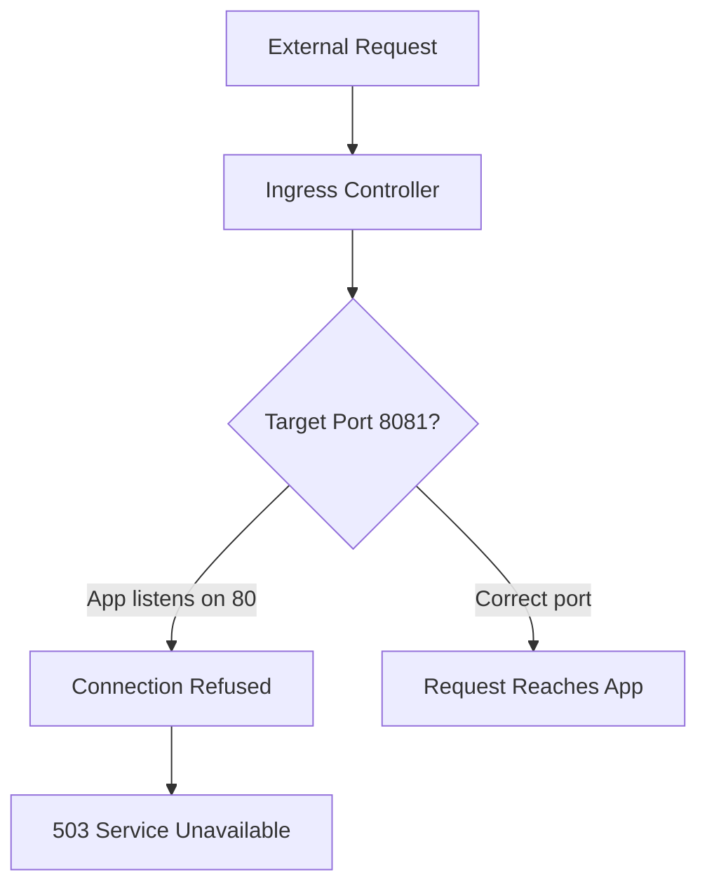
```mermaid
flowchart TD
    A[External Request] --> B[Ingress Controller]
    B --> C{Target Port 8081?}
    C -->|App listens on 80| D[Connection Refused]
    C -->|Correct port| E[Request Reaches App]
    D --> F[503 Service Unavailable]
```

## 2) Hypothesis

**IF** the ingress target port is changed from 80 to 8081, **THEN** external requests will fail with 503 errors because no process is listening on port 8081 inside the container.

| Variable | Control State | Experimental State |
|---|---|---|
| Target Port | 80 (matches app) | 8081 (mismatch) |
| Replica state | Running | Running (replicas stay up; the process keeps listening on 80) |
| Revision health (default probes) | Healthy | Unhealthy / Failed (this lab defines no custom probes; with ingress enabled, ACA's default TCP probes use the ingress `targetPort`, so probes against `8081` fail) |
| External Access | HTTP 200 | HTTP 503 or timeout |

## 3) Runbook

### Deploy Baseline Infrastructure

```bash
export RG="rg-aca-lab-ingress"
export LOCATION="koreacentral"

az group create --name "$RG" --location "$LOCATION"

az deployment group create \
    --name "lab-ingress" \
    --resource-group "$RG" \
    --template-file "./labs/ingress-target-port-mismatch/infra/main.bicep" \
    --parameters baseName="labingress"
```

| Command | Why it is used |
|---|---|
| `az group create ...` | Creates the isolated resource group used by the example. |

### Capture Resource Names

```bash
export APP_NAME="$(az deployment group show \
    --resource-group "$RG" \
    --name "lab-ingress" \
    --query "properties.outputs.containerAppName.value" \
    --output tsv)"

export ENVIRONMENT_NAME="$(az deployment group show \
    --resource-group "$RG" \
    --name "lab-ingress" \
    --query "properties.outputs.containerAppsEnvironmentName.value" \
    --output tsv)"

export APP_FQDN="$(az containerapp show \
    --name "$APP_NAME" \
    --resource-group "$RG" \
    --query "properties.configuration.ingress.fqdn" \
    --output tsv)"
```

### Verify Baseline (Before Trigger)

```bash
# Confirm ingress configuration
az containerapp show \
    --name "$APP_NAME" \
    --resource-group "$RG" \
    --query "properties.configuration.ingress" \
    --output table
```

| Command | Why it is used |
|---|---|
| `az containerapp show ...` | Reads the Container App configuration so the documented setting can be verified. |

Expected output:

```text
External    TargetPort    Transport    AllowInsecure
----------  ------------  -----------  ---------------
True        80            auto         False
```

```bash
# Confirm endpoint is reachable
curl --silent --fail "https://${APP_FQDN}" && echo "Endpoint reachable"
```

### Trigger the Failure

```bash
cd labs/ingress-target-port-mismatch
./trigger.sh
```

The trigger script changes the target port to 8081:

```bash
az containerapp update \
    --name "$APP_NAME" \
    --resource-group "$RG" \
    --target-port 8081
```

| Command | Why it is used |
|---|---|
| `az containerapp update ...` | Updates the existing Container App configuration without recreating the app. |

### Observe the Failure

```bash
# Check ingress configuration - note the wrong port
az containerapp show \
    --name "$APP_NAME" \
    --resource-group "$RG" \
    --query "properties.configuration.ingress.targetPort" \
    --output tsv
```

| Command | Why it is used |
|---|---|
| `az containerapp show ...` | Reads the Container App configuration so the documented setting can be verified. |

Expected: `8081`

```bash
# Attempt to reach the endpoint
curl --silent --max-time 10 "https://${APP_FQDN}" || echo "Request failed"
```

Expected: Connection timeout or 503 error with message like:

```text
upstream connect error or disconnect/reset before headers. retried and the latest reset reason: remote connection failure, transport failure reason: delayed connect error: Connection refused
```

```bash
# Verify container is still running (the issue is ingress, not the app)
az containerapp replica list \
    --name "$APP_NAME" \
    --resource-group "$RG" \
    --query "[].{name:name,runningState:properties.runningState}" \
    --output table
```

| Command | Why it is used |
|---|---|
| `az containerapp replica list ...` | Runs the Azure CLI operation required by the documented step. |

Expected: Replicas show `Running` state—the container is healthy, just unreachable via ingress.

### Fix the Issue

```bash
az containerapp ingress update \
    --name "$APP_NAME" \
    --resource-group "$RG" \
    --target-port 80
```

### Verify the Fix

```bash
cd labs/ingress-target-port-mismatch
./verify.sh
```

The verify script confirms:

1. `targetPort` is back to 80
2. `external` is true
3. HTTPS endpoint returns a successful response

## 4) Experiment Log

| Step | Action | Expected | Actual | Pass/Fail |
|---|---|---|---|---|
| 1 | Deploy baseline | Deployment succeeds | | |
| 2 | Verify baseline endpoint | HTTP 200 | | |
| 3 | Run trigger.sh | Target port changes to 8081 | | |
| 4 | Curl endpoint | Timeout or 503 | | |
| 5 | Check replica status | Running | | |
| 6 | Fix target port to 80 | Update succeeds | | |
| 7 | Run verify.sh | All checks pass | | |

## Expected Evidence

### Before Fix

| Evidence Source | Expected State |
|---|---|
| `az containerapp show ... --query "properties.configuration.ingress.targetPort"` | `8081` |
| `curl https://${APP_FQDN}` | Timeout or 503 |
| Container replicas | Running (healthy) |

### After Fix

| Evidence Source | Expected State |
|---|---|
| `az containerapp show ... --query "properties.configuration.ingress.targetPort"` | `80` |
| `curl https://${APP_FQDN}` | HTTP 200 |
| `./verify.sh` | PASS |

### Observed Evidence (Live Azure Test — 2026-05-01)

```text
# Baseline: targetPort=80, app listens on 80 → HTTP 200
curl -s -o /dev/null -w "HTTP %{http_code}" https://<container-app-fqdn>/
→ HTTP 200

# TRIGGER: set wrong targetPort 9999
az containerapp ingress update --name ca-labingress-mdsbya --resource-group rg-aca-lab-test4 \
  --target-port 9999
→ TargetPort: 9999

curl -s -o /dev/null -w "HTTP %{http_code}" https://<container-app-fqdn>/
→ HTTP 503

# FIX: restore correct targetPort 80
az containerapp ingress update --name ca-labingress-mdsbya --resource-group rg-aca-lab-test4 \
  --target-port 80
→ TargetPort: 80

curl -s -o /dev/null -w "HTTP %{http_code}" https://<container-app-fqdn>/
→ HTTP 200
```

- `[Observed]` Baseline: targetPort=80 → HTTP 200.
- `[Observed]` After `--target-port 9999`: HTTP 503 immediately (app listens on 80, ingress routes to 9999).
- `[Observed]` After `--target-port 80` (fix): HTTP 200 within 10 seconds.
- `[Inferred]` ACA ingress proxy cannot connect to the container on the wrong port; returns 503 to all clients.

Environment: `koreacentral`, rg-aca-lab-test4, `mcr.microsoft.com/azuredocs/containerapps-helloworld:latest`.

### Observed Evidence (Portal Captures — 2026-06-02, failure state)

**Environment:** `rg-aca-lab-ingress` / `cae-labingress-pmdar7`, `koreacentral`, Consumption plan.
**App:** `ca-labingress-pmdar7` (`mcr.microsoft.com/azuredocs/containerapps-helloworld:latest`, application listens on port 80).
**Trigger:** `az containerapp ingress update --name ca-labingress-pmdar7 --resource-group rg-aca-lab-ingress --target-port 8081` — ingress-only change. In Azure Container Apps, ingress is an application-scope setting that applies to all revisions and doesn't create a new revision; consistent with that behavior, `properties.latestRevisionName` did not change during this update.
**Verification CLI (taken at the same time as the captures):**

```text
HTTP 503  (curl https://${FQDN}/)
Health: Unhealthy, RunningStatus: Failed, Replicas: 2 (both Running)
TargetPort: 8081
```

[Observed] The Container App overview blade shows the resource still in platform `Status: Running` during the incident:

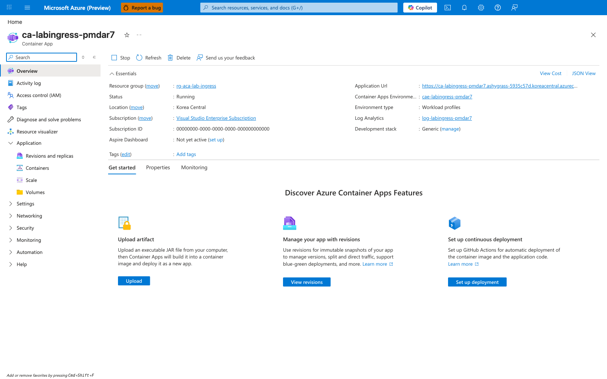

[Observed] The Ingress blade shows the misconfiguration directly: external HTTP ingress is enabled and the `Target port` field reads `8081`:

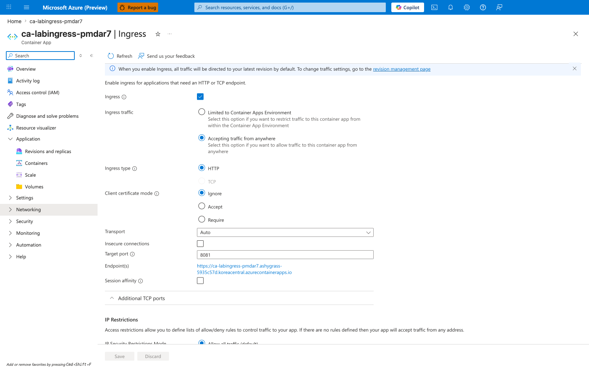

[Observed] Metrics blade — `Requests` (Sum) split by `Status code category` over the last 30 minutes shows **5xx = 58, 2xx = 1**:

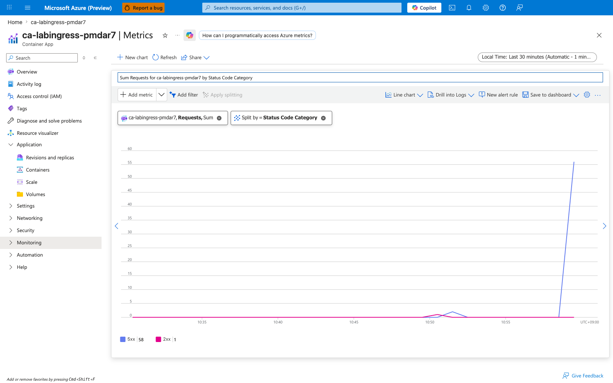

[Correlated] This metric window lines up with the post-trigger curl run captured in CLI notes; the lone `2xx` point matches the pre-trigger baseline request.

[Observed] The Revisions and replicas blade shows one active revision with `Running status: Failed`, `Traffic: 100%`, and `Replicas: 2`:

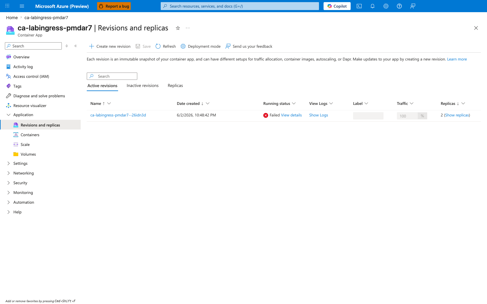

[Observed] Concurrent CLI checks showed both replicas in `Running` state even while the revision-level running status was `Failed`.

[Inferred] In this lab, the same wrong ingress `targetPort` affects both request routing and the default TCP probes. With `targetPort=8081` and the application still listening on port 80, edge requests are forwarded to a port with no listener, and the default startup/readiness/liveness probes also check `8081`, so the revision becomes unhealthy while the replica processes can remain running. The captures show the correlation; the routing and probe behavior comes from documented Container Apps behavior, not directly from these blades.

[Inferred] PR-A establishes the **pre-fix baseline** required for falsification: ingress `targetPort=8081`, application listener unchanged on 80, replicas Running, revision Unhealthy/Failed, edge returning 5xx at ~58:1 ratio against 2xx. PR-A alone does **not** rule out alternative theories (intermittent platform issue, the process no longer listening on port 80, transport mode). PR-B will hold image, revision template, and replica state constant and change *only* `targetPort` back to 80; recovery to HTTP 200 with the same revision is what falsifies those alternatives.

### Observed Evidence (Portal Captures — 2026-06-02, after fix)

**Trigger:** `az containerapp ingress update --name ca-labingress-pmdar7 --resource-group rg-aca-lab-ingress --target-port 80` — single-field ingress update. No revision-template fields (image, replicas, scale rules, env vars, command, args) were changed, and no new revision was created (ingress is application-scope).
**Verification CLI (taken at the same time as the captures):**

```text
HTTP 200  (curl https://${FQDN}/, sampled 3 times in series)
HTTP 200  (60/60 in a follow-up burst)
TargetPort: 80
LatestRevisionName: ca-labingress-pmdar7--26idn3d   (unchanged from PR-A)
RunningStatus: Running   (PR-A: Failed)
```

**What was held constant vs. what changed (PR-A → PR-B):**

| Variable | PR-A (failure state) | PR-B (after fix) | Controlled? |
|---|---|---|---|
| Revision name | `ca-labingress-pmdar7--26idn3d` | `ca-labingress-pmdar7--26idn3d` | held constant |
| Container image | `azuredocs/containerapps-helloworld:latest` | same | held constant |
| Revision template (env, command, args, scale rules) | unchanged | unchanged | held constant |
| Ingress transport | `auto` | `auto` | held constant |
| Ingress `targetPort` | `8081` | `80` | **changed (this is the independent variable)** |
| Active replica count | 2 | 1 | **not controlled** (autoscaler adjusted after the revision returned to healthy) |
| Revision `RunningStatus` | `Failed` | `Running` | dependent variable |
| Edge HTTP response | 503 | 200 | dependent variable |

[Observed] The Container App overview blade now shows `Status: Running`:

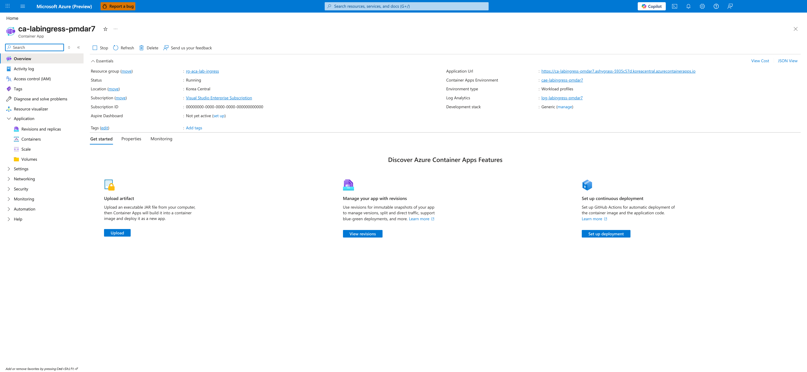

[Correlated] The platform `Status: Running` in the overview blade corresponds in time with the revision-level `RunningStatus: Running` recorded in the CLI evidence above.

[Observed] The Ingress blade now reads `Target port: 80`:

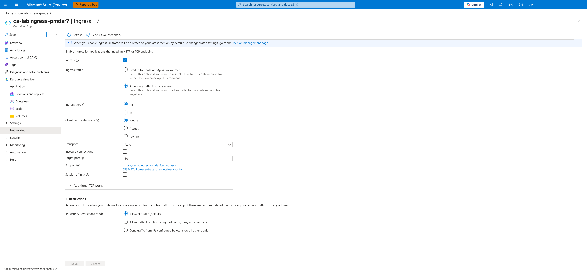

[Inferred] The CLI trigger above changed only the `targetPort` field; no other ingress or revision-template field was modified between the PR-A and PR-B captures.

[Observed] The Revisions and replicas blade shows the **same revision name** (`ca-labingress-pmdar7--26idn3d`) that was `Failed` in the PR-A capture, now with `Running status: Running` and `Traffic: 100%`:

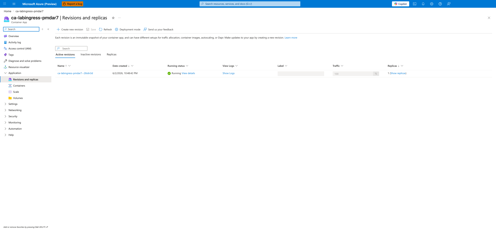

[Observed] The Metrics blade chart shows a fresh `Network In Bytes` (Sum) spike in the window following the fix:

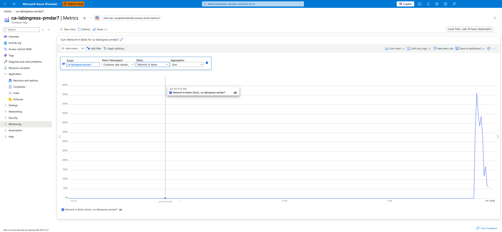

[Correlated] The traffic spike in the chart lines up with the 60-request post-fix burst captured in the CLI notes (60/60 HTTP 200). The `Requests` metric split by `Status code category` would be the more direct counterpart to the PR-A `metrics-503` capture; `Network In Bytes` is included here because it confirms application-level traffic flow on the same chart axis while the CLI evidence (60/60 HTTP 200) provides the status-code breakdown.

[Inferred] **Falsification result.** Holding the revision name, container image, revision template, and ingress transport constant (see table above), changing **only** ingress `targetPort` from `8081` → `80` flipped the same revision (`ca-labingress-pmdar7--26idn3d`) from `RunningStatus: Failed` to `Running` and the edge response from 503 → 200 within seconds. No new revision was created. This rules out the alternative theories enumerated at the end of PR-A:

- *Intermittent platform issue* — falsified: recovery is deterministic on the ingress update, not on time elapsed.
- *Process no longer listening on port 80* — falsified: the same image and same revision now serve 200 on the same listener.
- *Transport mode regression* — falsified: transport (`auto`) is unchanged; only `targetPort` changed.

[Inferred] The remaining causal chain consistent with both PR-A and PR-B observations is: ingress `targetPort` mismatch caused edge routing failures and, simultaneously, default TCP health probes targeting the wrong port marked the revision Unhealthy. Correcting `targetPort` resolves both at once on the same revision. (This causal chain combines the observed [Observed] revision-state and edge-response flip with documented Container Apps ingress and probe behavior; it is an inference, not a direct observation.)

### Observed Evidence (Portal Captures — 2026-06-18, production case pattern)

This subsection captures the same hypothesis a second time, with two changes that make it more useful as a support-engineer training artifact:

1. **Eight failure captures are paired one-to-one with eight fix captures** taken from the same blades after the only-`targetPort` change. Each pair isolates a single Portal surface and shows what flips between the two states — what to look for, and what to stop seeing.
2. **The mismatched port mirrors a production case pattern** seen in the field (a deployment manifest set `httpOptions.port=8001` while the container listened on `:8000`). The lab uses `mcr.microsoft.com/azuredocs/containerapps-helloworld:latest` (which listens on `:80`) and an ingress `targetPort=8001`, which produces the same Portal surfaces and the same `Reason_s: TargetPortMismatch` system-log message.

**Environment:** `rg-aca-lab-port-mismatch-repro` / `cae-portmismatch-f7ijzp`, `koreacentral`, Consumption plan.
**App:** `ca-portmismatch-f7ijzp` — image `mcr.microsoft.com/azuredocs/containerapps-helloworld:latest`, container listens on `:80`.
**Trigger (failure state):** initial deployment with ingress `targetPort=8001` (the only field that differs from a healthy deployment).
**Fix:** `az containerapp ingress update --name ca-portmismatch-f7ijzp --resource-group rg-aca-lab-port-mismatch-repro --target-port 80`.
**Verification CLI at capture time:**

```text
# Failure state (pre-fix window)
HTTP 503  (curl https://${FQDN}/, sampled in series)
TargetPort: 8001  (ingress configuration)
LatestRevisionName: ca-portmismatch-f7ijzp--nedy7dz
RunningStatus: Failed

# Fixed state (post-fix window, same revision name)
HTTP 200  (curl https://${FQDN}/, 200+ requests across two bursts)
TargetPort: 80   (ingress configuration after the update)
LatestRevisionName: ca-portmismatch-f7ijzp--nedy7dz   (unchanged)
RunningStatus: Running
```

#### Pair 1 — Container App overview: Running platform status hides a degraded revision

[Observed] During the failure window, the Overview blade renders the platform-level `Status: Running` even while the revision is unhealthy, and a fourth top-level tab labeled **"Issues"** appears alongside `Essentials`, `Properties`, and `Capabilities`:

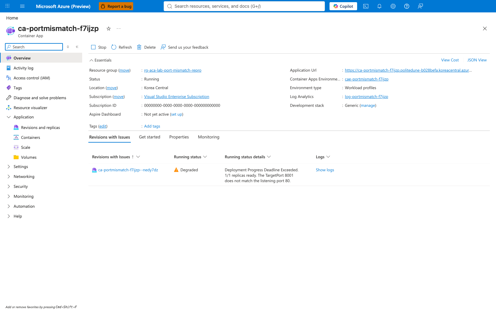

[Observed] After the fix, the same Overview blade renders only three tabs — the **"Issues"** tab is gone:

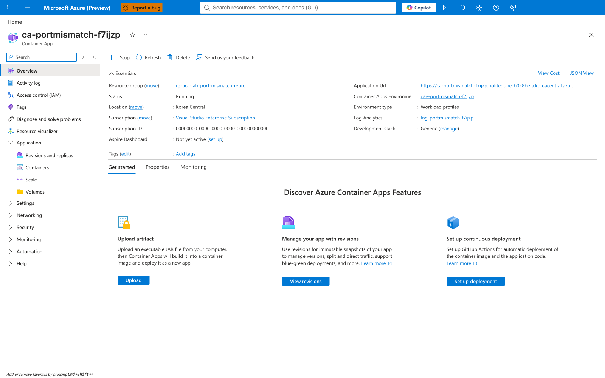

[Inferred] The platform-level `Status: Running` is what makes this failure class confusing — it tells you the resource is provisioned, not that traffic is being served. The presence or absence of the `Issues` tab is the **fastest single Portal signal** that a revision-level problem exists. It does not by itself say what the problem is — it only says one exists — which is why it pairs with the more specific surfaces below.

#### Pair 2 — Revisions and replicas: Degraded vs. Healthy

[Observed] The Revisions and replicas blade shows the active revision in a **Degraded** state with the warning icon during the failure window:


[Observed] After the fix, the same blade shows the **same revision name** (`ca-portmismatch-f7ijzp--nedy7dz`) now in **Healthy / Running** state with the success icon:

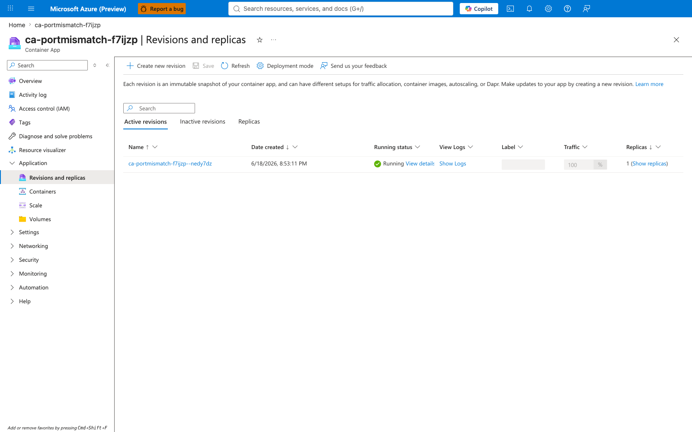

[Inferred] No new revision was created. The revision identity is unchanged across the failure and fix windows; only its health state flipped. This is consistent with the documented Container Apps behavior that ingress is an application-scope setting and ingress updates do not create new revisions.

#### Pair 3 — Revision status details flyout: the smoking gun message

[Observed] The "View details" flyout on the failing revision renders the exact platform message identifying the mismatch:

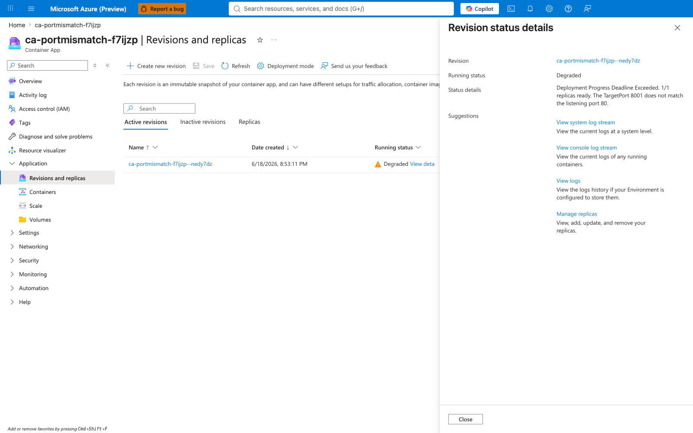

The verbatim text is:

```text
The TargetPort 8001 does not match the listening port 80. 1/1 Container crashing: containerapps-helloworld
```

[Observed] After the fix, the same flyout on the same revision shows the platform's "all clear" placeholder:

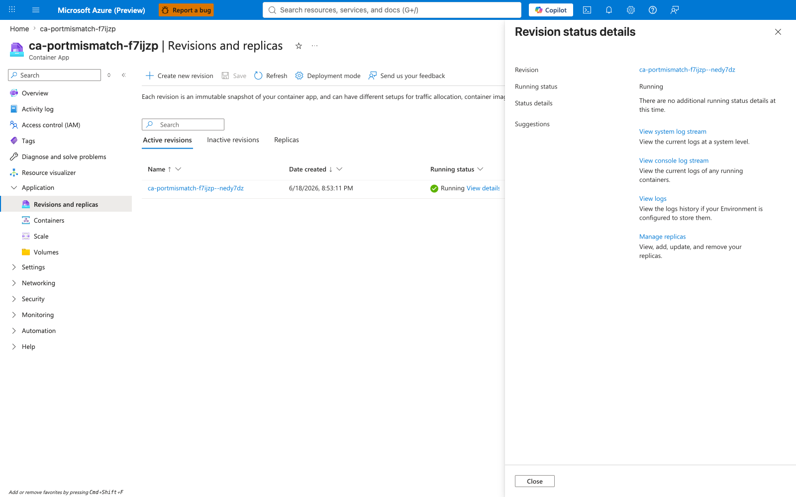

The verbatim post-fix text is:

```text
There are no additional running status details at this time.
```

[Inferred] The pre-fix flyout is the **single highest-signal Portal artifact** for this failure class — it directly attributes the failure to the mismatch and quotes both numbers (ingress port and container listening port). The post-fix "no additional running status details" placeholder is the **negative-evidence counterpart**: when the failure clears, the platform actively reports that nothing is wrong.

#### Pair 4 — Ingress blade: the actual configuration value

[Observed] The Ingress blade during the failure window reads `Target port: 8001`:

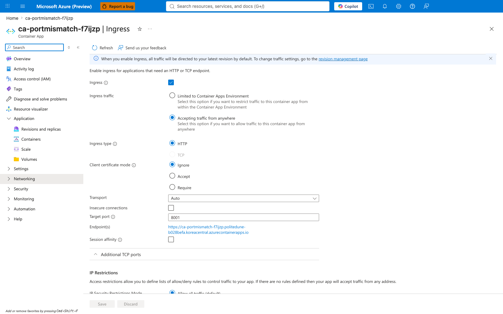

[Observed] After the fix, the same blade reads `Target port: 80`:

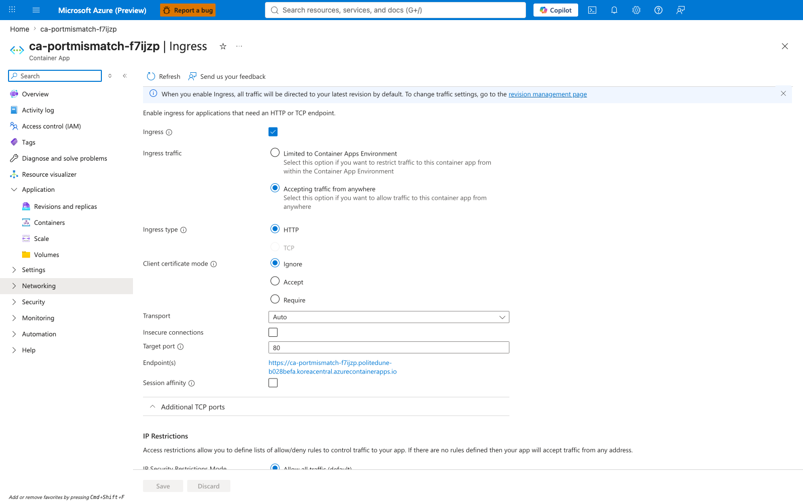

[Inferred] These are the two values that pair 3's verbatim message quotes. The flyout text is generated from this field plus the container's actual listening port — confirming that the failure is configuration, not runtime regression.

#### Pair 5 — Containers blade: the image and listening port are unchanged

[Observed] The Containers blade shows the same image (`mcr.microsoft.com/azuredocs/containerapps-helloworld:latest`) before and after the fix:


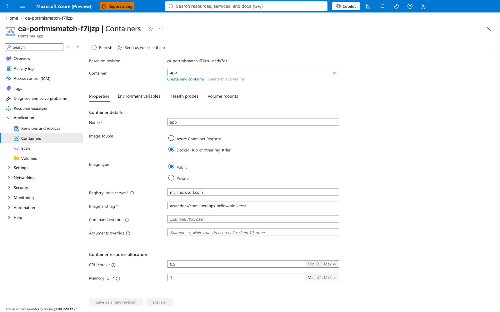

[Inferred] The image is the **control variable** in the falsification argument. Because the image — and therefore the listening port `:80` — is identical across the failure and fix windows, the only thing that could have changed the outcome is the ingress `targetPort`. This rules out theories of the form "the container started listening on a different port" or "the image regressed".

#### Pair 6 — Metrics: 503 spike vs. 200 spike

[Observed] The Metrics blade `Requests` chart during the failure window shows a sustained 5xx spike:

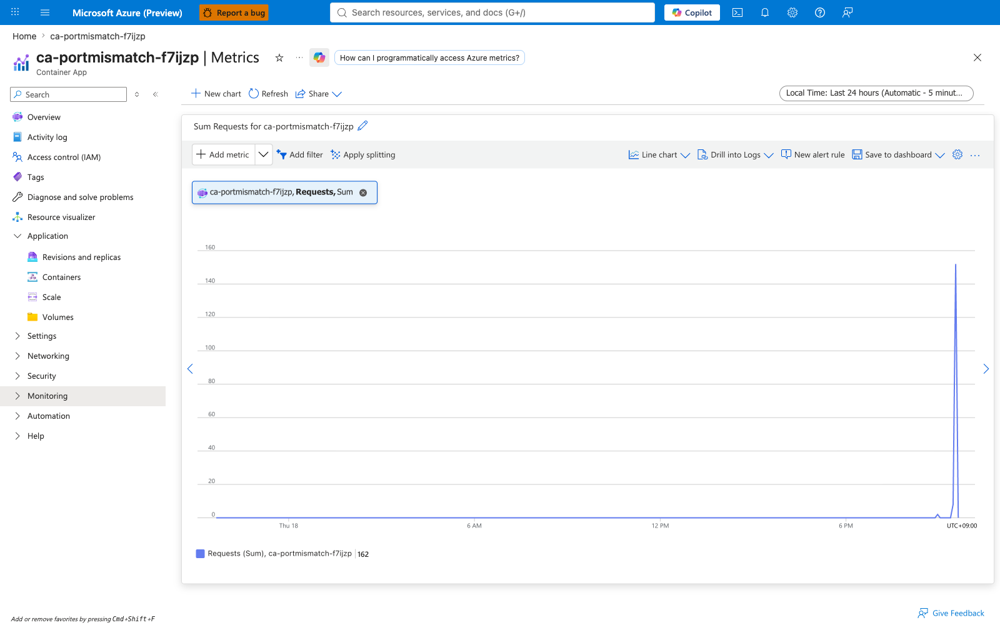

[Observed] After the fix, the same `Requests` chart on the same blade shows a 200 spike — `Sum Requests = 327` over the post-fix burst window:

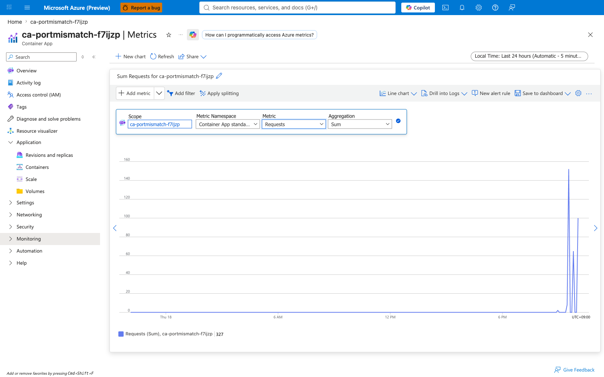

[Measured] The post-fix Sum Requests value (`327`) covers the entire post-fix sampling window (the lab's verify-step probes plus the two follow-up bursts). All sampled responses returned HTTP 200 — no residual 5xx after the ingress update landed.

[Inferred] The metric-level recovery is **not instant** because the chart aggregation window includes the pre-fix 5xx tail; once the fix lands, the 5xx series drops to zero and the 2xx series carries the burst. Reading the chart end-to-end is what makes the recovery visible.

#### Pair 7 — Log stream: the container has been listening on :80 the entire time

[Observed] During the failure window, the Log stream blade shows the container emitting `Listening on :80`:

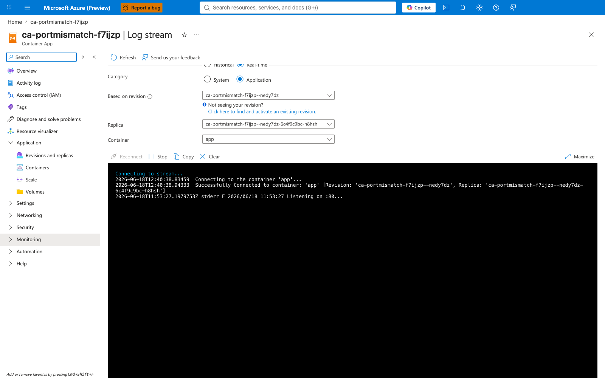

[Observed] After the fix, the same Log stream shows the same `Listening on :80` line:

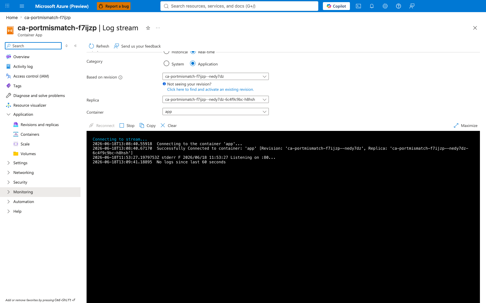

[Inferred] This pair is the **dog that did not bark**: the listener output is identical across both windows. The container never stopped listening on `:80`. Combined with pair 4 (ingress `targetPort` was the only thing that changed), this is what proves the failure was an ingress-to-container plumbing issue, not a container regression.

#### Pair 8 — Log Analytics KQL: the smoking-gun row appears and disappears

[Observed] Running the [Target Port Mismatch Detection](../kql/system-and-revisions/target-port-mismatch-detection.md) KQL query over the failure window returns the platform's verbatim mismatch attribution:

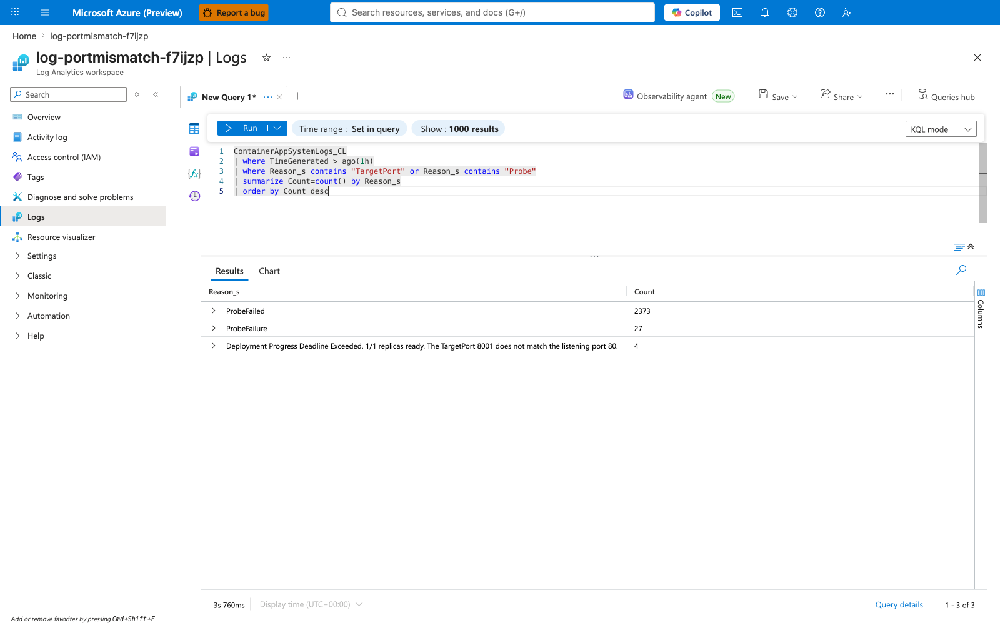

[Observed] Running the **same KQL query** over a `ago(5m)` window that starts after the fix lands returns **No results found**:

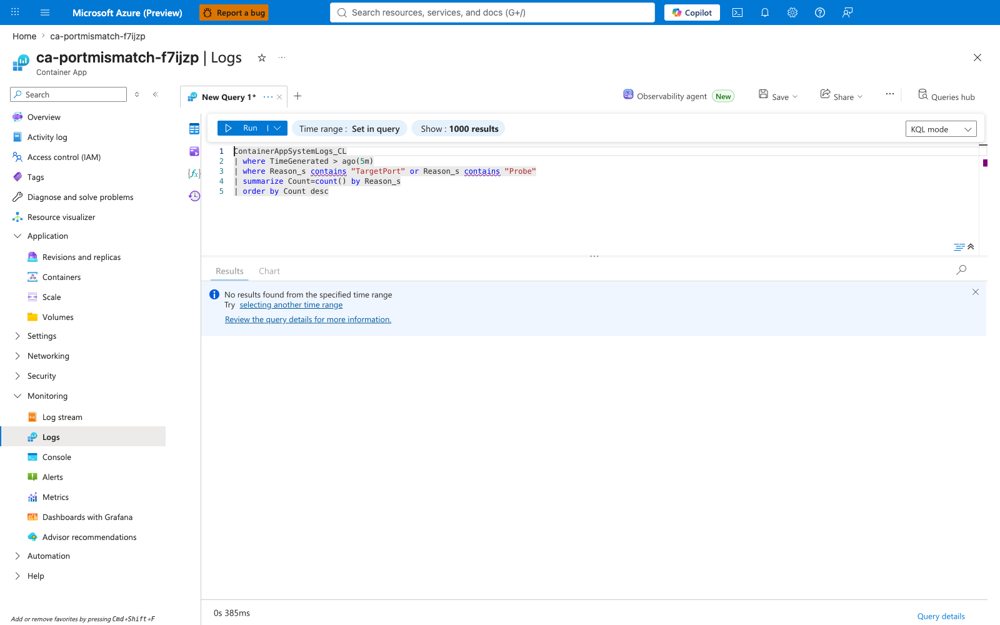

[Inferred] The transition from "row present" to "No results found" with an unchanged query is the **machine-readable falsification artifact**. Pairs 1–7 are visual; pair 8 is the form you can alert on, scope-back, or paste into an incident postmortem. See [Target Port Mismatch Detection](../kql/system-and-revisions/target-port-mismatch-detection.md) for the query body, schema notes, and limitations.

### Production case pattern — falsification summary

| Independent variable changed | Dependent variables that flipped on the same revision | Variables held constant |
|---|---|---|
| Ingress `targetPort`: `8001` → `80` | Overview `Issues` tab (present → gone), revision health (Degraded → Healthy/Running), revision status details (verbatim mismatch message → "no additional running status details"), edge response (503 → 200), KQL `Reason_s contains "TargetPort"` rows (present → "No results found" in the post-fix window) | Revision name, container image, container listening port (`:80`), ingress transport |

[Inferred] Holding the revision name, container image, listening port, and ingress transport constant and flipping only the ingress `targetPort`, the eight Portal surfaces above all transition together. The transition rules out the alternative theories the case originally enumerated:

- *"The container is broken / image regressed"* — falsified by pair 5 (same image) and pair 7 (same `Listening on :80` log output).
- *"It's a transient platform issue, retry will fix it"* — falsified by pair 8: the row stops appearing **deterministically on the ingress update**, not on time elapsed.
- *"It's a probe configuration issue"* — falsified by the verbatim flyout message in pair 3, which directly attributes the failure to the port mismatch, not to probe timing or path.

### Observed Evidence (Scripted Evidence Pack — 2026-06-22, koreacentral)

This subsection captures the hypothesis a third time using the scripted falsification lab at [`labs/ingress-target-port-mismatch/`](https://github.com/yeongseon/azure-container-apps-practical-guide/tree/main/labs/ingress-target-port-mismatch). Two improvements over the prior subsections make this reproduction useful as machine-readable regression evidence:

1. **`trigger.sh` and `verify.sh` replace the manual workflow** with `bash` + `az` CLI + KQL, producing JSON evidence at `labs/ingress-target-port-mismatch/evidence/` (25 numbered files: full stdout, ingress configs, replica state, curl results, parsed KQL summaries, sample rows, CLI versions, deployment outputs).
2. **Strict UTC cutoffs** scope both KQL gates to `TimeGenerated > datetime(${TRIGGER_UTC})` and `TimeGenerated > datetime(${FIX_UTC})` respectively, eliminating the pre-fix-tail confounder that an `ago(5m)` relative window would include in the H2 check.

**Environment:** `rg-aca-lab-ingress-port` / `cae-ingressport-2inkav`, `koreacentral`, Consumption plan, `azure-cli 2.79.0`, `containerapp` extension `1.3.0b4`.
**App:** `ca-ingressport-2inkav` — image `mcr.microsoft.com/azuredocs/containerapps-helloworld:latest`, container listens on `:80`. `minReplicas=1, maxReplicas=1, 0.25 vCPU, 0.5 Gi`.
**Trigger:** `az containerapp ingress update --target-port 8081` at `TRIGGER_UTC=2026-06-22T12:17:44Z`.
**Fix:** `az containerapp ingress update --target-port 80` at `FIX_UTC=2026-06-22T12:25:06Z`.

[Observed] **H1 (trigger produces failure) — PASS.** Pre-trigger sanity returned 10/10 HTTP 200; after the trigger and a 60 s ingress propagation wait, the same FQDN returned 0/10 HTTP 200 (all 503). After a 300 s system-log ingestion wait, the `ContainerAppSystemLogs_CL` KQL gate (scoped to `TimeGenerated > datetime(2026-06-22T12:17:44Z)`) classified the result as `populated_table` with `portmismatch_rows=25`, `probefailed_rows=374`, and `distinct_revisions=1`. Smoking-gun sample rows show `Log_s = "The TargetPort 8081 does not match the listening port 80."` and `Reason_s = "Pending:PortMismatch"`, all attributed to the same replica `ca-ingressport-2inkav--n6v50k0-55dfdfd9b-7bwp8` with `TimeGenerated` clustered between `2026-06-22T12:19:10Z` and `2026-06-22T12:19:20Z` (≈8–10 s after the trigger landed; detection-to-attribution is sub-minute on this reproduction).

[Observed] **H2 (fix restores recovery) — PASS.** After `az containerapp ingress update --target-port 80` and a 30 s ingress propagation wait, the same FQDN returned 10/10 HTTP 200. After a further 300 s system-log ingestion wait, the same KQL scoped to `TimeGenerated > datetime(2026-06-22T12:25:06Z)` classified the result as `silent_valid_baseline` with `portmismatch_rows=0` (the smoking-gun message stops being emitted in the post-fix window). `probefailed_rows=12` in the post-fix window — these are residual `ProbeFailed` events without the `TargetPort` attribution, [Inferred] consistent with brief probe attempts during the few seconds between the ingress update and full propagation, and they do not contradict H2 because the gate is on the PortMismatch class, not on the broader `ProbeFailed` class.

[Observed] The `latestRevisionName` was `ca-ingressport-2inkav--n6v50k0` before the trigger, during the triggered window, and after the fix — three captures of the same revision name. [Inferred] This is a third independent confirmation that ingress updates are application-scope (no new revision is created), consistent with [How to configure ingress](https://learn.microsoft.com/en-us/azure/container-apps/ingress-how-to) and with the 2026-06-02 and 2026-06-18 captures above.

[Observed] **Schema observation on this reproduction.** The 2026-06-22 platform emitted the port-mismatch attribution as `Reason_s == "Pending:PortMismatch"` with the smoking-gun text inside `Log_s`. The 2026-06-18 production case pattern captured above (pair 8) shows the smoking-gun text inside the `Reason_s` field itself, matched by `Reason_s contains "TargetPort"`. [Inferred] Both forms carry the same operational meaning — `TargetPort <X> does not match the listening port <Y>` — but the field placement differs between these reproductions. The companion KQL pack at [Target Port Mismatch Detection](../kql/system-and-revisions/target-port-mismatch-detection.md) was updated 2026-06-22 to match **both** forms (`Reason_s == "Pending:PortMismatch" OR Reason_s contains "TargetPort" OR Log_s contains "TargetPort"`) so a detector built on it remains valid across the two attribution shapes.

### Scripted reproduction — falsification summary

| Independent variable changed | Dependent variables that flipped on the same revision | Variables held constant |
|---|---|---|
| Ingress `targetPort`: `80` → `8081` → `80` | Edge HTTP response (200 → 503 → 200, n=10 per state), `ContainerAppSystemLogs_CL` gate classification (`silent_valid_baseline` → `populated_table` → `silent_valid_baseline`), `portmismatch_rows` (0 → 25 → 0 in the corresponding UTC windows) | Revision name (`ca-ingressport-2inkav--n6v50k0`), container image (`containerapps-helloworld:latest`), container listening port (`:80`), ingress transport (`Auto`), Log Analytics workspace, scripted KQL query (only the `datetime(...)` cutoff differs between H1 and H2) |

[Inferred] Holding the revision name, container image, listening port, ingress transport, and KQL query body constant and flipping only the integer `targetPort` value, the edge HTTP response and the `ContainerAppSystemLogs_CL` PortMismatch row count flipped together in the documented direction. The strict post-fix UTC cutoff (`datetime(2026-06-22T12:25:06Z)` rather than `ago(5m)`) is what permits the H2 gate to be machine-readable — a relative window beginning at query time would include the pre-fix tail and falsely falsify the fix.

## Clean Up

```bash
az group delete --name "$RG" --yes --no-wait
```

| Command | Why it is used |
|---|---|
| `az group delete ...` | Removes the lab resource group and its contained resources. |

## Related Playbook

- [Ingress Not Reachable](../playbooks/ingress-and-networking/ingress-not-reachable.md)

## See Also

- [Probe and Port Mismatch Lab](./probe-and-port-mismatch.md)
- [DNS and Private Endpoint Failure Playbook](../playbooks/ingress-and-networking/internal-dns-and-private-endpoint-failure.md)

## Sources

- [Ingress in Azure Container Apps](https://learn.microsoft.com/en-us/azure/container-apps/ingress-overview)
- [Configure ingress for your app](https://learn.microsoft.com/en-us/azure/container-apps/ingress-how-to)
