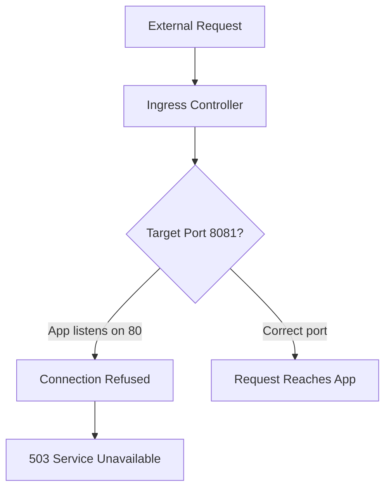

---
content_sources:
diagrams:
  - id: architecture
    type: flowchart
    source: mslearn-adapted
    based_on:
      - https://learn.microsoft.com/azure/container-apps/ingress-overview
      - https://learn.microsoft.com/azure/container-apps/ingress-how-to
content_validation:
  status: pending_review
  last_reviewed: "2026-04-29"
  reviewer: ai-agent
  lab_validation:
    status: partial
    tested_date: 2026-04-29
    az_cli_version: "2.70.0"
    notes: "ProbeFailed confirmed on port 8081, HTTP 200 on port 80 confirmed"

  core_claims:
    - claim: "Ingress in Azure Container Apps forwards incoming traffic to the target port that is configured for the app."
      source: "https://learn.microsoft.com/azure/container-apps/ingress-overview"
      verified: true
    - claim: "When external ingress is enabled for a Container App, Azure assigns the app a publicly reachable fully qualified domain name."
      source: "https://learn.microsoft.com/azure/container-apps/ingress-overview"
      verified: true
---

# Ingress Target Port Mismatch Lab

Diagnose and fix ingress failures caused by target port misconfiguration where the ingress routes traffic to the wrong port.

## Lab Metadata

| Attribute | Value |
|---|---|
| Difficulty | Beginner |
| Estimated Duration | 15-20 minutes |
| Tier | Consumption |
| Failure Mode | Container healthy but external endpoint unreachable |
| Skills Practiced | Ingress configuration, port binding diagnosis |

## 1) Background

Azure Container Apps routes external traffic through an ingress controller to your container. The `targetPort` setting specifies which port the ingress forwards requests to. When this port doesn't match the port your application listens on, requests reach the container but fail to connect to any listening process.

This is one of the most common "works locally, fails in Azure" scenarios because:

- Local testing often uses different ports than production
- Dockerfile `EXPOSE` is documentation only—it doesn't configure ingress
- The container starts successfully (health probes may pass on a different port)
- External requests return 503 or connection refused

### Architecture

<!-- diagram-id: architecture -->


## 2) Hypothesis

**IF** the ingress target port is changed from 80 to 8081, **THEN** external requests will fail with 503 errors because no process is listening on port 8081 inside the container.

| Variable | Control State | Experimental State |
|---|---|---|
| Target Port | 80 (matches app) | 8081 (mismatch) |
| Container Health | Healthy | Healthy |
| External Access | HTTP 200 | HTTP 503 or timeout |

## 3) Runbook

### Deploy Baseline Infrastructure

```bash
export RG="rg-aca-lab-ingress"
export LOCATION="koreacentral"

az group create --name "$RG" --location "$LOCATION"

az deployment group create \
    --name "lab-ingress" \
    --resource-group "$RG" \
    --template-file "./labs/ingress-target-port-mismatch/infra/main.bicep" \
    --parameters baseName="labingress"
```

### Capture Resource Names

```bash
export APP_NAME="$(az deployment group show \
    --resource-group "$RG" \
    --name "lab-ingress" \
    --query "properties.outputs.containerAppName.value" \
    --output tsv)"

export ENVIRONMENT_NAME="$(az deployment group show \
    --resource-group "$RG" \
    --name "lab-ingress" \
    --query "properties.outputs.containerAppsEnvironmentName.value" \
    --output tsv)"

export APP_FQDN="$(az containerapp show \
    --name "$APP_NAME" \
    --resource-group "$RG" \
    --query "properties.configuration.ingress.fqdn" \
    --output tsv)"
```

### Verify Baseline (Before Trigger)

```bash
# Confirm ingress configuration
az containerapp show \
    --name "$APP_NAME" \
    --resource-group "$RG" \
    --query "properties.configuration.ingress" \
    --output table
```

Expected output:

```text
External    TargetPort    Transport    AllowInsecure
----------  ------------  -----------  ---------------
True        80            auto         False
```

```bash
# Confirm endpoint is reachable
curl --silent --fail "https://${APP_FQDN}" && echo "Endpoint reachable"
```

### Trigger the Failure

```bash
cd labs/ingress-target-port-mismatch
./trigger.sh
```

The trigger script changes the target port to 8081:

```bash
az containerapp update \
    --name "$APP_NAME" \
    --resource-group "$RG" \
    --target-port 8081
```

### Observe the Failure

```bash
# Check ingress configuration - note the wrong port
az containerapp show \
    --name "$APP_NAME" \
    --resource-group "$RG" \
    --query "properties.configuration.ingress.targetPort" \
    --output tsv
```

Expected: `8081`

```bash
# Attempt to reach the endpoint
curl --silent --max-time 10 "https://${APP_FQDN}" || echo "Request failed"
```

Expected: Connection timeout or 503 error with message like:

```text
upstream connect error or disconnect/reset before headers. retried and the latest reset reason: remote connection failure, transport failure reason: delayed connect error: Connection refused
```

```bash
# Verify container is still running (the issue is ingress, not the app)
az containerapp replica list \
    --name "$APP_NAME" \
    --resource-group "$RG" \
    --query "[].{name:name,runningState:properties.runningState}" \
    --output table
```

Expected: Replicas show `Running` state—the container is healthy, just unreachable via ingress.

### Fix the Issue

```bash
az containerapp ingress update \
    --name "$APP_NAME" \
    --resource-group "$RG" \
    --target-port 80
```

### Verify the Fix

```bash
cd labs/ingress-target-port-mismatch
./verify.sh
```

The verify script confirms:

1. `targetPort` is back to 80
2. `external` is true
3. HTTPS endpoint returns a successful response

## 4) Experiment Log

| Step | Action | Expected | Actual | Pass/Fail |
|---|---|---|---|---|
| 1 | Deploy baseline | Deployment succeeds | | |
| 2 | Verify baseline endpoint | HTTP 200 | | |
| 3 | Run trigger.sh | Target port changes to 8081 | | |
| 4 | Curl endpoint | Timeout or 503 | | |
| 5 | Check replica status | Running | | |
| 6 | Fix target port to 80 | Update succeeds | | |
| 7 | Run verify.sh | All checks pass | | |

## Expected Evidence

### Before Fix

| Evidence Source | Expected State |
|---|---|
| `az containerapp show ... --query "properties.configuration.ingress.targetPort"` | `8081` |
| `curl https://${APP_FQDN}` | Timeout or 503 |
| Container replicas | Running (healthy) |

### After Fix

| Evidence Source | Expected State |
|---|---|
| `az containerapp show ... --query "properties.configuration.ingress.targetPort"` | `80` |
| `curl https://${APP_FQDN}` | HTTP 200 |
| `./verify.sh` | PASS |

## Clean Up

```bash
az group delete --name "$RG" --yes --no-wait
```

## Related Playbook

- [Ingress Not Reachable](../playbooks/ingress-and-networking/ingress-not-reachable.md)

## See Also

- [Probe and Port Mismatch Lab](./probe-and-port-mismatch.md)
- [DNS and Private Endpoint Failure Playbook](../playbooks/ingress-and-networking/internal-dns-and-private-endpoint-failure.md)

## Sources

- [Ingress in Azure Container Apps](https://learn.microsoft.com/azure/container-apps/ingress-overview)
- [Configure ingress for your app](https://learn.microsoft.com/azure/container-apps/ingress-how-to)
