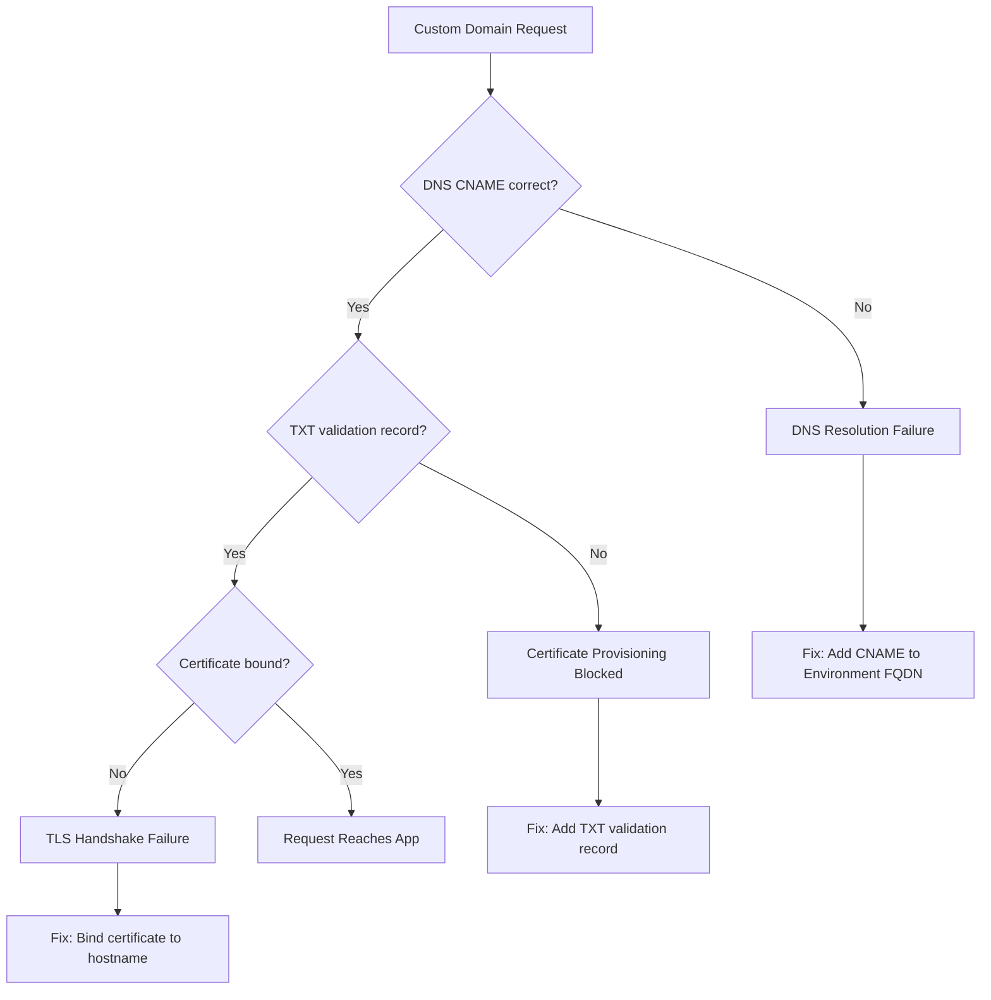

# Ingress TLS and Custom Domain Lab

Diagnose and fix ingress configuration issues with custom domains and TLS certificate management.

## Scenario

- **Difficulty**: Intermediate
- **Estimated duration**: 30-40 minutes
- **Failure mode**: Custom domain not reachable due to DNS misconfiguration or certificate binding issues

## Prerequisites

- Azure CLI with Container Apps extension
- A custom domain you control (for full verification)
- DNS access to create CNAME/TXT records

```bash
az extension add --name containerapp --upgrade
az login
```

## Quick Start

```bash
export RG="rg-aca-lab-ingress"
export LOCATION="koreacentral"

az group create --name "$RG" --location "$LOCATION"
az deployment group create --name "lab-ingress" --resource-group "$RG" --template-file ./labs/ingress-tls-custom-domain/infra/main.bicep --parameters baseName="labingress"

export APP_NAME="$(az deployment group show --resource-group "$RG" --name "lab-ingress" --query "properties.outputs.containerAppName.value" --output tsv)"
export ENVIRONMENT_NAME="$(az deployment group show --resource-group "$RG" --name "lab-ingress" --query "properties.outputs.containerAppsEnvironmentName.value" --output tsv)"

cd labs/ingress-tls-custom-domain
./trigger.sh
./verify.sh
./cleanup.sh
```

## Scenario Setup

This lab demonstrates common ingress and TLS issues:

1. Default ingress works but custom domain fails
2. DNS validation record missing
3. Managed certificate not provisioned
4. Traffic split between ingress endpoints



## Key Concepts

### Ingress Configuration Types

| Ingress Type | Visibility | Use Case |
|---|---|---|
| External | Public internet | Customer-facing APIs and web apps |
| Internal | VNet only | Backend services, internal APIs |
| Disabled | No HTTP ingress | Background workers, jobs |

### Certificate Options

| Option | Management | Renewal | Best For |
|---|---|---|---|
| Managed Certificate | Azure auto-provisions | Automatic | Most custom domains |
| Bring Your Own | You upload PFX | Manual | Wildcard certs, specific CA requirements |
| Environment Certificate | Shared across apps | Varies | Multiple apps same domain |

## Step-by-Step Walkthrough

1. **Deploy baseline app with default ingress**

   ```bash
   export RG="rg-aca-lab-ingress"
   export LOCATION="koreacentral"
   az group create --name "$RG" --location "$LOCATION"

   az deployment group create \
     --name "lab-ingress" \
     --resource-group "$RG" \
     --template-file "./labs/ingress-tls-custom-domain/infra/main.bicep" \
     --parameters baseName="labingress"
   ```

   Expected output: deployment `Succeeded`.

2. **Verify default FQDN works**

   ```bash
   export APP_FQDN="$(az containerapp show --name "$APP_NAME" --resource-group "$RG" --query "properties.configuration.ingress.fqdn" --output tsv)"
   curl --silent "https://${APP_FQDN}/health"
   ```

   Expected output: `{"status": "healthy"}` with valid TLS.

3. **Attempt custom domain without DNS setup (trigger failure)**

   ```bash
   az containerapp hostname add \
     --name "$APP_NAME" \
     --resource-group "$RG" \
     --hostname "app.example.com"
   ```

   Expected output: hostname added but not validated.

4. **Check hostname validation status**

   ```bash
   az containerapp hostname list \
     --name "$APP_NAME" \
     --resource-group "$RG" \
     --output table
   ```

   Expected output pattern:

   ```text
   Hostname          ValidationMethod  BindingType
   ----------------  ----------------  -----------
   app.example.com   CNAME             Disabled
   ```

5. **Get required DNS records**

   ```bash
   az containerapp show \
     --name "$APP_NAME" \
     --resource-group "$RG" \
     --query "properties.customDomainVerificationId" \
     --output tsv
   ```

   Required DNS records:
   - **CNAME**: `app.example.com` → `<environment-fqdn>`
   - **TXT**: `asuid.app.example.com` → `<customDomainVerificationId>`

6. **After DNS setup, bind managed certificate**

   ```bash
   az containerapp hostname bind \
     --name "$APP_NAME" \
     --resource-group "$RG" \
     --hostname "app.example.com" \
     --environment "$ENVIRONMENT_NAME" \
     --validation-method CNAME
   ```

   Expected output: certificate provisioning initiated.

7. **Verify certificate status**

   ```bash
   az containerapp hostname list \
     --name "$APP_NAME" \
     --resource-group "$RG" \
     --output table
   ```

   Expected output when complete:

   ```text
   Hostname          ValidationMethod  BindingType
   ----------------  ----------------  -----------
   app.example.com   CNAME             SniEnabled
   ```

## Symptoms / Cause / Fix Matrix

| What you see | What is happening | How to fix |
|---|---|---|
| `ERR_NAME_NOT_RESOLVED` | DNS CNAME not configured | Add CNAME pointing to environment FQDN |
| Hostname shows `Disabled` binding | TXT validation record missing | Add TXT record with verification ID |
| `SSL_ERROR_*` or certificate warning | Certificate not bound or still provisioning | Wait for provisioning or bind certificate |
| 404 on custom domain, 200 on default | Ingress routing misconfigured | Verify hostname is bound to correct app |
| Mixed HTTP/HTTPS behavior | HTTP redirect not configured | Enable `allowInsecure: false` in ingress |

## Common Debugging Commands

```bash
# Check ingress configuration
az containerapp ingress show --name "$APP_NAME" --resource-group "$RG"

# List all hostnames and their status
az containerapp hostname list --name "$APP_NAME" --resource-group "$RG" --output table

# Check environment's default domain
az containerapp env show --name "$ENVIRONMENT_NAME" --resource-group "$RG" --query "properties.defaultDomain"

# View certificate details
az containerapp env certificate list --name "$ENVIRONMENT_NAME" --resource-group "$RG" --output table
```

## Resolution Verification Checklist

1. Custom domain resolves via DNS (`nslookup` or `dig`)
2. TLS handshake succeeds with valid certificate
3. HTTP requests return expected response
4. Certificate auto-renewal is configured (managed certs)

## Expected Evidence

### Before Fix

| Evidence Source | Expected State |
|---|---|
| `az containerapp hostname list` | Hostname shows `Disabled` binding |
| `curl https://custom.domain/` | TLS error or connection refused |
| DNS lookup | CNAME missing or incorrect |

### After Fix

| Evidence Source | Expected State |
|---|---|
| `az containerapp hostname list` | Hostname shows `SniEnabled` binding |
| `curl https://custom.domain/` | HTTP 200 with valid certificate |
| Certificate details | Valid, not expired, correct domain |

## Clean Up

```bash
az group delete --name "$RG" --yes --no-wait
```

## Related Playbook

- [Ingress Not Reachable](../playbooks/ingress-and-networking/ingress-not-reachable.md)

## See Also

- [Probe and Port Mismatch Lab](./probe-and-port-mismatch.md)
- [DNS and Private Endpoint Failure Playbook](../playbooks/ingress-and-networking/internal-dns-and-private-endpoint-failure.md)

## Sources

- [Custom domain names and certificates in Azure Container Apps](https://learn.microsoft.com/azure/container-apps/custom-domains-managed-certificates)
- [Ingress in Azure Container Apps](https://learn.microsoft.com/azure/container-apps/ingress-overview)
- [Set up HTTPS ingress with a managed certificate](https://learn.microsoft.com/azure/container-apps/custom-domains-managed-certificates)
