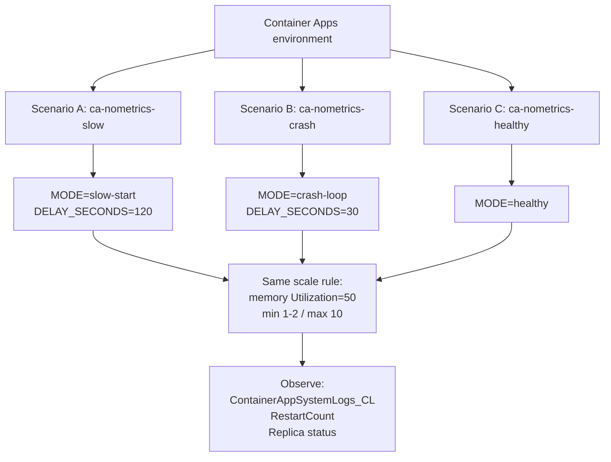
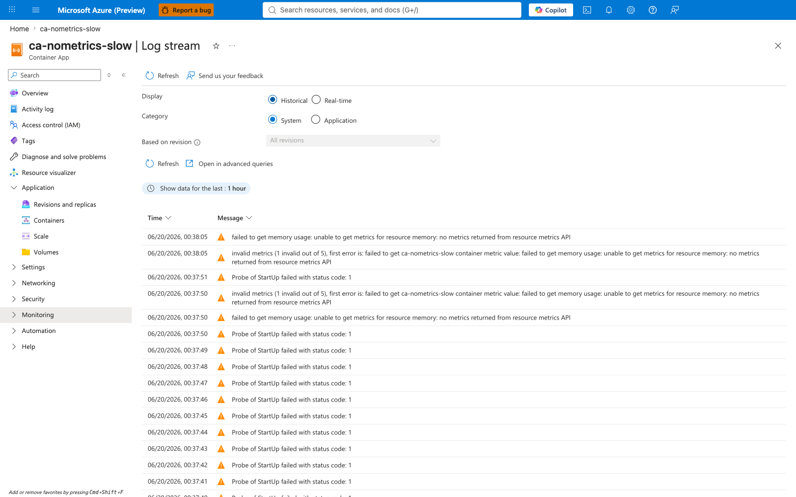
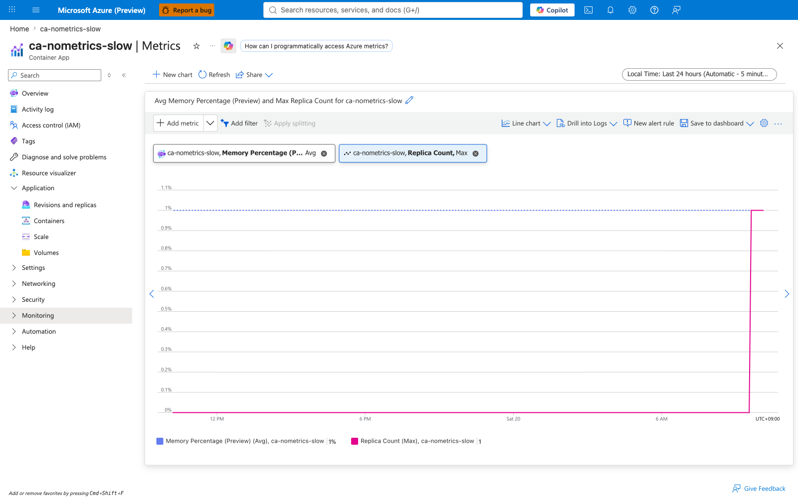
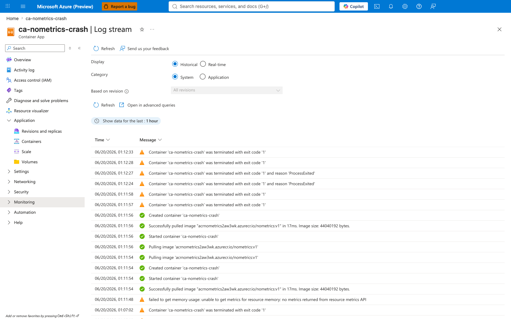
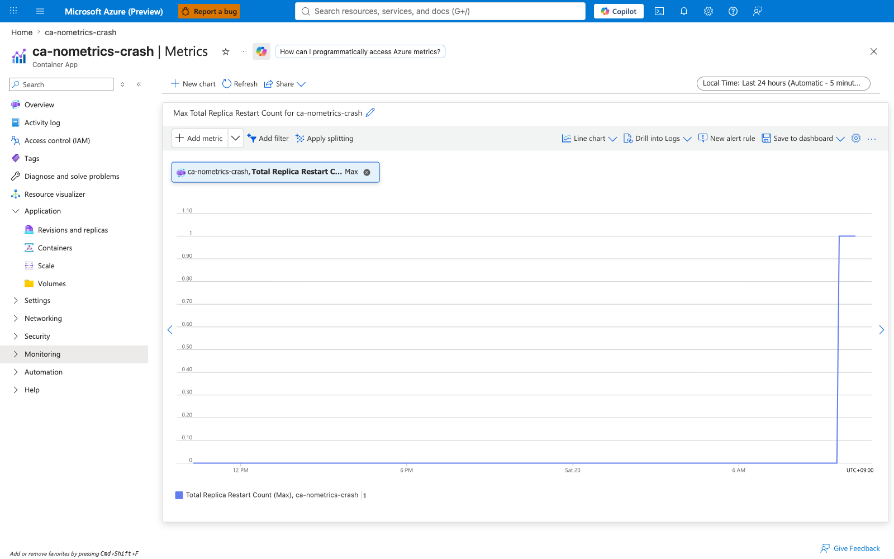
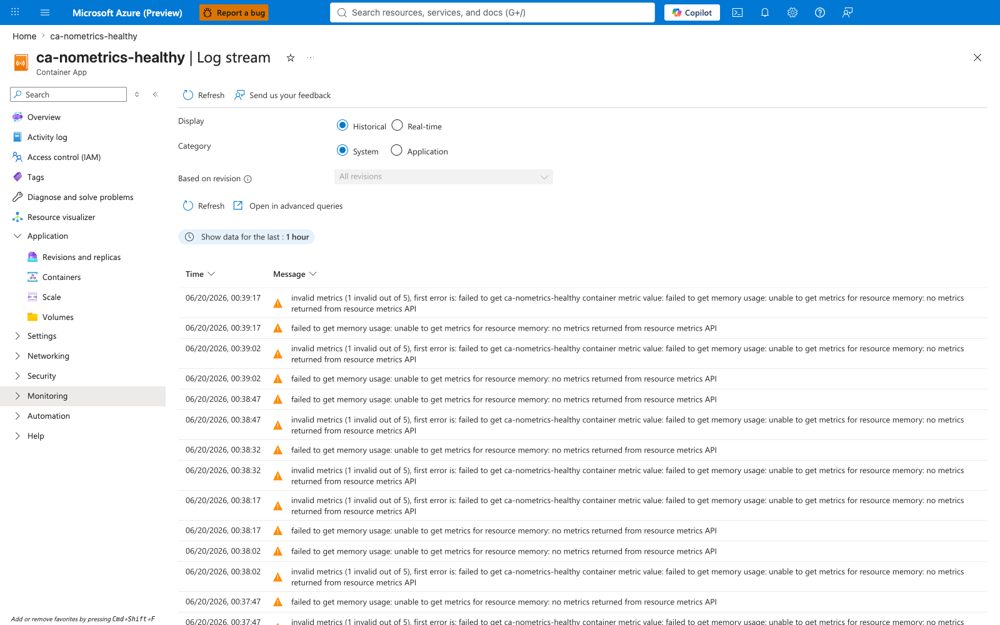
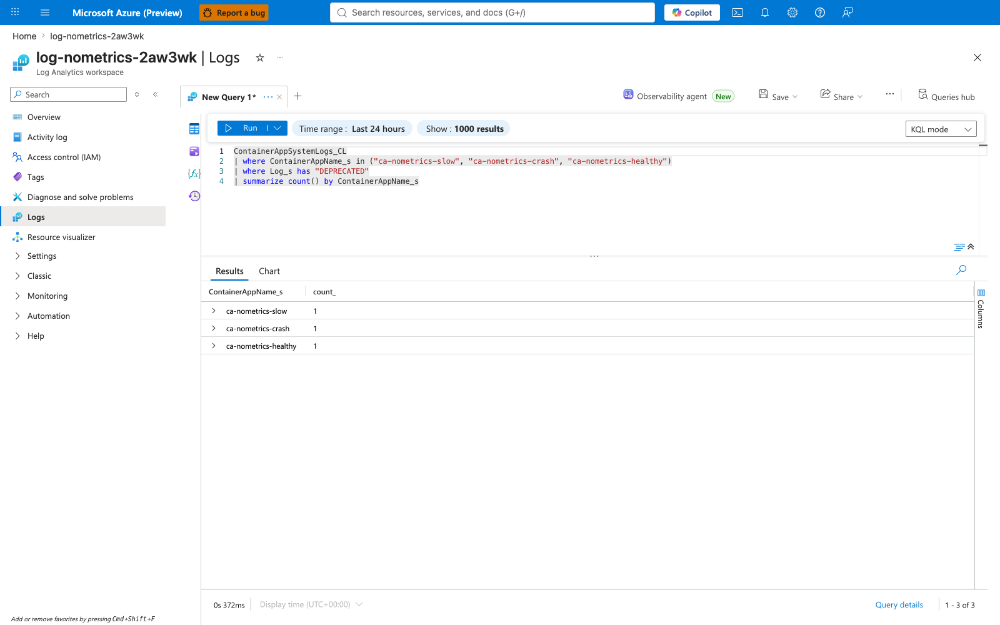
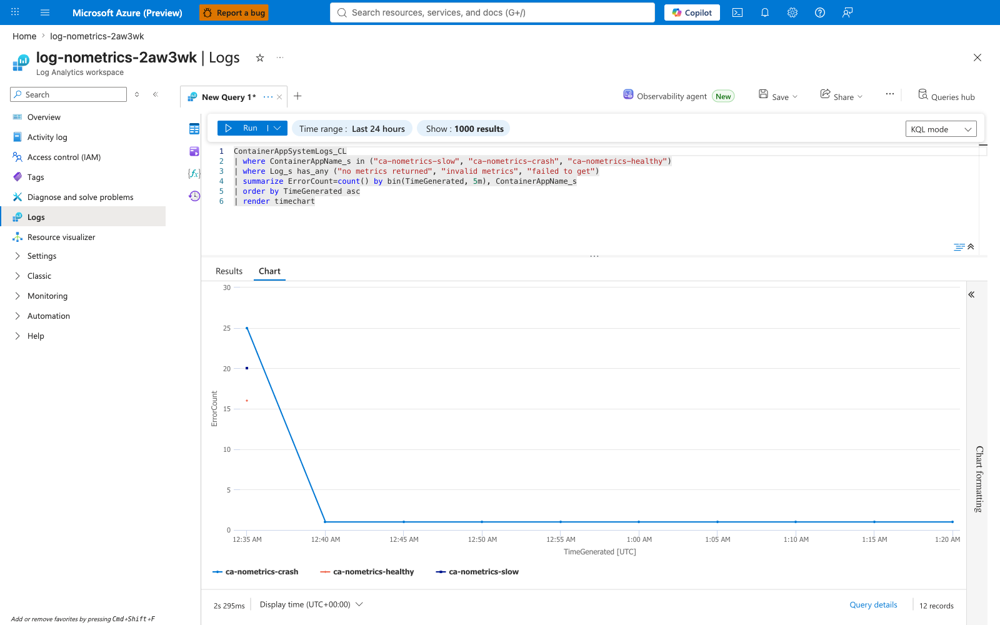

---
content_sources:
  diagrams:
    - id: experiment-architecture
      type: flowchart
      source: self-generated
      justification: Lab-specific architecture showing three side-by-side Container Apps with identical scale rules but different startup/crash behaviors, designed to reproduce KEDA metric collection errors.
      based_on:
        - https://learn.microsoft.com/en-us/azure/container-apps/scale-app
        - https://keda.sh/docs/latest/scalers/memory/
content_validation:
  status: verified
  last_reviewed: '2026-06-21'
  reviewer: ai-agent
  lab_validation:
    status: reproduced
    tested_date: 2026-06-05
    az_cli_version: 2.73.0
    notes: "All three scenarios reproduced in Korea Central. Scenario A (slow-start) produced 12 metric error entries during the first ~90 seconds then stopped. Scenario B (crash-loop) produced 29 recurring entries over 20+ minutes, correlating with container restarts. Scenario C (healthy) unexpectedly produced 10 entries during the first ~60 seconds after deployment — confirming that even healthy containers experience a brief metrics gap during initial provisioning. The DEPRECATED warning appeared for all three apps. Re-verified 2026-06-20T00:48-00:50Z (CLI 2.79.0, containerapp ext 1.3.0b4) against the same canonical infra in rg-aca-no-metrics-lab: Scenario A reproduced 20 metric errors in a 5-min bin at 00:35 with StartUp probe failures shown in the lifecycle log, Scenario B reproduced 27 metric errors over 15 min with recurring 'Container terminated with exit code 1' / ProcessExited events confirming CrashLoopBackOff, Scenario C reproduced 16 metric errors in a 5-min bin during Metrics Server warm-up, and the DEPRECATED warning appeared exactly once per app at scaler init time. Re-verification evidence at labs/keda-no-metrics-returned/evidence/ca-nometrics-{slow,crash,healthy}/report-20260620T*.txt with explicit az --version captures at az-version-20260620T*.json."
  core_claims:
    - claim: KEDA/HPA logs "no metrics returned from resource metrics API" when the Kubernetes Metrics Server has no data for a container that is not yet Ready.
      source: https://github.com/kubernetes/kubernetes/issues/127169
      verified: true
    - claim: CrashLoopBackOff creates recurring windows where metrics are unavailable, producing repeated "no metrics returned" and "invalid metrics" log entries.
      source: https://signoz.io/guides/kubernetes-hpa-unable-to-get-metrics-for-resource-memory-no-metrics-returned-from-resource-metrics-api/
      verified: true
validation:
  az_cli:
    last_tested: '2026-06-20'
    cli_version: '2.79.0'
    result: pass
  bicep:
    last_tested: '2026-06-05'
    result: pass
---
# KEDA "No Metrics Returned" Reproduction Lab

Reproduce the KEDA/HPA log messages `no metrics returned from resource
metrics API` and `invalid metrics` by creating containers that are
intentionally Not Ready or crash-looping, then compare against a healthy
baseline to confirm the errors are caused by container lifecycle events.

## Lab Metadata

| Attribute | Value |
|---|---|
| Difficulty | Beginner-Intermediate |
| Estimated Duration | 20-30 minutes (10 min wait for log ingestion) |
| Tier | Consumption |
| Failure Mode | KEDA system logs show "no metrics returned" / "invalid metrics" |
| Skills Practiced | System log analysis, KQL queries, container lifecycle correlation, KEDA deprecation awareness |

## 1) Background

KEDA's CPU and memory scalers query the Kubernetes Resource Metrics API
for per-container utilization data. The Metrics Server can only return
data for containers that are **Running and Ready**. When a container is:

- Still initializing (readiness probe not yet passing)
- Restarting after a crash or OOMKill
- Being rescheduled during platform maintenance

…the Metrics API returns an empty response, and the HPA controller logs:

```text
failed to get memory usage: unable to get metrics for resource memory: no metrics returned from resource metrics API
```

If the app has multiple scale rules and only some metrics fail:

```text
invalid metrics (1 invalid out of 5), first error is: failed to get <app> container metric value: ...
```

Additionally, scale rules using `--scale-rule-metadata "type=Utilization"`
trigger a deprecation warning because KEDA v2.7+ replaced `metadata.type`
with the trigger-level `metricType` field (removed in v2.18):

```text
scaler memory info: The 'type' setting is DEPRECATED and will be removed in v2.18 - Use 'metricType' instead.
```

## 2) Hypothesis

**IF** three Container Apps share the same memory scale rule but run
workloads with different startup/crash behaviors, **THEN**:

- **Scenario A (slow-start)**: System logs show "no metrics returned"
  during the first ~2 minutes (while the container is Not Ready), then
  the errors stop once the readiness probe passes.
- **Scenario B (crash-loop)**: System logs show recurring "no metrics
  returned" and "invalid metrics" that correlate with container restart
  timestamps. The pattern repeats with exponential backoff intervals.
- **Scenario C (healthy)**: System logs show a **brief burst** of metric
  error entries (~30-60s) immediately after deployment due to the
  Kubernetes Metrics Server warm-up period, then no further errors.
  The DEPRECATED warning also appears (it is independent of container
  health).

### Architecture

<!-- diagram-id: experiment-architecture -->


| Scenario | App name | Mode | Expected "no metrics" logs | Expected RestartCount |
|---|---|---|---|---|
| **A. Slow startup** | `ca-nometrics-slow` | `slow-start` (120s delay) | Transient, first ~90s only | 0 |
| **B. CrashLoopBackOff** | `ca-nometrics-crash` | `crash-loop` (exit every 30s) | Recurring, correlates with restarts | Rising |
| **C. Healthy baseline** | `ca-nometrics-healthy` | `healthy` | Transient, first ~60s only (deployment gap) | 0 |

## 3) Runbook

### Deploy infrastructure

```bash
export RG="rg-aca-no-metrics-lab"
export LOCATION="koreacentral"
export BASE_NAME="nometrics"

az group create --name "$RG" --location "$LOCATION"

az deployment group create \
    --resource-group "$RG" --name main \
    --template-file labs/keda-no-metrics-returned/infra/main.bicep \
    --parameters baseName="$BASE_NAME"

export ACR_NAME="$(az deployment group show --resource-group "$RG" --name main \
    --query properties.outputs.containerRegistryName.value --output tsv)"
export ENV_NAME="$(az deployment group show --resource-group "$RG" --name main \
    --query properties.outputs.environmentName.value --output tsv)"
```

| Command | Why it is used |
|---|---|
| `az group create` | Creates the resource group that scopes all lab resources. |
| `az deployment group create` | Deploys the Bicep template that provisions Log Analytics, ACR, and the Container Apps environment. |
| `az deployment group show` | Reads the Bicep outputs to capture the generated ACR and environment names. |

### Create three scenarios

```bash
bash labs/keda-no-metrics-returned/trigger-scenario-a.sh
bash labs/keda-no-metrics-returned/trigger-scenario-b.sh
bash labs/keda-no-metrics-returned/trigger-scenario-c.sh
```

| Command | Why it is used |
|---|---|
| `trigger-scenario-a.sh` | Builds the image, creates `ca-nometrics-slow` with `MODE=slow-start` and `DELAY_SECONDS=120`. The container sleeps 2 minutes before starting the HTTP server, so the readiness probe fails during this window. |
| `trigger-scenario-b.sh` | Creates `ca-nometrics-crash` with `MODE=crash-loop` and `DELAY_SECONDS=30`. The container exits every 30 seconds, triggering CrashLoopBackOff. |
| `trigger-scenario-c.sh` | Creates `ca-nometrics-healthy` with `MODE=healthy`. The container starts immediately and stays stable. |

### Observe (wait at least 10 minutes for Log Analytics ingestion)

```bash
sleep 600

for APP in ca-nometrics-slow ca-nometrics-crash ca-nometrics-healthy; do
    APP_NAME=$APP bash labs/keda-no-metrics-returned/verify.sh
done
```

`verify.sh` queries `ContainerAppSystemLogs_CL` for "no metrics returned",
"invalid metrics", and "DEPRECATED" messages, then checks console logs,
replica status, and restart counts.

## 4) Expected Evidence

The hypothesis is confirmed when **all** of the following hold:

| Check | Confirmation rule | Falsification |
|---|---|---|
| Scenario A: transient errors | "no metrics returned" entries appear within the first ~90s after deployment, then stop | Errors persist beyond 5 minutes after container becomes Ready |
| Scenario B: recurring errors | "no metrics returned" entries repeat and correlate with `RestartCount` increases | No metric errors despite container crashes |
| Scenario C: brief deployment gap | "no metrics returned" entries appear for ~30-60s after deployment, then stop permanently | Errors persist beyond 2 minutes for a healthy container |
| All: DEPRECATED warning | "The 'type' setting is DEPRECATED" appears for all three apps | Warning does not appear (Azure platform may have migrated) |

## 4a) Experiment Log

Tested in Azure region Korea Central, 2026-06-05, az CLI 2.73.0 (containerapp extension preview).

### Metric error summary [Measured]

```text
App                   ErrorCount  FirstError (UTC)       LastError (UTC)
--------------------  ----------  ---------------------  ---------------------
ca-nometrics-slow     12          04:05:14               04:06:30  (~76s window)
ca-nometrics-crash    29          04:06:07               04:26:15  (20+ min, ongoing)
ca-nometrics-healthy  10          04:10:26               04:11:27  (~61s window)
```

### Key observations

1. **Scenario A (slow-start)**: 12 error entries in 76 seconds. The container
   slept 120s before starting the HTTP server, so the readiness probe
   (StartUp probe) failed continuously — confirmed by `ProbeFailed` system
   log entries. Once the server started at `04:07:15`, metric errors stopped.

2. **Scenario B (crash-loop)**: 29 error entries over 20+ minutes. The
   container exited every 30s, triggering restarts with exponential backoff.
   Errors appeared in ~15s intervals during active restarts, then spaced out
   to ~5min as CrashLoopBackOff lengthened the restart delay.

3. **Scenario C (healthy)**: **Unexpected finding** — 10 error entries in
   61 seconds immediately after deployment. The container started within
   seconds (`[app] listening on :8000` logged instantly), but the Kubernetes
   Metrics Server needed ~60s to begin returning data for the new pod. This
   proves that **even a perfectly healthy container produces "no metrics
   returned" logs during initial provisioning**.

4. **DEPRECATED warning**: All three apps produced exactly one instance of:
   ```text
   scaler memory info: The 'type' setting is DEPRECATED and will be removed in v2.18 - Use 'metricType' instead.
   ```
   This confirms the warning is configuration-driven, not health-dependent.

### Error log samples (PII masked)

```text
# Scenario A — transient during startup probe failure
[04:05:14] ca-nometrics-slow | FailedGetContainerResourceMetric | failed to get memory usage: unable to get metrics for resource memory: no metrics returned from resource metrics API
[04:05:14] ca-nometrics-slow | FailedComputeMetricsReplicas     | invalid metrics (1 invalid out of 5), first error is: failed to get ca-nometrics-slow container metric value: ...

# Scenario B — recurring with crash-loop
[04:06:07] ca-nometrics-crash | FailedGetContainerResourceMetric | failed to get memory usage: ...
[04:08:38] ca-nometrics-crash | FailedGetContainerResourceMetric | failed to get memory usage: ...
[04:16:12] ca-nometrics-crash | FailedGetContainerResourceMetric | failed to get memory usage: ...  (interval lengthened due to backoff)
[04:21:13] ca-nometrics-crash | FailedGetContainerResourceMetric | failed to get memory usage: ...
[04:26:15] ca-nometrics-crash | FailedGetContainerResourceMetric | failed to get memory usage: ...

# Scenario C — brief deployment gap even for healthy container
[04:10:26] ca-nometrics-healthy | FailedGetContainerResourceMetric | failed to get memory usage: ...
[04:11:27] ca-nometrics-healthy | FailedComputeMetricsReplicas     | invalid metrics (1 invalid out of 5), ...
(no further errors after 04:11:27)

# All scenarios — DEPRECATED warning (once per app)
[04:04:59] ca-nometrics-slow    | scaler memory info: The 'type' setting is DEPRECATED ...
[04:05:52] ca-nometrics-crash   | scaler memory info: The 'type' setting is DEPRECATED ...
[04:10:12] ca-nometrics-healthy | scaler memory info: The 'type' setting is DEPRECATED ...
```

### Operator takeaway from experiment

The Scenario C result is the most important takeaway:
**expect 30-60 seconds of "no metrics returned" logs
after every deployment**, even when the application starts instantly.
This is a normal Kubernetes Metrics Server warm-up period, not a defect.

## 5) Verification Queries

### KQL: metric error log pattern

```kql
ContainerAppSystemLogs_CL
| where ContainerAppName_s in ("ca-nometrics-slow", "ca-nometrics-crash", "ca-nometrics-healthy")
| where Log_s has_any ("no metrics returned", "invalid metrics", "failed to get")
| summarize ErrorCount=count() by ContainerAppName_s, bin(TimeGenerated, 5m)
| order by TimeGenerated asc
```

Expected: `ca-nometrics-crash` shows sustained error counts across
multiple 5-min bins. `ca-nometrics-slow` shows errors only in the first
1-2 bins. `ca-nometrics-healthy` shows errors only in the first bin
(deployment warm-up), then zero.

### KQL: DEPRECATED warning

```kql
ContainerAppSystemLogs_CL
| where ContainerAppName_s in ("ca-nometrics-slow", "ca-nometrics-crash", "ca-nometrics-healthy")
| where Log_s has "DEPRECATED"
| summarize count() by ContainerAppName_s
```

Expected: All three apps show the warning (it is configuration-based,
not health-based).

## 6) Portal Evidence (to capture after reproduction)

Azure Portal screenshots to collect for each scenario. Save to
`docs/assets/troubleshooting/keda-no-metrics-returned/`.

### Scenario A — `ca-nometrics-slow` (transient metric gap during startup)

!!! note "Portal evidence — System logs"
    System logs show "no metrics returned" entries in the first ~90
    seconds after deployment. After the container becomes Ready, the
    errors stop. Replica Count remains 1. Memory Percentage stays low
    during the slow-start window because the container is still
    sleeping/initializing and not yet serving requests.

    

    

### Scenario B — `ca-nometrics-crash` (recurring metric gaps from CrashLoopBackOff)

!!! note "Portal evidence — System logs + Total Replica Restart Count"
    System logs show recurring "no metrics returned" and "invalid
    metrics" entries plus container exit code 1 (`ProcessExited`)
    events. The pattern repeats with increasing intervals as
    Kubernetes applies CrashLoopBackOff exponential backoff. The
    **Total Replica Restart Count** platform metric records the
    matching restart trace.

    

    

### Scenario C — `ca-nometrics-healthy` (brief deployment gap)

!!! note "Portal evidence — System logs"
    ~10 metric error entries during the first ~60 seconds after
    deployment, then no further errors. The container started instantly
    but the Kubernetes Metrics Server needed ~60s to warm up for the
    new pod. Total Replica Restart Count is 0. This is the most
    important screenshot in the lab: it proves the error appears even
    when nothing is wrong with the container.

    

### All scenarios — DEPRECATED warning

!!! note "Portal evidence — Log Analytics KQL"
    A KQL `summarize` across all three apps shows exactly one
    `type` DEPRECATED warning per app, confirming it is triggered
    by the scale rule configuration (`metadata.type=Utilization`),
    not by container health state.

    

### All scenarios — Error timeline (KQL)

!!! note "Portal evidence — Log Analytics timechart"
    A `render timechart` of "no metrics returned" / "invalid metrics"
    / "failed to get" entries bucketed by 5-minute bins, broken out by
    `ContainerAppName_s`. The initial deployment burst is concentrated
    in the first bin (~25 errors) and tails off to a baseline of ~1
    error per 5-minute bin afterward, dominated by the crash-loop app.

    

### Screenshot capture checklist

When re-running the lab, capture the following screenshots and save to
`docs/assets/troubleshooting/keda-no-metrics-returned/`:

| Screenshot | File name | Source |
|---|---|---|
| Scenario A: system logs | `scenario-a-slow-system-logs.png` | Log stream → Historical + System |
| Scenario A: metrics | `scenario-a-slow-metrics.png` | Metrics → Memory Percentage + Replica Count |
| Scenario B: system logs | `scenario-b-crash-system-logs.png` | Log stream → Historical + System |
| Scenario B: restart count | `scenario-b-crash-restart-count.png` | Metrics → Total Replica Restart Count |
| Scenario C: system logs | `scenario-c-healthy-system-logs.png` | Log stream → Historical + System |
| DEPRECATED warning | `all-deprecated-warning.png` | Log Analytics → KQL `summarize count() by ContainerAppName_s` |
| KQL error timeline | `kql-error-timeline.png` | Log Analytics → KQL `render timechart` |

## Clean Up

```bash
bash labs/keda-no-metrics-returned/cleanup.sh
```

| Command | Why it is used |
|---|---|
| `cleanup.sh` | Deletes the resource group and all child resources (async). |

## Related Playbook

- [KEDA "No Metrics Returned from Resource Metrics API"](../playbooks/scaling-and-runtime/keda-no-metrics-returned.md)

## See Also

- [Memory Percentage vs KEDA Utilization Lab](./memory-percentage-vs-keda-utilization.md)
- [CPU and Memory Scaler](../../platform/scaling/cpu-memory-scaler.md)
- [Scale Rule Mismatch Lab](./scale-rule-mismatch.md)

## Sources

- [Set scaling rules - Azure Container Apps](https://learn.microsoft.com/en-us/azure/container-apps/scale-app)
- [KEDA memory scaler](https://keda.sh/docs/latest/scalers/memory/)
- [HPA with container metrics fails when pod is not ready - kubernetes#127169](https://github.com/kubernetes/kubernetes/issues/127169)
- [Deprecating parameter 'type' in CPU/Memory scaler - kedacore/keda#6348](https://github.com/kedacore/keda/discussions/6348)
- [Troubleshooting HPA metric retrieval - SigNoz](https://signoz.io/guides/kubernetes-hpa-unable-to-get-metrics-for-resource-memory-no-metrics-returned-from-resource-metrics-api/)
