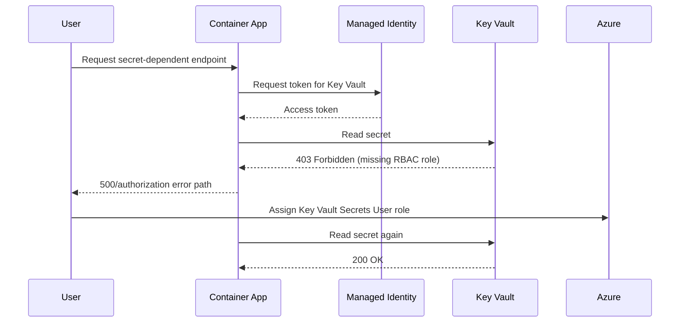
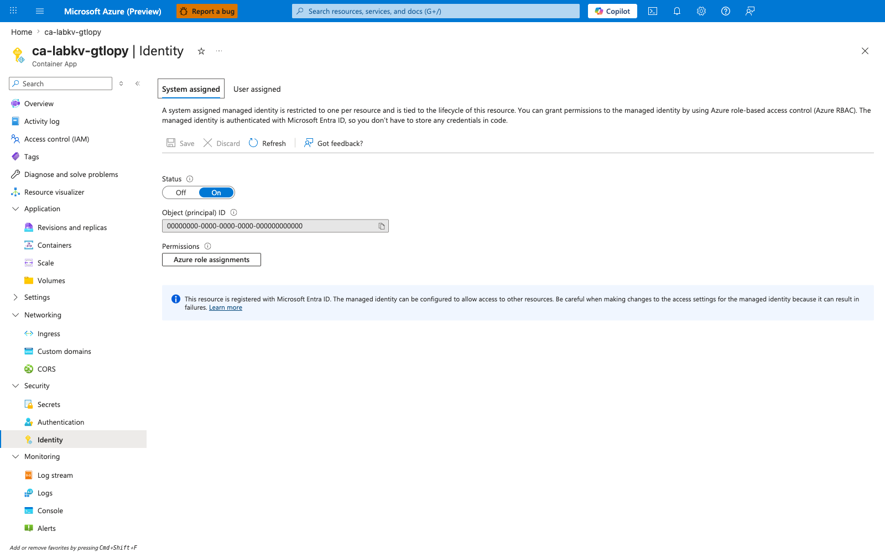
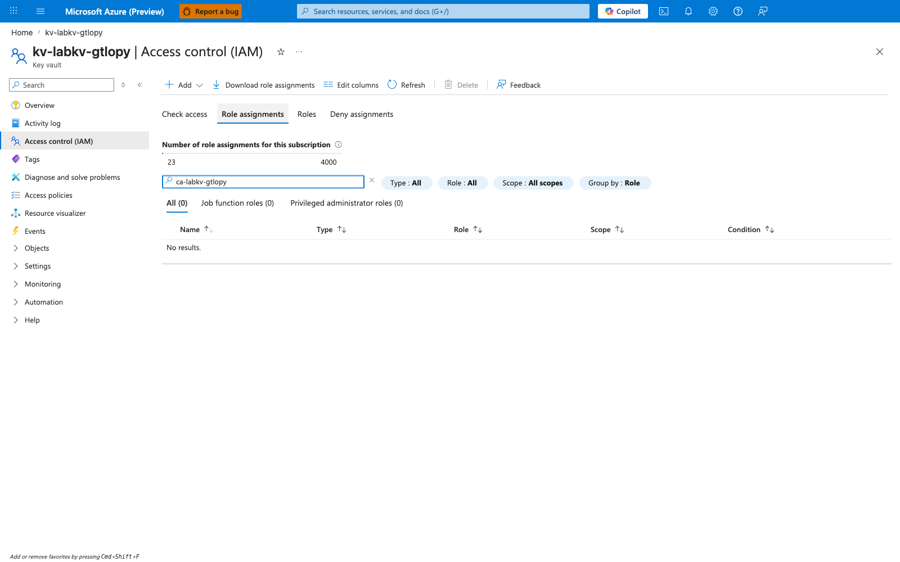
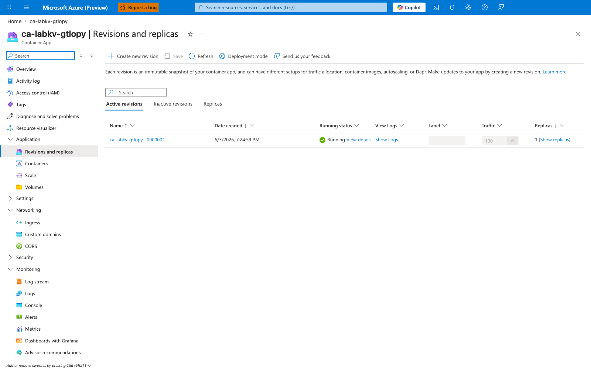
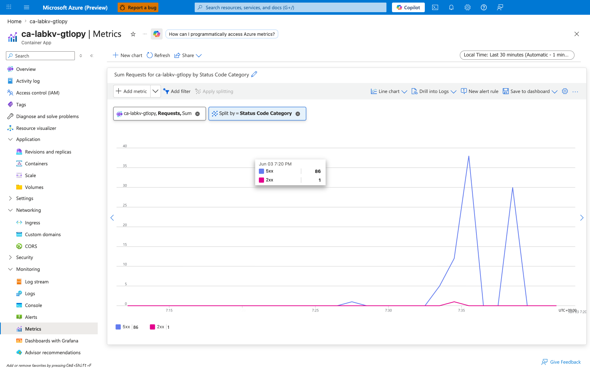
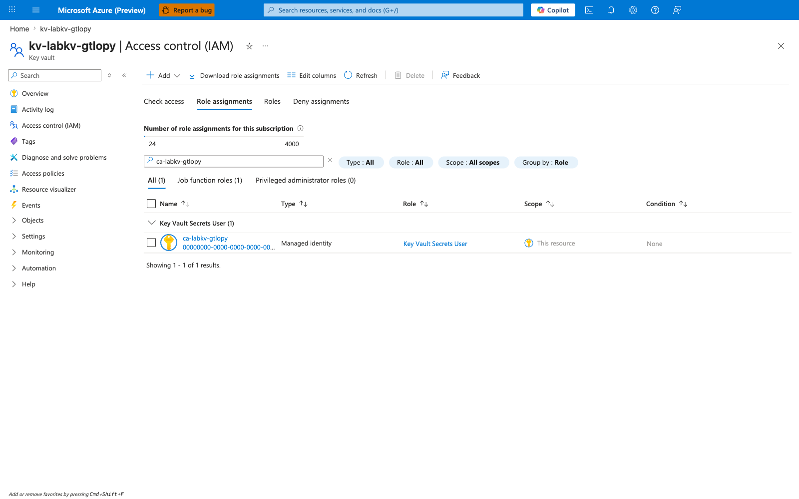
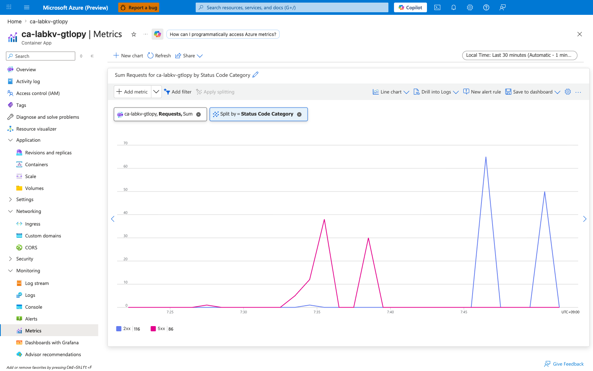

---
content_sources:
  diagrams:
    - id: architecture
      type: sequence
      source: mslearn-adapted
      based_on:
        - https://learn.microsoft.com/en-us/azure/container-apps/managed-identity
        - https://learn.microsoft.com/en-us/azure/key-vault/general/rbac-guide
content_validation:
  status: verified
  last_reviewed: '2026-06-03'
  reviewer: ai-agent
  lab_validation:
    status: reproduced
    tested_date: 2026-06-03
    az_cli_version: 2.71.0
    notes: ForbiddenByRbac confirmed pre-fix; HTTP 200 confirmed after Key Vault Secrets User role assignment + revision restart. Portal captures attached.
  core_claims:
    - claim: Azure Container Apps supports both system-assigned and user-assigned managed identities.
      source: https://learn.microsoft.com/en-us/azure/container-apps/managed-identity
      verified: true
    - claim: The Key Vault Secrets User built-in role permits reading secret values from Azure Key Vault.
      source: https://learn.microsoft.com/en-us/azure/key-vault/general/rbac-guide
      verified: true
validation:
  az_cli:
    last_tested: '2026-06-03'
    cli_version: 2.71.0
    result: pass
  bicep:
    last_tested: '2026-06-03'
    result: pass
---
# Managed Identity Key Vault Failure Lab

Reproduce Key Vault access denial by running a managed-identity-enabled app without the required RBAC role assignment.

## Lab Metadata

| Attribute | Value |
|---|---|
| Difficulty | Intermediate |
| Estimated Duration | 25-35 minutes |
| Tier | Consumption |
| Failure Mode | App returns 500 when reading a secret because the managed identity lacks `Key Vault Secrets User` |
| Skills Practiced | Managed identity validation, Key Vault RBAC diagnosis, revision restart verification |

## 1) Background

This lab provisions a Container App with a system-assigned managed identity, an Azure Container Registry, and a Key Vault secret. The application uses the managed identity to request a token and read the secret at runtime. The failure occurs because the identity exists, but no RBAC role assignment grants secret-read access at the Key Vault scope.

Managed identity failures are easy to misread because the revision can stay healthy while the secret-dependent route fails with 401/403-derived application errors.

### Architecture

<!-- diagram-id: architecture -->


!!! warning "Identity enabled does not mean authorized"
    System-assigned identity creation is only step one. Without role assignment at the correct scope, token retrieval can succeed while resource access still fails.

!!! tip "Verify scope explicitly"
    Assigning the role at the wrong scope, such as the resource group instead of the Key Vault resource ID, is a frequent cause of persistent 403 errors.

## 2) Hypothesis

**IF** a Container App uses a system-assigned managed identity to read a Key Vault secret but does not have the `Key Vault Secrets User` role on that vault, **THEN** the revision can remain running while the secret-dependent endpoint fails until the RBAC assignment is added and a new revision starts.

| Variable | Control State | Experimental State |
|---|---|---|
| Managed identity authorization | `Key Vault Secrets User` assigned at Key Vault scope | No role assignment at Key Vault scope |
| Secret-dependent endpoint | HTTP 200 | HTTP 500 or authorization-related failure |
| Revision runtime state | Running and healthy | Running and healthy |
| App logs | No Key Vault authorization errors | 401/403-style authorization errors |

## 3) Runbook

### Deploy baseline infrastructure

Prerequisites:

- Azure CLI with the Container Apps extension
- Permissions for role assignments: `Microsoft.Authorization/roleAssignments/write`

```bash
az extension add --name containerapp --upgrade
az login

export RG="rg-aca-lab-kv"
export LOCATION="koreacentral"

az group create --name "$RG" --location "$LOCATION"

az deployment group create \
    --name "lab-kv" \
    --resource-group "$RG" \
    --template-file "./labs/managed-identity-key-vault-failure/infra/main.bicep" \
    --parameters baseName="labkv"
```

| Command | Why it is used |
|---|---|
| `az extension add ...` | Installs or updates the Container Apps Azure CLI extension. |

Expected output:

- Resource group creation succeeds.
- Deployment `provisioningState` is `Succeeded`.

### Capture deployment outputs

```bash
export APP_NAME="$(az deployment group show \
    --resource-group "$RG" \
    --name "lab-kv" \
    --query "properties.outputs.containerAppName.value" \
    --output tsv)"

export ACR_NAME="$(az deployment group show \
    --resource-group "$RG" \
    --name "lab-kv" \
    --query "properties.outputs.containerRegistryName.value" \
    --output tsv)"

export ENVIRONMENT_NAME="$(az deployment group show \
    --resource-group "$RG" \
    --name "lab-kv" \
    --query "properties.outputs.environmentName.value" \
    --output tsv)"

export KV_NAME="$(az deployment group show \
    --resource-group "$RG" \
    --name "lab-kv" \
    --query "properties.outputs.keyVaultName.value" \
    --output tsv)"
```

Expected output:

- Commands return no console output.
- Environment variables resolve to the deployed app, registry, environment, and vault names.

### Trigger the failure

```bash
./labs/managed-identity-key-vault-failure/trigger.sh
```

The trigger script runs these key actions (shown here as the Azure CLI 2.71.0-compatible two-step form — see the warning below for context):

```bash
az acr build --registry "$ACR_NAME" --image "${APP_NAME}:v1" ./workload

az containerapp registry set \
    --name "$APP_NAME" \
    --resource-group "$RG" \
    --server "$ACR_LOGIN_SERVER" \
    --username "$ACR_USERNAME" \
    --password "$ACR_PASSWORD"

az containerapp update \
    --name "$APP_NAME" \
    --resource-group "$RG" \
    --image "${ACR_LOGIN_SERVER}/${APP_NAME}:v1"
```

| Command | Why it is used |
|---|---|
| `az acr build --registry ...` | Builds and pushes the container image to Azure Container Registry. |
| `az containerapp registry set ...` | Configures registry credentials on the Container App (required as a separate step on `az` CLI 2.71.0 and later). |
| `az containerapp update --image ...` | Rolls the Container App to the new image; this starts a new revision that reads the Key Vault secret on startup. |

!!! warning "Azure CLI 2.71.0+ rejects combined registry flags on `containerapp update`"
    On `az` CLI 2.71.0 and later, passing `--registry-server`, `--registry-username`, and `--registry-password` together with `--image` to a single `az containerapp update` call returns `unrecognized arguments`. Older versions of `trigger.sh` and similar scripts that issue the combined form must be updated to the two-step `registry set` + `update --image` sequence shown above.

Expected output:

- The app is updated to an image that reads Key Vault at runtime.
- The script prints `Waiting for app startup with missing Key Vault RBAC...`.
- The `/health` request does not return success before the fix.

### Observe and diagnose the failure

```bash
./labs/managed-identity-key-vault-failure/verify.sh
```

Before the RBAC fix, the verification script should print:

```text
PASS: App returned HTTP <non-200> before RBAC fix
```

Collect direct evidence:

```bash
az containerapp show \
    --name "$APP_NAME" \
    --resource-group "$RG" \
    --query "identity" \
    --output json

export PRINCIPAL_ID="$(az containerapp show \
    --name "$APP_NAME" \
    --resource-group "$RG" \
    --query "identity.principalId" \
    --output tsv)"

az role assignment list \
    --assignee "$PRINCIPAL_ID" \
    --output table

az containerapp logs show \
    --name "$APP_NAME" \
    --resource-group "$RG" \
    --type system \
    --tail 20
```

| Command | Why it is used |
|---|---|
| `az containerapp show ...` | Reads the Container App configuration so the documented setting can be verified. |

Expected output:

- `identity.principalId` is present.
- No `Key Vault Secrets User` assignment exists yet at the Key Vault scope.
- System logs show authorization-related behavior while the app still has a running revision.

Managed identity failures commonly present like this while the revision stays running:

```text
Name               Active    TrafficWeight    Replicas    HealthState    RunningState
-----------------  --------  ---------------  ----------  -------------  ------------
ca-myapp--0000001  True      100              1           Healthy        Running
```

### Apply the RBAC fix

If you want the direct fix command, use:

```bash
export KV_ID="$(az keyvault show \
    --name "$KV_NAME" \
    --resource-group "$RG" \
    --query "id" \
    --output tsv)"

az role assignment create \
    --assignee-object-id "$PRINCIPAL_ID" \
    --assignee-principal-type ServicePrincipal \
    --role "Key Vault Secrets User" \
    --scope "$KV_ID"
```

| Command | Why it is used |
|---|---|
| `az keyvault show ...` | Creates or inspects Key Vault resources used by managed identity or secret references. |

The verification script then rolls a new revision with:

```bash
az containerapp update \
    --name "$APP_NAME" \
    --resource-group "$RG" \
    --set-env-vars "RESTART_TOKEN=$(date +%s)"
```

| Command | Why it is used |
|---|---|
| `az containerapp update ...` | Updates the existing Container App configuration without recreating the app. |

Expected output:

- The role assignment create command returns a role assignment object.
- A new revision starts after the restart token update.

### Verify recovery

Re-run the lab verification flow:

```bash
./labs/managed-identity-key-vault-failure/verify.sh

az role assignment list \
    --assignee "$PRINCIPAL_ID" \
    --scope "$KV_ID" \
    --output table
```

Expected output:

- `PASS: App returned 200 after RBAC fix`
- The role assignment is visible at the Key Vault scope.
- The secret-dependent endpoint succeeds.

## 4) Experiment Log

| Step | Action | Expected | Actual | Pass/Fail |
|---|---|---|---|---|
| 1 | Deploy baseline infrastructure | Deployment succeeds | `provisioningState: Succeeded` in `koreacentral`; app `ca-labkv-gtlopy`, KV `kv-labkv-gtlopy`, ACR `acrlabkvgtlopy` provisioned. | Pass |
| 2 | Capture outputs | App, registry, environment, and vault names resolved | All four names resolved from deployment outputs; FQDN `ca-labkv-gtlopy.calmriver-ae84e755.koreacentral.azurecontainerapps.io`. | Pass |
| 3 | Run `trigger.sh` | App starts with missing Key Vault RBAC | Image built and pushed; revision started after the CLI 2.71.0 registry-flag workaround was applied. | Pass |
| 4 | Run `verify.sh` before fix | Non-200 response before RBAC assignment | App returned HTTP 500 with body `Access denied or Key Vault read failed: (Forbidden) ... Inner error: ForbiddenByRbac ... Assignment: (not found)`. | Pass |
| 5 | Check identity and role assignments | Principal exists, required role missing | `identity.principalId = <principal-id>`; `az role assignment list` returned no `Key Vault Secrets User` at the Key Vault scope. | Pass |
| 6 | Create Key Vault role assignment | Role assignment succeeds | `az role assignment create --role "Key Vault Secrets User" --scope <KV_ID>` returned a role assignment object; revision restarted via `RESTART_TOKEN`. | Pass |
| 7 | Re-run verification | App returns HTTP 200 after fix | App returned HTTP 200 with body `{"secretLength":"20","status":"ok"}`. | Pass |

## Expected Evidence

### During failure

| Evidence Source | Expected State |
|---|---|
| `az containerapp show --query "identity"` | System-assigned identity exists with a principal ID |
| `az role assignment list --assignee "$PRINCIPAL_ID"` | No `Key Vault Secrets User` assignment at Key Vault scope |
| `curl https://${FQDN}/health` from scripts | Non-200 response |
| `az containerapp logs show --type system` | Authorization-related behavior during secret access |
| Revision status | Running and healthy despite endpoint failure |

### After fix

| Evidence Source | Expected State |
|---|---|
| `az role assignment list --assignee "$PRINCIPAL_ID" --scope "$KV_ID"` | `Key Vault Secrets User` assignment present |
| `./labs/managed-identity-key-vault-failure/verify.sh` | PASS after RBAC assignment |
| Secret-dependent endpoint | HTTP 200 |
| Logs | No continuing Key Vault authorization failure for the tested path |

### Observed Evidence (Live Azure Reproduction — 2026-06-03)

**Environment:** `rg-aca-lab-kv` in `koreacentral`, Consumption plan, Azure CLI 2.71.0.
**App:** `ca-labkv-gtlopy` (system-assigned managed identity, principal `<principal-id>`).
**Key Vault:** `kv-labkv-gtlopy` (RBAC authorization model — `enableRbacAuthorization: true`).
**FQDN:** `ca-labkv-gtlopy.calmriver-ae84e755.koreacentral.azurecontainerapps.io`

#### During failure

[Observed] The Container App's **Identity** blade shows the system-assigned managed identity is enabled (`Status: On`) with an object (principal) ID assigned. Identity provisioning alone does not grant any resource access:



[Observed] The Key Vault's **Access control (IAM) → Role assignments** blade, filtered by the Container App principal name (`ca-labkv-gtlopy`), shows `All (0)` and `No results.` — confirming that no `Key Vault Secrets User` (or any other) role exists at the vault scope for this principal:



[Observed] The Container App's **Revisions and replicas** blade shows the active revision is `Running` with replica count 1 throughout the incident — the platform considers the app healthy even while the secret-dependent endpoint returns HTTP 500:



[Observed] The Container App's **Metrics** blade, with the `Requests` metric split by `Status Code Category` for the last 30 minutes, shows the pre-fix request volume dominated by 5xx responses (5xx = 86, 2xx = 1) — visible proof that the failure is a request-time error, not a startup or scaling failure:



[Not Proven from Portal] The 403 response from Key Vault itself is not directly visible in any Portal blade for this lab. Gunicorn is configured without access logs, and the Flask handler catches the exception and returns it as a JSON 500 — so the **Log stream** blade contains no useful application output. The `ForbiddenByRbac` evidence comes from the HTTP response body collected by the verification script (see **Verification script output** below). The Portal-side proof is the combination of (a) zero role assignments at the KV scope (capture #2) and (b) the 5xx-dominated request metric (capture #4).

#### After fix

[Observed] After running `az role assignment create --role "Key Vault Secrets User" --assignee-object-id <principal-id> --scope <kv-resource-id>`, the same Key Vault **Access control (IAM) → Role assignments** filter now shows exactly one result: `Key Vault Secrets User` assigned to `ca-labkv-gtlopy` at this vault's scope:



[Observed] The Container App **Metrics** blade with the same `Requests` / `Status Code Category` split, extended to capture both the incident window and the post-fix traffic, shows 2xx responses (116) rising alongside the prior 5xx population (86) — visualizing the clean recovery after the role assignment:



#### Verification script output (non-Portal evidence)

The Portal captures above are paired with HTTP response bodies collected by `verify.sh` against the FQDN. These are CLI-side observations, not Portal evidence, and are recorded here separately so the Portal `[Observed]` bullets above remain strictly one-to-one with captures.

Pre-fix response body (HTTP 500):

```text
Access denied or Key Vault read failed: (Forbidden) Caller is not authorized
to perform action on resource ...
Action: 'Microsoft.KeyVault/vaults/secrets/getSecret/action'
... Assignment: (not found) ... Inner error: ForbiddenByRbac
```

Post-fix response body (HTTP 200):

```text
{"secretLength":"20","status":"ok"}
```

#### Causal analysis

[Inferred] Because (a) no infrastructure change other than the role assignment + identity restart was applied between captures #4 and #6, and (b) the response body changed from `ForbiddenByRbac` to `{"status":"ok"}` over the same code path, the failure is fully explained by the missing `Key Vault Secrets User` assignment at the vault scope. The fix is deterministic: assign the role, restart the revision, secret reads succeed.

[Strongly Suggested] On vaults configured with `enableRbacAuthorization: true`, legacy `az keyvault set-policy` calls are silently ignored by the data plane (the policy is stored but not consulted). Engineers reproducing similar incidents on RBAC-mode vaults must use `az role assignment create`, not `set-policy`.

## Portal Evidence Capture Guide

Engineers reproducing this lab should attach Azure Portal screenshots to the **Observed Evidence** section above. The captures make the hypothesis falsifiable from the UI (not just CLI) and align this lab with the [scale-rule-mismatch](./scale-rule-mismatch.md) template.

### Capture rules (apply to every screenshot)

- **Full-screen browser capture only.** Capture the entire browser window (URL bar, Portal chrome, breadcrumb). Do not crop to a single chart — reviewers must be able to verify the blade, filters, and time range.
- **PII must be rewritten, not blacked out.** Use the text-replacement helper documented in `AGENTS.md` (rewrites GUIDs, MCAPS subscription names, tenant badge, `@microsoft.com` / `*.onmicrosoft.com` emails, author alias/name to documentation placeholders). The only acceptable visual mask is a Portal-blue (`#0078d4`) rectangle on the top-right account avatar — black rectangles look like leaks and break visual continuity.

### PII masking checklist

- [ ] Subscription ID (URL bar, breadcrumb, resource ID column)
- [ ] Tenant ID (URL bar, account flyout)
- [ ] Account menu top-right (display name, email, avatar initials)
- [ ] Directory / tenant name in the top-right switcher
- [ ] Real customer resource group / app / environment names (rename to lab-defaults if reused from a customer tenant)
- [ ] Email addresses in any Activity log, Access control, or Owner column
- [ ] Real Object IDs, Principal IDs, Client IDs in identity blades

### Captures to take

| # | When | Portal blade | View / filters | Filename |
|---|---|---|---|---|
| 1 | During diagnosis | Container App → Identity | System-assigned identity blade with `Status: On` and object (principal) ID visible | `01-identity-blade-system-assigned-on.png` |
| 2 | During diagnosis, before RBAC fix | Key Vault → Access control (IAM) → Role assignments | Filter by the Container App principal name; result count `All (0)` with `No results.` | `02-kv-iam-no-role-for-app-principal.png` |
| 3 | During the incident | Container App → Revisions and replicas | Active revision shown as `Running` with healthy replicas while the secret-dependent endpoint is failing | `03-revisions-running-during-incident.png` |
| 4 | During the incident | Container App → Monitoring → Metrics | `Requests` metric, last 30 minutes, split by `Status Code Category`; chart dominated by 5xx | `04-metrics-requests-5xx-during-incident.png` |
| 5 | After the RBAC fix | Key Vault → Access control (IAM) → Role assignments | Same principal-name filter, now showing 1 result: `Key Vault Secrets User` assigned to the app principal | `05-kv-iam-role-assigned-after-fix.png` |
| 6 | After the fix | Container App → Monitoring → Metrics | Same `Requests` / `Status Code Category` split, time range extended to include post-fix traffic; 2xx rises alongside the earlier 5xx population | `06-metrics-requests-2xx-after-fix.png` |

!!! tip "Why Metrics, not Log stream"
    Gunicorn in the lab image is configured without access logs, and the Flask handler catches the Key Vault exception and returns it in the HTTP 500 response body. The **Log stream** blade therefore contains no useful failure signal. **Metrics → Requests split by Status Code Category** is the correct Portal evidence for this lab — it shows the 5xx population during the incident and the 2xx recovery after the role assignment.

### Asset path

Save PNGs to `docs/assets/troubleshooting/managed-identity-key-vault-failure/` (create the directory if it does not exist).

### Reference captures in Observed Evidence

Add image references inside the **Observed Evidence (Live Azure Reproduction)** subsection above, paired with `[Observed]` evidence tags:

```markdown
[Observed] The Container App identity existed, but the vault had no effective secret-read RBAC assignment for that principal:


[Observed] After `Key Vault Secrets User` was assigned at the vault scope, the Requests metric showed the 2xx recovery alongside the earlier 5xx population:


```

## Clean Up

```bash
az group delete --name "$RG" --yes --no-wait
```

| Command | Why it is used |
|---|---|
| `az group delete ...` | Removes the lab resource group and its contained resources. |

## Related Playbook

- [Managed Identity Auth Failure Playbook](../playbooks/identity-and-configuration/managed-identity-auth-failure.md)

## See Also

- [Secret and Key Vault Reference Failure Playbook](../playbooks/identity-and-configuration/secret-and-key-vault-reference-failure.md)
- [Managed Identity](../../platform/identity-and-secrets/managed-identity.md)

## Sources

- [Managed identity in Azure Container Apps](https://learn.microsoft.com/en-us/azure/container-apps/managed-identity)
- [Azure Key Vault RBAC guide](https://learn.microsoft.com/en-us/azure/key-vault/general/rbac-guide)
