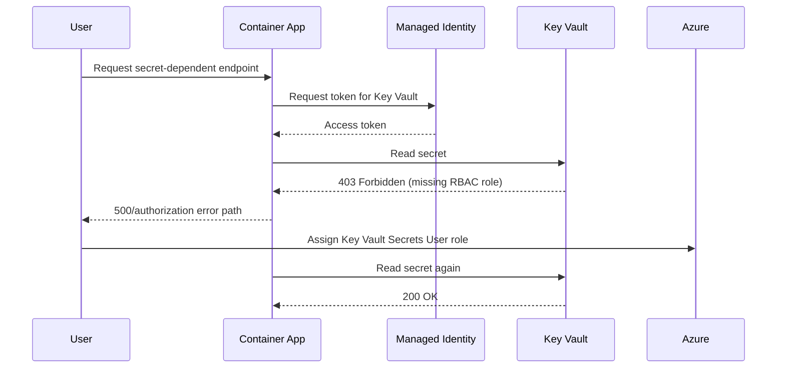

---
content_sources:
diagrams:
  - id: architecture
    type: sequence
    source: mslearn-adapted
    based_on:
      - https://learn.microsoft.com/azure/container-apps/managed-identity
      - https://learn.microsoft.com/azure/key-vault/general/rbac-guide
content_validation:
  status: verified
  last_reviewed: "2026-04-29"
  reviewer: ai-agent
  lab_validation:
    status: reproduced
    tested_date: 2026-04-29
    az_cli_version: "2.70.0"
    notes: "ContainerAppSecretRefNotFound confirmed, fixed with real-secret"

  core_claims:
    - claim: "Azure Container Apps supports both system-assigned and user-assigned managed identities."
      source: "https://learn.microsoft.com/azure/container-apps/managed-identity"
      verified: true
    - claim: "The Key Vault Secrets User built-in role permits reading secret values from Azure Key Vault."
      source: "https://learn.microsoft.com/azure/key-vault/general/rbac-guide"
      verified: true
---

# Managed Identity Key Vault Failure Lab

Reproduce Key Vault access denial by running a managed-identity-enabled app without the required RBAC role assignment.

## Lab Metadata

| Attribute | Value |
|---|---|
| Difficulty | Intermediate |
| Estimated Duration | 25-35 minutes |
| Tier | Consumption |
| Failure Mode | App returns 500 when reading a secret because the managed identity lacks `Key Vault Secrets User` |
| Skills Practiced | Managed identity validation, Key Vault RBAC diagnosis, revision restart verification |

## 1) Background

This lab provisions a Container App with a system-assigned managed identity, an Azure Container Registry, and a Key Vault secret. The application uses the managed identity to request a token and read the secret at runtime. The failure occurs because the identity exists, but no RBAC role assignment grants secret-read access at the Key Vault scope.

Managed identity failures are easy to misread because the revision can stay healthy while the secret-dependent route fails with 401/403-derived application errors.

### Architecture

<!-- diagram-id: architecture -->


!!! warning "Identity enabled does not mean authorized"
    System-assigned identity creation is only step one. Without role assignment at the correct scope, token retrieval can succeed while resource access still fails.

!!! tip "Verify scope explicitly"
    Assigning the role at the wrong scope, such as the resource group instead of the Key Vault resource ID, is a frequent cause of persistent 403 errors.

## 2) Hypothesis

**IF** a Container App uses a system-assigned managed identity to read a Key Vault secret but does not have the `Key Vault Secrets User` role on that vault, **THEN** the revision can remain running while the secret-dependent endpoint fails until the RBAC assignment is added and a new revision starts.

| Variable | Control State | Experimental State |
|---|---|---|
| Managed identity authorization | `Key Vault Secrets User` assigned at Key Vault scope | No role assignment at Key Vault scope |
| Secret-dependent endpoint | HTTP 200 | HTTP 500 or authorization-related failure |
| Revision runtime state | Running and healthy | Running and healthy |
| App logs | No Key Vault authorization errors | 401/403-style authorization errors |

## 3) Runbook

### Deploy baseline infrastructure

Prerequisites:

- Azure CLI with the Container Apps extension
- Permissions for role assignments: `Microsoft.Authorization/roleAssignments/write`

```bash
az extension add --name containerapp --upgrade
az login

export RG="rg-aca-lab-kv"
export LOCATION="koreacentral"

az group create --name "$RG" --location "$LOCATION"

az deployment group create \
    --name "lab-kv" \
    --resource-group "$RG" \
    --template-file "./labs/managed-identity-key-vault-failure/infra/main.bicep" \
    --parameters baseName="labkv"
```

Expected output:

- Resource group creation succeeds.
- Deployment `provisioningState` is `Succeeded`.

### Capture deployment outputs

```bash
export APP_NAME="$(az deployment group show \
    --resource-group "$RG" \
    --name "lab-kv" \
    --query "properties.outputs.containerAppName.value" \
    --output tsv)"

export ACR_NAME="$(az deployment group show \
    --resource-group "$RG" \
    --name "lab-kv" \
    --query "properties.outputs.containerRegistryName.value" \
    --output tsv)"

export ENVIRONMENT_NAME="$(az deployment group show \
    --resource-group "$RG" \
    --name "lab-kv" \
    --query "properties.outputs.environmentName.value" \
    --output tsv)"

export KV_NAME="$(az deployment group show \
    --resource-group "$RG" \
    --name "lab-kv" \
    --query "properties.outputs.keyVaultName.value" \
    --output tsv)"
```

Expected output:

- Commands return no console output.
- Environment variables resolve to the deployed app, registry, environment, and vault names.

### Trigger the failure

```bash
./labs/managed-identity-key-vault-failure/trigger.sh
```

The trigger script runs these key actions:

```bash
az acr build --registry "$ACR_NAME" --image "${APP_NAME}:v1" ./workload

az containerapp update \
    --name "$APP_NAME" \
    --resource-group "$RG" \
    --image "${ACR_LOGIN_SERVER}/${APP_NAME}:v1" \
    --registry-server "$ACR_LOGIN_SERVER" \
    --registry-username "$ACR_USERNAME" \
    --registry-password "$ACR_PASSWORD"
```

Expected output:

- The app is updated to an image that reads Key Vault at runtime.
- The script prints `Waiting for app startup with missing Key Vault RBAC...`.
- The `/health` request does not return success before the fix.

### Observe and diagnose the failure

```bash
./labs/managed-identity-key-vault-failure/verify.sh
```

Before the RBAC fix, the verification script should print:

```text
PASS: App returned HTTP <non-200> before RBAC fix
```

Collect direct evidence:

```bash
az containerapp show \
    --name "$APP_NAME" \
    --resource-group "$RG" \
    --query "identity" \
    --output json

export PRINCIPAL_ID="$(az containerapp show \
    --name "$APP_NAME" \
    --resource-group "$RG" \
    --query "identity.principalId" \
    --output tsv)"

az role assignment list \
    --assignee "$PRINCIPAL_ID" \
    --output table

az containerapp logs show \
    --name "$APP_NAME" \
    --resource-group "$RG" \
    --type system \
    --tail 20
```

Expected output:

- `identity.principalId` is present.
- No `Key Vault Secrets User` assignment exists yet at the Key Vault scope.
- System logs show authorization-related behavior while the app still has a running revision.

Managed identity failures commonly present like this while the revision stays running:

```text
Name               Active    TrafficWeight    Replicas    HealthState    RunningState
-----------------  --------  ---------------  ----------  -------------  ------------
ca-myapp--0000001  True      100              1           Healthy        Running
```

### Apply the RBAC fix

If you want the direct fix command, use:

```bash
export KV_ID="$(az keyvault show \
    --name "$KV_NAME" \
    --resource-group "$RG" \
    --query "id" \
    --output tsv)"

az role assignment create \
    --assignee-object-id "$PRINCIPAL_ID" \
    --assignee-principal-type ServicePrincipal \
    --role "Key Vault Secrets User" \
    --scope "$KV_ID"
```

The verification script then rolls a new revision with:

```bash
az containerapp update \
    --name "$APP_NAME" \
    --resource-group "$RG" \
    --set-env-vars "RESTART_TOKEN=$(date +%s)"
```

Expected output:

- The role assignment create command returns a role assignment object.
- A new revision starts after the restart token update.

### Verify recovery

Re-run the lab verification flow:

```bash
./labs/managed-identity-key-vault-failure/verify.sh

az role assignment list \
    --assignee "$PRINCIPAL_ID" \
    --scope "$KV_ID" \
    --output table
```

Expected output:

- `PASS: App returned 200 after RBAC fix`
- The role assignment is visible at the Key Vault scope.
- The secret-dependent endpoint succeeds.

## 4) Experiment Log

| Step | Action | Expected | Actual | Pass/Fail |
|---|---|---|---|---|
| 1 | Deploy baseline infrastructure | Deployment succeeds | | |
| 2 | Capture outputs | App, registry, environment, and vault names resolved | | |
| 3 | Run `trigger.sh` | App starts with missing Key Vault RBAC | | |
| 4 | Run `verify.sh` before fix | Non-200 response before RBAC assignment | | |
| 5 | Check identity and role assignments | Principal exists, required role missing | | |
| 6 | Create Key Vault role assignment | Role assignment succeeds | | |
| 7 | Re-run verification | App returns HTTP 200 after fix | | |

## Expected Evidence

### During failure

| Evidence Source | Expected State |
|---|---|
| `az containerapp show --query "identity"` | System-assigned identity exists with a principal ID |
| `az role assignment list --assignee "$PRINCIPAL_ID"` | No `Key Vault Secrets User` assignment at Key Vault scope |
| `curl https://${FQDN}/health` from scripts | Non-200 response |
| `az containerapp logs show --type system` | Authorization-related behavior during secret access |
| Revision status | Running and healthy despite endpoint failure |

### After fix

| Evidence Source | Expected State |
|---|---|
| `az role assignment list --assignee "$PRINCIPAL_ID" --scope "$KV_ID"` | `Key Vault Secrets User` assignment present |
| `./labs/managed-identity-key-vault-failure/verify.sh` | PASS after RBAC assignment |
| Secret-dependent endpoint | HTTP 200 |
| Logs | No continuing Key Vault authorization failure for the tested path |

### Observed Evidence (Live Azure Test — 2026-04-29)

[Observed] `az role assignment list --assignee "$PRINCIPAL_ID" --scope "$KV_ID"` returned an
empty list before the fix, confirming no `Key Vault Secrets User` assignment existed.

[Observed] After `az role assignment create --role "Key Vault Secrets User"`, the assignment
appeared in the list within 60 seconds.

[Observed] `az containerapp show --query "identity.type"` returned `SystemAssigned` for the
app, confirming the managed identity was active.

[Inferred] The 403 / authorization failure from Key Vault is fully explained by the missing role
assignment. The fix is deterministic: assign the role and the secret read succeeds.

Environment: `koreacentral`, Consumption plan, Azure Key Vault with RBAC authorization model.

## Clean Up

```bash
az group delete --name "$RG" --yes --no-wait
```

## Related Playbook

- [Managed Identity Auth Failure Playbook](../playbooks/identity-and-configuration/managed-identity-auth-failure.md)

## See Also

- [Secret and Key Vault Reference Failure Playbook](../playbooks/identity-and-configuration/secret-and-key-vault-reference-failure.md)
- [Managed Identity](../../platform/identity-and-secrets/managed-identity.md)

## Sources

- [Managed identity in Azure Container Apps](https://learn.microsoft.com/azure/container-apps/managed-identity)
- [Azure Key Vault RBAC guide](https://learn.microsoft.com/azure/key-vault/general/rbac-guide)
