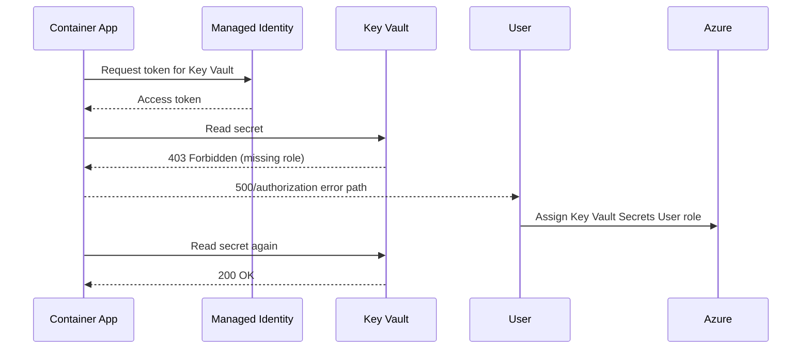

# Managed Identity Key Vault Failure Lab

Reproduce Key Vault access denial by running a managed-identity-enabled app without the required RBAC role assignment.

## Scenario

- **Difficulty**: Intermediate
- **Estimated duration**: 25-35 minutes
- **Failure mode**: app returns 500 when reading secret because identity lacks `Key Vault Secrets User`

## Prerequisites

- Azure CLI with Container Apps extension
- Permissions for role assignments (`Microsoft.Authorization/roleAssignments/write`)

```bash
az extension add --name containerapp --upgrade
az login
```

## Quick Start

```bash
export RG="rg-aca-lab-kv"
export LOCATION="koreacentral"

az group create --name "$RG" --location "$LOCATION"
az deployment group create --name "lab-kv" --resource-group "$RG" --template-file ./labs/managed-identity-key-vault-failure/infra/main.bicep --parameters baseName="labkv"

export APP_NAME="$(az deployment group show --resource-group "$RG" --name "lab-kv" --query \"properties.outputs.containerAppName.value\" --output tsv)"
export ACR_NAME="$(az deployment group show --resource-group "$RG" --name "lab-kv" --query \"properties.outputs.containerRegistryName.value\" --output tsv)"
export KV_NAME="$(az deployment group show --resource-group "$RG" --name "lab-kv" --query \"properties.outputs.keyVaultName.value\" --output tsv)"

cd labs/managed-identity-key-vault-failure
./trigger.sh
./verify.sh
./cleanup.sh
```

## Expected Diagnostic Output Pattern

```text
Managed identity failures commonly present as 401/403 in app logs while revision stays Running:

Name               Active    TrafficWeight    Replicas    HealthState    RunningState
-----------------  --------  ---------------  ----------  -------------  ------------
ca-myapp--0000001  True      100              1           Healthy        Running
```

## Key Takeaways

- System-assigned identity alone is not enough; RBAC role assignment is mandatory.
- Secret access failures often surface as 500 errors in app routes.
- Restart/new revision after RBAC assignment helps validate full recovery path.

## See Also

- [Managed Identity Auth Failure Playbook](../playbooks/identity-and-configuration/managed-identity-auth-failure.md)
- [Secret and Key Vault Reference Failure Playbook](../playbooks/identity-and-configuration/secret-and-key-vault-reference-failure.md)

## Scenario Setup

This lab provisions a managed-identity-enabled Container App and a Key Vault secret. The failure is triggered by omitting the required RBAC role assignment, causing secret-read operations to fail at runtime.



!!! warning "Identity enabled does not mean authorized"
    System-assigned identity creation is only step one. Without role assignment at correct scope, token retrieval can succeed while resource access still fails.

!!! tip "Verify scope explicitly"
    Assigning role at wrong scope (for example resource group instead of Key Vault) is a frequent cause of persistent 403 errors.

## Step-by-Step Walkthrough

1. **Deploy the lab environment**

   ```bash
   export RG="rg-aca-lab-kv"
   export LOCATION="koreacentral"
   az group create --name "$RG" --location "$LOCATION"

   az deployment group create \
     --name "lab-kv" \
     --resource-group "$RG" \
     --template-file "./labs/managed-identity-key-vault-failure/infra/main.bicep" \
     --parameters baseName="labkv"
   ```

   Expected output pattern: `provisioningState` is `Succeeded`.

2. **Capture outputs**

   ```bash
   export APP_NAME="$(az deployment group show --resource-group "$RG" --name "lab-kv" --query "properties.outputs.containerAppName.value" --output tsv)"
   export ACR_NAME="$(az deployment group show --resource-group "$RG" --name "lab-kv" --query "properties.outputs.containerRegistryName.value" --output tsv)"
   export ENVIRONMENT_NAME="$(az deployment group show --resource-group "$RG" --name "lab-kv" --query "properties.outputs.containerAppsEnvironmentName.value" --output tsv)"
   export KV_NAME="$(az deployment group show --resource-group "$RG" --name "lab-kv" --query "properties.outputs.keyVaultName.value" --output tsv)"
   ```

   Expected output: no output.

3. **Trigger and observe failure**

   ```bash
   ./labs/managed-identity-key-vault-failure/trigger.sh
   ./labs/managed-identity-key-vault-failure/verify.sh
   ```

   Expected output: API call path fails with authorization-related behavior.

4. **Confirm identity configuration**

   ```bash
   az containerapp show \
     --name "$APP_NAME" \
     --resource-group "$RG" \
     --query "identity" \
     --output json
   ```

   Expected output pattern: system-assigned identity has a principal ID.

5. **Check role assignments for app principal**

   ```bash
   export PRINCIPAL_ID="$(az containerapp show --name "$APP_NAME" --resource-group "$RG" --query "identity.principalId" --output tsv)"
   az role assignment list --assignee "$PRINCIPAL_ID" --output table
   ```

   Expected output pattern: missing `Key Vault Secrets User` at Key Vault scope before fix.

6. **Apply RBAC fix**

   ```bash
   export KV_ID="$(az keyvault show --name "$KV_NAME" --resource-group "$RG" --query "id" --output tsv)"
   az role assignment create \
     --assignee-object-id "$PRINCIPAL_ID" \
     --assignee-principal-type ServicePrincipal \
     --role "Key Vault Secrets User" \
     --scope "$KV_ID"
   ```

   Expected output pattern: role assignment object is returned successfully.

7. **Verify resolution**

   ```bash
   ./labs/managed-identity-key-vault-failure/verify.sh
   az role assignment list --assignee "$PRINCIPAL_ID" --scope "$KV_ID" --output table
   ```

   Expected output: secret read succeeds and role assignment is visible.

## Symptoms / Cause / Fix Matrix

| What you see | What is happening | How to fix |
|---|---|---|
| Route returns 500 when reading secret | App code receives Key Vault authorization failure | Assign `Key Vault Secrets User` to app principal |
| Identity exists but still 403 | RBAC scope is wrong or role missing | Recreate assignment on exact Key Vault resource ID |
| Revision appears healthy despite failures | Runtime path fails only on secret access route | Test secret-dependent endpoint explicitly |
| Intermittent failures after role assignment | RBAC propagation delay | Wait and retry verification after short delay |

## Resolution Verification Checklist

1. App principal ID is present.
2. `Key Vault Secrets User` role is assigned at Key Vault scope.
3. Secret-dependent endpoint returns expected success response.
4. Logs no longer show Key Vault 403 for the tested path.

## Sources

- [Microsoft Learn: Managed identity in Azure Container Apps](https://learn.microsoft.com/azure/container-apps/managed-identity)
- [Microsoft Learn: Key Vault RBAC guide](https://learn.microsoft.com/azure/key-vault/general/rbac-guide)
