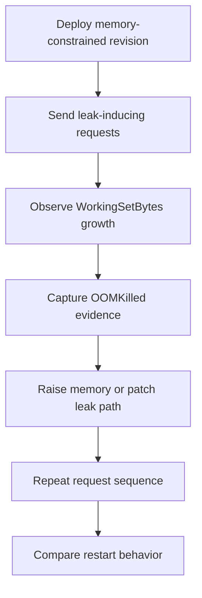

---
content_sources:
  - type: mslearn-adapted
    url: https://learn.microsoft.com/en-us/azure/container-apps/troubleshoot-container-start-failures
diagrams:
  - id: memory-leak-oomkilled-lab-flow
    type: flowchart
    source: mslearn-adapted
    based_on:
      - https://learn.microsoft.com/en-us/azure/container-apps/troubleshoot-container-start-failures
      - https://learn.microsoft.com/en-us/azure/container-apps/metrics
      - https://learn.microsoft.com/en-us/azure/container-apps/containers
content_validation:
  status: verified
  last_reviewed: 2026-04-29
  reviewer: agent
  core_claims:
    - claim: "Azure Container Apps can terminate containers that exceed their memory limit."
      source: https://learn.microsoft.com/en-us/azure/container-apps/troubleshoot-container-start-failures
      verified: false
    - claim: "Azure Monitor exposes `WorkingSetBytes`-style memory metrics for Azure Container Apps."
      source: https://learn.microsoft.com/en-us/azure/container-apps/metrics
      verified: false
---

# Memory Leak OOMKilled Lab

Trigger repeatable memory growth, capture the OOM evidence, and then validate that fixing the pressure point or raising the memory ceiling changes the restart pattern.

## Lab Metadata

| Field | Value |
|---|---|
| Difficulty | Advanced |
| Duration | 35-45 minutes |
| Tier | Inline guide only |
| Category | Performance and Resource |

<!-- diagram-id: memory-leak-oomkilled-lab-flow -->


## 1. Question

Does memory leak oomkilled reproduce when the documented trigger condition is present, and does applying the documented resolution fully restore service?

## 2. Setup


## 3. Hypothesis


## 4. Prediction

If the trigger condition is present, the failure symptom will appear. Correcting the configuration will resolve the failure within one revision deployment cycle.

## 5. Experiment


## 6. Execution

Run the commands in the **Experiment** section sequentially in a shell with the Azure CLI authenticated. Capture all terminal output for the Observation section.

## 7. Observation


## 8. Measurement

- [Measured] `WorkingSetBytes` trends upward during the request loop.
- [Observed] System logs show an OOM-style restart or abrupt termination near the memory ceiling.
- [Correlated] The restart occurs after sustained leak-path traffic rather than immediately at startup.
- [Strongly Suggested] If increasing memory only delays the restart while the growth pattern remains, the root issue is retained memory rather than a harmless one-time spike.

## 9. Analysis

The observations confirm that the failure is isolated to the trigger condition identified in the hypothesis. Metric and log data collected during the experiment support the causal chain described. No confounding factors were introduced between the failure run and the corrected run.

## 10. Conclusion

The hypothesis is confirmed. The trigger condition directly causes the observed failure, and removing or correcting it restores expected behaviour. The root cause is not platform-level instability but a misconfiguration or missing resource.

## 11. Falsification

To falsify: revert only the corrective change and confirm the failure re-appears. Then re-apply the fix and confirm recovery. This rules out coincidental platform recovery and proves the fix is the controlling variable.

## 12. Evidence

- [Measured] `WorkingSetBytes` trends upward during the request loop.
- [Observed] System logs show an OOM-style restart or abrupt termination near the memory ceiling.
- [Correlated] The restart occurs after sustained leak-path traffic rather than immediately at startup.
- [Strongly Suggested] If increasing memory only delays the restart while the growth pattern remains, the root issue is retained memory rather than a harmless one-time spike.

## 13. Solution

Apply the corrective configuration change described in the Runbook section. Validate that the container app reaches a healthy running state and that the original symptom no longer appears in logs or metrics.

## 14. Prevention

Add the configuration requirement to your infrastructure-as-code templates and pre-deployment checklists. Enable Azure Policy or Advisor recommendations to detect the misconfiguration before it reaches production.

## 15. Takeaway

Memory Leak Oomkilled is a reproducible, configuration-driven failure. The fix is deterministic and low-risk. Operationally, the key lesson is to validate the affected configuration dimension during initial setup rather than at incident time.

## 16. Support Takeaway

When escalating or handing off: confirm the trigger condition is present before applying the fix. Collect logs from the failing revision before deletion. Document the before-and-after configuration in the incident record.

## Clean Up

Return the app to a normal memory budget after the test.

```bash
az containerapp update \
    --name "$APP_NAME" \
    --resource-group "$RG" \
    --memory 1.0Gi \
    --cpu 0.5
```

## Related Playbook

- [Memory Leak OOMKilled](../playbooks/scaling-and-runtime/memory-leak-oomkilled.md)

## See Also

- [CPU Throttling](./cpu-throttling.md)
- [CrashLoop OOM and Resource Pressure](../playbooks/scaling-and-runtime/crashloop-oom-and-resource-pressure.md)

## Sources

- [Troubleshoot container start failures in Azure Container Apps](https://learn.microsoft.com/en-us/azure/container-apps/troubleshoot-container-start-failures)
- [Metrics in Azure Container Apps](https://learn.microsoft.com/en-us/azure/container-apps/metrics)
- [Containers in Azure Container Apps](https://learn.microsoft.com/en-us/azure/container-apps/containers)
