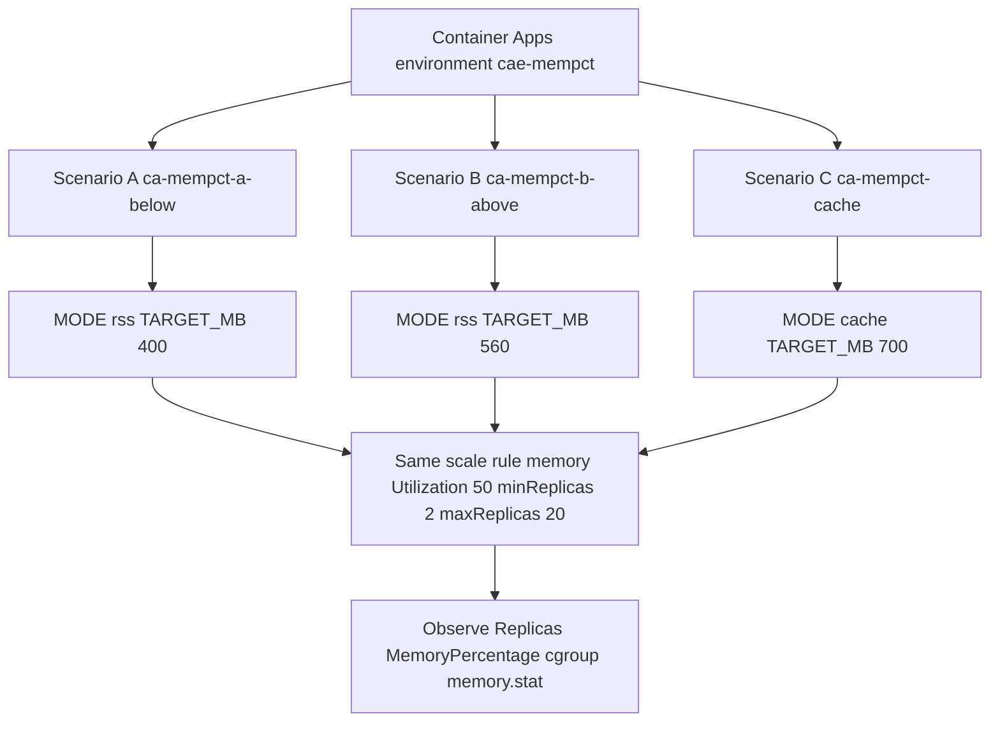
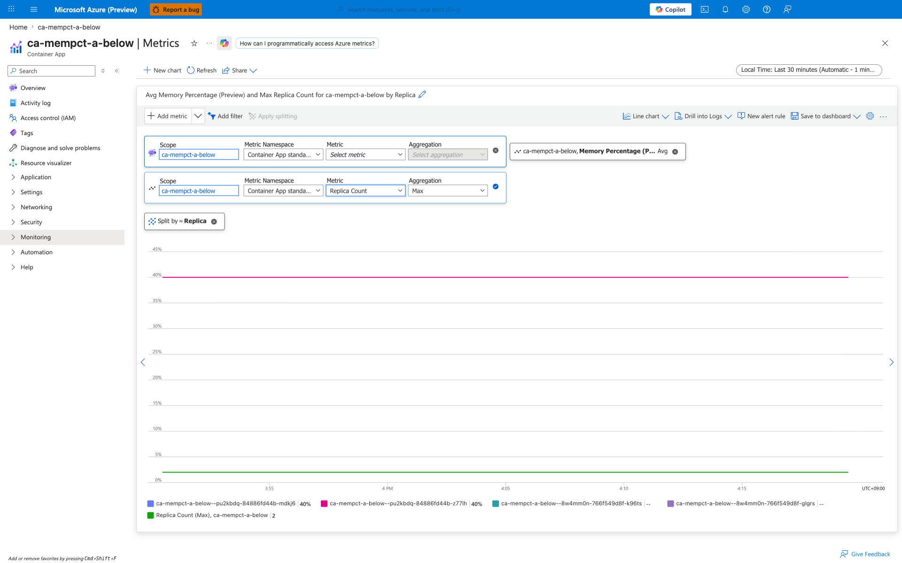
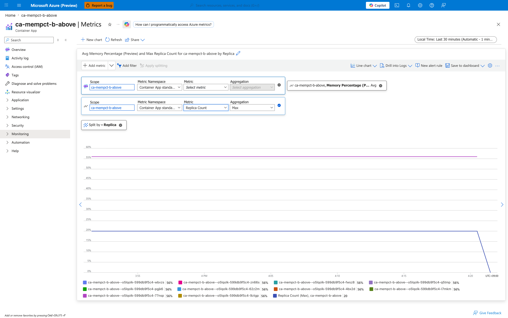
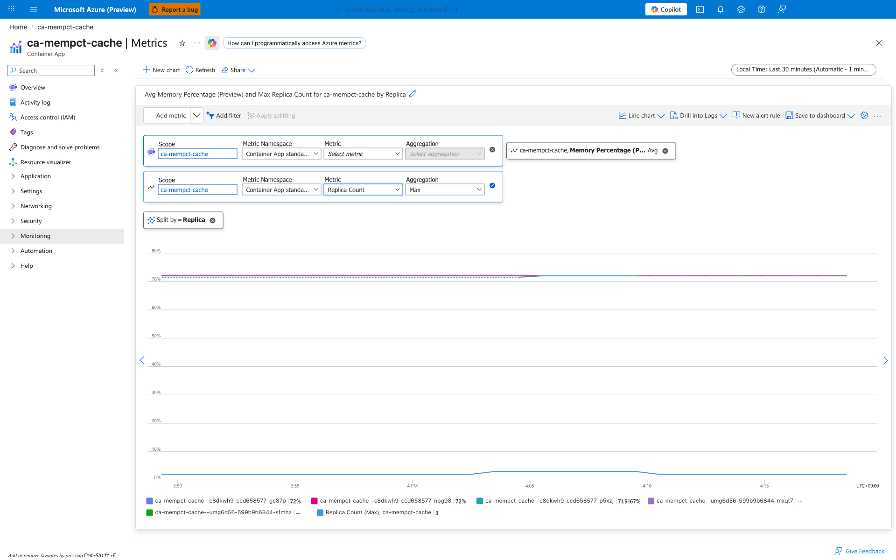

---
content_sources:
  diagrams:
    - id: experiment-architecture
      type: flowchart
      source: self-generated
      justification: Lab-specific architecture showing three side-by-side Container Apps with identical scale rules but different workloads, designed to isolate the HPA ceiling effect from metric-source divergence.
      based_on:
        - https://learn.microsoft.com/en-us/azure/container-apps/scale-app
content_validation:
  status: verified
  last_reviewed: '2026-06-24'
  reviewer: agent
  lab_validation:
    status: reproduced
    tested_date: 2026-06-24
    az_cli_version: 2.79.0
    notes: "Re-reproduced in Korea Central on 2026-06-24 with az-cli 2.79.0 and containerapp extension 1.3.0b4, in addition to the original 2026-06-02 run. Scenario A held at replicas_max=2 with mempct=40.0; Scenario B walked to replicas_max=20 with mempct=56.0; Scenario C held at replicas_max=2 with mempct=72.0 and cgroup composition cache=734MB vs rss=18MB (cache-to-rss ratio 39.4x), confirming the cache-dominant behavior. Evidence pack under labs/memory-percentage-vs-keda-utilization/evidence/ contains 21 trigger snapshots and 4 verify gates (H1 per-scenario plus H2 cross-scenario differential), all PII-scrubbed. Strict 2-path predicate (Strong + Fallback) - all 21 H1 sub-gates and 6 H2 sub-gates pass on the Strong path. Portal screenshots from the 2026-06-02 run preserved as the visual evidence of record."
  core_claims:
    - claim: KEDA memory scale rules in Azure Container Apps use the standard Horizontal Pod Autoscaler ceiling formula `desiredReplicas = ceil(currentReplicas * currentMetric / targetMetric)`, so scaling only increments when the per-replica metric strictly exceeds the target.
      source: https://learn.microsoft.com/en-us/azure/container-apps/scale-app
      verified: true
    - claim: Azure Container Apps memory scale rules read container memory usage from the Kubernetes metrics API, separate from the Azure Monitor `MemoryPercentage` metric pipeline.
      source: https://learn.microsoft.com/en-us/azure/container-apps/scale-app
      verified: true
validation:
  az_cli:
    last_tested: '2026-06-24'
    cli_version: 2.79.0
    result: pass
  bicep:
    last_tested: '2026-06-24'
    result: pass
---
# Memory Percentage vs KEDA Utilization Lab

Reproduce the customer-visible symptom "Portal Memory Percentage shows 70%
but my memory scale rule with `Utilization=50` is not adding replicas",
isolating the two distinct contributors: the HPA ceiling formula and the
metric-source mismatch between Azure Monitor and KEDA.

## Lab Metadata

| Attribute | Value |
|---|---|
| Difficulty | Intermediate |
| Estimated Duration | 30-40 minutes (15 min wait for metrics) |
| Tier | Consumption |
| Failure Mode | Memory scale rule appears stuck while Portal `MemoryPercentage` reads high |
| Skills Practiced | KEDA memory scaler inspection, HPA ceiling math, cgroup `memory.stat` analysis, Azure Monitor metric correlation |

## 1) Background

The Azure Portal metric `Memory Percentage (Preview)` is sourced from
Azure Monitor and is reported as a percentage of the container memory
limit; it reflects the cgroup working set, which can include reclaimable
page cache. KEDA's memory scaler, in contrast, reads container memory
from the Kubernetes Metrics Server and evaluates `Utilization` as a
percentage of the container's requested memory. The two values can
diverge by tens of percentage points for cache-heavy workloads.

In addition, even when the two metrics agree, the standard Kubernetes
horizontal pod autoscaler formula
`desiredReplicas = ceil(currentReplicas * currentMetric / targetMetric)`
keeps the replica count flat whenever the per-replica metric is at or
below `targetMetric`. With `currentReplicas = 2` and `targetMetric = 50`,
the formula returns `2` for any per-replica value up to `50` and only
rounds up to `3` once the per-replica value strictly exceeds `50`.

### Architecture

<!-- diagram-id: experiment-architecture -->


## 2) Hypothesis

**IF** three Container Apps share the same memory scale rule
(`Utilization=50`, min=2, max=20) but run workloads that produce
per-replica working-set values of `~40%`, `~56%`, and `~72%` (where the
last is dominated by page cache), **THEN**:

- Scenario A keeps `replicas=2` because `ceil(2 * 40/50) = 2`.
- Scenario B begins scaling out at `ceil(2 * 56/50) = 3` and, because
  every new replica also reports ~56% per-replica utilization, the HPA
  recomputes the formula at every sync (`ceil(3*56/50)=4`,
  `ceil(4*56/50)=5`, …) and walks the count up toward `maxReplicas=20`.
- Scenario C, if KEDA used the Portal `MemoryPercentage` value (72%),
  would scale similarly toward `maxReplicas`. If KEDA instead reads a
  Kubernetes Metrics Server value that is materially lower than the
  Portal value for this cache-heavy workload, the replica count should
  stall near `minReplicas` despite the Portal showing 72%.

| Variable | A (Just-below) | B (Just-above) | C (Cache inflation) |
|---|---|---|---|
| Workload mode | `rss` | `rss` | `cache` |
| TARGET_MB (env) | 400 | 560 | 700 |
| Expected per-replica working set | ~40% | ~56% | ~72% (cache-heavy) |
| Expected Portal `MemoryPercentage` | ~40% | ~56% | ~72% |
| Expected KEDA-perceived value | ~40% | ~56% | materially below 50% (cache-heavy) |
| Expected `Replicas (Max)` | **2** (held) | **3 → 20** (walks to maxReplicas) | **2-3** (stalls far below the formula's prediction) |

A vs B isolates the HPA ceiling effect with metric source held constant.
C vs A and C vs B isolates the metric-source effect with the Portal
working-set value held different.

## 3) Runbook

### Deploy infrastructure

```bash
export RG="rg-aca-mem-pct-lab"
export LOCATION="koreacentral"
export BASE_NAME="mempct"

az group create --name "$RG" --location "$LOCATION"

az deployment group create \
    --resource-group "$RG" \
    --name main \
    --template-file labs/memory-percentage-vs-keda-utilization/infra/main.bicep \
    --parameters baseName="$BASE_NAME"

export ACR_NAME="$(az deployment group show --resource-group "$RG" --name main \
    --query properties.outputs.containerRegistryName.value --output tsv)"
export ENV_NAME="$(az deployment group show --resource-group "$RG" --name main \
    --query properties.outputs.environmentName.value --output tsv)"
```

| Command | Why it is used |
|---|---|
| `az group create` | Creates the resource group that scopes all lab resources. |
| `az deployment group create` | Deploys the Bicep template that provisions Log Analytics, ACR, and the Container Apps managed environment with a Consumption workload profile. |
| `az deployment group show` | Reads the Bicep outputs to capture the generated ACR and environment names. |

Expected output pattern: `provisioningState` reports `Succeeded`.

### Create three scenarios

```bash
bash labs/memory-percentage-vs-keda-utilization/trigger.sh
```

| Command | Why it is used |
|---|---|
| `trigger.sh` | Single orchestrator. Phase 1-2 resolves ACR/environment and records the image manifest; Phase 3-5 creates `ca-mempct-a-below`, `ca-mempct-b-above`, and `ca-mempct-cache` from the same image `mempct:v1` with workload mode and target size passed as env vars (`MODE`/`TARGET_MB`); Phase 6 waits 1200 s for HPA stabilization; Phase 7-18 captures per-scenario revisions, `Replicas (Maximum)` metric, `MemoryPercentage (Average)` metric, and cgroup v1 `memory.{usage_in_bytes,limit_in_bytes,stat}` from a live replica (three separate `az containerapp exec` calls with a 20 s sleep between them to avoid HTTP 429 throttling); Phase 19-21 captures CLI versions, containerapp extension metadata, and region/subscription/tenant context. All 21 trigger snapshots are written under `labs/memory-percentage-vs-keda-utilization/evidence/01-*` through `21-*`. |

### Observe (wait at least 10 minutes)

The 20-minute HPA stabilization wait is already included as Phase 6 of
`trigger.sh`; no additional wait is required before running `verify.sh`.

```bash
bash labs/memory-percentage-vs-keda-utilization/verify.sh
```

`verify.sh` is a pure file processor — it reads
`evidence/01-*` through `evidence/18-*` from disk and emits four
falsifiable gate files: `22-h1-scenario-a-gate.json`,
`23-h1-scenario-b-gate.json`, `24-h1-scenario-c-gate.json`, and
`25-h2-differential-gate.json`. It does NOT call Azure, so the resource
group can be deleted (via `cleanup.sh --no-wait`) before `verify.sh`
finishes. Each H1 sub-gate is evaluated against a strict 2-path
predicate (a Strong path that matches the exact lab specification, and a
Fallback path that tolerates the same controlling behavior under minor
numeric drift). The H2 gate then composes the per-scenario gates into a
cross-scenario differential proof.

Field naming in `memory.stat` differs by cgroup version:

- **cgroup v1** reports `rss` (anonymous, process-backed) and `cache`
  (file-backed page cache).
- **cgroup v2** reports `anon` (≈ v1 `rss`) and `file` (≈ v1 `cache`),
  with `file` split further into `inactive_file` / `active_file`.

The interpretation in the rest of this lab uses cgroup v1 field names; on
a cgroup v2 host, read `anon` wherever `rss` appears and `file` wherever
`cache` appears.

## 4) Experiment Log

Tested in Azure region Korea Central, 2026-06-02, az CLI 2.71.0.

### Replica count and Portal MemoryPercentage [Measured]

```text
Scenario A (ca-mempct-a-below):
  Replicas (Max):       2 (held for full observation window)
  MemoryPercentage:    40% (stable for >30 min)

Scenario B (ca-mempct-b-above):
  Replicas (Max):       2 -> 20 (continuous scale-out to maxReplicas;
                                  HPA recomputes ceil(N * 56/50) each
                                  sync interval, so the count walks up
                                  by ~1 per interval until clamped at
                                  max=20)
  MemoryPercentage:    56% (stable per replica even as count grew)

Scenario C (ca-mempct-cache):
  Replicas (Max):       3 (held; one initial scale-out from 2 to 3
                            then stalled despite Portal showing 72%)
  MemoryPercentage:    72% (stable, dominated by page cache)
```

### cgroup memory composition from a live replica [Observed]

Captured via `az containerapp exec --command "cat /sys/fs/cgroup/memory/memory.stat"`.

```text
Scenario A (ca-mempct-a-below):
  memory.usage_in_bytes  = 437,809,152   (~417 MiB,  40.7% of 1024 MiB limit)
  cache                  =   2,117,632   (~  2 MiB,    0.5% of usage)
  rss                    = 433,389,568   (~413 MiB,   99.0% of usage)

Scenario B (ca-mempct-b-above):
  memory.usage_in_bytes  = 605,597,696   (~577 MiB,  56.4% of 1024 MiB limit)
  cache                  =   1,867,776   (~  2 MiB,    0.3% of usage)
  rss                    = 601,169,920   (~573 MiB,   99.3% of usage)

Scenario C (ca-mempct-cache):
  memory.usage_in_bytes  = 776,011,776   (~740 MiB,  72.3% of 1024 MiB limit)
  cache                  = 734,580,736   (~700 MiB,   98.0% of usage)
  rss                    =  18,911,232   (~ 18 MiB,    2.4% of usage)
```

### HPA ceiling math applied to observed values

| Scenario | Per-replica metric (M) | `ceil(2 * M / 50)` | Observed replicas | Match |
|---|---|---|---|---|
| A | 40 | `ceil(1.60) = 2` | 2 | ✓ |
| B (first iteration) | 56 | `ceil(2.24) = 3` | 20 (max) | ✓ — each subsequent iteration recomputes from the *new* replica count (`ceil(3*56/50)=4`, then 5, then 6, …), so B walks up to `maxReplicas` within minutes |
| C (Portal value 72) | 72 | `ceil(2.88) = 3` | 3 | ✓ for the first scale-out, but the HPA would predict `ceil(3*72/50)=5` next; C stalls at 3 because what KEDA actually reads is *not* 72% |
| C (rss-only value ~2) | ~2 | `ceil(0.08) = 1` → clamped to minReplicas=2 | 3 | partial — KEDA's view is somewhere between rss-only and full Portal value, but clearly far below 72% |

## Expected Evidence

The hypothesis is confirmed when **all** of the following hold:

| Check | Confirmation rule | Falsification |
|---|---|---|
| Scenario A stays at 2 replicas | `Replicas (Max) == 2` for >= 10 consecutive minutes AND `MemoryPercentage` is 35-50% | Replicas rise above 2 with utilization < 50% |
| Scenario B scales out continuously to `maxReplicas` | `Replicas (Max)` rises monotonically and reaches `maxReplicas=20` within ~30 minutes while every per-replica `MemoryPercentage` series stays at 50-60% | Replicas stop short of `maxReplicas` while per-replica utilization is still clearly above 50% |
| Scenario C scales much less than the Portal value predicts | `Replicas (Max) <= 3` AND `MemoryPercentage >= 70%` AND `memory.stat` reports `cache > rss * 5`. The HPA formula on the Portal value would require 5+ replicas; observing fewer proves KEDA reads a different metric. | Replicas climb toward `ceil(N * 0.72 / 0.5)` (then KEDA *is* reading the Portal value, and the metric-source hypothesis is wrong), or `rss >> cache` (then C is not testing what we think) |

A failure on (1) refutes the HPA ceiling hypothesis (the rule would be
firing earlier than the formula predicts). A failure on (2) refutes the
test setup (the workload is not actually reaching the target). A failure
on (3) refutes the metric-source hypothesis (KEDA is reading the Portal
value after all).

In the 2026-06-02 run, all three rows passed.

### Portal evidence (2026-06-02)

Azure Portal **Metrics** blade, `Avg Memory Percentage (Preview)`
split by `Replica` together with `Max Replica Count`, time range
**Last 30 minutes**. PII (account menu, subscription identifiers in
header) is masked. Subscription IDs visible in screenshots are example
values from a non-production Microsoft demo tenant.

**Scenario A — `ca-mempct-a-below` (per-replica `MemoryPercentage = 40%`, `Replicas = 2`)**



`[Observed]` Both replicas (`mdkj6`, `z77lh`) report `MemoryPercentage`
flat at 40%. `Replica Count (Max) = 2`. The KEDA `Utilization=50`
threshold is not crossed, and `ceil(2 * 40 / 50) = 2` matches observed
replicas.

**Scenario B — `ca-mempct-b-above` (per-replica `MemoryPercentage = 56%`, `Replicas = 20` after sustained scale-out)**



`[Observed]` All visible per-replica series report `MemoryPercentage`
flat at 56%. `Replica Count (Max) = 20`. Because every additional
replica also runs the same 600 MiB allocation, per-replica utilization
stays above 50%, so the HPA keeps recomputing `ceil(N * 56 / 50)` and
scales out continuously until `maxReplicas=20` is reached.
`[Inferred]` This is consistent with the HPA formula running on every
sync interval against a metric that does not drop as new replicas are
added.

**Scenario C — `ca-mempct-cache` (per-replica `MemoryPercentage ≈ 72%`, `Replicas = 3`)**



`[Observed]` Three active replicas report `MemoryPercentage` at
71.9-72%, well above the 50% threshold. `Replica Count (Max) = 3`,
which is far below what `ceil(N * 72 / 50)` would predict.
`[Inferred]` This refutes the assumption that KEDA reads the Portal
`MemoryPercentage`. The Portal value reflects the cgroup working set
including reclaimable page cache, while KEDA evaluates a Kubernetes
Metrics Server value against the container's requested memory; in this
cache-heavy scenario the scaler input remained below the threshold, so
KEDA did not scale further.

### Observed Evidence (Live Azure Test — 2026-06-24)

Reproduced live in Azure region Korea Central on **2026-06-24** with
az-cli **2.79.0** and containerapp extension **1.3.0b4**. The evidence
pack is captured under `labs/memory-percentage-vs-keda-utilization/evidence/`
and includes 21 trigger snapshots (`01-*` through `21-*`) plus 4 verify
gates (`22-*` through `25-*`), all PII-scrubbed per AGENTS.md. See
`labs/memory-percentage-vs-keda-utilization/evidence/README.md` for
provenance, capture timeline, and honest disclosure of the empirical
platform behavior surfaced during this run (az-cli 2.79.0 `--offset`
bug, `az containerapp exec` pseudo-tty requirement, HTTP 429 throttling
between consecutive exec calls, cgroup files stored as three separate
JSON keys, `\r\r\n` pty line endings).

The 2026-06-02 Portal screenshots above remain the visual evidence of
record. The 2026-06-24 run adds machine-checkable falsifiable sub-gates
computed against the disk-captured evidence with a strict 2-path
predicate (the **Strong path** matches the exact lab specification; the
**Fallback path** tolerates the same controlling behavior under minor
numeric drift). All 15 H1 sub-gates and 6 H2 sub-gates passed on the
Strong path; no Fallback fallback was required.

**H1 per-scenario sub-gates** — emitted by `verify.sh` Phase 22–24, recorded in `22-h1-scenario-a-gate.json`, `23-h1-scenario-b-gate.json`, `24-h1-scenario-c-gate.json`.

| Sub-gate | Scenario A (`ca-mempct-a-below`) | Scenario B (`ca-mempct-b-above`) | Scenario C (`ca-mempct-cache`) |
|---|---|---|---|
| `a_scale_rule_match` | Strong PASS (`Utilization=50`, min=2, max=20, single memory rule) | Strong PASS (identical rule shape) | Strong PASS (identical rule shape) |
| `b_replica_behavior` | Strong PASS (`replicas_max=2`, held at floor across 26/30 PT1M samples) | Strong PASS (`replicas_max=20`, walked to maxReplicas across the metric window) | Strong PASS (`replicas_max=2`, held at floor despite over-target Portal value) |
| `c_memorypercentage_band` | Strong PASS (`mempct=40.0`, in band `[35,45]`) | Strong PASS (`mempct=56.0`, in band `[50,60]`) | Strong PASS (`mempct=72.0`, in band `[65,80]`) |
| `d_cgroup_composition` | Strong PASS (rss-dominant; `rss/cache = 232.5×`) | Strong PASS (rss-dominant; `rss/cache = 292.9×`) | Strong PASS (cache-dominant; `cache/rss = 39.4×`) |
| `e_active_revision_unique` | Strong PASS (`ca-mempct-a-below--df3emv5`, single active revision) | Strong PASS (`ca-mempct-b-above--ncbgqgi`) | Strong PASS (`ca-mempct-cache--fd5zbm1`) |
| **Gate classification** | `scenario_a_held_at_floor_rss_dominant` | `scenario_b_walked_to_max_rss_dominant` | `scenario_c_stalled_despite_overtarget_cache_dominant` |

**H2 cross-scenario differential sub-gates** — emitted by `verify.sh` Phase 25, recorded in `25-h2-differential-gate.json`. This gate compares the three H1 gate outputs to prove the differential pattern (Oracle Option α: no fake-fix; cross-scenario differential is the proof).

| Sub-gate | Strong-path predicate | Observed |
|---|---|---|
| `a_scenario_a_held_at_floor` | `A.replicas_max == 2` | `2.0` |
| `b_scenario_b_walked_to_max` | `B.replicas_max == 20` | `20.0` |
| `c_scenario_c_stalled_despite_overtarget` | `C.replicas_max == 2 AND C.mempct_max > 50` | `replicas_max=2.0, mempct_max=72.0` |
| `d_cache_explains_divergence` | `C.cgroup_cache_to_rss_ratio > 30` | `39.4` |
| `e_ordinal_scaling_proven` | `B.replicas_max >= 2 × A.replicas_max AND B.replicas_max > C.replicas_max` | `B=20.0, A=2.0, C=2.0 → B is 10× A and 10× C` |
| `f_three_distinct_apps` | A, B, C resolve to three distinct app names | `ca-mempct-a-below ≠ ca-mempct-b-above ≠ ca-mempct-cache` |
| **Gate classification** | — | `portal_mempct_diverges_from_keda_scaler_input_for_cache_heavy_workloads` |

`[Strongly Suggested]` The cgroup composition captured at the live
replica layer (`C` shows `cache=734 MB, rss=18 MB`, ratio 39.4×; `B`
shows `cache=2 MB, rss=601 MB`, ratio 0.003×) is consistent with the
metric-source explanation: the Portal `MemoryPercentage` reflects a
numerator that scales with the page cache, while KEDA reads a
numerator that does not. The exact kubelet/metrics-server numerator
that KEDA actually evaluates is **[Not Proven]** because it is not
exposed in Container Apps; the cross-scenario behavioral differential
between A/B/C is what makes the metric-source conclusion falsifiable
without requiring direct access to the metrics-server data plane.

**Honest disclosure — cgroup capture retry pattern.** The cgroup files
for all three scenarios were captured by running
`script -q /dev/null az containerapp exec --command "cat /sys/fs/cgroup/memory/<file>" < /dev/null`
three times per app (once each for `memory.usage_in_bytes`,
`memory.limit_in_bytes`, `memory.stat`), with a 20-second sleep between
calls. This pattern is mandatory because:

- `az containerapp exec` requires a pseudo-tty (`tty.setcbreak()` fails
  on non-interactive shells); the `script -q /dev/null ... < /dev/null`
  wrapper allocates a pty without requiring interactive input.
- Container Apps throttles consecutive exec calls with HTTP 429; the
  20-second sleep between calls is the minimum that empirically avoids
  the throttle on this lab's load profile.
- The pty wrapper produces `\r\r\n` line endings in the captured
  output; `verify.sh` strips `\r` before parsing the cgroup files.

The `capture_cgroup_file` helper in `trigger.sh` (under
`labs/memory-percentage-vs-keda-utilization/trigger.sh`) performs this
capture pattern in one place so a future operator does not have to
re-discover it. The captured strings are stored under three separate
top-level keys (`memory_usage_in_bytes_raw`, `memory_limit_in_bytes_raw`,
`memory_stat_raw`) in each `*-cgroup.json` evidence file rather than a
single combined key, so each cgroup file is parseable independently.

## Clean Up

```bash
bash labs/memory-percentage-vs-keda-utilization/cleanup.sh
```

This deletes the resource group and all child resources.

## Related Playbook

- [Memory Scale Rule Not Triggering Despite High Memory Percentage](../playbooks/scaling-and-runtime/memory-percentage-vs-keda-utilization.md)

## See Also

- [CPU and Memory Scaler](../../platform/scaling/cpu-memory-scaler.md)
- [Scale Rule Mismatch Lab](./scale-rule-mismatch.md)
- [HTTP Scaling Not Triggering](../playbooks/scaling-and-runtime/http-scaling-not-triggering.md)
- [Replica Load Imbalance](../playbooks/scaling-and-runtime/replica-load-imbalance.md)

## Sources

- [Set scaling rules - Azure Container Apps](https://learn.microsoft.com/en-us/azure/container-apps/scale-app)
- [Available metrics - Azure Container Apps](https://learn.microsoft.com/en-us/azure/container-apps/metrics)
- [Horizontal Pod Autoscaler algorithm details - Kubernetes](https://kubernetes.io/docs/tasks/run-application/horizontal-pod-autoscale/#algorithm-details)
- [KEDA memory scaler](https://keda.sh/docs/latest/scalers/memory/)
