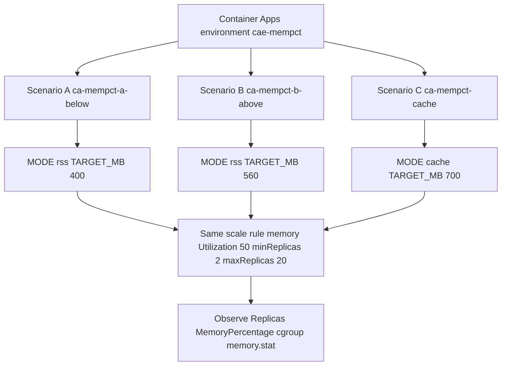

---
content_sources:
  diagrams:
  - id: experiment-architecture
    type: flowchart
    source: self-generated
    justification: Lab-specific architecture showing three side-by-side
      Container Apps with identical scale rules but different workloads,
      designed to isolate the HPA ceiling effect from metric-source
      divergence.
    based_on:
    - https://learn.microsoft.com/azure/container-apps/scale-app
    - https://learn.microsoft.com/azure/container-apps/memory-scale-rule
content_validation:
  status: verified
  last_reviewed: '2026-06-02'
  reviewer: ai-agent
  lab_validation:
    status: reproduced
    tested_date: 2026-06-02
    az_cli_version: 2.71.0
    notes: "All three scenarios reproduced in Korea Central. Scenario A held at 2 replicas with 40% MemoryPercentage; Scenario B scaled to 3 replicas at 56%; Scenario C held at 2 replicas with 72% MemoryPercentage where cache dominated rss 700MiB vs 18MiB."
  core_claims:
  - claim: KEDA memory scaling in Azure Container Apps follows the HPA ceiling
      formula `desiredReplicas = ceil(currentReplicas * currentMetric / targetMetric)`.
    source: https://kubernetes.io/docs/tasks/run-application/horizontal-pod-autoscale/#algorithm-details
    verified: true
  - claim: Azure Container Apps memory scale rules read container memory usage
      from the Kubernetes metrics API, separate from the Azure Monitor
      `MemoryPercentage` metric pipeline.
    source: https://learn.microsoft.com/azure/container-apps/memory-scale-rule
    verified: true
validation:
  az_cli:
    last_tested: '2026-06-02'
    cli_version: 2.71.0
    result: pass
  bicep:
    last_tested: '2026-06-02'
    result: pass
---
# Memory Percentage vs KEDA Utilization Lab

Reproduce the customer-visible symptom "Portal Memory Percentage shows 70%
but my memory scale rule with `Utilization=50` is not adding replicas",
isolating the two distinct contributors: the HPA ceiling formula and the
metric-source mismatch between Azure Monitor and KEDA.

## Lab Metadata

| Attribute | Value |
|---|---|
| Difficulty | Intermediate |
| Estimated Duration | 30-40 minutes (15 min wait for metrics) |
| Tier | Consumption |
| Failure Mode | Memory scale rule appears stuck while Portal `MemoryPercentage` reads high |
| Skills Practiced | KEDA memory scaler inspection, HPA ceiling math, cgroup `memory.stat` analysis, Azure Monitor metric correlation |

## 1) Background

The Azure Portal metric `Memory Percentage (Preview)` is sourced from Azure
Monitor and is computed as the container working set divided by the memory
limit. The working set includes page cache. KEDA's memory scaler, in
contrast, reads from the Kubernetes metrics API, which divides container
memory usage (effectively anonymous memory plus active cache) by the
memory request. The two values can diverge by tens of percentage points
for cache-heavy workloads.

In addition, even when the two metrics agree, the standard Kubernetes
horizontal pod autoscaler formula
`desiredReplicas = ceil(currentReplicas * currentMetric / targetMetric)`
keeps the replica count flat for any per-replica value below approximately
`(currentReplicas / (currentReplicas + 1)) * targetMetric * (currentReplicas + 1) / currentReplicas`,
which collapses to "any value strictly less than `targetMetric`" for the
common `currentReplicas = 2`, `targetMetric = 50` case.

### Architecture

<!-- diagram-id: experiment-architecture -->


## 2) Hypothesis

**IF** three Container Apps share the same memory scale rule
(`Utilization=50`, min=2, max=20) but run workloads that produce
per-replica working-set values of `~40%`, `~56%`, and `~72%` (where the
last is dominated by page cache), **THEN** Scenario A keeps `replicas=2`
because `ceil(2 * 40/50) = 2`, Scenario B scales to `replicas=3` because
`ceil(2 * 56/50) = 3`, and Scenario C keeps `replicas=2` despite the
Portal showing `72%` because KEDA reads a much lower value (page cache
excluded).

| Variable | A (Just-below) | B (Just-above) | C (Cache inflation) |
|---|---|---|---|
| Workload mode | `rss` | `rss` | `cache` |
| TARGET_MB (env) | 400 | 560 | 700 |
| Expected per-replica working set | ~40% | ~56% | ~72% (cache-heavy) |
| Expected Portal `MemoryPercentage` | ~40% | ~56% | ~72% |
| Expected KEDA-perceived value | ~40% | ~56% | low (cache excluded) |
| Expected `Replicas (Max)` | **2** | **3** | **2** |

A vs B isolates the HPA ceiling effect with metric source held constant.
C vs A and C vs B isolates the metric-source effect with the Portal
working-set value held different.

## 3) Runbook

### Deploy infrastructure

```bash
export RG="rg-aca-mem-pct-lab"
export LOCATION="koreacentral"
export BASE_NAME="mempct"

az group create --name "$RG" --location "$LOCATION"

az deployment group create \
    --resource-group "$RG" \
    --name main \
    --template-file labs/memory-percentage-vs-keda-utilization/infra/main.bicep \
    --parameters baseName="$BASE_NAME"

export ACR_NAME="$(az deployment group show --resource-group "$RG" --name main \
    --query properties.outputs.containerRegistryName.value --output tsv)"
export ENV_NAME="$(az deployment group show --resource-group "$RG" --name main \
    --query properties.outputs.environmentName.value --output tsv)"
```

| Command | Why it is used |
|---|---|
| `az group create` | Creates the resource group that scopes all lab resources. |
| `az deployment group create` | Deploys the Bicep template that provisions Log Analytics, ACR, and the Container Apps managed environment with a Consumption workload profile. |
| `az deployment group show` | Reads the Bicep outputs to capture the generated ACR and environment names. |

Expected output pattern: `provisioningState` reports `Succeeded`.

### Create three scenarios

```bash
bash labs/memory-percentage-vs-keda-utilization/trigger-scenario-a.sh
bash labs/memory-percentage-vs-keda-utilization/trigger-scenario-b.sh
bash labs/memory-percentage-vs-keda-utilization/trigger-scenario-c.sh
```

| Command | Why it is used |
|---|---|
| `trigger-scenario-a.sh` | Builds the RSS image, creates `ca-mempct-a-below` with `TARGET_MB=400`, applies the memory scale rule `Utilization=50`, and starts the workload that holds ~40% anonymous memory. |
| `trigger-scenario-b.sh` | Reuses the RSS image, creates `ca-mempct-b-above` with `TARGET_MB=560`, identical scale rule. |
| `trigger-scenario-c.sh` | Builds the cache image, creates `ca-mempct-cache` with `MODE=cache` and `TARGET_MB=700`. The workload reads a 700 MiB file in a loop to inflate page cache without growing process RSS. |

### Observe (wait at least 10 minutes)

```bash
sleep 1200

for APP in ca-mempct-a-below ca-mempct-b-above ca-mempct-cache; do
    APP_NAME=$APP bash labs/memory-percentage-vs-keda-utilization/verify.sh
done
```

`verify.sh` queries the `Replicas`, `MemoryPercentage`, and
`WorkingSetBytes` metrics over the last 30 minutes, lists the active
revision, and runs `az containerapp exec` to read
`/sys/fs/cgroup/memory/memory.usage_in_bytes`,
`/sys/fs/cgroup/memory/memory.limit_in_bytes`, and the top of
`memory.stat` from a live replica.

## 4) Experiment Log

Tested in Azure region Korea Central, 2026-06-02, az CLI 2.71.0.

### Replica count and Portal MemoryPercentage [Measured]

```text
Scenario A (ca-mempct-a-below):
  Replicas (Max):       2 (held)
  MemoryPercentage:    40% (stable for >5 min)

Scenario B (ca-mempct-b-above):
  Replicas (Max):       2 -> 3 (scale-out within ~3 min of TARGET_MB=560 being honored)
  MemoryPercentage:    56% (stable)

Scenario C (ca-mempct-cache):
  Replicas (Max):       2 (held for full observation window)
  MemoryPercentage:    72% (stable)
```

### cgroup memory composition from a live replica [Observed]

Captured via `az containerapp exec --command "cat /sys/fs/cgroup/memory/memory.stat"`.

```text
Scenario A (ca-mempct-a-below):
  memory.usage_in_bytes  = 437,809,152   (~417 MiB,  40.7% of 1024 MiB limit)
  cache                  =   2,117,632   (~  2 MiB,    0.5% of usage)
  rss                    = 433,389,568   (~413 MiB,   99.0% of usage)

Scenario B (ca-mempct-b-above):
  memory.usage_in_bytes  = 605,597,696   (~577 MiB,  56.4% of 1024 MiB limit)
  cache                  =   1,867,776   (~  2 MiB,    0.3% of usage)
  rss                    = 601,169,920   (~573 MiB,   99.3% of usage)

Scenario C (ca-mempct-cache):
  memory.usage_in_bytes  = 776,011,776   (~740 MiB,  72.3% of 1024 MiB limit)
  cache                  = 734,580,736   (~700 MiB,   98.0% of usage)
  rss                    =  18,911,232   (~ 18 MiB,    2.4% of usage)
```

### HPA ceiling math applied to observed values

| Scenario | Per-replica metric (M) | `ceil(2 * M / 50)` | Observed replicas | Match |
|---|---|---|---|---|
| A | 40 | `ceil(1.60) = 2` | 2 | ✓ |
| B | 56 | `ceil(2.24) = 3` | 3 | ✓ |
| C (Portal value 72) | 72 | `ceil(2.88) = 3` | 2 | ✗ — Portal value is not what KEDA sees |
| C (rss-only value ~2) | ~2 | `ceil(0.08) = 1` → clamped to minReplicas=2 | 2 | ✓ |

## Expected Evidence

The hypothesis is confirmed when **all** of the following hold:

| Check | Confirmation rule | Falsification |
|---|---|---|
| Scenario A stays at 2 replicas | `Replicas (Max) == 2` for >= 10 consecutive minutes AND `MemoryPercentage` is 35-50% | Replicas rise above 2 with utilization < 50% |
| Scenario B scales to 3 replicas | `Replicas (Max) >= 3` within 5 minutes of `MemoryPercentage` crossing ~50% | Replicas stay at 2 with utilization clearly above 50% |
| Scenario C stays at 2 replicas with cache dominance | `Replicas (Max) == 2` AND `memory.stat` reports `cache > rss * 5` | Replicas rise with cache-dominated working set, or `rss >> cache` (then C is not testing what we think) |

A failure on (1) refutes the HPA ceiling hypothesis (the rule would be
firing earlier than the formula predicts). A failure on (2) refutes the
test setup (the workload is not actually reaching the target). A failure
on (3) refutes the metric-source hypothesis (KEDA is reading the Portal
value after all).

In the 2026-06-02 run, all three rows passed.

## Clean Up

```bash
bash labs/memory-percentage-vs-keda-utilization/cleanup.sh
```

This deletes the resource group and all child resources.

## Related Playbook

- [Memory Scale Rule Not Triggering Despite High Memory Percentage](../playbooks/scaling-and-runtime/memory-percentage-vs-keda-utilization.md)

## See Also

- [CPU and Memory Scaler](../../platform/scaling/cpu-memory-scaler.md)
- [Scale Rule Mismatch Lab](./scale-rule-mismatch.md)
- [HTTP Scaling Not Triggering](../playbooks/scaling-and-runtime/http-scaling-not-triggering.md)
- [Replica Load Imbalance](../playbooks/scaling-and-runtime/replica-load-imbalance.md)

## Sources

- [Set scaling rules - Azure Container Apps](https://learn.microsoft.com/azure/container-apps/scale-app)
- [Memory scale rule - Azure Container Apps](https://learn.microsoft.com/azure/container-apps/memory-scale-rule)
- [Available metrics - Azure Container Apps](https://learn.microsoft.com/azure/container-apps/metrics)
- [Horizontal Pod Autoscaler algorithm details - Kubernetes](https://kubernetes.io/docs/tasks/run-application/horizontal-pod-autoscale/#algorithm-details)
