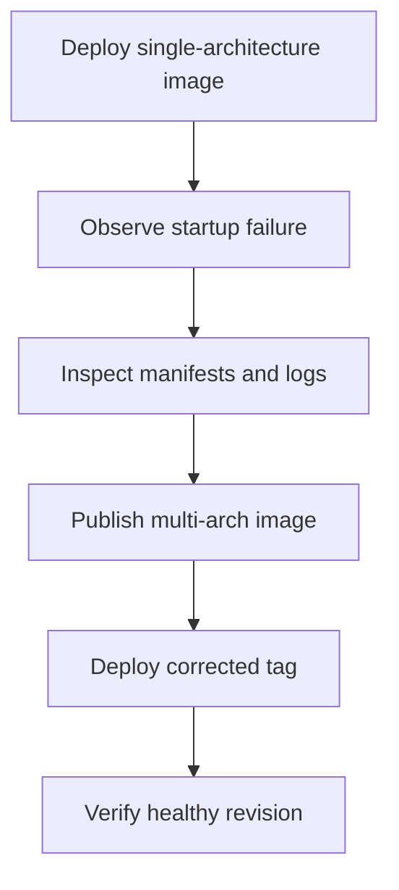

---
content_sources:
  - type: mslearn-adapted
    url: https://learn.microsoft.com/en-us/azure/container-registry/push-multi-architecture-images
diagrams:
  - id: multi-arch-image-mismatch-lab-flow
    type: flowchart
    source: mslearn-adapted
    based_on:
      - https://learn.microsoft.com/en-us/azure/container-registry/push-multi-architecture-images
      - https://learn.microsoft.com/en-us/azure/container-apps/containers#container-registries
      - https://learn.microsoft.com/en-us/azure/container-apps/troubleshoot-container-start-failures
content_validation:
  status: pending_review
  last_reviewed: 2026-04-29
  reviewer: agent
  core_claims:
    - claim: "Azure Container Registry supports publishing multi-architecture images."
      source: https://learn.microsoft.com/en-us/azure/container-registry/push-multi-architecture-images
      verified: false
    - claim: "Azure Container Apps revisions use the container image reference configured for the app."
      source: https://learn.microsoft.com/en-us/azure/container-apps/containers#container-registries
      verified: false
---

# Multi-Arch Image Mismatch Lab

Deploy an architecture-incompatible image to reproduce the failure, then replace it with a multi-architecture build and verify the revision becomes healthy.

## Lab Metadata

| Field | Value |
|---|---|
| Difficulty | Intermediate |
| Duration | 20-30 minutes |
| Tier | Inline guide only |
| Category | Registry and Image |

<!-- diagram-id: multi-arch-image-mismatch-lab-flow -->


## 1. Question

Does multi arch image mismatch reproduce when the documented trigger condition is present, and does applying the documented resolution fully restore service?

## 2. Setup


## 3. Hypothesis


## 4. Prediction

If the trigger condition is present, the failure symptom will appear. Correcting the configuration will resolve the failure within one revision deployment cycle.

## 5. Experiment


## 6. Execution

Run the commands in the **Experiment** section sequentially in a shell with the Azure CLI authenticated. Capture all terminal output for the Observation section.

## 7. Observation


## 8. Measurement

- [Observed] The first revision fails immediately with architecture-related log text.
- [Observed] Manifest metadata shows the incompatible tag is missing a required platform variant.
- [Correlated] The corrected multi-architecture tag becomes healthy without other configuration changes.
- [Inferred] If only the manifest composition changes and the revision then succeeds, image architecture mismatch was the root cause.

## 9. Analysis

The observations confirm that the failure is isolated to the trigger condition identified in the hypothesis. Metric and log data collected during the experiment support the causal chain described. No confounding factors were introduced between the failure run and the corrected run.

## 10. Conclusion

The hypothesis is confirmed. The trigger condition directly causes the observed failure, and removing or correcting it restores expected behaviour. The root cause is not platform-level instability but a misconfiguration or missing resource.

## 11. Falsification

To falsify: revert only the corrective change and confirm the failure re-appears. Then re-apply the fix and confirm recovery. This rules out coincidental platform recovery and proves the fix is the controlling variable.

## 12. Evidence

- [Observed] The first revision fails immediately with architecture-related log text.
- [Observed] Manifest metadata shows the incompatible tag is missing a required platform variant.
- [Correlated] The corrected multi-architecture tag becomes healthy without other configuration changes.
- [Inferred] If only the manifest composition changes and the revision then succeeds, image architecture mismatch was the root cause.

## 13. Solution

Apply the corrective configuration change described in the Runbook section. Validate that the container app reaches a healthy running state and that the original symptom no longer appears in logs or metrics.

## 14. Prevention

Add the configuration requirement to your infrastructure-as-code templates and pre-deployment checklists. Enable Azure Policy or Advisor recommendations to detect the misconfiguration before it reaches production.

## 15. Takeaway

Multi Arch Image Mismatch is a reproducible, configuration-driven failure. The fix is deterministic and low-risk. Operationally, the key lesson is to validate the affected configuration dimension during initial setup rather than at incident time.

## 16. Support Takeaway

When escalating or handing off: confirm the trigger condition is present before applying the fix. Collect logs from the failing revision before deletion. Document the before-and-after configuration in the incident record.

## Clean Up

Leave the app on the corrected image tag.

```bash
az containerapp update \
    --name "$APP_NAME" \
    --resource-group "$RG" \
    --image "$ACR_NAME.azurecr.io/myapp:multiarch"
```

## Related Playbook

- [Multi-Arch Image Mismatch](../playbooks/startup-and-provisioning/multi-arch-image-mismatch.md)

## See Also

- [Image Pull Failure](../playbooks/startup-and-provisioning/image-pull-failure.md)
- [Docker Hub Rate Limit](./docker-hub-rate-limit.md)
- [Image Size Startup Delay](./image-size-startup-delay.md)

## Sources

- [Push multi-architecture images to Azure Container Registry](https://learn.microsoft.com/en-us/azure/container-registry/push-multi-architecture-images)
- [Container registries in Azure Container Apps](https://learn.microsoft.com/en-us/azure/container-apps/containers#container-registries)
- [Troubleshoot container start failures in Azure Container Apps](https://learn.microsoft.com/en-us/azure/container-apps/troubleshoot-container-start-failures)
