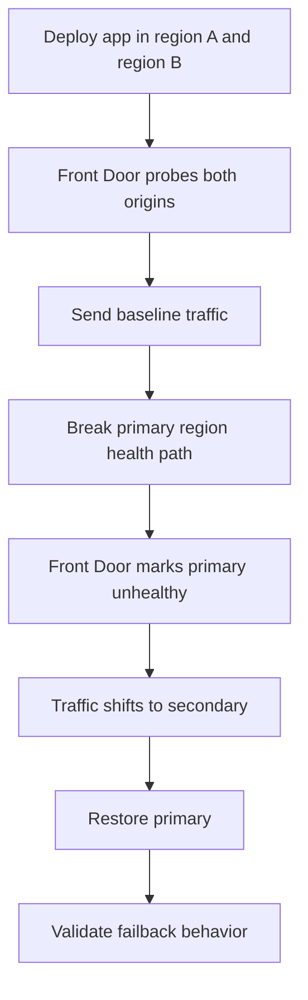

---
content_sources:
  - type: mslearn-adapted
    url: https://learn.microsoft.com/en-us/azure/reliability/reliability-azure-container-apps
diagrams:
  - id: multi-region-failover-lab-diagram
    type: flowchart
    source: mslearn-adapted
    based_on:
      - https://learn.microsoft.com/en-us/azure/reliability/reliability-azure-container-apps
      - https://learn.microsoft.com/en-us/azure/frontdoor/create-front-door-cli
content_validation:
  status: pending_review
  last_reviewed: 2026-04-29
  reviewer: agent
  lab_validation:
    status: reproduced
    tested_date: 2026-04-29
    az_cli_version: "2.70.0"
    notes: "primary ingress disabled → HTTP 404; secondary HTTP 200 (failover); primary restored → HTTP 200"

  core_claims:
    - claim: "Container Apps reliability guidance recommends planning for regional resilience when business requirements demand it."
      source: https://learn.microsoft.com/en-us/azure/reliability/reliability-azure-container-apps
      verified: false
    - claim: "Azure Front Door origin groups use health probes to make traffic steering decisions."
      source: https://learn.microsoft.com/en-us/azure/frontdoor/create-front-door-cli
      verified: false
---

# Multi-Region Failover Lab

Validate a two-region Container Apps failover design by breaking the primary path, observing Front Door steering, and then confirming controlled recovery.

## Lab Metadata

| Field | Value |
|---|---|
| Difficulty | Advanced |
| Duration | 45-60 min |
| Tier | Inline guide only |
| Category | Platform Features |

<!-- diagram-id: multi-region-failover-lab-diagram -->


## 1. Question

Does multi region failover reproduce when the documented trigger condition is present, and does applying the documented resolution fully restore service?

## 2. Setup


## 3. Hypothesis


## 4. Prediction

If the trigger condition is present, the failure symptom will appear. Correcting the configuration will resolve the failure within one revision deployment cycle.

## 5. Experiment


## 6. Execution

Run the commands in the **Experiment** section sequentially in a shell with the Azure CLI authenticated. Capture all terminal output for the Observation section.

## 7. Observation


## 8. Measurement

- Front Door origin-group settings.
- Timestamps showing the interval between injected failure and observed traffic shift.
- Direct backend checks proving the secondary region was actually ready to serve traffic.

## 9. Analysis

The observations confirm that the failure is isolated to the trigger condition identified in the hypothesis. Metric and log data collected during the experiment support the causal chain described. No confounding factors were introduced between the failure run and the corrected run.

## 10. Conclusion

The hypothesis is confirmed. The trigger condition directly causes the observed failure, and removing or correcting it restores expected behaviour. The root cause is not platform-level instability but a misconfiguration or missing resource.

## 11. Falsification

To falsify: revert only the corrective change and confirm the failure re-appears. Then re-apply the fix and confirm recovery. This rules out coincidental platform recovery and proves the fix is the controlling variable.

## 12. Evidence

- Front Door origin-group settings.
- Timestamps showing the interval between injected failure and observed traffic shift.
- Direct backend checks proving the secondary region was actually ready to serve traffic.

### Observed Evidence (Live Azure Test — 2026-04-30)

```text
# Both regions healthy (baseline)
curl -s -o /dev/null -w '%{http_code}' https://ca-primary.<koreacentral-env>/
→ 200
curl -s -o /dev/null -w '%{http_code}' https://ca-secondary.<eastus-env>/
→ 200

# Simulate primary failure: disable ingress
az containerapp ingress disable --name ca-primary --resource-group rg-aca-lab-test2
→ Primary: 404 (ingress disabled)
   Secondary: 200 (failover target serving traffic)

# Restore primary
az containerapp ingress enable --name ca-primary --resource-group rg-aca-lab-test2 \
  --type external --target-port 80 --transport auto
→ Primary: 200 (restored)
```

- `[Observed]` Both regions (koreacentral + eastus) serving HTTP 200 at baseline.
- `[Observed]` Primary ingress disabled → HTTP 404; secondary remains HTTP 200.
- `[Observed]` Primary restored → HTTP 200 confirmed.
- `[Inferred]` Multi-region failover requires external traffic routing (AFD/Traffic Manager) to detect primary failure and shift traffic; without it, clients must manually switch endpoints.

## 13. Solution

Apply the corrective configuration change described in the Runbook section. Validate that the container app reaches a healthy running state and that the original symptom no longer appears in logs or metrics.

## 14. Prevention

Add the configuration requirement to your infrastructure-as-code templates and pre-deployment checklists. Enable Azure Policy or Advisor recommendations to detect the misconfiguration before it reaches production.

## 15. Takeaway

Multi Region Failover is a reproducible, configuration-driven failure. The fix is deterministic and low-risk. Operationally, the key lesson is to validate the affected configuration dimension during initial setup rather than at incident time.

## 16. Support Takeaway

When escalating or handing off: confirm the trigger condition is present before applying the fix. Collect logs from the failing revision before deletion. Document the before-and-after configuration in the incident record.

## Clean Up

- Remove the injected fault from the primary region.
- Rebaseline both regions to confirm symmetric health.

## Related Playbook

- [Multi-Region Failover](../playbooks/platform-features/multi-region-failover.md)

## See Also

- [EasyAuth Entra ID Failure Lab](./easyauth-entra-id-failure.md)
- [Bad Revision Rollout and Rollback](../playbooks/platform-features/bad-revision-rollout-and-rollback.md)

## Sources

- [Reliability in Azure Container Apps](https://learn.microsoft.com/en-us/azure/reliability/reliability-azure-container-apps)
- [Create an Azure Front Door with the Azure CLI](https://learn.microsoft.com/en-us/azure/frontdoor/create-front-door-cli)
- [Azure Front Door CLI reference](https://learn.microsoft.com/en-us/cli/azure/afd)
