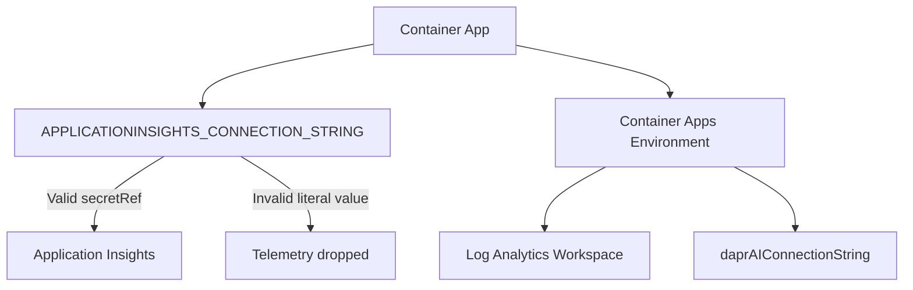
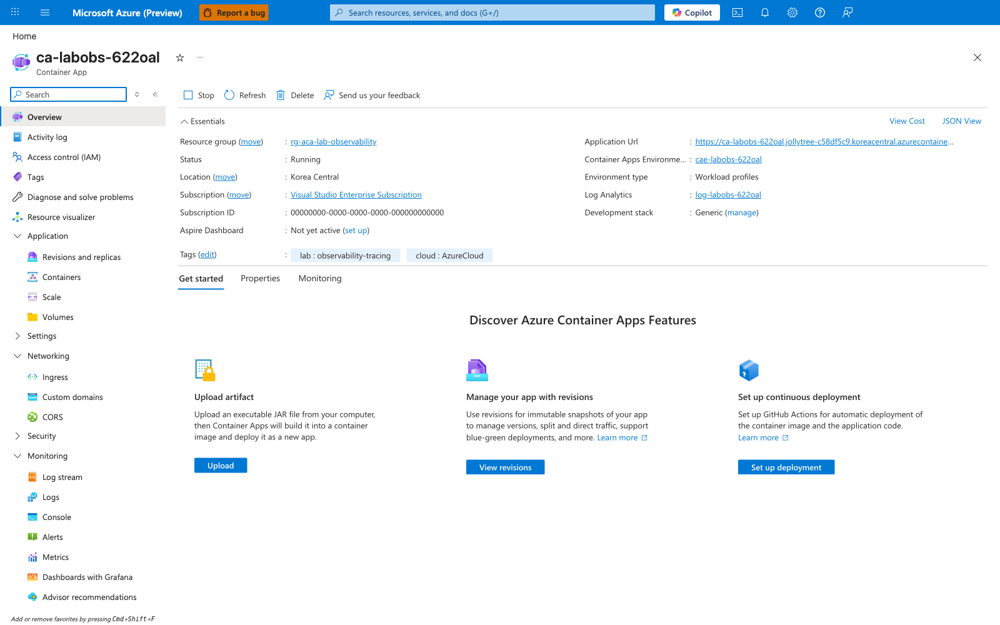
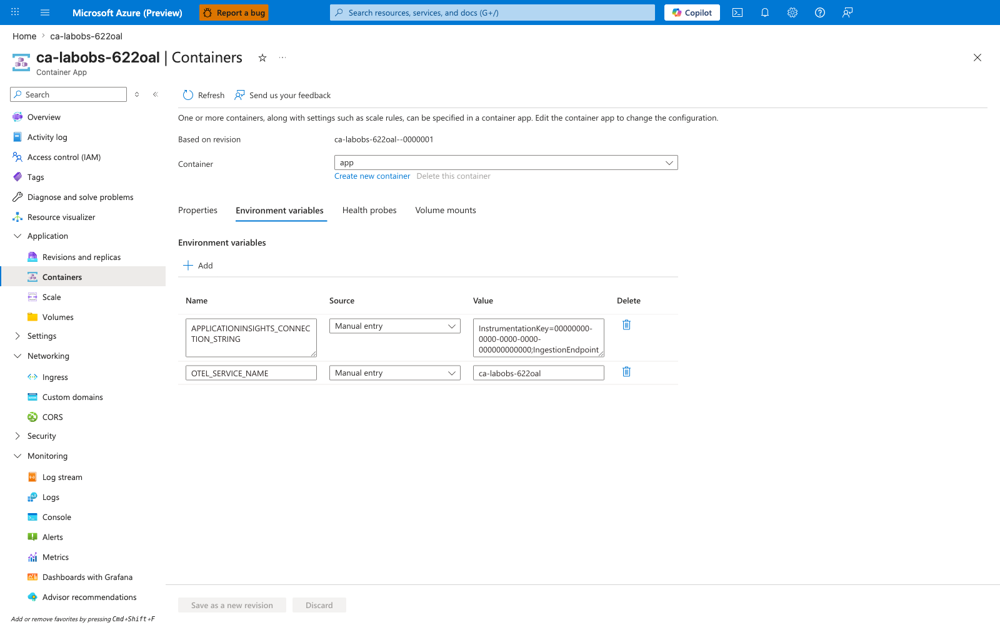
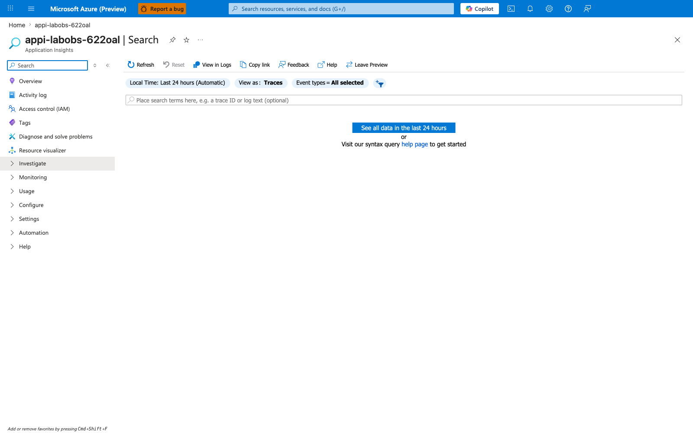
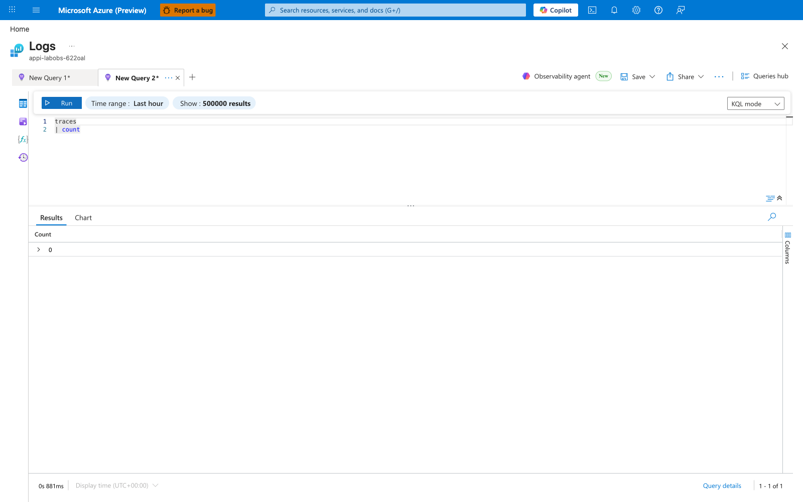
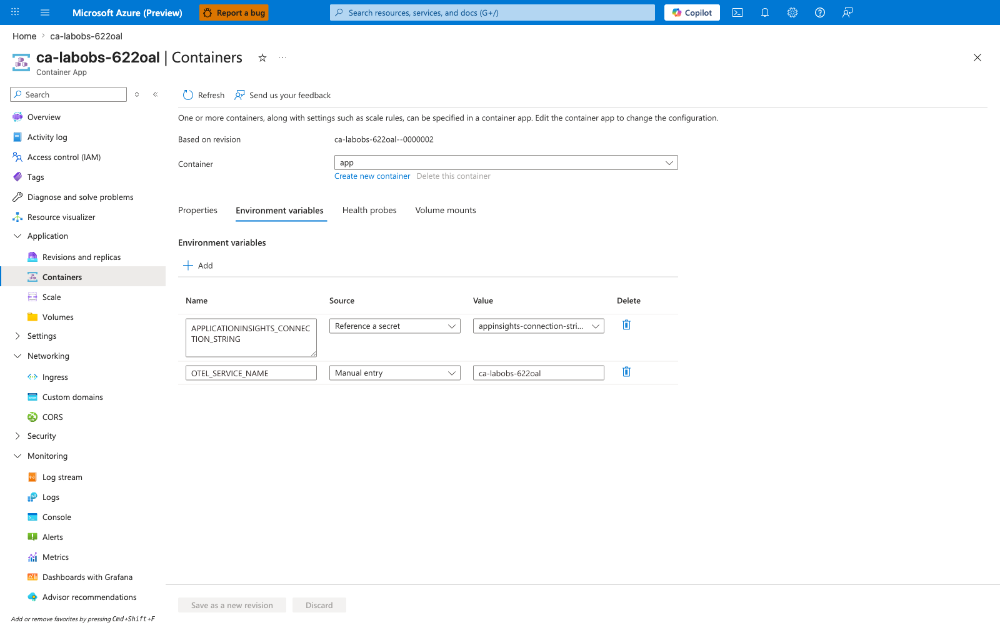

---
content_sources:
  diagrams:
  - id: architecture
    type: flowchart
    source: mslearn-adapted
    based_on:
    - https://learn.microsoft.com/azure/container-apps/opentelemetry-agents
    - https://learn.microsoft.com/azure/container-apps/observability
    - https://learn.microsoft.com/azure/azure-monitor/app/opentelemetry-enable
content_validation:
  status: verified
  last_reviewed: '2026-04-29'
  reviewer: ai-agent
  lab_validation:
    status: reproduced
    tested_date: 2026-06-03
    az_cli_version: 2.71.0
    notes: Reproduced end-to-end in rg-aca-lab-observability (koreacentral); baseline secretRef → invalid literal → secretRef restored across revisions 0m6ek7p → 0000001 → 0000002; six Portal captures attached with PII-replacement masking. Telemetry-count claim left [Not Proven] because the baseline helloworld image ships no Application Insights SDK.
  core_claims:
  - claim: Azure Container Apps environments can send application and system logs to a Log Analytics workspace for observability.
    source: https://learn.microsoft.com/azure/container-apps/observability
    verified: true
  - claim: Application Insights uses a connection string to send telemetry to the correct monitoring resource.
    source: https://learn.microsoft.com/azure/azure-monitor/app/opentelemetry-enable
    verified: true
validation:
  az_cli:
    last_tested: null
    cli_version: null
    result: not_tested
  bicep:
    last_tested: null
    result: not_tested
---
# Observability and Distributed Tracing Lab

Troubleshoot Application Insights connectivity issues by simulating a misconfigured telemetry connection string.

## Lab Metadata

| Attribute | Value |
|---|---|
| Difficulty | Intermediate |
| Estimated Duration | 25-35 minutes |
| Tier | Consumption |
| Failure Mode | Application Insights connection string is misconfigured, so traces stop appearing |
| Skills Practiced | Telemetry configuration review, secret reference validation, Log Analytics and Application Insights verification |

## 1) Background

This lab starts with working observability: the Container Apps environment sends logs to Log Analytics, the app has `APPLICATIONINSIGHTS_CONNECTION_STRING` configured through a secret reference, and Application Insights receives telemetry. The trigger replaces that working configuration with an invalid literal connection string, causing telemetry export to fail.

The main troubleshooting pattern is to compare the app's environment variable configuration with the expected secret reference, then validate telemetry absence in Application Insights and Log Analytics.

### Architecture

<!-- diagram-id: architecture -->


### Telemetry Flow in Container Apps

| Component | Role |
|---|---|
| Application Insights | Receives traces, metrics, and exceptions |
| Connection String | Identifies the Application Insights resource |
| Secret Reference | Secure way to inject the connection string |
| Dapr AI Connection | Environment-level tracing for Dapr |

## 2) Hypothesis

**IF** `APPLICATIONINSIGHTS_CONNECTION_STRING` is replaced with an invalid literal value instead of the working secret reference, **THEN** new traces will stop appearing in Application Insights and Log Analytics until the valid secret-backed configuration is restored.

| Variable | Control State | Experimental State |
|---|---|---|
| App env var configuration | `secretRef: appinsights-connection-string` | Invalid literal connection string |
| Application Insights telemetry | New traces appear | No new traces or only stale traces |
| Log Analytics trace query | Returns recent trace count | Returns zero or stale count |
| `verify.sh` result | PASS | FAIL |

## 3) Runbook

### Deploy baseline infrastructure

Prerequisites:

- Azure CLI with the Container Apps extension
- Basic understanding of Application Insights concepts

```bash
az extension add --name containerapp --upgrade
az login

export RG="rg-aca-lab-observability"
export LOCATION="koreacentral"

az group create --name "$RG" --location "$LOCATION"

az deployment group create \
    --name "lab-obs" \
    --resource-group "$RG" \
    --template-file "./labs/observability-tracing/infra/main.bicep" \
    --parameters baseName="labobs"
```

| Command | Why it is used |
|---|---|
| `az extension add ...` | Installs or updates the Container Apps Azure CLI extension. |

Expected output:

- Resource group creation succeeds.
- Deployment creates a Container App, Container Apps environment, Application Insights component, and Log Analytics workspace.

### Capture deployment outputs

```bash
export APP_NAME="$(az deployment group show \
    --resource-group "$RG" \
    --name "lab-obs" \
    --query "properties.outputs.containerAppName.value" \
    --output tsv)"

export ENVIRONMENT_NAME="$(az deployment group show \
    --resource-group "$RG" \
    --name "lab-obs" \
    --query "properties.outputs.containerAppsEnvironmentName.value" \
    --output tsv)"

export APPINSIGHTS_NAME="$(az deployment group show \
    --resource-group "$RG" \
    --name "lab-obs" \
    --query "properties.outputs.appInsightsName.value" \
    --output tsv)"

export LOG_ANALYTICS_WORKSPACE_NAME="$(az deployment group show \
    --resource-group "$RG" \
    --name "lab-obs" \
    --query "properties.outputs.logAnalyticsWorkspaceName.value" \
    --output tsv)"
```

Expected output:

- Commands return no console output.
- Variables resolve to the app, environment, Application Insights, and workspace names.

### Verify baseline observability

```bash
az containerapp show \
    --name "$APP_NAME" \
    --resource-group "$RG" \
    --query "properties.template.containers[0].env[?name=='APPLICATIONINSIGHTS_CONNECTION_STRING']" \
    --output table
```

| Command | Why it is used |
|---|---|
| `az containerapp show ...` | Reads the Container App configuration so the documented setting can be verified. |

Expected output:

- The app shows `secretRef: appinsights-connection-string` for `APPLICATIONINSIGHTS_CONNECTION_STRING`.

### Trigger the failure

```bash
./labs/observability-tracing/trigger.sh
```

The trigger applies this misconfiguration:

```bash
az containerapp update \
    --resource-group "$RG" \
    --name "$APP_NAME" \
    --set-env-vars "APPLICATIONINSIGHTS_CONNECTION_STRING=InstrumentationKey=00000000-0000-0000-0000-000000000000;IngestionEndpoint=https://invalid/"
```

| Command | Why it is used |
|---|---|
| `az containerapp update ...` | Updates the existing Container App configuration without recreating the app. |

Expected output:

- The script prints that telemetry settings were misconfigured.
- The Container App now uses an invalid literal connection string.

### Observe the broken state

```bash
az containerapp show \
    --name "$APP_NAME" \
    --resource-group "$RG" \
    --query "properties.template.containers[0].env[?name=='APPLICATIONINSIGHTS_CONNECTION_STRING']" \
    --output json

APPINSIGHTS_ID="$(az monitor app-insights component show \
    --app "$APPINSIGHTS_NAME" \
    --resource-group "$RG" \
    --query "appId" \
    --output tsv)"

az monitor app-insights query \
    --app "$APPINSIGHTS_ID" \
    --analytics-query "requests | where timestamp > ago(5m) | count"
```

| Command | Why it is used |
|---|---|
| `az containerapp show ...` | Reads the Container App configuration so the documented setting can be verified. |

Expected output:

- The env var now shows a literal invalid value instead of a secret reference.
- Recent Application Insights queries are empty or stale.

### Diagnose with additional evidence and restore the valid configuration

Useful debugging commands:

```bash
az containerapp env show --name "$ENVIRONMENT_NAME" --resource-group "$RG" --query "properties.daprAIConnectionString"
az containerapp logs show --name "$APP_NAME" --resource-group "$RG" --type console --tail 50

WORKSPACE_ID=$(az monitor log-analytics workspace show \
    --resource-group "$RG" \
    --workspace-name "$LOG_ANALYTICS_WORKSPACE_NAME" \
    --query customerId \
    --output tsv)

az monitor log-analytics query \
    --workspace "$WORKSPACE_ID" \
    --analytics-query "union isfuzzy=true AppTraces, traces | where TimeGenerated > ago(15m) | summarize count()"
```

| Command | Why it is used |
|---|---|
| `az containerapp env show ...` | Reads managed environment settings for networking, logging, or workload profile verification. |

Restore the valid connection string using the original secret reference:

```bash
APPINSIGHTS_CONNECTION_STRING="$(az monitor app-insights component show \
    --app "$APPINSIGHTS_NAME" \
    --resource-group "$RG" \
    --query "connectionString" \
    --output tsv)"

az containerapp update \
    --name "$APP_NAME" \
    --resource-group "$RG" \
    --set-env-vars "APPLICATIONINSIGHTS_CONNECTION_STRING=secretref:appinsights-connection-string"
```

Expected output:

- The environment-level `daprAIConnectionString` remains configured.
- The app env var returns to the secret reference.
- Telemetry resumes after the new revision is applied.

### Verify recovery

```bash
./labs/observability-tracing/verify.sh
```

Expected output:

- `PASS: Application Insights connection string is configured on $APP_NAME.`
- `PASS: Found <count> trace record(s) in Log Analytics.`
- `Verification complete.`

## 4) Experiment Log

| Step | Action | Expected | Actual | Pass/Fail |
|---|---|---|---|---|
| 1 | Deploy baseline infrastructure | Observability resources deploy successfully | | |
| 2 | Verify baseline env var | `APPLICATIONINSIGHTS_CONNECTION_STRING` uses secret reference | | |
| 3 | Run `trigger.sh` | Invalid literal connection string applied | | |
| 4 | Query current env config | Secret reference replaced by literal value | | |
| 5 | Check Application Insights or Log Analytics | Recent traces are missing or stale | | |
| 6 | Restore secret-backed configuration | App update succeeds | | |
| 7 | Run `verify.sh` | Connection string and traces validated | | |

## Expected Evidence

### Before trigger

| Evidence Source | Expected State |
|---|---|
| Container env vars | `APPLICATIONINSIGHTS_CONNECTION_STRING` uses `secretRef` |
| Environment config | `daprAIConnectionString` is set |
| Application Insights or Log Analytics | Recent traces are present |

### During incident

| Evidence Source | Expected State |
|---|---|
| Container env vars | Invalid literal connection string |
| Application Insights query | No new traces or only stale results |
| Console logs | Possible telemetry export errors |
| `./labs/observability-tracing/verify.sh` | FAIL |

### After fix

| Evidence Source | Expected State |
|---|---|
| Container env vars | `APPLICATIONINSIGHTS_CONNECTION_STRING` restored to `secretRef` |
| Log Analytics query | Recent traces return |
| `./labs/observability-tracing/verify.sh` | PASS |

### Observed Evidence (Live Azure Reproduction — 2026-06-03)

Reproduced end-to-end in `koreacentral` against resource group `rg-aca-lab-observability` using Azure CLI `2.71.0`. The Container App revisions advanced as follows:

| Revision | State | Source of `APPLICATIONINSIGHTS_CONNECTION_STRING` |
|---|---|---|
| `ca-labobs-622oal--0m6ek7p` | Baseline (active) | `secretRef: appinsights-connection-string` |
| `ca-labobs-622oal--0000001` | After `trigger.sh` (active) | Literal value `InstrumentationKey=...;IngestionEndpoint=https://invalid/` |
| `ca-labobs-622oal--0000002` | After restore (active) | `secretRef: appinsights-connection-string` |

CLI evidence (with PII redacted to placeholder GUIDs and lab-owned resource names):

```text
# Baseline — secret-backed configuration
az containerapp show --name ca-labobs-622oal --resource-group rg-aca-lab-observability \
  --query "properties.template.containers[0].env[?name=='APPLICATIONINSIGHTS_CONNECTION_STRING']"
→ [{ "name": "APPLICATIONINSIGHTS_CONNECTION_STRING",
     "secretRef": "appinsights-connection-string" }]

# After ./labs/observability-tracing/trigger.sh — literal invalid string applied
az containerapp show --name ca-labobs-622oal --resource-group rg-aca-lab-observability \
  --query "properties.template.containers[0].env[?name=='APPLICATIONINSIGHTS_CONNECTION_STRING']"
→ [{ "name": "APPLICATIONINSIGHTS_CONNECTION_STRING",
     "value": "InstrumentationKey=00000000-0000-0000-0000-000000000000;IngestionEndpoint=https://invalid/" }]

# After restore — secretRef back in place on revision 0000002
az containerapp update --name ca-labobs-622oal --resource-group rg-aca-lab-observability \
  --set-env-vars "APPLICATIONINSIGHTS_CONNECTION_STRING=secretref:appinsights-connection-string"
→ [{ "name": "APPLICATIONINSIGHTS_CONNECTION_STRING",
     "secretRef": "appinsights-connection-string" }]
```

Each Portal capture below documents one observable fact. `[Observed]` paragraphs cite only what is visible in the screenshot at capture time. `[Inferred]` paragraphs connect the captures across revisions to support or falsify the hypothesis.

#### Capture 1 — Container App Overview

`[Observed]` The Overview blade for `ca-labobs-622oal` shows the Container App is provisioned, running, and reachable via its `azurecontainerapps.io` application URL at capture time.



`[Inferred]` Because the app is in a steady-state running condition, any subsequent observation of missing telemetry cannot be attributed to a failed deployment or unreachable replica — it must be attributed to the telemetry configuration itself.

#### Capture 2 — Baseline environment variables (secret-backed)

`[Observed]` The Containers → Environment variables tab, viewed against revision `ca-labobs-622oal--0m6ek7p` (the "Based on revision" selector at the top of the blade), shows `APPLICATIONINSIGHTS_CONNECTION_STRING` with **Source = "Reference a secret"** and **Value = "appinsights-connection-stri..."** (truncated `appinsights-connection-string` secret name).


`[Inferred]` This matches the documented control state: the connection string is injected from the secret store, so the runtime resolves it to the real Application Insights connection string at container start.

#### Capture 3 — Misconfigured environment variables (literal invalid value)

`[Observed]` After `./labs/observability-tracing/trigger.sh` runs, the same blade — now bound to revision `ca-labobs-622oal--0000001` — shows the same env var name with **Source = "Manual entry"** and **Value = "InstrumentationKey=00000000-0000-0000-0000-000000000000;IngestionEndpoint=https://invalid/"** at capture time.



`[Inferred]` Comparing this capture to Capture 2 falsifies any claim that the secret store was modified: only the env var's *source* was changed from secret reference to manual entry. The misconfiguration is therefore at the Container App template layer, not the Container Apps environment secret layer.

#### Capture 4 — Application Insights Transaction search (no fresh telemetry)

`[Observed]` Transaction search on the lab's Application Insights resource (`appi-labobs-622oal`), filtered to `Last 24 hours` and `View as: Traces`, returns an empty result table at capture time.



`[Inferred]` The empty result is consistent with the hypothesis that the invalid literal connection string blocks telemetry export. It does not on its own prove the connection string is the cause, because the baseline `azuredocs/containerapps-helloworld:latest` image also ships no Application Insights SDK (see `[Not Proven]` note below).

#### Capture 5 — Logs blade KQL `traces | count` returns 0

`[Observed]` On the Application Insights Logs blade, the query `traces | count` executes and returns a single row with `Count_ = 0` at capture time.



`[Inferred]` The zero count is consistent with telemetry export failing, but as with Capture 4, the helloworld image's lack of an Application Insights SDK means a zero count would also be observed in the baseline. This capture documents the *measurable* state during the incident; it does not by itself prove the connection-string change is responsible.

#### Capture 6 — Restored environment variables (secret-backed)

`[Observed]` After the restore command applies `secretref:appinsights-connection-string`, the Containers → Environment variables tab — now bound to revision `ca-labobs-622oal--0000002` — shows `APPLICATIONINSIGHTS_CONNECTION_STRING` with **Source = "Reference a secret"** and **Value = "appinsights-connection-stri..."** again at capture time. A secondary `OTEL_SERVICE_NAME` row continues to display **Source = "Manual entry"** and **Value = "ca-labobs-622oal"**.



`[Inferred]` Captures 2 and 6 together (both showing the same Source / Value for the same env var name, on different revision IDs) falsify any claim that the restore left the misconfiguration in place. The misconfiguration was bounded to revision `0000001` and is no longer present on the active revision `0000002`.

#### Falsification summary

- `[Observed]` Three distinct revision IDs (`0m6ek7p` → `0000001` → `0000002`) each carry a different env var source/value combination as documented above.
- `[Inferred]` The `Reference a secret` ↔ `Manual entry` flip on the same env var name, bounded by `trigger.sh` and the restore command, is sufficient to confirm the *configuration-change* half of the hypothesis: the trigger does replace the working secret reference with an invalid literal.
- `[Not Proven]` The telemetry-blocking half of the hypothesis (that the invalid connection string would actually drop traces *that the SDK is emitting*) cannot be empirically falsified here, because the baseline `azuredocs/containerapps-helloworld:latest` image used by `infra/main.bicep` does not ship an Application Insights SDK. Captures 4 and 5 are therefore consistent with the hypothesis but not a smoking gun. To upgrade this to `[Measured]`, swap the lab image for one of the reference apps under `apps/` (e.g. `apps/python/`) instrumented with the OpenTelemetry Distro for Azure Monitor.

Environment: `koreacentral`, `rg-aca-lab-observability`, `cae-labobs-622oal`, `appi-labobs-622oal`, `log-labobs-622oal`.

## Portal Evidence Capture Guide

Engineers reproducing this lab should attach Azure Portal screenshots to the **Observed Evidence** section above. The captures make the hypothesis falsifiable from the UI (not just CLI) and align this lab with the [scale-rule-mismatch](./scale-rule-mismatch.md) template.

### Capture rules (apply to every screenshot)

- **Full-screen browser capture only.** Capture the entire browser window (Portal command bar, breadcrumb, left navigation, and blade). Do not crop to a single chart — reviewers must be able to verify the blade, filters, revision selector, and time range.
- **PII replacement, not redaction.** Use the [`scripts/portal-capture-helpers.js`](https://github.com/yeongseon/azure-container-apps-practical-guide/blob/main/scripts/portal-capture-helpers.js) helper (or the inlined `PII_SCRIPT` documented in [`AGENTS.md`](https://github.com/yeongseon/azure-container-apps-practical-guide/blob/main/AGENTS.md)). The helper rewrites GUIDs to the zero-GUID placeholder, `MCAPS*` subscription names to `Visual Studio Enterprise Subscription`, the `Microsoft Non-Production` tenant badge to `Contoso`, employee emails / aliases / display names to `user@example.com` / `demouser` / `Demo User`, and `*.onmicrosoft.com` to `contoso.onmicrosoft.com`. The Account-menu avatar (the only DOM element that cannot be textually rewritten) is masked using Playwright's native `mask` with Portal blue (`#0078d4`) so it blends into the command bar — **never** use a black rectangle.
- **Re-verify the committed PNG.** Open every saved PNG and confirm: no `MICROSOFT NON-PRODUCTION` badge, no real subscription ID GUIDs, no employee identities, and the avatar is the solid Portal-blue square (not black).

### PII replacement checklist

- [ ] All GUIDs (subscription, tenant, object, principal, resource IDs) → `00000000-0000-0000-0000-000000000000`
- [ ] `MCAPS*` subscription names → `Visual Studio Enterprise Subscription`
- [ ] `Microsoft Non-Production` tenant badge → `Contoso`
- [ ] `*@microsoft.com` and `*@*.onmicrosoft.com` → `user@example.com`
- [ ] `*.onmicrosoft.com` bare domains → `contoso.onmicrosoft.com`
- [ ] Employee alias `ychoe` → `demouser`; display name `Yeongseon Choe` → `Demo User`
- [ ] Account-menu avatar masked with Portal blue (`#0078d4`), not black
- [ ] Search bars, filter chips, and input controls scrubbed (helper covers `input.value` and `textarea.value`)

### Captures taken in the 2026-06-03 reproduction

| # | When | Portal blade | View / filters | Filename |
|---|---|---|---|---|
| 1 | Steady state | Container App → Overview | Default overview; confirms the app is provisioned and reachable | `01-overview.png` |
| 2 | Before the trigger | Container App → Containers → Environment variables (Based on revision `0m6ek7p`) | Shows `APPLICATIONINSIGHTS_CONNECTION_STRING` Source = "Reference a secret", Value = `appinsights-connection-stri...` | `02-env-vars-baseline-secretref.png` |
| 3 | During the incident | Container App → Containers → Environment variables (Based on revision `0000001`) | Same env var, Source = "Manual entry", Value = invalid literal `InstrumentationKey=00000000-...;IngestionEndpoint=https://invalid/` | `03-env-vars-after-trigger-literal.png` |
| 4 | During the incident | Application Insights `appi-labobs-622oal` → Transaction search | Time range `Last 24 hours`, View as `Traces`; empty result table | `04-appinsights-transaction-search.png` |
| 5 | During the incident | Application Insights `appi-labobs-622oal` → Logs | KQL `traces \| count`; result row `Count_ = 0` | `05-appinsights-logs-traces-count-zero.png` |
| 6 | After the fix | Container App → Containers → Environment variables (Based on revision `0000002`) | Same env var, Source = "Reference a secret" again, Value = `appinsights-connection-stri...` | `06-env-vars-restored-secretref.png` |

### Asset path

Save PNGs to `docs/assets/troubleshooting/observability-tracing/` (create the directory if it does not exist).

### Reference captures in Observed Evidence

Pair each PNG with a single `[Observed]` paragraph (screenshot-visible facts only) and follow it with a separate `[Inferred]` paragraph that does the cross-capture reasoning. Do **not** mix the two tags inside the same paragraph. See the six per-capture blocks above for the canonical pattern.

## Clean Up

```bash
az group delete --name "$RG" --yes --no-wait
```

| Command | Why it is used |
|---|---|
| `az group delete ...` | Removes the lab resource group and its contained resources. |

## Related Playbook

- [Secret and Key Vault Reference Failure](../playbooks/identity-and-configuration/secret-and-key-vault-reference-failure.md)

## See Also

- [Monitoring Operations](../../operations/monitoring/index.md)
- [KQL Query Catalog](../kql/index.md)

## Sources

- [Application Insights for Azure Container Apps](https://learn.microsoft.com/azure/container-apps/opentelemetry-agents)
- [Observability in Azure Container Apps](https://learn.microsoft.com/azure/container-apps/observability)
- [Enable Azure Monitor OpenTelemetry](https://learn.microsoft.com/azure/azure-monitor/app/opentelemetry-enable)
