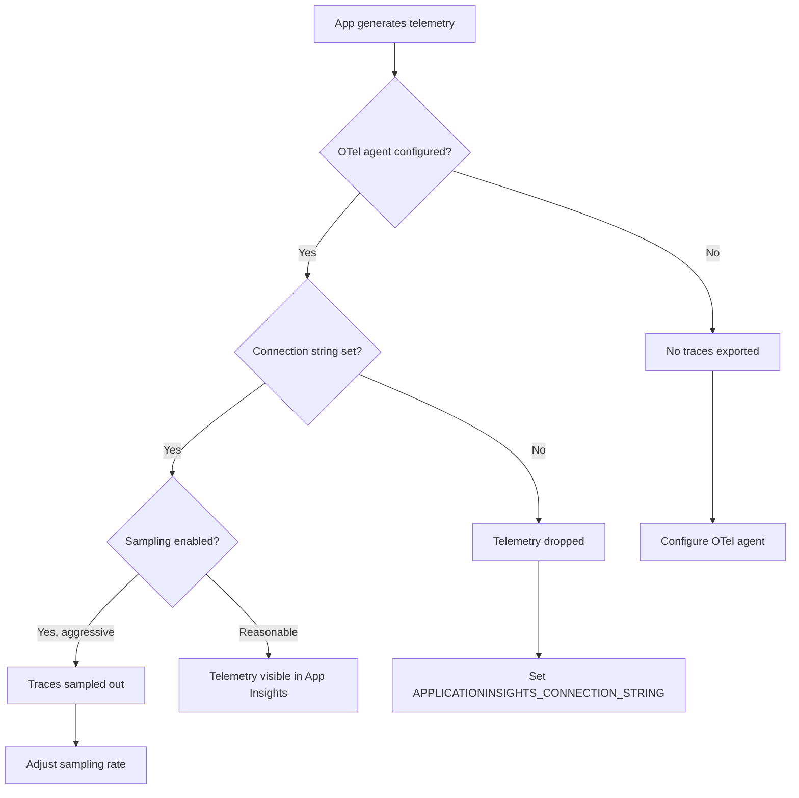

# Observability and Distributed Tracing Lab

Set up and troubleshoot observability with OpenTelemetry and Application Insights in Azure Container Apps.

## Scenario

- **Difficulty**: Intermediate
- **Estimated duration**: 35-45 minutes
- **Failure mode**: Traces not appearing in Application Insights, metrics missing, or logs not correlated

## Prerequisites

- Azure CLI with Container Apps extension
- Application Insights resource (or created by lab)
- Basic understanding of OpenTelemetry concepts

```bash
az extension add --name containerapp --upgrade
az login
```

## Quick Start

```bash
export RG="rg-aca-lab-observability"
export LOCATION="koreacentral"

az group create --name "$RG" --location "$LOCATION"
az deployment group create --name "lab-obs" --resource-group "$RG" --template-file ./labs/observability-tracing/infra/main.bicep --parameters baseName="labobs"

export APP_NAME="$(az deployment group show --resource-group "$RG" --name "lab-obs" --query "properties.outputs.containerAppName.value" --output tsv)"
export APPINSIGHTS_NAME="$(az deployment group show --resource-group "$RG" --name "lab-obs" --query "properties.outputs.appInsightsName.value" --output tsv)"

cd labs/observability-tracing
./trigger.sh
./verify.sh
./cleanup.sh
```

## Scenario Setup

This lab demonstrates observability configuration and troubleshooting:

1. Application Insights not connected
2. OpenTelemetry agent not configured
3. Traces not correlating across services
4. Custom metrics not appearing



## Key Concepts

### Telemetry Types

| Type | Description | Use Case |
|---|---|---|
| Traces | Distributed request flows | Debug latency, find bottlenecks |
| Metrics | Numeric measurements | Dashboards, alerts, SLOs |
| Logs | Structured event records | Debugging, audit trails |

### Container Apps Observability Options

| Option | Setup Complexity | Features |
|---|---|---|
| Built-in Log Analytics | Automatic | Console logs, system logs |
| Application Insights (agent) | Environment config | Auto-instrumentation, traces |
| OpenTelemetry SDK | App code changes | Full control, custom spans |

## Step-by-Step Walkthrough

1. **Deploy app without observability (baseline)**

   ```bash
   export RG="rg-aca-lab-observability"
   export LOCATION="koreacentral"
   az group create --name "$RG" --location "$LOCATION"

   az deployment group create \
     --name "lab-obs" \
     --resource-group "$RG" \
     --template-file "./labs/observability-tracing/infra/main.bicep" \
     --parameters baseName="labobs"
   ```

2. **Generate traffic and check for traces (should be missing)**

   ```bash
   export APP_FQDN="$(az containerapp show --name "$APP_NAME" --resource-group "$RG" --query "properties.configuration.ingress.fqdn" --output tsv)"
   
   # Generate some traffic
   for i in {1..10}; do
     curl --silent "https://${APP_FQDN}/api/orders"
   done
   ```

3. **Query Application Insights for traces (trigger: no data)**

   ```bash
   export APPINSIGHTS_ID="$(az monitor app-insights component show --app "$APPINSIGHTS_NAME" --resource-group "$RG" --query "appId" --output tsv)"
   
   az monitor app-insights query \
     --app "$APPINSIGHTS_ID" \
     --analytics-query "requests | where timestamp > ago(1h) | take 10"
   ```

   Expected output: empty or no data.

4. **Check environment observability configuration**

   ```bash
   az containerapp env show \
     --name "$ENVIRONMENT_NAME" \
     --resource-group "$RG" \
     --query "properties.appInsightsConfiguration"
   ```

   Expected output when not configured: `null`

5. **Enable Application Insights on environment**

   ```bash
   export APPINSIGHTS_CONNECTION_STRING="$(az monitor app-insights component show --app "$APPINSIGHTS_NAME" --resource-group "$RG" --query "connectionString" --output tsv)"
   
   az containerapp env update \
     --name "$ENVIRONMENT_NAME" \
     --resource-group "$RG" \
     --logs-destination log-analytics \
     --dapr-instrumentation-key "$APPINSIGHTS_CONNECTION_STRING"
   ```

6. **Or configure via app environment variable**

   ```bash
   az containerapp update \
     --name "$APP_NAME" \
     --resource-group "$RG" \
     --set-env-vars "APPLICATIONINSIGHTS_CONNECTION_STRING=$APPINSIGHTS_CONNECTION_STRING"
   ```

7. **For Python/Node.js apps, enable auto-instrumentation**

   Add to your Dockerfile or startup:

   ```dockerfile
   # Python with OpenTelemetry
   ENV OTEL_SERVICE_NAME="my-container-app"
   ENV OTEL_EXPORTER_OTLP_ENDPOINT="https://dc.services.visualstudio.com/v2/track"
   
   # Or use Azure Monitor OpenTelemetry distro
   RUN pip install azure-monitor-opentelemetry
   ```

8. **Generate traffic again**

   ```bash
   for i in {1..20}; do
     curl --silent "https://${APP_FQDN}/api/orders"
     sleep 1
   done
   ```

9. **Verify traces appear in Application Insights**

   ```bash
   # Wait 2-3 minutes for ingestion
   az monitor app-insights query \
     --app "$APPINSIGHTS_ID" \
     --analytics-query "requests | where timestamp > ago(15m) | summarize count() by name"
   ```

   Expected output: request count by endpoint.

10. **Check for correlated traces across services**

    ```bash
    az monitor app-insights query \
      --app "$APPINSIGHTS_ID" \
      --analytics-query "
        requests 
        | where timestamp > ago(15m)
        | project operation_Id, name, duration, resultCode
        | join kind=leftouter (
            dependencies 
            | where timestamp > ago(15m)
            | project operation_Id, dependency_name=name, dependency_duration=duration
        ) on operation_Id
        | take 10
      "
    ```

## Symptoms / Cause / Fix Matrix

| What you see | What is happening | How to fix |
|---|---|---|
| No traces in App Insights | Connection string not set | Set `APPLICATIONINSIGHTS_CONNECTION_STRING` |
| Traces appear but not correlated | Missing W3C trace context propagation | Ensure OTel SDK propagates headers |
| Only some requests traced | Aggressive sampling | Adjust sampling rate in OTel config |
| Custom metrics missing | Metrics not exported | Configure metrics exporter |
| High latency in telemetry | Sync export blocking requests | Use async/batch exporting |
| Logs not linked to traces | Missing trace context in logs | Include `trace_id` in log format |

## Debugging Commands

```bash
# Check Application Insights connection
az containerapp show --name "$APP_NAME" --resource-group "$RG" --query "properties.template.containers[0].env[?name=='APPLICATIONINSIGHTS_CONNECTION_STRING']"

# View console logs for OTel errors
az containerapp logs show --name "$APP_NAME" --resource-group "$RG" --type console --tail 100 | grep -i "otel\|telemetry\|export"

# Query request performance
az monitor app-insights query \
  --app "$APPINSIGHTS_ID" \
  --analytics-query "requests | where timestamp > ago(1h) | summarize avg(duration), percentile(duration, 95), count() by bin(timestamp, 5m)"

# Check for exceptions
az monitor app-insights query \
  --app "$APPINSIGHTS_ID" \
  --analytics-query "exceptions | where timestamp > ago(1h) | summarize count() by type, outerMessage"
```

## KQL Queries for Application Insights

### Request Overview

```kusto
requests
| where timestamp > ago(1h)
| summarize 
    total=count(),
    failed=countif(success == false),
    avgDuration=avg(duration),
    p95Duration=percentile(duration, 95)
    by bin(timestamp, 5m)
| render timechart
```

### End-to-End Transaction View

```kusto
requests
| where timestamp > ago(1h)
| where operation_Id == "<specific-operation-id>"
| union (dependencies | where operation_Id == "<specific-operation-id>")
| union (traces | where operation_Id == "<specific-operation-id>")
| union (exceptions | where operation_Id == "<specific-operation-id>")
| project timestamp, itemType, name, duration, success, message
| order by timestamp asc
```

### Dependency Performance

```kusto
dependencies
| where timestamp > ago(1h)
| summarize 
    count(),
    avg(duration),
    percentile(duration, 95),
    failureRate=countif(success == false) * 100.0 / count()
    by target, name
| order by count_ desc
```

## Resolution Verification Checklist

1. Application Insights shows incoming requests
2. Traces correlate across service boundaries
3. Dependencies (DB, HTTP, etc.) appear in traces
4. Custom metrics visible in Metrics Explorer
5. Logs contain trace context for correlation

## Expected Evidence

### Before Fix

| Evidence Source | Expected State |
|---|---|
| `requests` table | Empty or no recent data |
| Environment config | `appInsightsConfiguration: null` |
| App env vars | Missing connection string |

### After Fix

| Evidence Source | Expected State |
|---|---|
| `requests` table | Requests visible with operation IDs |
| `dependencies` table | External calls tracked |
| End-to-end transaction | Full request flow visible |

## Clean Up

```bash
az group delete --name "$RG" --yes --no-wait
```

## Related Playbook

- [CrashLoop OOM and Resource Pressure](../playbooks/scaling-and-runtime/crashloop-oom-and-resource-pressure.md)

## See Also

- [Failed Requests App Insights KQL](../kql/correlation/failed-requests-app-insights.md)
- [Link Exceptions to Operations KQL](../kql/correlation/link-exceptions-to-operations.md)

## Sources

- [Application Insights for Azure Container Apps](https://learn.microsoft.com/azure/container-apps/opentelemetry-agents)
- [Observability in Azure Container Apps](https://learn.microsoft.com/azure/container-apps/observability)
- [Azure Monitor OpenTelemetry Distro](https://learn.microsoft.com/azure/azure-monitor/app/opentelemetry-enable)
- [OpenTelemetry documentation](https://opentelemetry.io/docs/)
