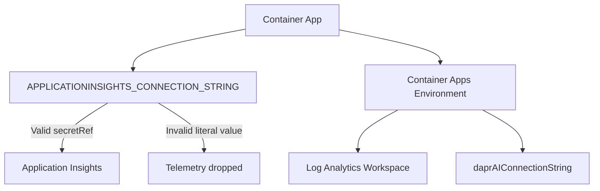

---
hide:
  - toc
content_sources:
  diagrams:
    - id: architecture
      type: flowchart
      source: mslearn-adapted
      based_on:
        - https://learn.microsoft.com/azure/container-apps/opentelemetry-agents
        - https://learn.microsoft.com/azure/container-apps/observability
        - https://learn.microsoft.com/azure/azure-monitor/app/opentelemetry-enable
---

# Observability and Distributed Tracing Lab

Troubleshoot Application Insights connectivity issues by simulating a misconfigured telemetry connection string.

## Lab Metadata

| Attribute | Value |
|---|---|
| Difficulty | Intermediate |
| Estimated Duration | 25-35 minutes |
| Tier | Consumption |
| Failure Mode | Application Insights connection string is misconfigured, so traces stop appearing |
| Skills Practiced | Telemetry configuration review, secret reference validation, Log Analytics and Application Insights verification |

## 1) Background

This lab starts with working observability: the Container Apps environment sends logs to Log Analytics, the app has `APPLICATIONINSIGHTS_CONNECTION_STRING` configured through a secret reference, and Application Insights receives telemetry. The trigger replaces that working configuration with an invalid literal connection string, causing telemetry export to fail.

The main troubleshooting pattern is to compare the app's environment variable configuration with the expected secret reference, then validate telemetry absence in Application Insights and Log Analytics.

### Architecture

<!-- diagram-id: architecture -->


### Telemetry Flow in Container Apps

| Component | Role |
|---|---|
| Application Insights | Receives traces, metrics, and exceptions |
| Connection String | Identifies the Application Insights resource |
| Secret Reference | Secure way to inject the connection string |
| Dapr AI Connection | Environment-level tracing for Dapr |

## 2) Hypothesis

**IF** `APPLICATIONINSIGHTS_CONNECTION_STRING` is replaced with an invalid literal value instead of the working secret reference, **THEN** new traces will stop appearing in Application Insights and Log Analytics until the valid secret-backed configuration is restored.

| Variable | Control State | Experimental State |
|---|---|---|
| App env var configuration | `secretRef: appinsights-connection-string` | Invalid literal connection string |
| Application Insights telemetry | New traces appear | No new traces or only stale traces |
| Log Analytics trace query | Returns recent trace count | Returns zero or stale count |
| `verify.sh` result | PASS | FAIL |

## 3) Runbook

### Deploy baseline infrastructure

Prerequisites:

- Azure CLI with the Container Apps extension
- Basic understanding of Application Insights concepts

```bash
az extension add --name containerapp --upgrade
az login

export RG="rg-aca-lab-observability"
export LOCATION="koreacentral"

az group create --name "$RG" --location "$LOCATION"

az deployment group create \
    --name "lab-obs" \
    --resource-group "$RG" \
    --template-file "./labs/observability-tracing/infra/main.bicep" \
    --parameters baseName="labobs"
```

Expected output:

- Resource group creation succeeds.
- Deployment creates a Container App, Container Apps environment, Application Insights component, and Log Analytics workspace.

### Capture deployment outputs

```bash
export APP_NAME="$(az deployment group show \
    --resource-group "$RG" \
    --name "lab-obs" \
    --query "properties.outputs.containerAppName.value" \
    --output tsv)"

export ENVIRONMENT_NAME="$(az deployment group show \
    --resource-group "$RG" \
    --name "lab-obs" \
    --query "properties.outputs.containerAppsEnvironmentName.value" \
    --output tsv)"

export APPINSIGHTS_NAME="$(az deployment group show \
    --resource-group "$RG" \
    --name "lab-obs" \
    --query "properties.outputs.appInsightsName.value" \
    --output tsv)"

export LOG_ANALYTICS_WORKSPACE_NAME="$(az deployment group show \
    --resource-group "$RG" \
    --name "lab-obs" \
    --query "properties.outputs.logAnalyticsWorkspaceName.value" \
    --output tsv)"
```

Expected output:

- Commands return no console output.
- Variables resolve to the app, environment, Application Insights, and workspace names.

### Verify baseline observability

```bash
az containerapp show \
    --name "$APP_NAME" \
    --resource-group "$RG" \
    --query "properties.template.containers[0].env[?name=='APPLICATIONINSIGHTS_CONNECTION_STRING']" \
    --output table
```

Expected output:

- The app shows `secretRef: appinsights-connection-string` for `APPLICATIONINSIGHTS_CONNECTION_STRING`.

### Trigger the failure

```bash
./labs/observability-tracing/trigger.sh
```

The trigger applies this misconfiguration:

```bash
az containerapp update \
    --resource-group "$RG" \
    --name "$APP_NAME" \
    --set-env-vars "APPLICATIONINSIGHTS_CONNECTION_STRING=InstrumentationKey=00000000-0000-0000-0000-000000000000;IngestionEndpoint=https://invalid/"
```

Expected output:

- The script prints that telemetry settings were misconfigured.
- The Container App now uses an invalid literal connection string.

### Observe the broken state

```bash
az containerapp show \
    --name "$APP_NAME" \
    --resource-group "$RG" \
    --query "properties.template.containers[0].env[?name=='APPLICATIONINSIGHTS_CONNECTION_STRING']" \
    --output json

APPINSIGHTS_ID="$(az monitor app-insights component show \
    --app "$APPINSIGHTS_NAME" \
    --resource-group "$RG" \
    --query "appId" \
    --output tsv)"

az monitor app-insights query \
    --app "$APPINSIGHTS_ID" \
    --analytics-query "requests | where timestamp > ago(5m) | count"
```

Expected output:

- The env var now shows a literal invalid value instead of a secret reference.
- Recent Application Insights queries are empty or stale.

### Diagnose with additional evidence and restore the valid configuration

Useful debugging commands:

```bash
az containerapp env show --name "$ENVIRONMENT_NAME" --resource-group "$RG" --query "properties.daprAIConnectionString"
az containerapp logs show --name "$APP_NAME" --resource-group "$RG" --type console --tail 50

WORKSPACE_ID=$(az monitor log-analytics workspace show \
    --resource-group "$RG" \
    --workspace-name "$LOG_ANALYTICS_WORKSPACE_NAME" \
    --query customerId \
    --output tsv)

az monitor log-analytics query \
    --workspace "$WORKSPACE_ID" \
    --analytics-query "union isfuzzy=true AppTraces, traces | where TimeGenerated > ago(15m) | summarize count()"
```

Restore the valid connection string using the original secret reference:

```bash
APPINSIGHTS_CONNECTION_STRING="$(az monitor app-insights component show \
    --app "$APPINSIGHTS_NAME" \
    --resource-group "$RG" \
    --query "connectionString" \
    --output tsv)"

az containerapp update \
    --name "$APP_NAME" \
    --resource-group "$RG" \
    --set-env-vars "APPLICATIONINSIGHTS_CONNECTION_STRING=secretref:appinsights-connection-string"
```

Expected output:

- The environment-level `daprAIConnectionString` remains configured.
- The app env var returns to the secret reference.
- Telemetry resumes after the new revision is applied.

### Verify recovery

```bash
./labs/observability-tracing/verify.sh
```

Expected output:

- `PASS: Application Insights connection string is configured on $APP_NAME.`
- `PASS: Found <count> trace record(s) in Log Analytics.`
- `Verification complete.`

## 4) Experiment Log

| Step | Action | Expected | Actual | Pass/Fail |
|---|---|---|---|---|
| 1 | Deploy baseline infrastructure | Observability resources deploy successfully | | |
| 2 | Verify baseline env var | `APPLICATIONINSIGHTS_CONNECTION_STRING` uses secret reference | | |
| 3 | Run `trigger.sh` | Invalid literal connection string applied | | |
| 4 | Query current env config | Secret reference replaced by literal value | | |
| 5 | Check Application Insights or Log Analytics | Recent traces are missing or stale | | |
| 6 | Restore secret-backed configuration | App update succeeds | | |
| 7 | Run `verify.sh` | Connection string and traces validated | | |

## Expected Evidence

### Before trigger

| Evidence Source | Expected State |
|---|---|
| Container env vars | `APPLICATIONINSIGHTS_CONNECTION_STRING` uses `secretRef` |
| Environment config | `daprAIConnectionString` is set |
| Application Insights or Log Analytics | Recent traces are present |

### During incident

| Evidence Source | Expected State |
|---|---|
| Container env vars | Invalid literal connection string |
| Application Insights query | No new traces or only stale results |
| Console logs | Possible telemetry export errors |
| `./labs/observability-tracing/verify.sh` | FAIL |

### After fix

| Evidence Source | Expected State |
|---|---|
| Container env vars | `APPLICATIONINSIGHTS_CONNECTION_STRING` restored to `secretRef` |
| Log Analytics query | Recent traces return |
| `./labs/observability-tracing/verify.sh` | PASS |

## Clean Up

```bash
az group delete --name "$RG" --yes --no-wait
```

## Related Playbook

- [Secret and Key Vault Reference Failure](../playbooks/identity-and-configuration/secret-and-key-vault-reference-failure.md)

## See Also

- [Monitoring Operations](../../operations/monitoring/index.md)
- [KQL Query Catalog](../kql/index.md)

## Sources

- [Application Insights for Azure Container Apps](https://learn.microsoft.com/azure/container-apps/opentelemetry-agents)
- [Observability in Azure Container Apps](https://learn.microsoft.com/azure/container-apps/observability)
- [Enable Azure Monitor OpenTelemetry](https://learn.microsoft.com/azure/azure-monitor/app/opentelemetry-enable)
