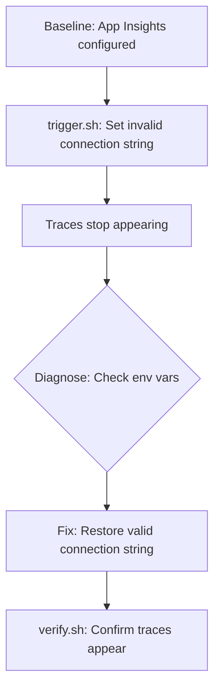

# Observability and Distributed Tracing Lab

Troubleshoot Application Insights connectivity issues by simulating a misconfigured telemetry connection string.

## Scenario

- **Difficulty**: Intermediate
- **Estimated duration**: 25-35 minutes
- **Failure mode**: Application Insights connection string misconfigured, traces not appearing

## Prerequisites

- Azure CLI with Container Apps extension
- Basic understanding of Application Insights concepts

```bash
az extension add --name containerapp --upgrade
az login
```

## Quick Start

```bash
export RG="rg-aca-lab-observability"
export LOCATION="koreacentral"

az group create --name "$RG" --location "$LOCATION"
az deployment group create --name "lab-obs" --resource-group "$RG" --template-file ./labs/observability-tracing/infra/main.bicep --parameters baseName="labobs"

export APP_NAME="$(az deployment group show --resource-group "$RG" --name "lab-obs" --query "properties.outputs.containerAppName.value" --output tsv)"
export ENVIRONMENT_NAME="$(az deployment group show --resource-group "$RG" --name "lab-obs" --query "properties.outputs.containerAppsEnvironmentName.value" --output tsv)"
export APPINSIGHTS_NAME="$(az deployment group show --resource-group "$RG" --name "lab-obs" --query "properties.outputs.appInsightsName.value" --output tsv)"
export LOG_ANALYTICS_WORKSPACE_NAME="$(az deployment group show --resource-group "$RG" --name "lab-obs" --query "properties.outputs.logAnalyticsWorkspaceName.value" --output tsv)"

cd labs/observability-tracing
./trigger.sh    # Misconfigure telemetry
./verify.sh     # Should FAIL - telemetry broken
# Fix the issue, then run verify again
./cleanup.sh
```

## Scenario Setup

This lab starts with a **working** observability configuration:

- Application Insights is connected to the Container Apps environment
- Container App has `APPLICATIONINSIGHTS_CONNECTION_STRING` set via secret reference
- Log Analytics workspace receives container logs

The trigger script **breaks** observability by replacing the valid connection string with an invalid one, simulating a common misconfiguration.



## Key Concepts

### Telemetry Flow in Container Apps

| Component | Role |
|---|---|
| Application Insights | Receives traces, metrics, exceptions |
| Connection String | Identifies the App Insights resource |
| Secret Reference | Secure way to inject connection string |
| Dapr AI Connection | Environment-level tracing for Dapr |

### Common Misconfiguration Scenarios

| Scenario | Symptom | Diagnosis |
|---|---|---|
| Invalid connection string | No traces in App Insights | Check env var value |
| Missing env var | No traces | Check container env config |
| Wrong secret name | App fails to start or no traces | Check secret reference |
| Expired/rotated key | Traces stop appearing | Regenerate connection string |

## Step-by-Step Walkthrough

### 1. Deploy baseline (observability enabled)

```bash
export RG="rg-aca-lab-observability"
export LOCATION="koreacentral"
az group create --name "$RG" --location "$LOCATION"

az deployment group create \
  --name "lab-obs" \
  --resource-group "$RG" \
  --template-file "./labs/observability-tracing/infra/main.bicep" \
  --parameters baseName="labobs"

export APP_NAME="$(az deployment group show --resource-group "$RG" --name "lab-obs" --query "properties.outputs.containerAppName.value" --output tsv)"
export ENVIRONMENT_NAME="$(az deployment group show --resource-group "$RG" --name "lab-obs" --query "properties.outputs.containerAppsEnvironmentName.value" --output tsv)"
export APPINSIGHTS_NAME="$(az deployment group show --resource-group "$RG" --name "lab-obs" --query "properties.outputs.appInsightsName.value" --output tsv)"
export LOG_ANALYTICS_WORKSPACE_NAME="$(az deployment group show --resource-group "$RG" --name "lab-obs" --query "properties.outputs.logAnalyticsWorkspaceName.value" --output tsv)"
```

### 2. Verify baseline observability is working

```bash
# Check that App Insights connection string is set via secret reference
az containerapp show --name "$APP_NAME" --resource-group "$RG" \
  --query "properties.template.containers[0].env[?name=='APPLICATIONINSIGHTS_CONNECTION_STRING']" \
  --output table
```

Expected output: Shows `secretRef: appinsights-connection-string`

### 3. Trigger the failure (misconfigure telemetry)

```bash
./trigger.sh
```

This replaces the valid connection string with an invalid one, breaking telemetry export.

### 4. Observe the broken state

```bash
# Check current env var - now shows literal invalid value instead of secret reference
az containerapp show --name "$APP_NAME" --resource-group "$RG" \
  --query "properties.template.containers[0].env[?name=='APPLICATIONINSIGHTS_CONNECTION_STRING']" \
  --output json
```

### 5. Diagnose: Why are traces missing?

```bash
# The env var is set to an invalid endpoint
# Traces are being sent to a non-existent endpoint and dropped

# Check App Insights for recent traces (should be empty or stale)
APPINSIGHTS_ID="$(az monitor app-insights component show --app "$APPINSIGHTS_NAME" --resource-group "$RG" --query "appId" --output tsv)"

az monitor app-insights query \
  --app "$APPINSIGHTS_ID" \
  --analytics-query "requests | where timestamp > ago(5m) | count"
```

### 6. Fix: Restore valid connection string

```bash
# Get the valid connection string from App Insights
APPINSIGHTS_CONNECTION_STRING="$(az monitor app-insights component show --app "$APPINSIGHTS_NAME" --resource-group "$RG" --query "connectionString" --output tsv)"

# Restore using the secret reference (best practice)
az containerapp update \
  --name "$APP_NAME" \
  --resource-group "$RG" \
  --set-env-vars "APPLICATIONINSIGHTS_CONNECTION_STRING=secretref:appinsights-connection-string"
```

### 7. Verify the fix

```bash
./verify.sh
```

Expected output: PASS messages indicating connection string is configured and traces are appearing.

## Symptoms / Cause / Fix Matrix

| What you see | What is happening | How to fix |
|---|---|---|
| No traces in App Insights | Connection string invalid or missing | Restore valid `APPLICATIONINSIGHTS_CONNECTION_STRING` |
| Traces stopped suddenly | Connection string was changed/rotated | Update to new connection string |
| Secret reference error | Secret name typo or secret deleted | Fix secret name or recreate secret |
| Partial traces only | Some replicas have old config | Force new revision deployment |

## Debugging Commands

```bash
# Check current Application Insights configuration
az containerapp show --name "$APP_NAME" --resource-group "$RG" \
  --query "properties.template.containers[0].env[?name=='APPLICATIONINSIGHTS_CONNECTION_STRING']"

# Check environment-level Dapr AI configuration
az containerapp env show --name "$ENVIRONMENT_NAME" --resource-group "$RG" \
  --query "properties.daprAIConnectionString"

# View console logs for telemetry errors
az containerapp logs show --name "$APP_NAME" --resource-group "$RG" --type console --tail 50

# Query Log Analytics for traces
WORKSPACE_ID=$(az monitor log-analytics workspace show \
  --resource-group "$RG" \
  --workspace-name "$LOG_ANALYTICS_WORKSPACE_NAME" \
  --query customerId \
  --output tsv)

az monitor log-analytics query \
  --workspace "$WORKSPACE_ID" \
  --analytics-query "union isfuzzy=true AppTraces, traces | where TimeGenerated > ago(15m) | summarize count()"
```

## Expected Evidence

### Before Trigger (Baseline)

| Evidence Source | Expected State |
|---|---|
| Container env vars | `APPLICATIONINSIGHTS_CONNECTION_STRING` with secretRef |
| Environment config | `daprAIConnectionString` set |
| App Insights | Traces appearing |

### During Incident (After Trigger)

| Evidence Source | Expected State |
|---|---|
| Container env vars | Invalid literal connection string |
| App Insights | No new traces |
| Console logs | Possible telemetry export errors |

### After Fix

| Evidence Source | Expected State |
|---|---|
| Container env vars | `APPLICATIONINSIGHTS_CONNECTION_STRING` with secretRef |
| App Insights | Traces resuming |
| verify.sh | PASS |

## Clean Up

```bash
az group delete --name "$RG" --yes --no-wait
```

## Related Playbook

- [CrashLoop OOM and Resource Pressure](../playbooks/scaling-and-runtime/crashloop-oom-and-resource-pressure.md)

## See Also

- [Monitoring Operations](../../operations/monitoring/index.md)
- [KQL Query Catalog](../kql/index.md)

## Sources

- [Application Insights for Azure Container Apps](https://learn.microsoft.com/azure/container-apps/opentelemetry-agents)
- [Observability in Azure Container Apps](https://learn.microsoft.com/azure/container-apps/observability)
- [Azure Monitor OpenTelemetry](https://learn.microsoft.com/azure/azure-monitor/app/opentelemetry-enable)
