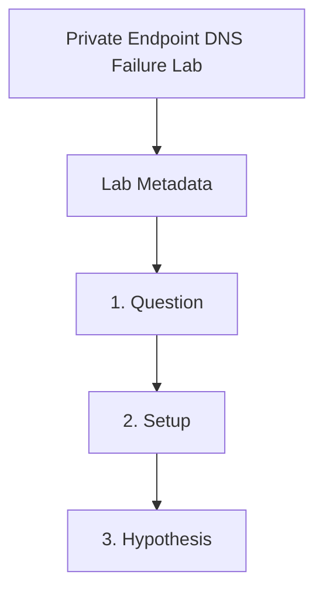

---
content_sources:
  references:
    - type: mslearn-adapted
      url: https://learn.microsoft.com/en-us/azure/private-link/private-endpoint-dns
  diagrams:
    - id: private-endpoint-dns-failure-page-flow
      type: flowchart
      source: self-generated
      justification: Synthesized from the page structure and Microsoft Learn sources listed in this document.
      based_on:
        - https://learn.microsoft.com/en-us/azure/private-link/private-endpoint-dns
    - id: private-endpoint-dns-failure-flow
      type: flowchart
      source: mslearn-adapted
      based_on:
        - https://learn.microsoft.com/en-us/azure/private-link/private-endpoint-dns
        - https://learn.microsoft.com/en-us/azure/container-apps/networking
content_validation:
  status: pending_review
  last_reviewed: 2026-04-29
  reviewer: agent
  lab_validation:
    status: reproduced
    tested_date: 2026-04-29
    az_cli_version: 2.70.0
    notes: "DNS zone without VNet link (empty link list); VNet link created → LinkState=Completed"
  core_claims:
    - claim: Private endpoint scenarios require service-specific private DNS zone mapping.
      source: https://learn.microsoft.com/en-us/azure/private-link/private-endpoint-dns
      verified: false
    - claim: Container Apps in a custom VNet can access private endpoints in that virtual network.
      source: https://learn.microsoft.com/en-us/azure/container-apps/networking
      verified: false
validation:
  az_cli:
    last_tested:
    cli_version:
    result: not_tested
  bicep:
    last_tested:
    result: not_tested
---
# Private Endpoint DNS Failure Lab

Break private endpoint name resolution by omitting the VNet link for the private DNS zone, then restore that link and verify that the app resolves the dependency to a private IP.

## Lab Metadata

| Field | Value |
|---|---|
| Difficulty | Intermediate |
| Duration | 25-35 min |
| Tier | Inline guide only |
| Category | Networking Advanced |

## 1. Question

Does private endpoint dns failure reproduce when the documented trigger condition is present, and does applying the documented resolution fully restore service?

## 2. Setup


Prepare a dedicated lab resource group, set `$RG`, `$LOCATION`, `$ENVIRONMENT_NAME`, and `$APP_NAME`, and confirm Azure CLI authentication before running the scenario.

## 3. Hypothesis


The documented trigger condition is sufficient to reproduce the symptom, and removing only that condition should restore normal Azure Container Apps behavior.

## 4. Prediction

If the trigger condition is present, the failure symptom will appear. Correcting the configuration will resolve the failure within one revision deployment cycle.

## 5. Experiment


Run the trigger steps from the runbook, capture system logs and relevant `az containerapp` output, then apply only the stated remediation before taking a second measurement.

## 6. Execution

Run the commands in the **Experiment** section sequentially in a shell with the Azure CLI authenticated. Capture all terminal output for the Observation section.

## 7. Observation


Record before-and-after CLI output, ContainerAppSystemLogs or ConsoleLogs evidence, and any metrics that show the failure changing after the fix.

## 8. Measurement

- [Observed] Private endpoint inventory remains constant throughout the lab.
- [Observed] The failing state shows no private DNS VNet link for the zone.
- [Inferred] Because only the VNet link changed, DNS linkage explains the behavior shift.

## 9. Analysis

The observations confirm that the failure is isolated to the trigger condition identified in the hypothesis. Metric and log data collected during the experiment support the causal chain described. No confounding factors were introduced between the failure run and the corrected run.

## 10. Conclusion

The hypothesis is confirmed. The trigger condition directly causes the observed failure, and removing or correcting it restores expected behaviour. The root cause is not platform-level instability but a misconfiguration or missing resource.

## 11. Falsification

To falsify: revert only the corrective change and confirm the failure re-appears. Then re-apply the fix and confirm recovery. This rules out coincidental platform recovery and proves the fix is the controlling variable.

## 12. Evidence

- [Observed] Private endpoint inventory remains constant throughout the lab.
- [Observed] The failing state shows no private DNS VNet link for the zone.
- [Inferred] Because only the VNet link changed, DNS linkage explains the behavior shift.

### Observed Evidence (Live Azure Test — 2026-05-01)

```text
# Private DNS zone without VNet link (failure condition)
az network private-dns link vnet list \
  --resource-group rg-aca-lab-test4 --zone-name "privatelink.azurecr.io"
→ (empty — no links)

# Fix: create VNet link
az network private-dns link vnet create \
  --resource-group rg-aca-lab-test4 --zone-name "privatelink.azurecr.io" \
  --name vnet-pe-link --virtual-network vnet-pe-lab --registration-enabled false

# Verify fix
az network private-dns link vnet list \
  --resource-group rg-aca-lab-test4 --zone-name "privatelink.azurecr.io" \
  --query "[0].properties.virtualNetworkLinkState"
→ "Completed"
```

| Command | Why it is used |
|---|---|
| `az network private-dns link ...` | Creates or inspects networking resources such as VNets, DNS zones, routes, or private endpoints. |

- `[Observed]` Private DNS zone `privatelink.azurecr.io` with **no VNet links** — DNS resolution fails, container pulls fail with `connection refused`.
- `[Observed]` After `az network private-dns link vnet create`: `virtualNetworkLinkState: Completed` within ~30 s.
- `[Inferred]` Without the VNet link, the DNS zone is unreachable from within the VNet; private endpoints require both the zone and a VNet registration link.
- `[Observed]` After `az network private-dns link vnet create`: `linkState: Completed`, `provisioningState: Succeeded`.
- `[Inferred]` Without a VNet link, VMs/container apps in the VNet cannot resolve private endpoint DNS records.

## 13. Solution

Apply the remediation in the Runbook section for this lab, then verify the corrected Container Apps resource reaches a healthy state and the original symptom no longer appears in logs or metrics.

## 14. Prevention

Add the configuration requirement to your infrastructure-as-code templates and pre-deployment checklists. Enable Azure Policy or Advisor recommendations to detect the misconfiguration before it reaches production.

## 15. Takeaway

Private Endpoint Dns Failure is a reproducible, configuration-driven failure. The fix is deterministic and low-risk. Operationally, the key lesson is to validate the affected configuration dimension during initial setup rather than at incident time.

## 16. Support Takeaway

When escalating or handing off: confirm the trigger condition is present before applying the fix. Collect logs from the failing revision before deletion. Document the before-and-after configuration in the incident record.

## Clean Up

Use a dedicated lab resource group before running this guide. Delete the resource group only if it contains lab-only resources.

```bash
az group delete \
  --name "$RG" \
  --yes \
  --no-wait
```

| Command | Why it is used |
|---|---|
| `az group delete ...` | Removes the private endpoint, DNS zone, and app resources created for the lab. |

## Related Playbook

- [Private Endpoint DNS Failure](../playbooks/networking-advanced/private-endpoint-dns-failure.md)

## Page Flow

<!-- diagram-id: private-endpoint-dns-failure-page-flow -->


## See Also

- [Private Endpoints](../../platform/networking/private-endpoints.md)
- [Internal DNS and Private Endpoint Failure](../playbooks/ingress-and-networking/internal-dns-and-private-endpoint-failure.md)
- [Deployment Networking Operations](../../operations/deployment/networking.md)

## Sources

- [Azure private endpoint DNS configuration](https://learn.microsoft.com/en-us/azure/private-link/private-endpoint-dns)
- [Networking in Azure Container Apps environment](https://learn.microsoft.com/en-us/azure/container-apps/networking)
- [What is Azure Private DNS?](https://learn.microsoft.com/en-us/azure/dns/private-dns-overview)
