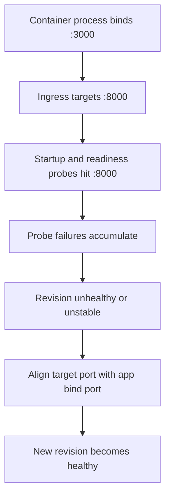

---
content_sources:
diagrams:
  - id: architecture
    type: flowchart
    source: mslearn-adapted
    based_on:
      - https://learn.microsoft.com/azure/container-apps/health-probes
      - https://learn.microsoft.com/azure/container-apps/ingress-how-to
content_validation:
  status: verified
  last_reviewed: "2026-04-29"
  reviewer: ai-agent
  core_claims:
    - claim: "Azure Container Apps supports startup, readiness, and liveness probes for containers."
      source: "https://learn.microsoft.com/azure/container-apps/health-probes"
      verified: true
    - claim: "Ingress in Azure Container Apps routes incoming requests to the app's target port inside the container."
      source: "https://learn.microsoft.com/azure/container-apps/ingress-how-to"
      verified: true
---

# Probe and Port Mismatch Lab

Reproduce probe failures when the container process listens on one port while ingress and probes target a different port.

## Lab Metadata

| Attribute | Value |
|---|---|
| Difficulty | Beginner |
| Estimated Duration | 20-25 minutes |
| Tier | Consumption |
| Failure Mode | App listens on port `3000` but Container App ingress targets port `8000` |
| Skills Practiced | Port alignment, probe troubleshooting, revision inspection, system log analysis |

## 1) Background

This lab deploys an app process that listens on one port while ingress and probes target another port. The workload container listens on port `3000`, but the Container App is updated to use `targetPort` `8000`, so startup and readiness checks fail before the revision can stabilize.

Port mismatch often looks like an application crash because repeated probe failures can restart replicas even when the process itself is healthy.

### Architecture

<!-- diagram-id: architecture -->


## 2) Hypothesis

**IF** the application binds to port `3000` while the Container App ingress `targetPort` remains `8000`, **THEN** system logs will show `ProbeFailed` events and the latest revision will remain non-healthy until `targetPort` is corrected to `3000`.

| Variable | Control State | Experimental State |
|---|---|---|
| Application bind port | `3000` | `3000` |
| Container App target port | `3000` | `8000` |
| Probe behavior | HTTP 200 on expected port | Probe failures on wrong port |
| Revision health | `Healthy` | Non-`Healthy` / unstable |

## 3) Runbook

### Deploy baseline infrastructure

```bash
export RG="rg-aca-lab-port"
export LOCATION="koreacentral"

az extension add --name containerapp --upgrade
az login

az group create --name "$RG" --location "$LOCATION"

az deployment group create \
    --name "lab-port" \
    --resource-group "$RG" \
    --template-file "./labs/probe-and-port-mismatch/infra/main.bicep" \
    --parameters baseName="labport"
```

Expected output pattern: deployment shows `Succeeded`.

### Capture deployment outputs

```bash
export APP_NAME="$(az deployment group show \
    --resource-group "$RG" \
    --name "lab-port" \
    --query "properties.outputs.containerAppName.value" \
    --output tsv)"

export ACR_NAME="$(az deployment group show \
    --resource-group "$RG" \
    --name "lab-port" \
    --query "properties.outputs.containerRegistryName.value" \
    --output tsv)"

export ENVIRONMENT_NAME="$(az deployment group show \
    --resource-group "$RG" \
    --name "lab-port" \
    --query "properties.outputs.environmentName.value" \
    --output tsv)"
```

Expected output: no output.

### Trigger the mismatch

The workload is built to listen on port `3000`:

```text
CMD ["gunicorn", "--bind", "0.0.0.0:3000", "--workers", "2", "app:app"]
```

Run the lab trigger:

```bash
./labs/probe-and-port-mismatch/trigger.sh
```

The trigger script builds the workload image and updates the Container App with a mismatched target port:

```bash
az acr build --registry "$ACR_NAME" --image "${APP_NAME}:v1" ./workload

az containerapp update \
    --name "$APP_NAME" \
    --resource-group "$RG" \
    --image "${ACR_LOGIN_SERVER}/${APP_NAME}:v1" \
    --target-port 8000 \
    --registry-server "$ACR_LOGIN_SERVER" \
    --registry-username "$ACR_USERNAME" \
    --registry-password "$ACR_PASSWORD"

sleep 40
az containerapp revision list --name "$APP_NAME" --resource-group "$RG" --output table
az containerapp logs show --name "$APP_NAME" --resource-group "$RG" --type system --tail 20
```

Expected output: the latest revision is not healthy or repeatedly restarting.

### Inspect probe/system logs

```bash
az containerapp logs show \
    --name "$APP_NAME" \
    --resource-group "$RG" \
    --type system
```

Expected diagnostic output pattern:

```json
{
  "TimeGenerated": "2026-04-04T11:31:10.444Z",
  "ContainerAppName_s": "ca-myapp",
  "Type_s": "Warning",
  "Reason_s": "ProbeFailed",
  "Log_s": "Probe of StartUp failed with status code: 1"
}
```

### Validate the ingress target port setting

```bash
az containerapp show \
    --name "$APP_NAME" \
    --resource-group "$RG" \
    --query "properties.configuration.ingress.targetPort" \
    --output tsv
```

Expected output: `8000`, which does not match the application bind port `3000`.

### Apply the fix by aligning ports

```bash
az containerapp update \
    --name "$APP_NAME" \
    --resource-group "$RG" \
    --target-port 3000
```

Expected output: the update succeeds and creates a new revision.

### Verify recovery

```bash
./labs/probe-and-port-mismatch/verify.sh
```

The verify script confirms the mismatch reproduces the failure, then runs:

```bash
az containerapp update --name "$APP_NAME" --resource-group "$RG" --target-port 3000
sleep 40
az containerapp revision list --name "$APP_NAME" --resource-group "$RG" --query "sort_by([].{created:properties.createdTime,health:properties.healthState}, &created)[-1].health" --output tsv
```

Expected output: latest revision becomes `Healthy` and requests succeed consistently.

## 4) Experiment Log

| Step | Action | Expected | Actual | Pass/Fail |
|---|---|---|---|---|
| 1 | Deploy baseline | Deployment succeeds | | |
| 2 | Capture outputs | Variables populated | | |
| 3 | Run `trigger.sh` | Revision becomes non-healthy | | |
| 4 | Review system logs | `ProbeFailed` evidence appears | | |
| 5 | Check `targetPort` | Value is `8000` while app binds to `3000` | | |
| 6 | Update `targetPort` to `3000` | New revision created | | |
| 7 | Run `verify.sh` | Latest revision becomes healthy | | |

## Expected Evidence

| Evidence Source | Expected State |
|---|---|
| Workload container command | Process binds to `0.0.0.0:3000` |
| `az containerapp show --name "$APP_NAME" --resource-group "$RG" --query "properties.configuration.ingress.targetPort" --output tsv` | `8000` before fix, `3000` after fix |
| `az containerapp logs show --name "$APP_NAME" --resource-group "$RG" --type system` | `ProbeFailed` and startup/readiness probe errors |
| `az containerapp revision list --name "$APP_NAME" --resource-group "$RG" --output table` | Latest revision non-healthy before fix; healthy after alignment |
| `./labs/probe-and-port-mismatch/verify.sh` | Failure reproduced first, then corrected revision stabilizes |

## Clean Up

```bash
az group delete --name "$RG" --yes --no-wait
```

## Related Playbook

- [Probe Failure and Slow Start](../playbooks/startup-and-provisioning/probe-failure-and-slow-start.md)

## See Also

- [Ingress Not Reachable Playbook](../playbooks/ingress-and-networking/ingress-not-reachable.md)
- [Ingress Target Port Mismatch Lab](./ingress-target-port-mismatch.md)

## Sources

- [Health probes in Azure Container Apps](https://learn.microsoft.com/azure/container-apps/health-probes)
- [Configure ingress in Azure Container Apps](https://learn.microsoft.com/azure/container-apps/ingress-how-to)
