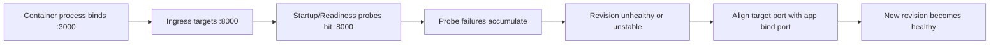

# Probe and Port Mismatch Lab

Reproduce probe failures when the container process listens on one port while ingress/probes target a different port.

## Scenario

- **Difficulty**: Beginner
- **Estimated duration**: 20-25 minutes
- **Failure mode**: app listens on 3000 but Container App ingress targets 8000

## Prerequisites

- Azure CLI with Container Apps extension
- Permissions to deploy Container Apps and ACR resources

```bash
az extension add --name containerapp --upgrade
az login
```

## Quick Start

```bash
export RG="rg-aca-lab-port"
export LOCATION="koreacentral"

az group create --name "$RG" --location "$LOCATION"
az deployment group create --name "lab-port" --resource-group "$RG" --template-file ./labs/probe-and-port-mismatch/infra/main.bicep --parameters baseName="labport"

export APP_NAME="$(az deployment group show --resource-group "$RG" --name "lab-port" --query \"properties.outputs.containerAppName.value\" --output tsv)"
export ACR_NAME="$(az deployment group show --resource-group "$RG" --name "lab-port" --query \"properties.outputs.containerRegistryName.value\" --output tsv)"

cd labs/probe-and-port-mismatch
./trigger.sh
./verify.sh
./cleanup.sh
```

## Expected Diagnostic Output Pattern

```json
{
  "TimeGenerated": "2026-04-04T11:31:10.444Z",
  "ContainerAppName_s": "ca-myapp",
  "Type_s": "Warning",
  "Reason_s": "ProbeFailed",
  "Log_s": "Probe of StartUp failed with status code: 1"
}
```

Probe failures are expected until port/probe alignment is fixed and revision reaches `RevisionReady`.

## Key Takeaways

- Target port and process bind port must match.
- Probe failures can look like app crashes if port mapping is wrong.
- Recovery is usually a simple target-port correction and new revision rollout.

## See Also

- [Probe Failure and Slow Start Playbook](../playbooks/startup-and-provisioning/probe-failure-and-slow-start.md)
- [Ingress Not Reachable Playbook](../playbooks/ingress-and-networking/ingress-not-reachable.md)

## Scenario Setup

This lab deploys an app process that listens on one port while ingress and probes target another port. The mismatch causes probe failures and prevents stable readiness.



!!! warning "Port mismatch can look like app crash"
    If probes fail continuously, replicas may restart and resemble crash-loop behavior. Always confirm bind port vs target port before deeper code debugging.

!!! tip "Verify port alignment in two places"
    Check both the Container App ingress target port and the application startup command/environment variable.

## Step-by-Step Walkthrough

1. **Create resource group and deploy lab**

   ```bash
   export RG="rg-aca-lab-port"
   export LOCATION="koreacentral"
   az group create --name "$RG" --location "$LOCATION"

   az deployment group create \
     --name "lab-port" \
     --resource-group "$RG" \
     --template-file "./labs/probe-and-port-mismatch/infra/main.bicep" \
     --parameters baseName="labport"
   ```

   Expected output pattern: deployment shows `Succeeded`.

2. **Capture deployment outputs**

   ```bash
   export APP_NAME="$(az deployment group show --resource-group "$RG" --name "lab-port" --query "properties.outputs.containerAppName.value" --output tsv)"
   export ACR_NAME="$(az deployment group show --resource-group "$RG" --name "lab-port" --query "properties.outputs.containerRegistryName.value" --output tsv)"
   export ENVIRONMENT_NAME="$(az deployment group show --resource-group "$RG" --name "lab-port" --query "properties.outputs.containerAppsEnvironmentName.value" --output tsv)"
   ```

   Expected output: no output.

3. **Trigger failure state**

   ```bash
   ./labs/probe-and-port-mismatch/trigger.sh
   az containerapp revision list --name "$APP_NAME" --resource-group "$RG" --output table
   ```

   Expected output pattern: latest revision not healthy or repeatedly restarting.

4. **Inspect probe/system logs**

   ```bash
   az containerapp logs show \
     --name "$APP_NAME" \
     --resource-group "$RG" \
     --type system
   ```

   Expected evidence: `ProbeFailed` and startup/readiness probe errors.

5. **Validate ingress target port setting**

   ```bash
   az containerapp show \
     --name "$APP_NAME" \
     --resource-group "$RG" \
     --query "properties.configuration.ingress.targetPort" \
     --output tsv
   ```

   Expected output pattern: mismatched target port compared to app bind port.

6. **Apply resolution by aligning ports**

   ```bash
   az containerapp update \
     --name "$APP_NAME" \
     --resource-group "$RG" \
     --target-port 3000
   ```

   Expected output: update operation succeeds and new revision is created.

7. **Verify recovery**

   ```bash
   ./labs/probe-and-port-mismatch/verify.sh
   az containerapp revision list --name "$APP_NAME" --resource-group "$RG" --output table
   ```

   Expected output pattern: latest revision `Healthy` and requests succeed.

## Symptoms / Cause / Fix Matrix

| What you see | What is happening | How to fix |
|---|---|---|
| `ProbeFailed` in system logs | Probe reaches wrong container port | Align `--target-port` with app bind port |
| Revision never reaches ready | Health checks fail before traffic eligible | Correct port and rollout new revision |
| Endpoint intermittently unavailable | Repeated restarts from failed startup probe | Increase startup window only after port is correct |
| No app logs but system warnings | Container never serves traffic due to probe mismatch | Validate probe endpoint and port configuration |

## Resolution Verification Checklist

1. `targetPort` equals process bind port.
2. Startup/readiness probes return HTTP 200.
3. Revision health is `Healthy`.
4. Endpoint responds consistently.

## Sources

- [Microsoft Learn: Health probes in Azure Container Apps](https://learn.microsoft.com/azure/container-apps/health-probes)
- [Microsoft Learn: Configure ingress in Azure Container Apps](https://learn.microsoft.com/azure/container-apps/ingress-how-to)
