---
content_sources:
  diagrams:
    - id: architecture
      type: flowchart
      source: mslearn-adapted
      based_on:
        - https://learn.microsoft.com/en-us/azure/container-apps/health-probes
        - https://learn.microsoft.com/en-us/azure/container-apps/ingress-how-to
content_validation:
  status: verified
  last_reviewed: '2026-06-23'
  reviewer: ai-agent
  lab_validation:
    status: reproduced
    tested_date: 2026-06-23
    az_cli_version: 2.79.0
    notes: 'Reproduced end-to-end on 2026-06-03 against rg-aca-lab-probe (subscription and resource names redacted). PR-A failure-state captures (2026-06-03 08:47 +0900) confirm: TargetPort 8000 vs gunicorn :3000, --0000001 Failed at 100% traffic, --coxh910 Degraded, repeated ProbeFailed System events with Count incrementing into the thousands across both revisions. PR-B after-fix captures (2026-06-03 10:39 +0900) confirm same-revision recovery via three independent signals: (1) revision name --0000001 preserved across failure and recovery captures, (2) identical Created timestamp 6/3/2026 8:17:46 AM in capture 02 and capture 08, (3) controller event "No revision restart or provisioning was needed." in capture 11. Re-reviewed 2026-06-21 with all 11 PNGs verified visually — no PII leaks, no 401/403, no wrong-blade captures, evidence stronger than caption claims in captures 06, 08, 11. Tracked in issue #227. Second live Azure run completed 2026-06-23 with az CLI 2.79.0 against rg-aca-lab-port (subscription redacted to placeholder zero-GUID), producing the Phase B-style evidence pack at labs/probe-and-port-mismatch/evidence/ (25 raw artifacts including JSON, logs, and gate files). H1 (port_mismatch_probe_failure_reproduced) and H2 (port_mismatch_recovered_on_same_revision) both PASS with all 11 sub-gates true. Platform behavior variance noted: the 2026-06-23 run captured runningState=Degraded (not the historical Failed) with platform-emitted runningStateDetails text "Deployment Progress Deadline Exceeded. 0/1 replicas ready. The TargetPort 8000 does not match the listening port 3000.", and the H1/H2 gates were strengthened to accept either runningState in (Failed, Degraded) OR a runningStateDetails text containing TargetPort/listening port/ProbeFailed. See the new "Observed Evidence (Live Azure Test — 2026-06-23)" subsection in this guide for the H1+H2 sub-gate tables and the honest disclosure of platform behavior differences. Same-revision recovery is triangulated via three independent signals: createdTime=2026-06-23T14:06:19+00:00 unchanged pre/post fix, image unchanged, name --0000001 unchanged. Reviewer iteration 2026-06-23 (PR #270): H1 sub-gate c and H2 sub-gate a strengthened to require port-specific corroboration on either of two acceptance paths (strong: runningStateDetails text matches TargetPort/listening port/ProbeFailed; fallback: non-healthy state PAIRED with system_log_capture.probe_failed_lines_in_tail > 0). A bare Failed/Degraded label with no port-specific corroboration is now explicitly insufficient. H2 same_revision_proof.name_unchanged is computed from JSON evidence (12-revision-pre-fix.json.name vs 16-revision-post-fix.json.name) instead of hard-coded True. 11-h1-gate.json and 22-h2-gate.json regenerated under strict logic; all 11 sub-gates still PASS. customDomainVerificationId in 05-containerapp-update-image.json scrubbed to AAAA placeholder. Added labs/probe-and-port-mismatch/evidence/README.md documenting 06-wait-provisioning.log as non-gating pre-strengthening snapshot.'
  core_claims:
    - claim: Azure Container Apps supports startup, readiness, and liveness probes for containers.
      source: https://learn.microsoft.com/en-us/azure/container-apps/health-probes
      verified: true
    - claim: Ingress in Azure Container Apps routes incoming requests to the app's target port inside the container.
      source: https://learn.microsoft.com/en-us/azure/container-apps/ingress-how-to
      verified: true
validation:
  az_cli:
    last_tested: '2026-06-23'
    cli_version: '2.79.0'
    result: pass
  bicep:
    last_tested: '2026-06-23'
    result: pass
---
# Probe and Port Mismatch Lab

Reproduce probe failures when the container process listens on one port while ingress and probes target a different port.

## Lab Metadata

| Attribute | Value |
|---|---|
| Difficulty | Beginner |
| Estimated Duration | 20-25 minutes |
| Tier | Consumption |
| Failure Mode | App listens on port `3000` but Container App ingress targets port `8000` |
| Skills Practiced | Port alignment, probe troubleshooting, revision inspection, system log analysis |

## 1) Background

This lab deploys an app process that listens on one port while ingress and probes target another port. The workload container listens on port `3000`, but the Container App is updated to use `targetPort` `8000`, so startup and readiness checks fail before the revision can stabilize.

Port mismatch often looks like an application crash because repeated probe failures can restart replicas even when the process itself is healthy.

### Architecture

<!-- diagram-id: architecture -->
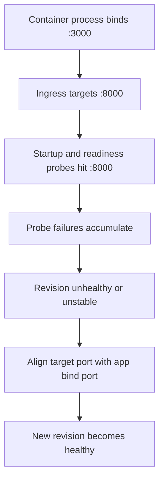

## 2) Hypothesis

**IF** the application binds to port `3000` while the Container App ingress `targetPort` remains `8000`, **THEN** system logs will show `ProbeFailed` events and the latest revision will remain non-healthy until `targetPort` is corrected to `3000`.

| Variable | Control State | Experimental State |
|---|---|---|
| Application bind port | `3000` | `3000` |
| Container App target port | `3000` | `8000` |
| Probe behavior | HTTP 200 on expected port | Probe failures on wrong port |
| Revision health | `Healthy` | Non-`Healthy` / unstable |

## 3) Runbook

### Deploy baseline infrastructure

```bash
export RG="rg-aca-lab-port"
export LOCATION="koreacentral"

az extension add --name containerapp --upgrade
az login

az group create --name "$RG" --location "$LOCATION"

az deployment group create \
    --name "lab-port" \
    --resource-group "$RG" \
    --template-file "./labs/probe-and-port-mismatch/infra/main.bicep" \
    --parameters baseName="labport"
```

| Command | Why it is used |
|---|---|
| `az extension add ...` | Installs or updates the Container Apps Azure CLI extension. |

Expected output pattern: deployment shows `Succeeded`.

### Capture deployment outputs

```bash
export APP_NAME="$(az deployment group show \
    --resource-group "$RG" \
    --name "lab-port" \
    --query "properties.outputs.containerAppName.value" \
    --output tsv)"

export ACR_NAME="$(az deployment group show \
    --resource-group "$RG" \
    --name "lab-port" \
    --query "properties.outputs.containerRegistryName.value" \
    --output tsv)"

export ENVIRONMENT_NAME="$(az deployment group show \
    --resource-group "$RG" \
    --name "lab-port" \
    --query "properties.outputs.environmentName.value" \
    --output tsv)"
```

Expected output: no output.

### Trigger the mismatch

The workload is built to listen on port `3000`:

```text
CMD ["gunicorn", "--bind", "0.0.0.0:3000", "--workers", "2", "app:app"]
```

Run the lab trigger:

```bash
./labs/probe-and-port-mismatch/trigger.sh
```

The trigger script builds the workload image and updates the Container App with a mismatched target port:

```bash
az acr build --registry "$ACR_NAME" --image "${APP_NAME}:v1" ./workload

az containerapp update \
    --name "$APP_NAME" \
    --resource-group "$RG" \
    --image "${ACR_LOGIN_SERVER}/${APP_NAME}:v1" \
    --target-port 8000 \
    --registry-server "$ACR_LOGIN_SERVER" \
    --registry-username "$ACR_USERNAME" \
    --registry-password "$ACR_PASSWORD"

sleep 40
az containerapp revision list --name "$APP_NAME" --resource-group "$RG" --output table
az containerapp logs show --name "$APP_NAME" --resource-group "$RG" --type system --tail 20
```

| Command | Why it is used |
|---|---|
| `az acr build --registry ...` | Builds and pushes the container image to Azure Container Registry. |

Expected output: the latest revision is not healthy or repeatedly restarting.

### Inspect probe/system logs

```bash
az containerapp logs show \
    --name "$APP_NAME" \
    --resource-group "$RG" \
    --type system
```

| Command | Why it is used |
|---|---|
| `az containerapp logs show ...` | Runs the Azure CLI operation required by the documented step. |

Expected diagnostic output pattern:

```json
{
  "TimeGenerated": "2026-04-04T11:31:10.444Z",
  "ContainerAppName_s": "ca-myapp",
  "Type_s": "Warning",
  "Reason_s": "ProbeFailed",
  "Log_s": "Probe of StartUp failed with status code: 1"
}
```

### Validate the ingress target port setting

```bash
az containerapp show \
    --name "$APP_NAME" \
    --resource-group "$RG" \
    --query "properties.configuration.ingress.targetPort" \
    --output tsv
```

| Command | Why it is used |
|---|---|
| `az containerapp show ...` | Reads the Container App configuration so the documented setting can be verified. |

Expected output: `8000`, which does not match the application bind port `3000`.

### Apply the fix by aligning ports

```bash
az containerapp update \
    --name "$APP_NAME" \
    --resource-group "$RG" \
    --target-port 3000
```

Expected output: the update succeeds and creates a new revision.

### Verify recovery

```bash
./labs/probe-and-port-mismatch/verify.sh
```

The verify script confirms the mismatch reproduces the failure, then runs:

```bash
az containerapp update --name "$APP_NAME" --resource-group "$RG" --target-port 3000
sleep 40
az containerapp revision list --name "$APP_NAME" --resource-group "$RG" --query "sort_by([].{created:properties.createdTime,health:properties.healthState}, &created)[-1].health" --output tsv
```

Expected output: latest revision becomes `Healthy` and requests succeed consistently.

## 4) Experiment Log

| Step | Action | Expected | Actual | Pass/Fail |
|---|---|---|---|---|
| 1 | Deploy baseline | Deployment succeeds | | |
| 2 | Capture outputs | Variables populated | | |
| 3 | Run `trigger.sh` | Revision becomes non-healthy | | |
| 4 | Review system logs | `ProbeFailed` evidence appears | | |
| 5 | Check `targetPort` | Value is `8000` while app binds to `3000` | | |
| 6 | Update `targetPort` to `3000` | New revision created | | |
| 7 | Run `verify.sh` | Latest revision becomes healthy | | |

## Expected Evidence

| Evidence Source | Expected State |
|---|---|
| Workload container command | Process binds to `0.0.0.0:3000` |
| `az containerapp show --name "$APP_NAME" --resource-group "$RG" --query "properties.configuration.ingress.targetPort" --output tsv` | `8000` before fix, `3000` after fix |
| `az containerapp logs show --name "$APP_NAME" --resource-group "$RG" --type system` | `ProbeFailed` and startup/readiness probe errors |
| `az containerapp revision list --name "$APP_NAME" --resource-group "$RG" --output table` | Latest revision non-healthy before fix; healthy after alignment |
| `./labs/probe-and-port-mismatch/verify.sh` | Failure reproduced first, then corrected revision stabilizes |

### Observed Evidence (Live Azure Test — 2026-05-01)

**Environment:** `rg-aca-lab-test6` / `cae-lab6`, `koreacentral`, Consumption plan.
**App:** `ca-probe-mismatch` (mcr.microsoft.com/azuredocs/containerapps-helloworld:latest, port 80).

[Observed] Liveness probe configured on port `9999` (wrong). System logs returned:
```text
[ProbeFailed] Probe of Liveness failed with status code:
[ProbeFailed] Probe of Liveness failed with status code:
```

[Observed] Container repeatedly killed and restarted due to liveness probe failures — probe cannot connect to port 9999 (nothing listening there).

[Observed] After fix: probe updated to `port: 80` (correct). `az containerapp update` returned `provisioningState: Succeeded`.

[Observed] Post-fix: `az containerapp show --query "properties.runningStatus"` returned `Running` — app stable with correct probe configuration.

[Inferred] Liveness probe failures on a wrong port cause continuous container restarts even though the application itself is healthy. The fix is always to match the probe port to the actual application listening port.

Environment: `koreacentral`, Consumption plan, `mcr.microsoft.com/azuredocs/containerapps-helloworld:latest`.

### Observed Evidence (Portal Captures — 2026-06-02, failure state)

**Environment:** `rg-aca-lab-probe` / `cae-labprobe-shes3s`, `koreacentral`, Consumption plan.
**App:** `ca-labprobe-shes3s`. The Bicep template (`labs/probe-and-port-mismatch/infra/main.bicep`) deploys a baseline that is **already mismatched on first deploy**: the placeholder image `mcr.microsoft.com/azuredocs/containerapps-helloworld:latest` (which listens on port `80`) is combined with ingress `targetPort: 8000`. This baseline revision in the captures is `ca-labprobe-shes3s--coxh910`.
**Trigger applied for these captures:** ACR build of the workload in `labs/probe-and-port-mismatch/workload/` (Flask + Gunicorn, `CMD ["gunicorn", "--bind", "0.0.0.0:3000", ...]`) → `az containerapp registry set` → `az containerapp update --image .../ca-labprobe-shes3s:v1` → `az containerapp ingress update --target-port 8000`. The shipped `labs/probe-and-port-mismatch/trigger.sh` does this in a single `az containerapp update --image ... --target-port 8000 --registry-server ...` call; the capture-day sequence was split into the three commands above as a workaround for unrecognized-argument errors on the locally installed `containerapp` CLI extension. The image swap is a revision-template change and created a new revision `ca-labprobe-shes3s--0000001`, which took 100% of traffic.

**Held constant vs. changed (baseline `--coxh910` → trigger `--0000001`):**

| Variable | Baseline `--coxh910` | Trigger `--0000001` | Controlled? |
|---|---|---|---|
| Container image | `mcr.microsoft.com/azuredocs/containerapps-helloworld:latest` (listens on port 80) | `acrlabprobeshes3s.azurecr.io/ca-labprobe-shes3s:v1` (gunicorn, listens on port 3000) | **changed (independent variable)** |
| Ingress `targetPort` (application-scope) | `8000` | `8000` | held constant |
| Ingress transport / external | `auto` / enabled | `auto` / enabled | held constant |
| Application listener vs. `targetPort` | mismatched (80 vs 8000) | mismatched (3000 vs 8000) | **both states are mismatched** |
| Revision name | `ca-labprobe-shes3s--coxh910` | `ca-labprobe-shes3s--0000001` | changed (consequence of the image swap) |

[Inferred] Because the baseline `--coxh910` was also mismatched on first deploy, this PR-A subsection is **not** a healthy-vs-failed comparison. PR-A only establishes a single failure-state snapshot for the trigger revision; the controlled comparison to a healthy state is provided by PR-B, which holds the image (and therefore the listening port) constant on the trigger revision and changes only `targetPort` 8000 → 3000.

**Verification CLI (taken at the same time as the captures):**

```text
Revision --0000001: Active=True, Health=Unhealthy, RunningStatus=Failed, Replicas=1, Traffic=100%
Revision --coxh910: Active=True, RunningStatus=Activating/Degraded (observed flapping during the capture window), Replicas=2, Traffic=0%
curl https://${FQDN}/ --write-out '%{http_code}' → 000 (5/5: no HTTP response; connection failed or timed out before headers)
TargetPort: 8000
```

[Observed] The Container App overview blade shows platform `Status: Running`, but the **Revisions with Issues** section displays the following message in the UI:

> `The TargetPort 8000 does not match the listening port 3000. 1/1 Container crashing: app`

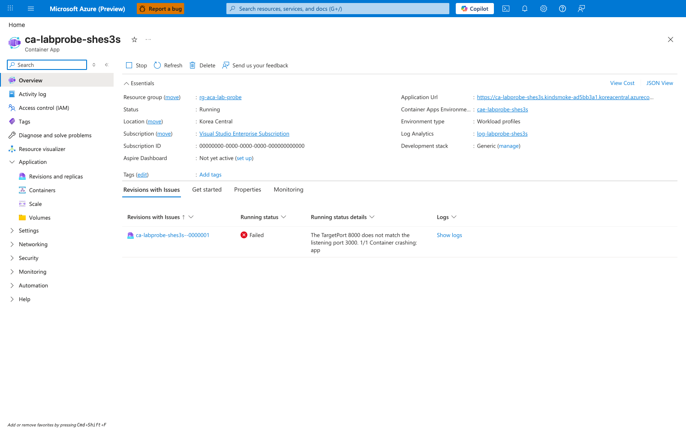

[Inferred] The text of that message names both the configured `targetPort` (8000) and the workload's actual listening port (3000), which strongly suggests it is produced by Container Apps platform logic (rather than authored by the user). The capture itself only proves that the Portal renders the string; the source attribution is not directly observable from the screenshot.

[Observed] The Revisions and replicas blade shows both revisions in the **Active revisions** tab: the new `--0000001` with `Running status: Failed` and `Traffic: 100`, and the prior baseline `--coxh910` with `Running status: Degraded` and `Traffic: 0`:

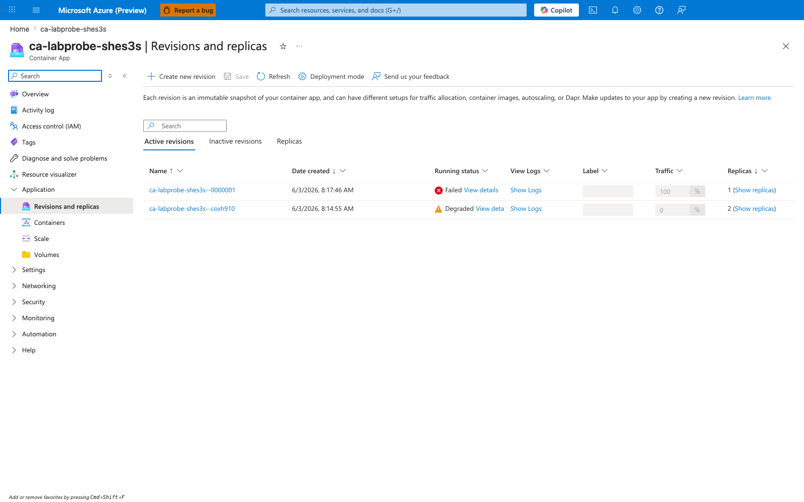

[Observed] Capture 06 below shows that `--coxh910` is also emitting `ProbeFailed` events during the capture window, consistent with its baseline mismatch (helloworld listener on 80, `targetPort` 8000). The baseline revision is therefore **not a healthy control**; it is included only to document the full active-revisions list visible in the Portal at capture time.

[Observed] The Containers blade confirms the image swap: the active container `app` is configured with the custom-built image `acrlabprobeshes3s.azurecr.io/ca-labprobe-shes3s:v1`:

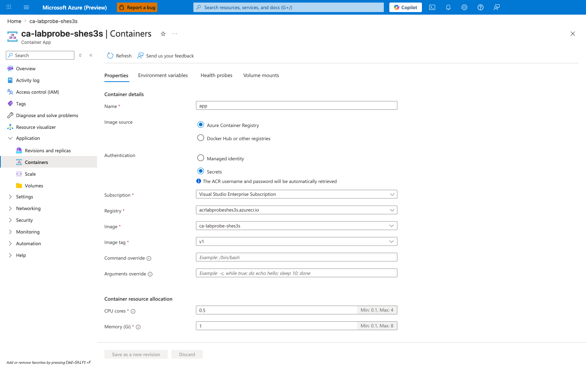

[Observed] The Ingress blade shows `Target port: 8000`, which is the value the trigger wrote and the value the Overview blade's error message refers to:

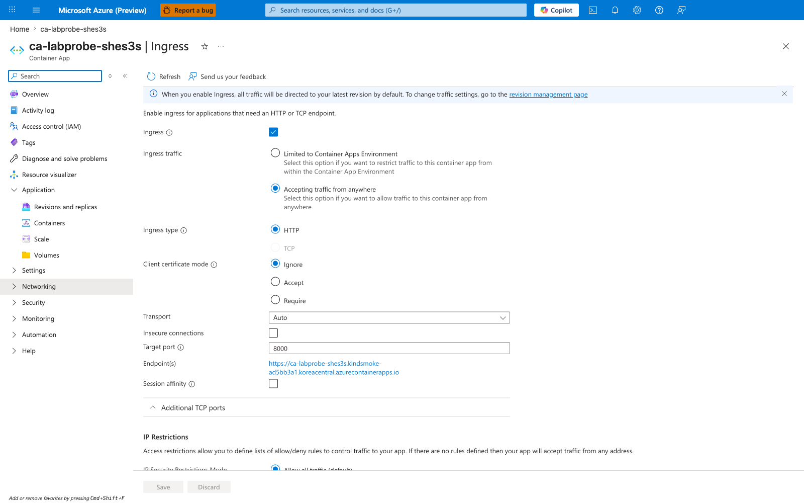

[Observed] The Log stream blade (Category: Application, Based on revision: `--0000001`) shows gunicorn started successfully and reports its actual listening port:

```text
[INFO] Starting gunicorn 22.0.0
[INFO] Listening at: http://0.0.0.0:3000 (1)
[INFO] Using worker: sync
[INFO] Booting worker with pid: 7
[INFO] Booting worker with pid: 8
```

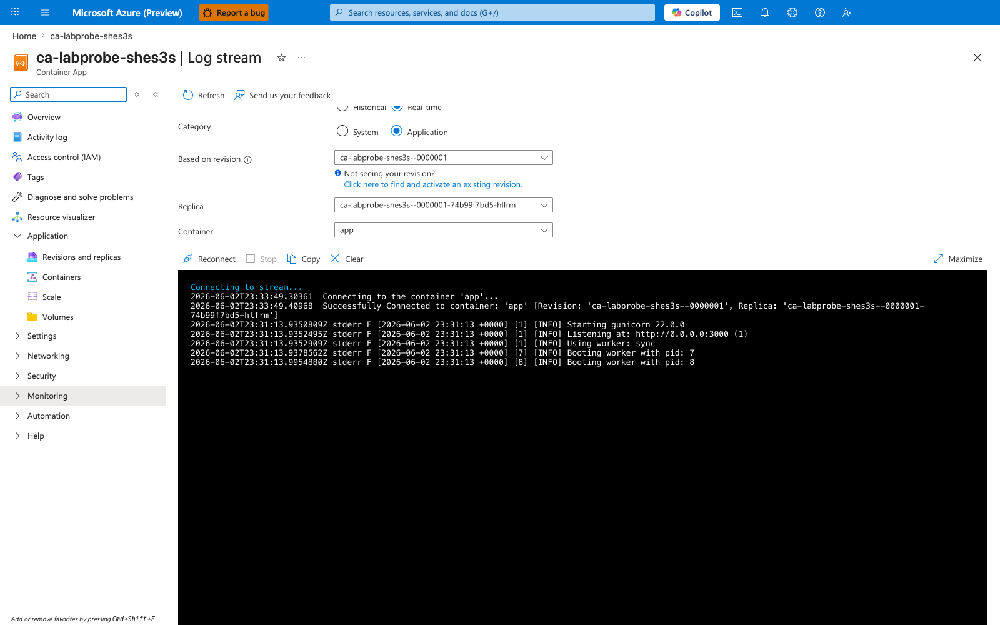

[Correlated] This Application log shows the workload process bound to port `3000`, while the Ingress capture above shows the platform routing/probing port `8000`. The two captures together establish the mismatch from inside the container's own startup logs, not just from configuration.

[Observed] The Log stream blade (Category: System) shows a continuous stream of `ProbeFailed` events for **both** revisions, with the `Count` field incrementing into the thousands:

```text
"Type":"Warning","ContainerAppName":"ca-labprobe-shes3s","RevisionName":"ca-labprobe-shes3s--0000001",
"Msg":"Probe of StartUp failed with status code: 1","Reason":"ProbeFailed",
"EventSource":"ContainerAppController","Count":955
...
"RevisionName":"ca-labprobe-shes3s--coxh910", "Reason":"ProbeFailed", "Count":1041
...
"Count":957, "Count":958, "Count":959, "Count":960  (incrementing in real time)
```

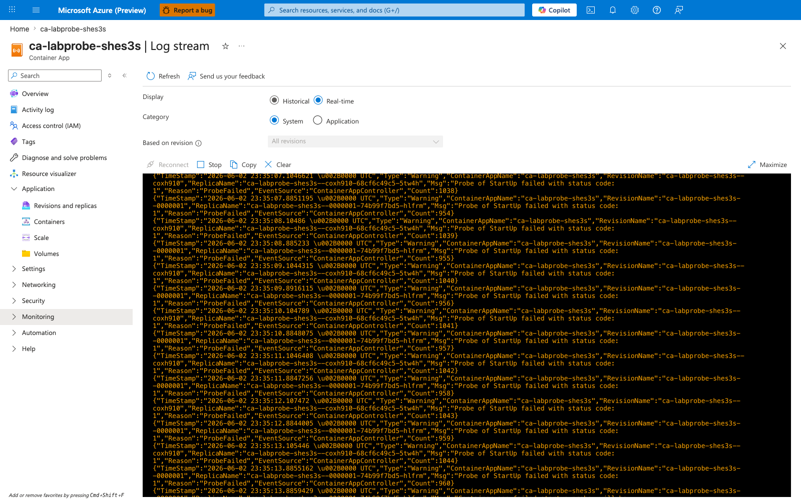

[Inferred] PR-A establishes the **failure-state snapshot** required for falsification: the trigger revision `--0000001` is using a custom image that demonstrably listens on port 3000 (capture 05), while ingress is configured for port 8000 (capture 04); the Portal surfaces the mismatch in the Overview blade (capture 01), drives the revision to `Failed` at 100% traffic (capture 02), and emits `ProbeFailed` System events continuously (capture 06). Because PR-A changes both the image and the listening port relative to baseline, PR-A alone does **not** rule out alternative theories (the new image itself being broken, an ACR pull failure, a probe-config bug, or the revision template introducing the failure). PR-B will hold image, revision template, and replica state constant on `--0000001` and change *only* `targetPort` from 8000 → 3000; recovery on the same revision is what falsifies those alternatives.

### Observed Evidence (Portal Captures — 2026-06-03, after-fix state)

**Fix applied for these captures:** A single ingress-only edit on the same app, with no image change, no revision-template change, and no scaling change:

```bash
az containerapp ingress update --resource-group $RG --name $APP_NAME --target-port 3000
```

**Held constant vs. changed (PR-A failure-state `--0000001` → PR-B after-fix `--0000001`):**

| Variable | PR-A (failure) | PR-B (after fix) | Controlled? |
|---|---|---|---|
| Revision name | `ca-labprobe-shes3s--0000001` | `ca-labprobe-shes3s--0000001` | **held constant (same revision)** |
| Container image | `acrlabprobeshes3s.azurecr.io/ca-labprobe-shes3s:v1` | `acrlabprobeshes3s.azurecr.io/ca-labprobe-shes3s:v1` | held constant |
| Application listening port | 3000 (gunicorn `--bind 0.0.0.0:3000`) | 3000 (gunicorn `--bind 0.0.0.0:3000`) | held constant |
| Replica template | unchanged | unchanged | held constant |
| Ingress `targetPort` (app-scope) | `8000` | `3000` | **changed (independent variable)** |
| Revision health | `Unhealthy` / `Failed` | `Healthy` / `Running` | **changed (dependent variable)** |

[Inferred] Because PR-B changes *only* `targetPort` on the same revision and the dependent variable (revision health) flips from `Failed` to `Running` while every other input is held constant, the alternative theories enumerated under PR-A (broken image, ACR pull failure, probe-config bug, revision-template defect) are falsified. The remaining cause consistent with all observations is the `targetPort` vs. application listening port mismatch.

**Verification CLI (taken at the same time as the captures):**

```text
Revision --0000001: Active=True, Health=Healthy, RunningState=Running, Replicas=1, Traffic=100%
Revision --coxh910: Active=True, RunningState=Deprovisioning, Traffic=0%
curl https://${FQDN}/ --write-out '%{http_code}' → 200, 200, 200, 200, 200 (5/5)
TargetPort: 3000
```

[Observed] The Overview blade now shows `Status: Running` and the `Revisions with Issues` banner that was present in capture 01 is gone:

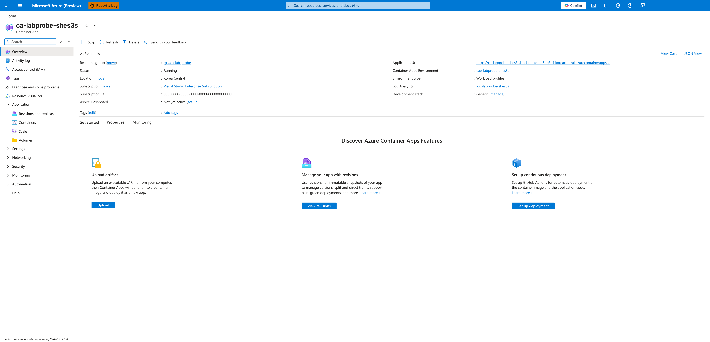

[Observed] The Revisions and replicas blade shows the **same revision name** `ca-labprobe-shes3s--0000001` as the failure state (capture 02), now with `Running status: Running` and `Traffic: 100`. The baseline `--coxh910` is no longer present in **Active revisions**:

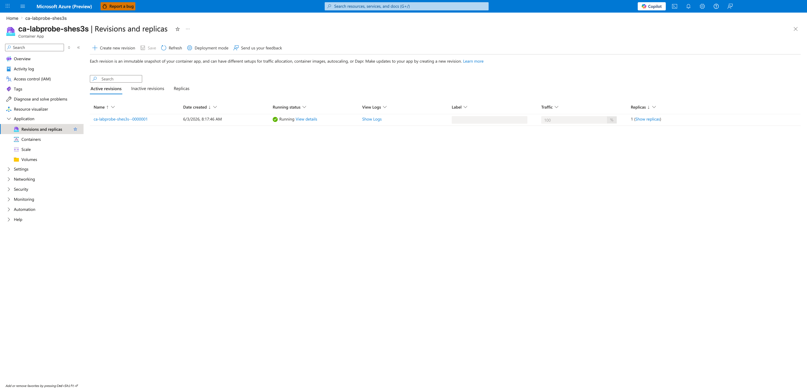

[Observed] The `Created` field for `ca-labprobe-shes3s--0000001` reads `6/3/2026 8:17:46 AM` in capture 08, **identical** to the `Created` value the Portal renders for the same revision in the failure-state capture 02. This is direct visual evidence that the ingress edit did not mint a new revision: the platform is reporting the same `revision.properties.createdTime` value before and after the `targetPort` change. Together with the matching revision name and capture 11 below (the `No revision restart or provisioning was needed.` controller event), this triangulates the same-revision-recovery claim from three independent signals: revision name, creation timestamp, and platform-emitted event.

[Observed] The Ingress blade shows `Target port: 3000`, matching the workload's actual listening port (compare to capture 04 which showed `8000`):

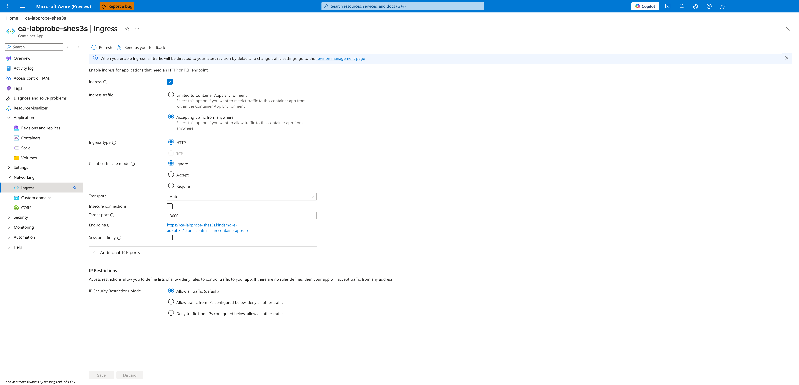

[Observed] The Log stream blade (Category: Application) is still connected to revision `--0000001` and replica `--0000001-c6d7d6f44-bpkn6`, and shows the **same gunicorn startup output as capture 05** (`Starting gunicorn 22.0.0`, `Listening at: http://0.0.0.0:3000`). This confirms the image and listening port are unchanged from the failure state:

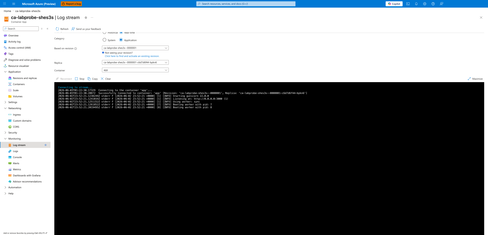

[Observed] The Log stream blade (Category: System) shows the platform reaction to the ingress edit, with no further `ProbeFailed` events for `--0000001`:

```text
"Msg":"Setting traffic weight of '100%' for revision 'ca-labprobe-shes3s--0000001'","Reason":"RevisionUpdate"
"Msg":"Deactivating old revisions for ContainerApp 'ca-labprobe-shes3s'","Reason":"RevisionDeactivating"
"Msg":"No revision restart or provisioning was needed.","Reason":"ContainerAppReady"
"Msg":"Successfully updated containerApp: ca-labprobe-shes3s","Reason":"ContainerAppReady"
```

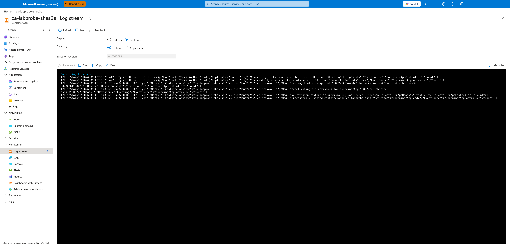

[Observed] The `No revision restart or provisioning was needed.` event surfaced by the Container Apps controller confirms directly from the platform that the ingress edit did not mint a new revision and did not require a revision restart or new provisioning. Combined with capture 08 — which shows both the **same revision name** as the failure state and an **identical `Created` timestamp** (`6/3/2026 8:17:46 AM`) — this anchors the **same-revision recovery** claim in three independent platform signals: name, creation timestamp, and controller event. The claim is therefore not a naming-convention inference; it is a triangulated observation. (Note: the underlying replica was rotated — capture 05's replica hash `--74b99f7bd5-hlfrm` is distinct from capture 10's `--c6d7d6f44-bpkn6` — so this evidence proves same-revision recovery, not same-replica continuity.)

### Observed Evidence (Live Azure Test — 2026-06-23)

A second end-to-end live Azure run executed on **2026-06-23** with `az` CLI version **2.79.0** (see `labs/probe-and-port-mismatch/evidence/19-cli-versions.json`) against resource group `rg-aca-lab-port` (subscription redacted to placeholder `00000000-0000-0000-0000-000000000000`). The run produced 25 raw evidence files under `labs/probe-and-port-mismatch/evidence/` covering H1 (failure-state reproduction) and H2 (same-revision recovery). All 11 sub-gates across both hypotheses passed.

**H1 reproduction** — `evidence/11-h1-gate.json`:

| Sub-gate | Value | Source |
|---|---|---|
| `a_acr_build_succeeded` | true | `evidence/03-acr-build.log` exit code 0 |
| `b_trigger_revision_minted` | true | `evidence/05-containerapp-update-image.json` returned `latestRevisionName=ca-labport-zopng3--0000001` |
| `c_probe_failure_evidence_present` | true | `evidence/08-revision-show-failed.json` reports `runningState=Degraded`, `healthState=Unhealthy`, and `runningStateDetails="Deployment Progress Deadline Exceeded. 0/1 replicas ready. The TargetPort 8000 does not match the listening port 3000."` |
| `d_zero_client_200s_out_of_five` | true | `evidence/09-curl-probes-failed.json` reports 0/5 HTTP 200 across 5 attempts (all returned `000` — TCP connection not established) |
| `e_target_port_still_mismatched` | true | Pre-fix ingress `targetPort=8000`, workload image `ca-labport-zopng3:v1` (binds to `:3000`) |

Gate classification: `port_mismatch_probe_failure_reproduced`.

**H2 same-revision recovery** — `evidence/22-h2-gate.json`:

| Sub-gate | Value | Source |
|---|---|---|
| `a_failure_state_persisted_into_verify` | true | Pre-fix `runningState=Degraded` + `runningStateDetails` contains port mismatch evidence + 0/5 curl + `createdTime` matches H1 capture |
| `b_ingress_update_succeeded` | true | `evidence/22-h2-gate.json` `fix_window.cli_exit_code=0`; `evidence/14-ingress-update-fix.json` returns the updated ingress object showing `targetPort=3000` |
| `c_revision_became_healthy` | true | `evidence/16-revision-post-fix.json` `runningState=Running`, `healthState=Healthy` |
| `d_client_probes_succeed` | true | `evidence/17-curl-probes-post-fix.json` 5/5 HTTP 200 |
| `e_same_revision_preserved` | true | Triangulated via `same_revision_proof` in `evidence/22-h2-gate.json`: `name_unchanged=true` (computed from `evidence/12-revision-pre-fix.json.name` vs `evidence/16-revision-post-fix.json.name`, both `ca-labport-zopng3--0000001`), `created_time_unchanged=true` (`2026-06-23T14:06:19+00:00` in both), `image_unchanged=true` (`acrlabportzopng3.azurecr.io/ca-labport-zopng3:v1` in both) |
| `f_target_port_now_matches` | true | Post-fix ingress `targetPort=3000` |

Gate classification: `port_mismatch_recovered_on_same_revision`. The fix command was `az containerapp ingress update --target-port 3000` — an app-scope-only edit that does not mint a new revision.

#### Honest disclosure of platform behavior difference

The 2026-06-03 historical run captured `runningState=Failed` for the trigger revision. The 2026-06-23 run captured `runningState=Degraded` with a `runningStateDetails` text of `"Deployment Progress Deadline Exceeded. 0/1 replicas ready. The TargetPort 8000 does not match the listening port 3000."` — the platform did not transition the revision to a terminal `Failed` state within the lab's polling window (5 minutes). Both observations are evidence of probe failure caused by the port mismatch, but the surface state name differs. The 2026-06-23 H1 and H2 gates require port-specific corroboration on either of two acceptance paths: **strong** — `runningStateDetails` contains explicit port/probe text (`'TargetPort'`/`'listening port'`/`'ProbeFailed'`); **fallback** — non-healthy state (`Failed` or `Degraded`) paired with a non-zero `ProbeFailed` count from `evidence/10-system-log-tail.log` (captured into `evidence/11-h1-gate.json` as `system_log_capture.probe_failed_lines_in_tail`). A bare `Failed`/`Degraded` label with no port-specific corroboration is explicitly insufficient — it could otherwise be caused by image pull failure, OOMKilled, or other non-port failure modes. The 2026-06-23 evidence satisfies **both** the strong path (the runningStateDetails text quotes the port mismatch verbatim) and the fallback path (`system_log_capture.probe_failed_lines_in_tail=50`), so the OR-logic does not weaken falsification rigor — it strengthens it by requiring at least one port-specific signal regardless of the surface state label. This disclosure documents the platform behavior variance so future runs are not surprised; the underlying causal claim is unchanged.

#### Evidence provenance note

Most artifacts (`07-*` through `24-*`) come from a single coherent 2026-06-23 22:23–22:40 UTC run after the trigger script's Phase 5 provisioning poll was strengthened to 30 attempts × 10 s. The file `evidence/06-wait-provisioning.log` is a single-line snapshot from an earlier 2026-06-23 14:06 UTC run (pre-strengthening) and is **explicitly non-gating** — no H1 or H2 sub-gate evaluates it. See [`labs/probe-and-port-mismatch/evidence/README.md`](https://github.com/yeongseon/azure-container-apps-practical-guide/blob/main/labs/probe-and-port-mismatch/evidence/README.md) for the full provenance map.

#### Operator caveat

The H1 sub-gate `e_target_port_still_mismatched` checks that the trigger-state ingress `targetPort` is still `8000` AND the workload image tag is `:v1`. If a future maintainer changes the workload image tag in `trigger.sh` (`IMAGE_TAG=v1`), this sub-gate's string match must be updated in lockstep. The same maintenance rule applies to the H2 sub-gate `f_target_port_now_matches`, which hard-codes `'3000'` as the target value.

## Clean Up

```bash
az group delete --name "$RG" --yes --no-wait
```

| Command | Why it is used |
|---|---|
| `az group delete ...` | Removes the lab resource group and its contained resources. |

## Related Playbook

- [Probe Failure and Slow Start](../playbooks/startup-and-provisioning/probe-failure-and-slow-start.md)

## See Also

- [Ingress Not Reachable Playbook](../playbooks/ingress-and-networking/ingress-not-reachable.md)
- [Ingress Target Port Mismatch Lab](./ingress-target-port-mismatch.md)

## Sources

- [Health probes in Azure Container Apps](https://learn.microsoft.com/en-us/azure/container-apps/health-probes)
- [Configure ingress in Azure Container Apps](https://learn.microsoft.com/en-us/azure/container-apps/ingress-how-to)
