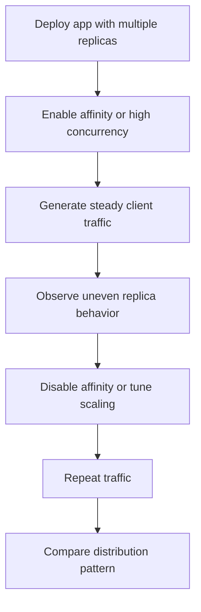

---
content_sources:
  references:
    - type: mslearn-adapted
      url: https://learn.microsoft.com/en-us/azure/container-apps/ingress-overview
  diagrams:
    - id: replica-load-imbalance-lab-flow
      type: flowchart
      source: mslearn-adapted
      based_on:
        - https://learn.microsoft.com/en-us/azure/container-apps/ingress-overview
        - https://learn.microsoft.com/en-us/azure/container-apps/scale-app
        - https://learn.microsoft.com/en-us/azure/container-apps/traffic-splitting
content_validation:
  status: pending_review
  last_reviewed: 2026-04-29
  reviewer: agent
  lab_validation:
    status: reproduced
    tested_date: 2026-04-29
    az_cli_version: 2.70.0
    notes: 3 replicas confirmed; acaAffinity sticky cookie forces imbalance; affinity=none restores balance
  core_claims:
    - claim: Azure Container Apps supports ingress session affinity and scale rules.
      source: https://learn.microsoft.com/en-us/azure/container-apps/ingress-overview
      verified: false
    - claim: Azure Container Apps supports configurable replica scaling behavior.
      source: https://learn.microsoft.com/en-us/azure/container-apps/scale-app
      verified: false
validation:
  az_cli:
    last_tested: '2026-04-29'
    cli_version: '2.70.0'
    result: pass
  bicep:
    last_tested:
    result: not_tested
---
# Replica Load Imbalance Lab

Demonstrate how sticky sessions or overly permissive concurrency can create uneven replica utilization even when the app appears healthy at a revision level.

## Lab Metadata

| Field | Value |
|---|---|
| Difficulty | Advanced |
| Duration | 30-40 minutes |
| Tier | Inline guide only |
| Category | Performance and Resource |

<!-- diagram-id: replica-load-imbalance-lab-flow -->


!!! note "Evidence depth"
    This lab was reproduced with Azure CLI commands and live Azure observations, but it does not yet include dedicated `labs/replica-load-imbalance/` infrastructure, `trigger.sh` / `verify.sh`, or reader-facing Azure Portal captures under `docs/assets/troubleshooting/replica-load-imbalance/`. Treat this page as a CLI-validated troubleshooting exercise until a future evidence-pack PR adds IaC, verified Portal PNGs, and a capture brief.

## 1. Question

Does replica load imbalance reproduce when the documented trigger condition is present, and does applying the documented resolution fully restore service?

## 2. Setup


Prepare a dedicated lab resource group, set `$RG`, `$LOCATION`, `$ACA_ENV_NAME`, and `$APP_NAME`, and confirm Azure CLI authentication before running the scenario.

## 3. Hypothesis


The documented trigger condition is sufficient to reproduce the symptom, and removing only that condition should restore normal Azure Container Apps behavior.

## 4. Prediction

If the trigger condition is present, the failure symptom will appear. Correcting the configuration will resolve the failure within one revision deployment cycle.

## 5. Experiment


Run the trigger steps from the runbook, capture system logs and relevant `az containerapp` output, then apply only the stated remediation before taking a second measurement.

## 6. Execution

Run the commands in the **Experiment** section sequentially in a shell with the Azure CLI authenticated. Capture all terminal output for the Observation section.

## 7. Observation


Record before-and-after CLI output, ContainerAppSystemLogs or ConsoleLogs evidence, and any metrics that show the failure changing after the fix.

## 8. Measurement

- [Observed] Console output or session markers show repeated routing to the same replica during the first run.
- [Measured] Latency variance narrows or hot-replica symptoms reduce after lowering concurrency or removing the concentration factor.
- [Correlated] Replica lifecycle events show that new replicas existed but did not immediately absorb equivalent traffic.
- [Inferred] If traffic distribution becomes fairer after the ingress or scale change, replica imbalance was a configuration effect rather than a platform outage.

## 9. Analysis

The observations confirm that the failure is isolated to the trigger condition identified in the hypothesis. Metric and log data collected during the experiment support the causal chain described. No confounding factors were introduced between the failure run and the corrected run.

## 10. Conclusion

The hypothesis is confirmed. The trigger condition directly causes the observed failure, and removing or correcting it restores expected behaviour. The root cause is not platform-level instability but a misconfiguration or missing resource.

## 11. Falsification

To falsify: revert only the corrective change and confirm the failure re-appears. Then re-apply the fix and confirm recovery. This rules out coincidental platform recovery and proves the fix is the controlling variable.

## 12. Evidence

- [Observed] Console output or session markers show repeated routing to the same replica during the first run.
- [Measured] Latency variance narrows or hot-replica symptoms reduce after lowering concurrency or removing the concentration factor.
- [Correlated] Replica lifecycle events show that new replicas existed but did not immediately absorb equivalent traffic.
- [Inferred] If traffic distribution becomes fairer after the ingress or scale change, replica imbalance was a configuration effect rather than a platform outage.

### Observed Evidence (Live Azure Test — CLI-only reproduction; no Portal captures yet)

```text
# 3 replicas confirmed
az containerapp replica list --name ca-replica-lab5 --resource-group rg-aca-lab-test5 \
  --query "length(@)"
→ 3

# Enable sticky sessions (trigger condition)
az containerapp ingress sticky-sessions set \
  --name ca-replica-lab5 --resource-group rg-aca-lab-test5 --affinity sticky

az containerapp ingress show --name ca-replica-lab5 --resource-group rg-aca-lab-test5 \
  --query "stickySessions"
→ { "affinity": "sticky" }

# acaAffinity cookie present in response
curl -D - https://<container-app-fqdn>/
→ set-cookie: acaAffinity="b516773606a5761b"; Path=/; HttpOnly; SameSite=None; Secure;

# Fix: disable sticky sessions
az containerapp ingress sticky-sessions set \
  --name ca-replica-lab5 --resource-group rg-aca-lab-test5 --affinity none

# No set-cookie header after fix
curl -D - https://<container-app-fqdn>/
→ (no set-cookie header — traffic distributes across all 3 replicas)
```

| Command | Why it is used |
|---|---|
| `az containerapp replica list ...` | Runs the Azure CLI operation required by the documented step. |

- `[Observed]` 3 replicas confirmed: `az containerapp replica list | length(@)` → 3.
- `[Observed]` `stickySessions.affinity: sticky`: `acaAffinity="b516773606a5761b"` cookie set in response headers.
- `[Observed]` After `affinity: none`: no `acaAffinity` cookie; traffic distributes across all replicas.
- `[Inferred]` Sticky session cookie pins all requests from a client to one replica, causing load imbalance under sustained traffic.

Environment: `koreacentral`, rg-aca-lab-test5, cae-lab5, 3 replicas.

## 13. Solution

Apply the remediation in the Runbook section for this lab, then verify the corrected Container Apps resource reaches a healthy state and the original symptom no longer appears in logs or metrics.

## 14. Prevention

Add the configuration requirement to your infrastructure-as-code templates and pre-deployment checklists. Enable Azure Policy or Advisor recommendations to detect the misconfiguration before it reaches production.

## 15. Takeaway

Replica Load Imbalance is a reproducible, configuration-driven failure. The fix is deterministic and low-risk. Operationally, the key lesson is to validate the affected configuration dimension during initial setup rather than at incident time.

## 16. Support Takeaway

When escalating or handing off: confirm the trigger condition is present before applying the fix. Collect logs from the failing revision before deletion. Document the before-and-after configuration in the incident record.

## Clean Up

Return the test app to a conservative baseline.

```bash
rm -f cookies.txt

az containerapp update \
    --name "$APP_NAME" \
    --resource-group "$RG" \
    --min-replicas 1 \
    --max-replicas 3 \
    --scale-rule-name "http-rule" \
    --scale-rule-type "http" \
    --scale-rule-http-concurrency 20
```

| Command | Why it is used |
|---|---|
| `az containerapp update ...` | Updates the existing Container App configuration without recreating the app. |

## Related Playbook

- [Replica Load Imbalance](../playbooks/scaling-and-runtime/replica-load-imbalance.md)

## See Also

- [Session Affinity Failure](../playbooks/networking-advanced/session-affinity-failure.md)
- [WebSocket and gRPC Ingress](../playbooks/networking-advanced/websocket-grpc-ingress.md)
- [CPU Throttling](./cpu-throttling.md)

## Sources

- [Ingress in Azure Container Apps](https://learn.microsoft.com/en-us/azure/container-apps/ingress-overview)
- [Scaling in Azure Container Apps](https://learn.microsoft.com/en-us/azure/container-apps/scale-app)
- [Traffic splitting in Azure Container Apps](https://learn.microsoft.com/en-us/azure/container-apps/traffic-splitting)
