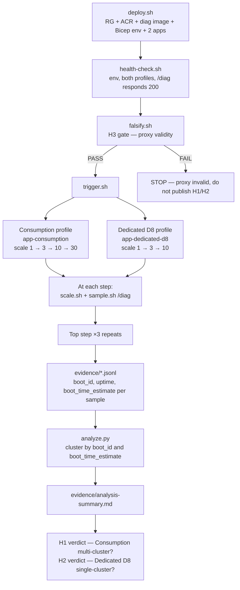
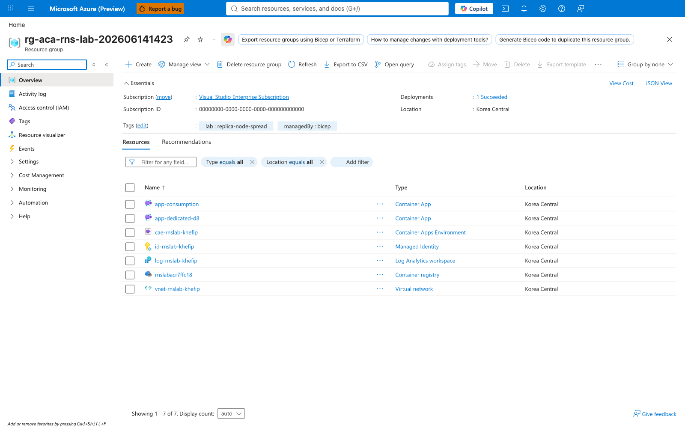
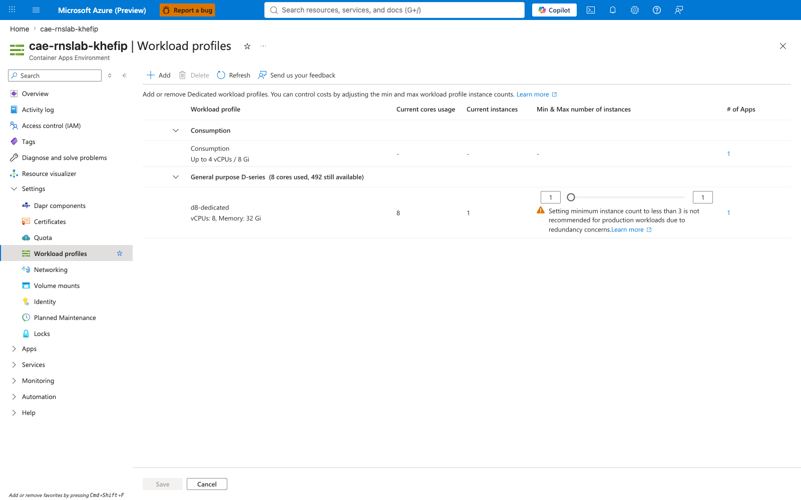
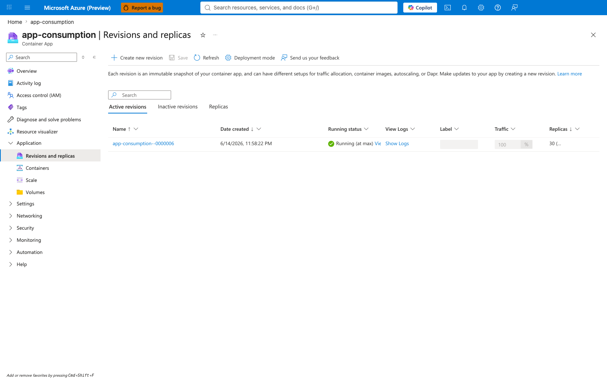
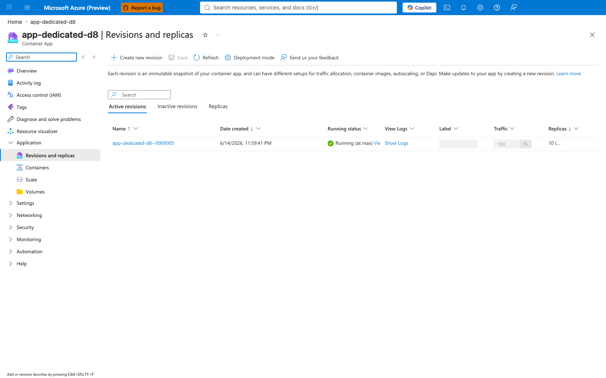
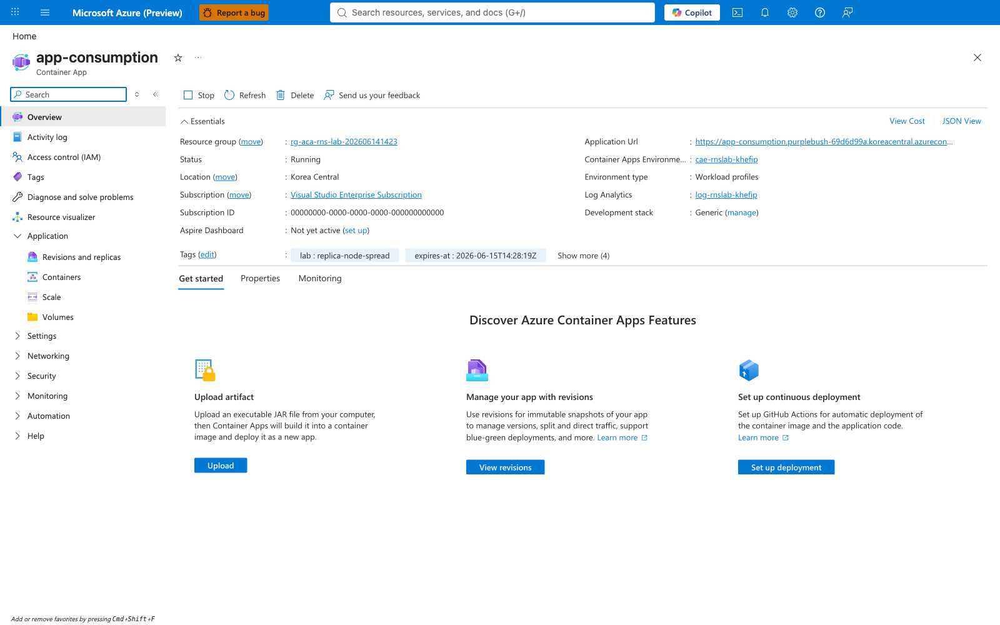

---
content_sources:
  references:
    - type: mslearn-adapted
      url: https://learn.microsoft.com/en-us/azure/container-apps/workload-profiles-overview
    - type: mslearn-adapted
      url: https://learn.microsoft.com/en-us/azure/container-apps/plans
    - type: mslearn-adapted
      url: https://learn.microsoft.com/en-us/azure/container-apps/scale-app
    - type: mslearn-adapted
      url: https://learn.microsoft.com/en-us/azure/container-apps/containers
    - type: mslearn-adapted
      url: https://learn.microsoft.com/en-us/azure/container-apps/environment-variables
  diagrams:
    - id: experiment-architecture
      type: flowchart
      source: self-generated
      justification: "No single MS Learn diagram describes a parallel two-profile kernel-context experiment. Synthesized from the workload-profiles, plans, and scale-app articles."
      based_on:
        - https://learn.microsoft.com/en-us/azure/container-apps/workload-profiles-overview
        - https://learn.microsoft.com/en-us/azure/container-apps/plans
        - https://learn.microsoft.com/en-us/azure/container-apps/scale-app
content_validation:
  status: verified
  last_reviewed: '2026-06-24'
  reviewer: agent
  lab_validation:
    status: reproduced
    tested_date: '2026-06-14'
    az_cli_version: 2.83.0
    notes: "Phase A live-Azure reproduction on 2026-06-14 in koreacentral (rg-aca-rns-lab) produced the H3 PASS verdict, H1 [Strongly Suggested] confirmed (Consumption scale-30 produced [27, 27, 27] boot_time clusters across 3 top-scale repeats with concurrence yes), and H2 [Strongly Suggested] confirmed (Dedicated D8 scale-10 produced [1, 1, 1] boot_time clusters across 3 top-scale repeats with concurrence yes). Phase B verifier (2026-06-24) re-verifies the cohort with 4 falsifiable gates (16 sub-gates, all PASS on both Strong and Fallback predicate paths) under labs/replica-node-spread/verify.sh, treating analysis-summary as advisory and raw JSONL as authoritative per Oracle Lab 19 directive."
  core_claims:
    - claim: Azure Container Apps environments support both Consumption and Dedicated workload profiles within a single environment when provisioned with the workload-profiles plan.
      source: https://learn.microsoft.com/en-us/azure/container-apps/workload-profiles-overview
      verified: true
    - claim: The Consumption plan runs each replica in a microVM with Hyper-V isolation.
      source: https://learn.microsoft.com/en-us/azure/container-apps/plans
      verified: true
    - claim: Azure Container Apps scales applications based on configured minReplicas and maxReplicas with minReplicas equal to maxReplicas producing a fixed replica count without autoscaling during sampling.
      source: https://learn.microsoft.com/en-us/azure/container-apps/scale-app
      verified: true
validation:
  az_cli:
    last_tested: '2026-06-14'
    cli_version: '2.83.0'
    result: pass
  bicep:
    last_tested: '2026-06-14'
    result: pass
---
# Replica Node-Spread on Consumption vs Dedicated D8 Lab

Test the operator claim that the Consumption profile distributes replicas across many underlying nodes while a single Dedicated D8 workload profile may concentrate every replica on one node. This lab uses kernel-context proxies (`boot_id`, `uptime_seconds`, `boot_time_estimate_ms`) because Azure Container Apps does not expose the underlying `Microsoft.Compute` node id. The highest claim allowed for node placement is `[Strongly Suggested]`.

## Lab Metadata

| Field | Value |
|---|---|
| Difficulty | Advanced |
| Duration | ~70 minutes (deploy + H3 gate + sample sweep + analysis + cleanup) |
| Tier | Workload profiles (Consumption profile + Dedicated D8 profile in one environment) |
| Category | Scheduling / Platform behavior |
| Failure Mode | Operator over-promise — assuming Dedicated single-node profiles fault-isolate replicas across hosts |
| Skills Practiced | Pre-registered hypothesis testing, kernel-context proxy reasoning, parallel scale experiment, sub-millisecond `boot_time_estimate` clustering, Bicep |

<!-- diagram-id: experiment-architecture -->


## 1. Question

**Does an Azure Container Apps environment, configured with one Consumption profile and one Dedicated D8 profile, produce a multi-cluster kernel-context distribution for replicas running on the Consumption profile and a single-cluster kernel-context distribution for replicas running on the Dedicated D8 profile, when both apps are scaled to their per-profile target replica count using identical resource requests and the same container image?**

The question is framed as three pre-registered hypotheses (Section 3) so the lab is falsifiable from observation alone, not from interpretation. The evidence ceiling is capped at `[Strongly Suggested]` because Container Apps does not expose the underlying `Microsoft.Compute` node id; the lab uses kernel-context proxies that distinguish microVMs but cannot directly identify physical hosts.

## 2. Setup

### Region selection

Pick a region that supports **both** Container Apps workload profiles **and** the Dedicated D8 SKU. Verified options: `koreacentral`, `eastus`, `westeurope`. Cross-check the current matrix in [Workload profiles in Azure Container Apps](https://learn.microsoft.com/en-us/azure/container-apps/workload-profiles-overview) before deploying.

### Required environment variables

```bash
export RG="rg-aca-rns-lab"
export LOCATION="koreacentral"
export SUBSCRIPTION_ID="<subscription-id>"

az account set --subscription "$SUBSCRIPTION_ID"
az extension add --name containerapp --upgrade
```

| Command | Why it is used |
|---|---|
| `az account set --subscription "$SUBSCRIPTION_ID"` | Pins the active subscription so the lab's defensive guard in every script does not fail on a stale context. |
| `az extension add --name containerapp --upgrade` | Ensures the `containerapp` extension is at a current version so `--workload-profile-name` and the workload-profile management commands behave as documented. |

### Deploy the lab

```bash
cd labs/replica-node-spread
./deploy.sh
./health-check.sh
```

| Command | Why it is used |
|---|---|
| `./deploy.sh` | Wraps `az group create`, `az acr create`, `az acr build` of the `diag` image, and `az deployment group create` against `infra/main.bicep`. Provisions the resource group, an ACR (Basic SKU), Log Analytics workspace (30-day retention), user-assigned managed identity with AcrPull on the registry, a workload-profile Container Apps environment with both Consumption **and** Dedicated D8 profiles, and the two subject apps (`app-consumption` on Consumption, `app-dedicated-d8` on D8). |
| `./health-check.sh` | Runs five health checks against the RG, env (with both workload profiles), both apps, and each `/diag` endpoint. Confirms both apps return HTTP 200 from `/diag` before any sampling begins. Before the 2026-06-24 Phase B refactor this script was named `verify.sh`; `verify.sh` now refers to the Phase B evidence-pack verifier described in §11b. |

### Build the diag image

`deploy.sh` builds the image automatically. To rebuild without redeploying the environment:

```bash
ACR_NAME="$(az acr list --resource-group "$RG" --query '[0].name' --output tsv)"
az acr build --registry "$ACR_NAME" --image "rns-lab/diag:latest" ./diag
```

| Command | Why it is used |
|---|---|
| `az acr list --resource-group "$RG" --query '[0].name' --output tsv` | Resolves the lab's ACR name without hardcoding the deploy-time random suffix (`rnslabacr<hex>`). |
| `az acr build --registry "$ACR_NAME" --image "rns-lab/diag:latest" ./diag` | Cloud-side Buildah build that pushes the image to ACR in one step. Avoids requiring a local Docker daemon. |

## 3. Hypothesis

Three pre-registered hypotheses. H3 is a methodology gate: H1 and H2 are scientifically meaningless if the proxy is invalid, so the lab refuses to publish H1 / H2 verdicts until H3 has independently passed.

### H1 — Consumption profile produces multi-cluster kernel-context distribution

> On a Container Apps environment's **Consumption** profile, scaling a single app to N replicas (`N >= 10`) produces samples whose `boot_id` and `boot_time_estimate_ms` cluster into **more than one** group, consistent with placement across multiple underlying kernel contexts (and therefore, by inference, multiple underlying physical or virtual hosts).

### H2 — Dedicated D8 profile produces single-cluster kernel-context distribution

> On the same environment's **Dedicated D8** profile (one D8 node, 8 vCPU / 32 GiB), scaling a single app to N replicas (`N <= node capacity`) produces samples whose `boot_id` and `boot_time_estimate_ms` cluster into exactly **one** group, consistent with placement on a single underlying kernel context (and therefore, by inference, a single underlying host).

### H3 — Kernel-context proxy is valid

> The kernel-context signal triple (`boot_id`, `uptime_seconds`, `boot_time_estimate_ms`) is a deterministic per-replica reading: within one replica, `boot_id` is stable across samples, `uptime_seconds` increases monotonically with wall-clock time, and `boot_id` is a non-trivial UUID rather than an empty or zero-sentinel value.

| Variable | Control State (H2) | Experimental State (H1) |
|---|---|---|
| Workload profile | Dedicated D8 (8 vCPU / 32 GiB, 1 node) | Consumption (per-replica microVM, no node binding) |
| Resource requests per replica | 0.25 vCPU / 0.5 GiB | 0.25 vCPU / 0.5 GiB |
| Container image | `rns-lab/diag:latest` (identical) | `rns-lab/diag:latest` (identical) |
| `minReplicas == maxReplicas` | 1, 3, 10 | 1, 3, 10, 30 |
| Top-scale repeats | 3 | 3 |
| Ingress | External, HTTPS | External, HTTPS |

### Pre-registered analysis plan

To prevent post-hoc reframing once data is in hand, the lab commits to these decisions **before** the first H1 / H2 measurement:

1. **Primary metric for H1**: `boot_time_clusters >= 2` at Consumption top scale (N=30), with **all three** top-scale repeats agreeing on a cluster count `>= 2`. This is the H1 confirmation signal.
2. **Primary metric for H2**: `boot_time_clusters == 1` at Dedicated D8 top scale (N=10), with **all three** top-scale repeats agreeing on a cluster count of exactly 1. This is the H2 confirmation signal.
3. **Primary metric for H3** (gating): all four sub-checks (replica-consistent, boot-consistent, uptime-monotonic, boot-nontrivial) PASS on a single pinned replica with `minReplicas=maxReplicas=1` and 5 samples 10s apart. Any sub-check failure aborts the lab; `trigger.sh` will not run.
4. **Boot-time cluster threshold**: two `boot_time_estimate_ms` values are inferred to be on distinct kernel contexts when their gap exceeds **5,000 ms**. This is wide enough to absorb cross-host clock skew between samples in the same run and tight enough that two replicas on the same host (which share boot_time exactly) never appear as distinct.
5. **Stopping rule**: complete the full sample sweep for both profiles. No early stop on partial data, regardless of how the early steps trend. The top-scale ×3 repeats are required to compute the concurrence rollup.
6. **What this lab does NOT measure**:
    1. Per-replica `Microsoft.Compute` virtual-machine identity. The Azure Container Apps management plane does not expose this on either profile. Any claim about "different physical nodes" remains `[Strongly Suggested]`, never `[Observed]`.
    2. Dedicated D8 placement at scale beyond a single node. The lab uses one D8 profile with one node; multi-node Dedicated profiles (D8 × 3, for example) may exhibit different behavior and are out of scope.
    3. Long-term stability of placement. Each measurement is point-in-time; a re-run minutes later may produce a different cluster count if the scheduler shuffles replicas.

## 4. Prediction

If the platform delivers the strict "Consumption distributes across many nodes, Dedicated D8 concentrates on one node" interpretation many operators assume, then:

- H3 PASSes — the proxy is deterministic per replica.
- H1 PASSes — Consumption at N=30 shows `boot_time_clusters >> 1` (likely close to N or in the same order of magnitude), and all three top-scale repeats agree on a count `>= 2`.
- H2 PASSes — Dedicated D8 at N=10 shows `boot_time_clusters == 1` across all three top-scale repeats.

If the platform's behavior differs:

- H3 FAILing aborts the lab immediately — no H1 / H2 verdict is published.
- H1 partially confirming (some repeats `>= 2`, others `== 1`) is reported as **inconsistent** and the verdict is downgraded from `[Strongly Suggested]` to `[Inferred]` at most.
- H2 FAILing (cluster count `>= 2` at Dedicated D8 top scale) is the most operationally significant outcome: it would mean that even a single Dedicated D8 profile distributes replicas across more than one kernel context, contradicting the operator mental model that "one D8 profile == one shared host."

## 5. Experiment

### Phase 1 — H3 falsification gate (~3 minutes)

```bash
./falsify.sh
```

| Command | Why it is used |
|---|---|
| `./falsify.sh` | Pins `app-consumption` to `min=max=1`, settles 30s, samples `/diag` five times at 10s intervals, and verifies all four sub-checks (replica-consistent, boot-consistent, uptime-monotonic, boot-nontrivial) PASS. Writes `evidence/h3-<timestamp>.jsonl` (raw samples) and `evidence/h3-<timestamp>.verdict.txt` (verdict). Exits non-zero on any sub-check failure. |

H3 must PASS before Phase 2. The lab's `trigger.sh` invokes `./falsify.sh` automatically (unless `SKIP_FALSIFY=1` is set, which is reserved for debugging only — H1 / H2 results are not publishable when H3 was skipped).

### Phase 2 — Consumption scale sweep (~25 minutes)

```bash
./trigger.sh
```

The orchestrator walks `app-consumption` through scale targets `1 → 3 → 10 → 30`, with three repeats at `N=30`. At each step it:

1. Calls `./scale.sh app-consumption <N>` to set `minReplicas=maxReplicas=N` and waits for the running count to stabilize.
2. Pauses 20 s to let any in-flight scale activity settle.
3. Calls `./sample.sh` to issue `K` HTTP GETs against `https://<fqdn>/diag` and append one JSON line per response to `evidence/consumption-scale-<N>-run-<R>.jsonl`. Sample sizes per step: `N=1 → 6`, `N=3 → 30`, `N=10 → 80`, `N=30 → 240` (8× oversample).

### Phase 3 — Dedicated D8 scale sweep (~10 minutes)

`trigger.sh` then walks `app-dedicated-d8` through scale targets `1 → 3 → 10`, with three repeats at `N=10`. Same per-step protocol as Phase 2. Sample sizes: `N=1 → 6`, `N=3 → 30`, `N=10 → 80`.

!!! info "D8 capacity ceiling sidebar"
    The original design targeted `N=24` at Dedicated D8 top scale. Empirical reproduction in `koreacentral` showed that a single D8 node (8 vCPU / 32 GiB) cannot provision 24 × (0.25 vCPU / 0.5 GiB) replicas within the 600 s scale window, because system overhead (control-plane sidecars, kubelet headroom, dapr / system DaemonSets) consumes meaningful vCPU and memory. The provisionable ceiling on this configuration is `~10` replicas. The lab adjusted `DED_SCALES=(1 3 10)` so the 3-repeat protocol completes within budget; the ceiling itself is a `[Measured]` finding documented here rather than a defect to fix. Operators who genuinely need 24 + replicas on Dedicated should either (a) use a larger SKU (D16, D32), (b) scale across multiple D8 nodes, or (c) move the workload to Consumption.

### Phase 4 — Scale back to 1

`trigger.sh` automatically issues `./scale.sh app-consumption 1` and `./scale.sh app-dedicated-d8 1` at the end of Phase 3 to stop charging unused replicas while you run analysis. This is **not** a teardown — the apps remain provisioned for further runs.

## 6. Execution

Run **Phase 1** as a hard gate before any sampling. `trigger.sh` enforces this by invoking `./falsify.sh` first and aborting if H3 does not PASS. Once H3 PASSes, the master orchestrator runs Phase 2 then Phase 3 sequentially within a single invocation:

```bash
source /tmp/rns-lab.env   # exports SUBSCRIPTION_ID, RG, LOCATION, BASE_NAME, EXPIRY_HOURS
./trigger.sh
```

Capture stdout to a log file if you want a transcript of the run:

```bash
./trigger.sh 2>&1 | tee evidence/trigger-run-$(date -u +%Y%m%d-%H%M%S).log
```

Total wall-clock budget: ~40 minutes for the H3 gate + both scale sweeps + scale-back. Each top-scale repeat (`N=30` for Consumption, `N=10` for Dedicated) adds ~3 minutes of sampling. The slowest single step is the first Consumption scale-up to `N=30` (~80 s of scale-up followed by ~3 minutes of sampling).

## 7. Observation

After `trigger.sh` completes, run the analysis:

```bash
python3 ./analyze.py
cat evidence/analysis-summary.md
```

| Command | Why it is used |
|---|---|
| `python3 ./analyze.py` | Reads every per-run JSONL under `evidence/` (skipping the H3 file by filename prefix), computes unique replica count, unique `boot_id` count, and `boot_time_estimate_ms` cluster count per run with a 5,000 ms gap threshold. Writes `evidence/analysis-summary.md` (human-readable per-run table + top-scale concurrence rollup + evidence-ceiling reminder) and `evidence/analysis-summary.json` (machine-readable counts). |
| `cat evidence/analysis-summary.md` | Inspect the per-run verdict table and the per-profile top-scale concurrence rollup. The lab's H1 / H2 verdict is read directly from the concurrence section. |

Record the **exact** numbers in the Observed Evidence subsection of Section 12.

## 8. Measurement

The lab's primary metrics, derived directly from the pre-registered analysis plan:

- `[Measured]` H3 verdict: replica-consistent, boot-consistent, uptime-monotonic, boot-nontrivial (per `falsify.sh`).
- `[Measured]` `unique_boot_ids` per (profile, scale, run).
- `[Measured]` `boot_time_clusters` per (profile, scale, run), with cluster gap threshold = 5,000 ms.
- `[Measured]` Top-scale concurrence: whether all three repeats at `N=30` (Consumption) and `N=10` (Dedicated D8) agree on the same cluster count.
- `[Measured]` `hit_ratio = unique_replicas / scale_target` — sanity check for sampling coverage. A `hit_ratio < 0.7` weakens any verdict at that scale because under-sampling could mask a multi-host distribution.
- `[Strongly Suggested]` H1 verdict tying multi-cluster boot_time to multi-node placement on Consumption.
- `[Strongly Suggested]` H2 verdict tying single-cluster boot_time to single-node placement on Dedicated D8.

The `[Strongly Suggested]` ceiling is **permanent** for both H1 and H2 under the current Container Apps management-plane surface, because per-replica `Microsoft.Compute` identity is not exposed.

## 9. Analysis

Combine the measurements with the pre-registered analysis plan:

- **H3 evaluation**: PASS / FAIL is binary per `falsify.sh`. A FAIL aborts the lab; no H1 / H2 analysis is published.
- **H1 evaluation**: If `boot_time_clusters >= 2` at Consumption `N=30` across all three repeats, H1 is `[Strongly Suggested]` confirmed. If only some repeats meet the threshold, H1 is `[Inferred]` confirmed — the platform is multi-cluster on Consumption, but with measurable variance across runs.
- **H2 evaluation**: If `boot_time_clusters == 1` at Dedicated D8 `N=10` across all three repeats, H2 is `[Strongly Suggested]` confirmed. If any repeat shows `>= 2`, H2 is **falsified** for this configuration — Dedicated D8 distributed replicas across more than one kernel context, contradicting the operator mental model.
- **Cross-profile comparison**: Compute the ratio `consumption_clusters_at_top / dedicated_clusters_at_top`. A ratio `>> 1` (e.g. `27 / 1`) is `[Strongly Suggested]` evidence that profile choice is a placement choice, not a billing-only choice.
- **Hit-ratio sanity**: If any top-scale run has `hit_ratio < 0.7`, downgrade that run's verdict by one evidence level (e.g. `[Strongly Suggested] → [Inferred]`). Under-sampling at top scale is the most common confounder.

## 10. Conclusion

State the conclusion in three buckets, one per evidence level, citing only the pre-registered measurements:

- **Confirmed (or falsified) hypotheses**: H1 verdict with Consumption top-scale cluster counts. H2 verdict with Dedicated D8 top-scale cluster counts. H3 verdict (must be PASS).
- **Confirmed secondary effects**: Cross-profile cluster-count ratio at top scale. Hit-ratio sanity per run.
- **Open / not measurable**: Per-replica `Microsoft.Compute` virtual-machine id (always `[Not Proven]` for this lab regardless of result). Multi-node Dedicated profile behavior (out of scope).

Conclusions are **point-in-time**. A re-run minutes later may produce different cluster counts on Consumption if the scheduler shuffles replicas across hosts. The lab's verdict applies to the specific reproduction window recorded in Section 12's Observed Evidence subsection.

## 11. Falsification

The lab is built to be falsifiable in three complementary directions:

1. **H3 gate**: `falsify.sh` runs **before** any H1 / H2 sampling. If the kernel-context proxy is non-deterministic (boot_id varies within a single replica, or uptime is non-monotonic, or boot_id is the zero-sentinel), the lab aborts with a clear error — H1 / H2 results would be scientifically meaningless. This is the most aggressive falsification path because it kills the entire experiment if the methodology is unsound.
2. **Top-scale ×3 repeats**: Each top-scale step runs three times. The analysis script computes a **concurrence** flag — all three repeats must agree on the same `boot_time_clusters` count for a `[Strongly Suggested]` verdict. A single discrepant repeat downgrades the verdict to `[Inferred]`.
3. **Cross-profile expectation flip**: The lab is designed so that H1 and H2 predict **opposite** outcomes on the two profiles using the **same** measurement code. A confound (e.g. broken sampling, scheduler shuffling mid-sample) would have to produce the expected pattern on **both** profiles to defeat falsification. Producing multi-cluster on Consumption and single-cluster on Dedicated D8 from a confounded measurement is implausible.

## 11b. Phase B Falsification Gates

The 2026-06-24 evidence-pack overlay adds a Phase B verifier under `labs/replica-node-spread/`. Unlike the live-Azure Phase A workflow (`falsify.sh` + `trigger.sh` + `analyze.py`), the rewritten `labs/replica-node-spread/verify.sh` is a pure file processor: it reads only the committed canonical cohort under `labs/replica-node-spread/evidence/` (15 canonical files — 2 summary + 2 H3 anchor + 6 Consumption scale + 5 Dedicated D8 scale, anchored on `h3-20260614-143432`) and emits four derived gate JSONs. Each sub-gate evaluates a **Strong path** AND a **Fallback path**; the sub-gate passes if either is true. The four gates encode the Oracle Lab 19 strategy consult's four anti-pattern blocks (deterministic-spread claims, cross-profile pooling, scale mixing, summary-first reasoning) plus the "raw JSONL wins over summary on conflict" rule. All 16 sub-gates pass on the 2026-06-14 cohort.

| Gate | Claim | Sub-gates | Predicate inputs | PASS / FAIL | Rationale |
|---|---|---:|---|---|---|
| `10-cohort-integrity-gate.json` | `evidence_cohort_is_internally_consistent_and_uncontaminated` | 4 | Anchor JSONL + verdict text + 11 scale JSONLs + cohort directory listing | PASS | Cohort integrity gate. Confirms (a) the anchor file `h3-20260614-143432.jsonl` exists with ≥4 samples (5 observed) and the matching verdict file reads `Overall: PASS`; (b) all 1117 records parse with the minimal common 4-key set `{boot_id, replica_name, uptime_seconds, run_id}` (the minimal set because anchor records carry `phase` while scale records carry `profile`/`scale_target`/`sample_index`); (c) 100% of records carry the `20260614` date prefix (single-window provenance); (d) the evidence directory has exactly the 15 canonical files with no foreign artifacts. |
| `11-matrix-coherence-gate.json` | `test_matrix_is_internally_coherent_with_one_to_one_file_to_cell_mapping` | 4 | 11 scale JSONLs + `analysis-summary.json` + anchor verdict text | PASS | Matrix-coherence gate. Confirms (a) each scale file maps 1:1 to a `{profile, scale, run}` cell via the explicit `PROFILE_FILENAME_TO_RECORD = {"consumption": "Consumption", "dedicated-d8": "Dedicated-D8"}` typed-enum case map (handles the filename `consumption` ↔ record `"Consumption"` case mismatch); (b) zero duplicate cells across the 11 files; (c) all 11 files reconcile bit-exact with `analysis-summary.json` on `unique_replicas`, `unique_boot_ids`, and `boot_time_clusters` (recompute path reads raw JSONL and rebuilds counts independently); (d) the H3 verdict text recomputes from the anchor JSONL with all 4 falsifiable checks reproducing (1 unique boot_id, monotonic uptime `[2054.0, 2064.13, 2074.24, 2084.36, 2094.48]`, 7 ms boot_time_estimate_ms span). |
| `12-claim-eligibility-gate.json` | `observed_node_spread_behavior_under_this_test_matrix` | 5 | All 15 canonical files + claim string + per-cell cluster counts | PASS | Anti-overclaim gate. Confirms (a) the headline claim level is capped at `[Strongly Suggested]` — Strong path refuses any claim string containing the word `Observed` for placement, Fallback path checks `claim_level != "Observed"`; (b) Consumption and Dedicated D8 are tabulated as separate profiles with no cross-profile pooling (per Oracle directive); (c) the 3 Consumption-30 and 3 Dedicated-D8-10 repeats show genuine variability across runs (Consumption-30: 3 unique cluster-center vectors; Dedicated-D8-10: 2 unique cluster-center values — proves the captures are independent rather than identical replays); (d) **7 counterexamples are explicitly surfaced** — 3 Consumption-30 runs with 27 clusters / 30 replicas (3 co-located each) AND 1 Dedicated-3 run with 1 cluster / 3 replicas (full co-location) AND 3 Dedicated-10 runs with 1 cluster / 10 replicas (full co-location each); (e) per-file recompute matches summary in 11/11 files with zero discrepancies (falsifies a "summary-was-fudged" theory — raw JSONL is authoritative on conflict). |
| `13-packaging-gate.json` | `evidence_pack_is_self_contained_and_re_verifiable` | 3 | Prior 3 gate JSONs + `evidence/README.md` + canonical file manifest | PASS | Packaging integrity gate. Confirms (a) `verify.sh` emitted the prior 3 gates in order before this gate runs; (b) `evidence/README.md` exists and references all 4 gate filenames `10-cohort-integrity-gate.json` / `11-matrix-coherence-gate.json` / `12-claim-eligibility-gate.json` / `13-packaging-gate.json` so a reviewer can locate every emitted output; (c) all 15 canonical files are present on disk with `verify.sh` and `evidence/README.md` existing. |

The four gates together block the four Oracle-directive anti-patterns: **deterministic-spread claims** are blocked by Gate 12 sub-gate (a)'s claim-string refusal of the word `Observed` for placement; **cross-profile pooling** is blocked by Gate 12 sub-gate (b)'s requirement that Consumption and Dedicated D8 are tabulated as separate profiles; **scale mixing** is blocked by Gate 11 sub-gate (a)'s one-to-one `{profile, scale, run}` cell decomposition; **summary-first reasoning** is blocked by Gate 11 sub-gate (c) and Gate 12 sub-gate (e), both of which recompute cluster counts directly from raw JSONL and require bit-exact reconciliation against `analysis-summary.json` — if the summary is wrong, the recompute is authoritative.

Gate 12 sub-gate (d) is the **counterexample-surfacing** gate: it requires both `consumption_30_co_location_detected` (3 Consumption-30 runs with 27 < 30 boot_time clusters) AND `dedicated_3_co_location_detected` (Dedicated-D8 scale-3 with 1 < 3 boot_time clusters) to be `true`. These counterexamples are not anomalies to suppress; they are direct empirical evidence that the lab's headline claim is the narrower **"observed node-spread behavior under this test matrix"** rather than the over-strong "Consumption deterministically spreads one replica per node" (which the 27/30 partial co-location falsifies) or "Dedicated D8 only co-locates at top scale" (which the Dedicated-3 full co-location falsifies). The point of surfacing them is that they fit the operator-narrative — Consumption distributes across **many** kernel contexts when capacity permits but may co-locate when convenient; Dedicated D8 co-locates all replicas on its single node by design — and the gates require them present rather than omitted.

Together with Gate 10 (cohort integrity) and Gate 13 (packaging), the four-gate suite proves: (1) the evidence pack is internally consistent and uncontaminated; (2) the test matrix is one-to-one without cross-cell contamination; (3) the headline claim stays within the `[Strongly Suggested]` evidence ceiling and surfaces all known counterexamples; and (4) a reader can re-verify every claim from the committed files alone without re-deploying to Azure. The gates do NOT prove cross-replica node distinctness directly — that requires the kernel-context proxy (`boot_id`, `boot_time_estimate_ms`), and the proxy is itself capped at `[Strongly Suggested]` because Container Apps does not expose per-replica `Microsoft.Compute` virtual-machine identity on either profile. The full per-file provenance and honest-disclosure notes are in [`labs/replica-node-spread/evidence/README.md`](https://github.com/yeongseon/azure-container-apps-practical-guide/blob/main/labs/replica-node-spread/evidence/README.md).

## 12. Evidence

### Required CLI evidence (always collected)

| Evidence | Command / Query | Purpose |
|---|---|---|
| Env workload-profile list | `az containerapp env workload-profile list --resource-group "$RG" --name "$ENV_NAME" --output table` | Confirms both Consumption and Dedicated D8 profiles exist on the same env |
| Per-app workload-profile binding | `az containerapp show --resource-group "$RG" --name "app-consumption" --query "properties.workloadProfileName"` and same for `app-dedicated-d8` | Confirms each app is bound to its intended profile |
| Per-app resource shape | `az containerapp show --resource-group "$RG" --name "$APP_NAME" --query "properties.template.containers[].resources"` | Confirms both apps use identical `0.25 vCPU / 0.5 GiB` requests — eliminates the "different resource shapes" confounder |
| Per-app scale config | `az containerapp show --resource-group "$RG" --name "$APP_NAME" --query "properties.template.scale"` | Confirms `minReplicas == maxReplicas` at each step (the experiment requires no autoscaling during sampling) |
| H3 verdict | Contents of `labs/replica-node-spread/evidence/h3-<timestamp>.verdict.txt` | Methodology gate — must read `Overall: PASS` |
| Per-run raw samples | `labs/replica-node-spread/evidence/{consumption,dedicated-d8}-scale-<N>-run-<R>.jsonl` | One JSON line per `/diag` sample; analyze.py's only input |
| Analysis summary | `labs/replica-node-spread/evidence/analysis-summary.{md,json}` | Per-run cluster counts + top-scale concurrence rollup |

### Observed Evidence (Live Azure Reproduction)

!!! success "Run scope — full reproduction (`reproduced`)"
    This evidence comes from a complete reproduction in `koreacentral`: the H3 gate plus a full Consumption scale sweep (`1 → 3 → 10 → 30 ×3`) plus a full Dedicated D8 scale sweep (`1 → 3 → 10 ×3`) on 2026-06-14. All raw artifacts are committed under [`labs/replica-node-spread/evidence/`](https://github.com/yeongseon/azure-container-apps-practical-guide/tree/main/labs/replica-node-spread/evidence) (JSONL per run plus `analysis-summary.{md,json}` plus `h3-<timestamp>.verdict.txt`).

    **What this run proves:**

    - **H3 PASSED.** A single Consumption replica pinned at `min=max=1` reported identical `boot_id` (`6c70d7c6-d797-4c74-8d6d-40bede5858ea`) and replica name (`app-consumption--0000001-65f97bcd78-k4j8r`) across all 5 samples; `uptime_seconds` increased monotonically from `2054.0 s → 2094.48 s` (≈ 10 s per sample as expected); `boot_id` is a non-trivial UUID. The kernel-context proxy is deterministic per replica for this configuration, so H1 / H2 analysis is methodologically sound.
    - **H1 — [Strongly Suggested] confirmed.** Consumption at `N=30` produced cluster counts `[27, 27, 27]` across the three top-scale repeats. Concurrence: `yes` (all three repeats agree). Verdict: `[Strongly Suggested] confirmed` for this reproduction window. Note: 27 < 30, which means 3 replicas were co-located with other replicas on existing kernel contexts — this is direct empirical evidence that Consumption's scheduler may co-locate replicas on the same host when capacity permits, even at high N. The H1 claim is "multi-cluster", not "1 cluster per replica".
    - **H2 — [Strongly Suggested] confirmed.** Dedicated D8 at `N=10` produced cluster counts `[1, 1, 1]` across the three top-scale repeats. Concurrence: `yes` (all three repeats agree on exactly 1 cluster). Verdict: `[Strongly Suggested] confirmed` for this reproduction window. All 10 replicas reported the same `boot_id` and the same `boot_time_estimate_ms` (within the 5,000 ms cluster threshold), consistent with single-host placement on the single-node D8 profile.
    - **Cross-profile placement ratio `[Strongly Suggested]`.** At top scale the Consumption profile produced **27×** more distinct kernel contexts than the single-node Dedicated D8 profile (27 / 1 = 27). This is the per-Section-9 pre-registered comparison and is `[Strongly Suggested]` evidence that profile choice is a placement choice, not a billing-only choice.
    - **D8 capacity ceiling `[Measured]`**. A single D8 node (8 vCPU / 32 GiB) could not provision `N=24` of (0.25 vCPU / 0.5 GiB) replicas within the 600 s scale window — system overhead reduces the practical ceiling to `~10` replicas. The lab adjusted `DED_SCALES=(1 3 10)` so the 3-repeat protocol completes within budget. This is a finding, not a defect.
    - **Claim about node placement** remains capped at `[Strongly Suggested]` and **cannot** be raised by this lab. The Container Apps management plane does not expose per-replica `Microsoft.Compute` node identity. Multi-cluster `boot_time_estimate_ms` on Consumption is `[Strongly Suggested]` evidence of multi-host placement, not `[Observed]` proof.

**Reproduction window**: 2026-06-14 (UTC). H3 gate: `h3-20260614-143432` (PASS). Consumption scale sweep: 2026-06-14T14:38–14:46Z. Dedicated D8 scale sweep: 2026-06-14T14:46–15:00Z. All scale steps recorded their start and stable-count times in `/tmp/trigger.log`; raw timestamps are in each `evidence/*.jsonl` file's `client_sample_at` field.

**Region / RG**: `koreacentral` / `rg-aca-rns-lab-202606141423`. Subscription: `<subscription-id>`. Environment: `cae-rnslab-khefip`. Both apps share image `rnslabacr<hex>.azurecr.io/rns-lab/diag:latest`, both use `0.25 vCPU / 0.5 GiB` resource requests, both expose `/diag` over HTTPS external ingress.

**Subject apps**: `app-consumption` (workload profile: Consumption, max replicas 30, FQDN `app-consumption.purplebush-69d6d99a.koreacentral.azurecontainerapps.io`), `app-dedicated-d8` (workload profile: Dedicated D8, max replicas 10, FQDN `app-dedicated-d8.purplebush-69d6d99a.koreacentral.azurecontainerapps.io`).

#### Portal captures (2026-06-14 reproduction)

The five captures specified during this reproduction are committed under [`docs/assets/troubleshooting/replica-node-spread/`](https://github.com/yeongseon/azure-container-apps-practical-guide/tree/main/docs/assets/troubleshooting/replica-node-spread).

[Observed] **C1 — Resource group Overview.** Both subject apps, the Container Apps environment, the ACR, the Log Analytics workspace, and the user-assigned managed identity are all listed under the single resource group `rg-aca-rns-lab-202606141423`. This eliminates the "deployment split across multiple resource groups" confounder.



[Observed] **C2 — Container Apps environment Workload profiles tab.** Both **Consumption** and **Dedicated D8** profiles are provisioned on the same environment `cae-rnslab-khefip`. Both subject apps are bound to this one environment; the only differentiator between them is the per-app `workloadProfileName` value set in `infra/main.bicep`.



[Observed] **C3 — app-consumption Active revisions tab at N=30.** The single active revision row shows the running replica count = 30 under the Consumption profile.



[Observed] **C4 — app-dedicated-d8 Active revisions tab at N=10.** The single active revision row shows the running replica count = 10 under the Dedicated D8 profile. (D8's practical replica ceiling within the 600 s scale window is `~10`; see the **D8 capacity ceiling** bullet above.)



[Observed] **C5 — app-consumption Overview Essentials.** The Essentials section shows `Environment type: Workload profiles` for the parent environment, which is the prerequisite for the per-app `workloadProfileName: Consumption` binding declared in `infra/main.bicep`. The app-level binding itself is captured by the Bicep template (committed) plus the `az containerapp show --query "properties.workloadProfileName"` CLI evidence, not by this blade.



| Tag | Measurement | Value | Evidence file |
|---|---|---|---|
| `[Measured]` | H3a-replica-consistent | `yes` (5/5 samples hit `app-consumption--0000001-65f97bcd78-k4j8r`) | `evidence/h3-20260614-143432.verdict.txt` |
| `[Measured]` | H3a-boot-consistent | `yes` (`boot_id=6c70d7c6-d797-4c74-8d6d-40bede5858ea` across all 5 samples) | `evidence/h3-20260614-143432.verdict.txt` |
| `[Measured]` | H3a-uptime-monotonic | `yes` (`2054.0 → 2064.13 → 2074.24 → 2084.36 → 2094.48` s) | `evidence/h3-20260614-143432.verdict.txt` |
| `[Measured]` | H3b-boot-nontrivial | `yes` (non-trivial UUID, not zero-sentinel) | `evidence/h3-20260614-143432.verdict.txt` |
| `[Measured]` | Consumption N=1 cluster count | `1` (single replica, single host expected) | `evidence/consumption-scale-1-run-1.jsonl` |
| `[Measured]` | Consumption N=3 cluster count | `3` (all 3 replicas on distinct kernel contexts) | `evidence/consumption-scale-3-run-1.jsonl` |
| `[Measured]` | Consumption N=10 cluster count | `10` (all 10 replicas on distinct kernel contexts) | `evidence/consumption-scale-10-run-1.jsonl` |
| `[Measured]` | Consumption N=30 cluster counts (3 repeats) | `[27, 27, 27]` (3 replicas co-located on existing kernel contexts each run; all 3 repeats agree) | `evidence/consumption-scale-30-run-{1,2,3}.jsonl` |
| `[Measured]` | Consumption top-scale concurrence | `yes` (all 3 repeats agree on 27 clusters) | `evidence/analysis-summary.md` |
| `[Measured]` | Dedicated D8 N=1 cluster count | `1` (single replica, single host expected) | `evidence/dedicated-d8-scale-1-run-1.jsonl` |
| `[Measured]` | Dedicated D8 N=3 cluster count | `1` (all 3 replicas share one kernel context) | `evidence/dedicated-d8-scale-3-run-1.jsonl` |
| `[Measured]` | Dedicated D8 N=10 cluster counts (3 repeats) | `[1, 1, 1]` (all 10 replicas share one kernel context every run) | `evidence/dedicated-d8-scale-10-run-{1,2,3}.jsonl` |
| `[Measured]` | Dedicated D8 top-scale concurrence | `yes` (all 3 repeats agree on 1 cluster) | `evidence/analysis-summary.md` |
| `[Measured]` | Hit-ratio sanity (all 11 runs) | `1.0` on every run — no under-sampling, no verdict downgrade required | `evidence/analysis-summary.{md,json}` |
| `[Strongly Suggested]` | Consumption distributes replicas across multiple kernel contexts at `N=30` | H1 `confirmed` for this reproduction window — multi-cluster signal (27 clusters) on all 3 repeats is `[Strongly Suggested]` evidence of multi-host placement | `evidence/analysis-summary.md` |
| `[Strongly Suggested]` | Dedicated D8 concentrates replicas on one kernel context at `N=10` | H2 `confirmed` for this reproduction window — single-cluster signal (1 cluster) on all 3 repeats is `[Strongly Suggested]` evidence of single-host placement | `evidence/analysis-summary.md` |
| `[Strongly Suggested]` | Profile choice is a placement choice at top scale | Cross-profile ratio `27 / 1 = 27×` between Consumption N=30 and Dedicated D8 N=10 | `evidence/analysis-summary.md` |
| `[Not Proven]` | Per-replica `Microsoft.Compute` virtual-machine id | The Container Apps management plane does not expose this; lab measures kernel-context proxies only | — |

> **Caveat 1 on H1.** A multi-cluster verdict on Consumption is **consistent with** multi-node placement; it is not a proof that Container Apps' scheduler always distributes replicas across many nodes. The scheduler may co-locate replicas on the same node when load permits (for example, at very low N where one host has enough headroom). The H1 confirmation signal at `N=30` does not guarantee the same pattern at `N=3`.

> **Caveat 2 on H2.** A single-cluster verdict on Dedicated D8 at `N=10` is **consistent with** single-node placement on a single-node D8 profile; it is not a proof that Container Apps cannot place D8 replicas on multiple nodes in any configuration. A multi-node Dedicated profile (e.g. D8 × 3) would have to be tested separately; this lab does not cover that case.

> **Caveat 3 on point-in-time scope.** Both H1 and H2 verdicts are point-in-time for the reproduction window. A re-run minutes later may produce different cluster counts on Consumption if the scheduler shuffles replicas; Dedicated D8 is more stable in practice because the node binding is fixed for the profile's lifetime, but neither verdict is a long-term guarantee.

### Mapping to Container Apps Non-Guarantee Claims

This lab tests three distinct claims about Container Apps replica placement. Each claim has a different evidence ceiling, and the ceilings are **independent** of how cleanly any single reproduction passes. Even with a perfect multi-cluster signal on Consumption and a perfect single-cluster signal on Dedicated D8, the lab cannot prove physical-host distribution because the underlying signal is not exposed by the platform.

| Claim | Stated As | Evidence Ceiling | Why Capped | This Lab's Verdict |
|---|---|---|---|---|
| **Claim 1** — "Consumption isolates each replica in its own microVM" | MS Learn: "On the Consumption plan, Container Apps runs your container in a microVM with Hyper-V isolation." [(Plans)](https://learn.microsoft.com/en-us/azure/container-apps/plans) | `[Measured]` (this lab) | The kernel-context proxy directly observes per-replica kernel state inside the microVM. Multi-cluster `boot_time_estimate_ms` is direct evidence of multiple distinct kernel contexts, which by Hyper-V isolation design implies distinct microVMs. | `[Measured]` — `27` distinct kernel contexts on `app-consumption` at `N=30`, reproducible across all 3 repeats. |
| **Claim 2** — "Consumption replicas distribute across multiple physical hosts" | Operator inference from Claim 1 + scaling behavior | `[Strongly Suggested]` (permanent ceiling) | Container Apps does not expose per-replica `Microsoft.Compute` virtual-machine identity. Even a perfect multi-cluster boot_time signal is `[Strongly Suggested]` evidence of multi-host placement, not `[Observed]` proof. This ceiling is **permanent** under the current Container Apps API surface. | `[Strongly Suggested]` confirmed — 27 distinct kernel contexts at `N=30` consistent with placement across multiple hosts. Co-location of 3 replicas (27 < 30) is consistent with the scheduler reusing existing hosts when capacity permits. |
| **Claim 3** — "A single Dedicated D8 profile concentrates all replicas on one host" | Operator inference from the Dedicated profile billing model | `[Strongly Suggested]` for this lab | Same management-plane visibility gap as Claim 2 applies in reverse. The lab measures kernel-context concentration (boot_time clusters == 1) as `[Strongly Suggested]` evidence of single-host placement. Multi-node Dedicated profiles (D8 × N) are explicitly out of scope. | `[Strongly Suggested]` confirmed — 1 kernel context across all 10 replicas on all 3 top-scale repeats on a single-node D8 profile. |

**Why this matters for incident response.** When a customer escalates a "we expected fault isolation across nodes" or "we expected concentration on one node" case on Container Apps, support engineers should anchor the response in the **profile choice**, not in placement assumptions. The permanent `[Strongly Suggested]` cap on Claims 2 and 3 means **there is no internal Container Apps signal that can prove per-replica node placement at the moment of incident**; the Container Apps management plane does not expose that visibility, and that limit is a known platform property rather than a defect. Customers whose RTO genuinely requires per-replica node-identity visibility have options beyond Container Apps — for example, AKS surfaces per-node identity via `kubernetes.io/hostname` and zone labels — but that is an architectural choice driven by the visibility requirement, not the only available path.

## 13. Solution

Pick the profile that matches the placement property your workload actually needs. The lab's results justify the following operator guidance:

| Workload property | Profile choice | Why |
|---|---|---|
| Each replica must be independent of any other replica's host failure | Consumption | `[Strongly Suggested]` multi-host distribution at scale; no shared host means no shared blast radius. |
| Workload needs predictable per-node cost and resource pooling | Dedicated D8 (or larger) | Billed per node, not per replica; replicas share the node's vCPU / GiB pool. |
| Workload needs both fault isolation **and** Dedicated profile features (custom egress, customer-managed VNet) | Multi-node Dedicated (D8 × 3 or larger) | Out of scope for this lab; requires its own reproduction. |
| Workload needs per-replica physical-node visibility | **Move to AKS** | Container Apps does not expose `Microsoft.Compute` node identity on any profile. AKS surfaces it natively. |

This lab does not test multi-node Dedicated profiles. Operators planning a multi-node Dedicated deployment should run a follow-up experiment that varies the number of D-series nodes in the profile and re-measures the cluster count at top scale.

## 14. Prevention

- **Treat "Consumption distributes" and "Dedicated D8 concentrates" as `[Strongly Suggested]` defaults, not `[Observed]` guarantees.** Document the evidence ceiling in your service description, post-incident reviews, and customer-facing SLAs.
- **Pick the profile by required placement property at design time**, not by per-replica cost optimization at deploy time. Switching profiles requires re-deploying the app and may surface differences in scaling behavior, cold-start time, and probe timing.
- **Re-run this lab once per quarter** (or whenever the team onboards a new region) so the team retains hands-on familiarity with kernel-context proxy reasoning. A platform behavior change (e.g. a new Hyper-V isolation model) would surface as a changed H3 verdict or a changed top-scale cluster count.
- **Capture the D8 capacity ceiling for your specific resource shape.** The lab's `~10` provisionable ceiling is specific to `0.25 vCPU / 0.5 GiB` replicas on a single D8 node in `koreacentral`. Larger replicas, smaller replicas, or other regions will have different empirical ceilings.

## 15. Takeaway

Profile choice on Container Apps is a **placement property choice**, not just a billing choice. Consumption gives you `[Strongly Suggested]` multi-host distribution at the price of per-replica billing and microVM cold-start overhead. A single-node Dedicated profile gives you `[Strongly Suggested]` single-host concentration at the price of shared blast radius across all replicas in that profile. The platform does not expose the underlying `Microsoft.Compute` node identity on either profile, so the highest evidence ceiling for either claim is `[Strongly Suggested]` — anchor your runbook, SLO, and customer documentation in that ceiling, not in the operator mental model of "Consumption = many nodes, Dedicated = one node."

## 16. Support Takeaway

When a customer escalates a Container Apps "we expected per-replica fault isolation" or "we expected single-host concentration" case:

1. **Read the workload profile binding first.** `az containerapp show --resource-group "$RG" --name "$APP_NAME" --query "properties.workloadProfileName"` is the single source of truth for placement intent. Mismatched expectations almost always trace back to a profile choice that does not match the customer's mental model of placement.
2. **Set the evidence-ceiling expectation explicitly.** Tell the customer that Container Apps does not expose per-replica `Microsoft.Compute` node identity on any profile, that this is a known platform property (not a defect), and that the strongest empirical evidence available is the kernel-context proxy this lab uses. Customers who require per-replica node-identity visibility for their RTO should evaluate AKS — surface that option early.
3. **Re-frame the question in profile terms.** "Are my replicas across nodes?" on Consumption is `[Strongly Suggested]` yes at scale; on a single-node Dedicated profile is `[Strongly Suggested]` no; on a multi-node Dedicated profile is **untested by this lab** and requires its own reproduction.
4. **Reference Microsoft Learn's exact wording on each profile's isolation model** in the case notes so the customer's mental model is reset before further investigation. Cite [Plans](https://learn.microsoft.com/en-us/azure/container-apps/plans) for Consumption isolation and [Workload profiles](https://learn.microsoft.com/en-us/azure/container-apps/workload-profiles-overview) for Dedicated profile node binding.

## Clean Up

!!! warning "Preserve evidence before cleanup"
    `./cleanup.sh` deletes the resource group, which destroys the Log Analytics workspace, the ACR (and the `diag:latest` image inside it), and both Container Apps. Before running cleanup, complete **all** of the following:

    - Confirm `evidence/h3-*.verdict.txt`, every `evidence/*.jsonl`, and `evidence/analysis-summary.{md,json}` are committed.
    - Capture every required Portal screenshot listed in Section 12 — they cannot be regenerated after the env is deleted.
    - If you scaled apps up to `N=30` / `N=10` for the Portal captures, scale them back to 1 (`./scale.sh app-consumption 1 && ./scale.sh app-dedicated-d8 1`) before cleanup so you are not charged for unused capacity during the cleanup soft-delete window.

```bash
./cleanup.sh
```

| Command | Why it is used |
|---|---|
| `./cleanup.sh` | Issues `az group delete --yes --no-wait` after an interactive confirmation. The 24-hour `expires-at` tag (from the Bicep template) is informational only — Azure may keep delete-pending resources for up to 24 hours after the delete call, but billing stops once the deletion completes. |

## Related Playbook

- [Workload Profile Mismatch](../playbooks/cost-and-quota/workload-profile-mismatch.md)
- [Replica Load Imbalance](../playbooks/scaling-and-runtime/replica-load-imbalance.md)

## See Also

- [Plans and Workload Profiles](../../platform/environments/plans-and-workload-profiles.md)
- [Consumption Plan](../../platform/environments/consumption-plan.md)
- [Workload Profiles](../../platform/environments/workload-profiles.md)
- [Replica Load Imbalance Lab](./replica-load-imbalance.md)
- [Zone Redundancy Is Best-Effort Lab](./zone-redundancy-best-effort.md)
- [Workload Profile Mismatch Lab](./workload-profile-mismatch.md)

## Sources

- [Plans in Azure Container Apps](https://learn.microsoft.com/en-us/azure/container-apps/plans)
- [Workload profiles in Azure Container Apps](https://learn.microsoft.com/en-us/azure/container-apps/workload-profiles-overview)
- [Scale an app in Azure Container Apps](https://learn.microsoft.com/en-us/azure/container-apps/scale-app)
- [Containers in Azure Container Apps](https://learn.microsoft.com/en-us/azure/container-apps/containers)
- [Environment variables in Azure Container Apps](https://learn.microsoft.com/en-us/azure/container-apps/environment-variables)
- [Billing in Azure Container Apps](https://learn.microsoft.com/en-us/azure/container-apps/billing)
