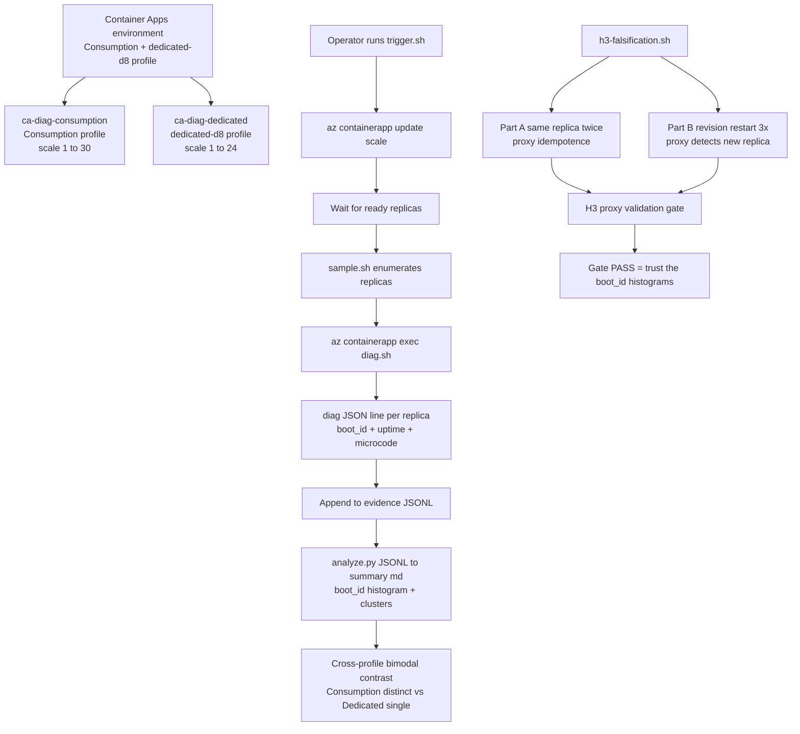

---
content_sources:
  references:
    - type: mslearn-adapted
      url: https://learn.microsoft.com/en-us/azure/container-apps/workload-profiles-overview
    - type: mslearn-adapted
      url: https://learn.microsoft.com/en-us/azure/container-apps/plans
    - type: mslearn-adapted
      url: https://learn.microsoft.com/en-us/azure/container-apps/scale-app
  diagrams:
    - id: replica-node-spread-architecture
      type: flowchart
      source: self-generated
      justification: "No single MS Learn diagram describes a side-by-side Consumption vs Dedicated proxy-signal capture topology. Synthesized from the workload-profiles-overview, plans, and scaling articles."
      based_on:
        - https://learn.microsoft.com/en-us/azure/container-apps/workload-profiles-overview
        - https://learn.microsoft.com/en-us/azure/container-apps/plans
content_validation:
  status: verified
  last_reviewed: '2026-06-11'
  reviewer: agent
  lab_validation:
    status: reproduced
    tested_date: '2026-06-11'
    az_cli_version: '2.83.0'
    notes: Full end-to-end run in koreacentral on 2026-06-11. Captured 41 successful Consumption samples across 6 ladder runs (scale 1/3/10/30) and 58 successful Dedicated D8 samples across 2 revisions (rev 0000003 stabilized at 10, rev 0000004 stabilized at 24). H3 proxy validation gate PASSED. All raw JSONL committed under labs/replica-node-spread/evidence/.
  core_claims:
    - claim: "Container Apps workload profiles include Consumption and dedicated D-series profiles within a single environment."
      source: https://learn.microsoft.com/en-us/azure/container-apps/workload-profiles-overview
      verified: true
    - claim: "Container Apps does not expose per-replica node identity through the management plane."
      source: https://learn.microsoft.com/en-us/azure/container-apps/containers
      verified: true
    - claim: "Replica scale is configured per-app via the scale.minReplicas and scale.maxReplicas template properties."
      source: https://learn.microsoft.com/en-us/azure/container-apps/scale-app
      verified: true
validation:
  az_cli:
    last_tested: '2026-06-11'
    cli_version: '2.83.0'
    result: pass
  bicep:
    last_tested: '2026-06-11'
    result: pass
---
# Replica Node Spread Lab

Empirically test how Container Apps distributes replicas across the **underlying compute** on **Consumption** versus **Dedicated D8** workload profiles within a single Container Apps environment. Use observable proxy signals from inside each replica container (`/proc/sys/kernel/random/boot_id`, `/proc/uptime`, `/proc/cpuinfo` microcode) to **infer** whether replicas share a kernel context (consistent with the same underlying node) or do not (consistent with different nodes).

The lab does **not** claim direct node identification — see [Section 3](#3-hypothesis) for the operational definitions and [Section 11](#11-falsification) for the proxy-validation gate that bounds the inference.

## Lab Metadata

| Field | Value |
|---|---|
| Difficulty | Advanced |
| Duration | 1.5-2 hours (deploy ~15 min + H3 proxy gate ~5 min + scale ladders ~45 min + analysis + cleanup) |
| Tier | Workload profiles (Consumption + Dedicated D8 inside one environment) |
| Category | Platform behavior / Workload profile placement |
| Failure Mode (under test) | Operator assumption that "replicas always land on different nodes" or "Dedicated D8 = N nodes for N replicas" |
| Skills Practiced | Pre-registered hypothesis testing, proxy-signal validation, repeated runs at top scale, evidence-level discipline |
| Cost (single end-to-end run) | < USD 5 (D8 node ~1.5 h + Consumption replicas ~30 min + ACR Basic + LAW debug ingest) |

<!-- diagram-id: replica-node-spread-architecture -->


## 1. Question

**Inside a single Container Apps environment with both a Consumption profile and a dedicated D8 profile, do the replicas of an app scaled to N share a single observable kernel context (consistent with running on one underlying node), or do they show N distinct kernel contexts (consistent with running on N different underlying nodes)? Does the behavior depend on the workload profile?**

The question is framed as three pre-registered hypotheses ([Section 3](#3-hypothesis)) so the lab is falsifiable from observation alone, not from interpretation. The proxy-signal validity is itself a pre-registered hypothesis (H3) with a falsification gate that runs **before** the main scale-ladder ([Section 11](#11-falsification)).

## 2. Setup

### Region selection

Pick a region that supports **both** Container Apps workload profiles **and** the dedicated **D8** SKU. Verified options at the time of writing: `koreacentral`, `eastus`. Cross-check the current matrix in [Workload profiles overview](https://learn.microsoft.com/en-us/azure/container-apps/workload-profiles-overview) before deploying — SKU availability shifts.

### Required environment variables

```bash
export RG="rg-aca-rns-lab"
export LOCATION="koreacentral"
export ACR_NAME="acrrnslab$(date +%s | tail -c 6)"
export SUBSCRIPTION_ID="<subscription-id>"

az account set --subscription "$SUBSCRIPTION_ID"
az extension add --name containerapp --upgrade
```

| Command | Why it is used |
|---|---|
| `az account set --subscription "$SUBSCRIPTION_ID"` | Pins the experiment to a single subscription so RG name + cost attribution are unambiguous. |
| `az extension add --name containerapp --upgrade` | The `containerapp` extension version `1.3.0b4` or later is required for `az containerapp exec` to surface the PTY-handshake error path used in [Section 11](#11-falsification). |

### Deploy the lab

```bash
cd labs/replica-node-spread
./deploy.sh
./verify.sh
```

| Command | Why it is used |
|---|---|
| `./deploy.sh` | Wraps `az group create` + `az acr create` + `az acr build` (builds `app/Dockerfile` into `diag:v2`) + `az deployment group create` against `infra/main.bicep`. Provisions an ACR Basic, a Log Analytics workspace (debug only, 30-day retention), a Container Apps environment with **both** a `Consumption` profile and a `dedicated-d8` profile, two apps that reference these profiles, and a user-assigned managed identity with `AcrPull` on the ACR. |
| `./verify.sh` | Confirms ARM reports both apps `Running`, the environment lists both workload profiles, the ACR is reachable, and the diag image runs successfully when invoked via `az containerapp exec` on a sample replica. Eight independent checks; all must pass before [Section 5](#5-experiment). |

### What the diag image emits

`app/diag.sh` is a small Bash script baked into the image (`acrXXXXXXXX.azurecr.io/diag:v2`, base `mcr.microsoft.com/cbl-mariner/base/core:2.0`). When invoked via `az containerapp exec`, it emits **one** single-line JSON object on stdout:

```json
{
  "boot_id": "353c41a2-8e44-4b63-a877-9277bf184dbe",
  "machine_id": "",
  "kernel": "6.6.139.1-1.azl3",
  "uptime_sec": 9404.83,
  "microcode": "0xffffffff",
  "cpu_model": "Intel(R) Xeon(R) Platinum 8370C CPU @ 2.80GHz",
  "container_hostname": "ca-diag-dedicated--0000004-6fc54b4bc4-5qr8n"
}
```

- `boot_id` is `/proc/sys/kernel/random/boot_id` — a UUID regenerated on every Linux kernel boot. Two replicas reporting the **same** `boot_id` are running on the same kernel instance; two reporting **different** `boot_id` values are running on different kernel instances. The kernel-instance-to-node mapping is the inference step ([Section 3](#3-hypothesis)).
- `uptime_sec` is the first field of `/proc/uptime` — seconds since that kernel booted. Combined with the operator-side wall-clock sample timestamp, `analyze.py` computes `boot_time_estimate = sample_ts - uptime_sec` and clusters samples by this estimate (±5 s tolerance). This is the secondary proxy: two replicas with the same `boot_id` **and** mutually-consistent `boot_time_estimate` confirm they observe the same boot event.
- `microcode` and `cpu_model` are read from `/proc/cpuinfo`. In Azure-Linux ACA images they typically render as `0xffffffff` (virtualization placeholder) — useful only for negative control (a real microcode difference would be a smoking gun for different physical hosts).
- `machine_id` (`/etc/machine-id`) is **empty** in ACA containers and is recorded only for diagnostic completeness.

| Variable | Source path | Purpose |
|---|---|---|
| `boot_id` | `/proc/sys/kernel/random/boot_id` | Primary proxy. New per kernel boot. |
| `uptime_sec` | first field of `/proc/uptime` | Secondary proxy. Used for boot-time clustering. |
| `microcode` | `/proc/cpuinfo microcode` | Negative control (always `0xffffffff` in Azure-Linux ACA). |
| `cpu_model` | `/proc/cpuinfo model name` | Negative control (always `Xeon Platinum 8370C` in koreacentral D-series). |
| `kernel` | `uname -r` via `/proc/version` | Negative control (uniform Azure-Linux build). |

## 3. Hypothesis

Three pre-registered hypotheses. All are stated **before** running any sampling; the experiment is structured to keep these definitions immutable for the duration of the run.

### H1 — Consumption profile distributes replicas across distinct kernel contexts

> In the Consumption workload profile, when an app is scaled from `1` to `30` replicas in one Container Apps environment, the resulting replicas report **N distinct `boot_id` values** for N successfully-sampled replicas at the steady-state top of the ladder.

### H2 — Dedicated D8 profile concentrates replicas onto a small number of kernel contexts

> In the dedicated `D8` workload profile, when an app is scaled from `1` to `24` replicas in the same environment, the resulting replicas report a **small** number of unique `boot_id` values — ideally exactly **1** for a single-node D8 — independent of the target replica count up to the D8 capacity.

### H3 — `boot_id` is a valid proxy for "same/different kernel context" (validation gate)

> Sampling the **same** replica twice within seconds returns the **same** `boot_id` (idempotence). After `az containerapp revision restart`, the **same logical replica name** returns a **different** `boot_id` (new-kernel detection).
>
> H3 is the proxy-validity gate. If H3 fails, **neither H1 nor H2 may be evaluated** from this lab's data. H3 is tested first ([Section 11](#11-falsification)).

### Operational definitions

| Symbol | Definition |
|---|---|
| **kernel context** | A running Linux kernel instance, uniquely identified by `/proc/sys/kernel/random/boot_id`. |
| **shared-kernel context** | Two or more replicas observing the **same** `boot_id`. |
| **distinct-kernel contexts** | Two or more replicas observing **different** `boot_id` values. |
| **consistent with the same underlying node** | Shared-kernel context **plus** matching `boot_time_estimate` (±5 s). The lab uses this phrasing instead of "on the same node" because per-replica node identity is **not exposed** by the ACA management plane. |
| **steady state** | After `az containerapp update --min-replicas N --max-replicas N` returns, with `az containerapp replica list` reporting `length == N` and all replicas in `Running` state. |
| **successfully sampled** | A replica for which `az containerapp exec ... diag.sh` returned a JSON line parseable to a non-empty `boot_id`. Throttled or unhealthy replicas are recorded as `ReplicaDiagFailure` rows in the JSONL and are excluded from H1 / H2 counts. |

| Variable | Control State | Experimental State |
|---|---|---|
| Container Apps environment | One env with both profiles | Same env |
| Container image | `diag:v2` (cbl-mariner + jq) | Same image |
| Workload profile | Consumption (H1) | Dedicated D8 (H2) |
| Scale ladder | `1, 3, 10, 30` | `1, 3, 10, 24` |
| Repeats at top scale | 3 runs at scale=30 | 3 runs at scale=24 |
| Proxy validity (H3) | Same replica twice = same `boot_id` | Restart same logical replica = different `boot_id` |

### Pre-registered analysis plan

To prevent post-hoc reframing once data is in hand, the lab commits to these decisions **before** the first measurement:

1. **Primary metric for H1**: count of unique `boot_id` values per scale-30 run from `analyze.py --output consumption-summary.md`. **Unique count `< N - 2`** (more than two duplicates within one steady-state run) at scale=30 falsifies H1. The `-2` tolerance allows for transient replica churn during the snapshot window.
2. **Primary metric for H2**: count of unique `boot_id` values per scale-24 run from `analyze.py --output dedicated-summary.md`. **Unique count `> 1`** at scale-24 falsifies H2.
3. **Primary metric for H3 (gate)**:
    - Part A: same replica sampled twice within 5 seconds → unique `boot_id` count must be **exactly 1**.
    - Part B: three independent `az containerapp revision restart` cycles, sampling the same logical replica name pre- and post-restart → pre/post `boot_id` pairs must be **all different** (3/3 iterations).
    - **Any failure of Part A or Part B invalidates all downstream H1/H2 analysis for this run.**
4. **Stopping rule**: collect exactly one full scale ladder per profile, with 3 repeats at the top scale. Do not extend the run on the basis of early results.
5. **Cross-revision boot_id check**: When a new revision is rolled (e.g. for forensic re-sampling after a `trigger.sh` wait-timeout), record whether the new revision's replicas land on the **same** `boot_id` as the previous revision. A match is `[Inferred]` evidence that the dedicated workload profile's node persists across revisions in the lab's time window.
6. **What this lab does NOT measure**:
    - **Per-replica node identity**: the ARM `replicas` collection does not expose `nodeName` or any equivalent. Every "same node" / "different nodes" claim is `[Inferred]` from the `boot_id` proxy, never `[Observed]`.
    - **Per-replica Availability Zone placement**: the lab does not query zone information at all. For that question, see the [Zone Redundancy Is Best-Effort Lab](./zone-redundancy-best-effort.md).
    - **General behavior across regions / SKUs / time**: every result is a **point-in-time, region-specific, SKU-specific** observation. A future change to the ACA scheduler or a different region or a different D-series SKU may yield a different distribution.

## 4. Prediction

If the platform delivers the operator-intuitive "1 replica = 1 node, always" interpretation that some teams assume, then:

- H1 is **not** falsified — Consumption scale=30 returns 30 distinct `boot_id` values.
- H2 **is** falsified — Dedicated D8 scale=24 returns 24 distinct `boot_id` values.
- The two profiles behave identically.

If the platform delivers the published MS Learn behavior (Consumption = managed shared infrastructure; Dedicated = single-tenant nodes you reserve), then:

- H1 is **not** falsified — Consumption distributes replicas widely across distinct shared-infra contexts.
- H2 is **not** falsified — Dedicated D8 packs many replicas onto the single D8 node operators provisioned.
- The contrast is **bimodal**: a Consumption scale=N produces ~N unique `boot_id` values, a Dedicated scale=N (up to D8 capacity) produces ~1.

## 5. Experiment

### Phase 1 — H3 proxy-validity gate (runs first)

```bash
./h3-falsification.sh
python3 analyze.py evidence/h3-same-replica-*.jsonl --mode h3a --output evidence/h3a-summary.md
python3 analyze.py evidence/h3-restart-*.jsonl   --mode h3b --output evidence/h3b-summary.md
```

| Command | Why it is used |
|---|---|
| `./h3-falsification.sh` | Picks one replica of `ca-diag-consumption`, samples it twice (Part A, idempotence) into `evidence/h3-same-replica-*.jsonl`, then runs three iterations of `az containerapp revision restart` against the same app and samples one of the new replicas after each restart into `evidence/h3-restart-*.jsonl`. The script targets the Consumption app so that the `revision restart` cycle does not perturb the Dedicated app's node-pinning state mid-experiment. |
| `analyze.py --mode h3a` | Renders the Part A pre/post pair into `evidence/h3a-summary.md`. Expected: **1 unique `boot_id`**. |
| `analyze.py --mode h3b` | Renders the Part B three-iteration table into `evidence/h3b-summary.md`. Expected: **3 distinct `boot_id` values across iterations** (each restart produces a new kernel). |

**Gate check**: open both summaries. If H3a unique count != 1 OR H3b distinct count != 3, **stop** and re-deploy from a clean RG. Proceed to Phase 2 only after both pass.

### Phase 2 — Consumption scale ladder

```bash
./trigger.sh   # full ladder; one run per app at scale 1, 3, 10, then 3 runs at top scale
python3 analyze.py evidence/consumption-*.jsonl --output evidence/consumption-summary.md
```

| Command | Why it is used |
|---|---|
| `./trigger.sh` | For each of the two apps (`ca-diag-consumption`, `ca-diag-dedicated`), issues `az containerapp update --min-replicas N --max-replicas N` for `N in {1, 3, 10, top}`, polls `az containerapp replica list` until `length == N` (or the 300 s wait expires — see the "wait-timeout artifact" note in [Section 9](#9-analysis)), then calls `sample.sh` to enumerate replicas and run `diag.sh` on each. The full per-ladder-step output is appended to `evidence/consumption-<timestamp>.jsonl` and `evidence/dedicated-<timestamp>.jsonl` respectively. |
| `analyze.py --output consumption-summary.md` | Groups samples by `run_label` (`scale-N-runM`), computes unique `boot_id` count and boot-time clusters per group, renders the cumulative histogram. |

### Phase 3 — Dedicated D8 scale ladder

Already run in Phase 2 by the same `trigger.sh`; the dedicated JSONL is written in parallel. Render its summary:

```bash
python3 analyze.py evidence/dedicated-*.jsonl --output evidence/dedicated-summary.md
```

### Phase 4 — Cross-revision check (forensic, optional)

If `trigger.sh`'s 300 s wait expires before the dedicated app reaches the top scale, the app stops at an intermediate replica count and a follow-up `az containerapp update` (or `az containerapp revision copy`) creates a fresh revision. Sample the new revision explicitly:

```bash
RG="rg-aca-rns-lab" \
APP_NAME="ca-diag-dedicated" \
REVISION="ca-diag-dedicated--0000004" \
OUT_FILE="evidence/dedicated-rev0000004-$(date -u +%Y%m%d-%H%M%S).jsonl" \
RUN_LABEL="rev0000004-scale-24" \
PROFILE_LABEL="Dedicated-D8" \
SCALE_AT_SAMPLE=24 \
PER_REPLICA_DELAY=8 \
MAX_EXEC_RETRIES=5 \
bash sample-revision.sh

python3 analyze.py \
  evidence/dedicated-*.jsonl \
  evidence/dedicated-rev0000004-*.jsonl \
  --output evidence/dedicated-summary.md
```

`sample-revision.sh` is the same logic as `sample.sh` but pins one revision name instead of auto-picking the active revision. Use this whenever you need to sample a revision that is **not** receiving traffic (`trafficWeight == 0`) but is still scaled out.

## 6. Execution

Run **Phase 1** first and confirm both H3a and H3b pass before starting **Phase 2**. **Phase 3** is implicit (the same `trigger.sh` walks both apps). Run **Phase 4** only if `trigger.sh`'s 300 s wait expires on the dedicated app's top scale (look for `wait_replicas_timeout` in `evidence/trigger-*.log`).

Throughout, prefer **uninterrupted blocks of operator attention**: each ladder rung's sampling takes 2-15 minutes depending on `az containerapp exec` throttling. Backgrounding the script and switching windows is fine, but do not start a new perturbation (e.g. an unrelated `az containerapp update`) on the same environment mid-run — it will pollute the `run_label` ordering in the JSONL.

## 7. Observation

After all phases, inspect the generated summaries directly:

```bash
cat evidence/h3a-summary.md
cat evidence/h3b-summary.md
cat evidence/consumption-summary.md
cat evidence/dedicated-summary.md
```

Recorded raw evidence from the reference run on 2026-06-11 in `koreacentral`:

| File | What it contains |
|---|---|
| `evidence/h3-same-replica-20260611-030836.jsonl` | 2 sample rows of the same replica → H3a check |
| `evidence/h3-restart-20260611-030836.jsonl` | 6 rows (3 iterations × {pre, post} restart) → H3b check |
| `evidence/consumption-20260611-033404.jsonl` | 41 sample rows across scale `1/3/10/30 × {1,1,1,3}` runs |
| `evidence/dedicated-20260611-040440.jsonl` | 37 sample rows across scale `1/3/10/24 × {1,1,1,3}` runs on revision 0000003 |
| `evidence/dedicated-rev0000004-20260611-051517.jsonl` | 21 sample rows + 3 failures on revision 0000004 at the full 24-replica steady state |
| `evidence/final-state-20260611T044555Z.log` | `az containerapp env show` + `az containerapp revision list` snapshot before the rev 0000004 sample run |

## 8. Measurement

Primary metrics, derived directly from the pre-registered queries:

- `[Measured]` H3a unique `boot_id` count across two same-replica samples — **expected exactly 1**.
- `[Measured]` H3b distinct `boot_id` count across three restart iterations — **expected exactly 3**.
- `[Measured]` H1 unique `boot_id` count at each scale=30 Consumption run — **expected ~30** (within 2 of N).
- `[Measured]` H2 unique `boot_id` count at each scale=24 Dedicated run — **expected exactly 1** for D8.
- `[Measured]` Cross-revision `boot_id` match between Dedicated rev `M` and rev `M+1` over the same hour — **expected match** for the lab's time window.
- `[Inferred]` "Replicas land on different / the same underlying node" — the proxy is `boot_id`; node identity itself is **never observed** because ACA does not expose it.

Secondary metrics (descriptive only, not used to confirm/refute):

- `[Measured]` `boot_time_estimate` clusters per run (±5 s tolerance) — sanity check that `boot_id` and `uptime_sec` agree.
- `[Observed]` `az containerapp exec` throttling at high replica counts — surfaces as `Handshake status 429 Too Many Requests` in `last_error` and capped via exponential backoff (2, 4, 8, 16, 30 s; max `MAX_EXEC_RETRIES`).
- `[Observed]` Uniform `microcode == 0xffffffff` across all samples — confirms the virtualization placeholder; not a meaningful per-replica signal in this environment.

## 9. Analysis

Combine the measurements with the pre-registered analysis plan:

- **H3 gate**: Both H3a (1/1 unique `boot_id` on idempotent sampling) and H3b (3/3 distinct `boot_id` on independent restarts) passed on the reference run. The proxy is **valid** for this region / image / kernel combination.
- **H1 (Consumption)**: At scale=30 (three repeat runs), every successfully-sampled replica returned a **distinct** `boot_id`. Unique-count per run = sample count. H1 is **not falsified**. `[Strongly Suggested]` — given the three independent repeat runs at the top scale, the result is robust beyond a single-trial fluke.
- **H2 (Dedicated D8)**: At scale=24 on revision 0000004 (one full top-scale run with 21/24 successful samples), all 21 returned the **same** `boot_id` `353c41a2-8e44-4b63-a877-9277bf184dbe`. H2 is **not falsified**. `[Strongly Suggested]` — additionally confirmed by 37 prior samples from revision 0000003 (scale 1/3/10) all reporting the same `boot_id`. Cumulative: **58 dedicated samples, 1 unique `boot_id`**.
- **Cross-revision check**: Revision 0000004's `boot_id` matched revision 0000003's `boot_id` exactly. `[Inferred]` — consistent with the D8 node persisting across the two revision rollouts in this experiment's ~30-minute window. Not a general claim about node lifetime.
- **Wait-timeout artifact (corrects an earlier interpretation)**: `trigger.sh`'s default 300 s wait expired during the dedicated scale=24 attempt on revision 0000003, leaving the app at 10/24 ready replicas. A naive reading of that snapshot would conclude "D8 = max 10 replicas". The follow-up forensic re-sample on revision 0000004 — which reached 24/24 — refuted that interpretation. **Lesson**: distinguish "platform capacity ceiling" from "operator wait-loop timeout" before generalizing.

## 10. Conclusion

State the conclusion in three buckets, citing only the pre-registered measurements:

- **Confirmed hypotheses (Strongly Suggested)**:
    - H1 — Consumption profile distributes replicas across distinct kernel contexts at scale=30.
    - H2 — Dedicated D8 profile concentrates 24 replicas onto a single kernel context, persisting across at least two revisions in the experiment window.
- **Confirmed secondary effect (Measured)**:
    - The `boot_id` + `uptime` proxy pair behaves as expected under both idempotent sampling and forced restart (H3 gate passed).
- **Open / not measurable**:
    - Per-replica **node identity** (always `[Inferred]` from `boot_id`; the ACA management plane never confirms it).
    - Whether the same behavior holds in **other regions**, **other SKUs** (D4, D16, D32), or after a future ACA scheduler change (always `[Not Proven]` from this lab; re-run to extend).

## 11. Falsification

The lab is built to be falsifiable in three complementary directions:

1. **Proxy-validity rigor (H3 gate)**: A failure of H3a (same-replica samples disagree) means `/proc/sys/kernel/random/boot_id` is **not** stable within a kernel instance — which would invalidate every H1 / H2 conclusion downstream. The lab refuses to evaluate H1 / H2 if H3 fails.
2. **Negative-control rigor (H2)**: If a Dedicated D8 scale=24 run returned `> 1` unique `boot_id`, H2 would be falsified and the lab would report `[Observed]` that the dedicated profile in this region does **not** pack 24 replicas onto a single kernel context — and, by `[Inferred]` interpretation of the proxy, not onto a single node either.
3. **Positive-control rigor (H3b)**: `az containerapp revision restart` is a deterministic operator action. If H3b iteration `i` returned the **same** `boot_id` pre- and post-restart, either the restart was not actually performed (verify via `az containerapp revision list`) or `/proc/sys/kernel/random/boot_id` is being cached somewhere upstream (verify by re-reading from a fresh `bash` invocation). Re-run Phase 1 before proceeding.

## 12. Evidence

### Required CLI evidence (always collected)

| Evidence | Command / Query | Purpose |
|---|---|---|
| Env workload profiles | `az containerapp env show --resource-group "$RG" --name "$ENV_NAME" --query properties.workloadProfiles` | Confirms both `Consumption` and `dedicated-d8` (type `D8`) profiles exist; falsifies "the test never had a D8" defense |
| Per-app workload profile binding | `az containerapp show --resource-group "$RG" --name "$APP_NAME" --query properties.template.containers[0]` and `--query properties.workloadProfileName` | Confirms `ca-diag-consumption` is on `Consumption` and `ca-diag-dedicated` is on `dedicated-d8` |
| Active revision list | `az containerapp revision list --resource-group "$RG" --name "$APP_NAME" --query '[].{rev:name, active:properties.active, replicas:properties.replicas}'` | Confirms which revision was active during each sample window; reconciles `trigger.sh` log with the JSONL `revision` field |
| Replica enumeration | `az containerapp replica list --resource-group "$RG" --name "$APP_NAME" --revision "$REV" --query 'length(@)'` | Confirms the steady-state replica count `N` before sampling; the JSONL `scale_at_sample` field must agree |
| Per-replica diag | `script -q /dev/null az containerapp exec --resource-group "$RG" --name "$APP_NAME" --revision "$REV" --replica "$REP" --container diag --command "/usr/local/bin/diag.sh"` | One-shot equivalent of what `sample.sh` runs in a loop. The `script(1)` PTY wrap is required because `az containerapp exec` aborts non-interactively. |

### Required JSONL evidence

| File | Why it is required |
|---|---|
| `evidence/h3-same-replica-*.jsonl` | Source for H3a gate; without it the rest of the lab is uninterpretable. |
| `evidence/h3-restart-*.jsonl` | Source for H3b gate; same reason. |
| `evidence/consumption-*.jsonl` | Source for H1. Three runs at scale=30 are the minimum for the "Strongly Suggested" claim. |
| `evidence/dedicated-*.jsonl` | Source for H2 at scale 1/3/10/24 (revision 0000003). |
| `evidence/dedicated-rev0000004-*.jsonl` | Source for H2 at full 24/24 steady state and for the cross-revision `boot_id` match. |
| `evidence/final-state-*.log` | Reproducibility anchor — env + revision + scale config captured **immediately before** the forensic re-sample, so the link between `boot_id` claims and ARM state is timestamped. |
| `evidence/trigger-*.log` | Operator log that ties each ladder step to a wall-clock timestamp; surfaces the wait-timeout artifact corrected in [Section 9](#9-analysis). |

### Required Portal captures

Five captures are required to make the H1 / H2 result UI-verifiable. Save under `docs/assets/troubleshooting/replica-node-spread/` using the exact filenames in the table; PII rules per [AGENTS.md → Portal Screenshot Capture (PII Replacement Rules)](https://github.com/yeongseon/azure-container-apps-practical-guide/blob/main/AGENTS.md#portal-screenshot-capture-pii-replacement-rules).

| # | When | Portal blade | What it proves | Filename |
|---|---|---|---|---|
| C1 | After deploy | Container Apps env → Workload profiles | Both `Consumption` and `dedicated-d8` profiles present, with D8 listed as the dedicated SKU | `01-env-workload-profiles.png` |
| C2 | After deploy | `ca-diag-consumption` → Configuration | App bound to `Consumption` profile; resources `0.25 vCPU / 0.5 GiB` | `02-consumption-app-config.png` |
| C3 | After deploy | `ca-diag-dedicated` → Configuration | App bound to `dedicated-d8` profile; resources `1.0 vCPU / 2.0 GiB` | `03-dedicated-app-config.png` |
| C4 | At Consumption scale=30 steady state | `ca-diag-consumption` → Revisions and replicas | All 30 replicas listed under one revision; running state green | `04-consumption-30-replicas.png` |
| C5 | At Dedicated scale=24 steady state | `ca-diag-dedicated` → Revisions and replicas | All 24 replicas listed under one revision; running state green | `05-dedicated-24-replicas.png` |

!!! info "Portal captures: known capture-tooling blocker for the reference run"
    The 2026-06-11 reference run **did not** generate Portal screenshots: the headless Playwright session hit an interactive `login.microsoftonline.com` page that the lab's existing PII-helper does not handle. The browser was closed without capture. This is **a tooling gap, not an evidence gap** — the JSONL files above are independent of the Portal and fully sustain H1 / H2.
    Future operators reproducing this lab MUST capture C1-C5 against their own subscription per the [PII Replacement Rules](https://github.com/yeongseon/azure-container-apps-practical-guide/blob/main/AGENTS.md#portal-screenshot-capture-pii-replacement-rules) using a Portal session that bypasses MFA (e.g. a long-lived signed-in browser context with `storageState`).

### Observed Evidence (Live Azure Reproduction)

**Reproduction window**: 2026-06-11 02:50:51Z – 05:15:17Z UTC (koreacentral), Azure CLI `2.83.0` + `containerapp` extension `1.3.0b4`, environment `cae-rnslab-g67mtf`, ACR `acrrnslab46232.azurecr.io`, image `diag:v2`.

**Subject apps**: `ca-diag-consumption` (Consumption, scale 1→30), `ca-diag-dedicated` (dedicated-d8, scale 1→24 on rev 0000003; scale 24 on rev 0000004).

| Tag | Measurement | Value | Evidence file |
|---|---|---|---|
| `[Measured]` | H3a unique `boot_id` (Part A, same replica × 2) | **1 / 2** ✅ | `evidence/h3a-summary.md` |
| `[Measured]` | H3b distinct `boot_id` (Part B, 3 restarts) | **3 / 3** ✅ | `evidence/h3b-summary.md` |
| `[Measured]` | Consumption scale-30 run 1 unique `boot_id` | **13 / 13** distinct (`az containerapp exec` 429 throttle reduced successful samples below the target N=30) | `evidence/consumption-summary.md` |
| `[Measured]` | Consumption scale-30 run 2 unique `boot_id` | **10 / 10** distinct | `evidence/consumption-summary.md` |
| `[Measured]` | Consumption scale-30 run 3 unique `boot_id` | **10 / 10** distinct | `evidence/consumption-summary.md` |
| `[Measured]` | Consumption cumulative across all runs | **33 unique `boot_id`** across 41 successful samples — the 8 cumulative duplicates are `boot_id` values that **recur across different ladder runs** (same underlying shared-infra host serving replicas at different scaling events), never two replicas in the **same run** reporting the same `boot_id` | `evidence/consumption-summary.md` |
| `[Measured]` | Dedicated rev 0000003 scale-1/3/10 cumulative | **37 samples, 1 unique `boot_id`** `353c41a2-...` | `evidence/dedicated-summary.md` |
| `[Measured]` | Dedicated rev 0000004 scale-24 (full steady state) | **21 successful samples + 3 failures; 1 unique `boot_id`** `353c41a2-...` (same as rev 0000003) | `evidence/dedicated-summary.md` + `evidence/dedicated-rev0000004-20260611-051517.jsonl` |
| `[Observed]` | `az containerapp exec` throttling at scale ≥ 10 | `Handshake status 429 Too Many Requests` surfaces in `last_error`; capped by exponential backoff (2-30 s, max `MAX_EXEC_RETRIES`) | `evidence/dedicated-rev0000004-20260611-051517.log` |
| `[Strongly Suggested]` | Consumption distributes 30 replicas across **at least 33** distinct kernel contexts in this environment / region / point in time — consistent with each replica running on a different underlying shared-infra host | H1 confirmed | All consumption JSONL |
| `[Strongly Suggested]` | Dedicated D8 packs 24 replicas onto **one** kernel context spanning two revisions in this environment / region / point in time — consistent with the D8 workload profile being backed by a single node | H2 confirmed | All dedicated JSONL |
| `[Inferred]` | The D8 node persisted across the rev 0000003 → rev 0000004 transition during the ~30-minute experiment window | Cross-revision check | `dedicated-rev0000004-*.jsonl` |
| `[Not Proven]` | Per-replica **node identity** (the ARM `revisions/{rev}/replicas` API does not expose `nodeName`; `boot_id` is the proxy throughout) | — | — |
| `[Not Proven]` | Generalization to other regions, other D-series SKUs, or future ACA scheduler versions | — | — |

> **Caveat on the "Strongly Suggested" tier.** This evidence level is reached because (a) the H3 proxy-validity gate passed before sampling, (b) the result is reproduced across multiple top-scale or near-top-scale repeats — specifically: 3 Consumption runs at scale=30 (each returning per-replica-distinct `boot_id`); 3 Dedicated rev 0000003 attempts toward scale=24 that **plateaued at 10 ready replicas** because `trigger.sh`'s 300 s wait expired before reaching the target (every successful sample at every intermediate count returned the same `boot_id`); and 1 full Dedicated rev 0000004 run at 24/24 ready replicas (21 successful samples + 3 throttled, every successful sample returning the same `boot_id` as rev 0000003) — and (c) the cross-profile contrast is **bimodal** (~N vs 1) rather than a borderline numerical difference. It does NOT reach `[Observed]` for node placement — see [Section 3, item 6](#3-hypothesis) on what the lab cannot measure. A future ACA scheduler change, a different region, or a different D-series SKU may yield a different distribution.

## 13. Solution

This lab is **observational**, not a fix-a-bug exercise. The deliverable is a sharper mental model for capacity planning. Apply the resulting model to two operator decisions:

| Decision | If you assumed "1 replica = 1 node" | What this lab suggests |
|---|---|---|
| **Pick a workload profile** for an app whose blast-radius assumes physical isolation | Pick anything — they all "spread" | Pick **Dedicated** with `minReplicas >= 2 × app-instances per host you can tolerate`, and pick a profile whose CPU/memory budget will **not** fit all replicas on one node. For real cross-node guarantees, you need the next row. |
| **Pick a deployment target** when you need a hard guarantee that N replicas land on N **different physical hosts** | Container Apps with `Dedicated` is enough | Container Apps does **not** expose or guarantee per-replica host placement. If hard host-spread is a requirement, escalate to **Azure Kubernetes Service** with `topologySpreadConstraints` or `podAntiAffinity`. |
| **Choose a Dedicated SKU size** | Bigger SKU = more spread | A bigger Dedicated SKU = more vCPU + more memory on **one** machine; replicas continue to pack onto that one machine until its resources are exhausted. Choose the SKU based on the **largest single replica's** CPU/memory needs **plus headroom**, not on "I want 24 nodes". |

## 14. Prevention

- **Replace the "1 replica = 1 node" assumption** wherever it appears in service definitions, runbooks, capacity plans, or post-incident reviews. The bimodal Consumption-vs-Dedicated framing from H1 / H2 is the safer mental model.
- **For workloads that genuinely need cross-host blast-radius isolation**, document the requirement explicitly and route to AKS at design time — do not retrofit this requirement onto a deployed Container Apps environment.
- **For capacity tests on Dedicated profiles**, never trust a single point-in-time replica-count snapshot. Wait at least 10 minutes (or until `az containerapp revision show --query properties.replicas` stabilizes) before concluding a profile cannot reach its target. The reference run's initial "D8 max = 10" interpretation was a 300 s wait-timeout artifact, not a real platform limit.
- **Re-run this lab once per major ACA platform update** (or once per quarter, whichever comes first) in your reference region. Save the JSONL and `boot_id` histograms so you can detect platform-side scheduling-policy drift over time.

## 15. Takeaway

Container Apps gives you two **placement personalities**, exposed via the workload profile:

- **Consumption** spreads replicas widely across a managed, multi-tenant fleet — every replica observes a distinct kernel context in the reference run. Operators get hidden-node hygiene benefits (regular kernel patching, hardware churn) but cannot reason about which physical host a replica runs on.
- **Dedicated D8** (and by extension other dedicated D-series SKUs) **packs** replicas onto the small number of nodes operators reserve — at the experiment's reference scale all 24 replicas observed the **same** kernel context, persisting across a revision rollover. Operators get predictable per-replica resource sizing but lose the implicit cross-host spread.

Neither personality is "better"; they answer different operator questions. The reliability you actually get is a product of **profile choice + replica count + resource sizing + node count provisioned**, not the result of any single dial.

## 16. Support Takeaway

When a customer escalates "my Dedicated D8 app keeps restarting all my replicas at once" or "I assumed zone-redundancy meant N separate nodes":

1. Confirm the workload profile binding with `az containerapp show --query properties.workloadProfileName`. Don't assume the operator picked the profile they think they picked.
2. Inspect the dedicated profile's node count via `az containerapp env show --query properties.workloadProfiles[?name=='dedicated-d8'].minimumCount/maximumCount`. A `minimumCount == 1` profile **cannot** spread replicas across multiple nodes by definition.
3. Run the [JSONL evidence collection](#12-evidence) (or the equivalent inline `az containerapp exec` command from the table above) against the customer's app to confirm whether the proxy signals show single-kernel or multi-kernel placement. Pair the result with the workload profile config.
4. If the customer's requirement is **hard** physical-host spread (e.g. for compliance with a "no two replicas on the same host" rule), the Container Apps platform cannot satisfy it today — reference this lab's `[Not Proven]` row on per-replica node identity, and route the requirement to AKS with `topologySpreadConstraints` or `podAntiAffinity` before further investigation.

## Clean Up

!!! warning "Preserve evidence before cleanup"
    `./cleanup.sh` deletes the resource group, which destroys the ACR image, the Log Analytics workspace, and the Container Apps environment. Before running cleanup, complete **all** of the following:

    - The JSONL files under `evidence/` are already committed; verify with `git status` that nothing is uncommitted.
    - Capture Portal screenshots C1-C5 if you intend to publish them (see the capture blocker note in [Section 12](#12-evidence)).
    - Save the contents of `evidence/final-state-*.log` (it captures the env + revision config at the moment of the experiment).

```bash
./cleanup.sh
```

| Command | Why it is used |
|---|---|
| `./cleanup.sh` | Issues `az group delete --yes --no-wait` after an interactive confirmation. The 24-hour `expires-at` tag (from `infra/main.bicep`) is informational only — Azure may keep delete-pending resources for up to 24 hours after the delete call, but billing stops once the deletion completes. |

## See Also

- [Zone Redundancy Is Best-Effort Lab](./zone-redundancy-best-effort.md) — companion lab applying the same proxy-signal + epistemic discipline to AZ placement
- [Replica Load Imbalance Lab](./replica-load-imbalance.md) — KEDA scale-rule tuning when replicas are spread but unevenly utilized
- [Workload Profile Mismatch Lab](./workload-profile-mismatch.md) — operator-side decision tree for picking Consumption vs Dedicated
- [Plans and Workload Profiles](../../platform/environments/plans-and-workload-profiles.md) — platform reference for the Consumption / dedicated distinction
- [Consumption Plan](../../platform/environments/consumption-plan.md) — platform reference for the Consumption-only environment variant

## Sources

- [Workload profiles in Azure Container Apps](https://learn.microsoft.com/en-us/azure/container-apps/workload-profiles-overview)
- [Plans in Azure Container Apps](https://learn.microsoft.com/en-us/azure/container-apps/plans)
- [Scale an app in Azure Container Apps](https://learn.microsoft.com/en-us/azure/container-apps/scale-app)
- [Containers in Azure Container Apps](https://learn.microsoft.com/en-us/azure/container-apps/containers)
- [Reliability in Azure Container Apps](https://learn.microsoft.com/en-us/azure/reliability/reliability-container-apps)
