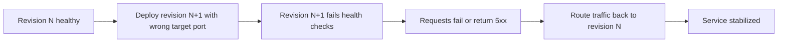

# Revision Failover and Rollback Lab

Practice safe rollback by intentionally creating an unhealthy revision and routing traffic back to a healthy one.

## Scenario

- **Difficulty**: Intermediate
- **Estimated duration**: 20-30 minutes
- **Failure mode**: latest revision unhealthy after ingress target port is changed to the wrong value

## Prerequisites

- Azure CLI with Container Apps extension
- Permissions to deploy resources and update Container Apps

```bash
az extension add --name containerapp --upgrade
az login
```

## Quick Start

```bash
export RG="rg-aca-lab-revision"
export LOCATION="koreacentral"

az group create --name "$RG" --location "$LOCATION"
az deployment group create --name "lab-revision" --resource-group "$RG" --template-file ./labs/revision-failover/infra/main.bicep --parameters baseName="labrevision"

export APP_NAME="$(az deployment group show --resource-group "$RG" --name "lab-revision" --query \"properties.outputs.containerAppName.value\" --output tsv)"
export ACR_NAME="$(az deployment group show --resource-group "$RG" --name "lab-revision" --query \"properties.outputs.containerRegistryName.value\" --output tsv)"

cd labs/revision-failover
./trigger.sh
./verify.sh
./cleanup.sh
```

## Expected Diagnostic Output Pattern

```text
Name               Active    TrafficWeight    Replicas    HealthState    RunningState
-----------------  --------  ---------------  ----------  -------------  ------------
ca-myapp--0000001  True      100              1           Healthy        Running
```

During rollback drills, compare against revision lifecycle events:

```text
RevisionUpdate     → New revision updated
RevisionDeactivating → Prior bad revision deactivated
RevisionReady      → Stable revision ready
ContainerAppReady  → Running state reached
```

## Key Takeaways

- Keep multiple revisions available when testing risky updates.
- Traffic shifting and rollback are faster than full redeploy during incidents.
- Always validate revision health after config changes.

## See Also

- [Bad Revision Rollout and Rollback Playbook](../playbooks/platform-features/bad-revision-rollout-and-rollback.md)
- [Probe Failure and Slow Start Playbook](../playbooks/startup-and-provisioning/probe-failure-and-slow-start.md)

## Scenario Setup

This lab starts with a healthy revision, then introduces a wrong ingress target port on a new revision. Traffic is shifted back to the healthy revision as the rollback/failover exercise.



!!! warning "Keep at least one known-good revision active"
    If you deactivate all healthy revisions during testing, recovery becomes slower because rollback is no longer a traffic-only operation.

!!! note "Rollback is a traffic decision first"
    In multi-revision mode, the fastest mitigation is often traffic reassignment, not immediate app rebuild.

## Step-by-Step Walkthrough

1. **Create resource group and deploy lab**

   ```bash
   export RG="rg-aca-lab-revision"
   export LOCATION="koreacentral"
   az group create --name "$RG" --location "$LOCATION"

   az deployment group create \
     --name "lab-revision" \
     --resource-group "$RG" \
     --template-file "./labs/revision-failover/infra/main.bicep" \
     --parameters baseName="labrevision"
   ```

   Expected output pattern: deployment shows `Succeeded`.

2. **Capture outputs**

   ```bash
   export APP_NAME="$(az deployment group show --resource-group "$RG" --name "lab-revision" --query "properties.outputs.containerAppName.value" --output tsv)"
   export ACR_NAME="$(az deployment group show --resource-group "$RG" --name "lab-revision" --query "properties.outputs.containerRegistryName.value" --output tsv)"
   export ENVIRONMENT_NAME="$(az deployment group show --resource-group "$RG" --name "lab-revision" --query "properties.outputs.containerAppsEnvironmentName.value" --output tsv)"
   ```

   Expected output: no output (variables set).

3. **Confirm baseline healthy revision**

   ```bash
   az containerapp revision list --name "$APP_NAME" --resource-group "$RG" --output table
   ```

   Expected output pattern:

   ```text
   Name               Active    TrafficWeight    HealthState
   -----------------  --------  ---------------  -----------
   ca-myapp--0000001  True      100              Healthy
   ```

4. **Trigger bad rollout**

   ```bash
   ./labs/revision-failover/trigger.sh
   az containerapp revision list --name "$APP_NAME" --resource-group "$RG" --output table
   ```

   Expected output pattern: a new revision appears with unhealthy status.

5. **Investigate failure signal**

   ```bash
   az containerapp logs show \
     --name "$APP_NAME" \
     --resource-group "$RG" \
     --type system
   ```

   Expected evidence: probe failure or connection failure related to wrong target port.

6. **Rollback traffic to healthy revision**

   ```bash
   az containerapp ingress traffic set \
     --name "$APP_NAME" \
     --resource-group "$RG" \
     --revision-weight "ca-myapp--0000001=100"
   ```

   Expected output pattern: traffic update succeeds and healthy revision handles requests.

7. **Verify stabilization**

   ```bash
   ./labs/revision-failover/verify.sh
   az containerapp revision list --name "$APP_NAME" --resource-group "$RG" --output table
   ```

   Expected output: healthy revision active with traffic restored.

## Symptoms / Cause / Fix Matrix

| What you see | What is happening | How to fix |
|---|---|---|
| New revision `Failed` after config change | Bad runtime/ingress configuration in latest revision | Keep previous revision active and shift traffic back |
| Intermittent 5xx after rollout | Partial traffic on unhealthy revision | Set traffic 100% to healthy revision |
| All traffic disrupted | No healthy active revision available | Re-activate known-good revision or redeploy last known-good image/config |
| Rollback succeeded but errors persist | Root cause not isolated yet | Inspect system logs for secondary failure (identity, dependency, scale) |

## Resolution Steps and Verification

1. Confirm at least one revision reports `Healthy`.
2. Route 100% traffic to healthy revision.
3. Validate endpoint behavior with repeated requests.
4. Deactivate known-bad revision only after stable verification.

## Sources

- [Microsoft Learn: Manage revisions in Azure Container Apps](https://learn.microsoft.com/azure/container-apps/revisions-manage)
- [Microsoft Learn: Ingress in Azure Container Apps](https://learn.microsoft.com/azure/container-apps/ingress-overview)
