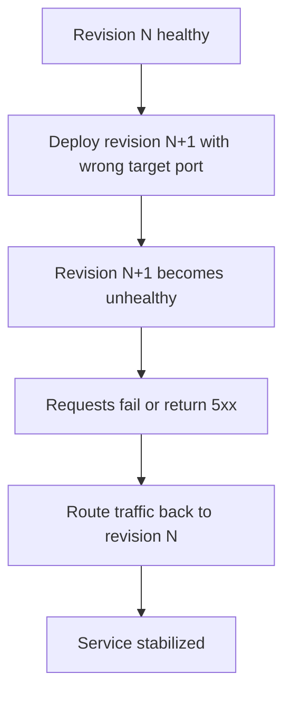

---
content_sources:
  diagrams:
    - id: architecture
      type: flowchart
      source: mslearn-adapted
      based_on:
        - https://learn.microsoft.com/azure/container-apps/revisions-manage
        - https://learn.microsoft.com/azure/container-apps/ingress-overview
content_validation:
  status: verified
  last_reviewed: "2026-04-12"
  reviewer: ai-agent
  core_claims:
    - claim: "Azure Container Apps lets you activate, deactivate, and manage revisions for a container app."
      source: "https://learn.microsoft.com/azure/container-apps/revisions-manage"
      verified: true
    - claim: "Azure Container Apps supports traffic splitting so requests can be distributed across multiple active revisions by percentage."
      source: "https://learn.microsoft.com/azure/container-apps/traffic-splitting"
      verified: true
---

# Revision Failover and Rollback Lab

Practice safe rollback by intentionally creating an unhealthy revision and routing traffic back to a healthy one.

## Lab Metadata

| Attribute | Value |
|---|---|
| Difficulty | Intermediate |
| Estimated Duration | 20-30 minutes |
| Tier | Consumption |
| Failure Mode | Latest revision unhealthy after ingress target port is changed to the wrong value |
| Skills Practiced | Revision management, rollback, traffic shifting, system log analysis |

## 1) Background

This lab starts with a healthy revision, then introduces a wrong ingress target port on a new revision. In multi-revision mode, rollback is primarily a traffic decision: keep a healthy revision available and shift traffic away from the bad one while you correct the misconfiguration.

Traffic shifting is usually faster than rebuilding during an incident, but it only works if at least one known-good revision remains healthy.

### Architecture

<!-- diagram-id: architecture -->


## 2) Hypothesis

**IF** a new revision is created with ingress `targetPort` changed from `8000` to `9999`, **THEN** the latest revision will become non-healthy while a previous healthy revision can still receive traffic after rollback.

| Variable | Control State | Experimental State |
|---|---|---|
| Active revisions mode | Multiple revisions enabled | Multiple revisions enabled |
| Latest revision target port | `8000` | `9999` |
| Latest revision health | `Healthy` | Non-`Healthy` |
| Traffic routing outcome | Stable on healthy revision | Requires traffic reassignment to healthy revision |

## 3) Runbook

### Deploy baseline infrastructure

```bash
export RG="rg-aca-lab-revision"
export LOCATION="koreacentral"

az extension add --name containerapp --upgrade
az login

az group create --name "$RG" --location "$LOCATION"

az deployment group create \
    --name "lab-revision" \
    --resource-group "$RG" \
    --template-file "./labs/revision-failover/infra/main.bicep" \
    --parameters baseName="labrevision"
```

Expected output pattern: deployment shows `Succeeded`.

### Capture deployment outputs

```bash
export APP_NAME="$(az deployment group show \
    --resource-group "$RG" \
    --name "lab-revision" \
    --query "properties.outputs.containerAppName.value" \
    --output tsv)"

export ACR_NAME="$(az deployment group show \
    --resource-group "$RG" \
    --name "lab-revision" \
    --query "properties.outputs.containerRegistryName.value" \
    --output tsv)"

export ENVIRONMENT_NAME="$(az deployment group show \
    --resource-group "$RG" \
    --name "lab-revision" \
    --query "properties.outputs.environmentName.value" \
    --output tsv)"
```

Expected output: no output; variables are set.

### Confirm baseline healthy revision

```bash
az containerapp revision list --name "$APP_NAME" --resource-group "$RG" --output table
```

Expected output pattern:

```text
Name               Active    TrafficWeight    HealthState
-----------------  --------  ---------------  -----------
ca-myapp--0000001  True      100              Healthy
```

### Trigger the bad rollout

```bash
./labs/revision-failover/trigger.sh
```

The trigger script performs these actions:

```bash
az acr build --registry "$ACR_NAME" --image "${APP_NAME}:v1" ./workload

az containerapp update \
    --name "$APP_NAME" \
    --resource-group "$RG" \
    --image "${ACR_LOGIN_SERVER}/${APP_NAME}:v1" \
    --target-port 8000 \
    --registry-server "$ACR_LOGIN_SERVER" \
    --registry-username "$ACR_USERNAME" \
    --registry-password "$ACR_PASSWORD"

sleep 40

az containerapp update --name "$APP_NAME" --resource-group "$RG" --target-port 9999
sleep 40

az containerapp revision list --name "$APP_NAME" --resource-group "$RG" --output table
az containerapp logs show --name "$APP_NAME" --resource-group "$RG" --type system --tail 20
```

Expected output: a new revision appears with unhealthy status and system logs show probe or connection failures related to the wrong target port.

### Investigate the failure signal

```bash
az containerapp logs show \
    --name "$APP_NAME" \
    --resource-group "$RG" \
    --type system
```

Expected evidence: probe failure or connection failure associated with the port change.

### Roll traffic back to a healthy revision

```bash
export HEALTHY_REVISION="$(az containerapp revision list \
    --name "$APP_NAME" \
    --resource-group "$RG" \
    --query "sort_by([?properties.healthState=='Healthy'].{name:name,created:properties.createdTime}, &created)[-1].name" \
    --output tsv)"

az containerapp ingress traffic set \
    --name "$APP_NAME" \
    --resource-group "$RG" \
    --revision-weight "${HEALTHY_REVISION}=100"
```

Expected output: traffic update succeeds and the healthy revision handles requests.

### Restore the correct target port and verify stabilization

```bash
./labs/revision-failover/verify.sh
```

The verify script confirms the latest revision is unhealthy, finds a healthy revision for rollback, then runs:

```bash
az containerapp ingress traffic set --name "$APP_NAME" --resource-group "$RG" --revision-weight "${HEALTHY_REVISION}=100"
az containerapp update --name "$APP_NAME" --resource-group "$RG" --target-port 8000
sleep 40
az containerapp revision list --name "$APP_NAME" --resource-group "$RG" --query "sort_by([].{name:name,created:properties.createdTime,health:properties.healthState}, &created)[-1].health" --output tsv
```

Expected output pattern:

```text
RevisionUpdate        → New revision updated
RevisionDeactivating  → Prior bad revision deactivated
RevisionReady         → Stable revision ready
ContainerAppReady     → Running state reached
```

## 4) Experiment Log

| Step | Action | Expected | Actual | Pass/Fail |
|---|---|---|---|---|
| 1 | Deploy baseline | Single healthy revision | | |
| 2 | Capture outputs | Variables populated | | |
| 3 | Run `trigger.sh` | New unhealthy revision appears | | |
| 4 | Review system logs | Port or probe failure evidence appears | | |
| 5 | Shift traffic to healthy revision | Healthy revision serves traffic | | |
| 6 | Run `verify.sh` | Corrected revision becomes healthy | | |

## Expected Evidence

| Evidence Source | Expected State |
|---|---|
| `az containerapp revision list --name "$APP_NAME" --resource-group "$RG" --output table` | Healthy baseline revision exists before trigger; latest revision becomes non-healthy after `targetPort` changes to `9999` |
| `az containerapp logs show --name "$APP_NAME" --resource-group "$RG" --type system` | Probe failure or connection failure related to wrong target port |
| `az containerapp ingress traffic set --name "$APP_NAME" --resource-group "$RG" --revision-weight "${HEALTHY_REVISION}=100"` | Traffic can be restored to a healthy revision without rebuilding first |
| `./labs/revision-failover/verify.sh` | Rollback path succeeds and latest post-fix revision health improves |

## Clean Up

```bash
az group delete --name "$RG" --yes --no-wait
```

## Related Playbook

- [Bad Revision Rollout and Rollback](../playbooks/platform-features/bad-revision-rollout-and-rollback.md)

## See Also

- [Probe Failure and Slow Start Playbook](../playbooks/startup-and-provisioning/probe-failure-and-slow-start.md)
- [Traffic Routing and Canary Failure Lab](./traffic-routing-canary.md)

## Sources

- [Manage revisions in Azure Container Apps](https://learn.microsoft.com/azure/container-apps/revisions-manage)
- [Ingress in Azure Container Apps](https://learn.microsoft.com/azure/container-apps/ingress-overview)
