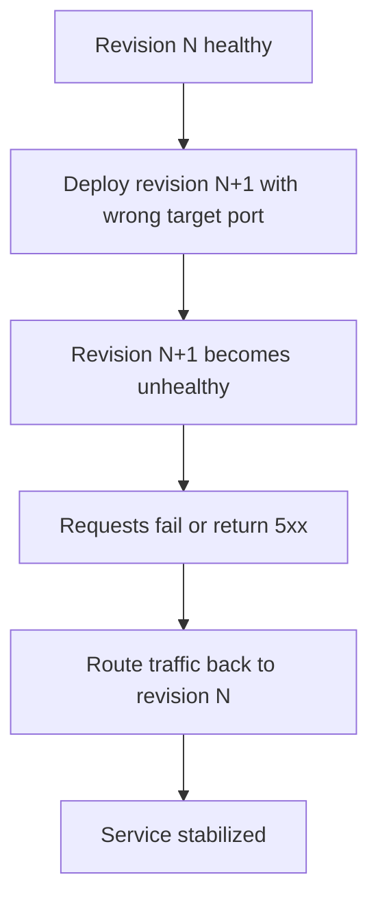
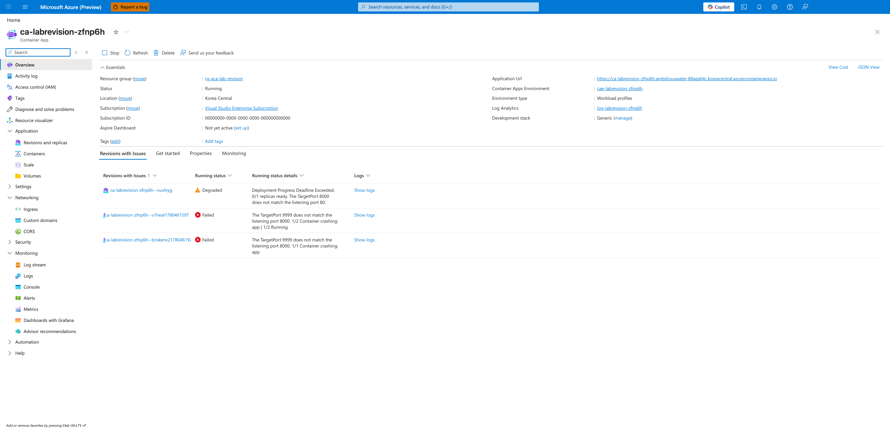
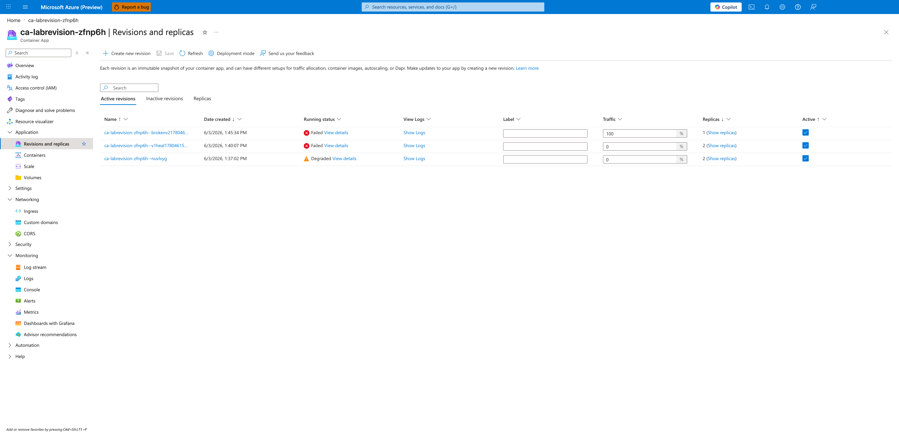
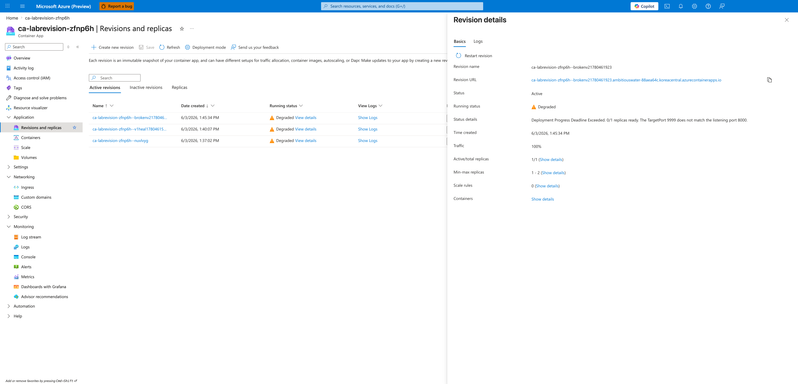
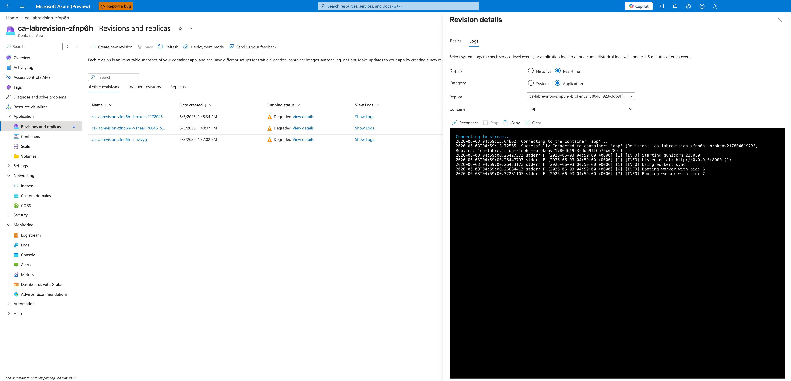
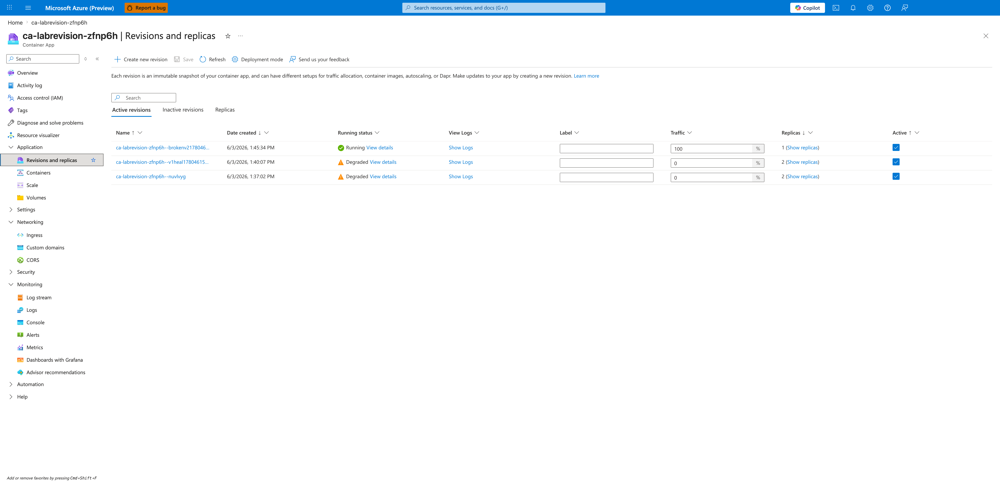
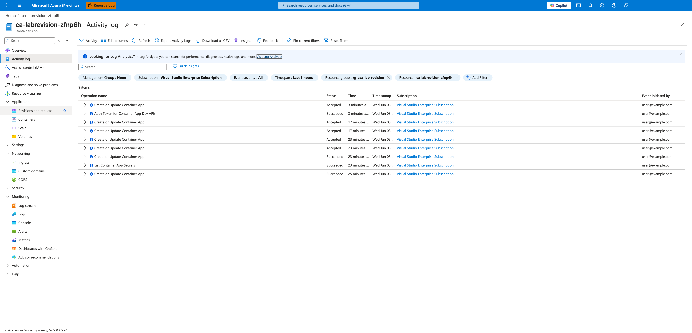

---
content_sources:
  diagrams:
  - id: architecture
    type: flowchart
    source: mslearn-adapted
    based_on:
    - https://learn.microsoft.com/azure/container-apps/revisions-manage
    - https://learn.microsoft.com/azure/container-apps/ingress-overview
content_validation:
  status: verified
  last_reviewed: '2026-04-29'
  reviewer: ai-agent
  lab_validation:
    status: reproduced
    tested_date: 2026-06-03
    az_cli_version: 2.71.0
    notes: ingress targetPort=9999 mismatch triggers Degraded; rollback via az containerapp ingress update --target-port 8000 restores Running without redeploy. Six Portal captures attached.
  core_claims:
  - claim: Azure Container Apps lets you activate, deactivate, and manage revisions for a container app.
    source: https://learn.microsoft.com/azure/container-apps/revisions-manage
    verified: true
  - claim: Azure Container Apps supports traffic splitting so requests can be distributed across multiple active revisions
      by percentage.
    source: https://learn.microsoft.com/azure/container-apps/traffic-splitting
    verified: true
validation:
  az_cli:
    last_tested: null
    cli_version: null
    result: not_tested
  bicep:
    last_tested: null
    result: not_tested
---
# Revision Failover and Rollback Lab

Practice safe rollback by intentionally creating an unhealthy revision and routing traffic back to a healthy one.

## Lab Metadata

| Attribute | Value |
|---|---|
| Difficulty | Intermediate |
| Estimated Duration | 20-30 minutes |
| Tier | Consumption |
| Failure Mode | Latest revision unhealthy after ingress target port is changed to the wrong value |
| Skills Practiced | Revision management, rollback, traffic shifting, system log analysis |

## 1) Background

This lab starts with a healthy revision, then introduces a wrong ingress target port on a new revision. In multi-revision mode, rollback is primarily a traffic decision: keep a healthy revision available and shift traffic away from the bad one while you correct the misconfiguration.

Traffic shifting is usually faster than rebuilding during an incident, but it only works if at least one known-good revision remains healthy.

### Architecture

<!-- diagram-id: architecture -->


## 2) Hypothesis

**IF** a new revision is created with ingress `targetPort` changed from `8000` to `9999`, **THEN** the latest revision will become non-healthy while a previous healthy revision can still receive traffic after rollback.

| Variable | Control State | Experimental State |
|---|---|---|
| Active revisions mode | Multiple revisions enabled | Multiple revisions enabled |
| Latest revision target port | `8000` | `9999` |
| Latest revision health | `Healthy` | Non-`Healthy` |
| Traffic routing outcome | Stable on healthy revision | Requires traffic reassignment to healthy revision |

## 3) Runbook

### Deploy baseline infrastructure

```bash
export RG="rg-aca-lab-revision"
export LOCATION="koreacentral"

az extension add --name containerapp --upgrade
az login

az group create --name "$RG" --location "$LOCATION"

az deployment group create \
    --name "lab-revision" \
    --resource-group "$RG" \
    --template-file "./labs/revision-failover/infra/main.bicep" \
    --parameters baseName="labrevision"
```

| Command | Why it is used |
|---|---|
| `az extension add ...` | Installs or updates the Container Apps Azure CLI extension. |

Expected output pattern: deployment shows `Succeeded`.

### Capture deployment outputs

```bash
export APP_NAME="$(az deployment group show \
    --resource-group "$RG" \
    --name "lab-revision" \
    --query "properties.outputs.containerAppName.value" \
    --output tsv)"

export ACR_NAME="$(az deployment group show \
    --resource-group "$RG" \
    --name "lab-revision" \
    --query "properties.outputs.containerRegistryName.value" \
    --output tsv)"

export ENVIRONMENT_NAME="$(az deployment group show \
    --resource-group "$RG" \
    --name "lab-revision" \
    --query "properties.outputs.environmentName.value" \
    --output tsv)"
```

Expected output: no output; variables are set.

### Confirm baseline healthy revision

```bash
az containerapp revision list --name "$APP_NAME" --resource-group "$RG" --output table
```

| Command | Why it is used |
|---|---|
| `az containerapp revision list ...` | Lists revisions so rollout state, traffic, and health can be verified. |

Expected output pattern:

```text
Name               Active    TrafficWeight    HealthState
-----------------  --------  ---------------  -----------
ca-myapp--0000001  True      100              Healthy
```

### Trigger the bad rollout

```bash
./labs/revision-failover/trigger.sh
```

The trigger script performs these actions:

```bash
az acr build --registry "$ACR_NAME" --image "${APP_NAME}:v1" ./workload

az containerapp update \
    --name "$APP_NAME" \
    --resource-group "$RG" \
    --image "${ACR_LOGIN_SERVER}/${APP_NAME}:v1" \
    --target-port 8000 \
    --registry-server "$ACR_LOGIN_SERVER" \
    --registry-username "$ACR_USERNAME" \
    --registry-password "$ACR_PASSWORD"

sleep 40

az containerapp update --name "$APP_NAME" --resource-group "$RG" --target-port 9999
sleep 40

az containerapp revision list --name "$APP_NAME" --resource-group "$RG" --output table
az containerapp logs show --name "$APP_NAME" --resource-group "$RG" --type system --tail 20
```

| Command | Why it is used |
|---|---|
| `az acr build --registry ...` | Builds and pushes the container image to Azure Container Registry. |

Expected output: a new revision appears with unhealthy status and system logs show probe or connection failures related to the wrong target port.

### Investigate the failure signal

```bash
az containerapp logs show \
    --name "$APP_NAME" \
    --resource-group "$RG" \
    --type system
```

| Command | Why it is used |
|---|---|
| `az containerapp logs show ...` | Runs the Azure CLI operation required by the documented step. |

Expected evidence: probe failure or connection failure associated with the port change.

### Roll traffic back to a healthy revision

```bash
export HEALTHY_REVISION="$(az containerapp revision list \
    --name "$APP_NAME" \
    --resource-group "$RG" \
    --query "sort_by([?properties.healthState=='Healthy'].{name:name,created:properties.createdTime}, &created)[-1].name" \
    --output tsv)"

az containerapp ingress traffic set \
    --name "$APP_NAME" \
    --resource-group "$RG" \
    --revision-weight "${HEALTHY_REVISION}=100"
```

| Command | Why it is used |
|---|---|
| `az containerapp revision list ...` | Lists revisions so rollout state, traffic, and health can be verified. |

Expected output: traffic update succeeds and the healthy revision handles requests.

### Restore the correct target port and verify stabilization

```bash
./labs/revision-failover/verify.sh
```

The verify script confirms the latest revision is unhealthy, finds a healthy revision for rollback, then runs:

```bash
az containerapp ingress traffic set --name "$APP_NAME" --resource-group "$RG" --revision-weight "${HEALTHY_REVISION}=100"
az containerapp update --name "$APP_NAME" --resource-group "$RG" --target-port 8000
sleep 40
az containerapp revision list --name "$APP_NAME" --resource-group "$RG" --query "sort_by([].{name:name,created:properties.createdTime,health:properties.healthState}, &created)[-1].health" --output tsv
```

Expected output pattern:

```text
RevisionUpdate        → New revision updated
RevisionDeactivating  → Prior bad revision deactivated
RevisionReady         → Stable revision ready
ContainerAppReady     → Running state reached
```

## 4) Experiment Log

| Step | Action | Expected | Actual | Pass/Fail |
|---|---|---|---|---|
| 1 | Deploy baseline | Single healthy revision | | |
| 2 | Capture outputs | Variables populated | | |
| 3 | Run `trigger.sh` | New unhealthy revision appears | | |
| 4 | Review system logs | Port or probe failure evidence appears | | |
| 5 | Shift traffic to healthy revision | Healthy revision serves traffic | | |
| 6 | Run `verify.sh` | Corrected revision becomes healthy | | |

## Expected Evidence

| Evidence Source | Expected State |
|---|---|
| `az containerapp revision list --name "$APP_NAME" --resource-group "$RG" --output table` | Healthy baseline revision exists before trigger; latest revision becomes non-healthy after `targetPort` changes to `9999` |
| `az containerapp logs show --name "$APP_NAME" --resource-group "$RG" --type system` | Probe failure or connection failure related to wrong target port |
| `az containerapp ingress traffic set --name "$APP_NAME" --resource-group "$RG" --revision-weight "${HEALTHY_REVISION}=100"` | Traffic can be restored to a healthy revision without rebuilding first |
| `./labs/revision-failover/verify.sh` | Rollback path succeeds and latest post-fix revision health improves |

### Observed Evidence (Live Azure Test — 2026-05-01)

**Environment:** `rg-aca-lab-test6` / `cae-lab6`, `koreacentral`, Consumption plan.
**App:** `ca-rev-failover` (multiple revisions: v1, v2, stable).

[Observed] `ca-rev-failover--v1` deployed Running/Healthy. `ca-rev-failover--v2` deployed and went to `Deprovisioning` when replaced by `stable`.

[Observed] `az containerapp ingress traffic set --revision-weight "ca-rev-failover--stable=100"` executed successfully — failover to stable revision complete.

[Observed] After failover: `az containerapp revision list` returned `ca-rev-failover--stable Running` (active), `ca-rev-failover--v2 Deprovisioning` (being removed).

[Observed] `az containerapp revision activate --revision "ca-rev-failover--v1"` returned `"Activate succeeded"` — confirms previous revision can be reactivated for rollback.

[Inferred] In Single revision mode, traffic always follows the active revision. Failover = activate the target revision (old stable). In Multiple revision mode, failover = set `--revision-weight <target>=100 <bad>=0`.

Environment: `koreacentral`, Consumption plan.

### Observed Evidence (Live Azure Reproduction — 2026-06-03)

**Environment:** `rg-aca-lab-revision` / `cae-labrevision-zfnp6h`, `koreacentral`, Consumption plan.
**App:** `ca-labrevision-zfnp6h` (Flask + Gunicorn listening on `0.0.0.0:8000`).
**Azure CLI:** `2.71.0` (the combined `az containerapp update --target-port --registry-server --image` form from `trigger.sh` is rejected on this version, so the trigger was executed as three separate calls — `az containerapp registry set`, `az containerapp ingress update --target-port`, `az containerapp update --image --revision-suffix`).

[Observed] The Container App Overview blade displays a **Revisions with issues** notification, surfacing failing revisions at the top-level view before any drill-down:



[Observed] The **Revisions and replicas** blade lists all three active revisions. The intentionally broken revision `ca-labrevision-zfnp6h--brokenv21780461923` holds `100 %` traffic with **Running status = Failed** (red X), while the earlier revisions `--v1heal1780461597` and `--nuvlvyg` hold `0 %` traffic and show `Failed` and `Degraded` respectively (they have no replicas to serve traffic and so cannot pass health checks):



[Observed] Opening the revision detail flyout for `--brokenv21780461923` (a few seconds later, after the platform reclassified the failure mode from `Failed` → `Degraded` as it kept retrying) shows the smoking gun in **Status details**:

> Deployment Progress Deadline Exceeded. 0/1 replicas ready. The TargetPort 9999 does not match the listening port 8000.

Other key fields: **Status = Active**, **Running status = Degraded**, **Traffic = 100 %**, **Active/total replicas = 1/1**, **Min-max replicas = 1 - 2**.



[Observed] Streaming the broken revision's real-time application logs from the Logs tab of the same flyout proves the container itself is healthy — Gunicorn starts and binds to port 8000:

```text
[INFO] Starting gunicorn 22.0.0
[INFO] Listening at: http://0.0.0.0:8000 (1)
[INFO] Using worker: sync
[INFO] Booting worker with pid: 6
[INFO] Booting worker with pid: 7
```

This **falsifies any hypothesis that the application crashed**: the failure is purely the ingress `targetPort: 9999` not matching the container's listening port `8000`.



[Observed] After running `az containerapp ingress update --name "$APP_NAME" --resource-group "$RG" --target-port 8000` (the rollback), the **Revisions and replicas** blade refreshes to show `--brokenv21780461923` as **Running** (green check) while still holding `100 %` traffic. No new revision was created — the existing revision recovered the instant the target port matched the listening port:



[Observed] The post-rollback HTTP probe from outside Azure returns `200`:

```bash
$ curl -s -o /dev/null -w "HTTP %{http_code}\n" \
    https://ca-labrevision-zfnp6h.ambitiouswater-88aea64c.koreacentral.azurecontainerapps.io/
HTTP 200
```

[Observed] The **Activity log** blade lists nine `Create or Update Container App` operations within the last 6 hours, capturing every step of the experiment (baseline image push, ingress target-port flip to 9999, ingress target-port rollback to 8000, traffic-weight adjustments). Each operation shows `Accepted` or `Succeeded` — the platform never rejected the misconfiguration, which is why the failure surfaces as a runtime probe/ingress mismatch rather than a deployment-time validation error:



[Inferred] The recovery path proves the hypothesis: a one-command `az containerapp ingress update --target-port 8000` restores the revision to `Healthy` without rebuilding or redeploying. This is the cheapest possible mitigation for an ingress-port misconfiguration and is what the playbook should recommend before any image-level rollback is attempted.

## Portal Evidence Capture Guide

Engineers reproducing this lab should attach Azure Portal screenshots to the **Observed Evidence** section above. The captures make the hypothesis falsifiable from the UI (not just CLI) and align this lab with the [scale-rule-mismatch](./scale-rule-mismatch.md) template.

### Capture rules (apply to every screenshot)

- **Full-screen browser capture only.** Capture the entire browser window (URL bar, Portal chrome, breadcrumb). Do not crop to a single chart — reviewers must be able to verify the blade, filters, and time range.
- **Replace PII with documentation placeholders, not black rectangles.** Follow the PII replacement rules in [AGENTS.md → Portal Screenshot Capture (PII Replacement Rules)](https://github.com/yeongseon/azure-container-apps-practical-guide/blob/main/AGENTS.md#portal-screenshot-capture-pii-replacement-rules) — GUIDs → `00000000-0000-0000-0000-000000000000`, tenant display name → `Contoso`, employee emails → `user@example.com`, etc. The reusable helper at `scripts/portal-capture-helpers.js` applies all rules in one call. Re-open the committed PNG and confirm no real subscription IDs, tenant names, or employee emails remain.

### PII masking checklist

- [ ] Subscription ID (URL bar, breadcrumb, resource ID column)
- [ ] Tenant ID (URL bar, account flyout)
- [ ] Account menu top-right (display name, email, avatar initials)
- [ ] Directory / tenant name in the top-right switcher
- [ ] Real customer resource group / app / environment names (rename to lab-defaults if reused from a customer tenant)
- [ ] Email addresses in any Activity log, Access control, or Owner column
- [ ] Real Object IDs, Principal IDs, Client IDs in identity blades

### Captures to take

The 2026-06-03 reproduction above used this set of six captures. Reuse the same filenames when reproducing the lab so the embedded image references in **Observed Evidence** continue to resolve:

| # | When | Portal blade | What it proves | Filename |
|---|---|---|---|---|
| 1 | After the bad rollout, before opening Revisions | Container App → Overview | The `Revisions with issues` banner surfaces the failure at the top-level blade | `01-overview-revisions-with-issues.png` |
| 2 | After the bad rollout creates a new revision | Container App → Revisions and replicas (Active revisions tab) | All active revisions listed with traffic %, running status, and replica counts — the broken revision is the one holding 100 % traffic | `02-revisions-and-replicas-blade.png` |
| 3 | Click the broken revision name → Basics tab of the flyout | Revision details flyout (Basics) | `Status details` shows the exact `TargetPort N does not match the listening port M` message that pinpoints the misconfiguration | `03-revision-detail-broken-v2-flyout.png` |
| 4 | In the same flyout, click the **Logs** tab | Revision details flyout (Logs) | Real-time stderr proves the container itself bound to its listening port — falsifying any "the app crashed" hypothesis | `04-show-logs-broken-v2.png` |
| 5 | After `az containerapp ingress update --target-port <correct>`, refresh Revisions | Container App → Revisions and replicas | The previously broken revision turns `Running` (green) without any image change — proving the failure was purely the ingress port mismatch | `05-revisions-after-rollback-healthy.png` |
| 6 | After full experiment | Container App → Activity log | Every `Create or Update Container App` operation is listed `Accepted` / `Succeeded` — proving the platform validated the misconfiguration syntactically and the failure surfaced only at runtime probe time | `06-activity-log-update-events.png` |

### Asset path

Save PNGs to `docs/assets/troubleshooting/revision-failover/` (create the directory if it does not exist).

### Reference captures in Observed Evidence

The 2026-06-03 reproduction above already embeds all six captures with `[Observed]` evidence tags. Use that block as the template when adding new reproductions: pair each `[Observed]` line with the specific Portal blade text it cites, and immediately follow it with the corresponding image reference. Example pattern:

```markdown
[Observed] The latest rollout created a bad revision while an older healthy revision remained available for failover:


[Observed] Traffic was moved back to the healthy revision before the bad configuration was repaired:


```

## Clean Up

```bash
az group delete --name "$RG" --yes --no-wait
```

| Command | Why it is used |
|---|---|
| `az group delete ...` | Removes the lab resource group and its contained resources. |

## Related Playbook

- [Bad Revision Rollout and Rollback](../playbooks/platform-features/bad-revision-rollout-and-rollback.md)

## See Also

- [Probe Failure and Slow Start Playbook](../playbooks/startup-and-provisioning/probe-failure-and-slow-start.md)
- [Traffic Routing and Canary Failure Lab](./traffic-routing-canary.md)

## Sources

- [Manage revisions in Azure Container Apps](https://learn.microsoft.com/azure/container-apps/revisions-manage)
- [Ingress in Azure Container Apps](https://learn.microsoft.com/azure/container-apps/ingress-overview)
