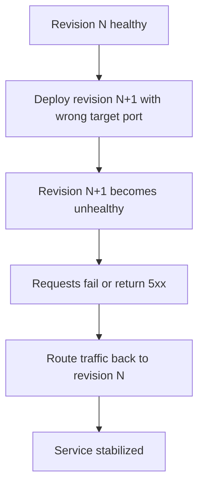

---
content_sources:
  diagrams:
    - id: architecture
      type: flowchart
      source: mslearn-adapted
      based_on:
        - https://learn.microsoft.com/en-us/azure/container-apps/revisions-manage
        - https://learn.microsoft.com/en-us/azure/container-apps/ingress-overview
content_validation:
  status: verified
  last_reviewed: '2026-06-21'
  reviewer: ai-agent
  lab_validation:
    status: reproduced
    tested_date: 2026-06-03
    az_cli_version: 2.71.0
    notes: ingress targetPort=9999 mismatch triggers Degraded; rollback via az containerapp ingress update --target-port 8000 restores Running without redeploy. Six Portal captures attached (rg-aca-lab-revision, koreacentral, app ca-labrevision-zfnp6h) anchor the broken-revision → in-place rollback → healthy-state arc plus the Activity log update events.
  core_claims:
    - claim: Azure Container Apps lets you activate, deactivate, and manage revisions for a container app.
      source: https://learn.microsoft.com/en-us/azure/container-apps/revisions-manage
      verified: true
    - claim: Azure Container Apps supports traffic splitting so requests can be distributed across multiple active revisions by percentage.
      source: https://learn.microsoft.com/en-us/azure/container-apps/traffic-splitting
      verified: true
validation:
  az_cli:
    last_tested: '2026-06-03'
    cli_version: '2.71.0'
    result: pass
  bicep:
    last_tested: '2026-06-03'
    result: pass
---
# Revision Failover and Rollback Lab

Practice safe rollback by intentionally creating an unhealthy revision and routing traffic back to a healthy one.

## Lab Metadata

| Attribute | Value |
|---|---|
| Difficulty | Intermediate |
| Estimated Duration | 20-30 minutes |
| Tier | Consumption |
| Failure Mode | Latest revision unhealthy after ingress target port is changed to the wrong value |
| Skills Practiced | Revision management, rollback, traffic shifting, system log analysis |

## 1) Background

This lab starts with a healthy revision, then introduces a wrong ingress target port. The platform marks the affected revision unhealthy because the startup probe cannot connect, and you have two valid recovery paths:

1. **Traffic-shift rollback** (multi-revision mode) — keep a previous healthy revision active and route traffic away from the failing one.
2. **In-place correction** — when the failure is purely an ingress misconfiguration on a single shared field (such as `targetPort`), fix the field directly without redeploying. The platform re-probes and the same revision recovers in ~30s.

Traffic shifting requires at least one known-good revision; in-place correction does not require any prior revision, only that the underlying container is healthy.

### Architecture

<!-- diagram-id: architecture -->


## 2) Hypothesis

**IF** the ingress `targetPort` is changed from `8000` (matching the container's listening port) to `9999`, **THEN** the affected revision will fail the platform startup probe and be marked non-`Healthy`, **AND** either of the following rollbacks will restore service:

- **(a) Traffic-shift path** — in multi-revision mode, shift `100 %` traffic back to a previous healthy revision.
- **(b) In-place path** — set `targetPort` back to `8000`; the same revision recovers without redeploy because the container itself never crashed.

| Variable | Control State | Experimental State |
|---|---|---|
| Active revisions mode | Multiple revisions enabled | Multiple revisions enabled |
| Latest revision target port | `8000` | `9999` |
| Latest revision health | `Healthy` | Non-`Healthy` |
| Traffic routing outcome | Stable on healthy revision | Requires traffic reassignment to healthy revision |

## 3) Runbook

### Deploy baseline infrastructure

```bash
export RG="rg-aca-lab-revision"
export LOCATION="koreacentral"

az extension add --name containerapp --upgrade
az login

az group create --name "$RG" --location "$LOCATION"

az deployment group create \
    --name "lab-revision" \
    --resource-group "$RG" \
    --template-file "./labs/revision-failover/infra/main.bicep" \
    --parameters baseName="labrevision"
```

| Command | Why it is used |
|---|---|
| `az extension add ...` | Installs or updates the Container Apps Azure CLI extension. |

Expected output pattern: deployment shows `Succeeded`.

### Capture deployment outputs

```bash
export APP_NAME="$(az deployment group show \
    --resource-group "$RG" \
    --name "lab-revision" \
    --query "properties.outputs.containerAppName.value" \
    --output tsv)"

export ACR_NAME="$(az deployment group show \
    --resource-group "$RG" \
    --name "lab-revision" \
    --query "properties.outputs.containerRegistryName.value" \
    --output tsv)"

export ENVIRONMENT_NAME="$(az deployment group show \
    --resource-group "$RG" \
    --name "lab-revision" \
    --query "properties.outputs.environmentName.value" \
    --output tsv)"
```

Expected output: no output; variables are set.

### Confirm baseline healthy revision

```bash
az containerapp revision list --name "$APP_NAME" --resource-group "$RG" --output table
```

| Command | Why it is used |
|---|---|
| `az containerapp revision list ...` | Lists revisions so rollout state, traffic, and health can be verified. |

Expected output pattern:

```text
Name               Active    TrafficWeight    HealthState
-----------------  --------  ---------------  -----------
ca-myapp--0000001  True      100              Healthy
```

### Trigger the bad rollout

```bash
./labs/revision-failover/trigger.sh
```

The trigger script performs these actions:

```bash
az acr build --registry "$ACR_NAME" --image "${APP_NAME}:v1" ./workload

az containerapp update \
    --name "$APP_NAME" \
    --resource-group "$RG" \
    --image "${ACR_LOGIN_SERVER}/${APP_NAME}:v1" \
    --target-port 8000 \
    --registry-server "$ACR_LOGIN_SERVER" \
    --registry-username "$ACR_USERNAME" \
    --registry-password "$ACR_PASSWORD"

sleep 40

az containerapp update --name "$APP_NAME" --resource-group "$RG" --target-port 9999
sleep 40

az containerapp revision list --name "$APP_NAME" --resource-group "$RG" --output table
az containerapp logs show --name "$APP_NAME" --resource-group "$RG" --type system --tail 20
```

| Command | Why it is used |
|---|---|
| `az acr build --registry ...` | Builds and pushes the container image to Azure Container Registry. |

Expected output: a new revision appears with unhealthy status and system logs show probe or connection failures related to the wrong target port.

### Investigate the failure signal

```bash
az containerapp logs show \
    --name "$APP_NAME" \
    --resource-group "$RG" \
    --type system
```

| Command | Why it is used |
|---|---|
| `az containerapp logs show ...` | Runs the Azure CLI operation required by the documented step. |

Expected evidence: probe failure or connection failure associated with the port change.

### Roll traffic back to a healthy revision

```bash
export HEALTHY_REVISION="$(az containerapp revision list \
    --name "$APP_NAME" \
    --resource-group "$RG" \
    --query "sort_by([?properties.healthState=='Healthy'].{name:name,created:properties.createdTime}, &created)[-1].name" \
    --output tsv)"

az containerapp ingress traffic set \
    --name "$APP_NAME" \
    --resource-group "$RG" \
    --revision-weight "${HEALTHY_REVISION}=100"
```

| Command | Why it is used |
|---|---|
| `az containerapp revision list ...` | Lists revisions so rollout state, traffic, and health can be verified. |

Expected output: traffic update succeeds and the healthy revision handles requests.

### Restore the correct target port and verify stabilization

```bash
./labs/revision-failover/verify.sh
```

The verify script confirms the latest revision is unhealthy, finds a healthy revision for rollback, then runs:

```bash
az containerapp ingress traffic set --name "$APP_NAME" --resource-group "$RG" --revision-weight "${HEALTHY_REVISION}=100"
az containerapp update --name "$APP_NAME" --resource-group "$RG" --target-port 8000
sleep 40
az containerapp revision list --name "$APP_NAME" --resource-group "$RG" --query "sort_by([].{name:name,created:properties.createdTime,health:properties.healthState}, &created)[-1].health" --output tsv
```

Expected output pattern:

```text
RevisionUpdate        → New revision updated
RevisionDeactivating  → Prior bad revision deactivated
RevisionReady         → Stable revision ready
ContainerAppReady     → Running state reached
```

## 4) Experiment Log

| Step | Action | Expected | Actual | Pass/Fail |
|---|---|---|---|---|
| 1 | Deploy baseline | Single healthy revision | | |
| 2 | Capture outputs | Variables populated | | |
| 3 | Run `trigger.sh` | New unhealthy revision appears | | |
| 4 | Review system logs | Port or probe failure evidence appears | | |
| 5 | Shift traffic to healthy revision | Healthy revision serves traffic | | |
| 6 | Run `verify.sh` | Corrected revision becomes healthy | | |

## Expected Evidence

| Evidence Source | Expected State |
|---|---|
| `az containerapp revision list --name "$APP_NAME" --resource-group "$RG" --output table` | Healthy baseline revision exists before trigger; latest revision becomes non-healthy after `targetPort` changes to `9999` |
| `az containerapp logs show --name "$APP_NAME" --resource-group "$RG" --type system` | Probe failure or connection failure related to wrong target port |
| `az containerapp ingress traffic set --name "$APP_NAME" --resource-group "$RG" --revision-weight "${HEALTHY_REVISION}=100"` | Traffic can be restored to a healthy revision without rebuilding first |
| `./labs/revision-failover/verify.sh` | Rollback path succeeds and latest post-fix revision health improves |

### Observed Evidence (Live Azure Test — 2026-05-01)

**Environment:** `rg-aca-lab-test6` / `cae-lab6`, `koreacentral`, Consumption plan.
**App:** `ca-rev-failover` (multiple revisions: v1, v2, stable).

[Observed] `ca-rev-failover--v1` deployed Running/Healthy. `ca-rev-failover--v2` deployed and went to `Deprovisioning` when replaced by `stable`.

[Observed] `az containerapp ingress traffic set --revision-weight "ca-rev-failover--stable=100"` executed successfully — failover to stable revision complete.

[Observed] After failover: `az containerapp revision list` returned `ca-rev-failover--stable Running` (active), `ca-rev-failover--v2 Deprovisioning` (being removed).

[Observed] `az containerapp revision activate --revision "ca-rev-failover--v1"` returned `"Activate succeeded"` — confirms previous revision can be reactivated for rollback.

[Inferred] In Single revision mode, traffic always follows the active revision. Failover = activate the target revision (old stable). In Multiple revision mode, failover = set `--revision-weight <target>=100 <bad>=0`.

Environment: `koreacentral`, Consumption plan.

### Observed Evidence (Live Azure Reproduction — 2026-06-03)

**Environment:** `rg-aca-lab-revision` / `cae-labrevision-zfnp6h`, `koreacentral`, Consumption plan.
**App:** `ca-labrevision-zfnp6h` (Flask + Gunicorn listening on `0.0.0.0:8000`).
**Azure CLI:** `2.71.0`. The combined `az containerapp update --target-port --registry-server --registry-username --registry-password --image` call at [`labs/revision-failover/trigger.sh`](https://github.com/yeongseon/azure-container-apps-practical-guide/blob/main/labs/revision-failover/trigger.sh) **lines 10-17** is rejected on this CLI version with an argument-conflict error. Split it into three calls (the broken-port flip on **line 23** still works as-is):

```bash
# Replacement for trigger.sh lines 10-17 on Azure CLI 2.71.0+
az containerapp registry set \
  --name "$APP_NAME" --resource-group "$RG" \
  --server "$ACR_LOGIN_SERVER" \
  --username "$ACR_USERNAME" --password "$ACR_PASSWORD"

az containerapp ingress update \
  --name "$APP_NAME" --resource-group "$RG" \
  --target-port 8000

az containerapp update \
  --name "$APP_NAME" --resource-group "$RG" \
  --image "${ACR_LOGIN_SERVER}/${APP_NAME}:v1" \
  --revision-suffix "v1heal$(date +%s)"
```

| Command | Purpose |
|---|---|
| `az containerapp registry set` | Attaches the ACR credentials to the Container App so the platform can pull the image |
| `az containerapp ingress update --target-port` | Sets the ingress target port without touching any other field — replaces the combined form rejected by CLI 2.71.0 |
| `az containerapp update --image --revision-suffix` | Deploys the baseline `:v1` image and assigns a deterministic revision name |

[Observed] The Container App Overview blade displays a **Revisions with issues** notification, surfacing failing revisions at the top-level view before any drill-down:


[Observed] The **Revisions and replicas** blade lists all three active revisions. The intentionally broken revision `ca-labrevision-zfnp6h--brokenv21780461923` holds `100 %` traffic with **Running status = Failed** (red X). The earlier revisions `--v1heal1780461597` and `--nuvlvyg` hold `0 %` traffic and show `Failed` / `Degraded`; their replica counts in the **Replicas** column are non-zero:


[Inferred] The older revisions remain unhealthy even at `0 %` traffic because the ingress `targetPort` is a single shared environment setting that affects every revision; once it was flipped to `9999`, no revision (regardless of image) could pass the platform startup probe.

[Observed] Opening the revision detail flyout for `--brokenv21780461923` shows **Status = Active**, **Running status = Degraded**, **Traffic = 100 %**, **Active/total replicas = 1/1**, **Min-max replicas = 1 - 2**, and the smoking gun in **Status details**:

> Deployment Progress Deadline Exceeded. 0/1 replicas ready. The TargetPort 9999 does not match the listening port 8000.

[Inferred] The `Running status` value changed from `Failed` (PNG 02) to `Degraded` (PNG 03) over the few seconds between captures because the platform re-tries deployment and reclassifies the failure mode as it accumulates retry attempts.


[Observed] Streaming the broken revision's real-time application logs from the Logs tab of the same flyout shows Gunicorn starting and binding to port 8000:

```text
[INFO] Starting gunicorn 22.0.0
[INFO] Listening at: http://0.0.0.0:8000 (1)
[INFO] Using worker: sync
[INFO] Booting worker with pid: 6
[INFO] Booting worker with pid: 7
```

[Inferred] Because the container process bound to `8000` successfully and produced no crash traceback, the failure cannot be an application crash; the only remaining candidate is the ingress `targetPort: 9999` not matching the listening port `8000`.


[Observed] After running `az containerapp ingress update --name "$APP_NAME" --resource-group "$RG" --target-port 8000` (the in-place rollback), the **Revisions and replicas** blade refreshes to show `--brokenv21780461923` as **Running** (green check) while still holding `100 %` traffic. No new revision was created — the existing revision recovered the instant the target port matched the listening port:


[Observed] The post-rollback HTTP probe from outside Azure returns `200`:

```bash
$ curl -s -o /dev/null -w "HTTP %{http_code}\n" \
    "https://${APP_NAME}.<env-suffix>.koreacentral.azurecontainerapps.io/"
HTTP 200
```

[Observed] The **Activity log** blade lists nine entries within the last 6 hours covering this lab. Seven entries are `Create or Update Container App` operations and the remaining two are `Auth Token for Container App Dev APIs` / `List Container App Secrets` calls. Every entry's status column reads `Accepted` or `Succeeded`:


[Inferred] The Activity Log does not record any client-side rejection of the ingress `targetPort: 9999` change — the control plane accepted the update and the failure only surfaced later as a runtime probe mismatch. This is consistent with `targetPort` being validated at probe time, not at API admission time.

[Inferred] The recovery demonstrates hypothesis branch (b): a single `az containerapp ingress update --target-port 8000` restores the revision to `Running` in ~30 s without rebuilding or redeploying. For this failure mode (ingress-port misconfiguration with a healthy container image), the playbook should attempt in-place correction before a traffic-shift or image-level rollback.

## Clean Up

```bash
az group delete --name "$RG" --yes --no-wait
```

| Command | Why it is used |
|---|---|
| `az group delete ...` | Removes the lab resource group and its contained resources. |

## Related Playbook

- [Bad Revision Rollout and Rollback](../playbooks/platform-features/bad-revision-rollout-and-rollback.md)

## See Also

- [Probe Failure and Slow Start Playbook](../playbooks/startup-and-provisioning/probe-failure-and-slow-start.md)
- [Traffic Routing and Canary Failure Lab](./traffic-routing-canary.md)

## Sources

- [Manage revisions in Azure Container Apps](https://learn.microsoft.com/en-us/azure/container-apps/revisions-manage)
- [Ingress in Azure Container Apps](https://learn.microsoft.com/en-us/azure/container-apps/ingress-overview)
