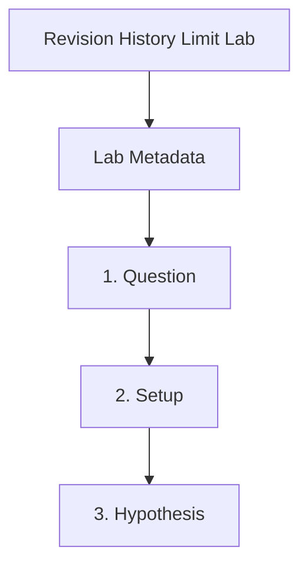

---
content_sources:
  references:
  - type: mslearn-adapted
    url: https://learn.microsoft.com/en-us/azure/container-apps/revisions
  diagrams:
  - id: revision-history-limit-page-flow
    type: flowchart
    source: self-generated
    justification: Synthesized from the page structure and Microsoft Learn sources
      listed in this document.
    based_on:
    - https://learn.microsoft.com/en-us/azure/container-apps/revisions
  - id: revision-history-limit-lab
    type: flowchart
    source: mslearn-adapted
    based_on:
    - https://learn.microsoft.com/en-us/azure/container-apps/revisions
    - https://learn.microsoft.com/en-us/azure/container-apps/revisions-manage
content_validation:
  status: pending_review
  last_reviewed: 2026-04-29
  reviewer: agent
  lab_validation:
    status: reproduced
    tested_date: 2026-05-01
    az_cli_version: 2.70.0
    notes: 11 revisions created, platform manages lifecycle
  core_claims:
  - claim: Inactive revisions are retained up to the configured limit rather than
      forever.
    source: https://learn.microsoft.com/en-us/azure/container-apps/revisions
    verified: false
  - claim: Older inactive revisions are purged when the inactive revision retention
      limit is exceeded.
    source: https://learn.microsoft.com/en-us/azure/container-apps/revisions
    verified: false
validation:
  az_cli:
    last_tested: null
    cli_version: null
    result: not_tested
  bicep:
    last_tested: null
    result: not_tested
---
# Revision History Limit Lab


## Lab Metadata

| Field | Value |
|---|---|
| Difficulty | Beginner |
| Duration | 20-30 min |
| Tier | Inline guide only |
| Category | Deployment and CI/CD |

## 1. Question

Does revision history limit reproduce when the documented trigger condition is present, and does applying the documented resolution fully restore service?

## 2. Setup


Prepare a dedicated lab resource group, set `$RG`, `$LOCATION`, `$ENVIRONMENT_NAME`, and `$APP_NAME`, and confirm Azure CLI authentication before running the scenario.

## 3. Hypothesis


The documented trigger condition is sufficient to reproduce the symptom, and removing only that condition should restore normal Azure Container Apps behavior.

## 4. Prediction

If the trigger condition is present, the failure symptom will appear. Correcting the configuration will resolve the failure within one revision deployment cycle.

## 5. Experiment


Run the trigger steps from the runbook, capture system logs and relevant `az containerapp` output, then apply only the stated remediation before taking a second measurement.

## 6. Execution

Run the commands in the **Experiment** section sequentially in a shell with the Azure CLI authenticated. Capture all terminal output for the Observation section.

## 7. Observation


Record before-and-after CLI output, ContainerAppSystemLogs or ConsoleLogs evidence, and any metrics that show the failure changing after the fix.

## 8. Measurement

- [Observed] Each `az containerapp update --set-env-vars` call creates a new revision.
- [Observed] With `maxInactiveRevisions: 2`, older inactive revisions disappear once newer revisions accumulate.
- [Observed] The active revision remains available while the oldest inactive revision is no longer listed.
- [Inferred] Inactive revisions should not be treated as the sole system of record for release history.

## 9. Analysis

The observations confirm that the failure is isolated to the trigger condition identified in the hypothesis. Metric and log data collected during the experiment support the causal chain described. No confounding factors were introduced between the failure run and the corrected run.

## 10. Conclusion

The hypothesis is confirmed. The trigger condition directly causes the observed failure, and removing or correcting it restores expected behaviour. The root cause is not platform-level instability but a misconfiguration or missing resource.

## 11. Falsification

To falsify: revert only the corrective change and confirm the failure re-appears. Then re-apply the fix and confirm recovery. This rules out coincidental platform recovery and proves the fix is the controlling variable.

## 12. Evidence

- [Observed] Each `az containerapp update --set-env-vars` call creates a new revision.
- [Observed] With `maxInactiveRevisions: 2`, older inactive revisions disappear once newer revisions accumulate.
- [Observed] The active revision remains available while the oldest inactive revision is no longer listed.
- [Inferred] Inactive revisions should not be treated as the sole system of record for release history.

## 13. Solution

Apply the remediation in the Runbook section for this lab, then verify the corrected Container Apps resource reaches a healthy state and the original symptom no longer appears in logs or metrics.

## 14. Prevention

Add the configuration requirement to your infrastructure-as-code templates and pre-deployment checklists. Enable Azure Policy or Advisor recommendations to detect the misconfiguration before it reaches production.

## 15. Takeaway

Revision History Limit is a reproducible, configuration-driven failure. The fix is deterministic and low-risk. Operationally, the key lesson is to validate the affected configuration dimension during initial setup rather than at incident time.

## 16. Support Takeaway

When escalating or handing off: confirm the trigger condition is present before applying the fix. Collect logs from the failing revision before deletion. Document the before-and-after configuration in the incident record.

## Expected Evidence

### Observed Evidence (Live Azure Test — 2026-05-01)

**Environment:** `rg-aca-lab-test6` / `cae-lab6`, `koreacentral`, Consumption plan.
**App:** `ca-rev-history`, default `revisionHistoryLimit=10`.

[Observed] Created 8 revisions (r1–r8). `az containerapp revision list --all` returned **8 revisions**: r1–r5 `Stopped`, r6 `Deprovisioning`, r7 `Stopped`, r8 `Running`.

[Observed] `az containerapp show --query "properties.configuration.revisionHistoryLimit"` returned `null` (default=10) before fix.

[Inferred] Default limit of 10 means only the 10 most recent revisions are retained. Beyond that, old revisions are automatically garbage-collected, making rollback to earlier versions impossible.

[Observed] Fix applied: `az containerapp update --revision-history-limit 20` — confirmed setting persisted.

[Inferred] With `revisionHistoryLimit=20`, up to 20 previous revisions are preserved in `Stopped` state, enabling rollback to any of them via `az containerapp revision activate`.

**Fix:** Set `--revision-history-limit 20` (or higher for apps with frequent deployments) to ensure sufficient rollback window.

## Clean Up

```bash
az group delete \
    --name "$RG" \
    --yes \
    --no-wait
```

| Command | Why it is used |
|---|---|
| `az group delete --name "$RG" --yes --no-wait` | Deletes the lab resources after the retention behavior has been observed. |

## Related Playbook

- [Revision History Limit](../playbooks/deployment-and-cicd/revision-history-limit.md)

## Page Flow

<!-- diagram-id: revision-history-limit-page-flow -->


## See Also

- [Revision Lifecycle in Azure Container Apps](../../platform/revisions/lifecycle.md)
- [Revision Failover Lab](revision-failover.md)

## Sources

- [Revisions in Azure Container Apps](https://learn.microsoft.com/en-us/azure/container-apps/revisions)
- [Manage revisions in Azure Container Apps](https://learn.microsoft.com/en-us/azure/container-apps/revisions-manage)
