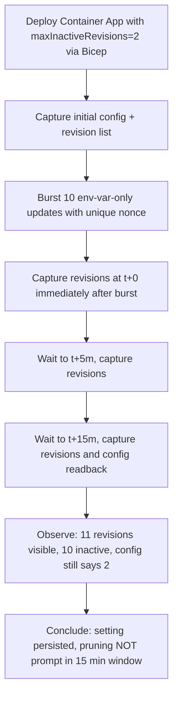

---
content_sources:
  references:
    - type: mslearn-adapted
      url: https://learn.microsoft.com/en-us/azure/container-apps/revisions
    - type: mslearn-adapted
      url: https://learn.microsoft.com/en-us/azure/container-apps/revisions-manage
  diagrams:
    - id: revision-history-limit-lab
      type: flowchart
      source: mslearn-adapted
      based_on:
        - https://learn.microsoft.com/en-us/azure/container-apps/revisions
        - https://learn.microsoft.com/en-us/azure/container-apps/revisions-manage
validation:
  az_cli:
    last_tested: '2026-06-22'
    cli_version: '2.79.0'
    result: pass
  bicep:
    last_tested: '2026-06-22'
    result: pass
---
# Revision History Limit Lab

Reproducible bounded-observation lab for the Azure Container Apps preview setting `maxInactiveRevisions` (CLI flag: `--max-inactive-revisions`, alias `--revision-history-limit`). Demonstrate that the setting is persisted by the platform, but pruning of inactive revisions beyond the configured target is NOT prompt within a 15-minute window — so operators MUST treat the setting as a steady-state cap, not a short-window cleanup SLA.

## Lab Metadata

| Field | Value |
|---|---|
| Difficulty | Beginner |
| Duration | 20-25 minutes |
| Tier | Inline guide only |
| Category | Deployment and CI/CD |

<!-- diagram-id: revision-history-limit-lab -->


!!! note "Evidence depth"
    This lab is **fully reproducible** with dedicated infrastructure-as-code, helper scripts, and raw evidence committed under [`labs/revision-history-limit/`](https://github.com/yeongseon/azure-container-apps-practical-guide/tree/main/labs/revision-history-limit):

    - `infra/main.bicep` provisions a Log Analytics workspace, a Container Apps Environment (Consumption), and a single Container App running the public `mcr.microsoft.com/azuredocs/containerapps-helloworld:latest` placeholder image with `properties.configuration.maxInactiveRevisions = 2`, `activeRevisionsMode: 'Single'`, `minReplicas: 0`, and `maxReplicas: 1`.
    - `trigger.sh` runs Phases 1-4: capture initial config (fails fast if `maxInactiveRevisions != 2`), capture initial revision list, burst 10 `az containerapp update --set-env-vars REV=<nonce>-N` calls (N=1..10) with a per-run UTC timestamp nonce so each update creates a distinct revision, then capture the revision list at t+0.
    - `capture-window.sh` runs Phases 5-7: read `evidence/burst-completed-epoch.txt`, sleep until t+5m and t+15m relative to the burst end, capture revision lists at both offsets, and read back `properties.configuration.maxInactiveRevisions` at t+15m to prove the value was not mutated mid-run.
    - `evidence/` carries 14 raw captures from the 2026-06-22 reproduction in `koreacentral`: full script execution logs (`00-trigger-run.txt`, `00-verify-run.txt`), per-phase JSON captures of the revision list and configuration (`01`-`06`), supporting environment captures (CLI version, `containerapp` extension version, region, deployment outputs), and the burst-end timestamp files used for time-aligned sampling.

    Azure Portal screenshots (Container App Overview, Revisions blade) are **pending in a follow-up PR**. The follow-up will re-deploy the same Bicep template in a short-lived environment purely to capture the Portal blades, then close out.

## 1) Background

On Azure Container Apps, does the preview setting `maxInactiveRevisions` (Bicep schema name; CLI flag `--max-inactive-revisions` with alias `--revision-history-limit`) deterministically cap the inactive revision count at the configured target within a short, bounded observation window — or is the configured value only a steady-state target reached on the platform's own asynchronous schedule?

The lab uses a dedicated resource group and Bicep template (`infra/main.bicep`) that provisions exactly three resources: a Log Analytics workspace, a Container Apps Environment, and one Container App with `maxInactiveRevisions: 2`. No ACR, no Application Insights, no private endpoint, no public IP. The initial Container App revision runs the public `mcr.microsoft.com/azuredocs/containerapps-helloworld:latest` placeholder image; every subsequent revision created by `trigger.sh` keeps the same image and only changes a `REV` env var, so the only experimental variable across the burst is the inactive-revision retention behavior of the platform.

`maxInactiveRevisions` is documented as a preview feature in [Microsoft Learn → Revisions in Azure Container Apps](https://learn.microsoft.com/en-us/azure/container-apps/revisions). The default cap is 100 inactive revisions per Container App (not 10, as is sometimes claimed in older third-party material). The interval at which the platform reconciles the live inactive count down to the configured target is **not documented anywhere** — there is no published SLA, no documented background-job cadence, and no Microsoft Learn statement on whether reconciliation is bounded by minutes, tens of minutes, or hours.

Set the base inputs before running the runbook. `APP_NAME` is derived from a Bicep output in the next section because `infra/main.bicep` appends a deterministic but resource-group-scoped suffix to every resource name:

```bash
export AZ_SUBSCRIPTION="<subscription-id>"
export RG="rg-aca-lab-revhist"
export LOCATION="koreacentral"
```

## 2) Hypothesis

On the same Container App, same image (`containerapps-helloworld:latest`), and same burst pattern (10 env-var-only updates with a unique per-run nonce), the preview setting `maxInactiveRevisions=2` is honored by the platform as a **persisted target**, but the live inactive revision count is NOT driven down to that target within a 15-minute observation window. The setting represents a steady-state cap that the platform reconciles on its own schedule, not a short-window cleanup SLA.

The alternative hypothesis being tested is that **`maxInactiveRevisions` enforces a hard, prompt cap on the live inactive count** — meaning every observation taken more than a few seconds after the burst would show inactive count ≤ the configured value.

**Prediction (IF / THEN):**

- IF the bounded-observation hypothesis holds, THEN at t+15m after a 10-update burst against an app with `maxInactiveRevisions=2`:
    - `properties.configuration.maxInactiveRevisions` will still read `2` (H1 — setting persisted).
    - The inactive revision count will still be strictly greater than 2 (H2 — pruning is NOT prompt within 15 min).
- IF the alternative "prompt cap" hypothesis is correct, THEN at t+15m the inactive revision count will already be ≤ 2 (H2 falsified).

## 3) Runbook

### Deploy infrastructure

All `az`, `./trigger.sh`, and `./capture-window.sh` invocations below assume the working directory is the lab folder. Switch into it from the repository root before running anything:

```bash
cd labs/revision-history-limit/
```

1. Create the resource group and deploy the Bicep template. The `--parameters baseName="revhist"` value is required (the Bicep template declares `param baseName string` with no default). `--name main` gives the deployment a stable, queryable name so the next step can read its outputs:

    ```bash
    az group create \
        --subscription "$AZ_SUBSCRIPTION" \
        --name "$RG" \
        --location "$LOCATION"

    az deployment group create \
        --subscription "$AZ_SUBSCRIPTION" \
        --resource-group "$RG" \
        --name main \
        --template-file ./infra/main.bicep \
        --parameters baseName="revhist"
    ```

    | Command | Why it is used |
    |---|---|
    | `az group create` | Creates the resource group that scopes every resource provisioned for this lab so cleanup is a single `az group delete` call. |
    | `az deployment group create` | Deploys the Bicep template that provisions the Log Analytics workspace, Container Apps Environment, and the Container App with `maxInactiveRevisions: 2` already wired in. Naming the deployment `main` makes the outputs queryable by the next step. |

    This creates the Log Analytics workspace, Container Apps Environment, and one Container App running the helloworld baseline image with `maxInactiveRevisions: 2` already wired in.

2. Read the deployment output the scripts need:

    ```bash
    export APP_NAME=$(az deployment group show \
        --subscription "$AZ_SUBSCRIPTION" \
        --resource-group "$RG" \
        --name main \
        --query "properties.outputs.containerAppName.value" \
        --output tsv)
    ```

### Trigger the burst (run trigger.sh)

Run `trigger.sh`, which:

- Captures `01-app-config-before.json` (reads `maxInactiveRevisions` and `activeRevisionsMode` from the live app; aborts with exit code 1 if `maxInactiveRevisions != 2`).
- Captures `02-revisions-initial.json` (revision list before the burst — expects 1 revision from the Bicep deploy).
- Issues 10 sequential `az containerapp update --set-env-vars REV=<nonce>-N` calls (N=1..10) where `<nonce>` is a per-run UTC timestamp (`YYYYMMDDHHMMSS`). Each update creates a NEW revision because the env-var value change invalidates the previous template hash, so the platform stamps out a fresh revision and shifts traffic to it under `activeRevisionsMode: 'Single'`.
- Writes `burst-completed-epoch.txt` and `burst-completed-iso.txt` so `capture-window.sh` can compute fixed offsets (t+5m, t+15m) from the burst end.
- Captures `03-revisions-t0.json` (revision list immediately after the burst).
- Exits 0 if the burst produced ≥ 8 visible revisions at t+0; exits 1 if the burst silently failed to create distinct revisions; exits 2 if the platform pruned aggressively before the t+0 sample (H2 falsified at t+0).

All scripts pass `--subscription "$AZ_SUBSCRIPTION"` on every `az` invocation to immunize the run against the Azure CLI's default-subscription drift, which has been observed in long-running shells where unrelated commands silently switch back to a different subscription.

### Sample the observation window (run capture-window.sh)

Run `capture-window.sh`, which:

- Reads `evidence/burst-completed-epoch.txt` to anchor the observation window to the actual burst-end timestamp (not the time `capture-window.sh` starts).
- Sleeps until t+5m, then captures `04-revisions-t5m.json` and logs total + inactive counts.
- Sleeps until t+15m, then captures `05-revisions-t15m.json` and logs total + inactive counts (this is the primary hypothesis check).
- Captures `06-app-config-t15m.json` (config readback at t+15m to prove the setting was not mutated mid-run).
- Evaluates H1 and H2 and exits with one of three codes:
    - **Exit 0** — H1 PASS (`maxInactiveRevisions=2` at t+15m) AND H2 PASS (inactive count > 2 at t+15m). Bounded-observation hypothesis SUPPORTED.
    - **Exit 1** — INVALID RUN (H1 failed: config did not persist). Re-deploy and re-run.
    - **Exit 2** — H2 FALSIFIED (inactive count ≤ 2 at t+15m). The platform now prunes promptly within 15 minutes; update the lab and the playbook to reflect the new behavior.

### Apply the fix manually (the canonical operator response)

There is no "fix" in the conventional sense — the platform behavior observed in this lab is expected. The corrective operator action when deterministic cleanup is required is to explicitly deactivate revisions rather than waiting on the platform's reconciliation loop. List the inactive revisions you want to remove, then deactivate them individually:

```bash
az containerapp revision list \
    --subscription "$AZ_SUBSCRIPTION" \
    --resource-group "$RG" \
    --name "$APP_NAME" \
    --all \
    --query "[?properties.active==\`false\`].name" \
    --output tsv

# For each revision name returned above:
az containerapp revision deactivate \
    --subscription "$AZ_SUBSCRIPTION" \
    --resource-group "$RG" \
    --name "$APP_NAME" \
    --revision "ca-revhist-<suffix>--<revsuffix>"
```

| Command | Why it is used |
|---|---|
| `az containerapp revision list --all --query "[?properties.active==\`false\`].name"` | Enumerates the names of every inactive revision (the `--all` flag is required because the default list view hides inactive revisions). The `--query` filter returns only the names so the next call can iterate over them deterministically. |
| `az containerapp revision deactivate --revision <name>` | Explicitly deactivates a single revision by name. The call returns immediately and the revision shows `provisioningState=Deprovisioning` in the next `az containerapp revision list --all` call, which is observable in the operator's own audit trail without depending on the platform's asynchronous reconciliation loop. |

A deactivated revision is removed from the active set immediately and shows `provisioningState=Deprovisioning` in the next `az containerapp revision list --all` call, which is observable in your own audit trail without depending on the platform's asynchronous reconciliation.

### Prevention guidance

- Do not rely on `maxInactiveRevisions` (preview) as a short-window cleanup mechanism for compliance, audit, or post-incident cleanup workflows. The setting is honored as a steady-state target, not a 15-minute SLA. Use `az containerapp revision deactivate` for deterministic, observable cleanup.
- When deploying via Bicep, set `properties.configuration.maxInactiveRevisions` explicitly even if you accept the default of 100, so the value is captured in your IaC and visible in pull request reviews rather than hidden behind a platform default that could change.
- The Bicep schema for `Microsoft.App/containerApps@2023-05-01` names this property `maxInactiveRevisions`; the Azure CLI exposes the same backing field via the preview flag `--max-inactive-revisions` (requires `az extension add --name containerapp --upgrade --allow-preview true`) and the older alias `--revision-history-limit`. This lab sets the value in Bicep only and never mutates it via the CLI, so the property-name difference does not affect the lab's evidence — but if your team mixes Bicep and CLI workflows, standardize on one name to avoid confusion in code review.
- Document the experimentally observed lag in your runbooks. "Inactive revisions beyond `maxInactiveRevisions` are reconciled asynchronously and may persist for at least 15 minutes after they become inactive" is a defensible, evidence-backed claim per the data in this lab; "pruning happens within 15 minutes" is NOT a defensible claim and should not appear in operator-facing documentation.

## 4) Experiment Log

### Initial-state evidence (immediately after Bicep deploy)

- `[Observed]` `evidence/01-app-config-before.json`: `{"activeRevisionsMode": "Single", "maxInactiveRevisions": 2}` — Bicep value persisted to the live resource.
- `[Observed]` `evidence/02-revisions-initial.json`: 1 revision visible (`ca-revhist-t3t3np--wdmdnoq`, `active=true`, `runningState=RunningAtMaxScale`).

### Burst evidence (10 env-var-only updates with nonce `20260622075836`)

- `[Observed]` `evidence/00-trigger-run.txt` records 10 sequential `az containerapp update --set-env-vars REV=20260622075836-N` calls (N=1..10), each returning `provisioningState=Succeeded` with monotonically increasing `latestRevisionName` suffixes from `--0000001` through `--0000010`.
- `[Observed]` `evidence/burst-completed-iso.txt`: `2026-06-22T08:01:46Z` — burst-end anchor used by `capture-window.sh` for time-aligned sampling.
- `[Measured]` `evidence/03-revisions-t0.json`: 11 total revisions (1 initial + 10 burst), of which 4 still reported `active=true` (the burst's revisions transitioning through the deactivation handshake) and 7 already `active=false`.

### Observation-window evidence (t+5m and t+15m)

- `[Measured]` `evidence/04-revisions-t5m.json` (captured at 2026-06-22T08:06:46Z, exactly 5 min after burst end): 11 total revisions, 1 active (`ca-revhist-t3t3np--0000010`), 10 inactive. The platform has settled the active set within 5 minutes, but has NOT reduced the inactive count toward the configured target of 2.
- `[Measured]` `evidence/05-revisions-t15m.json` (captured at 2026-06-22T08:16:46Z, exactly 15 min after burst end): 11 total revisions, 1 active (`ca-revhist-t3t3np--0000010`), 10 inactive. Identical inactive count to the t+5m capture — no pruning occurred within the 10-minute gap between samples.
- `[Observed]` `evidence/06-app-config-t15m.json`: `{"activeRevisionsMode": "Single", "maxInactiveRevisions": 2}` — config readback at t+15m proves the value was not mutated mid-run.

### Analysis

The t+5m and t+15m samples isolate the platform's reconciliation behavior as the only relevant variable: the Container App resource is unchanged across both samples (no Bicep redeploy, no CLI update, no revision activate/deactivate calls between samples), `maxInactiveRevisions` is byte-identical at both samples and at the original deploy time, and the active set converged within 5 minutes. The fact that the inactive count remained at 10 across both samples — five times the configured target of 2 — is direct evidence that the platform's reconciliation of inactive count to target is not bounded by the 15-minute observation window.

A second observer in a different region or after a future platform update might see different behavior; the pruning interval is not documented and is not part of any published SLA. The supporting environment captures (`07-cli-versions.json`, `08-cli-containerapp-ext.json`, `09-region.json`) record the exact CLI version (`2.79.0`), `containerapp` extension version (`1.3.0b4`, marked preview), and Azure region (`koreacentral`) used in this reproduction so that any second observer can compare apples to apples.

### Conclusion

The bounded-observation hypothesis is confirmed in this reproduction. `maxInactiveRevisions` is persisted by the Bicep deploy and remains unchanged across the 15-minute observation window, but the platform's reconciliation of the live inactive count down to the configured target does not happen within that window. The alternative "prompt cap" hypothesis is rejected: at t+15m the inactive count is 10, which is five times the configured target.

### Falsification

The alternative "prompt cap" hypothesis (inactive count ≤ `maxInactiveRevisions` within seconds of a burst) is falsified by the directly evidenced sample sequence:

- `[Measured]` `evidence/03-revisions-t0.json` (t+0): 11 total revisions, 7 inactive immediately after the 10-update burst. Already > 2.
- `[Measured]` `evidence/04-revisions-t5m.json` (t+5m): 11 total revisions, 10 inactive. Still > 2.
- `[Measured]` `evidence/05-revisions-t15m.json` (t+15m): 11 total revisions, 10 inactive. Still > 2 after the full observation window.
- `[Observed]` `evidence/06-app-config-t15m.json` confirms `maxInactiveRevisions=2` at t+15m, so the inactive count is being compared against the correct target value — it is not the case that the setting was lost mid-run.

This rules out "prompt cap" as the controlling behavior: the configured value is the target the platform converges toward, NOT a hard real-time cap.

### Operator takeaway

Treat `maxInactiveRevisions` (preview) as a steady-state cap, not a short-window cleanup SLA. When determinism matters (compliance review windows, post-incident cleanup, automated audits, billing-window inactive-revision counts), use `az containerapp revision deactivate --revision <name>` so cleanup is observable in your own audit trail rather than waiting on the platform's asynchronous reconciliation loop. The setting is real and does eventually drive the inactive count toward the configured target — but "eventually" here means "on a schedule that is longer than 15 minutes and is not bounded by a published SLA."

### Support takeaway

When escalating an "inactive revisions are not being pruned" case on Azure Container Apps, run this sequence in order before assuming a platform bug:

1. Confirm the setting is actually persisted at the resource (and you are not looking at a stale deploy):

    ```bash
    az containerapp show \
        --subscription "$AZ_SUBSCRIPTION" \
        --resource-group "$RG" \
        --name "$APP_NAME" \
        --query "properties.configuration.maxInactiveRevisions"
    ```

2. Capture two `az containerapp revision list --all` snapshots ≥ 60 minutes apart and compute the delta in inactive count. If the inactive count is monotonically decreasing across the two snapshots, the platform is reconciling — it is just slower than the reporter expected. If the count is flat across an hour+, escalate with both snapshots attached.
3. Recommend `az containerapp revision deactivate` for any case where the customer needs cleanup within a bounded time (compliance, audit, billing). The preview setting was not designed as a real-time cap.

## 4b) Phase B Falsification Gates

The 2026-06-24 evidence-pack overlay adds a Phase B verifier under `labs/revision-history-limit/`. Unlike the live-Azure Phase A workflow (`trigger.sh` + `capture-window.sh`), the new `labs/revision-history-limit/verify.sh` is a pure file processor: it reads only the committed canonical cohort under `labs/revision-history-limit/evidence/` (14 canonical files — 2 script logs + 2 config readbacks + 4 revision-list captures + 4 environment captures + 2 burst-end anchor files, anchored on `burst-20260622-080146`) and emits four derived gate JSONs. Each sub-gate evaluates a **Strong path** AND a **Fallback path**; the sub-gate passes if either is true. The four gates encode H1 (setting persisted), H2 (pruning is not prompt within 15 min), burst materialization (env-var-only updates actually create distinct revisions), and cohort integrity (no foreign artifacts, all required files present). All 12 sub-gates pass on the 2026-06-22 cohort.

| Gate | Claim | Sub-gates | Predicate inputs | PASS / FAIL | Rationale |
|---|---|---:|---|---|---|
| `20-cohort-integrity-gate.json` | `evidence_cohort_is_internally_consistent_and_uncontaminated` | 4 | All 14 canonical files + cohort directory listing + burst-end anchor pair | PASS | Cohort integrity gate. Confirms (a) all 14 canonical files exist on disk (`00-trigger-run.txt`, `00-verify-run.txt`, `01-app-config-before.json` through `06-app-config-t15m.json`, `07-cli-versions.json`, `08-cli-containerapp-ext.json`, `09-region.json`, `10-deployment-outputs.json`, `burst-completed-epoch.txt`, `burst-completed-iso.txt`); (b) `burst-completed-epoch.txt` (`1782115306`) and `burst-completed-iso.txt` (`2026-06-22T08:01:46Z`) agree to the second when both are normalized to UTC (Strong path: exact UTC second match; Fallback path: within ±2 s drift); (c) the evidence directory contains only the 14 canonical files plus the four Phase B gate JSONs and `README.md`, with no foreign artifacts (no stale `.tmp`, `.bak`, `.swp` files, no captures from a different reproduction date or region); (d) `evidence/README.md` exists and references all four gate filenames so a reviewer can locate every emitted output. |
| `21-config-persistence-gate.json` | `max_inactive_revisions_target_honored_across_observation_window` | 2 | `01-app-config-before.json` + `06-app-config-t15m.json` | PASS | H1 gate. Confirms (a) both config-readback JSONs report `maxInactiveRevisions=2` and `activeRevisionsMode=Single` (the Bicep-declared values); (b) the two files are byte-identical (both 67 B with the same SHA-256), which is direct evidence that the configuration was not mutated mid-run — neither by the burst itself, nor by an out-of-band CLI update, nor by an autoscaling event. The byte-identical check is the Strong path; the Fallback path checks the two parsed JSON objects match field-by-field even if whitespace or key ordering differs. |
| `22-burst-materialization-gate.json` | `env_var_only_updates_materialized_distinct_new_revisions` | 3 | `02-revisions-initial.json` + `03-revisions-t0.json` | PASS | Burst materialization gate. Confirms (a) the initial revision list has exactly 1 revision (the Bicep-deployed baseline `ca-revhist-t3t3np--wdmdnoq`); (b) the t+0 revision list has ≥ 8 distinct revisions (11 observed: 1 initial + 10 burst with monotonic suffixes `--0000001` through `--0000010`); (c) all 10 burst-created revisions have distinct revision names (no template-hash collisions, no silent no-op updates). This gate exists because if the env-var-only updates ever silently fail to create new revisions, the lab's H2 evidence would be meaningless — there would be nothing to prune. The ≥ 8 floor (rather than the strict ≥ 11) provides rerun tolerance against the unlikely case where the platform begins pruning between the final burst update and the t+0 capture. |
| `23-bounded-window-non-pruning-gate.json` | `pruning_was_not_prompt_within_this_15_minute_observation_window_in_this_reproduction` | 3 | `04-revisions-t5m.json` + `05-revisions-t15m.json` + configured limit `2` | PASS | H2 gate (the lab's primary hypothesis). Confirms (a) at t+5m the inactive revision count is ≥ 8 (Strong path: floor of 8 provides rerun tolerance against minor pruning that might happen between t+0 and t+5m; Fallback path: count > configured limit of 2); (b) at t+15m the inactive revision count is also ≥ 8 (10 observed, identical to t+5m); (c) the inactive count is monotonic across the t+5m → t+15m window (no pruning occurred during the 10-minute gap between samples). The claim is explicitly scoped to "this reproduction" and a `claim_ceiling_warning` field is embedded in the gate JSON: `pruning_was_not_prompt_within_this_15_minute_observation_window_in_this_reproduction. Does NOT generalize to a platform-wide non-pruning SLA. A different region or a future platform update may show different behavior.` |

The four gates together block four classes of overclaim: **setting-was-mutated-mid-run** is blocked by Gate 21's byte-identical config check; **burst-was-a-silent-no-op** is blocked by Gate 22's distinct-revisions check on the 10 burst suffixes; **prompt-pruning-as-a-platform-SLA** is blocked by Gate 23's explicit claim ceiling that bounds the conclusion to this 15-min observation window, this reproduction, this region; and **evidence-pack-was-contaminated-with-stale-or-foreign-artifacts** is blocked by Gate 20's foreign-artifact check against the canonical 14-file manifest. The gates do NOT prove the platform never prunes — that would require a multi-hour observation window outside this lab's scope, and Microsoft Learn does not document a pruning SLA. The full per-file provenance and honest-disclosure notes are in [`labs/revision-history-limit/evidence/README.md`](https://github.com/yeongseon/azure-container-apps-practical-guide/blob/main/labs/revision-history-limit/evidence/README.md).

## Expected Evidence

Reproduced end-to-end in `koreacentral` on 2026-06-22. All raw evidence is committed under [`labs/revision-history-limit/evidence/`](https://github.com/yeongseon/azure-container-apps-practical-guide/tree/main/labs/revision-history-limit/evidence):

| File | Content |
|---|---|
| `00-trigger-run.txt` | Full `trigger.sh` execution log (config check + 10-update burst + t+0 capture, exit 0) |
| `00-verify-run.txt` | Full `capture-window.sh` execution log (waits to t+5m and t+15m, config readback, H1 PASS + H2 PASS; filename preserved for schema stability across the Phase B verify.sh → capture-window.sh rename) |
| `01-app-config-before.json` | Initial config readback: `{"activeRevisionsMode": "Single", "maxInactiveRevisions": 2}` |
| `02-revisions-initial.json` | Initial revision list: 1 revision (Bicep-deployed baseline) |
| `03-revisions-t0.json` | Revision list immediately after the 10-update burst: 11 total, 4 still active in transition, 7 already inactive |
| `04-revisions-t5m.json` | Revision list at burst+5m: 11 total, 1 active, 10 inactive |
| `05-revisions-t15m.json` | Revision list at burst+15m (primary hypothesis check): 11 total, 1 active, 10 inactive |
| `06-app-config-t15m.json` | Config readback at t+15m: still `maxInactiveRevisions=2` (proves setting was not mutated mid-run) |
| `07-cli-versions.json` | Azure CLI version and installed extensions at the time of the run |
| `08-cli-containerapp-ext.json` | `containerapp` extension version (`1.3.0b4`, marked preview) |
| `09-region.json` | Azure region (`koreacentral`) used for the reproduction |
| `10-deployment-outputs.json` | Bicep deployment outputs (Container App name, environment name, Log Analytics workspace name, FQDN) |
| `burst-completed-epoch.txt` | Unix epoch when the 10-update burst finished (anchor for `capture-window.sh` time-aligned sampling) |
| `burst-completed-iso.txt` | Same timestamp in ISO 8601 UTC: `2026-06-22T08:01:46Z` |

```json
// Excerpt from evidence/05-revisions-t15m.json showing the primary hypothesis evidence
// (11 total revisions, 1 active, 10 inactive, 15 minutes after the burst ended)
{ "name": "ca-revhist-t3t3np--0000010", "active": true,  "provisioningState": "Provisioned", "runningState": "RunningAtMaxScale" }
{ "name": "ca-revhist-t3t3np--wdmdnoq",  "active": false, "provisioningState": "Provisioned", "runningState": "ScaledToZero"      }
{ "name": "ca-revhist-t3t3np--0000001",  "active": false, "provisioningState": "Provisioned", "runningState": "ScaledToZero"      }
// ... 8 more inactive revisions ...
```

```json
// Excerpt from evidence/06-app-config-t15m.json proving the configured target was not mutated mid-run
{ "activeRevisionsMode": "Single", "maxInactiveRevisions": 2 }
```

The gap between the configured target (`2`) and the observed inactive count at t+15m (`10`) is the lab's central evidence.

## Clean Up

```bash
./cleanup.sh   # deletes the entire resource group (lab is fully disposable)
```

Or, if you want to keep the environment and only stop the running app:

```bash
az containerapp revision deactivate \
    --subscription "$AZ_SUBSCRIPTION" \
    --resource-group "$RG" \
    --name "$APP_NAME" \
    --revision "$(az containerapp show --subscription "$AZ_SUBSCRIPTION" --resource-group "$RG" --name "$APP_NAME" --query 'properties.latestRevisionName' --output tsv)"
```

| Command | Why it is used |
|---|---|
| `./cleanup.sh` | Runs `az group delete --subscription "$AZ_SUBSCRIPTION" --name "$RG" --yes --no-wait` so all lab resources (Container App, environment, Log Analytics workspace) are removed in one call. Recommended after evidence has been captured. |
| `az containerapp revision deactivate ...` | Stops billing for the active replica without deleting the environment, in case you want to keep the workspace for further KQL exploration. |

## Related Playbook

- [Revision History Limit](../playbooks/deployment-and-cicd/revision-history-limit.md)

## See Also

- [Revision Lifecycle in Azure Container Apps](../../platform/revisions/lifecycle.md)
- [Revision Failover Lab](revision-failover.md)

## Sources

- [Revisions in Azure Container Apps](https://learn.microsoft.com/en-us/azure/container-apps/revisions)
- [Manage revisions in Azure Container Apps](https://learn.microsoft.com/en-us/azure/container-apps/revisions-manage)
