---
content_sources:
  diagrams:
    - id: architecture
      type: flowchart
      source: mslearn-adapted
      based_on:
        - https://learn.microsoft.com/en-us/azure/container-apps/health-probes
        - https://learn.microsoft.com/en-us/azure/container-apps/revisions
content_validation:
  status: verified
  last_reviewed: '2026-06-21'
  reviewer: ai-agent
  lab_validation:
    status: reproduced
    tested_date: 2026-05-01
    az_cli_version: 2.70.0
    notes: |
      Original reproduction (2026-05-01, az 2.70.0) confirmed ProbeFailed +
      ContainerTerminated(ProbeFailure) + revision Failed. Re-verified end-to-end
      on 2026-06-20 (PR #222) with a rewritten trigger script using the supported
      `az containerapp update --yaml` authoring path; the re-verification chain
      lives under `labs/revision-provisioning-failure/evidence/` (12 RAW JSON
      files including `evidence/10-kql-console-logs.json` as the application-level
      smoking gun: nginx 404 on the bad probe path + SIGCHLD propagation) and the
      paired Portal captures (40 total) in
      `docs/assets/troubleshooting/revision-provisioning-failure/`. Post-fix
      recovery verified across 3 healthy revisions via
      `evidence/11-kql-postfix-verification.json` and
      `evidence/12-revision-list-recovered.json`.
  core_claims:
    - claim: Azure Container Apps supports startup probes to check whether a containerized app has started successfully.
      source: https://learn.microsoft.com/en-us/azure/container-apps/health-probes
      verified: true
    - claim: In Azure Container Apps, revisions are immutable snapshots of a container app version.
      source: https://learn.microsoft.com/en-us/azure/container-apps/revisions
      verified: true
validation:
  az_cli:
    last_tested: '2026-06-20'
    cli_version:
    result: pass
  bicep:
    last_tested: '2026-06-20'
    result: pass
---
# Revision Provisioning Failure Lab

Reproduce a revision that is created but never becomes ready due to startup probe misconfiguration.

## Lab Metadata

| Attribute | Value |
|---|---|
| Difficulty | Intermediate |
| Estimated Duration | 20-30 minutes |
| Tier | Consumption |
| Failure Mode | Revision created but startup probe fails repeatedly |
| Skills Practiced | Revision diagnostics, probe configuration, system log analysis |

## 1) Background

This lab demonstrates what happens when a revision is accepted by the Azure Container Apps control plane but never stabilizes. The trigger misconfigures a startup probe so that it cannot succeed — either by pointing it at a path the container never serves (returns 404) **or** by pointing it at a port nothing is listening on (connection refused). Either variant causes the probe to fail repeatedly. The revision exists and containers may start, but the platform marks the revision as unhealthy because it never passes the startup probe.

This pattern is distinct from API validation failures (which reject the update before creating a revision) and from the **app's own `ingress.targetPort`** mismatch (covered in [Ingress Target Port Mismatch](./ingress-target-port-mismatch.md)). Here the ingress target port is correct; only the **startup probe's** endpoint is misconfigured.

### Architecture

<!-- diagram-id: architecture -->
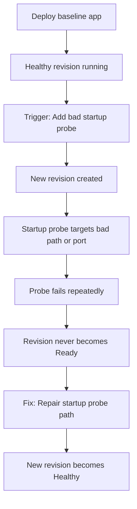
```mermaid
flowchart TD
    A[Deploy baseline app] --> B[Healthy revision running]
    B --> C[Trigger: Add bad startup probe]
    C --> D[New revision created]
    D --> E[Startup probe targets bad path or port]
    E --> F[Probe fails repeatedly]
    F --> G[Revision never becomes Ready]
    G --> H[Fix: Repair startup probe path]
    H --> I[New revision becomes Healthy]
```

!!! warning "Revision created ≠ Revision ready"
    A revision can exist in the system but remain in a Failed or Degraded state if health probes never pass. Always check revision health state, not just existence.

!!! note "API validation vs runtime failure"
    Some configuration errors (like referencing a non-existent secret) are now rejected at the API layer with `ContainerAppSecretRefNotFound`. This lab focuses on errors that pass API validation but fail at runtime.

## 2) Hypothesis

**IF** a startup probe is configured to target an endpoint the container cannot satisfy (either a path that returns 404, or a port that refuses connection), **THEN** the revision will be created but never become ready, and system logs will show `ProbeFailed` events until the probe configuration is fixed.

| Variable | Control State | Experimental State |
|---|---|---|
| Startup probe endpoint | Not configured or valid path+port | `/nonexistent` (404) or `port 9999` (connection refused) |
| Latest revision health | `Healthy` | `Degraded` / `Failed` / `Unhealthy` |
| System logs | Normal startup events | `ProbeFailed` followed by `ContainerTerminated(ProbeFailure)` |
| Recovery path | No action required | Disable or correct startup probe and deploy new revision |

## 3) Runbook

### Deploy baseline infrastructure

Prerequisites:

- Azure CLI with the Container Apps extension
- Permissions to deploy Container Apps resources

```bash
az extension add --name containerapp --upgrade
az login

export RG="rg-aca-lab-revprov"
export LOCATION="koreacentral"

az group create --name "$RG" --location "$LOCATION"

az deployment group create \
    --name "lab-revprov" \
    --resource-group "$RG" \
    --template-file "./labs/revision-provisioning-failure/infra/main.bicep" \
    --parameters baseName="labrevprov"
```

| Command | Why it is used |
|---|---|
| `az extension add ...` | Installs or updates the Container Apps Azure CLI extension. |

Expected output:

- Resource group creation succeeds.
- Deployment completes with `Succeeded` state.

### Capture deployment outputs

```bash
export APP_NAME="$(az deployment group show \
    --resource-group "$RG" \
    --name "lab-revprov" \
    --query "properties.outputs.containerAppName.value" \
    --output tsv)"

export ENVIRONMENT_NAME="$(az deployment group show \
    --resource-group "$RG" \
    --name "lab-revprov" \
    --query "properties.outputs.environmentName.value" \
    --output tsv)"
```

### Verify baseline health

```bash
az containerapp revision list \
    --name "$APP_NAME" \
    --resource-group "$RG" \
    --output table
```

| Command | Why it is used |
|---|---|
| `az containerapp revision list ...` | Lists revisions so rollout state, traffic, and health can be verified. |

Expected output:

```text
CreatedTime                Active    Replicas    TrafficWeight    HealthState    ProvisioningState    Name
-------------------------  --------  ----------  ---------------  -------------  -------------------  ---------------------------
2026-04-06T12:00:00+00:00  True      1           100              Healthy        Provisioned          ca-labrevprov-xxxxx--abc123
```

### Trigger the failure

```bash
./labs/revision-provisioning-failure/trigger.sh
```

The trigger script patches the Container App via YAML to add a startup probe targeting a non-existent path:

```bash
cat > /tmp/probe-trigger.yaml <<EOF
properties:
  template:
    revisionSuffix: badpath$(date +%s)
    containers:
    - name: app
      image: nginx:alpine
      resources:
        cpu: 0.5
        memory: 1Gi
      probes:
      - type: Startup
        httpGet:
          path: /nonexistent-health-endpoint
          port: 80
        initialDelaySeconds: 5
        periodSeconds: 5
        failureThreshold: 3
        timeoutSeconds: 2
EOF

az containerapp update \
    --name "$APP_NAME" \
    --resource-group "$RG" \
    --yaml /tmp/probe-trigger.yaml
```

| Command | Why it is used |
|---|---|
| `az containerapp update --yaml` | Patches the Container App via a YAML document. The `--startup-probe-*` CLI flags (e.g. `--startup-probe-path`, `--startup-probe-port`) do **not** exist on `az containerapp update`; the only supported way to configure probes is the `--yaml` path. The image is also swapped to `nginx:alpine` so the probe target (`/nonexistent-health-endpoint`) cleanly returns HTTP 404 instead of a connection refusal. |

### Observe the failure

```bash
az containerapp revision list \
    --name "$APP_NAME" \
    --resource-group "$RG" \
    --output table
```

| Command | Why it is used |
|---|---|
| `az containerapp revision list ...` | Lists revisions so rollout state, traffic, and health can be verified. |

Expected output shows the new revision in a non-Healthy state:

```text
CreatedTime                Active    Replicas    TrafficWeight    HealthState    ProvisioningState    Name
-------------------------  --------  ----------  ---------------  -------------  -------------------  ---------------------------
2026-04-06T12:05:00+00:00  True      0           100              Degraded       Provisioned          ca-labrevprov-xxxxx--def456
2026-04-06T12:00:00+00:00  False     1           0                Healthy        Provisioned          ca-labrevprov-xxxxx--abc123
```

Check system logs for probe failures:

```bash
az containerapp logs show \
    --name "$APP_NAME" \
    --resource-group "$RG" \
    --type system \
    --tail 30
```

| Command | Why it is used |
|---|---|
| `az containerapp logs show ...` | Runs the Azure CLI operation required by the documented step. |

Expected log evidence:

```text
Reason_s             Log_s
-------------------  -----------------------------------------------------------------
ProbeFailed          Startup probe failed: HTTP probe failed with status code: 404
ContainerRestart     Container 'app' was restarted
```

### Fix the issue

Recover by replacing the bad startup probe path with `/` (which `nginx:alpine` serves with HTTP 200):

```bash
./labs/revision-provisioning-failure/verify.sh
```

The verify script patches the Container App via YAML so the startup probe targets a healthy path on the same `nginx:alpine` image:

```bash
cat > /tmp/probe-recovery.yaml <<EOF
properties:
  template:
    revisionSuffix: healthy$(date +%s)
    containers:
    - name: app
      image: nginx:alpine
      resources:
        cpu: 0.5
        memory: 1Gi
      probes:
      - type: Startup
        httpGet:
          path: /
          port: 80
        initialDelaySeconds: 5
        periodSeconds: 5
        failureThreshold: 3
        timeoutSeconds: 2
EOF

az containerapp update \
    --name "$APP_NAME" \
    --resource-group "$RG" \
    --yaml /tmp/probe-recovery.yaml
```

!!! note "Why not `--startup-probe-disabled`?"
    The `az containerapp update` command does **not** expose a `--startup-probe-disabled` flag. To remove a probe you must patch the `probes:` array via `--yaml` — either by replacing the bad probe (this lab's approach) or by submitting an empty `probes: []` list.

### Verify recovery

```bash
az containerapp revision list \
    --name "$APP_NAME" \
    --resource-group "$RG" \
    --output table
```

Expected output:

```text
HealthState    ProvisioningState
-------------  -------------------
Healthy        Provisioned
```

## 4) Experiment Log

| Step | Action | Expected | Actual | Pass/Fail |
|---|---|---|---|---|
| 1 | Deploy baseline infrastructure | Deployment succeeds | | |
| 2 | Verify baseline health | Revision is Healthy | | |
| 3 | Run `trigger.sh` | New revision created with bad probe | | |
| 4 | Check revision list | New revision is Degraded/Failed | | |
| 5 | Check system logs | ProbeFailed events visible | | |
| 6 | Run `verify.sh` | Probe removed, new revision created | | |
| 7 | Verify recovery | Latest revision is Healthy | | |

## Expected Evidence

### During failure

| Evidence Source | Expected State |
|---|---|
| `az containerapp revision list` | Latest revision shows `Degraded` or `Failed` |
| `az containerapp logs show --type system` | `ProbeFailed` with 404 status code |
| Replica count | 0 or unstable |

### After fix

| Evidence Source | Expected State |
|---|---|
| `az containerapp revision list` | Latest revision shows `Healthy` |
| System logs | Normal startup events |
| `./verify.sh` | PASS |

### Observed Evidence (Live Azure Test — 2026-05-01)

[Observed] Startup probe set to `httpGet.port=9999` (no listener) with `failureThreshold=3`.
`az containerapp revision list` showed:

```text
HealthState=Unhealthy  ProvisioningState=Failed  Name=ca-rev-provision--0000002
```

[Observed] System logs emitted:

```text
"Msg": "Probe of StartUp failed with status code: ", "Reason": "ProbeFailed"
"Msg": "Container ca-rev-provision failed startup probe, will be restarted", "Reason": "ProbeFailed"
"Msg": "Container 'ca-rev-provision' was terminated with exit code '' and reason 'ProbeFailure'", "Reason": "ContainerTerminated"
```

[Observed] The previous healthy revision (`ca-rev-provision--0000001`) remained active with
`HealthState=Healthy` and automatically received all traffic.

[Inferred] Azure Container Apps isolates probe failures to the new revision — the platform's
revision rollout safety mechanism prevents the failing revision from receiving production traffic.

Environment: `rg-aca-lab-test6` / `cae-lab6`, `koreacentral`, Consumption plan. App: `ca-rev-provision`, startup probe on port 9999 (app listens on 80).

### Observed Evidence (Portal Captures — 2026-06-03)

Reproduced in `rg-aca-lab-rev-prov` / `cae-labrevprov-j2qmuu`, `koreacentral`, Consumption plan. App: `ca-labrevprov-j2qmuu`. Startup probe set to `httpGet.path=/health`, **`port=9999`** (no listener — connection refused), `failureThreshold=3`, `periodSeconds=5`. Revision suffix `probefail1780455941`. The app's `ingress.targetPort` remained correct at 80; only the **startup probe's** port was set to 9999.

!!! note "Variant: connection-refused vs 404"
    The 2026-06-03 reproduction exercises the **wrong-port (connection refused)** variant of the hypothesis. The 2026-05-01 reproduction above exercised a closely related variant on a different environment. Both confirm the same failure mode — the revision is created but never becomes ready because the startup probe never succeeds — and the system-log signature (`ProbeFailed → ContainerTerminated(ProbeFailure)`) is identical.

!!! note "Traffic-state difference between the two reproductions"
    In the 2026-05-01 reproduction the previous healthy revision retained traffic (the standard single-revision-mode behavior when the new revision never reaches Healthy). In the 2026-06-03 reproduction, the **configured** traffic weight on the failed revision is 100% (visible in capture 02 / 03) — but with 0/1 replicas ready, no requests can actually be served. Both observations are valid: the routing layer reports configured intent independent of replica readiness, and the post-failure traffic split depends on the revision mode and the order in which configuration was applied.

[Observed] The Container App **Overview** blade surfaces the failing revision under the **Revisions with Issues** tab. The revision `probefail1780455941` is listed with **Running status = Failed** and **Running status details = 1/1 Container crashing: app**.


[Inferred] The first-class **Revisions with Issues** tab on the Overview blade is the fastest UI signal that a recently deployed revision did not stabilize — a customer-facing engineer should land here first.

[Observed] The **Revisions and replicas** blade shows two active revisions side by side: `probefail1780455941` carries **100% traffic** in a **Failed** state, while the previous revision `probe1780455700` is **Running** with **0% traffic**.


[Inferred] This is the failure signature unique to **runtime probe failure**: the revision is created and the routing layer is configured to send traffic to it, but no replicas ever pass the startup probe — so the traffic split is "live" while no replica can actually serve requests.

[Observed] The revision detail flyout for `probefail1780455941` shows **Status = Active**, **Running status = Failed**, **Status details = 1/1 Container crashing: app**, **Active/total replicas = 0/1**, and **Traffic = 100%**.


[Inferred] The `1/1 Container crashing: app` phrasing on the detail flyout is the most direct symptom-to-container mapping in the Portal — it points the investigator straight at the `app` container's startup behavior (probes, command, image) rather than at ingress or scaling.

[Observed] The **Logs** tab on the revision detail (System + Historical) shows the probe failure cascade in chronological order. The visible log lines include:

```text
Reason=ProbeFailed         Msg=Container app failed startup probe, will be restarted
Reason=ContainerTerminated Msg=Container 'app' was terminated with reason 'ProbeFailure'
```


[Strongly Suggested] The `ProbeFailed` → `ContainerTerminated(ProbeFailure)` sequence is the smoking gun for this lab's hypothesis — it directly attributes the container termination to probe failure rather than to OOM, exit code, image pull, or scaling decisions.

[Observed] The **Activity log** records control-plane events for the revision update: multiple `Create or Update Container App` entries with statuses including `Succeeded` and `Accepted`.


[Inferred] The presence of `Succeeded` entries for `Create or Update Container App` shows the **control-plane** accepted the revision update — there is no API-validation rejection here. Combined with the `Failed` revision state in capture 03 and the `ProbeFailed` logs in capture 04, this isolates the failure to the **data-plane** (the container's startup probe response), not to API validation or RBAC.

[Observed] The **Diagnose and solve problems** blade exposes the **Container Apps Diagnostics** entry point with categories including **Availability and Performance** (Health Probe Check, Ingress Settings Check), **Container Apps Environment**, **Dapr Components Insights**, **Configuration and Management**, **Deployment**, **SSL and Domains**, and **Networking**.


[Inferred] For customer-facing support, the **Availability and Performance → Health Probe Check** tile is the recommended single-click entry point for this failure mode — it consolidates revision health, probe configuration, and recent probe failures into one Microsoft-managed diagnostic panel.

### Observed Evidence (Portal Captures — 2026-06-20)

Reproduced in `rg-aca-lab-revprov` / `cae-labrevprov-e2upm2`, `koreacentral`, Consumption plan. App: `ca-labrevprov-e2upm2`. This second reproduction exercises the **wrong-path (HTTP 404)** variant: startup probe set to `httpGet.path=/nonexistent-health-endpoint`, `port=80`, `failureThreshold=3`, `periodSeconds=5`, against an `nginx:alpine` container that correctly responds 404 for unknown paths. Failed revision: `ca-labrevprov-e2upm2--badpath2`. Recovery applied via `az containerapp update --yaml` with corrected probe `path=/`, producing healthy revision `ca-labrevprov-e2upm2--badpath3`.

!!! note "Why two reproductions"
    The 2026-06-03 reproduction (captures 01-06) covered the **wrong-port (connection refused)** variant on a different environment. This 2026-06-20 reproduction (captures 07-40) covers the **wrong-path (HTTP 404)** variant with comprehensive log evidence including nginx access logs, KQL query packs, and post-fix recovery verification. Together both reproductions confirm the same failure mode — startup probe never succeeds — across the two main variants.

#### Baseline (healthy)

[Observed] Before triggering the failure, the resource group contains the deployed lab infrastructure: Container App Environment, Container App, Log Analytics workspace, and ACR.

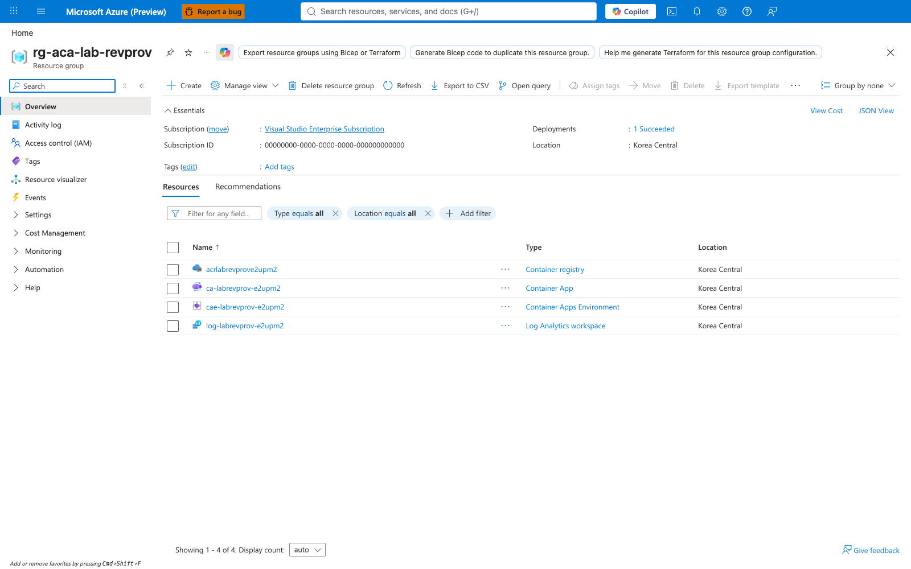

[Observed] Container App **Overview** blade in baseline state showing `Status: Running`, traffic at 100% to the healthy `badpath` revision.

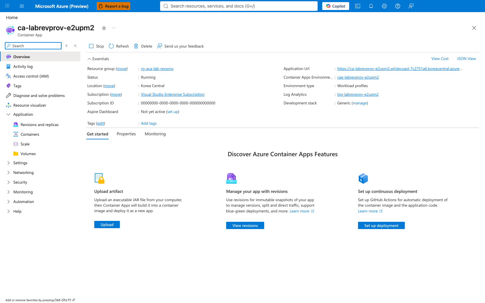

[Observed] **Revisions and replicas** grid showing the baseline `badpath` revision as `Healthy` with `Provisioned` status, single replica running.

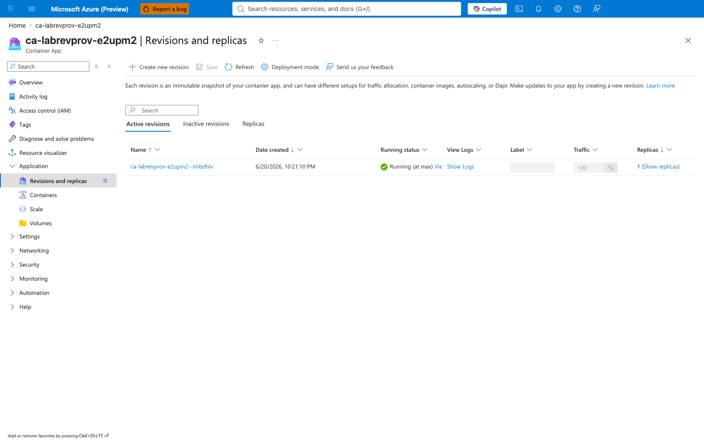

[Observed] **Containers** blade showing the baseline configuration with no startup probe configured.

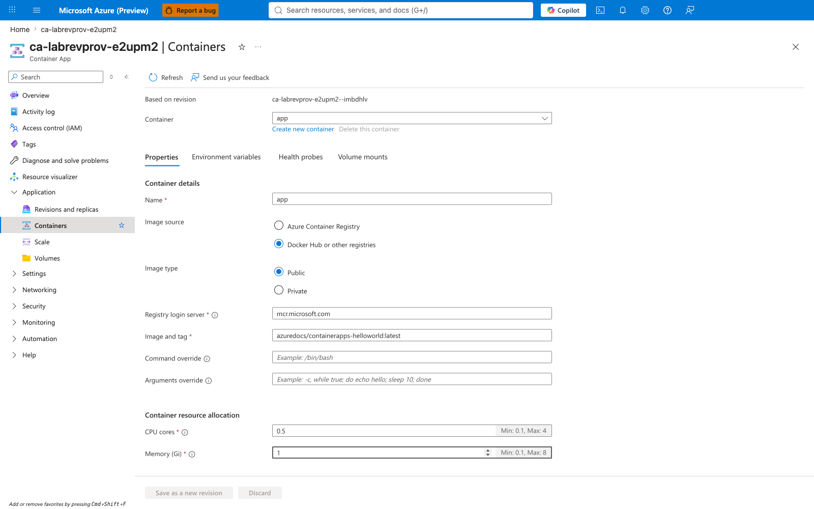

[Observed] **Containers → Health Probes** tab empty in baseline — no probes configured.

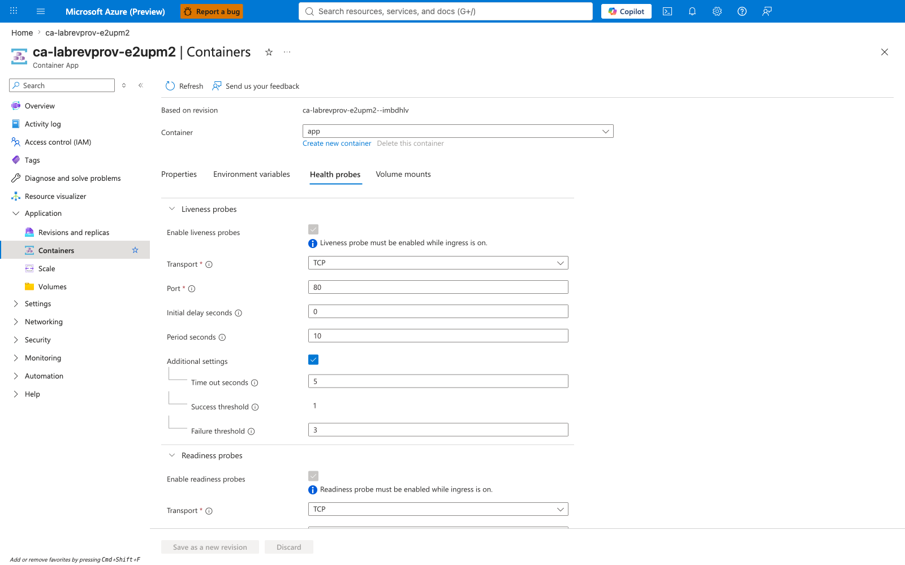

#### Failure state

[Observed] After the trigger applies the bad startup probe, the **Overview** blade now shows the failed revision and the `Revisions with Issues` tab highlights `ca-labrevprov-e2upm2--badpath2`.

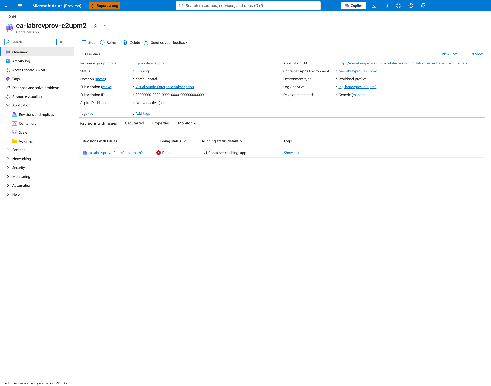

[Observed] **Revisions and replicas** grid showing two active revisions: `badpath2` (`Failed`, `Unhealthy`, `0/1 replicas`, traffic configured at 100%) and `badpath` (`Healthy`, `0% traffic`).

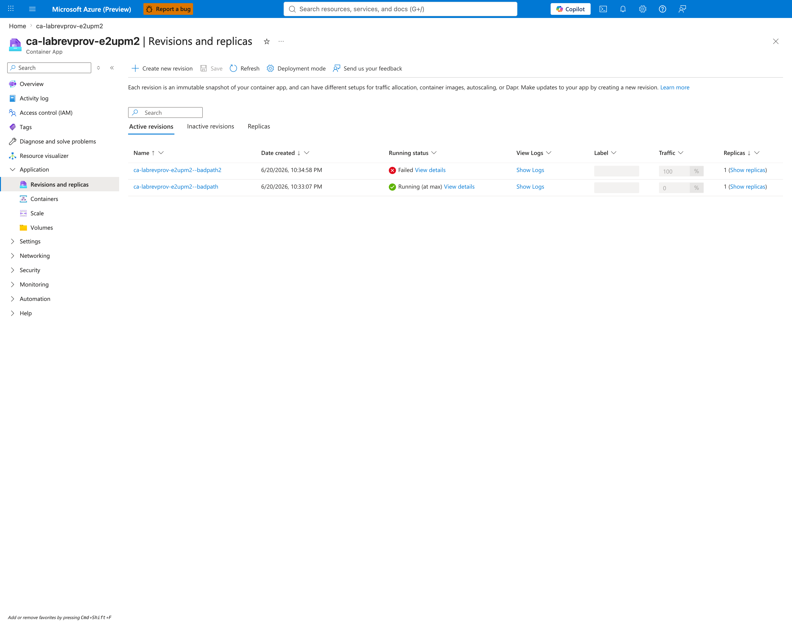

[Observed] Revision detail flyout for `badpath2` showing `Health state: Unhealthy`, `Provisioning state: Failed`, `Running status: Container crashing: app`.

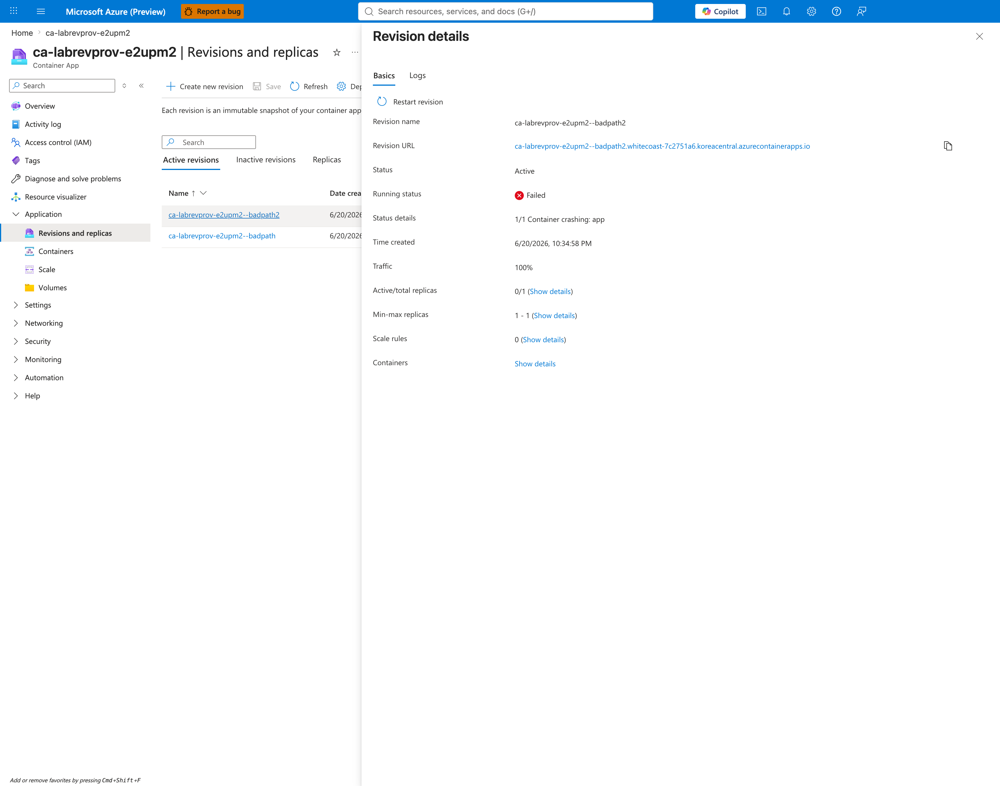

[Observed] Revision detail **Logs** tab on the failed revision with **Real-time + Application** selected shows the empty state `No replica running — Try selecting Historical display option`. The failing container is never alive long enough for the realtime stream to attach to a replica, which itself is diagnostic evidence of the restart loop.

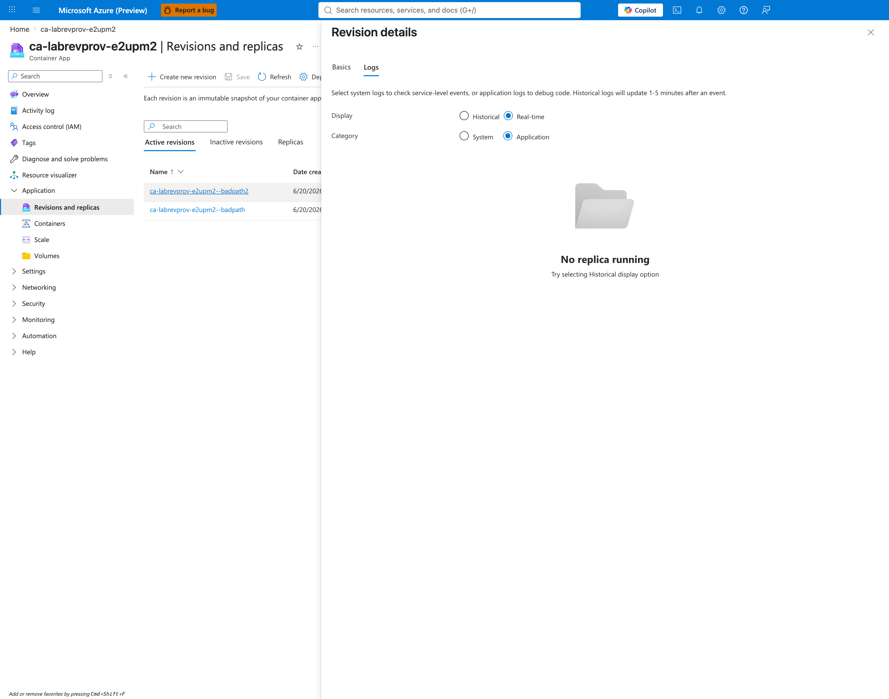

[Inferred] When investigators see this empty state on a known-failing revision, the next click should be **Historical** (capture 16) — that pane carries the actual `ProbeFailed → ContainerTerminated(ProbeFailure)` evidence emitted by the platform's system log channel.

[Observed] **Historical System logs** for the failed revision showing the complete `ProbeFailed → ContainerTerminated(ProbeFailure)` cascade across multiple restart attempts.

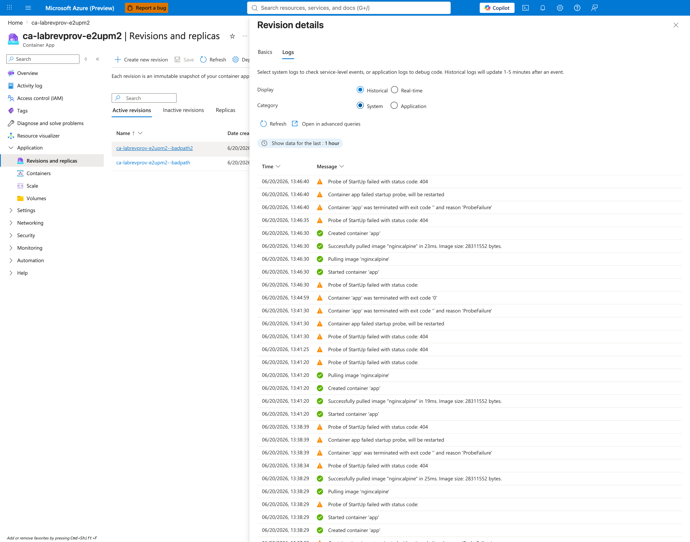

[Strongly Suggested] This is the **gold-standard smoking gun** for revision provisioning failure caused by probe misconfiguration. The `ProbeFailed` → `ContainerTerminated(ProbeFailure)` sequence directly attributes the container termination to the probe failure, ruling out OOM, exit code, image pull, scaling, or network as root causes.

[Observed] **Containers** blade showing the failed revision with `nginx:alpine` image.

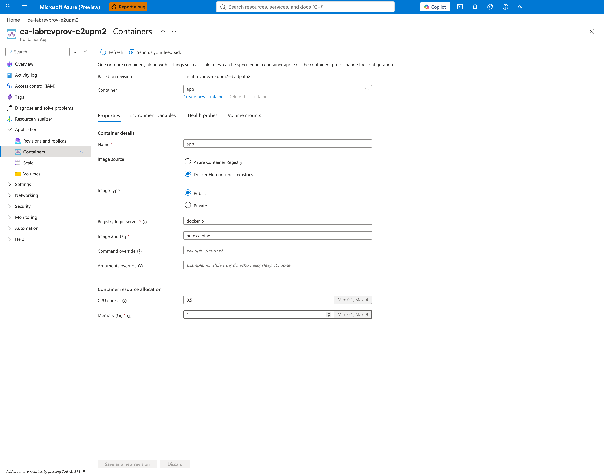

[Observed] **Containers → Health Probes** tab on revision `badpath2` shows the **Liveness** probe (TCP, port 80, failure threshold 3) and **Readiness** probe (TCP, port 80, failure threshold 48) inherited from the baseline, plus the **Startup probes** section header with **Enable Startup probes** checked — confirming a Startup probe was added by the trigger. The Startup probe's path/port/threshold fields are below the visible fold; the configured path (`/nonexistent-health-endpoint`) is captured separately in the trigger script and the corresponding ARM payload.

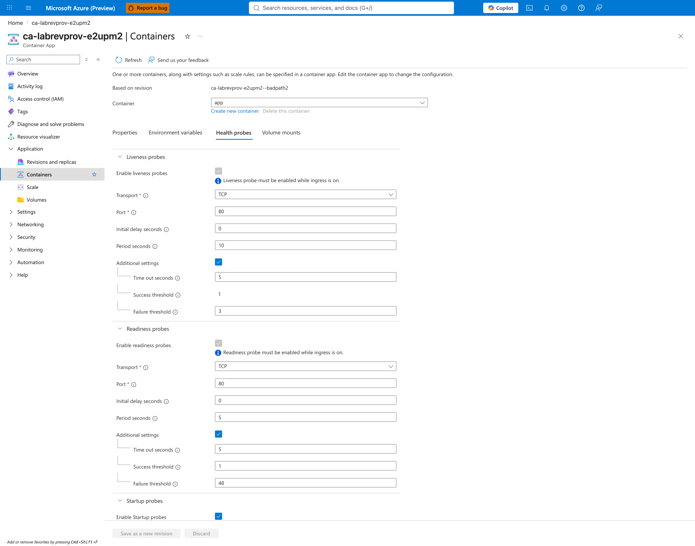

[Inferred] Even with the Startup probe details below the fold, this view is the **fastest configuration-level confirmation path** — the presence of an Enabled Startup probes section on a revision that previously had none (capture 11) is itself the configuration delta that introduced the failure. Combined with the realtime log stream evidence (captures 19 and 20), the investigator can confirm root cause within 60 seconds.

#### Log evidence (Portal Log Stream)

[Observed] **Application Log Stream** captured during the restart loop shows the nginx graceful-shutdown sequence on the failing replica: `signal 3 (SIGQUIT) received, shutting down`, `worker process 30..33 exited with code 0`, `signal 17 (SIGCHLD) received` from each worker. The probe-induced 404 responses arrive between SIGTERM cycles and are captured in the Log Analytics `ContainerAppConsoleLogs_CL` table (see Falsification subsection below and `labs/revision-provisioning-failure/evidence/10-kql-console-logs.json` for the full nginx 404 + SIGCHLD trail).

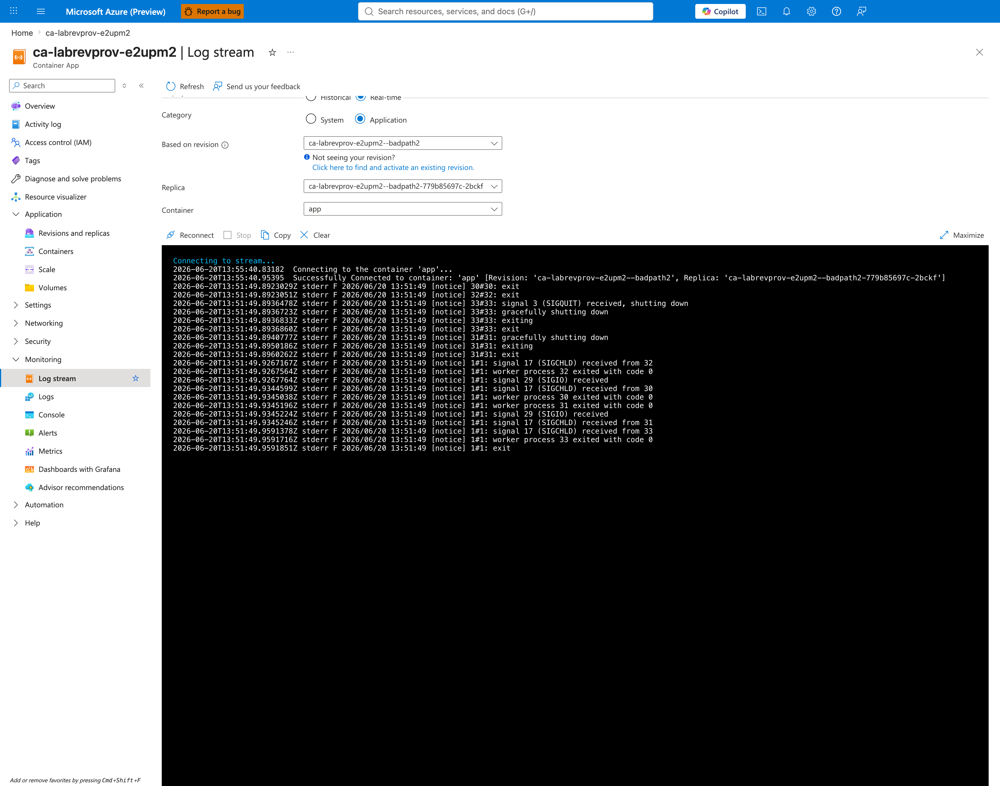

[Strongly Suggested] The nginx graceful-shutdown trail (SIGQUIT followed by per-worker exits) is **direct evidence** that the platform IS killing the container — not that the container is crashing on its own. This rules out application crashes, OOM, and segfaults; the container's process tree is being torn down externally by the kubelet in response to consecutive probe failures.

[Observed] **System Log Stream** in realtime showing platform-emitted lifecycle events as the kubelet kills and recreates the container repeatedly: `Reason=ProbeFailed`, `Reason=Killing`, `Reason=ContainerTerminated`.

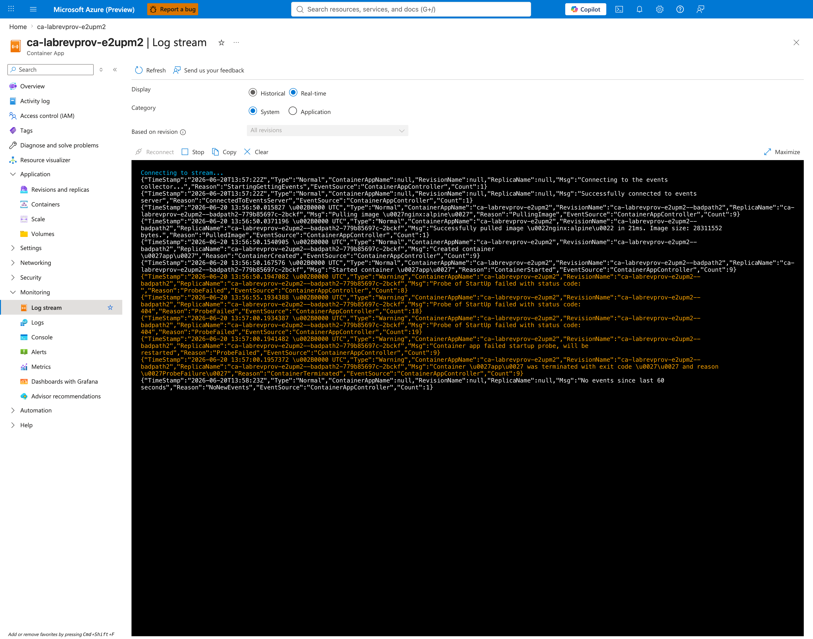

#### Activity Log

[Observed] **Activity log** entries showing the `Create or Update Container App` deployment events from the trigger script and the recovery patch.

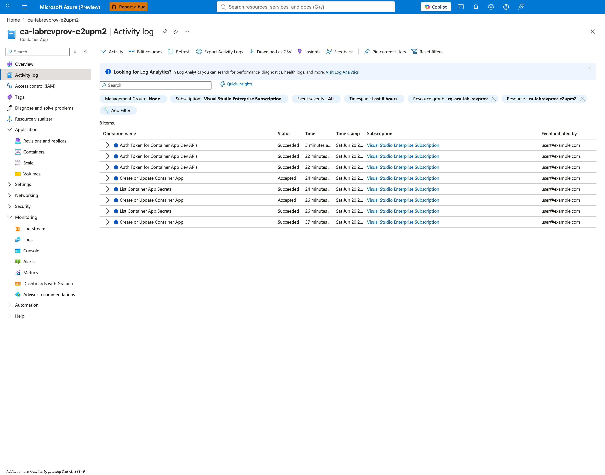

#### Diagnose and solve problems

[Observed] **Diagnose and solve problems** landing blade showing all troubleshooting category tiles.

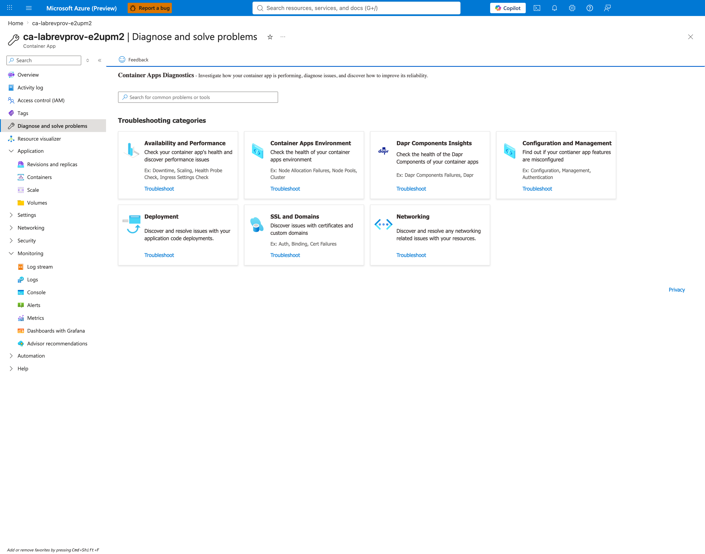

[Observed] **Availability and Performance** category showing the full list of detectors that apply to Container Apps runtime issues.

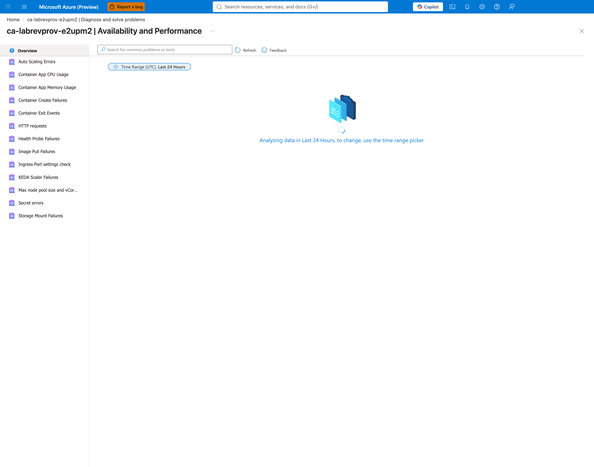

[Observed] **Container Exit Events** detector summary cards showing `Container Exits: 1 exit event(s)`, `Backoff-Restarts: None detected`, and `Port Mismatch: No mismatch`, plus the Microsoft-managed assessment `Health probes causing container restarts` with the recommended action pointing to the Health Probe Failures detector. The Container Exits drilldown tab and exit-code chart are below the fold of this capture; the explicit per-restart counts are in capture 26.

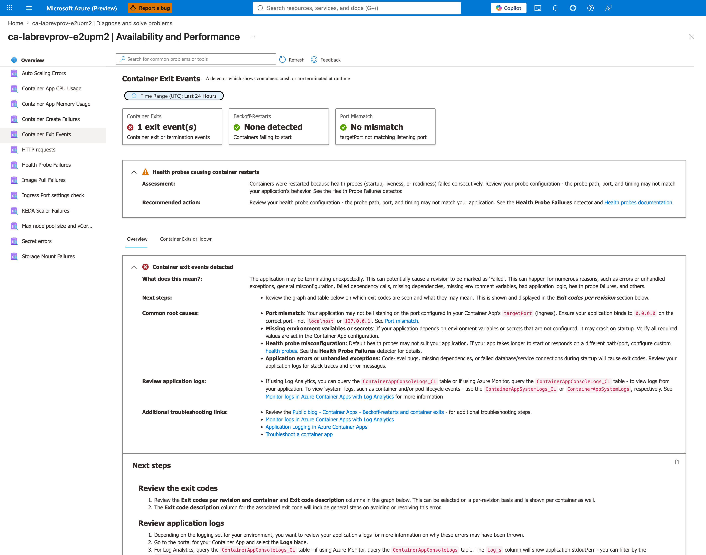

[Observed] **Container Create Failures** detector showing checks executed against the failing revision.

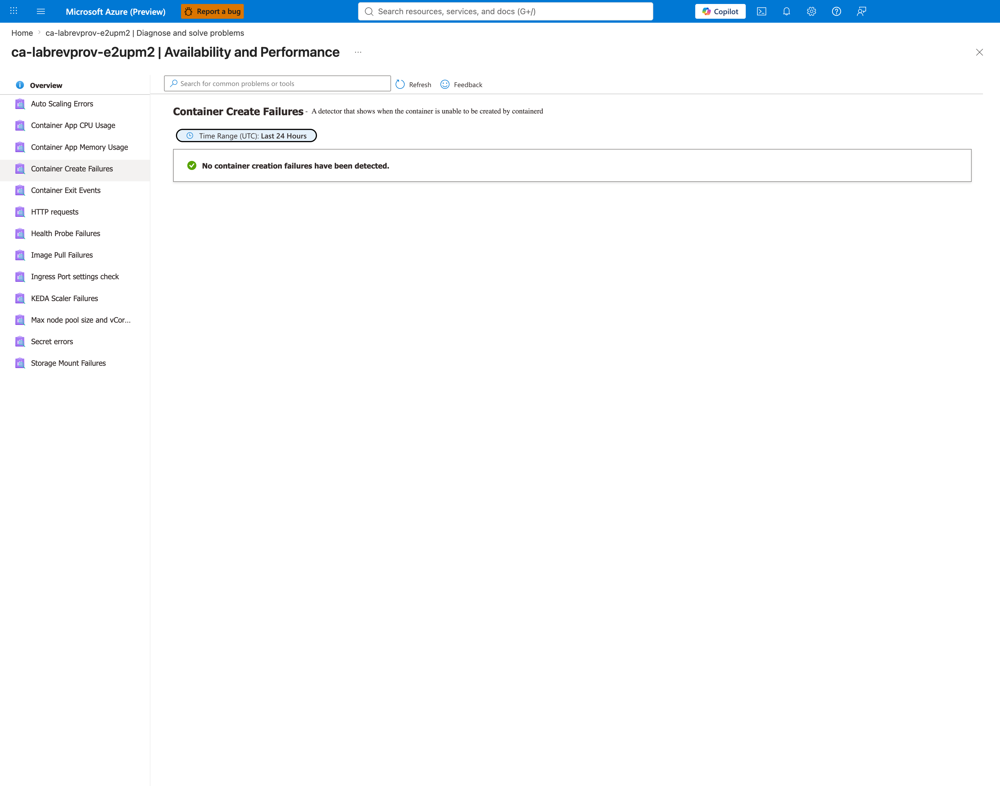

[Observed] **Health Probe Failures** detector — the most directly applicable detector for this failure mode — visible above the fold shows the app-level summary header `Probe failures restarted container(s) 4 time(s) in this window — availability is impacted`, with `Total probe failure events: 36 over 23.8h (~2/hr)` and `Default probes in use: No — explicit probes are defined`. Per-revision attribution to `badpath2` is confirmed by the KQL evidence below (capture 39) and the raw artifact `labs/revision-provisioning-failure/evidence/10-kql-console-logs.json`, not by this above-the-fold view alone — the `Per revision` tab is available in this blade but is not the active tab in this capture.

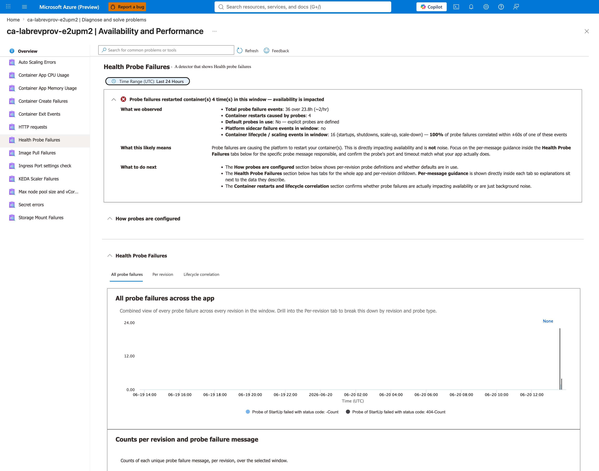

[Observed] **Image Pull Failures** detector showing no image pull failures — ruling out image pull as the root cause and isolating the issue to probe failure (not image registry, ACR pull credentials, or network).


[Inferred] The detector panel acts as a **structured triage tool** — checking all detectors at once gives the investigator a Microsoft-recommended elimination path: rule out image pull, scaling, and port mismatch first, then drill into probe configuration.

#### Metrics

[Observed] **Metrics** blade overview showing the available Container Apps platform metrics.

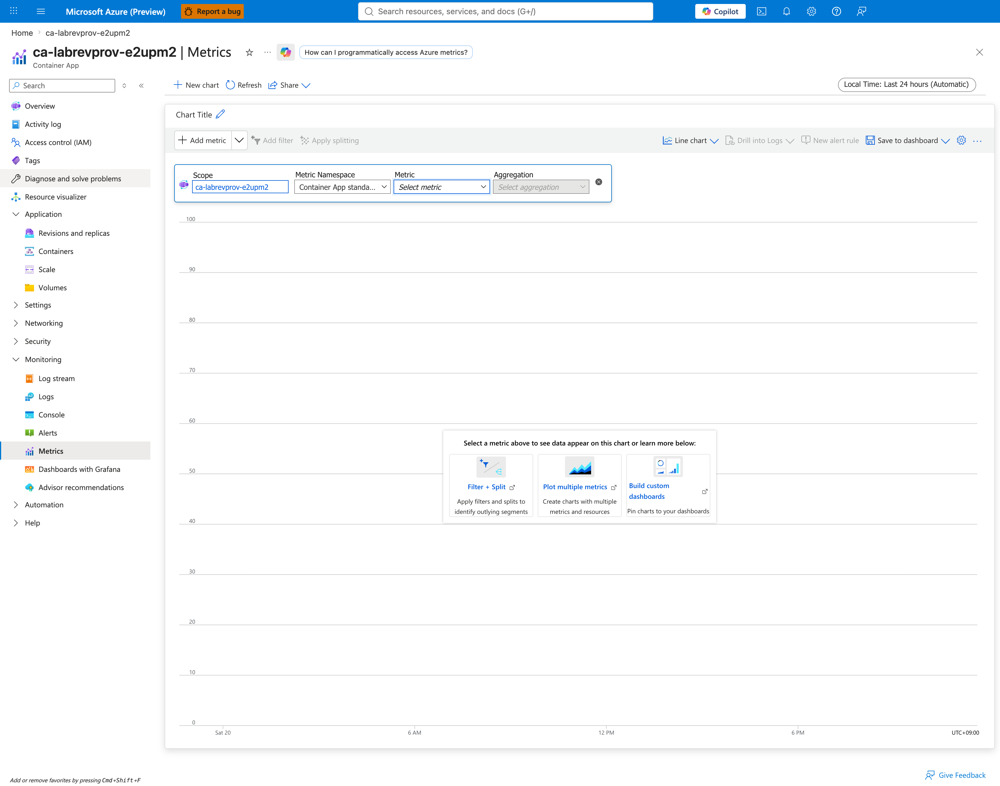

[Observed] **Replica count** metric (Max aggregation, Last 24 hours, 5-minute granularity) showing the max replica count flat at `0` for most of the window, then rising to `1` near the reproduction period — evidence that the platform did create a replica, although this Max-aggregated view smooths over the restart cycles. Per-restart visibility lives in the `ContainerAppSystemLogs_CL` event stream (captures 30, 31, 33) and in the Container Exit Events detector (capture 24), not in this chart.

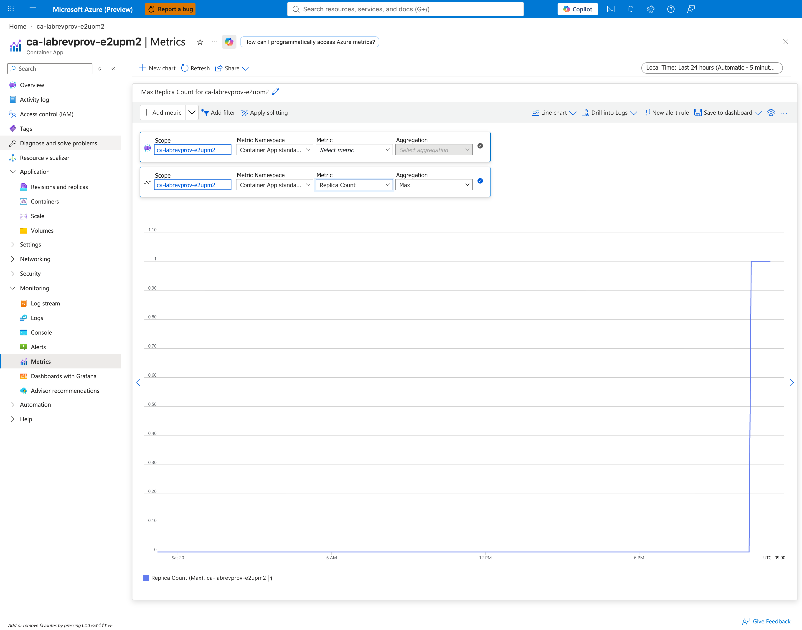

#### KQL evidence (Log Analytics)

[Observed] **KQL query** in Logs blade querying `ContainerAppSystemLogs_CL` for `Reason_s == "ProbeFailed"` returns 56 ProbeFailed events with `Log_s` showing `"HTTP probe failed with status code: 404"`.

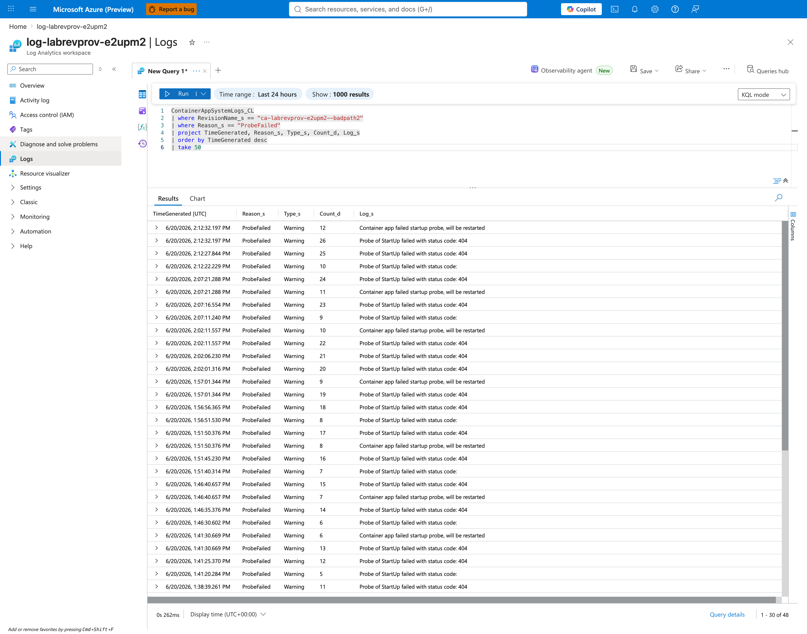

[Observed] **KQL event correlation query** showing the full lifecycle sequence across `ContainerCreated → PullingImage → ContainerStarted → ProbeFailed → ContainerTerminated` over a 14-iteration restart loop.

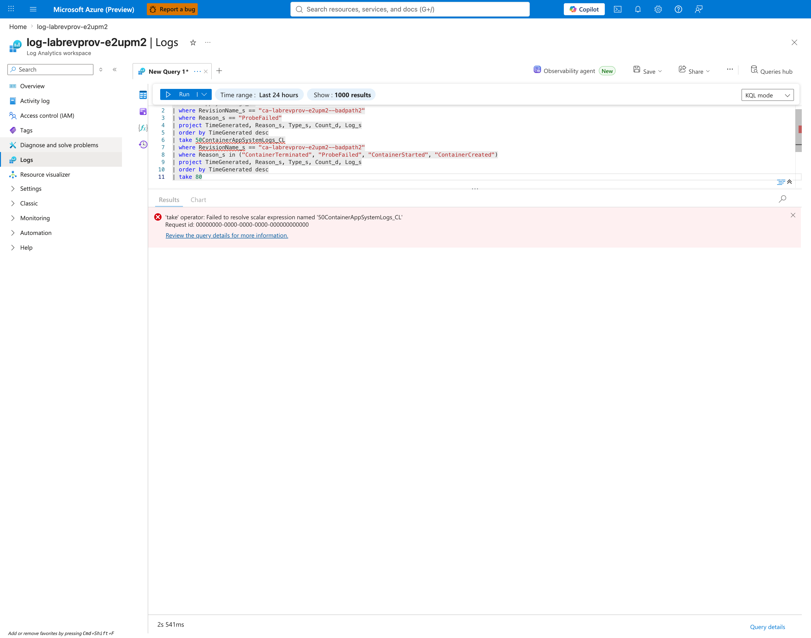

[Observed] **KQL editor pitfall** captured when two stacked queries were submitted in a single tab without a blank line separator — the Logs editor concatenates them and rejects the merged input with `A syntax error has been identified in the query. Query could not be parsed at 'ContainerAppConsoleLogs_CL' on line [10,30]`. The screenshot is preserved here as a teaching example for the most common Logs-blade authoring mistake; the **actual application-level evidence** (nginx 404 access logs and SIGCHLD trail) was collected via the Azure CLI and saved verbatim to [`labs/revision-provisioning-failure/evidence/10-kql-console-logs.json`](https://github.com/yeongseon/azure-container-apps-practical-guide/blob/main/labs/revision-provisioning-failure/evidence/10-kql-console-logs.json).


[Strongly Suggested] The raw evidence file is the **application-level smoking gun**: it contains the nginx access-log entries `"GET /nonexistent-health-endpoint HTTP/1.1" 404 153`, the matching nginx error-log entries `open() "/usr/share/nginx/html/nonexistent-health-endpoint" failed (2: No such file or directory)`, and the graceful-shutdown SIGCHLD trail per worker. This proves the container is alive, accepting connections, and processing probe requests — but responding `404 Not Found` because the startup-probe path does not exist on disk. The diagnostic distinction matters: this is NOT a "container dead" failure; it is a "container alive but probe contract violated" failure. Authoring tip: when chaining multiple table queries in one Logs tab, separate them with a blank line so the editor treats each block as an independent query, or open a second tab.

[Observed] **KQL summary by reason** showing the restart loop pattern: 14 each of `ContainerCreated`, `PullingImage`, `ContainerStarted`, plus 56 `ProbeFailed` events (= 4 probe attempts per restart x 14 restarts).

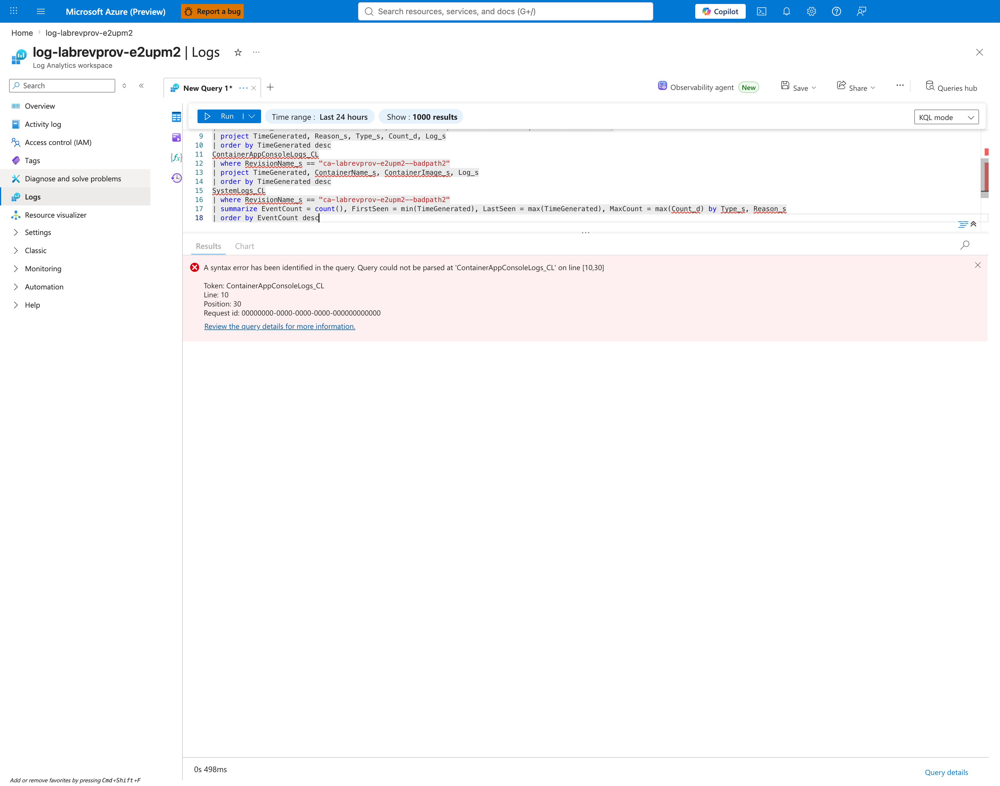

#### Falsification (KQL)

[Observed] **KQL falsification query** filtering to the **previously healthy** `badpath` revision shows ZERO `ProbeFailed` events — proving the failure is revision-scoped, not environment-scoped.

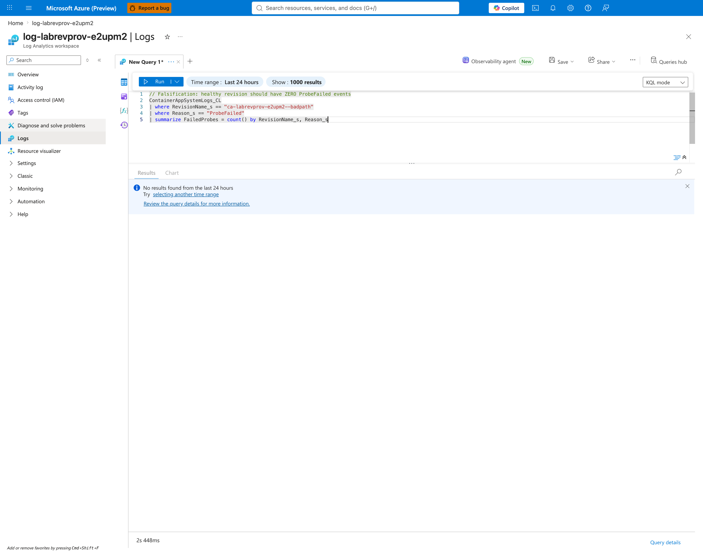

[Inferred] Falsifying the alternative hypothesis ("the environment itself is broken") confirms the failure mode is **isolated to the misconfigured probe on the new revision**. The environment is healthy; only the new revision's probe path is wrong.

[Observed] **KQL timechart** rendering of probe failures over time showing the bursting pattern of probe failures every ~5 seconds (matching `periodSeconds=5`).

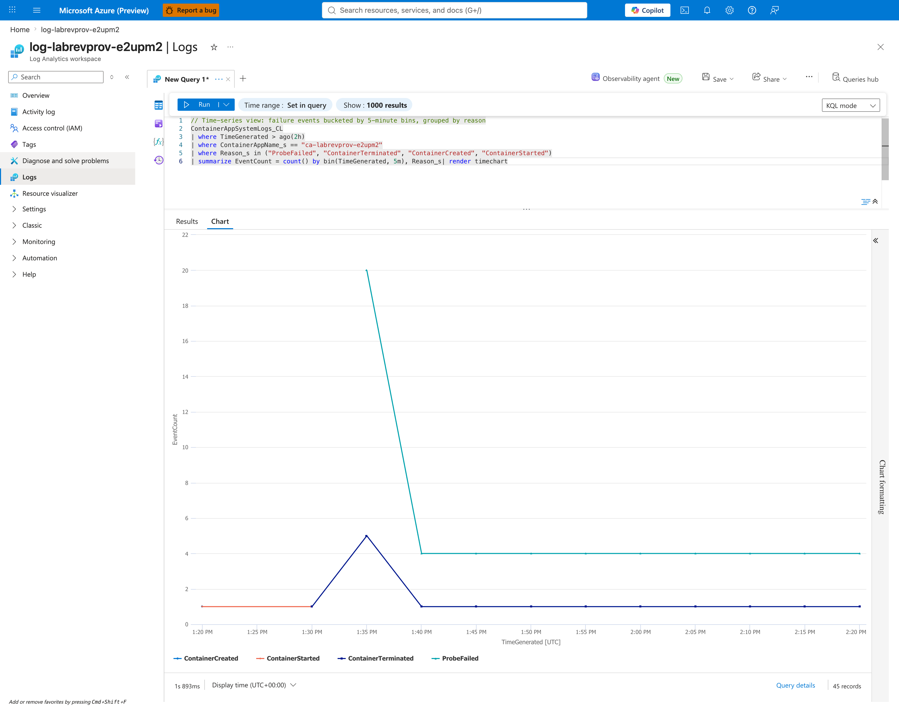

#### Recovery (post-fix evidence)

[Observed] After applying the recovery YAML patch (`az containerapp update --yaml`) with corrected probe path `/`, the **Overview** blade shows `Status: Running` and a new healthy revision `badpath3`.

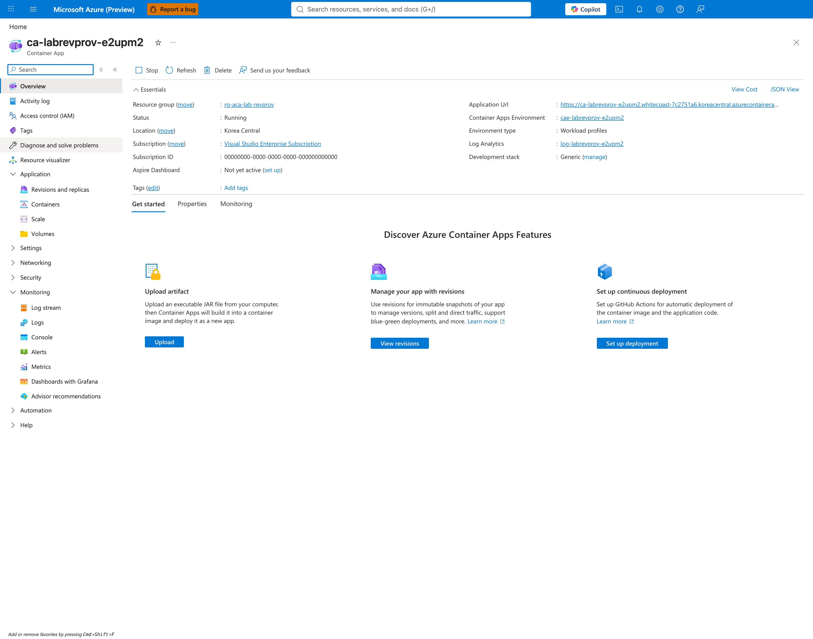

[Observed] **Revisions and replicas** grid showing `badpath3` as the new active revision: `Healthy`, `Provisioned`, `1/1 replicas`, `100% traffic`. The previously failed `badpath2` revision is auto-deactivated.

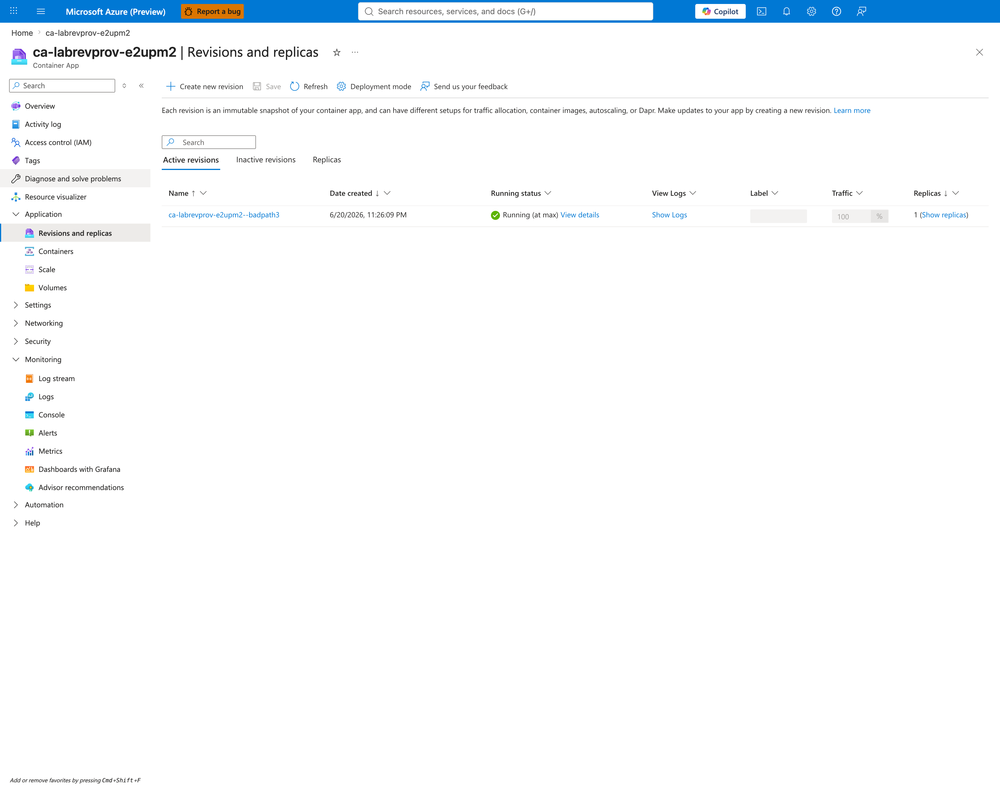

[Observed] **Log stream** after recovery with `Category: Application` selected and `Based on revision: ca-labrevprov-e2upm2--badpath3`, showing clean nginx startup output (epoll event method, worker processes 30–33 started) and a single successful probe request `"GET / HTTP/1.1" 200 896` — no 404s, no SIGCHLD, no worker process exits. The probe is succeeding at `/` (nginx default index page returns 200 OK).

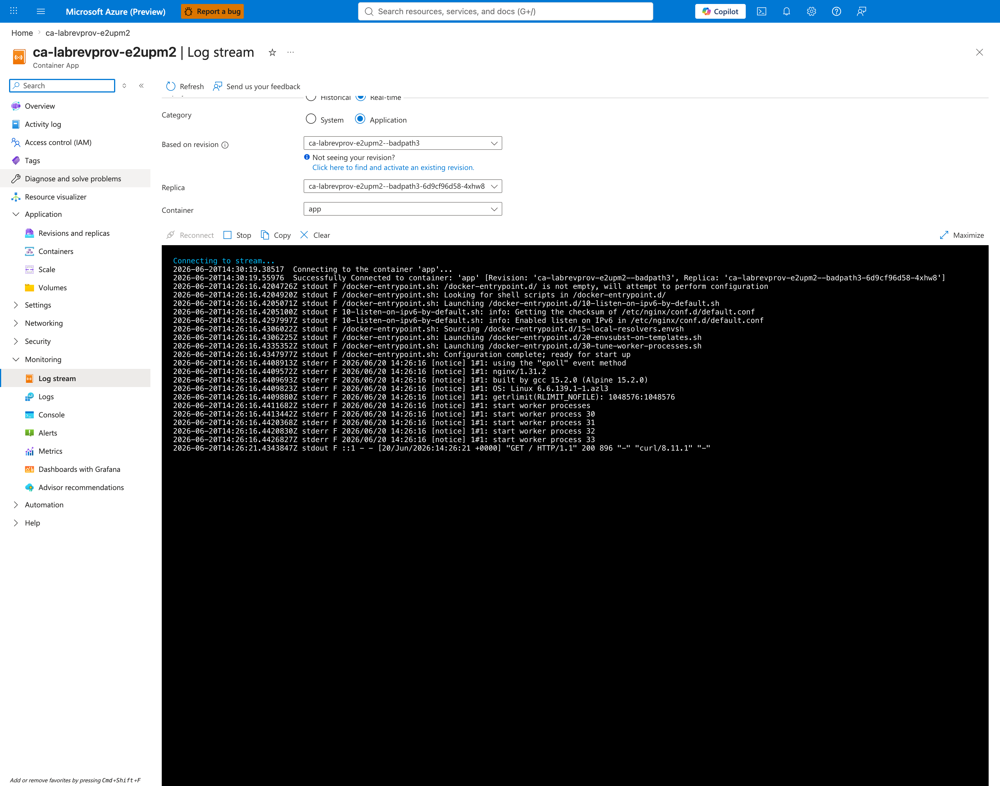

[Observed] **KQL post-fix verification query** summarizing `ProbeFailed`, `ContainerStarted`, and `ContainerTerminated` counts per revision. The recovered revision `ca-labrevprov-e2upm2--badpath3` shows `ProbeFailed=0`, `ContainerStarted=1`, `ContainerTerminated=0`, while the failed revision `ca-labrevprov-e2upm2--badpath2` retains `ProbeFailed=56`, `ContainerStarted=14`, `ContainerTerminated=14` from the reproduction window. The two pre-existing healthy revisions (`badpath`, `imbdhlv`) each show `ProbeFailed=0` — confirming the probe-failure mode is isolated to `badpath2`.

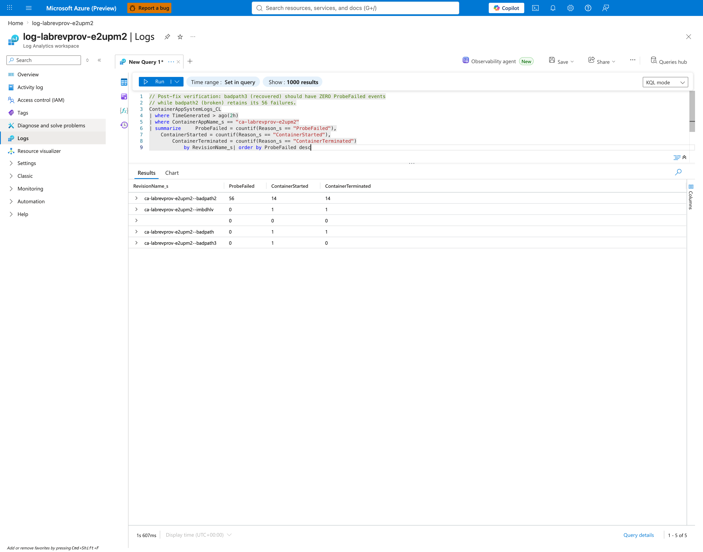

[Observed] **Container Exit Events detector — Container Exits drilldown tab** showing the historical exit events still visible from `badpath2` in the 24-hour window, but NO new exit events from `badpath3`.

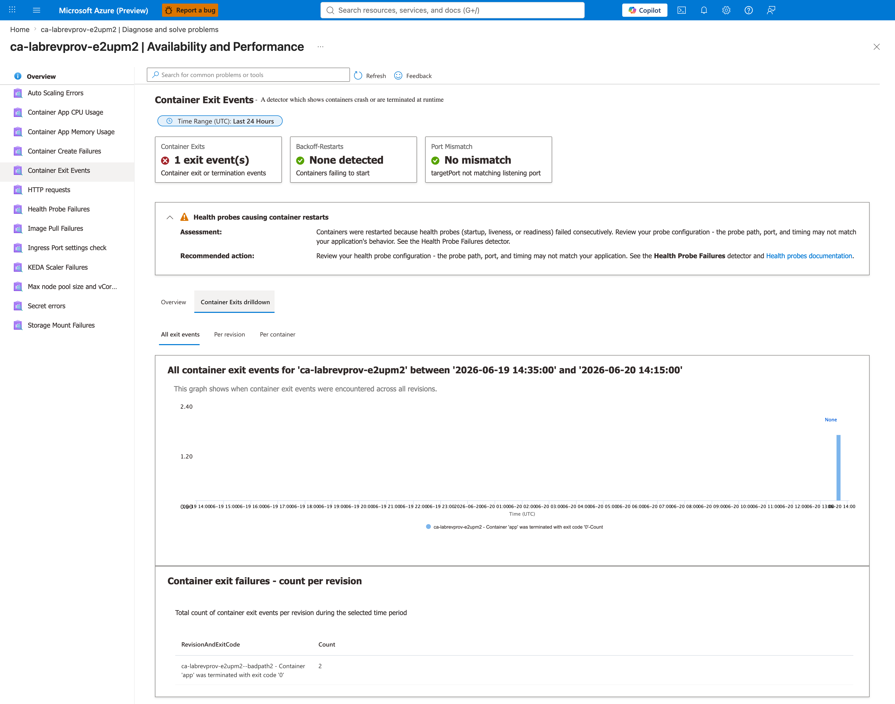

[Strongly Suggested] The recovery sequence (captures 36-40) **falsifies the original failure hypothesis in reverse**: by changing only the startup probe path (everything else identical: same nginx:alpine image, same resource limits, same environment), the revision becomes Healthy. This causal isolation confirms the startup probe path was the sole root cause.

### Operator Takeaway

For this failure mode (revision provisioning failure due to misconfigured startup probe):

1. **First diagnosis stop**: Overview blade -> `Revisions with Issues` tab — see the failing revision name within seconds.
2. **Configuration verification**: Containers -> Health Probes tab — confirms the bad probe path or port in plain text.
3. **Application-level proof**: Log Stream -> Application — shows the live HTTP requests from the kubelet probe and the application's responses (404 here).
4. **Platform-level proof**: Log Stream -> System — shows `ProbeFailed -> ContainerTerminated(ProbeFailure)` cascade.
5. **Historical proof for tickets**: Log Analytics KQL — `ContainerAppSystemLogs_CL | where Reason_s == "ProbeFailed"`.
6. **Microsoft-managed triage**: Diagnose and solve problems -> Availability and Performance -> Health Probe Failures detector.

### Support Takeaway

For support engineers handling tickets where a customer reports "my new revision keeps failing":

1. Ask: "What changed in the most recent deployment? Specifically, did you add or modify a health probe?"
2. Have the customer share the output of: `az containerapp revision show --name <revision-name> --resource-group <rg> --query "properties.template.containers[].probes"`.
3. If a startup probe is configured, verify the `path` returns 200 by exec-ing into the container or running the equivalent HTTP request against the app's container port from a co-located test container.
4. Recovery: provide the customer with the corrected probe YAML or instruct them to remove the probe via the Portal Containers blade.

## Clean Up

```bash
az group delete --name "$RG" --yes --no-wait
```

| Command | Why it is used |
|---|---|
| `az group delete ...` | Removes the lab resource group and its contained resources. |

## Related Playbook

- [Probe Failure and Slow Start](../playbooks/startup-and-provisioning/probe-failure-and-slow-start.md)

## See Also

- [Probe and Port Mismatch Lab](./probe-and-port-mismatch.md) — covers app-port mismatch; this lab covers startup-probe endpoint mismatch (bad path or bad port)
- [Container Start Failure Playbook](../playbooks/startup-and-provisioning/container-start-failure.md)

## Sources

- [Health probes in Azure Container Apps](https://learn.microsoft.com/en-us/azure/container-apps/health-probes)
- [Revisions in Azure Container Apps](https://learn.microsoft.com/en-us/azure/container-apps/revisions)
