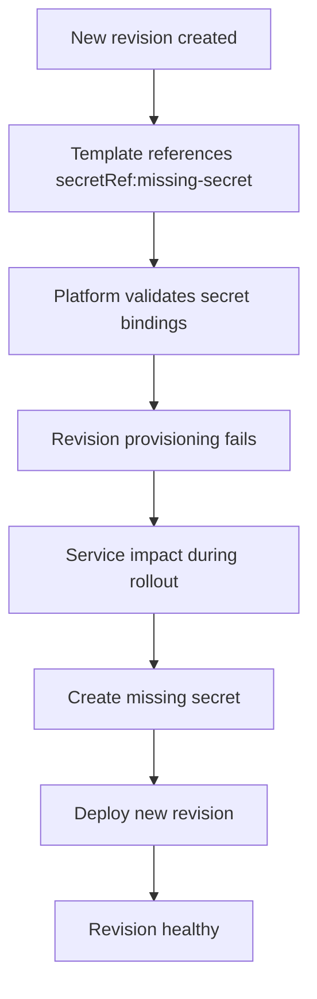

# Revision Provisioning Failure Lab

Reproduce provisioning failure when a container environment variable references a non-existent secret.

## Scenario

- **Difficulty**: Intermediate
- **Estimated duration**: 20-30 minutes
- **Failure mode**: revision fails because `secretRef` points to `missing-secret`

## Prerequisites

- Azure CLI with Container Apps extension
- Permissions to deploy Container Apps resources

```bash
az extension add --name containerapp --upgrade
az login
```

## Quick Start

```bash
export RG="rg-aca-lab-revprov"
export LOCATION="koreacentral"

az group create --name "$RG" --location "$LOCATION"
az deployment group create --name "lab-revprov" --resource-group "$RG" --template-file ./labs/revision-provisioning-failure/infra/main.bicep --parameters baseName="labrevprov"

export APP_NAME="$(az deployment group show --resource-group "$RG" --name "lab-revprov" --query \"properties.outputs.containerAppName.value\" --output tsv)"

cd labs/revision-provisioning-failure
./trigger.sh
./verify.sh
./cleanup.sh
```

## Expected Diagnostic Output Pattern

```text
ContainerAppUpdate  → Updating containerApp: ca-myapp
RevisionCreation    → Creating new revision
ProbeFailed         → Probe of StartUp failed with status code: 1
RevisionReady       → Revision ready
ContainerAppReady   → Running state reached
```

## Key Takeaways

- Missing secret references can block revision provisioning even when image/runtime are valid.
- Revision-level health and system logs reveal configuration failures quickly.
- Add missing secret, then roll a new revision to validate recovery.

## See Also

- [Revision Provisioning Failure Playbook](../playbooks/startup-and-provisioning/revision-provisioning-failure.md)
- [Container Start Failure Playbook](../playbooks/startup-and-provisioning/container-start-failure.md)

## Scenario Setup

This lab introduces a configuration error where an environment variable uses `secretRef` for a secret that does not exist. The new revision fails provisioning until the missing secret is created.



!!! warning "Configuration failures can mimic runtime issues"
    If provisioning fails before the container starts, focus on revision configuration and secrets rather than application code first.

!!! tip "Keep a secret naming standard"
    Consistent secret keys across environments reduce typo-driven failures during deployments.

## Step-by-Step Walkthrough

1. **Create resource group and deploy lab infrastructure**

   ```bash
   export RG="rg-aca-lab-revprov"
   export LOCATION="koreacentral"
   az group create --name "$RG" --location "$LOCATION"

   az deployment group create \
     --name "lab-revprov" \
     --resource-group "$RG" \
     --template-file "./labs/revision-provisioning-failure/infra/main.bicep" \
     --parameters baseName="labrevprov"
   ```

   Expected output pattern: deployment operation `Succeeded`.

2. **Capture app and environment outputs**

   ```bash
   export APP_NAME="$(az deployment group show --resource-group "$RG" --name "lab-revprov" --query "properties.outputs.containerAppName.value" --output tsv)"
   export ENVIRONMENT_NAME="$(az deployment group show --resource-group "$RG" --name "lab-revprov" --query "properties.outputs.containerAppsEnvironmentName.value" --output tsv)"
   ```

   Expected output: no output.

3. **Trigger failing revision**

   ```bash
   ./labs/revision-provisioning-failure/trigger.sh
   az containerapp revision list --name "$APP_NAME" --resource-group "$RG" --output table
   ```

   Expected output pattern: latest revision health/provisioning state indicates failure.

4. **Inspect revision and system events**

   ```bash
   az containerapp logs show \
     --name "$APP_NAME" \
     --resource-group "$RG" \
     --type system
   ```

   Expected evidence: errors related to missing secret reference or invalid env binding.

5. **Review configured secrets on app**

   ```bash
   az containerapp secret list \
     --name "$APP_NAME" \
     --resource-group "$RG" \
     --output table
   ```

   Expected output pattern: referenced secret key is absent before fix.

6. **Create missing secret and redeploy revision**

   ```bash
   az containerapp secret set \
     --name "$APP_NAME" \
     --resource-group "$RG" \
     --secrets "missing-secret=demo-safe-value"

   az containerapp update \
     --name "$APP_NAME" \
     --resource-group "$RG" \
     --set-env-vars "REQUIRED_CONFIG=secretref:missing-secret"
   ```

   Expected output pattern: update operation succeeds and a new revision is created.

7. **Verify healthy revision and app behavior**

   ```bash
   ./labs/revision-provisioning-failure/verify.sh
   az containerapp revision list --name "$APP_NAME" --resource-group "$RG" --output table
   ```

   Expected output: a `Healthy` active revision with expected running state.

## Symptoms / Cause / Fix Matrix

| What you see | What is happening | How to fix |
|---|---|---|
| Revision fails during provisioning | Required `secretRef` points to non-existent secret | Create the missing secret key and redeploy |
| No useful app console logs | Container never fully starts | Inspect revision events and system logs first |
| Recovery attempt still fails | Secret key name mismatch | Ensure env var references exact secret key |
| Previous revision still serves traffic | Latest rollout failed but old revision remains active | Fix config and promote a new healthy revision |

## Resolution Verification Checklist

1. `az containerapp secret list` includes the required key.
2. New revision is created after secret/config update.
3. Latest revision reports `Healthy`.
4. Verification script passes without provisioning errors.

## Sources

- [Microsoft Learn: Manage secrets in Azure Container Apps](https://learn.microsoft.com/azure/container-apps/manage-secrets)
- [Microsoft Learn: Troubleshooting revisions in Azure Container Apps](https://learn.microsoft.com/azure/container-apps/revisions)
