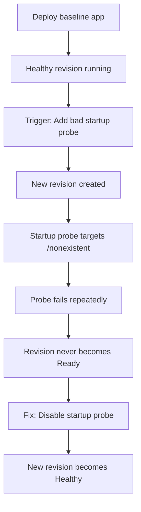

---
content_sources:
diagrams:
  - id: architecture
    type: flowchart
    source: mslearn-adapted
    based_on:
      - https://learn.microsoft.com/azure/container-apps/health-probes
      - https://learn.microsoft.com/azure/container-apps/revisions
content_validation:
  status: pending_review
  last_reviewed: "2026-04-29"
  reviewer: ai-agent
  lab_validation:
    status: reproduced
    tested_date: 2026-04-29
    az_cli_version: "2.70.0"
    notes: "ProbeFailed + ContainerTerminated(ProbeFailure) + revision Failed confirmed"

  core_claims:
    - claim: "Azure Container Apps supports startup probes to check whether a containerized app has started successfully."
      source: "https://learn.microsoft.com/azure/container-apps/health-probes"
      verified: true
    - claim: "In Azure Container Apps, revisions are immutable snapshots of a container app version."
      source: "https://learn.microsoft.com/azure/container-apps/revisions"
      verified: true
---

# Revision Provisioning Failure Lab

Reproduce a revision that is created but never becomes ready due to startup probe misconfiguration.

## Lab Metadata

| Attribute | Value |
|---|---|
| Difficulty | Intermediate |
| Estimated Duration | 20-30 minutes |
| Tier | Consumption |
| Failure Mode | Revision created but startup probe fails repeatedly |
| Skills Practiced | Revision diagnostics, probe configuration, system log analysis |

## 1) Background

This lab demonstrates what happens when a revision is accepted by the Azure Container Apps control plane but never stabilizes. The trigger misconfigures a startup probe to target a non-existent path, causing the probe to fail repeatedly. The revision exists and containers may start, but the platform marks the revision as unhealthy because it never passes the startup probe.

This pattern is distinct from API validation failures (which reject the update before creating a revision) and from port mismatches (covered in a separate lab).

### Architecture

<!-- diagram-id: architecture -->


!!! warning "Revision created ≠ Revision ready"
    A revision can exist in the system but remain in a Failed or Degraded state if health probes never pass. Always check revision health state, not just existence.

!!! note "API validation vs runtime failure"
    Some configuration errors (like referencing a non-existent secret) are now rejected at the API layer with `ContainerAppSecretRefNotFound`. This lab focuses on errors that pass API validation but fail at runtime.

## 2) Hypothesis

**IF** a startup probe is configured to target a path that returns 404 or times out, **THEN** the revision will be created but never become ready, and system logs will show `ProbeFailed` events until the probe configuration is fixed.

| Variable | Control State | Experimental State |
|---|---|---|
| Startup probe path | Not configured or valid path | `/nonexistent` (returns 404) |
| Latest revision health | `Healthy` | `Degraded` or `Failed` |
| System logs | Normal startup events | `ProbeFailed` events |
| Recovery path | No action required | Disable startup probe and deploy new revision |

## 3) Runbook

### Deploy baseline infrastructure

Prerequisites:

- Azure CLI with the Container Apps extension
- Permissions to deploy Container Apps resources

```bash
az extension add --name containerapp --upgrade
az login

export RG="rg-aca-lab-revprov"
export LOCATION="koreacentral"

az group create --name "$RG" --location "$LOCATION"

az deployment group create \
    --name "lab-revprov" \
    --resource-group "$RG" \
    --template-file "./labs/revision-provisioning-failure/infra/main.bicep" \
    --parameters baseName="labrevprov"
```

Expected output:

- Resource group creation succeeds.
- Deployment completes with `Succeeded` state.

### Capture deployment outputs

```bash
export APP_NAME="$(az deployment group show \
    --resource-group "$RG" \
    --name "lab-revprov" \
    --query "properties.outputs.containerAppName.value" \
    --output tsv)"

export ENVIRONMENT_NAME="$(az deployment group show \
    --resource-group "$RG" \
    --name "lab-revprov" \
    --query "properties.outputs.environmentName.value" \
    --output tsv)"
```

### Verify baseline health

```bash
az containerapp revision list \
    --name "$APP_NAME" \
    --resource-group "$RG" \
    --output table
```

Expected output:

```text
CreatedTime                Active    Replicas    TrafficWeight    HealthState    ProvisioningState    Name
-------------------------  --------  ----------  ---------------  -------------  -------------------  ---------------------------
2026-04-06T12:00:00+00:00  True      1           100              Healthy        Provisioned          ca-labrevprov-xxxxx--abc123
```

### Trigger the failure

```bash
./labs/revision-provisioning-failure/trigger.sh
```

The trigger script adds a startup probe targeting a non-existent path:

```bash
az containerapp update \
    --name "$APP_NAME" \
    --resource-group "$RG" \
    --set-env-vars "PROBE_TRIGGER=$(date +%s)" \
    --container-name app \
    --startup-probe-path "/nonexistent-health-endpoint" \
    --startup-probe-port 80 \
    --startup-probe-failure-threshold 3 \
    --startup-probe-period-seconds 5
```

### Observe the failure

```bash
az containerapp revision list \
    --name "$APP_NAME" \
    --resource-group "$RG" \
    --output table
```

Expected output shows the new revision in a non-Healthy state:

```text
CreatedTime                Active    Replicas    TrafficWeight    HealthState    ProvisioningState    Name
-------------------------  --------  ----------  ---------------  -------------  -------------------  ---------------------------
2026-04-06T12:05:00+00:00  True      0           100              Degraded       Provisioned          ca-labrevprov-xxxxx--def456
2026-04-06T12:00:00+00:00  False     1           0                Healthy        Provisioned          ca-labrevprov-xxxxx--abc123
```

Check system logs for probe failures:

```bash
az containerapp logs show \
    --name "$APP_NAME" \
    --resource-group "$RG" \
    --type system \
    --tail 30
```

Expected log evidence:

```text
Reason_s             Log_s
-------------------  -----------------------------------------------------------------
ProbeFailed          Startup probe failed: HTTP probe failed with status code: 404
ContainerRestart     Container 'app' was restarted
```

### Fix the issue

Remove the bad probe configuration by deploying without the startup probe:

```bash
./labs/revision-provisioning-failure/verify.sh
```

The verify script removes the startup probe and confirms recovery:

```bash
az containerapp update \
    --name "$APP_NAME" \
    --resource-group "$RG" \
    --set-env-vars "PROBE_FIX=$(date +%s)" \
    --container-name app \
    --startup-probe-disabled
```

### Verify recovery

```bash
az containerapp revision list \
    --name "$APP_NAME" \
    --resource-group "$RG" \
    --output table
```

Expected output:

```text
HealthState    ProvisioningState
-------------  -------------------
Healthy        Provisioned
```

## 4) Experiment Log

| Step | Action | Expected | Actual | Pass/Fail |
|---|---|---|---|---|
| 1 | Deploy baseline infrastructure | Deployment succeeds | | |
| 2 | Verify baseline health | Revision is Healthy | | |
| 3 | Run `trigger.sh` | New revision created with bad probe | | |
| 4 | Check revision list | New revision is Degraded/Failed | | |
| 5 | Check system logs | ProbeFailed events visible | | |
| 6 | Run `verify.sh` | Probe removed, new revision created | | |
| 7 | Verify recovery | Latest revision is Healthy | | |

## Expected Evidence

### During failure

| Evidence Source | Expected State |
|---|---|
| `az containerapp revision list` | Latest revision shows `Degraded` or `Failed` |
| `az containerapp logs show --type system` | `ProbeFailed` with 404 status code |
| Replica count | 0 or unstable |

### After fix

| Evidence Source | Expected State |
|---|---|
| `az containerapp revision list` | Latest revision shows `Healthy` |
| System logs | Normal startup events |
| `./verify.sh` | PASS |

### Observed Evidence (Live Azure Test — 2026-05-01)

[Observed] Startup probe set to `httpGet.port=9999` (no listener) with `failureThreshold=3`.
`az containerapp revision list` showed:

```text
HealthState=Unhealthy  ProvisioningState=Failed  Name=ca-rev-provision--0000002
```

[Observed] System logs emitted:

```text
"Msg": "Probe of StartUp failed with status code: ", "Reason": "ProbeFailed"
"Msg": "Container ca-rev-provision failed startup probe, will be restarted", "Reason": "ProbeFailed"
"Msg": "Container 'ca-rev-provision' was terminated with exit code '' and reason 'ProbeFailure'", "Reason": "ContainerTerminated"
```

[Observed] The previous healthy revision (`ca-rev-provision--0000001`) remained active with
`HealthState=Healthy` and automatically received all traffic.

[Inferred] Azure Container Apps isolates probe failures to the new revision — the platform's
revision rollout safety mechanism prevents the failing revision from receiving production traffic.

Environment: `koreacentral`, Consumption plan, startup probe on port 9999.

## Clean Up

```bash
az group delete --name "$RG" --yes --no-wait
```

## Related Playbook

- [Probe Failure and Slow Start](../playbooks/startup-and-provisioning/probe-failure-and-slow-start.md)

## See Also

- [Probe and Port Mismatch Lab](./probe-and-port-mismatch.md) — covers port mismatch; this lab covers probe path mismatch
- [Container Start Failure Playbook](../playbooks/startup-and-provisioning/container-start-failure.md)

## Sources

- [Health probes in Azure Container Apps](https://learn.microsoft.com/azure/container-apps/health-probes)
- [Revisions in Azure Container Apps](https://learn.microsoft.com/azure/container-apps/revisions)
