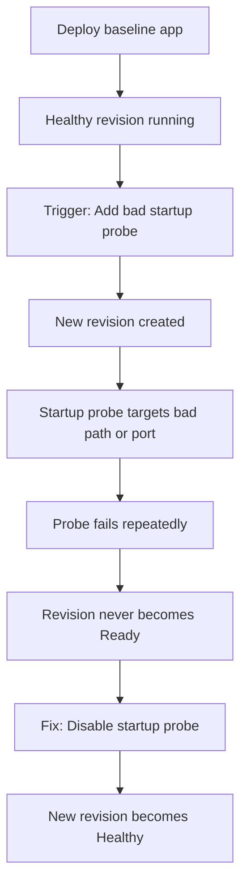
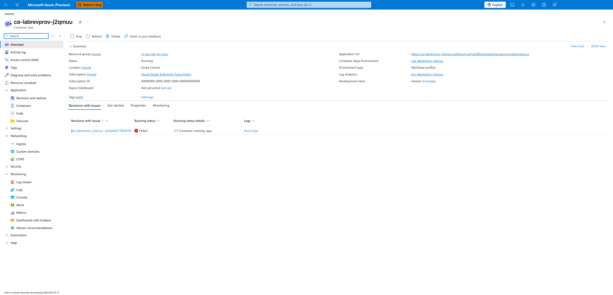
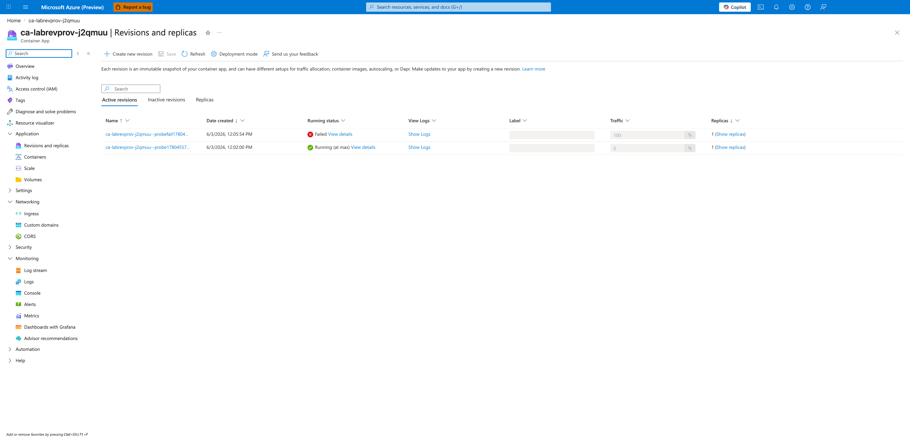
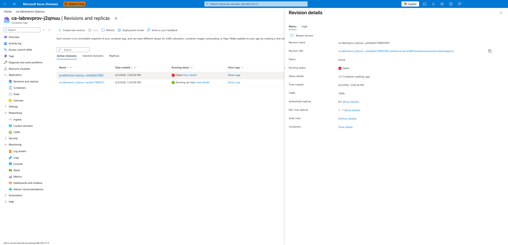
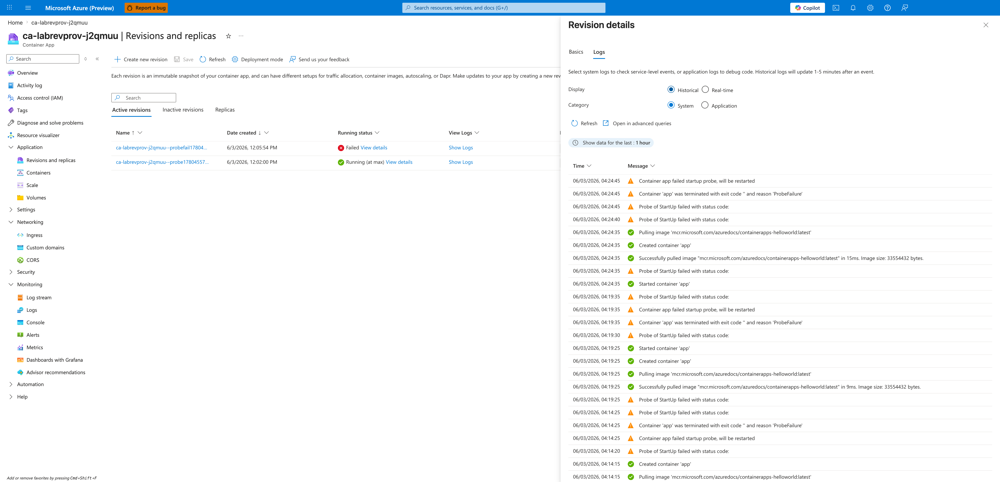
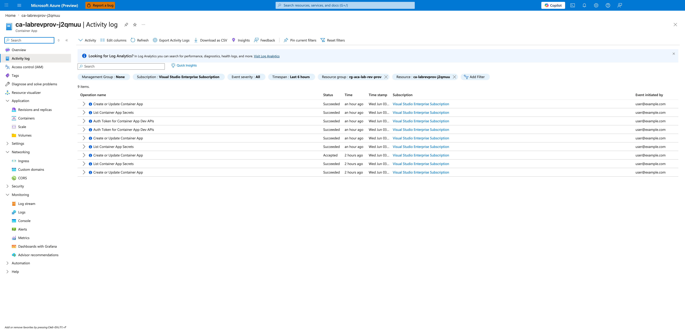
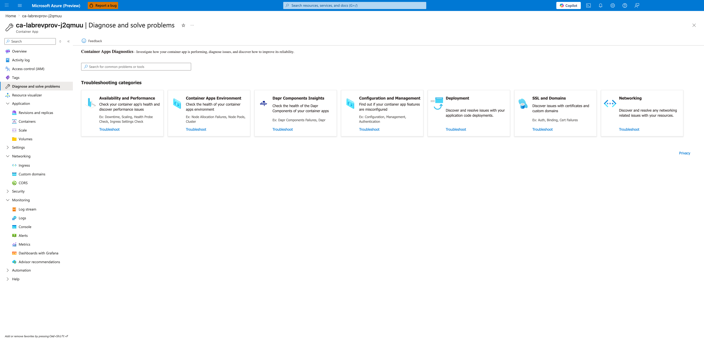

---
content_sources:
  diagrams:
  - id: architecture
    type: flowchart
    source: mslearn-adapted
    based_on:
    - https://learn.microsoft.com/azure/container-apps/health-probes
    - https://learn.microsoft.com/azure/container-apps/revisions
content_validation:
  status: verified
  last_reviewed: '2026-04-29'
  reviewer: ai-agent
  lab_validation:
    status: reproduced
    tested_date: 2026-05-01
    az_cli_version: 2.70.0
    notes: ProbeFailed + ContainerTerminated(ProbeFailure) + revision Failed confirmed
  core_claims:
  - claim: Azure Container Apps supports startup probes to check whether a containerized app has started successfully.
    source: https://learn.microsoft.com/azure/container-apps/health-probes
    verified: true
  - claim: In Azure Container Apps, revisions are immutable snapshots of a container app version.
    source: https://learn.microsoft.com/azure/container-apps/revisions
    verified: true
validation:
  az_cli:
    last_tested: null
    cli_version: null
    result: not_tested
  bicep:
    last_tested: null
    result: not_tested
---
# Revision Provisioning Failure Lab

Reproduce a revision that is created but never becomes ready due to startup probe misconfiguration.

## Lab Metadata

| Attribute | Value |
|---|---|
| Difficulty | Intermediate |
| Estimated Duration | 20-30 minutes |
| Tier | Consumption |
| Failure Mode | Revision created but startup probe fails repeatedly |
| Skills Practiced | Revision diagnostics, probe configuration, system log analysis |

## 1) Background

This lab demonstrates what happens when a revision is accepted by the Azure Container Apps control plane but never stabilizes. The trigger misconfigures a startup probe so that it cannot succeed — either by pointing it at a path the container never serves (returns 404) **or** by pointing it at a port nothing is listening on (connection refused). Either variant causes the probe to fail repeatedly. The revision exists and containers may start, but the platform marks the revision as unhealthy because it never passes the startup probe.

This pattern is distinct from API validation failures (which reject the update before creating a revision) and from the **app's own `ingress.targetPort`** mismatch (covered in [Ingress Target Port Mismatch](./ingress-target-port-mismatch.md)). Here the ingress target port is correct; only the **startup probe's** endpoint is misconfigured.

### Architecture

<!-- diagram-id: architecture -->


!!! warning "Revision created ≠ Revision ready"
    A revision can exist in the system but remain in a Failed or Degraded state if health probes never pass. Always check revision health state, not just existence.

!!! note "API validation vs runtime failure"
    Some configuration errors (like referencing a non-existent secret) are now rejected at the API layer with `ContainerAppSecretRefNotFound`. This lab focuses on errors that pass API validation but fail at runtime.

## 2) Hypothesis

**IF** a startup probe is configured to target an endpoint the container cannot satisfy (either a path that returns 404, or a port that refuses connection), **THEN** the revision will be created but never become ready, and system logs will show `ProbeFailed` events until the probe configuration is fixed.

| Variable | Control State | Experimental State |
|---|---|---|
| Startup probe endpoint | Not configured or valid path+port | `/nonexistent` (404) or `port 9999` (connection refused) |
| Latest revision health | `Healthy` | `Degraded` / `Failed` / `Unhealthy` |
| System logs | Normal startup events | `ProbeFailed` followed by `ContainerTerminated(ProbeFailure)` |
| Recovery path | No action required | Disable or correct startup probe and deploy new revision |

## 3) Runbook

### Deploy baseline infrastructure

Prerequisites:

- Azure CLI with the Container Apps extension
- Permissions to deploy Container Apps resources

```bash
az extension add --name containerapp --upgrade
az login

export RG="rg-aca-lab-revprov"
export LOCATION="koreacentral"

az group create --name "$RG" --location "$LOCATION"

az deployment group create \
    --name "lab-revprov" \
    --resource-group "$RG" \
    --template-file "./labs/revision-provisioning-failure/infra/main.bicep" \
    --parameters baseName="labrevprov"
```

| Command | Why it is used |
|---|---|
| `az extension add ...` | Installs or updates the Container Apps Azure CLI extension. |

Expected output:

- Resource group creation succeeds.
- Deployment completes with `Succeeded` state.

### Capture deployment outputs

```bash
export APP_NAME="$(az deployment group show \
    --resource-group "$RG" \
    --name "lab-revprov" \
    --query "properties.outputs.containerAppName.value" \
    --output tsv)"

export ENVIRONMENT_NAME="$(az deployment group show \
    --resource-group "$RG" \
    --name "lab-revprov" \
    --query "properties.outputs.environmentName.value" \
    --output tsv)"
```

### Verify baseline health

```bash
az containerapp revision list \
    --name "$APP_NAME" \
    --resource-group "$RG" \
    --output table
```

| Command | Why it is used |
|---|---|
| `az containerapp revision list ...` | Lists revisions so rollout state, traffic, and health can be verified. |

Expected output:

```text
CreatedTime                Active    Replicas    TrafficWeight    HealthState    ProvisioningState    Name
-------------------------  --------  ----------  ---------------  -------------  -------------------  ---------------------------
2026-04-06T12:00:00+00:00  True      1           100              Healthy        Provisioned          ca-labrevprov-xxxxx--abc123
```

### Trigger the failure

```bash
./labs/revision-provisioning-failure/trigger.sh
```

The trigger script adds a startup probe targeting a non-existent path:

```bash
az containerapp update \
    --name "$APP_NAME" \
    --resource-group "$RG" \
    --set-env-vars "PROBE_TRIGGER=$(date +%s)" \
    --container-name app \
    --startup-probe-path "/nonexistent-health-endpoint" \
    --startup-probe-port 80 \
    --startup-probe-failure-threshold 3 \
    --startup-probe-period-seconds 5
```

| Command | Why it is used |
|---|---|
| `az containerapp update ...` | Updates the existing Container App configuration without recreating the app. |

### Observe the failure

```bash
az containerapp revision list \
    --name "$APP_NAME" \
    --resource-group "$RG" \
    --output table
```

| Command | Why it is used |
|---|---|
| `az containerapp revision list ...` | Lists revisions so rollout state, traffic, and health can be verified. |

Expected output shows the new revision in a non-Healthy state:

```text
CreatedTime                Active    Replicas    TrafficWeight    HealthState    ProvisioningState    Name
-------------------------  --------  ----------  ---------------  -------------  -------------------  ---------------------------
2026-04-06T12:05:00+00:00  True      0           100              Degraded       Provisioned          ca-labrevprov-xxxxx--def456
2026-04-06T12:00:00+00:00  False     1           0                Healthy        Provisioned          ca-labrevprov-xxxxx--abc123
```

Check system logs for probe failures:

```bash
az containerapp logs show \
    --name "$APP_NAME" \
    --resource-group "$RG" \
    --type system \
    --tail 30
```

| Command | Why it is used |
|---|---|
| `az containerapp logs show ...` | Runs the Azure CLI operation required by the documented step. |

Expected log evidence:

```text
Reason_s             Log_s
-------------------  -----------------------------------------------------------------
ProbeFailed          Startup probe failed: HTTP probe failed with status code: 404
ContainerRestart     Container 'app' was restarted
```

### Fix the issue

Remove the bad probe configuration by deploying without the startup probe:

```bash
./labs/revision-provisioning-failure/verify.sh
```

The verify script removes the startup probe and confirms recovery:

```bash
az containerapp update \
    --name "$APP_NAME" \
    --resource-group "$RG" \
    --set-env-vars "PROBE_FIX=$(date +%s)" \
    --container-name app \
    --startup-probe-disabled
```

### Verify recovery

```bash
az containerapp revision list \
    --name "$APP_NAME" \
    --resource-group "$RG" \
    --output table
```

Expected output:

```text
HealthState    ProvisioningState
-------------  -------------------
Healthy        Provisioned
```

## 4) Experiment Log

| Step | Action | Expected | Actual | Pass/Fail |
|---|---|---|---|---|
| 1 | Deploy baseline infrastructure | Deployment succeeds | | |
| 2 | Verify baseline health | Revision is Healthy | | |
| 3 | Run `trigger.sh` | New revision created with bad probe | | |
| 4 | Check revision list | New revision is Degraded/Failed | | |
| 5 | Check system logs | ProbeFailed events visible | | |
| 6 | Run `verify.sh` | Probe removed, new revision created | | |
| 7 | Verify recovery | Latest revision is Healthy | | |

## Expected Evidence

### During failure

| Evidence Source | Expected State |
|---|---|
| `az containerapp revision list` | Latest revision shows `Degraded` or `Failed` |
| `az containerapp logs show --type system` | `ProbeFailed` with 404 status code |
| Replica count | 0 or unstable |

### After fix

| Evidence Source | Expected State |
|---|---|
| `az containerapp revision list` | Latest revision shows `Healthy` |
| System logs | Normal startup events |
| `./verify.sh` | PASS |

### Observed Evidence (Live Azure Test — 2026-05-01)

[Observed] Startup probe set to `httpGet.port=9999` (no listener) with `failureThreshold=3`.
`az containerapp revision list` showed:

```text
HealthState=Unhealthy  ProvisioningState=Failed  Name=ca-rev-provision--0000002
```

[Observed] System logs emitted:

```text
"Msg": "Probe of StartUp failed with status code: ", "Reason": "ProbeFailed"
"Msg": "Container ca-rev-provision failed startup probe, will be restarted", "Reason": "ProbeFailed"
"Msg": "Container 'ca-rev-provision' was terminated with exit code '' and reason 'ProbeFailure'", "Reason": "ContainerTerminated"
```

[Observed] The previous healthy revision (`ca-rev-provision--0000001`) remained active with
`HealthState=Healthy` and automatically received all traffic.

[Inferred] Azure Container Apps isolates probe failures to the new revision — the platform's
revision rollout safety mechanism prevents the failing revision from receiving production traffic.

Environment: `rg-aca-lab-test6` / `cae-lab6`, `koreacentral`, Consumption plan. App: `ca-rev-provision`, startup probe on port 9999 (app listens on 80).

### Observed Evidence (Portal Captures — 2026-06-03)

Reproduced in `rg-aca-lab-rev-prov` / `cae-labrevprov-j2qmuu`, `koreacentral`, Consumption plan. App: `ca-labrevprov-j2qmuu`. Startup probe set to `httpGet.path=/health`, **`port=9999`** (no listener — connection refused), `failureThreshold=3`, `periodSeconds=5`. Revision suffix `probefail1780455941`. The app's `ingress.targetPort` remained correct at 80; only the **startup probe's** port was set to 9999.

!!! note "Variant: connection-refused vs 404"
    The 2026-06-03 reproduction exercises the **wrong-port (connection refused)** variant of the hypothesis. The 2026-05-01 reproduction above exercised a closely related variant on a different environment. Both confirm the same failure mode — the revision is created but never becomes ready because the startup probe never succeeds — and the system-log signature (`ProbeFailed → ContainerTerminated(ProbeFailure)`) is identical.

!!! note "Traffic-state difference between the two reproductions"
    In the 2026-05-01 reproduction the previous healthy revision retained traffic (the standard single-revision-mode behavior when the new revision never reaches Healthy). In the 2026-06-03 reproduction, the **configured** traffic weight on the failed revision is 100% (visible in capture 02 / 03) — but with 0/1 replicas ready, no requests can actually be served. Both observations are valid: the routing layer reports configured intent independent of replica readiness, and the post-failure traffic split depends on the revision mode and the order in which configuration was applied.

[Observed] The Container App **Overview** blade surfaces the failing revision under the **Revisions with Issues** tab. The revision `probefail1780455941` is listed with **Running status = Failed** and **Running status details = 1/1 Container crashing: app**.



[Inferred] The first-class **Revisions with Issues** tab on the Overview blade is the fastest UI signal that a recently deployed revision did not stabilize — a customer-facing engineer should land here first.

[Observed] The **Revisions and replicas** blade shows two active revisions side by side: `probefail1780455941` carries **100% traffic** in a **Failed** state, while the previous revision `probe1780455700` is **Running** with **0% traffic**.



[Inferred] This is the failure signature unique to **runtime probe failure**: the revision is created and the routing layer is configured to send traffic to it, but no replicas ever pass the startup probe — so the traffic split is "live" while no replica can actually serve requests.

[Observed] The revision detail flyout for `probefail1780455941` shows **Status = Active**, **Running status = Failed**, **Status details = 1/1 Container crashing: app**, **Active/total replicas = 0/1**, and **Traffic = 100%**.



[Inferred] The `1/1 Container crashing: app` phrasing on the detail flyout is the most direct symptom-to-container mapping in the Portal — it points the investigator straight at the `app` container's startup behavior (probes, command, image) rather than at ingress or scaling.

[Observed] The **Logs** tab on the revision detail (System + Historical) shows the probe failure cascade in chronological order. The visible log lines include:

```text
Reason=ProbeFailed         Msg=Container app failed startup probe, will be restarted
Reason=ContainerTerminated Msg=Container 'app' was terminated with reason 'ProbeFailure'
```



[Strongly Suggested] The `ProbeFailed` → `ContainerTerminated(ProbeFailure)` sequence is the smoking gun for this lab's hypothesis — it directly attributes the container termination to probe failure rather than to OOM, exit code, image pull, or scaling decisions.

[Observed] The **Activity log** records control-plane events for the revision update: multiple `Create or Update Container App` entries with statuses including `Succeeded` and `Accepted`.



[Inferred] The presence of `Succeeded` entries for `Create or Update Container App` shows the **control-plane** accepted the revision update — there is no API-validation rejection here. Combined with the `Failed` revision state in capture 03 and the `ProbeFailed` logs in capture 04, this isolates the failure to the **data-plane** (the container's startup probe response), not to API validation or RBAC.

[Observed] The **Diagnose and solve problems** blade exposes the **Container Apps Diagnostics** entry point with categories including **Availability and Performance** (Health Probe Check, Ingress Settings Check), **Container Apps Environment**, **Dapr Components Insights**, **Configuration and Management**, **Deployment**, **SSL and Domains**, and **Networking**.



[Inferred] For customer-facing support, the **Availability and Performance → Health Probe Check** tile is the recommended single-click entry point for this failure mode — it consolidates revision health, probe configuration, and recent probe failures into one Microsoft-managed diagnostic panel.

## Portal Evidence Capture Guide

Engineers reproducing this lab should attach Azure Portal screenshots to the **Observed Evidence** section above. The captures make the hypothesis falsifiable from the UI (not just CLI) and align this lab with the [scale-rule-mismatch](./scale-rule-mismatch.md) template.

### Capture rules (apply to every screenshot)

- **Full-screen browser capture only.** Capture the entire browser window (URL bar, Portal chrome, breadcrumb). Do not crop to a single chart — reviewers must be able to verify the blade, filters, and time range.
- **PII must be replaced before commit, not blacked out.** Follow the PII Replacement Rules in [AGENTS.md](https://github.com/yeongseon/azure-container-apps-practical-guide/blob/main/AGENTS.md#portal-screenshot-capture-pii-replacement-rules) — use the helper at [`scripts/portal-capture-helpers.js`](https://github.com/yeongseon/azure-container-apps-practical-guide/blob/main/scripts/portal-capture-helpers.js) (or the inline `browser_run_code_unsafe` snippet) which substitutes GUIDs with `00000000-0000-0000-0000-000000000000`, masks the account avatar with Portal-blue (`#0078d4`), and rewrites tenant/employee identifiers. Solid black rectangles are forbidden — they read as visual leaks and break Portal continuity.

### PII verification checklist (verify the PNG before commit)

- [ ] No real subscription GUID anywhere (URL bar excluded — not part of PNG)
- [ ] No real tenant GUID, no `Microsoft Non-Production` badge in top-right
- [ ] No `ychoe@microsoft.com` or `Yeongseon Choe` anywhere
- [ ] Subscription name reads `Visual Studio Enterprise Subscription` (not `MCAPS-*`)
- [ ] Account avatar masked with solid **Portal-blue** (`#0078d4`), not black
- [ ] Real customer resource group / app / environment names renamed to lab defaults if reused

### Captures to take

The reproduction performed on 2026-06-03 (see **Observed Evidence (Portal Captures)** above) produced the following 6 canonical captures. Reuse the same filenames when re-reproducing on a fresh environment.

| # | When | Portal blade | View / filters | Filename |
|---|---|---|---|---|
| 1 | After the bad startup probe revision is created | Container App → Overview | **Revisions with Issues** tab showing the new failed revision | `01-overview-revisions-with-issues.png` |
| 2 | During diagnosis | Container App → Revisions and replicas | Active revisions grid showing failed vs healthy revisions side by side | `02-revisions-list-failed-vs-healthy.png` |
| 3 | During diagnosis | Container App → Revisions → failed revision | Revision detail flyout showing `Failed` / `Unhealthy` / `0/1 replicas` | `03-revision-detail-failed.png` |
| 4 | During diagnosis | Revision detail → Logs tab | System + Historical logs showing `ProbeFailed → ContainerTerminated(ProbeFailure)` cascade | `04-revision-detail-logs-tab.png` |
| 5 | During diagnosis | Container App → Activity log | `Create or Update Container App` events from the revision update | `05-activity-log.png` |
| 6 | During diagnosis | Container App → Diagnose and solve problems | Container Apps Diagnostics landing — Availability and Performance / Deployment categories | `06-diagnose-and-solve-problems.png` |

### Asset path

Save PNGs to `docs/assets/troubleshooting/revision-provisioning-failure/` (create the directory if it does not exist).

### Reference captures in Observed Evidence

Add image references inside the **Observed Evidence (Portal Captures)** subsection above, paired with `[Observed]` evidence tags. Example pattern (see the 2026-06-03 captures above for a full worked example):

```markdown
[Observed] The new revision was created, but it never became ready because the startup probe configuration kept failing:


```

## Clean Up

```bash
az group delete --name "$RG" --yes --no-wait
```

| Command | Why it is used |
|---|---|
| `az group delete ...` | Removes the lab resource group and its contained resources. |

## Related Playbook

- [Probe Failure and Slow Start](../playbooks/startup-and-provisioning/probe-failure-and-slow-start.md)

## See Also

- [Probe and Port Mismatch Lab](./probe-and-port-mismatch.md) — covers app-port mismatch; this lab covers startup-probe endpoint mismatch (bad path or bad port)
- [Container Start Failure Playbook](../playbooks/startup-and-provisioning/container-start-failure.md)

## Sources

- [Health probes in Azure Container Apps](https://learn.microsoft.com/azure/container-apps/health-probes)
- [Revisions in Azure Container Apps](https://learn.microsoft.com/azure/container-apps/revisions)
