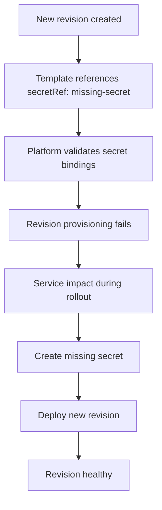

# Revision Provisioning Failure Lab

Reproduce provisioning failure when a container environment variable references a non-existent secret.

## Lab Metadata

| Attribute | Value |
|---|---|
| Difficulty | Intermediate |
| Estimated Duration | 20-30 minutes |
| Tier | Consumption |
| Failure Mode | Revision fails because `secretRef` points to `missing-secret` |
| Skills Practiced | Revision diagnostics, secret reference validation, recovery by secret creation |

## 1) Background

This lab introduces a configuration error where the app template uses `secretRef: missing-secret` for `REQUIRED_CONFIG`, but the secret does not exist. Azure Container Apps validates the secret binding during revision creation, so the failure happens at provisioning time before normal application startup completes.

This is a good example of a platform configuration failure that can look like a runtime issue unless you inspect revision state, system logs, and configured secrets first.

### Architecture



!!! warning "Configuration failures can mimic runtime issues"
    If provisioning fails before the container starts, focus on revision configuration and secrets rather than application code first.

!!! tip "Keep a secret naming standard"
    Consistent secret keys across environments reduce typo-driven failures during deployments.

## 2) Hypothesis

**IF** a Container App revision references a secret that does not exist, **THEN** the newest revision will fail provisioning until the missing secret is created and a new revision is rolled.

| Variable | Control State | Experimental State |
|---|---|---|
| `REQUIRED_CONFIG` binding | References an existing secret | References `missing-secret` that does not exist |
| Latest revision health | `Healthy` | Failed or non-healthy state |
| System logs | No secret reference errors | Missing secret or invalid env binding errors |
| Recovery path | No action required | Create secret and roll a new revision |

## 3) Runbook

### Deploy baseline infrastructure

Prerequisites:

- Azure CLI with the Container Apps extension
- Permissions to deploy Container Apps resources

```bash
az extension add --name containerapp --upgrade
az login

export RG="rg-aca-lab-revprov"
export LOCATION="koreacentral"

az group create --name "$RG" --location "$LOCATION"

az deployment group create \
    --name "lab-revprov" \
    --resource-group "$RG" \
    --template-file "./labs/revision-provisioning-failure/infra/main.bicep" \
    --parameters baseName="labrevprov"
```

Expected output:

- Resource group creation succeeds.
- Deployment operations complete with `Succeeded`.

### Capture deployment outputs

```bash
export APP_NAME="$(az deployment group show \
    --resource-group "$RG" \
    --name "lab-revprov" \
    --query "properties.outputs.containerAppName.value" \
    --output tsv)"

export ENVIRONMENT_NAME="$(az deployment group show \
    --resource-group "$RG" \
    --name "lab-revprov" \
    --query "properties.outputs.environmentName.value" \
    --output tsv)"
```

Expected output:

- Commands return no console output.
- Variables resolve to the deployed app and environment names.

### Trigger the failure

```bash
./labs/revision-provisioning-failure/trigger.sh
```

The trigger script waits for the failed revision and then runs:

```bash
az containerapp revision list --name "$APP_NAME" --resource-group "$RG" --output table
az containerapp logs show --name "$APP_NAME" --resource-group "$RG" --type system --tail 20
```

Expected output:

- The newest revision is not healthy.
- System logs show provisioning activity related to the broken configuration.

One expected diagnostic pattern showing provisioning failure:

```text
ContainerAppUpdate  → Updating containerApp: ca-myapp
RevisionCreation    → Creating new revision
RevisionFailed      → Revision failed to provision: secret 'missing-secret' not found
ContainerAppReady   → Degraded state reached
```

This pattern indicates the revision failed during provisioning because the referenced secret does not exist. The `RevisionFailed` event with a secret-related error confirms the hypothesis.

### Observe and diagnose the failing revision

```bash
az containerapp revision list \
    --name "$APP_NAME" \
    --resource-group "$RG" \
    --output table

az containerapp logs show \
    --name "$APP_NAME" \
    --resource-group "$RG" \
    --type system

az containerapp secret list \
    --name "$APP_NAME" \
    --resource-group "$RG" \
    --output table
```

Expected output:

- The latest revision health/provisioning state indicates failure.
- System logs contain evidence of a missing secret reference or invalid env binding.
- `missing-secret` is absent from the app secret list before the fix.

### Verify failure, apply the fix, and roll a new revision

```bash
./labs/revision-provisioning-failure/verify.sh
```

The verification script confirms the broken state first:

```text
PASS: Revision health is '<non-Healthy>' due to missing secret
```

It then performs the fix with these commands:

```bash
az containerapp secret set \
    --name "$APP_NAME" \
    --resource-group "$RG" \
    --secrets "missing-secret=resolved-value"

az containerapp update \
    --name "$APP_NAME" \
    --resource-group "$RG" \
    --set-env-vars "REVISION_FIX_TOKEN=$(date +%s)"
```

You can also run the equivalent manual update from the original walkthrough:

```bash
az containerapp secret set \
    --name "$APP_NAME" \
    --resource-group "$RG" \
    --secrets "missing-secret=demo-safe-value"

az containerapp update \
    --name "$APP_NAME" \
    --resource-group "$RG" \
    --set-env-vars "REQUIRED_CONFIG=secretref:missing-secret"
```

Expected output:

- Secret creation succeeds.
- A new revision is created after the update.

### Verify recovery

```bash
./labs/revision-provisioning-failure/verify.sh

az containerapp revision list \
    --name "$APP_NAME" \
    --resource-group "$RG" \
    --output table
```

Expected output:

- The latest revision becomes `Healthy` after the secret is created and the new revision is deployed.
- The verification script prints the post-fix health state.

## 4) Experiment Log

| Step | Action | Expected | Actual | Pass/Fail |
|---|---|---|---|---|
| 1 | Deploy baseline infrastructure | Deployment succeeds | | |
| 2 | Capture app outputs | App and environment names resolved | | |
| 3 | Run `trigger.sh` | Latest revision shows failed provisioning evidence | | |
| 4 | Review revision list and system logs | Missing secret symptoms visible | | |
| 5 | Run `verify.sh` before fix | Script confirms non-healthy latest revision | | |
| 6 | Create `missing-secret` and roll new revision | Secret update succeeds | | |
| 7 | Re-check revision health | Latest revision becomes healthy | | |

## Expected Evidence

### During failure

| Evidence Source | Expected State |
|---|---|
| `az containerapp revision list` | Latest revision is not healthy |
| `az containerapp logs show --type system` | Missing secret reference or env binding error evidence |
| `az containerapp secret list` | `missing-secret` absent |
| `./labs/revision-provisioning-failure/verify.sh` | PASS for expected failure state |

### After fix

| Evidence Source | Expected State |
|---|---|
| `az containerapp secret list` | `missing-secret` present |
| `az containerapp revision list` | Latest revision is `Healthy` |
| Verification script output | Post-fix health state reported successfully |

## Clean Up

```bash
az group delete --name "$RG" --yes --no-wait
```

## Related Playbook

- [Revision Provisioning Failure Playbook](../playbooks/startup-and-provisioning/revision-provisioning-failure.md)

## See Also

- [Container Start Failure Playbook](../playbooks/startup-and-provisioning/container-start-failure.md)
- [Traffic Routing and Canary Failure Lab](./traffic-routing-canary.md)

## Sources

- [Manage secrets in Azure Container Apps](https://learn.microsoft.com/azure/container-apps/manage-secrets)
- [Revisions in Azure Container Apps](https://learn.microsoft.com/azure/container-apps/revisions)
