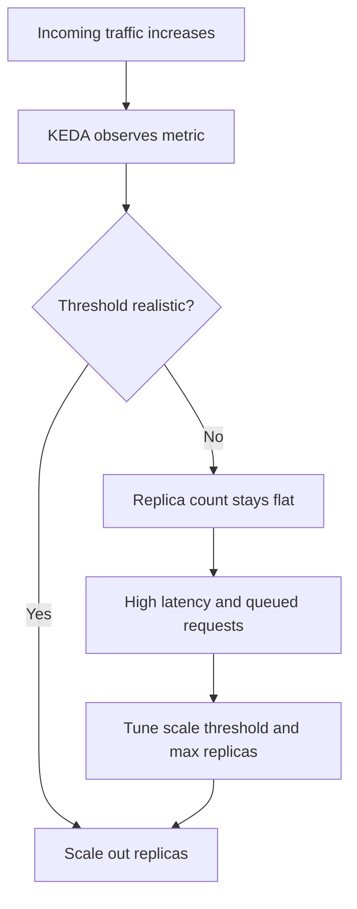

# Scale Rule Mismatch Lab

Diagnose non-scaling behavior caused by unrealistic HTTP concurrency thresholds, then tune scale settings.

## Scenario

- **Difficulty**: Intermediate
- **Estimated duration**: 25-35 minutes
- **Failure mode**: sustained load does not increase replica count because scale rule threshold is too high

## Prerequisites

- Azure CLI with Container Apps extension
- `hey` load generator (optional; script falls back to `curl` loop)

```bash
az extension add --name containerapp --upgrade
az login
```

## Quick Start

```bash
export RG="rg-aca-lab-scale"
export LOCATION="koreacentral"

az group create --name "$RG" --location "$LOCATION"
az deployment group create --name "lab-scale" --resource-group "$RG" --template-file ./labs/scale-rule-mismatch/infra/main.bicep --parameters baseName="labscale"

export APP_NAME="$(az deployment group show --resource-group "$RG" --name "lab-scale" --query \"properties.outputs.containerAppName.value\" --output tsv)"
export ACR_NAME="$(az deployment group show --resource-group "$RG" --name "lab-scale" --query \"properties.outputs.containerRegistryName.value\" --output tsv)"

cd labs/scale-rule-mismatch
./trigger.sh
./verify.sh
./cleanup.sh
```

## Expected Diagnostic Output Pattern

```text
Reason_s             Type_s
-------------------  --------
KEDAScalersStarted   Normal
```

Replica baseline used during verification:

```text
ca-myapp--0000001-646779b4c5-bhc2v  Running
```

## Key Takeaways

- Replica behavior depends heavily on matching threshold values to real traffic patterns.
- `maxReplicas` can silently cap expected scaling even with valid rules.
- Validate with both load generation and replica/system-log checks.

## See Also

- [HTTP Scaling Not Triggering Playbook](../playbooks/scaling-and-runtime/http-scaling-not-triggering.md)
- [Event Scaler Mismatch Playbook](../playbooks/scaling-and-runtime/event-scaler-mismatch.md)

## Scenario Setup

This lab deploys an app with intentionally unrealistic HTTP scale thresholds. Even under sustained load, the scaler does not add replicas quickly enough, reproducing a common “autoscaling not working” incident.



!!! warning "Do not validate scaling with one request"
    Scaling decisions rely on sustained signal windows. Single-shot tests can produce false confidence.

!!! tip "Check max replicas before deep debugging"
    A low `maxReplicas` can look like a scaler failure even when rules are correct.

## Step-by-Step Walkthrough

1. **Create resource group and deploy the lab**

   ```bash
   export RG="rg-aca-lab-scale"
   export LOCATION="koreacentral"
   az group create --name "$RG" --location "$LOCATION"

   az deployment group create \
     --name "lab-scale" \
     --resource-group "$RG" \
     --template-file "./labs/scale-rule-mismatch/infra/main.bicep" \
     --parameters baseName="labscale"
   ```

   Expected output pattern: deployment `Succeeded`.

2. **Capture deployment outputs**

   ```bash
   export APP_NAME="$(az deployment group show --resource-group "$RG" --name "lab-scale" --query "properties.outputs.containerAppName.value" --output tsv)"
   export ACR_NAME="$(az deployment group show --resource-group "$RG" --name "lab-scale" --query "properties.outputs.containerRegistryName.value" --output tsv)"
   export ENVIRONMENT_NAME="$(az deployment group show --resource-group "$RG" --name "lab-scale" --query "properties.outputs.containerAppsEnvironmentName.value" --output tsv)"
   ```

   Expected output: no output.

3. **Record baseline replica count**

   ```bash
   az containerapp replica list --name "$APP_NAME" --resource-group "$RG" --output table
   ```

   Expected output pattern: one running replica at idle baseline.

4. **Generate sustained load and trigger mismatch**

   ```bash
   ./labs/scale-rule-mismatch/trigger.sh
   az containerapp replica list --name "$APP_NAME" --resource-group "$RG" --output table
   ```

   Expected output pattern: replicas remain lower than expected despite load.

5. **Inspect scaling-related events**

   ```bash
   az containerapp logs show \
     --name "$APP_NAME" \
     --resource-group "$RG" \
     --type system
   ```

   Expected evidence: scaler started but no meaningful scale-out decisions due to threshold mismatch.

6. **Apply tuning fix**

   ```bash
   az containerapp update \
     --name "$APP_NAME" \
     --resource-group "$RG" \
     --min-replicas 1 \
     --max-replicas 10
   ```

   Then apply corrected scale-rule settings from your lab script (or YAML) and re-run load.

   Expected output pattern: update succeeds and new revision becomes healthy.

7. **Verify post-fix scaling behavior**

   ```bash
   ./labs/scale-rule-mismatch/verify.sh
   az containerapp replica list --name "$APP_NAME" --resource-group "$RG" --output table
   ```

   Expected output: replica count increases under load and returns toward baseline when load ends.

## Symptoms / Cause / Fix Matrix

| What you see | What is happening | How to fix |
|---|---|---|
| Load rises but replicas stay at 1 | Threshold too high for real request pattern | Lower threshold to match realistic traffic |
| Scale-out starts then caps early | `maxReplicas` too low | Increase `maxReplicas` for expected peak |
| Scaling appears delayed | Observation window too short | Run sustained load for longer interval |
| High latency at moderate traffic | Under-provisioned CPU/memory and conservative scaling | Tune resources and scaling together |

## Resolution Verification Checklist

1. Under steady load, replica count increases above baseline.
2. Response latency improves compared to pre-fix run.
3. System logs no longer show repeated mismatch symptoms.
4. Replica count scales down when load stops.

## Sources

- [Microsoft Learn: Set scaling rules in Azure Container Apps](https://learn.microsoft.com/azure/container-apps/scale-app)
- [KEDA documentation](https://keda.sh/docs/latest/)
